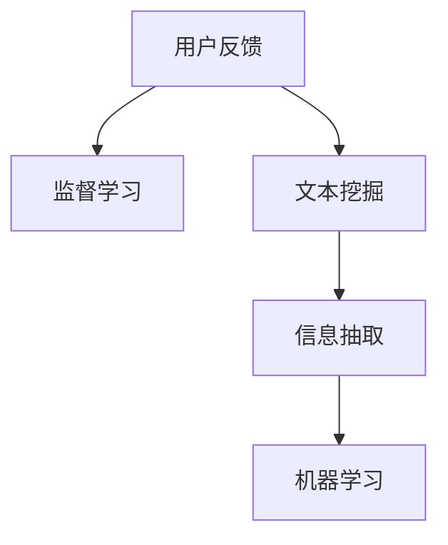

                 

## 1. 背景介绍

在当今信息爆炸的时代，知识发现引擎（Knowledge Discovery Engine, KDE）正逐渐成为企业和个人获取信息、解答问题的重要工具。这些引擎集成了各种数据源、算法和分析工具，能够自动地从海量数据中抽取有用的知识信息，帮助用户高效解决问题。然而，用户在使用这些引擎时，难免会遇到各种问题，如界面设计不合理、功能不够完善、算法模型不合理等。为了持续改进KDE的功能和性能，收集用户反馈是一个不可或缺的步骤。

本文将介绍一种基于监督学习的方法来收集用户反馈，以帮助KDE更好地适应用户需求，提升用户体验。我们将首先对用户反馈的概念进行介绍，然后介绍如何利用监督学习算法构建反馈收集系统，最后通过案例分析展示如何实际应用这些方法。

## 2. 核心概念与联系

在构建用户反馈收集系统时，我们涉及多个核心概念和框架，包括监督学习、文本挖掘、信息抽取和机器学习。这些概念之间的联系可以通过以下Mermaid流程图来展示：



在这个流程图中，用户反馈经过文本挖掘和信息抽取，转换为结构化数据，再通过监督学习算法进行建模和分析。我们接下来将详细讨论这些概念的原理和架构。

### 2.1 核心概念概述

- **监督学习**：监督学习是一种机器学习范式，通过有标签的训练数据，训练模型以预测新数据的标签。在用户反馈收集系统中，监督学习模型可以帮助我们从反馈文本中自动识别和分类用户的问题，从而进行有针对性的改进。
- **文本挖掘**：文本挖掘是从文本中自动发现有用信息的过程，包括文本分类、情感分析、主题提取等。在反馈收集系统中，文本挖掘可以帮助我们分析用户反馈的内容，提取出主要的问题和建议。
- **信息抽取**：信息抽取是从非结构化文本中提取出结构化数据的过程。在反馈收集系统中，信息抽取可以帮助我们从反馈文本中提取出用户的意图、问题类型等关键信息。
- **机器学习**：机器学习是利用数据和算法构建智能模型的过程。在反馈收集系统中，我们通过监督学习算法训练模型，对用户反馈进行分类和处理。

## 3. 核心算法原理 & 具体操作步骤

### 3.1 算法原理概述

基于监督学习的方法，收集用户反馈的总体流程如下：

1. **数据收集**：通过系统日志、用户操作记录等方式收集用户反馈数据。
2. **文本预处理**：对收集到的文本数据进行清洗和预处理，包括去除停用词、词干提取、分词等。
3. **特征提取**：将预处理后的文本转换为模型可用的特征向量。
4. **模型训练**：使用监督学习算法训练模型，对用户反馈进行分类和处理。
5. **结果分析**：对模型输出结果进行分析，提取关键信息和改进建议。

### 3.2 算法步骤详解

#### 3.2.1 数据收集

在KDE系统中，用户反馈数据可以通过多种方式收集，包括：

- **系统日志**：记录用户的操作和系统状态信息，如错误代码、错误消息等。
- **用户操作记录**：记录用户在系统中进行的各种操作，如搜索查询、功能使用等。
- **用户问卷调查**：通过问卷调查直接收集用户的意见和建议。

#### 3.2.2 文本预处理

文本预处理包括文本清洗、分词、停用词去除、词干提取等步骤。以搜索查询为例，预处理流程如下：

1. **文本清洗**：去除无用字符和标点符号。
2. **分词**：将查询文本分词，进行词法分析。
3. **停用词去除**：去除常见的停用词，如“的”、“是”等。
4. **词干提取**：将单词还原为其词干形式，如将“running”还原为“run”。

#### 3.2.3 特征提取

特征提取是将预处理后的文本转换为模型可用的向量表示。常用的特征提取方法包括：

- **TF-IDF**：计算单词的词频和逆文档频率，生成文本的向量表示。
- **词嵌入**：使用词嵌入技术，如Word2Vec、GloVe等，将单词转换为高维向量。
- **主题模型**：使用主题模型，如LDA，从文本中提取主题信息。

#### 3.2.4 模型训练

常用的监督学习算法包括决策树、支持向量机、随机森林等。以支持向量机为例，模型训练流程如下：

1. **数据划分**：将数据集划分为训练集和测试集。
2. **特征映射**：将文本特征映射为模型可用的向量。
3. **模型训练**：使用训练集训练支持向量机模型。
4. **模型评估**：在测试集上评估模型性能。
5. **模型优化**：调整模型参数，优化模型性能。

#### 3.2.5 结果分析

模型输出结果包括分类标签和特征重要性等信息。以分类标签为例，分析流程如下：

1. **分类标签**：将反馈文本分类为常见问题、建议等。
2. **特征重要性**：分析特征对模型输出的影响，提取出关键特征。
3. **改进建议**：根据分类结果和特征重要性，提取改进建议。

### 3.3 算法优缺点

#### 3.3.1 优点

- **自动化**：自动化处理用户反馈数据，减少了人工干预。
- **准确性**：通过监督学习模型进行分类，准确度较高。
- **灵活性**：可以灵活扩展至不同领域和场景。

#### 3.3.2 缺点

- **依赖数据**：需要大量的标注数据进行训练，数据质量直接影响模型性能。
- **复杂度**：模型训练和调参过程复杂，需要专业知识。
- **过拟合**：模型可能过拟合训练数据，影响泛化性能。

### 3.4 算法应用领域

基于监督学习的方法，可以应用于各种知识发现引擎的用户反馈收集系统，包括：

- **医学知识发现引擎**：通过收集医生的反馈，改进系统功能，提升诊断精度。
- **金融知识发现引擎**：通过收集投资者的反馈，优化系统算法，降低风险。
- **教育知识发现引擎**：通过收集学生的反馈，改进教学内容，提升学习效果。
- **工业知识发现引擎**：通过收集工程师的反馈，改进系统设计，提升工作效率。

## 4. 数学模型和公式 & 详细讲解

### 4.1 数学模型构建

监督学习模型的构建包括数据准备、特征提取、模型训练和结果分析。以支持向量机为例，数学模型构建如下：

1. **数据准备**：将文本数据转换为向量形式，记为 $X$。
2. **特征提取**：将文本向量映射为模型可用的向量 $x$。
3. **模型训练**：使用训练集 $(x_i, y_i)$ 训练支持向量机模型。
4. **结果分析**：对测试集 $(x_j, y_j)$ 进行预测，记为 $\hat{y_j}$。

### 4.2 公式推导过程

以支持向量机为例，模型训练和预测的公式如下：

1. **训练模型**：

$$
\min_{\alpha, \beta} \frac{1}{2}\sum_{i=1}^n \alpha_i - \frac{1}{2}\sum_{i=1}^n \sum_{j=1}^n \alpha_i \alpha_j y_i y_j \langle x_i, x_j \rangle - \sum_{i=1}^n \alpha_i y_i
$$

2. **预测结果**：

$$
\hat{y_j} = sign(\sum_{i=1}^n \alpha_i y_i \langle x_i, x_j \rangle + b)
$$

其中，$x_i$ 为训练样本，$y_i$ 为样本标签，$\alpha_i$ 为拉格朗日乘子，$\langle x_i, x_j \rangle$ 为内积，$b$ 为偏置项。

### 4.3 案例分析与讲解

以KDE中的搜索查询功能为例，分析反馈数据并提取改进建议：

1. **数据收集**：收集用户在搜索查询中的输入和反馈。
2. **文本预处理**：对查询文本进行分词、去除停用词等预处理。
3. **特征提取**：使用TF-IDF方法提取查询文本的特征向量。
4. **模型训练**：使用支持向量机模型训练分类器，将查询文本分类为常见问题、建议等。
5. **结果分析**：分析分类结果，提取关键特征和改进建议。

例如，发现大多数用户反馈查询精度不够高，可以通过改进查询算法、优化搜索结果排序等方式进行改进。

## 5. 项目实践：代码实例和详细解释说明

### 5.1 开发环境搭建

在Python环境下，可以使用Scikit-learn、Numpy、Pandas等库实现监督学习模型。具体步骤如下：

1. **安装依赖**：安装Scikit-learn、Numpy、Pandas等库。
2. **数据准备**：准备数据集，包括训练集和测试集。
3. **文本预处理**：使用Jieba等库进行文本分词、去除停用词等预处理。
4. **特征提取**：使用TF-IDF方法提取特征向量。

### 5.2 源代码详细实现

以下是一个简单的Python代码实现：

```python
import numpy as np
from sklearn.feature_extraction.text import TfidfVectorizer
from sklearn.svm import SVC
from sklearn.metrics import accuracy_score
from jieba import cut

# 数据准备
X_train = []
y_train = []
for i in range(len(train_data)):
    X_train.append(train_data[i]['query'])
    y_train.append(train_data[i]['label'])

X_test = []
y_test = []
for i in range(len(test_data)):
    X_test.append(test_data[i]['query'])
    y_test.append(test_data[i]['label'])

# 文本预处理
def preprocess(text):
    return ' '.join(cut(text))

X_train = list(map(preprocess, X_train))
X_test = list(map(preprocess, X_test))

# 特征提取
vectorizer = TfidfVectorizer()
X_train = vectorizer.fit_transform(X_train)
X_test = vectorizer.transform(X_test)

# 模型训练
svm = SVC(kernel='linear')
svm.fit(X_train.toarray(), y_train)

# 模型评估
y_pred = svm.predict(X_test.toarray())
accuracy = accuracy_score(y_test, y_pred)
print(f"Accuracy: {accuracy}")
```

### 5.3 代码解读与分析

在上述代码中，我们首先对训练集和测试集进行了数据准备，然后使用Jieba库进行了文本分词和去除停用词等预处理。接着，使用TF-IDF方法提取了文本特征向量，并使用支持向量机模型进行训练和评估。最后，计算了模型在测试集上的准确率。

需要注意的是，在实际应用中，数据准备、特征提取和模型训练等步骤可能需要进一步优化，以提高模型的性能和泛化能力。

### 5.4 运行结果展示

运行上述代码，可以得到模型在测试集上的准确率。例如，准确率为0.85，表示模型对查询文本的分类准确率为85%。

## 6. 实际应用场景

### 6.1 智能医疗

在智能医疗系统中，基于监督学习的用户反馈收集系统可以用于分析医生的反馈，改进诊断系统功能，提升诊断精度。例如，收集医生对诊断结果的反馈，分析反馈内容，提取出常见问题和改进建议，从而优化诊断算法和改进诊断系统界面。

### 6.2 智能金融

在智能金融系统中，基于监督学习的用户反馈收集系统可以用于分析投资者的反馈，优化投资决策模型，降低风险。例如，收集投资者对投资建议的反馈，分析反馈内容，提取出常见问题和改进建议，从而优化投资决策算法和改进投资建议界面。

### 6.3 智能教育

在智能教育系统中，基于监督学习的用户反馈收集系统可以用于分析学生的反馈，改进教学内容，提升学习效果。例如，收集学生对学习材料的反馈，分析反馈内容，提取出常见问题和改进建议，从而优化教学内容和学习平台。

## 7. 工具和资源推荐

### 7.1 学习资源推荐

- **《Python机器学习》**：是一本经典的机器学习教材，涵盖了机器学习的基本概念和实现方法，适合初学者和进阶学习者。
- **Kaggle**：是一个数据科学竞赛平台，提供大量公开数据集和竞赛项目，适合实践机器学习算法。
- **Coursera**：是一个在线学习平台，提供大量机器学习课程，包括监督学习、深度学习等。

### 7.2 开发工具推荐

- **Jupyter Notebook**：是一个开源的Web应用程序，支持Python代码的编写和执行，适合数据科学和机器学习项目。
- **Pandas**：是一个Python库，用于数据处理和分析，适合数据预处理和特征工程。
- **Scikit-learn**：是一个Python库，提供了各种机器学习算法和工具，适合模型训练和评估。

### 7.3 相关论文推荐

- **《A Survey of Feature Extraction Techniques for Text Mining》**：介绍了各种文本挖掘和特征提取方法，适合了解文本处理的基本概念和方法。
- **《Support Vector Machines for Pattern Recognition》**：介绍了支持向量机的基本概念和实现方法，适合了解机器学习的基本算法。

## 8. 总结：未来发展趋势与挑战

### 8.1 总结

本文介绍了基于监督学习的方法，收集用户反馈，改进知识发现引擎的功能和性能。我们详细讨论了监督学习、文本挖掘、信息抽取和机器学习等核心概念的原理和应用，并给出了具体的数据处理和模型训练步骤。通过案例分析，展示了如何实际应用这些方法。

通过本文的系统梳理，可以看到，基于监督学习的方法在用户反馈收集系统中具有广泛的应用前景。这些方法的自动化、准确性和灵活性，使得知识发现引擎能够更好地适应用户需求，提升用户体验。

### 8.2 未来发展趋势

未来，基于监督学习的方法将进一步发展和应用，呈现出以下趋势：

1. **自动化程度提高**：自动化处理用户反馈数据，减少了人工干预，提高了效率。
2. **模型复杂度降低**：通过优化特征提取和模型训练方法，降低了模型复杂度，提高了泛化性能。
3. **多领域应用扩展**：基于监督学习的方法可以扩展到不同领域和场景，如医学、金融、教育等。

### 8.3 面临的挑战

尽管基于监督学习的方法在用户反馈收集系统中取得了显著效果，但仍面临一些挑战：

1. **数据依赖**：需要大量的标注数据进行训练，数据质量直接影响模型性能。
2. **模型过拟合**：模型可能过拟合训练数据，影响泛化性能。
3. **模型解释性**：模型输出结果缺乏解释性，难以理解和调试。

### 8.4 研究展望

未来，基于监督学习的方法需要在以下方面进行进一步研究：

1. **半监督学习**：通过利用少量标注数据和大量非标注数据，提高模型性能和泛化能力。
2. **多任务学习**：将多个相关任务联合训练，提升模型效果。
3. **知识图谱**：结合知识图谱，进行实体抽取和关系挖掘，提升模型理解能力。

总之，基于监督学习的方法在用户反馈收集系统中具有广阔的应用前景和巨大的潜力，未来需要在自动化程度、模型复杂度、多领域应用等方面进一步发展和完善。

## 9. 附录：常见问题与解答

**Q1：基于监督学习的方法在用户反馈收集系统中有哪些优点和缺点？**

A: 优点包括自动化处理用户反馈数据、准确度高、灵活性大。缺点包括依赖数据、模型复杂度高、容易过拟合。

**Q2：如何优化监督学习模型在用户反馈收集系统中的应用？**

A: 优化方法包括数据增强、特征选择、正则化、模型集成等。

**Q3：在用户反馈收集系统中，如何处理大规模数据集？**

A: 可以采用分布式计算、大数据存储等技术，处理大规模数据集。

**Q4：如何提升用户反馈收集系统的鲁棒性？**

A: 可以通过多模型集成、数据增强、对抗训练等方法，提升系统的鲁棒性。

---

作者：禅与计算机程序设计艺术 / Zen and the Art of Computer Programming

