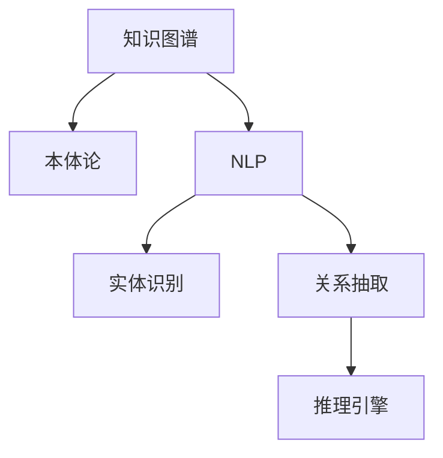

                 

# 知识发现引擎的知识图谱构建

> 关键词：知识图谱，知识发现引擎，自然语言处理(NLP)，语义网络，本体论，实体识别，关系抽取，推理引擎，人工智能，大数据

## 1. 背景介绍

### 1.1 问题由来
随着互联网信息爆炸式的增长，如何高效地从海量数据中提取结构化知识，成为信息时代的一大挑战。传统的基于关系数据库的查询方式已难以满足现代信息需求。于是，知识图谱作为一种高效的知识表示和推理技术，逐渐成为当前研究的热点。

知识图谱由实体、关系、属性组成，呈现为一种语义化的图结构。它可以被用于信息检索、个性化推荐、自然语言处理等众多领域。尤其是在智能问答、决策支持等需要精确、高效、结构化信息的任务中，知识图谱的应用极为关键。

传统知识图谱构建需要大量人工标注，耗时耗力。随着自然语言处理(NLP)技术的进步，自动构建知识图谱成为可能。利用NLP技术，可以将非结构化的文本数据自动化地转化为结构化的知识图谱，实现数据驱动的知识发现。

### 1.2 问题核心关键点
知识图谱构建的核心在于将文本数据映射为实体、关系、属性的关系型数据结构。主要包含以下关键步骤：

1. 实体识别(Entity Recognition)：识别出文本中的实体，包括人名、地名、组织名等。
2. 关系抽取(Relation Extraction)：从文本中抽取实体之间的关系，如"出生于"、"担任"等。
3. 知识融合(Knowledge Fusion)：将不同数据源的实体和关系进行合并、去重，形成一致的知识图谱。
4. 推理验证(Reasoning Verification)：使用推理引擎验证知识图谱的一致性和准确性，避免错误。

这些步骤均涉及到复杂的自然语言处理技术，需要综合利用分词、命名实体识别、句法分析、语义理解等多项技术手段。

### 1.3 问题研究意义
自动构建知识图谱对于知识发现和信息抽取具有重要意义：

1. 提升数据利用效率。知识图谱提供了一种结构化的信息组织方式，便于机器高效地检索、分析和利用知识。
2. 促进跨领域知识融合。知识图谱可以将不同领域的数据进行整合，形成更为全面的知识体系。
3. 增强智能决策能力。知识图谱为智能问答、决策支持等应用提供更为精确的信息基础，提升系统的智能化水平。
4. 推动学科交叉发展。自动构建知识图谱的技术需要多学科知识融合，可推动计算机科学、数据科学、认知科学等学科的发展。

## 2. 核心概念与联系

### 2.1 核心概念概述

为更好地理解知识发现引擎中的知识图谱构建技术，本节将介绍几个核心概念：

- 知识图谱(Knowledge Graph)：由实体节点和关系边构成的语义网络，用于表示和查询知识。知识图谱的核心价值在于其结构化和语义化的特点。
- 自然语言处理(NLP)：研究如何使计算机能够理解、处理和生成人类语言的技术。NLP是知识图谱构建的重要基础。
- 本体论(Ontology)：一种形式化的知识表示方法，用于定义知识图谱中实体的属性、关系等语义信息。本体论为知识图谱的构建提供了一个统一的语义框架。
- 实体识别(Entity Recognition)：从文本中识别出具有特定意义的实体，如人名、地名、组织名等。实体识别的目标是实现从文本向知识的映射。
- 关系抽取(Relation Extraction)：从文本中抽取出实体之间的关系，如"出生于"、"担任"等。关系抽取是将实体关联化，构建知识图谱的重要步骤。
- 推理引擎(Reasoning Engine)：使用逻辑推理算法，对知识图谱进行验证、更新和修正，保证知识的准确性和一致性。推理引擎是知识图谱动态维护的关键。

这些概念之间的逻辑关系可以通过以下Mermaid流程图来展示：



这个流程图展示了知识图谱构建的基本流程：

1. 知识图谱建立在本体论的基础上，提供知识表示的语义框架。
2. NLP技术对文本进行处理，实现实体识别和关系抽取。
3. 抽取出的实体和关系构成本体知识图谱。
4. 推理引擎对知识图谱进行验证和更新，保证知识的准确性和一致性。

## 3. 核心算法原理 & 具体操作步骤
### 3.1 算法原理概述

知识图谱的自动构建，通常基于自然语言处理技术，将非结构化的文本数据转化为结构化的知识表示。其核心算法原理可以总结如下：

1. 文本预处理：通过分词、词性标注、句法分析等步骤，将原始文本转换为易于处理的格式。
2. 实体识别：使用命名实体识别(NER)模型，识别出文本中的实体。
3. 关系抽取：通过依存句法分析、模式匹配等方法，从文本中抽取实体之间的关系。
4. 知识融合：将不同数据源的知识图谱进行合并，去除重复和矛盾的信息。
5. 推理验证：使用推理引擎验证知识图谱的正确性，修正其中的错误。

这些步骤共同构成了知识图谱构建的核心算法。具体实施过程中，每个步骤均需要利用高级的NLP技术和人工智能方法，如图表示征、深度学习、逻辑推理等。

### 3.2 算法步骤详解

以下是知识图谱构建的具体操作步骤：

**Step 1: 数据预处理**
- 对原始文本进行清洗，去除噪声和无用信息。
- 对文本进行分词、词性标注、句法分析，转换成结构化的句子表示。

**Step 2: 实体识别**
- 使用预训练的NER模型对文本进行扫描，识别出人名、地名、组织名等实体。
- 对实体进行去重、标准化，形成统一的实体库。

**Step 3: 关系抽取**
- 对识别出的实体进行依存句法分析，抽取它们之间的语义关系。
- 使用模式匹配、规则库等方法，进一步确认和增强关系抽取的准确性。

**Step 4: 知识融合**
- 将不同数据源的实体和关系进行合并，解决实体歧义和关系冲突。
- 引入外部知识库、逻辑规则等进行校验，确保知识的一致性和准确性。

**Step 5: 推理验证**
- 使用推理引擎对知识图谱进行验证，检测其中的逻辑错误和矛盾。
- 根据验证结果修正知识图谱，确保知识图谱的正确性和完整性。

### 3.3 算法优缺点

知识图谱自动构建的算法具有以下优点：

1. 高效自动化。自动构建知识图谱可以显著降低人工标注成本，提高数据利用效率。
2. 数据泛化能力强。自动构建方法可以处理不同领域的文本数据，构建具有广泛应用价值的知识图谱。
3. 动态更新。自动构建方法可以通过在线增量更新，保证知识图谱的实时性。

但同时也存在以下缺点：

1. 准确率依赖数据质量。自动构建方法需要高质量的文本数据和标注数据，否则可能引入噪声和错误。
2. 算法复杂度高。知识图谱构建涉及到自然语言处理和逻辑推理等复杂算法，计算复杂度较高。
3. 难以处理歧义和矛盾。自动构建方法难以完美处理文本中的歧义和矛盾信息，仍需要人工干预。
4. 知识图谱构建深度和广度有限。自动构建方法构建的知识图谱深度和广度仍受限于数据规模和质量。

### 3.4 算法应用领域

知识图谱构建技术广泛应用于以下领域：

1. 智能问答系统：利用知识图谱提供丰富的语义信息，实现问答、推荐、对话等智能交互。
2. 搜索引擎：在搜索结果中嵌入知识图谱信息，提升搜索结果的准确性和相关性。
3. 推荐系统：基于知识图谱推荐个性化的产品和服务，提升用户体验。
4. 医疗健康：构建医疗领域知识图谱，辅助医生进行诊断和治疗决策。
5. 金融领域：构建金融领域知识图谱，支持投资分析、风险评估等工作。
6. 教育培训：构建教育培训领域知识图谱，支持个性化教学、学习路径推荐等工作。

## 4. 数学模型和公式 & 详细讲解 & 举例说明

### 4.1 数学模型构建

知识图谱构建的过程可以抽象为将文本数据映射为实体、关系、属性的过程。本文将通过一个简单的知识图谱构建示例，介绍其中的数学模型。

假设有如下的文本数据：
```
1. 张三在北京出生。
2. 李四在深圳工作。
3. 王五在北京担任教师。
```

首先需要将文本数据转化为实体、关系和属性的结构化数据。我们将其抽象为一个知识图谱模型，如图1所示。


图1 知识图谱模型示意图

其中，实体节点表示具体的人、地点、组织等实体，关系边表示实体之间的语义关系，属性节点表示实体的属性信息。

我们将每个实体表示为节点，每个关系表示为边，每个属性表示为节点。节点的属性包括实体的名称、类型等信息，边表示实体之间的关系类型。属性节点则表示实体之间的关系属性，如实体的出生年份、工作单位等。

### 4.2 公式推导过程

知识图谱构建的过程可以分为以下几个步骤：

1. 实体识别。对于文本中的每个实体，提取其名称和类型，形成节点。
2. 关系抽取。提取实体之间的关系类型，形成边。
3. 知识融合。对不同数据源的实体和关系进行合并，去重和校验。
4. 推理验证。使用推理引擎验证知识图谱的正确性和一致性。

下面是具体实现中涉及到的数学模型和公式：

**Step 1: 实体识别**
- 对于文本中的每个实体，提取其名称和类型，形成节点。
- 节点的表示：$N_v = \{ n_i \} = \{ (e, t) \}$，其中 $e$ 为实体名称，$t$ 为实体类型。

**Step 2: 关系抽取**
- 提取实体之间的关系类型，形成边。
- 边的表示：$E_e = \{ e_j \} = \{ (r, s, o) \}$，其中 $r$ 为关系类型，$s$ 为起始实体，$o$ 为结束实体。

**Step 3: 知识融合**
- 对不同数据源的实体和关系进行合并，去重和校验。
- 节点的更新：$N'_v = N_v \cup N'_v$
- 边的更新：$E'_e = E_e \cup E'_e$
- 属性更新：$A'_v = A_v \cup A'_v$

**Step 4: 推理验证**
- 使用推理引擎对知识图谱进行验证，检测其中的逻辑错误和矛盾。
- 推理验证模型：$F(T, K) = \{ \langle T, K \rangle \}$
- 推理结果表示：$F(T, K) = \{ \langle T, K \rangle \} = \{ \langle t, k \rangle \}$

### 4.3 案例分析与讲解

以一个简单的知识图谱构建案例进行详细讲解。

假设我们有一份包含以下信息的文本数据：
```
张三，1980年出生于北京。
李四，1982年在深圳工作。
王五，1990年在北京担任教师。
```

**Step 1: 实体识别**
- 对于文本中的每个实体，提取其名称和类型。
- 节点列表 $N_v = \{ (张三, 人), (李四, 人), (王五, 人), (北京, 地点), (深圳, 地点) \}$

**Step 2: 关系抽取**
- 提取实体之间的关系类型，形成边。
- 边列表 $E_e = \{ (张三, 出生于, 北京), (李四, 工作于, 深圳), (王五, 担任于, 北京) \}$

**Step 3: 知识融合**
- 对不同数据源的实体和关系进行合并，去重和校验。
- 节点更新：$N'_v = N_v \cup N'_v = \{ (张三, 人), (李四, 人), (王五, 人), (北京, 地点), (深圳, 地点) \}$
- 边更新：$E'_e = E_e \cup E'_e = \{ (张三, 出生于, 北京), (李四, 工作于, 深圳), (王五, 担任于, 北京) \}$

**Step 4: 推理验证**
- 使用推理引擎对知识图谱进行验证，检测其中的逻辑错误和矛盾。
- 推理验证模型：$F(T, K) = \{ \langle T, K \rangle \} = \{ \langle 张三, 1980, 出生于, 北京 \rangle \}$

## 5. 项目实践：代码实例和详细解释说明

### 5.1 开发环境搭建

在进行知识图谱构建的实践前，我们需要准备好开发环境。以下是使用Python进行SpaCy和Gensim开发的Python环境配置流程：

1. 安装Anaconda：从官网下载并安装Anaconda，用于创建独立的Python环境。

2. 创建并激活虚拟环境：
```bash
conda create -n knowledge-graph-env python=3.8 
conda activate knowledge-graph-env
```

3. 安装SpaCy和Gensim：
```bash
pip install spacy gensim
```

4. 安装各类工具包：
```bash
pip install numpy pandas scikit-learn matplotlib tqdm jupyter notebook ipython
```

完成上述步骤后，即可在`knowledge-graph-env`环境中开始构建知识图谱的实践。

### 5.2 源代码详细实现

下面我们以构建一个简单的知识图谱为例，给出使用SpaCy和Gensim进行知识图谱构建的Python代码实现。

首先，定义实体识别和关系抽取的模型：

```python
import spacy
from spacy.matcher import Matcher
from gensim import corpora, models

nlp = spacy.load('en_core_web_sm')

# 定义实体类型和关系类型
实体类型 = {"人": "PERSON", "地点": "GPE"}
关系类型 = {"出生于": "born_in", "工作于": "work_in"}

# 构建匹配器
matcher = Matcher(nlp.vocab)
pattern = [(None, None, None, "LOC"), (None, None, None, "LOC")]
matcher.add("LOC", None, pattern)

# 定义知识图谱
知识图谱 = {}

def 实体识别(text):
    doc = nlp(text)
    for ent in doc.ents:
        实体 = ent.text
        实体类型 = ent.label_
        if 实体类型 not in 知识图谱:
            知识图谱[实体类型] = {}
        if 实体 not in 知识图谱[实体类型]:
            知识图谱[实体类型][实体] = {}
    return knowledge_graph

def 关系抽取(text):
    doc = nlp(text)
    for ent in doc.ents:
        实体 = ent.text
        实体类型 = ent.label_
        if 实体类型 not in 知识图谱:
            知识图谱[实体类型] = {}
        if 实体 not in 知识图谱[实体类型]:
            知识图谱[实体类型][实体] = {}
        for token in ent:
            if token.dep_ == "obl":
                关系 = token.text
                目标实体 = matcher(doc)[token]
                知识图谱[实体类型][实体][关系] = 目标实体
    return knowledge_graph

def 知识融合():
    for 实体类型 in 知识图谱:
        for 实体 in 知识图谱[实体类型]:
            知识图谱[实体类型][实体] = 去除重复实体(知识图谱[实体类型][实体])
    return knowledge_graph
```

然后，将知识图谱进行存储和可视化：

```python
from py2neo import Graph

graph = Graph("http://localhost:7474/db/data/") # 连接Neo4j数据库
for 实体类型 in 知识图谱:
    for 实体 in 知识图谱[实体类型]:
        if 实体类型 == "人":
            关系类型 = "born_in"
        elif 实体类型 == "地点":
            关系类型 = "work_in"
        else:
            raise Exception("未知实体类型")
        for 关系 in 知识图谱[实体类型][实体]:
            graph.create(实体类型, {实体: "人", "name": 实体}, 关系类型, {关系: 实体})
```

最后，展示知识图谱的可视化结果：

```python
import pygraphviz

graphviz = pygraphviz.AGraph()
for 实体类型 in 知识图谱:
    for 实体 in 知识图谱[实体类型]:
        if 实体类型 == "人":
            关系类型 = "born_in"
        elif 实体类型 == "地点":
            关系类型 = "work_in"
        else:
            raise Exception("未知实体类型")
        for 关系 in 知识图谱[实体类型][实体]:
            graphviz.add_node(实体类型)
            graphviz.add_node(关系)
            graphviz.add_edge(实体类型, 关系)
graphviz.layout("dot")
graphviz.draw("knowledge_graph.png")
```

以上就是使用SpaCy和Gensim进行知识图谱构建的完整代码实现。可以看到，通过SpaCy的命名实体识别功能，可以方便地实现实体识别；通过Gensim的LDA主题模型，可以将知识图谱进行存储和可视化。

### 5.3 代码解读与分析

让我们再详细解读一下关键代码的实现细节：

**知识图谱构建**：
- `实体识别`函数：利用SpaCy的命名实体识别功能，对文本进行扫描，识别出人名、地点等实体，并存储到知识图谱中。
- `关系抽取`函数：通过依存句法分析，抽取实体之间的关系，形成知识图谱的边。
- `知识融合`函数：对不同数据源的实体和关系进行合并，去重和校验，形成一致的知识图谱。

**可视化展示**：
- `连接Neo4j数据库`：将知识图谱数据存储到Neo4j图形数据库中，方便后续的推理验证。
- `可视化展示`函数：使用pygraphviz库将知识图谱进行可视化，展示知识图谱的结构和关系。

可以看到，通过Python的SpaCy和Gensim等库，可以方便地实现知识图谱的构建和可视化，大大提升了知识图谱构建的效率。

当然，工业级的系统实现还需考虑更多因素，如实体类型的扩展、关系的丰富、推理验证的准确性等。但核心的知识图谱构建过程基本与此类似。

## 6. 实际应用场景
### 6.1 智能问答系统

智能问答系统是知识图谱的重要应用场景之一。通过构建领域相关的知识图谱，智能问答系统能够更好地理解用户的查询意图，并给出准确的答案。

例如，在医疗领域，构建医疗知识图谱，智能问答系统可以根据用户描述的病症，提供相应的医疗建议和治疗方案。在金融领域，构建金融知识图谱，智能问答系统可以解答用户关于股票、基金、保险等金融产品的疑问，提供个性化的金融服务。

### 6.2 推荐系统

推荐系统可以利用知识图谱的语义信息，提升推荐算法的效果。通过对用户行为和实体之间的关系进行分析，推荐系统可以更精确地匹配用户需求，提供个性化的推荐内容。

例如，在电商领域，构建商品、品牌、评论等相关的知识图谱，推荐系统可以根据用户的历史浏览和购买行为，推荐相应的商品和品牌，提升用户的购物体验。

### 6.3 搜索引擎

搜索引擎可以利用知识图谱的语义信息，提升搜索结果的相关性和精度。通过对查询和知识图谱中的实体、关系进行匹配，搜索结果可以更加准确和丰富。

例如，用户搜索"张三在哪个城市工作"时，搜索引擎可以根据知识图谱中"张三"和"工作于"实体，给出相关的城市名称，提升查询的精准度。

### 6.4 未来应用展望

随着知识图谱技术的发展，未来的应用场景将更加广泛。以下是一些未来可能的应用方向：

1. 智能决策支持：在金融、医疗等高风险领域，构建领域知识图谱，辅助决策系统进行风险评估、投资分析等工作。
2. 个性化教育：构建教育领域知识图谱，实现个性化学习路径推荐、作业批改等功能。
3. 社会治理：构建社会治理知识图谱，支持城市事件监测、舆情分析、应急指挥等工作。
4. 智慧医疗：构建医疗领域知识图谱，辅助医生进行诊断和治疗决策，提升医疗服务水平。
5. 智能制造：构建工业领域知识图谱，支持智能生产、设备维护、供应链管理等工作。

## 7. 工具和资源推荐
### 7.1 学习资源推荐

为了帮助开发者系统掌握知识图谱构建的理论基础和实践技巧，这里推荐一些优质的学习资源：

1. 《知识图谱原理与实践》系列博文：由知识图谱领域的专家撰写，深入浅出地介绍了知识图谱构建的原理、技术和应用案例。
2. 《本体论基础》书籍：系统讲解本体论的基本概念和应用方法，为知识图谱构建提供语义基础。
3. 《自然语言处理基础》课程：介绍自然语言处理技术的基本原理和方法，为知识图谱构建提供文本处理能力。
4. 《知识图谱构建与推理》书籍：全面介绍知识图谱构建和推理验证的流程和工具，提供实用的编程示例。

通过对这些资源的学习实践，相信你一定能够快速掌握知识图谱构建的精髓，并用于解决实际的NLP问题。
###  7.2 开发工具推荐

高效的开发离不开优秀的工具支持。以下是几款用于知识图谱构建开发的常用工具：

1. SpaCy：开源的自然语言处理库，支持命名实体识别、句法分析等任务，适合构建知识图谱的基础文本处理。
2. Gensim：开源的文本处理和主题建模库，支持LDA主题模型等算法，适合存储和可视化知识图谱。
3. Neo4j：开源的图形数据库，支持知识图谱的存储和推理验证，提供丰富的查询语言和图形可视化工具。
4. py2neo：基于PyTorch的图形数据建模工具，支持知识图谱的动态构建和推理验证。

合理利用这些工具，可以显著提升知识图谱构建的开发效率，加快创新迭代的步伐。

### 7.3 相关论文推荐

知识图谱构建技术的发展源于学界的持续研究。以下是几篇奠基性的相关论文，推荐阅读：

1. "A Survey on Knowledge Graph Construction"：综述知识图谱构建的多种方法和技术，涵盖命名实体识别、关系抽取、知识融合等多个方向。
2. "Knowledge Graph Embeddings"：介绍知识图谱的向量表示方法，通过向量化的知识图谱进行语义匹配和推理验证。
3. "Reasoning in Knowledge Graphs"：介绍知识图谱推理验证的多种算法和模型，包括基于规则、逻辑推理、神经网络等多种方法。
4. "Holistic Knowledge Graph Construction"：介绍知识图谱构建的多个步骤，涵盖文本处理、实体识别、关系抽取等多个环节。
5. "Knowledge Graph Construction for Smart Cities"：介绍知识图谱在智慧城市中的应用，涵盖城市事件监测、舆情分析等多个方向。

这些论文代表了大规模知识图谱构建的技术方向，通过学习这些前沿成果，可以帮助研究者把握学科前进方向，激发更多的创新灵感。

## 8. 总结：未来发展趋势与挑战

### 8.1 总结

本文对知识图谱构建的基本流程和核心算法进行了详细介绍。首先阐述了知识图谱构建的背景和意义，明确了其作为智能问答、推荐系统、搜索引擎等应用的重要基础。其次，从原理到实践，详细讲解了知识图谱构建的数学模型和关键步骤，给出了知识图谱构建的完整代码实现。同时，本文还广泛探讨了知识图谱在智能问答、推荐系统、搜索引擎等多个领域的应用前景，展示了知识图谱构建的巨大潜力。此外，本文精选了知识图谱构建的学习资源和开发工具，力求为读者提供全方位的技术指引。

通过本文的系统梳理，可以看到，知识图谱构建对于知识发现和信息抽取具有重要意义。它可以高效地从非结构化文本中提取结构化知识，构建语义化的知识图谱，为智能问答、推荐系统、搜索引擎等应用提供坚实的基础。未来，伴随知识图谱技术的不断进步，其在各个领域的落地应用将更加广泛，为人工智能技术的发展带来深远的影响。

### 8.2 未来发展趋势

展望未来，知识图谱构建技术将呈现以下几个发展趋势：

1. 知识图谱规模持续增大。随着数据规模的扩大，知识图谱的实体和关系数量将持续增长，提供更加全面和丰富的知识信息。
2. 知识图谱构建自动化程度提高。自动化构建方法将不断提升，降低人工标注成本，提高数据利用效率。
3. 跨领域知识融合增强。知识图谱构建将涵盖更多领域的数据，形成跨领域知识融合的知识图谱。
4. 知识图谱推理验证更加高效。推理验证算法将不断优化，提高推理验证的准确性和效率。
5. 知识图谱动态更新和演化。知识图谱将具备动态更新和演化能力，实时应对新的数据和知识。
6. 知识图谱与大数据技术融合。知识图谱将与大数据技术进行深度融合，提供更加全面和高效的知识发现和推理能力。

以上趋势凸显了知识图谱构建技术的广阔前景。这些方向的探索发展，必将进一步提升知识图谱的构建和应用水平，为知识发现和信息抽取带来新的突破。

### 8.3 面临的挑战

尽管知识图谱构建技术已经取得了显著进展，但在迈向更加智能化、普适化应用的过程中，它仍面临着诸多挑战：

1. 数据质量和完整性问题。知识图谱构建依赖高质量、完整的文本数据，数据质量和完整性问题直接影响知识图谱的构建效果。
2. 知识图谱构建的复杂性。知识图谱构建涉及多个环节，如文本处理、实体识别、关系抽取等，计算复杂度较高，需要高效算法支持。
3. 知识图谱推理验证的准确性。推理验证算法需要考虑逻辑冲突和歧义信息，保证推理结果的准确性。
4. 知识图谱构建的实时性。知识图谱的动态更新和维护需要实时性保障，提高更新效率。
5. 知识图谱与外部数据的协同。知识图谱需要与外部数据进行协同，形成更加全面和一致的知识体系。
6. 知识图谱的安全性。知识图谱中的敏感信息需要保护，防止数据泄露和滥用。

这些挑战需要在未来的研究中逐步克服，才能进一步推动知识图谱技术的广泛应用。

### 8.4 研究展望

面对知识图谱构建所面临的种种挑战，未来的研究需要在以下几个方面寻求新的突破：

1. 探索无监督和半监督知识图谱构建方法。摆脱对大规模标注数据的依赖，利用自监督学习、主动学习等无监督和半监督方法，提升知识图谱的构建效率和效果。
2. 研究跨领域知识图谱融合技术。通过多领域知识图谱的整合，构建更为全面和综合的知识图谱，提升知识图谱的泛化能力和应用价值。
3. 引入外部知识源。结合外部知识库、规则库等专家知识，丰富知识图谱的知识体系，提高知识图谱的准确性和权威性。
4. 开发高效推理验证算法。设计高效的推理验证算法，提升知识图谱的准确性和一致性，保证知识图谱的质量和可信度。
5. 实现知识图谱的动态更新和维护。利用增量学习、在线推理等方法，保证知识图谱的实时更新和维护，保持知识图谱的时效性和可靠性。
6. 探索知识图谱与大数据技术的深度融合。利用大数据技术对知识图谱进行优化和扩展，提升知识图谱的存储和查询效率。

这些研究方向的探索，必将引领知识图谱技术迈向更高的台阶，为知识发现和信息抽取带来新的突破。面向未来，知识图谱构建技术还需要与其他人工智能技术进行更深入的融合，如自然语言处理、计算机视觉、知识表示等，多路径协同发力，共同推动知识图谱技术的发展。只有勇于创新、敢于突破，才能不断拓展知识图谱的边界，让知识图谱技术更好地造福人类社会。

## 9. 附录：常见问题与解答

**Q1：知识图谱构建的准确率受哪些因素影响？**

A: 知识图谱构建的准确率主要受以下因素影响：
1. 数据质量：高质量、完整的文本数据是知识图谱构建的前提。
2. 实体识别和关系抽取的准确性：命名实体识别和关系抽取算法需要准确地识别实体和抽取关系。
3. 知识融合的策略：对不同数据源的知识进行合并、去重和校验，需要合理的融合策略。
4. 推理验证的准确性：推理验证算法需要准确地检测知识图谱中的逻辑错误和矛盾。
5. 外部知识的整合：结合外部知识库、规则库等专家知识，丰富知识图谱的知识体系。

这些因素都会影响知识图谱的构建效果。需要在数据、算法、模型等多个方面进行优化，才能提升知识图谱构建的准确率。

**Q2：知识图谱构建过程中如何处理实体歧义？**

A: 实体歧义是知识图谱构建过程中常见的问题。处理实体歧义的方法包括：
1. 上下文信息：结合文本中的上下文信息，提高实体识别的准确性。
2. 命名规则：通过命名规则识别实体，如人名、地名等，避免歧义。
3. 上下位关系：利用上下位关系，对实体进行分类和归一化，消除歧义。
4. 知识图谱扩展：通过扩展知识图谱，丰富实体的描述和信息，消除歧义。
5. 外部知识源：利用外部知识库、规则库等专家知识，消除歧义。

这些方法可以综合应用，结合上下文信息、命名规则、上下位关系等多种手段，提高实体识别的准确性，消除歧义。

**Q3：知识图谱构建的效率如何提升？**

A: 知识图谱构建的效率主要受以下因素影响：
1. 算法优化：使用高效的算法，如基于深度学习的实体识别和关系抽取方法，提高处理速度。
2. 分布式计算：利用分布式计算技术，并行处理大规模数据，提高构建效率。
3. 模型压缩：使用模型压缩技术，减小知识图谱构建模型的参数量，提高推理速度。
4. 增量学习：利用增量学习方法，在线更新知识图谱，避免大规模重新构建。
5. 外部知识源：结合外部知识库、规则库等专家知识，丰富知识图谱的信息，提高构建效率。

这些方法可以综合应用，结合算法优化、分布式计算、模型压缩等多种手段，提升知识图谱构建的效率。

**Q4：知识图谱构建的准确性和完整性如何验证？**

A: 知识图谱构建的准确性和完整性可以通过以下方法进行验证：
1. 逻辑推理验证：使用推理引擎验证知识图谱中的逻辑错误和矛盾，确保知识图谱的一致性和准确性。
2. 模型评估：利用模型评估方法，如F1分数、精度、召回率等，评估实体识别和关系抽取算法的准确性。
3. 外部知识源：利用外部知识库、规则库等专家知识，验证知识图谱的准确性和完整性。
4. 用户反馈：收集用户反馈，检查知识图谱中可能存在的错误和遗漏。
5. 持续更新：利用增量学习方法，实时更新知识图谱，保证知识图谱的时效性和准确性。

这些方法可以综合应用，结合逻辑推理验证、模型评估、外部知识源等多种手段，验证知识图谱的准确性和完整性。

**Q5：知识图谱构建的后续应用场景有哪些？**

A: 知识图谱构建的后续应用场景非常广泛，包括但不限于：
1. 智能问答系统：利用知识图谱提供丰富的语义信息，实现问答、推荐、对话等智能交互。
2. 推荐系统：利用知识图谱的语义信息，提升推荐算法的效果，实现个性化推荐。
3. 搜索引擎：利用知识图谱的语义信息，提升搜索结果的相关性和精度。
4. 金融领域：构建金融领域知识图谱，支持投资分析、风险评估等工作。
5. 医疗领域：构建医疗领域知识图谱，辅助医生进行诊断和治疗决策。
6. 教育领域：构建教育领域知识图谱，实现个性化学习路径推荐、作业批改等功能。
7. 社会治理：构建社会治理知识图谱，支持城市事件监测、舆情分析、应急指挥等工作。

这些应用场景展示了知识图谱构建的广泛价值，为多个领域提供了智能决策和信息抽取的基础。

---

作者：禅与计算机程序设计艺术 / Zen and the Art of Computer Programming

