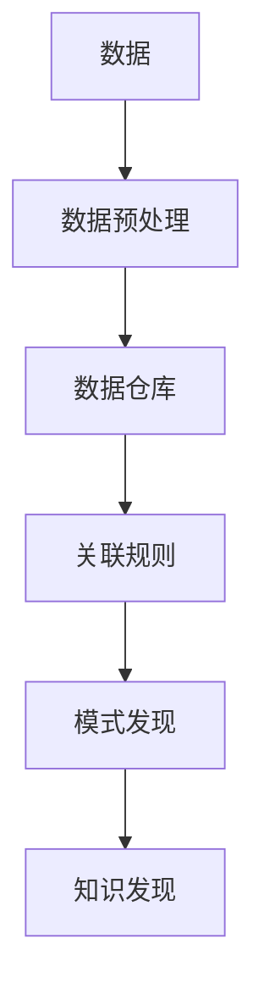

                 

# 知识发现引擎：发掘知识中的规律与联系

> 关键词：知识发现, 数据挖掘, 关联规则, 模式发现, 数据仓库

## 1. 背景介绍

在现代社会中，数据正以前所未有的速度增长，各行各业产生了大量的结构化和非结构化数据。数据挖掘和知识发现技术，能够从这些海量数据中提取有用的信息和知识，辅助决策，提升效率。知识发现引擎(Knowledge Discovery Engine, KDE)，作为数据挖掘领域的重要工具，能够自动地从大量数据中发现潜在的规律和关联，为各行各业提供重要的决策支持。

本文将系统地介绍知识发现引擎的原理与实践，帮助读者理解知识发现的重要性，掌握知识发现的关键技术和方法。我们将首先介绍知识发现的基本概念与方法，然后深入探讨数据挖掘的核心算法和具体实现，最后结合实际应用场景进行详细阐述。

## 2. 核心概念与联系

### 2.1 核心概念概述

为了更好地理解知识发现引擎，我们需要首先了解几个关键概念：

- **知识发现**：是指从大规模数据中提取有价值的信息和知识的过程。知识发现通常需要多个步骤，包括数据预处理、模型建立、规则提取等。

- **数据挖掘**：是从数据中自动发现有用的模式、规则和结构的技术。数据挖掘通常利用统计学、机器学习和人工智能等方法，从中提取有价值的知识。

- **关联规则**：是指描述数据项之间关联关系的规则，如购物篮分析中的“啤酒和尿布同购”规则。

- **模式发现**：是指从数据中自动发现有趣的模式和规律，如社交网络中用户之间的连接模式。

- **数据仓库**：是将不同来源的数据进行统一管理和存储的数据仓库系统。数据仓库通常用于知识发现和数据分析。

这些概念之间的联系可以通过以下Mermaid流程图来展示：



这个流程图展示了数据如何通过预处理、存储、模式发现和规则提取等步骤，最终形成知识发现的过程。

### 2.2 核心概念原理和架构

知识发现引擎的核心原理是基于数据挖掘技术，从大规模数据中自动发现有趣的模式和规律。其主要架构包括以下几个关键部分：

- **数据采集**：通过API接口、爬虫等手段，从不同数据源收集数据。
- **数据预处理**：对收集到的数据进行清洗、去重、格式化等处理，为后续分析做准备。
- **数据存储**：将处理后的数据存储到数据仓库或数据库中，供后续分析使用。
- **数据分析**：利用统计学、机器学习和人工智能等方法，从数据中发现有趣的规律和模式。
- **结果展示**：将分析结果以图表、报表等形式展示，供决策者参考。

## 3. 核心算法原理 & 具体操作步骤

### 3.1 算法原理概述

知识发现引擎的核心算法包括关联规则、分类、聚类和异常检测等。下面以关联规则和分类算法为例进行详细说明。

### 3.2 算法步骤详解

#### 关联规则算法

关联规则算法是指从交易数据中发现具有高置信度和支持度的规则。其核心步骤包括：

1. **候选规则生成**：通过将事务中的每个项合并，生成候选规则集。
2. **剪枝**：通过删除低置信度的候选规则，得到最终规则集。
3. **规则评估**：对剩余的候选规则进行评估，选择置信度和支持度较高的规则。

#### 分类算法

分类算法是指从已知类别样本中学习模型，并应用于新样本进行分类。其核心步骤包括：

1. **数据预处理**：将数据集划分为训练集和测试集，并进行归一化、特征选择等预处理。
2. **模型训练**：通过训练数据学习分类模型，如决策树、支持向量机、神经网络等。
3. **模型评估**：使用测试集评估模型性能，如准确率、召回率、F1值等指标。
4. **模型调优**：通过调整超参数和模型结构，提高模型性能。

### 3.3 算法优缺点

#### 关联规则算法的优缺点

**优点**：
- 可以发现数据中强相关的规则，如“啤酒和尿布同购”。
- 规则直观易懂，易于解释。

**缺点**：
- 生成的规则数量庞大，不易处理。
- 需要大量的数据支持，对于小样本数据效果不佳。

#### 分类算法的优缺点

**优点**：
- 能够对新数据进行分类，预测未知样本类别。
- 算法多样，适用于多种分类任务。

**缺点**：
- 需要大量标注数据进行训练。
- 对于复杂的数据分布，可能出现过拟合或欠拟合。

### 3.4 算法应用领域

知识发现引擎在多个领域都有广泛应用，例如：

- **零售业**：通过关联规则分析，发现顾客购买行为规律，优化商品组合。
- **金融业**：利用分类算法，预测股票市场趋势，进行风险评估。
- **医疗健康**：利用分类算法，预测疾病发生概率，辅助诊断。
- **社交网络**：通过聚类算法，发现用户之间的社交关系，进行社区发现。
- **电子商务**：利用异常检测算法，识别异常交易，防范欺诈。

## 4. 数学模型和公式 & 详细讲解 & 举例说明

### 4.1 数学模型构建

以关联规则算法为例，我们首先定义一个简单的数学模型：

设事务集为 $T$，包含 $m$ 个事务，每个事务包含 $n$ 个项。设 $I$ 为项集，包含 $k$ 个项。设 $A$ 为关联规则集，包含 $R$ 个规则。

关联规则 $A$ 的形式为 $X \rightarrow Y$，其中 $X \subseteq I$，$Y \subseteq I-X$。规则的置信度为 $conf(A)$，定义为其正事务数占所有事务数的比例：

$$
conf(A) = \frac{|T^+(A)|}{|T|}
$$

其中 $T^+(A)$ 为支持事务集，包含满足规则 $A$ 的所有事务。

### 4.2 公式推导过程

根据上述定义，关联规则的生成过程可以描述为：

1. 生成所有长度为 $k$ 的候选规则集合。
2. 对每个候选规则计算其支持度 $supp(A)$，计算置信度 $conf(A)$。
3. 根据置信度和支持度，剪枝得到最终的关联规则集 $A$。

### 4.3 案例分析与讲解

以著名的“啤酒与尿布”规则为例，进行分析：

设事务集 $T$ 为超市的购物记录，包含 $m=1000$ 个事务，每个事务包含 $n=100$ 个项。设项集 $I$ 为超市中的商品，包含 $k=100$ 个商品。

设关联规则 $A$ 为“啤酒 $\rightarrow$ 尿布”，其支持度为 $supp(A)=0.02$，即在所有事务中有 $200$ 个事务满足该规则。

则 $T^+(A)$ 为满足规则 $A$ 的事务集合，包含 $200$ 个事务。$conf(A)=0.02$，即在所有事务中，有 $20$ 个事务满足“啤酒 $\rightarrow$ 尿布”的规则。

## 5. 项目实践：代码实例和详细解释说明

### 5.1 开发环境搭建

为了进行知识发现引擎的开发实践，我们需要准备好以下开发环境：

- **Python**：推荐使用 Python 3.x 版本。
- **Pandas**：用于数据处理和分析。
- **NumPy**：用于数值计算。
- **Scikit-Learn**：用于机器学习算法实现。
- **Matplotlib**：用于数据可视化。

安装上述工具包，可以使用以下命令：

```bash
pip install pandas numpy scikit-learn matplotlib
```

### 5.2 源代码详细实现

以关联规则算法为例，以下是 Python 代码实现：

```python
import pandas as pd
from sklearn.preprocessing import LabelEncoder
from apyori import apriori

# 数据集读取
data = pd.read_csv('transactions.csv', header=None)

# 数据预处理
data[0] = data[0].astype(str)
data[1] = data[1].astype(str)
data[2] = data[2].astype(str)
data[3] = data[3].astype(str)

# 特征编码
label_encoder = LabelEncoder()
data[0] = label_encoder.fit_transform(data[0])
data[1] = label_encoder.fit_transform(data[1])
data[2] = label_encoder.fit_transform(data[2])
data[3] = label_encoder.fit_transform(data[3])

# 关联规则生成
frequent_itemsets = apriori(data, min_support=0.1)
rules = list(frequent_itemsets)

# 输出关联规则
for rule in rules:
    print(' '.join(map(str, rule)), '->', ' '.join(map(str, rule[1:])))
```

### 5.3 代码解读与分析

上述代码实现了基于 Apriori 算法的关联规则生成。主要步骤包括：

1. 数据集读取：从 CSV 文件中读取交易数据集。
2. 数据预处理：将数据转换为字符串类型，并进行编码。
3. 关联规则生成：使用 Apriori 算法生成频繁项集。
4. 输出关联规则：输出生成的关联规则。

## 6. 实际应用场景

### 6.1 零售业

在零售业中，关联规则算法可以用于发现顾客购买行为规律，优化商品组合。例如，某超市通过分析历史交易数据，发现以下关联规则：

- 啤酒 $\rightarrow$ 尿布
- 尿布 $\rightarrow$ 婴儿食品
- 婴儿食品 $\rightarrow$ 尿布

基于这些规则，超市可以调整商品摆放位置，将相关商品放在一起，提升顾客购买欲望。

### 6.2 金融业

在金融业中，分类算法可以用于预测股票市场趋势，进行风险评估。例如，某金融公司通过分析历史股票数据，建立分类模型，预测下一日的股市走势。通过模型评估和调优，公司可以制定更加精准的投资策略。

### 6.3 医疗健康

在医疗健康领域，分类算法可以用于预测疾病发生概率，辅助诊断。例如，某医院通过分析患者病历数据，建立分类模型，预测患者的疾病风险。通过模型评估和调优，医生可以更准确地进行疾病诊断和预测。

### 6.4 未来应用展望

随着数据挖掘技术的不断进步，知识发现引擎将在更多领域得到应用。例如：

- **智能制造**：通过数据分析，优化生产流程，提高生产效率。
- **智慧城市**：通过数据挖掘，优化城市管理，提升生活质量。
- **环境保护**：通过数据分析，发现环境污染规律，制定环保政策。

## 7. 工具和资源推荐

### 7.1 学习资源推荐

- **《数据挖掘导论》**：Russell A. Hirsch 和 Michael Steinbach 著，系统介绍了数据挖掘的基本概念和技术。
- **《Python 数据科学手册》**：Jake VanderPlas 著，介绍了 Python 在数据科学中的应用。
- **《机器学习实战》**：Peter Harrington 著，介绍了机器学习的基本算法和实现。
- **Coursera 数据科学课程**：由斯坦福大学和密歇根大学联合开设，涵盖了数据科学的核心内容。

### 7.2 开发工具推荐

- **Jupyter Notebook**：用于编写和运行 Python 代码，支持数据可视化。
- **Tableau**：用于数据可视化和报表生成。
- **SQLite**：用于数据存储和管理。
- **Apache Spark**：用于大数据处理和分析。

### 7.3 相关论文推荐

- **“Apriori: A efficient approach to the problem of association rules”**：Agrawal et al. 提出的 Apriori 算法，是关联规则算法的经典之作。
- **“Classification and Regression Trees”**：Breiman 提出的决策树算法，是分类算法的重要基础。
- **“K-Means Clustering”**：MacQueen 提出的 K-Means 算法，是聚类算法的重要基础。
- **“Anomaly Detection”**：Wang et al. 提出的异常检测算法，是异常检测算法的重要基础。

## 8. 总结：未来发展趋势与挑战

### 8.1 研究成果总结

知识发现引擎作为一种强大的数据挖掘工具，已经广泛应用于多个领域。其核心算法包括关联规则、分类、聚类和异常检测等，能够自动发现数据中的规律和模式，为决策提供重要支持。

### 8.2 未来发展趋势

未来，知识发现引擎将呈现以下几个发展趋势：

- **自动化水平提高**：通过自动化算法调优和模型优化，提升知识发现的效率和精度。
- **多模态数据融合**：将结构化数据、非结构化数据和时序数据进行融合，提高知识发现的深度和广度。
- **大数据处理能力提升**：利用分布式计算和并行计算技术，处理大规模数据，提升知识发现的性能。
- **人工智能与知识发现融合**：利用深度学习和人工智能技术，提升知识发现算法的性能。

### 8.3 面临的挑战

尽管知识发现引擎已经取得了一定的进展，但仍面临以下挑战：

- **数据质量问题**：数据质量直接影响知识发现的精度和可靠性。需要有效处理缺失值、噪声等数据问题。
- **模型复杂度问题**：复杂的数据模型可能导致过拟合或欠拟合，需要合理选择模型和调整超参数。
- **计算资源限制**：处理大规模数据需要高性能计算资源，需要优化算法和提高计算效率。
- **模型可解释性问题**：复杂模型难以解释，需要开发可解释性强的算法和工具。

### 8.4 研究展望

未来，知识发现引擎需要在以下几个方面进行深入研究：

- **自动化算法优化**：通过自动化算法优化和模型调优，提升知识发现的效率和精度。
- **多模态数据融合**：将结构化数据、非结构化数据和时序数据进行融合，提高知识发现的深度和广度。
- **大数据处理技术**：利用分布式计算和并行计算技术，处理大规模数据，提升知识发现的性能。
- **人工智能与知识发现融合**：利用深度学习和人工智能技术，提升知识发现算法的性能。
- **模型可解释性研究**：开发可解释性强的算法和工具，提高知识发现的可信度和透明度。

## 9. 附录：常见问题与解答

**Q1: 知识发现引擎有哪些应用场景？**

A: 知识发现引擎在多个领域都有广泛应用，例如零售业、金融业、医疗健康、社交网络等。

**Q2: 如何选择合适的知识发现算法？**

A: 选择合适的知识发现算法需要根据具体任务和数据特点进行判断。例如，关联规则算法适用于发现关联性强的规则，分类算法适用于分类预测任务，聚类算法适用于发现数据分布规律，异常检测算法适用于识别数据中的异常点。

**Q3: 知识发现引擎的计算资源需求高吗？**

A: 知识发现引擎的计算资源需求相对较高，需要高性能计算资源和分布式计算技术。但随着技术进步，计算效率也在不断提高。

**Q4: 知识发现引擎的数据质量如何影响结果？**

A: 数据质量直接影响知识发现的精度和可靠性。需要有效处理缺失值、噪声等数据问题，保证数据质量。

**Q5: 知识发现引擎的模型可解释性问题如何解决？**

A: 模型可解释性问题可以通过开发可解释性强的算法和工具来解决，例如可视化工具和模型解释技术。

---

作者：禅与计算机程序设计艺术 / Zen and the Art of Computer Programming

