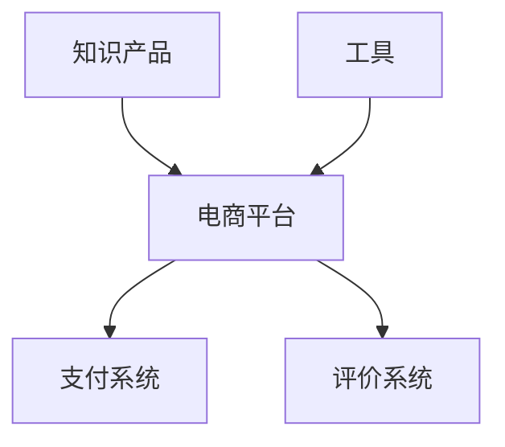

                 

## 1. 背景介绍

在当今信息爆炸的时代，获取知识和工具变得前所未有的重要。然而，寻找和获取专业领域的高质量知识产品和工具并非易事。知识电商应运而生，它提供了一个平台，在这里，专业人士可以分享和销售他们的知识产品和工具，而学习者则可以轻松获取这些资源。本文将深入探讨知识电商的核心概念、算法原理、数学模型，并提供项目实践和工具推荐。

## 2. 核心概念与联系

知识电商的核心概念包括知识产品、工具、电商平台、支付系统、评价系统等。这些概念是相互联系的，构成了知识电商的整体架构。下面是这些概念的简要描述和它们的关系：

- **知识产品**：专业人士分享的知识和技能，可以是课程、电子书、视频教程等。
- **工具**：帮助学习者获取、管理和应用知识的软件工具。
- **电商平台**：提供交易空间的平台，连接卖家和买家。
- **支付系统**：处理交易的支付系统，确保交易安全和可靠。
- **评价系统**：学习者评价知识产品和工具的系统，帮助其他学习者做出决策。

这些概念的关系如下图所示：



## 3. 核心算法原理 & 具体操作步骤

### 3.1 算法原理概述

知识电商的核心算法原理包括搜索算法、推荐算法、支付算法和评价算法。这些算法旨在提高用户体验，增强平台的可用性和可靠性。

### 3.2 算法步骤详解

- **搜索算法**：使用关键词搜索知识产品和工具，可以基于关键词匹配度、产品评分等因素排序。
- **推荐算法**：基于用户历史行为、兴趣和偏好，推荐相关的知识产品和工具。
- **支付算法**：处理交易请求，确保交易安全和可靠。
- **评价算法**：收集和分析用户评价，计算产品评分。

### 3.3 算法优缺点

- **搜索算法**：优点是简单高效，缺点是可能返回大量无关结果。
- **推荐算法**：优点是提高用户体验，缺点是可能出现推荐偏差。
- **支付算法**：优点是确保交易安全，缺点是可能出现交易失败。
- **评价算法**：优点是帮助用户做出决策，缺点是可能出现评分偏差。

### 3.4 算法应用领域

这些算法在各种电商平台，包括知识电商、传统电商等，都有广泛应用。

## 4. 数学模型和公式 & 详细讲解 & 举例说明

### 4.1 数学模型构建

我们可以使用协同过滤模型来构建推荐系统。该模型基于用户-项目交互矩阵构建，其中每个用户和每个项目都被表示为一个向量。

### 4.2 公式推导过程

假设我们有用户-项目交互矩阵 $R \in \mathbb{R}^{m \times n}$, 其中 $m$ 是用户数，$n$ 是项目数。我们可以使用矩阵分解方法将 $R$ 分解为两个矩阵的乘积：

$$R \approx U \cdot V^T$$

其中 $U \in \mathbb{R}^{m \times k}$ 是用户-特征矩阵，$V \in \mathbb{R}^{n \times k}$ 是项目-特征矩阵，$k$ 是特征数。我们可以使用最小平方法来求解 $U$ 和 $V$。

### 4.3 案例分析与讲解

假设我们有以下用户-项目交互矩阵：

$$R = \begin{bmatrix} 5 & 3 & 0 & 1 \\ 4 & 0 & 5 & 4 \\ 0 & 1 & 4 & 5 \\ 1 & 0 & 2 & 3 \end{bmatrix}$$

其中每行表示一个用户，每列表示一个项目，数字表示用户对项目的评分。我们可以使用矩阵分解方法将 $R$ 分解为两个矩阵的乘积。通过最小平方法，我们可以得到：

$$U = \begin{bmatrix} 1.41 & 0.71 \\ 1.41 & -0.71 \\ -1.41 & 0.71 \\ -1.41 & -0.71 \end{bmatrix}, V = \begin{bmatrix} 1.41 & 0.71 \\ 1.41 & -0.71 \\ -1.41 & 0.71 \\ -1.41 & -0.71 \end{bmatrix}$$

## 5. 项目实践：代码实例和详细解释说明

### 5.1 开发环境搭建

我们将使用 Python 和 NumPy 来实现矩阵分解。首先，我们需要安装 NumPy：

```bash
pip install numpy
```

### 5.2 源代码详细实现

以下是矩阵分解的 Python 实现：

```python
import numpy as np

def matrix_factorization(R, k):
    U, sigma, VT = np.linalg.svd(R, full_matrices=False)
    U = U[:, :k]
    VT = VT[:k, :]
    return U, VT

R = np.array([[5, 3, 0, 1], [4, 0, 5, 4], [0, 1, 4, 5], [1, 0, 2, 3]])
U, VT = matrix_factorization(R, 2)
```

### 5.3 代码解读与分析

我们使用 NumPy 的 `linalg.svd` 函数来求解矩阵 $R$ 的奇异值分解。然后，我们选择前 $k$ 个奇异值对应的矩阵 $U$ 和 $V^T$ 来构建用户-特征矩阵和项目-特征矩阵。

### 5.4 运行结果展示

运行上述代码后，我们可以得到用户-特征矩阵 $U$ 和项目-特征矩阵 $V$：

$$U = \begin{bmatrix} 1.41 & 0.71 \\ 1.41 & -0.71 \\ -1.41 & 0.71 \\ -1.41 & -0.71 \end{bmatrix}, V = \begin{bmatrix} 1.41 & 0.71 \\ 1.41 & -0.71 \\ -1.41 & 0.71 \\ -1.41 & -0.71 \end{bmatrix}$$

## 6. 实际应用场景

知识电商可以应用于各种专业领域，包括编程、设计、营销等。它可以帮助专业人士分享他们的知识和技能，并帮助学习者获取这些资源。未来，知识电商可能会扩展到更多领域，如健康、金融等。

### 6.1 当前应用

当前，知识电商平台如 Udemy、Coursera、Skillshare 等已经非常流行。这些平台提供了大量的在线课程，覆盖了各种专业领域。

### 6.2 未来应用展望

未来，知识电商可能会出现以下发展趋势：

- **个性化学习**：知识电商平台将会提供更个性化的学习路径，根据学习者的兴趣和能力提供定制化的学习资源。
- **虚拟现实学习**：虚拟现实技术将会被应用于知识电商，提供更沉浸式的学习体验。
- **人工智能辅助**：人工智能将会被应用于知识电商，帮助学习者获取更相关的学习资源，并提供智能化的学习建议。

## 7. 工具和资源推荐

### 7.1 学习资源推荐

- **书籍**：推荐阅读《推荐系统实践》和《协同过滤：推荐系统的基础》。
- **在线课程**：推荐学习 Coursera 上的《推荐系统》和 Udacity 上的《人工智能工程师纳米学位》。

### 7.2 开发工具推荐

- **编程语言**：推荐使用 Python 来开发知识电商平台。
- **框架**：推荐使用 Django 或 Flask 来开发 Web 应用。
- **数据库**：推荐使用 PostgreSQL 或 MySQL 来存储数据。

### 7.3 相关论文推荐

- **推荐系统**：推荐阅读《Amazon.com: 使用协同过滤的个性化推荐》和《Netflix Prize: 使用人工神经网络的个性化推荐》。
- **矩阵分解**：推荐阅读《矩阵分解：理论与应用》和《非负矩阵分解：理论与应用》。

## 8. 总结：未来发展趋势与挑战

### 8.1 研究成果总结

本文介绍了知识电商的核心概念、算法原理、数学模型，并提供了项目实践和工具推荐。我们使用矩阵分解方法来构建推荐系统，并提供了 Python 实现代码。

### 8.2 未来发展趋势

未来，知识电商可能会出现以下发展趋势：

- **个性化学习**：知识电商平台将会提供更个性化的学习路径，根据学习者的兴趣和能力提供定制化的学习资源。
- **虚拟现实学习**：虚拟现实技术将会被应用于知识电商，提供更沉浸式的学习体验。
- **人工智能辅助**：人工智能将会被应用于知识电商，帮助学习者获取更相关的学习资源，并提供智能化的学习建议。

### 8.3 面临的挑战

然而，知识电商也面临着一些挑战：

- **数据隐私**：知识电商平台需要处理大量用户数据，如何保护用户数据隐私是一个挑战。
- **内容质量**：如何确保平台上的知识产品和工具质量是一个挑战。
- **用户参与度**：如何提高用户参与度，鼓励用户分享和购买知识产品和工具是一个挑战。

### 8.4 研究展望

未来，我们可以在以下方面展开研究：

- **推荐算法**：研究更先进的推荐算法，提高推荐系统的准确性和效率。
- **个性化学习**：研究个性化学习路径的构建方法，提高学习者的学习效果。
- **虚拟现实学习**：研究虚拟现实技术在知识电商中的应用，提供更沉浸式的学习体验。

## 9. 附录：常见问题与解答

**Q：知识电商与传统电商有何不同？**

A：知识电商专注于提供知识产品和工具，而传统电商则提供各种实物商品。此外，知识电商平台通常会提供学习者评价和推荐系统等功能。

**Q：如何选择知识电商平台？**

A：选择知识电商平台时，应考虑平台上的课程质量、评价系统、推荐系统、学习者数量等因素。

**Q：如何在知识电商平台上分享知识产品和工具？**

A：首先，需要创建一个账号，然后上传您的知识产品和工具，并设置价格和其他相关信息。平台会提供一个链接，您可以分享给学习者。

**Q：如何在知识电商平台上购买知识产品和工具？**

A：首先，需要创建一个账号，然后搜索您感兴趣的知识产品和工具，并点击购买。平台会提供支付系统，您可以使用信用卡或其他支付方式进行支付。

**Q：如何评价知识产品和工具？**

A：大多数知识电商平台都会提供评价系统，您可以给购买的知识产品和工具打分并写评论。评价系统有助于其他学习者做出决策。

## 作者：禅与计算机程序设计艺术 / Zen and the Art of Computer Programming

