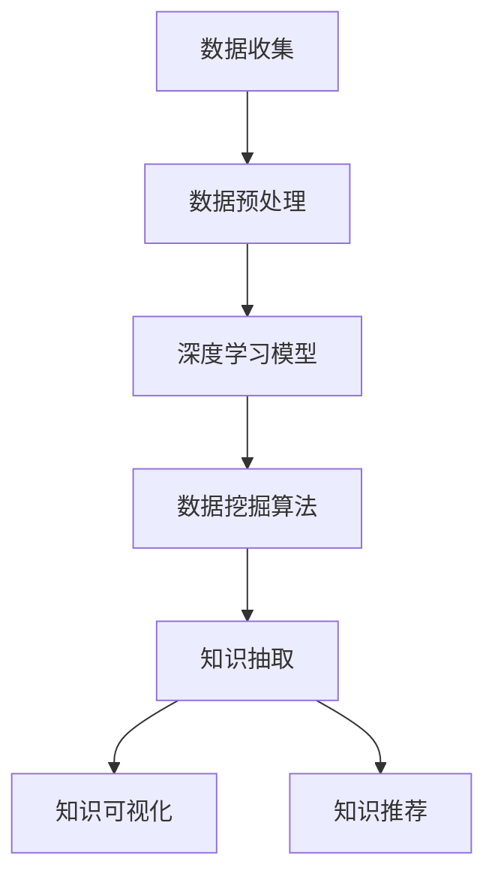

                 

# 知识发现引擎：开启知识创新新纪元

## 1. 背景介绍

### 1.1 问题由来

知识发现（Knowledge Discovery, KD），指的是从大量数据中自动抽取有用知识的过程。在数据驱动的决策时代，能否高效、精确地从数据中提取知识，成为决定组织竞争力的关键。传统的数据仓库、报表分析等方法，往往需要依赖人力投入和专业技能，效率低、成本高，难以应对海量数据的实时分析需求。

大数据、人工智能技术的兴起，为知识发现带来了新的希望。通过大规模数据集，深度学习模型，数据挖掘算法，可以更自动化、更智能地发现数据中蕴含的规律和知识。特别是最近十年，深度学习在图像、语音、文本等领域的突破，极大地提高了知识发现的效率和准确性，推动了知识发现技术的快速发展。

## 1.2 问题核心关键点

知识发现引擎，是指使用深度学习、数据挖掘等技术，自动化地从数据中提取知识的技术系统。其核心在于：

- 自动化数据处理：通过自动化的数据清洗、特征提取、模型训练等步骤，大幅降低知识发现的人力成本。
- 高效知识抽取：利用深度学习模型的强大表征能力，从海量数据中抽取更丰富、更精准的知识，提升决策支持的价值。
- 实时知识更新：通过持续的数据输入和模型迭代，知识发现引擎能够实时响应数据的变化，动态更新知识库。

知识发现引擎在金融风控、医疗诊断、智能制造、供应链管理等多个领域得到了广泛应用，成为推动智能化转型升级的重要工具。本文将从核心概念、算法原理、实践应用等方面，深入探讨知识发现引擎的原理和应用。

## 2. 核心概念与联系

### 2.1 核心概念概述

知识发现引擎的核心组件包括：

- 数据收集：从各种数据源收集数据，包括结构化数据、半结构化数据、非结构化数据等。
- 数据预处理：包括数据清洗、特征工程、数据增强等步骤，确保数据质量，提升模型的输入特征。
- 深度学习模型：包括卷积神经网络（CNN）、循环神经网络（RNN）、变换器（Transformer）等架构，用于自动抽取数据中的知识。
- 数据挖掘算法：包括关联规则、聚类分析、异常检测等，用于发现数据中的模式和规律。
- 知识抽取：基于模型输出和数据挖掘算法结果，自动抽取有用知识，形成结构化的知识库。
- 知识可视化：使用图表、报表等形式，将知识库中的信息展示出来，便于理解和决策。
- 知识推荐：通过用户行为和知识库的匹配，向用户推荐相关知识，提升用户的使用体验。

这些组件之间的逻辑关系可以通过以下Mermaid流程图来展示：



这个流程图展示的知识发现引擎的核心组件及其之间的关系：

1. 数据收集和预处理是知识发现的前提和基础。
2. 深度学习模型和数据挖掘算法是知识抽取的工具。
3. 知识抽取的结果通过可视化展示和推荐系统输出，用于决策支持。

## 3. 核心算法原理 & 具体操作步骤

### 3.1 算法原理概述

知识发现引擎的核心算法包括深度学习模型和数据挖掘算法。深度学习模型主要通过自动特征学习，从数据中提取抽象的特征表示，用于知识的发现和表达。数据挖掘算法则通过统计分析和模式识别，自动发现数据中的规律和异常，形成结构化的知识。

知识发现引擎的算法流程通常包括以下几个步骤：

- 数据收集和预处理：清洗数据、填充缺失值、标准化数据格式等。
- 特征工程：选择或构造输入特征，进行归一化、降维等操作。
- 模型训练和验证：使用深度学习模型或数据挖掘算法，在训练集上训练模型，使用验证集评估模型性能。
- 知识抽取：通过模型输出或算法结果，自动提取知识，形成知识库。
- 知识可视化：使用图表、报表等形式，展示知识库中的信息。
- 知识推荐：根据用户行为和知识库，推荐相关知识。

### 3.2 算法步骤详解

以下以一个典型知识发现引擎为例，详细讲解其核心算法流程：

**Step 1: 数据收集与预处理**

数据收集和预处理是知识发现的基础。步骤如下：

1. 从各个数据源收集数据，包括结构化数据、半结构化数据、非结构化数据等。
2. 清洗数据，去除噪声、冗余和不一致的数据。
3. 进行特征工程，选择或构造输入特征，进行归一化、降维等操作。
4. 进行数据增强，扩充数据集，防止过拟合。

**Step 2: 模型训练与知识抽取**

深度学习模型和数据挖掘算法是知识抽取的工具。步骤如下：

1. 使用深度学习模型（如CNN、RNN、Transformer等），在训练集上训练模型。
2. 使用数据挖掘算法（如关联规则、聚类分析、异常检测等），发现数据中的规律和异常。
3. 将模型输出和算法结果作为输入，使用知识抽取算法，自动提取知识。
4. 将提取的知识存储到知识库中，形成结构化的知识。

**Step 3: 知识可视化和推荐**

知识可视化和推荐是知识发现引擎的输出。步骤如下：

1. 使用图表、报表等形式，展示知识库中的信息，便于理解和决策。
2. 根据用户行为和知识库，使用推荐算法，推荐相关知识。

### 3.3 算法优缺点

知识发现引擎的算法有以下优点：

1. 自动化高效：通过自动化数据处理和模型训练，大幅降低人力成本，提高知识发现的效率。
2. 精度高：深度学习模型和数据挖掘算法的表征能力，可以自动发现数据中的复杂规律，提升知识的准确性。
3. 实时响应：通过持续的数据输入和模型迭代，知识发现引擎能够实时响应数据的变化，动态更新知识库。

同时，知识发现引擎也存在一些局限性：

1. 数据依赖：知识发现的结果高度依赖数据的质量和多样性，低质量、高噪声的数据会严重影响结果的准确性。
2. 模型复杂度：深度学习模型和数据挖掘算法通常比较复杂，需要较大的计算资源和存储资源。
3. 可解释性不足：部分深度学习模型和数据挖掘算法的结果难以解释，给决策支持带来挑战。
4. 数据隐私问题：在数据收集和处理过程中，可能涉及用户隐私数据，需要严格的保护措施。

### 3.4 算法应用领域

知识发现引擎在金融风控、医疗诊断、智能制造、供应链管理等多个领域得到了广泛应用，具体如下：

**金融风控：**
金融领域的数据量庞大，数据类型多样。知识发现引擎可以通过自动化地从历史交易数据中发现潜在的风险因素，自动生成风控策略，实时监控和预警风险。

**医疗诊断：**
医疗数据包括结构化的病历数据、半结构化的影像数据、非结构化的患者评论数据等。知识发现引擎可以从这些数据中自动发现疾病特征和关联规律，辅助医生进行诊断和治疗决策。

**智能制造：**
工业数据包括传感器数据、生产设备状态、生产流程等。知识发现引擎可以从中自动发现生产瓶颈和异常，实时调整生产计划，提高生产效率和质量。

**供应链管理：**
供应链数据包括采购数据、库存数据、物流数据等。知识发现引擎可以从这些数据中自动发现供应链中的异常和瓶颈，优化供应链管理，降低运营成本。

此外，知识发现引擎还可以应用于智能客服、智能推荐、智能广告等领域，帮助企业提升客户体验、优化运营效率、增加收入来源。

## 4. 数学模型和公式 & 详细讲解 & 举例说明

### 4.1 数学模型构建

知识发现引擎的数学模型通常包括以下几类：

- 深度学习模型：如卷积神经网络（CNN）、循环神经网络（RNN）、变换器（Transformer）等，用于自动特征学习。
- 数据挖掘算法：如关联规则算法、聚类算法、异常检测算法等，用于发现数据中的规律和异常。
- 知识抽取算法：如实体识别、关系抽取、摘要生成等，用于从模型输出或算法结果中提取知识。

**深度学习模型的数学模型**：

深度学习模型通常基于神经网络架构，其数学模型可以表示为：

$$
h = g(Wx + b)
$$

其中 $x$ 为输入特征，$W$ 和 $b$ 为模型参数，$g$ 为激活函数，$h$ 为模型输出。

**数据挖掘算法的数学模型**：

数据挖掘算法通常基于统计分析和模式识别，其数学模型可以表示为：

- 关联规则算法：基于频率统计，发现数据中的关联关系，可以表示为：

$$
\text{Support}(A \rightarrow B) = \frac{count(A \cap B)}{count(A)}
$$

- 聚类算法：基于密度聚类，发现数据中的集群结构，可以表示为：

$$
k-means: \min_{C} \sum_{i=1}^n ||x_i - \mu_C||^2
$$

- 异常检测算法：基于分布统计，发现数据中的异常点，可以表示为：

$$
\text{Anomaly}(x) = \frac{count(\{x_i | \text{distance}(x_i, \mu) > \epsilon\})}{count(x)}
$$

### 4.2 公式推导过程

以下以关联规则算法为例，详细推导其数学模型：

关联规则算法的基本思想是，通过计算项集之间的支持度和置信度，发现数据中频繁出现的关联关系。关联规则可以表示为：

$$
A \rightarrow B, \text{Support}(A \rightarrow B) > \minsup
$$

其中 $A$ 和 $B$ 为项集，$\minsup$ 为最小支持度阈值。

支持度表示项集出现的频率，可以表示为：

$$
\text{Support}(A) = \frac{count(A)}{count(D)}
$$

其中 $A$ 为项集，$D$ 为数据集。

置信度表示一个项集出现在另一个项集之后，可以表示为：

$$
\text{Confidence}(A \rightarrow B) = \frac{count(A \cap B)}{count(A)}
$$

根据以上公式，可以通过计算项集的支持度和置信度，发现数据中的关联关系。

### 4.3 案例分析与讲解

假设有一个电商平台的销售数据集，包括商品类别、购买数量、购买时间等特征。使用关联规则算法，发现以下关联规则：

$$
\text{Category: Books} \rightarrow \text{Quantity} > 5, \text{Support} = 0.2, \text{Confidence} = 0.8
$$

该规则表示，当购买书籍的订单数量大于 5 时，购买量增加的概率为 80%。通过该规则，平台可以向用户推荐更多书籍，提高销售量。

## 5. 项目实践：代码实例和详细解释说明

### 5.1 开发环境搭建

在进行知识发现引擎的开发实践前，我们需要准备好开发环境。以下是使用Python进行PyTorch开发的环境配置流程：

1. 安装Anaconda：从官网下载并安装Anaconda，用于创建独立的Python环境。

2. 创建并激活虚拟环境：
```bash
conda create -n pytorch-env python=3.8 
conda activate pytorch-env
```

3. 安装PyTorch：根据CUDA版本，从官网获取对应的安装命令。例如：
```bash
conda install pytorch torchvision torchaudio cudatoolkit=11.1 -c pytorch -c conda-forge
```

4. 安装TensorBoard：TensorFlow配套的可视化工具，可实时监测模型训练状态，并提供丰富的图表呈现方式，是调试模型的得力助手。
```bash
pip install tensorboard
```

5. 安装各类工具包：
```bash
pip install numpy pandas scikit-learn matplotlib tqdm jupyter notebook ipython
```

完成上述步骤后，即可在`pytorch-env`环境中开始开发实践。

### 5.2 源代码详细实现

下面我们以电商平台的销售数据为例，给出使用PyTorch进行关联规则算法实现的代码实现。

首先，定义数据处理函数：

```python
import pandas as pd
from sklearn.preprocessing import LabelEncoder

def preprocess_data(data):
    # 处理缺失值
    data.dropna(inplace=True)
    # 特征编码
    le = LabelEncoder()
    data['category'] = le.fit_transform(data['category'])
    data['quantity'] = data['quantity'].astype(int)
    return data

# 读取数据集
data = pd.read_csv('sales_data.csv')
data = preprocess_data(data)
```

然后，定义关联规则算法函数：

```python
from apyori import apriori
from mlxtend.frequent_patterns import association_rules

def apriori_rules(data, min_support=0.1, min_confidence=0.5):
    # 生成频繁项集
    frequent_itemsets = apriori(data, min_support=min_support)
    # 生成关联规则
    rules = association_rules(frequent_itemsets, metric='lift', min_threshold=1)
    # 筛选出置信度大于等于 0.5 的规则
    rules = rules[rules['confidence'] >= min_confidence]
    return rules
```

接着，使用关联规则算法对数据集进行处理：

```python
# 生成关联规则
rules = apriori_rules(data, min_support=0.1, min_confidence=0.5)

# 输出规则
print(rules)
```

以上就是使用PyTorch进行关联规则算法实现的完整代码实现。可以看到，得益于Scikit-learn和mlxtend库的强大封装，我们可以用相对简洁的代码实现复杂的关联规则算法。

### 5.3 代码解读与分析

让我们再详细解读一下关键代码的实现细节：

**preprocess_data函数**：
- 处理缺失值：使用dropna方法去除缺失值。
- 特征编码：使用LabelEncoder对类别特征进行编码，将类别转换为数值型。

**apriori_rules函数**：
- 生成频繁项集：使用apriori算法生成频繁项集。
- 生成关联规则：使用association_rules函数生成关联规则。
- 筛选规则：根据置信度和提升度的阈值筛选规则。

**代码实现**：
- 读取数据集，并调用preprocess_data函数进行预处理。
- 调用apriori_rules函数生成关联规则，并根据阈值筛选规则。
- 输出生成的关联规则。

可以看到，使用PyTorch和Scikit-learn库，可以方便地实现关联规则算法。开发者可以将更多精力放在数据处理、算法改进等高层逻辑上，而不必过多关注底层的实现细节。

## 6. 实际应用场景

### 6.1 电商平台的销售预测

电商平台的数据量庞大，数据类型多样。通过使用知识发现引擎，可以自动从历史销售数据中发现规律，预测未来销售趋势，优化库存管理，提升用户体验。

**数据集和模型**：
- 数据集：电商平台的销售数据，包括商品类别、购买数量、购买时间等特征。
- 模型：关联规则算法，用于发现数据中的关联规律。

**实现过程**：
1. 收集电商平台的历史销售数据。
2. 使用关联规则算法，自动发现数据中的关联规律，如“书籍 > 5 本”、“电子产品 > 10% 折扣”等。
3. 根据发现的相关关系，生成推荐策略，如向购买书籍数量大于 5 的用户推荐相关书籍。

### 6.2 医疗诊断中的疾病关联发现

医疗数据包括结构化的病历数据、半结构化的影像数据、非结构化的患者评论数据等。通过使用知识发现引擎，可以自动从这些数据中发现疾病特征和关联规律，辅助医生进行诊断和治疗决策。

**数据集和模型**：
- 数据集：医院中的病历数据、影像数据、患者评论数据等。
- 模型：关联规则算法、聚类算法、异常检测算法等。

**实现过程**：
1. 收集医院中的病历数据、影像数据、患者评论数据等。
2. 使用关联规则算法、聚类算法、异常检测算法等，自动发现数据中的关联规律。
3. 根据发现的相关关系，生成诊断和治疗建议，如“高血压 > 糖尿病”、“放射异常 > 癌症”等。

### 6.3 智能制造中的生产预测

工业数据包括传感器数据、生产设备状态、生产流程等。通过使用知识发现引擎，可以自动从这些数据中发现生产瓶颈和异常，实时调整生产计划，提高生产效率和质量。

**数据集和模型**：
- 数据集：智能制造中的传感器数据、生产设备状态、生产流程等。
- 模型：关联规则算法、聚类算法、异常检测算法等。

**实现过程**：
1. 收集智能制造中的传感器数据、生产设备状态、生产流程等。
2. 使用关联规则算法、聚类算法、异常检测算法等，自动发现数据中的关联规律。
3. 根据发现的相关关系，生成生产预测和优化策略，如“设备故障 > 维护通知”、“物料短缺 > 采购调整”等。

### 6.4 未来应用展望

随着知识发现技术的不断发展，未来的应用场景将更加多样化。以下是几个可能的未来应用方向：

1. 智能客服：使用知识发现引擎，自动从用户交互数据中发现常见问题和解决方案，构建智能客服系统，提升客户体验。

2. 智能推荐：使用知识发现引擎，自动从用户行为数据中发现相关物品和内容，推荐给用户，提升用户体验。

3. 智能广告：使用知识发现引擎，自动从用户行为数据中发现广告效果，优化广告投放策略，提升广告效果。

4. 金融风控：使用知识发现引擎，自动从金融交易数据中发现异常交易和风险因素，实时监控和预警风险。

5. 医疗诊断：使用知识发现引擎，自动从医疗数据中发现疾病特征和关联规律，辅助医生进行诊断和治疗决策。

6. 智能制造：使用知识发现引擎，自动从生产数据中发现生产瓶颈和异常，优化生产计划，提高生产效率和质量。

## 7. 工具和资源推荐

### 7.1 学习资源推荐

为了帮助开发者系统掌握知识发现引擎的理论基础和实践技巧，这里推荐一些优质的学习资源：

1. 《Python数据科学手册》：深入浅出地介绍了Python在数据科学中的应用，包括数据处理、机器学习、数据可视化等。

2. 《深度学习》课程：由斯坦福大学开设的深度学习课程，有Lecture视频和配套作业，带你入门深度学习的基本概念和经典模型。

3. 《数据挖掘算法》书籍：全面介绍了数据挖掘的基本算法，包括关联规则、聚类分析、异常检测等。

4. 《Apache Spark》官方文档：Spark是处理大数据的主流框架，提供了丰富的数据处理和机器学习工具。

5. 《TensorFlow实战》书籍：TensorFlow是深度学习的主流框架，提供了强大的计算图和模型训练工具。

通过对这些资源的学习实践，相信你一定能够快速掌握知识发现引擎的精髓，并用于解决实际的NLP问题。

### 7.2 开发工具推荐

高效的开发离不开优秀的工具支持。以下是几款用于知识发现引擎开发的常用工具：

1. PyTorch：基于Python的开源深度学习框架，灵活动态的计算图，适合快速迭代研究。大部分深度学习模型都有PyTorch版本的实现。

2. TensorFlow：由Google主导开发的开源深度学习框架，生产部署方便，适合大规模工程应用。同样有丰富的深度学习模型资源。

3. Scikit-learn：Python科学计算库，提供了丰富的机器学习算法和工具，适合用于知识发现任务。

4. Weights & Biases：模型训练的实验跟踪工具，可以记录和可视化模型训练过程中的各项指标，方便对比和调优。与主流深度学习框架无缝集成。

5. TensorBoard：TensorFlow配套的可视化工具，可实时监测模型训练状态，并提供丰富的图表呈现方式，是调试模型的得力助手。

6. Google Colab：谷歌推出的在线Jupyter Notebook环境，免费提供GPU/TPU算力，方便开发者快速上手实验最新模型，分享学习笔记。

合理利用这些工具，可以显著提升知识发现引擎的开发效率，加快创新迭代的步伐。

### 7.3 相关论文推荐

知识发现技术的发展源于学界的持续研究。以下是几篇奠基性的相关论文，推荐阅读：

1. A Formal Basis for Reasoning About Herbrand Models：提供了逻辑推理的基础理论，为知识发现提供了理论支撑。

2. Discovery of Association Rules and Association Rules with Confidence Measures in Large Databases：介绍了关联规则算法的基本原理和实现方法。

3. Clustering by Passing Messages Between Data Points：介绍了基于传递消息的聚类算法，用于发现数据中的集群结构。

4. Outlier Detection in Datasets：介绍了异常检测的基本原理和实现方法。

5. A Survey on Rule-Based Knowledge Discovery：介绍了知识发现的基本算法和技术，全面回顾了知识发现的研究进展。

这些论文代表了大语言模型微调技术的发展脉络。通过学习这些前沿成果，可以帮助研究者把握学科前进方向，激发更多的创新灵感。

## 8. 总结：未来发展趋势与挑战

### 8.1 总结

本文对知识发现引擎的原理和应用进行了全面系统的介绍。首先阐述了知识发现引擎的核心概念和重要意义，明确了其在数据驱动的决策支持中的重要作用。其次，从原理到实践，详细讲解了知识发现引擎的算法流程，给出了具体的代码实例和实现细节。同时，本文还广泛探讨了知识发现引擎在电商、医疗、制造等领域的实际应用，展示了其广阔的应用前景。此外，本文精选了知识发现引擎的学习资源，力求为读者提供全方位的技术指引。

通过本文的系统梳理，可以看到，知识发现引擎正在成为数据驱动决策支持的重要工具，其高效、精准的特征抽取和知识发现能力，为决策支持提供了强大的技术支撑。知识发现引擎通过自动化处理海量数据，发现数据中的规律和异常，为决策提供了更全面、更可靠的信息支持。

### 8.2 未来发展趋势

展望未来，知识发现引擎的发展趋势将主要体现在以下几个方面：

1. 模型自动化：自动化特征选择和模型训练，减少人工干预，提升模型效率和精度。

2. 数据协同处理：自动处理结构化、半结构化、非结构化数据，提升数据处理的全面性和一致性。

3. 实时处理能力：提升知识发现引擎的实时处理能力，支持实时决策支持，应对数据流快速变化。

4. 多模态处理能力：自动处理图像、视频、语音等多模态数据，提升知识发现引擎的全面性和泛化能力。

5. 分布式计算能力：提升知识发现引擎的分布式计算能力，支持大规模数据处理和模型训练。

6. 数据隐私保护：提升数据隐私保护能力，保护用户隐私数据。

7. 领域特定应用：针对特定领域的知识发现需求，开发专门的领域知识发现引擎，提升领域特定应用的精度和效率。

8. 跨模态知识融合：将不同模态的知识进行融合，提升知识发现引擎的跨模态推理能力。

以上趋势凸显了知识发现引擎的广阔前景。这些方向的探索发展，必将进一步提升知识发现引擎的精度和效率，为数据驱动的决策支持提供更强大的技术支撑。

### 8.3 面临的挑战

尽管知识发现引擎已经取得了瞩目成就，但在迈向更加智能化、普适化应用的过程中，它仍面临着诸多挑战：

1. 数据质量问题：数据质量直接影响知识发现的精度，低质量、高噪声的数据会严重影响结果的准确性。

2. 模型复杂度：深度学习模型和数据挖掘算法通常比较复杂，需要较大的计算资源和存储资源。

3. 可解释性不足：部分深度学习模型和数据挖掘算法的结果难以解释，给决策支持带来挑战。

4. 数据隐私问题：在数据收集和处理过程中，可能涉及用户隐私数据，需要严格的保护措施。

5. 计算资源限制：知识发现引擎的数据处理和模型训练需要大量的计算资源，计算资源限制会影响其应用范围。

6. 模型泛化能力：知识发现引擎需要具备更强的泛化能力，以适应不同领域、不同类型的数据。

### 8.4 研究展望

面对知识发现引擎所面临的挑战，未来的研究需要在以下几个方面寻求新的突破：

1. 自动化特征选择和模型训练：开发更加自动化、智能化的特征选择和模型训练方法，减少人工干预，提升模型效率和精度。

2. 多模态数据协同处理：自动处理图像、视频、语音等多模态数据，提升知识发现引擎的全面性和泛化能力。

3. 实时处理能力：提升知识发现引擎的实时处理能力，支持实时决策支持，应对数据流快速变化。

4. 领域特定知识发现：针对特定领域的知识发现需求，开发专门的领域知识发现引擎，提升领域特定应用的精度和效率。

5. 跨模态知识融合：将不同模态的知识进行融合，提升知识发现引擎的跨模态推理能力。

6. 数据隐私保护：提升数据隐私保护能力，保护用户隐私数据。

7. 分布式计算能力：提升知识发现引擎的分布式计算能力，支持大规模数据处理和模型训练。

8. 模型泛化能力：开发具备更强的泛化能力，以适应不同领域、不同类型的数据。

这些研究方向的探索，必将引领知识发现引擎技术迈向更高的台阶，为数据驱动的决策支持提供更强大的技术支撑。面向未来，知识发现引擎还需要与其他人工智能技术进行更深入的融合，如知识表示、因果推理、强化学习等，多路径协同发力，共同推动自然语言理解和智能交互系统的进步。只有勇于创新、敢于突破，才能不断拓展知识发现引擎的边界，让智能技术更好地造福人类社会。

## 9. 附录：常见问题与解答

**Q1：知识发现引擎是否适用于所有数据类型？**

A: 知识发现引擎适用于大部分数据类型，包括结构化数据、半结构化数据、非结构化数据等。但对于一些特定领域的数据，如基因数据、信号数据等，可能需要特定的处理方法，才能有效地进行知识发现。

**Q2：如何选择合适的知识发现模型？**

A: 选择知识发现模型需要考虑数据类型、数据规模、应用场景等因素。一般而言，对于结构化数据，可以使用关联规则算法、决策树算法等。对于半结构化数据和非结构化数据，可以使用深度学习模型、聚类算法、异常检测算法等。在选择模型时，还需要考虑模型的复杂度和可解释性，选择适合当前应用场景的模型。

**Q3：如何提升知识发现引擎的效率？**

A: 提升知识发现引擎的效率可以从以下几个方面入手：
1. 数据预处理：通过数据清洗、特征工程等步骤，减少数据规模和噪声，提升模型输入质量。
2. 模型优化：使用更高效的算法和模型结构，提升模型训练和推理效率。
3. 分布式计算：使用分布式计算框架，如Hadoop、Spark等，提升计算效率和扩展性。
4. 数据缓存：使用缓存技术，减少重复计算和数据读取时间，提升模型训练和推理效率。
5. 并行计算：使用并行计算技术，提升模型训练和推理速度，缩短计算时间。

**Q4：知识发现引擎如何应对数据变化？**

A: 知识发现引擎可以定期重新训练模型，使用新的数据集更新知识库，适应数据的变化。同时，可以使用增量学习技术，实时更新模型，保证模型性能的时效性。此外，还可以使用在线学习技术，将新的数据不断输入模型，动态更新知识库。

**Q5：如何保护知识发现引擎的数据隐私？**

A: 保护知识发现引擎的数据隐私，需要采取以下措施：
1. 数据匿名化：对数据进行匿名化处理，保护用户隐私。
2. 访问控制：设置访问权限，限制敏感数据的访问。
3. 数据加密：对数据进行加密处理，防止数据泄露。
4. 审计日志：记录数据访问日志，进行审计和监控。
5. 安全存储：使用安全存储技术，保护数据安全。

这些措施可以有效地保护知识发现引擎的数据隐私，确保用户数据的安全和隐私。

---

作者：禅与计算机程序设计艺术 / Zen and the Art of Computer Programming

