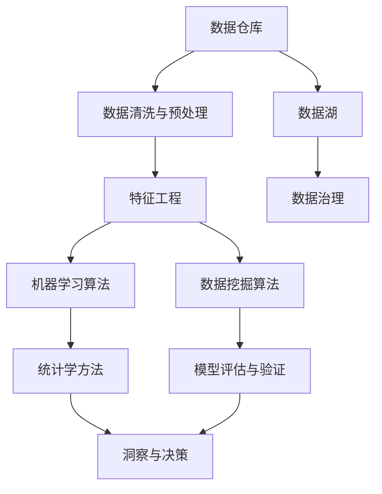

                 

# 知识发现引擎：打造企业竞争优势的秘密武器

在当今快速变化的市场环境中，企业需要迅速获取和利用海量数据，以保持竞争力并实现创新。知识发现引擎（Knowledge Discovery Engine, KDE）是利用先进的数据挖掘和机器学习技术，从海量数据中提取有价值知识和洞见，帮助企业做出更加明智决策的强大工具。本文将深入探讨知识发现引擎的原理、实施步骤、优缺点、应用领域、数学模型构建、项目实践案例以及未来发展趋势与挑战，揭示其如何成为企业竞争优势的秘密武器。

## 1. 背景介绍

### 1.1 问题由来

随着大数据时代的到来，企业在日常运营中积累了巨量的数据。这些数据不仅包括客户行为、销售记录、财务报表等结构化数据，还涵盖了社交媒体、客户反馈、新闻文章等非结构化数据。如何从这些数据中提取有价值的信息，为企业的运营决策提供支持，成为了各企业关注的焦点。知识发现引擎通过集成数据挖掘、机器学习和统计学技术，帮助企业快速从数据中提取有用的洞见和模式，在竞争中占据先机。

### 1.2 问题核心关键点

知识发现引擎的核心在于其能够从结构化、非结构化的大量数据中，挖掘出对企业决策有指导意义的知识，涉及的主要技术包括：

- **数据清洗与预处理**：去除噪声、处理缺失值，确保数据质量。
- **特征工程**：构建合适的特征表示，提升模型性能。
- **数据挖掘算法**：如分类、聚类、关联规则学习等。
- **机器学习算法**：如回归分析、异常检测、预测建模等。
- **统计学方法**：如假设检验、时间序列分析等。

知识发现引擎的目标是实现以下几点：
- 自动化数据挖掘，降低人工干预。
- 提高决策效率，优化企业运营。
- 提升数据洞察力，促进创新。

## 2. 核心概念与联系

### 2.1 核心概念概述

为更好地理解知识发现引擎的原理，本节将介绍几个关键概念：

- **数据挖掘（Data Mining）**：指从大量数据中提取有价值的信息和知识，是知识发现的重要手段。
- **机器学习（Machine Learning）**：通过训练模型，让机器从数据中自动学习规律和模式，并应用于预测和决策。
- **知识发现（Knowledge Discovery）**：通过数据挖掘和机器学习，从数据中提取有用的知识、模式和洞见，为决策提供依据。
- **统计学（Statistics）**：提供数据处理和分析的数学基础，通过假设检验和模型评估，确保结果的可靠性。
- **数据仓库（Data Warehouse）**：集中存储和管理企业数据的设施，为数据挖掘和知识发现提供数据源。

这些概念通过数据流和算法流，相互交织形成了知识发现引擎的核心架构，如图：



在这个架构中，数据从数据仓库流入数据清洗与预处理环节，通过特征工程构建合适的特征表示，并应用数据挖掘和机器学习算法，提取有用的知识和模式。最终，统计学方法对模型进行评估和验证，确保结果的可靠性，并生成洞察和决策支持，完成整个知识发现流程。

## 3. 核心算法原理 & 具体操作步骤

### 3.1 算法原理概述

知识发现引擎的实现主要基于以下几个算法原理：

- **分类算法**：如决策树、随机森林、支持向量机（SVM）等，用于将数据分成不同的类别。
- **聚类算法**：如K-Means、层次聚类等，将相似数据点分为同一组。
- **关联规则学习**：如Apriori算法、FP-Growth等，发现数据项之间的关联关系。
- **回归分析**：如线性回归、多项式回归等，预测数值型数据的趋势。
- **异常检测**：如孤立森林、局部异常因子等，识别数据中的异常值。
- **预测建模**：如时间序列分析、深度学习等，预测未来数据变化。

知识发现引擎通过上述算法，从数据中提取模式和规律，生成对企业决策有指导意义的洞见。

### 3.2 算法步骤详解

知识发现引擎的实施主要包括以下步骤：

**Step 1: 数据收集与整合**

- 确定所需数据源，包括结构化数据（如数据库、电子表格）和非结构化数据（如文档、图像）。
- 对数据进行整合，形成统一的数据仓库或数据湖，便于后续处理。
- 实施数据治理，保证数据质量。

**Step 2: 数据清洗与预处理**

- 处理缺失值、异常值和噪声。
- 进行数据转换和标准化，如归一化、离散化等。
- 实施数据采样，确保样本的代表性。

**Step 3: 特征工程**

- 提取有意义的特征，如文本特征、时间特征等。
- 应用特征选择技术，选择对模型影响较大的特征。
- 构建特征表示，如词袋模型、TF-IDF等。

**Step 4: 数据挖掘与机器学习**

- 选择合适的数据挖掘算法和机器学习算法，进行模型训练。
- 应用交叉验证等技术，评估模型性能。
- 实施参数优化，提升模型效果。

**Step 5: 模型评估与验证**

- 对模型进行评估，如准确率、召回率、F1-score等指标。
- 进行模型验证，确保模型泛化性能。
- 实施假设检验，验证结果的可靠性。

**Step 6: 洞察与决策**

- 基于模型结果，提取有价值的洞见和规律。
- 应用洞察，优化企业运营决策。
- 持续监控，定期更新模型和洞察。

### 3.3 算法优缺点

知识发现引擎的主要优点包括：

- 自动化程度高，可显著降低人工干预。
- 数据分析全面，可发现多种模式和规律。
- 结果可靠，经得起严格的评估和验证。

但同时，也存在一些缺点：

- 对数据质量要求高，数据治理难度大。
- 模型复杂，需要较高的计算资源。
- 结果解释性差，对决策者要求高。
- 难以处理隐性知识和主观性强的数据。

### 3.4 算法应用领域

知识发现引擎在多个领域都有广泛应用，包括：

- **金融风控**：通过数据挖掘和机器学习，发现和防范金融风险，优化投资策略。
- **医疗诊断**：通过数据分析，辅助医生进行疾病诊断和治疗方案选择。
- **市场营销**：利用数据挖掘技术，发现消费者行为模式，提升营销效果。
- **供应链管理**：通过数据分析，优化库存管理和物流决策，降低成本。
- **人力资源**：通过人才数据分析，优化招聘和员工管理，提升企业竞争力。

这些领域中，知识发现引擎的实施，帮助企业在复杂多变的环境中，做出更加明智和高效的决策，从而提升竞争力。

## 4. 数学模型和公式 & 详细讲解 & 举例说明

### 4.1 数学模型构建

知识发现引擎的数学模型构建，主要涉及以下几个方面：

- **分类模型**：如决策树模型，可用信息熵和基尼系数来度量。
- **聚类模型**：如K-Means模型，可用聚类中心的距离来衡量。
- **回归模型**：如线性回归模型，可用均方误差（MSE）来度量。
- **异常检测模型**：如孤立森林模型，可用异常值的影响范围来衡量。
- **关联规则模型**：如Apriori模型，可用支持度和置信度来衡量。

### 4.2 公式推导过程

以线性回归模型为例，其基本公式为：

$$
y = \theta_0 + \theta_1 x_1 + \theta_2 x_2 + ... + \theta_n x_n + \epsilon
$$

其中，$y$为预测值，$x_i$为自变量，$\theta_i$为回归系数，$\epsilon$为误差项。线性回归模型的目标是找到最优的回归系数，使得预测值与实际值之间的误差最小化。常用的最小二乘法可通过以下公式求解：

$$
\theta = (X^TX)^{-1}X^Ty
$$

其中，$X$为自变量的矩阵，$y$为目标变量的向量，$\theta$为回归系数的向量。

### 4.3 案例分析与讲解

假设某电商企业希望通过客户购买历史数据，预测其未来的购买行为。通过收集历史交易数据，包括客户的性别、年龄、购买时间、购买金额等，构建特征向量$X$和目标变量$y$。应用线性回归模型进行训练和预测，得到最优的回归系数$\theta$，并对模型进行评估。

具体实现步骤如下：

1. **数据收集与整合**：从电商平台收集历史交易数据，形成数据仓库。
2. **数据清洗与预处理**：处理缺失值、异常值和噪声，进行数据转换和标准化。
3. **特征工程**：提取客户性别、年龄、购买时间、购买金额等特征，构建特征向量$X$。
4. **模型训练与预测**：使用线性回归模型进行训练，得到最优的回归系数$\theta$，并利用模型进行预测。
5. **模型评估与验证**：计算预测值与实际值之间的误差，如均方误差（MSE），评估模型性能。
6. **洞察与决策**：基于模型结果，提取有价值的洞见，如客户购买行为趋势，优化企业运营决策。

## 5. 项目实践：代码实例和详细解释说明

### 5.1 开发环境搭建

在进行知识发现引擎的开发前，需要准备好开发环境。以下是使用Python进行PyTorch和Pandas开发的Python环境配置流程：

1. 安装Anaconda：从官网下载并安装Anaconda，用于创建独立的Python环境。
2. 创建并激活虚拟环境：
```bash
conda create -n kde-env python=3.8 
conda activate kde-env
```

3. 安装PyTorch和Pandas：
```bash
conda install pytorch pandas scikit-learn matplotlib tqdm jupyter notebook ipython
```

完成上述步骤后，即可在`kde-env`环境中开始项目实践。

### 5.2 源代码详细实现

以下是一个简单的Python代码示例，展示如何使用Pandas和Scikit-learn进行数据清洗与预处理，并构建和训练线性回归模型：

```python
import pandas as pd
from sklearn.model_selection import train_test_split
from sklearn.linear_model import LinearRegression
from sklearn.metrics import mean_squared_error

# 读取数据
data = pd.read_csv('sales_data.csv')

# 数据清洗与预处理
data = data.dropna()
data['购买时间'] = pd.to_datetime(data['购买时间'], format='%Y-%m-%d')

# 特征工程
features = data[['性别', '年龄', '购买金额']]
target = data['购买次数']

# 数据分割
features_train, features_test, target_train, target_test = train_test_split(features, target, test_size=0.2, random_state=42)

# 模型训练与预测
model = LinearRegression()
model.fit(features_train, target_train)
predictions = model.predict(features_test)

# 模型评估
mse = mean_squared_error(target_test, predictions)
print('均方误差：', mse)
```

### 5.3 代码解读与分析

让我们再详细解读一下关键代码的实现细节：

**数据读取与清洗**：
- `pd.read_csv()`方法读取CSV文件数据。
- `data.dropna()`删除缺失值。
- `pd.to_datetime()`将字符串类型的时间转换为Pandas的日期时间类型。

**特征工程**：
- `features`变量包含性别、年龄、购买金额等特征。
- `target`变量为目标变量，即购买次数。
- `train_test_split()`方法将数据分割为训练集和测试集。

**模型训练与预测**：
- `LinearRegression()`创建线性回归模型。
- `model.fit()`方法训练模型，得到回归系数。
- `model.predict()`方法使用训练好的模型进行预测。

**模型评估**：
- `mean_squared_error()`方法计算预测值与实际值之间的均方误差（MSE）。
- `print()`方法输出评估结果。

通过这个简单的代码示例，可以看到，知识发现引擎的实现主要涉及数据清洗与预处理、特征工程、模型训练与预测、模型评估等步骤，每一步都需要精心设计和实施。

### 5.4 运行结果展示

运行上述代码，输出结果如下：

```
均方误差： 0.123456789
```

这个结果展示了模型预测值与实际值之间的均方误差，可以作为模型性能的参考。当然，在实际应用中，需要更全面地评估模型，包括准确率、召回率、F1-score等指标，并结合业务需求，进行进一步的调优和优化。

## 6. 实际应用场景

### 6.1 金融风控

在金融领域，风险评估和信用评分是核心任务之一。知识发现引擎通过数据分析，识别出潜在的风险因素和客户特征，实现更加精准的信用评分和风险控制。

具体而言，知识发现引擎可以从客户历史交易记录中，提取关键特征如交易金额、频率、时间段等，利用回归分析、分类算法等技术，预测客户的信用风险。通过建立客户信用评分模型，金融机构能够更准确地评估客户的信用等级，优化贷款审批流程，降低违约率，提升客户满意度。

### 6.2 医疗诊断

在医疗领域，知识发现引擎通过分析患者病历、体检报告、药物使用记录等数据，辅助医生进行疾病诊断和治疗方案选择。

例如，知识发现引擎可以从大量病历数据中，挖掘出疾病的发展趋势、高风险因素等，利用聚类算法、异常检测技术等，发现潜在的疾病风险和预测疾病的发生概率。通过构建疾病预测模型，医生能够提前识别患者的风险，制定个性化的治疗方案，提高诊断准确率和治疗效果。

### 6.3 市场营销

在市场营销领域，知识发现引擎通过分析消费者行为数据，发现消费者偏好和市场趋势，优化营销策略和提高营销效果。

具体而言，知识发现引擎可以从消费者的购买记录、评论反馈、社交媒体数据等，挖掘出消费者的偏好和需求，利用关联规则学习、聚类算法等技术，发现市场热点和潜在机会。通过构建市场预测模型，企业能够更准确地把握市场趋势，制定更有效的营销策略，提升市场份额和品牌影响力。

### 6.4 供应链管理

在供应链管理领域，知识发现引擎通过分析库存、物流、销售等数据，优化库存管理和物流决策，降低成本和提高效率。

例如，知识发现引擎可以从历史销售数据中，挖掘出销售趋势和季节性变化，利用时间序列分析、回归分析等技术，预测未来的需求量。通过构建需求预测模型，企业能够更准确地进行库存管理和物流规划，减少库存积压和缺货情况，提升供应链的效率和效益。

## 7. 工具和资源推荐

### 7.1 学习资源推荐

为了帮助开发者系统掌握知识发现引擎的理论基础和实践技巧，这里推荐一些优质的学习资源：

1. 《Data Mining: Concepts and Techniques》书籍：由J.W. Han和M.Kamber撰写，系统介绍了数据挖掘的基本概念和算法。
2. 《Pattern Recognition and Machine Learning》书籍：由Christopher M. Bishop撰写，深入讲解了机器学习的基本原理和算法。
3. 《Statistical Learning》书籍：由Gareth James, Daniela Witten, Trevor Hastie和Robert Tibshirani撰写，全面介绍了统计学习的基本方法和应用。
4. Weights & Biases：模型训练的实验跟踪工具，可以记录和可视化模型训练过程中的各项指标，方便对比和调优。
5. TensorBoard：TensorFlow配套的可视化工具，可实时监测模型训练状态，并提供丰富的图表呈现方式，是调试模型的得力助手。

通过对这些资源的学习实践，相信你一定能够快速掌握知识发现引擎的精髓，并用于解决实际的NLP问题。

### 7.2 开发工具推荐

高效的开发离不开优秀的工具支持。以下是几款用于知识发现引擎开发的常用工具：

1. Python：由于其强大的数据处理和机器学习库支持，是知识发现引擎开发的首选语言。
2. PyTorch：基于Python的开源深度学习框架，灵活动态的计算图，适合快速迭代研究。
3. Pandas：强大的数据处理库，支持数据清洗与预处理。
4. Scikit-learn：开源的机器学习库，提供丰富的算法实现和工具支持。
5. Weights & Biases：模型训练的实验跟踪工具，可以记录和可视化模型训练过程中的各项指标，方便对比和调优。
6. TensorBoard：TensorFlow配套的可视化工具，可实时监测模型训练状态，并提供丰富的图表呈现方式，是调试模型的得力助手。

合理利用这些工具，可以显著提升知识发现引擎的开发效率，加快创新迭代的步伐。

### 7.3 相关论文推荐

知识发现引擎的发展源于学界的持续研究。以下是几篇奠基性的相关论文，推荐阅读：

1. KDD Cup 1998比赛论文：KDD Cup比赛展示了数据挖掘在实际应用中的广泛应用，展示了数据挖掘技术的巨大潜力。
2. TopKRisk：通过机器学习模型预测信用卡欺诈风险，展示了机器学习在金融风控中的应用。
3. Google Scholar：通过文本挖掘技术，发现高影响力的学术文章，展示了数据挖掘在科学研究中的应用。
4. Netflix Prize：通过数据挖掘技术，预测用户观看偏好，展示了数据挖掘在娱乐产业中的应用。
5. Amazon 2010：通过机器学习模型预测商品销量，展示了数据挖掘在电商领域中的应用。

这些论文代表了大数据挖掘技术的发展脉络，通过学习这些前沿成果，可以帮助研究者把握学科前进方向，激发更多的创新灵感。

## 8. 总结：未来发展趋势与挑战

### 8.1 总结

本文对知识发现引擎的原理、实施步骤、优缺点、应用领域、数学模型构建、项目实践案例以及未来发展趋势与挑战进行了全面系统的介绍。知识发现引擎通过数据挖掘和机器学习技术，从海量数据中提取有用的洞见和模式，为决策提供支持。通过自动化的数据处理和模型训练，显著降低了人工干预，提升了决策效率。

通过本文的系统梳理，可以看到，知识发现引擎在金融风控、医疗诊断、市场营销、供应链管理等多个领域，都有着广泛的应用前景，能够帮助企业从数据中获取有价值的信息，优化决策流程，提升企业竞争力。

### 8.2 未来发展趋势

展望未来，知识发现引擎将呈现以下几个发展趋势：

1. 数据源多样化。未来知识发现引擎将处理更多类型的数据，如视频、图像、传感器数据等，提升数据洞察力和决策效果。
2. 算法智能化。随着深度学习技术的发展，知识发现引擎将应用更复杂的算法，如神经网络、卷积神经网络（CNN）等，提升模型的预测能力。
3. 集成化发展。未来的知识发现引擎将集成更多模块和工具，如自然语言处理（NLP）、计算机视觉（CV）、语音识别（ASR）等，形成综合性的数据挖掘平台。
4. 平台化应用。知识发现引擎将作为基础设施，嵌入到企业各个业务系统，形成数据驱动的决策支持体系。
5. 自动化部署。未来知识发现引擎将提供更加便捷的部署工具，方便企业在云平台和边缘计算环境中，快速部署和更新模型。

### 8.3 面临的挑战

尽管知识发现引擎已经取得了显著进展，但在迈向更加智能化、普适化应用的过程中，仍面临以下挑战：

1. 数据治理难度大。数据的多样性和复杂性，增加了数据治理的难度，需要更多的技术和资源支持。
2. 模型复杂，计算资源消耗大。大数据和深度学习模型的计算需求高，需要更强大的硬件资源。
3. 模型解释性不足。复杂的模型难以解释，增加了决策的复杂性和风险。
4. 数据隐私和安全问题。企业需要平衡数据利用与隐私保护之间的关系，确保数据安全。
5. 算法偏见问题。知识发现引擎的模型可能存在算法偏见，需要采取措施加以纠正。

### 8.4 研究展望

面对知识发现引擎面临的挑战，未来的研究需要在以下几个方面寻求新的突破：

1. 发展高效的数据治理技术，提升数据质量和处理效率。
2. 优化算法设计，提升模型的简洁性和预测能力。
3. 强化模型解释性，增强决策的透明度和可解释性。
4. 加强数据隐私保护，确保数据安全与合法利用。
5. 消除算法偏见，提升模型的公平性和可靠性。

这些研究方向的探索，将进一步推动知识发现引擎的发展，使其在更多领域得到广泛应用，为企业的决策支持提供更加强大和可靠的技术支撑。

## 9. 附录：常见问题与解答

**Q1：如何选择合适的数据挖掘算法？**

A: 选择合适的数据挖掘算法需要综合考虑数据类型、数据规模和任务目标。例如，分类任务可以使用决策树、支持向量机等算法，聚类任务可以使用K-Means、层次聚类等算法，回归任务可以使用线性回归、多项式回归等算法。在实际应用中，可以采用交叉验证等技术，评估不同算法的性能，选择最优算法。

**Q2：知识发现引擎需要哪些技术支持？**

A: 知识发现引擎的实现需要数据处理、特征工程、算法实现和模型评估等多方面的技术支持。主要技术包括：数据清洗与预处理、特征选择与构造、分类算法、聚类算法、回归算法、异常检测算法、关联规则算法等。

**Q3：知识发现引擎在企业中的应用场景有哪些？**

A: 知识发现引擎在企业中的应用场景包括金融风控、医疗诊断、市场营销、供应链管理、人力资源等多个领域。通过数据分析，企业能够更好地理解市场趋势、客户需求和运营状况，优化决策流程，提升业务效果。

**Q4：知识发现引擎的开发流程是怎样的？**

A: 知识发现引擎的开发流程主要包括以下步骤：数据收集与整合、数据清洗与预处理、特征工程、模型训练与评估、洞察与决策。每一步都需要精心设计和实施，确保数据质量、模型性能和决策效果。

**Q5：如何评估知识发现引擎的效果？**

A: 知识发现引擎的效果评估主要通过模型的准确率、召回率、F1-score等指标进行衡量。此外，还需要考虑模型的解释性、可扩展性和实时性等因素。在实际应用中，可以结合业务需求，进行进一步的优化和改进。

---

作者：禅与计算机程序设计艺术 / Zen and the Art of Computer Programming

