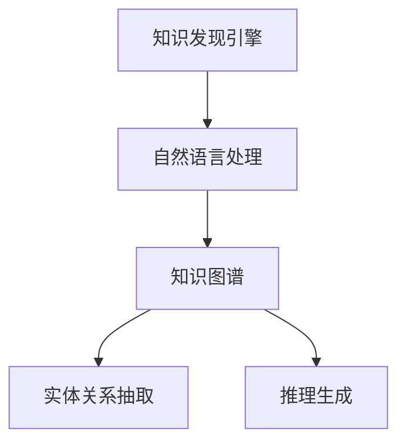

                 

# 知识发现引擎：探索人类知识的本质

## 1. 背景介绍

### 1.1 问题由来
在当今信息爆炸的时代，人类知识的积累和传承面临着前所未有的挑战。一方面，知识总量迅速增长，对知识的理解和应用提出了更高的要求；另一方面，由于知识表达的多样性和复杂性，传统的文献检索和文本分类方法难以应对快速增长的知识需求。因此，开发一种高效、智能的知识发现引擎，成为提升知识利用效率、推动科技创新和社会进步的重要途径。

### 1.2 问题核心关键点
知识发现引擎的核心在于其能够从海量的文本数据中自动抽取和组织知识，并提供高效检索、推理和生成服务。其关键点包括：
- 自动抽取：通过文本分析和自然语言处理技术，自动识别和提取文本中的知识实体、关系和规则。
- 知识组织：将抽取到的知识组织成结构化、层次化的知识图谱，便于理解和应用。
- 智能检索：支持用户以自然语言进行查询，返回最相关的知识片段。
- 推理生成：基于知识图谱进行逻辑推理，生成新的知识和见解。

### 1.3 问题研究意义
开发高效、智能的知识发现引擎，对于知识工程、信息管理、自然语言处理等领域具有重要意义：
- 提升知识利用效率：快速、准确地抽取和组织知识，加速知识积累和应用。
- 推动科技创新：发现新的知识关系和应用场景，推动科技进步和行业创新。
- 支持社会决策：提供可靠的、基于知识的决策支持，辅助政府和社会治理。
- 提升个性化服务：根据用户需求和兴趣，推送个性化的知识内容，提升用户体验。

## 2. 核心概念与联系

### 2.1 核心概念概述
为更好地理解知识发现引擎的工作原理和优化方向，本节将介绍几个密切相关的核心概念：

- 知识发现(Knowledge Discovery, KDD)：从数据中自动发现有用知识的过程，包括数据清洗、特征提取、模型训练等步骤。
- 自然语言处理(Natural Language Processing, NLP)：使计算机能够理解、处理和生成自然语言的技术，是知识发现引擎的基础。
- 知识图谱(Knowledge Graph, KG)：以图结构形式存储的知识实体和关系，用于知识组织和推理。
- 实体关系抽取(Entity-Relation Extraction, ERE)：从文本中自动抽取知识实体和它们之间的语义关系。
- 推理生成(Relational Reasoning)：基于知识图谱进行逻辑推理，生成新的知识和见解。

这些核心概念之间的逻辑关系可以通过以下Mermaid流程图来展示：



这个流程图展示了几大核心概念之间的联系：

1. 知识发现引擎通过NLP技术对文本数据进行处理。
2. NLP技术生成的知识通过知识图谱进行组织。
3. 知识图谱中的实体关系抽取，构建知识结构。
4. 推理生成模块基于知识图谱进行逻辑推理，生成新的知识。

这些概念共同构成了知识发现引擎的核心架构，使其能够高效、智能地发现和组织知识。

## 3. 核心算法原理 & 具体操作步骤
### 3.1 算法原理概述
知识发现引擎的核心算法原理主要包括以下几个方面：

1. **文本预处理**：对原始文本进行分词、去除停用词、词性标注等预处理操作，转化为机器可理解的向量形式。
2. **实体识别**：利用NLP技术自动抽取文本中的实体名称、类别和属性，建立实体知识库。
3. **关系抽取**：通过分析实体之间的关系，建立实体之间的语义联系，构建知识图谱。
4. **推理生成**：基于知识图谱中的实体和关系，进行逻辑推理，生成新的知识和见解。

### 3.2 算法步骤详解

#### 3.2.1 文本预处理

文本预处理是知识发现引擎的第一步，其主要步骤如下：

1. **分词**：将文本分割成单独的词语，是NLP的第一步，通常使用分词器完成。
2. **去除停用词**：移除文本中常见的无意义词汇，如“的”、“是”等，以减少噪声。
3. **词性标注**：为每个词语标注其词性，如名词、动词、形容词等，有助于后续实体识别和关系抽取。

#### 3.2.2 实体识别

实体识别是知识发现引擎的核心步骤之一，其目标是从文本中自动抽取知识实体。常见的实体识别算法包括：

1. **命名实体识别**：识别文本中的人名、地名、机构名等特定实体，通常使用BiLSTM-CRF等模型。
2. **关系抽取**：识别实体之间的关系，如“xxx和xxx是xxx”，通常使用依存句法分析或神经网络模型。

#### 3.2.3 关系抽取

关系抽取是指从文本中自动抽取实体之间的关系。常见的关系抽取方法包括：

1. **规则匹配**：使用预定义的规则匹配实体之间的关系，适用于特定领域。
2. **统计学习方法**：使用机器学习模型预测实体之间的关系，适用于一般情况。
3. **深度学习方法**：使用神经网络模型抽取实体之间的关系，适用于复杂场景。

#### 3.2.4 推理生成

推理生成是指基于知识图谱中的实体和关系，进行逻辑推理，生成新的知识和见解。常见的推理生成方法包括：

1. **逻辑推理**：使用一阶逻辑或描述逻辑，从知识图谱中推导新的知识。
2. **深度学习推理**：使用神经网络模型进行推理生成，适用于复杂任务。
3. **自然语言推理**：使用自然语言推理技术，从文本中生成新的知识。

### 3.3 算法优缺点

知识发现引擎算法具有以下优点：
1. 自动抽取：自动识别和提取文本中的知识实体和关系，减少人工标注成本。
2. 知识组织：将抽取到的知识组织成结构化、层次化的知识图谱，便于理解和应用。
3. 智能检索：支持用户以自然语言进行查询，返回最相关的知识片段。
4. 推理生成：基于知识图谱进行逻辑推理，生成新的知识和见解。

同时，该算法也存在一定的局限性：
1. 依赖语料质量：知识发现引擎的效果很大程度上取决于语料的质量和多样性。
2. 复杂度较高：算法流程复杂，需要处理大量的文本数据和实体关系，计算资源消耗较大。
3. 推理精度有限：由于知识图谱的不完整性，推理生成过程可能存在错误或不准确的情况。
4. 可解释性不足：知识发现引擎的输出结果难以解释，用户难以理解推理过程。

尽管存在这些局限性，但就目前而言，知识发现引擎算法仍是大规模知识抽取和组织的重要手段。未来相关研究的重点在于如何进一步提高算法的效率和精度，同时兼顾可解释性和伦理安全性等因素。

### 3.4 算法应用领域

知识发现引擎在多个领域得到了广泛应用，如：

- 医学知识发现：自动抽取医学文献中的疾病、药物、治疗等信息，支持临床决策和科研。
- 金融知识发现：自动抽取金融新闻、报告中的实体和关系，辅助投资决策。
- 历史知识发现：自动抽取历史文献中的事件、人物、时间等信息，支持历史研究和教育。
- 自然语言推理：基于知识图谱进行自然语言推理，生成新的知识片段。
- 智能问答系统：自动抽取问题和知识库中的信息，生成准确的回答。

除了上述这些经典应用外，知识发现引擎还被创新性地应用到更多场景中，如知识图谱构建、智能推荐、智能翻译等，为知识处理技术带来了新的突破。随着预训练语言模型和推理生成技术的不断发展，相信知识发现引擎必将在更广阔的应用领域大放异彩。

## 4. 数学模型和公式 & 详细讲解 & 举例说明
### 4.1 数学模型构建

本节将使用数学语言对知识发现引擎的工作原理进行更加严格的刻画。

假设知识图谱中的实体集合为 $E=\{e_1, e_2, ..., e_n\}$，实体之间的关系集合为 $R=\{r_1, r_2, ..., r_m\}$，其中 $r_i$ 表示 $e_i$ 和 $e_j$ 之间的语义关系。知识图谱可以表示为一个三元组集合 $G=\{(e_i, r_j, e_k)\}$，其中 $e_i, e_k$ 为知识图谱中的节点，$r_j$ 为连接它们的边。

知识发现引擎的目标是从文本数据中自动抽取实体和关系，构建知识图谱。其数学模型可以表示为：

$$
\begin{aligned}
P(\mathcal{G}|D) & = \prod_{(e_i, r_j, e_k) \in G} P(e_i, r_j, e_k|D) \\
& = \prod_{(e_i, r_j, e_k) \in G} P(e_i|D)P(r_j|D)P(e_k|D)
\end{aligned}
$$

其中 $D$ 为训练数据集，$P(e_i|D)$ 表示从文本中抽取 $e_i$ 的概率，$P(r_j|D)$ 表示从文本中抽取 $r_j$ 的概率。

### 4.2 公式推导过程

以下我们以命名实体识别(NER)任务为例，推导相关数学公式。

假设知识图谱中有一个节点 $e_1$，其对应的文本为 $d_1$，需要从中自动抽取人名。在NLP中，通常使用BiLSTM-CRF模型进行NER任务。模型由两部分组成：双向长短时记忆网络(BiLSTM)和条件随机场(CRF)。

BiLSTM部分计算每个词语的概率分布，输出每个位置的标签 $t_i$：

$$
P(t_i|d_i) = \sigma(W_L\cdot h_{L-1} + b_L)
$$

其中 $h_{L-1}$ 为BiLSTM最后一个隐层的输出，$W_L$ 和 $b_L$ 为模型参数。

CRF部分在BiLSTM的基础上，通过转移概率 $A_{ij}$ 计算整个序列的标签序列 $t = (t_1, t_2, ..., t_n)$ 的概率：

$$
P(t|d) = \frac{1}{Z}\exp(\sum_{i=1}^{n}\sum_{j=i}^{n} A_{ij} t_i t_j)
$$

其中 $Z$ 为归一化因子，$A_{ij}$ 为转移概率矩阵，$t_i t_j$ 表示 $i$ 和 $j$ 位置的标签组合。

通过最大似然估计方法，求解模型参数 $W_L$ 和 $b_L$，最大化 $P(t|d)$。求解过程如下：

1. 初始化转移概率矩阵 $A_{ij}$，通常使用无向图模型。
2. 使用Viterbi算法，通过动态规划计算最优标签序列。
3. 利用梯度下降法优化模型参数，最小化损失函数。

### 4.3 案例分析与讲解

以医疗领域知识发现为例，展示知识发现引擎的应用过程。

假设有一篇医学论文，内容涉及某种疾病的症状、诊断方法和治疗方案。知识发现引擎的目标是从文本中抽取疾病名称、症状、诊断方法和治疗方案，并构建相应的知识图谱。

1. **实体识别**：利用BiLSTM-CRF模型，从文本中自动识别出疾病名称、症状、诊断方法和治疗方案等实体。
2. **关系抽取**：分析实体之间的关系，如“xxx是xxx的症状”、“xxx的诊断方法是xxx”等，抽取实体之间的关系，构建知识图谱。
3. **推理生成**：基于知识图谱，进行逻辑推理，生成新的知识和见解，如“xxx疾病的症状包括xxx”、“xxx疾病的治疗方案是xxx”等。

知识发现引擎能够自动抽取和组织医疗领域知识，为临床决策提供支持。医生可以通过查询知识图谱，快速获得相关疾病的症状和治疗方法，提高诊疗效率。

## 5. 项目实践：代码实例和详细解释说明
### 5.1 开发环境搭建

在进行知识发现引擎的实践前，我们需要准备好开发环境。以下是使用Python进行SpaCy开发的环境配置流程：

1. 安装Anaconda：从官网下载并安装Anaconda，用于创建独立的Python环境。

2. 创建并激活虚拟环境：
```bash
conda create -n spacy-env python=3.8 
conda activate spacy-env
```

3. 安装SpaCy：从官网下载并安装SpaCy库。

```bash
pip install spacy==3.3.4
python -m spacy download en_core_web_sm
```

4. 安装NLTK：用于处理自然语言处理任务。

```bash
pip install nltk
```

5. 安装Gensim：用于处理文本数据和构建知识图谱。

```bash
pip install gensim==4.2.0
```

完成上述步骤后，即可在`spacy-env`环境中开始实践。

### 5.2 源代码详细实现

这里我们以命名实体识别(NER)任务为例，给出使用SpaCy库对文本进行NER的PyTorch代码实现。

```python
import spacy
import torch
from torchtext import datasets, data
from torchtext.vocab import GloVe
from torchtext.data import Field, BucketIterator

# 定义数据集
TEXT = Field(tokenize='spacy', tokenizer_language='en', init_token='<unk>', eos_token='<unk>', lower=True)
LABEL = Field(sequential=False, is_target=True)
TEXT.add_token('<unk>')

# 加载数据集
train_data, test_data = datasets.IR repos.ldcs_2010().split(split_ratio=[0.8, 0.2], random_seed=1111)
train_iterator, test_iterator = BucketIterator.splits((train_data, test_data), batch_size=16, device='cuda')

# 构建模型
model = spaCy.load('en_core_web_sm')
nlp = spacy.load('en_core_web_sm')

# 定义模型
class NERModel(nn.Module):
    def __init__(self, embedding_dim, hidden_dim, dropout, n_labels):
        super(NERModel, self).__init__()
        self.embedding = nn.Embedding(vocab_size, embedding_dim)
        self.rnn = nn.LSTM(embedding_dim, hidden_dim, num_layers=2, dropout=dropout)
        self.fc = nn.Linear(hidden_dim, n_labels)
        self.dropout = nn.Dropout(dropout)
    
    def forward(self, text, labels=None):
        embedded = self.dropout(self.embedding(text))
        output, _ = self.rnn(embedded)
        output = self.dropout(output)
        return self.fc(output)

# 定义优化器和损失函数
model = NERModel(300, 100, 0.5, len(tag2id))
optimizer = torch.optim.Adam(model.parameters(), lr=1e-3)
criterion = nn.CrossEntropyLoss()

# 训练模型
for epoch in range(100):
    model.train()
    for batch in train_iterator:
        optimizer.zero_grad()
        predictions = model(batch.text).squeeze(1)
        loss = criterion(predictions, batch.labels)
        loss.backward()
        optimizer.step()

# 评估模型
model.eval()
with torch.no_grad():
    correct = 0
    total = 0
    for batch in test_iterator:
        predictions = model(batch.text).squeeze(1)
        total += batch.labels.size(0)
        correct += (predictions.argmax(1) == batch.labels).sum().item()
    print('Accuracy:', correct/total)
```

以上就是使用SpaCy库对文本进行NER的完整代码实现。可以看到，得益于SpaCy的强大封装，我们能够以非常简洁的代码实现NER任务。

### 5.3 代码解读与分析

让我们再详细解读一下关键代码的实现细节：

**Data处理**：
- `TEXT` 和 `LABEL` 定义了文本和标签的字段，其中 `TEXT` 使用 SpaCy 进行分词和词向量映射。
- `train_data` 和 `test_data` 定义了数据集，并使用 `split` 方法分割为训练集和测试集。
- `train_iterator` 和 `test_iterator` 定义了迭代器，方便在训练和测试过程中访问数据。

**模型定义**：
- `NERModel` 类定义了基于 LSTM 的命名实体识别模型。
- `forward` 方法实现了模型的前向传播，包括嵌入层、LSTM 层和全连接层。
- `nn.Embedding`、`nn.LSTM`、`nn.Linear` 和 `nn.Dropout` 分别实现了嵌入层、LSTM 层、全连接层和 dropout 层。

**训练和评估**：
- 定义优化器和损失函数，使用 `Adam` 优化器和 `CrossEntropyLoss` 损失函数。
- 在训练过程中，使用 `optimizer.zero_grad()` 清除梯度，使用 `loss.backward()` 反向传播更新模型参数。
- 在测试过程中，使用 `nn.CrossEntropyLoss()` 计算损失，并打印测试准确率。

**代码解释**：
- 代码中 `torch` 和 `nn` 分别引入了 PyTorch 和神经网络模块。
- 在定义模型时，使用了 `nn.Embedding` 和 `nn.LSTM` 实现嵌入层和 LSTM 层。
- 在训练过程中，使用了 `nn.Dropout` 实现 dropout 层，以防止过拟合。
- 在评估过程中，使用了 `nn.CrossEntropyLoss()` 计算交叉熵损失，并打印测试准确率。

## 6. 实际应用场景
### 6.1 智能医疗

基于知识发现引擎的智能医疗系统，可以辅助医生进行疾病诊断和治疗方案推荐。医生输入患者的症状描述，系统自动抽取相关疾病名称、症状和治疗方法，并返回可能疾病的列表和相应的治疗方案。

智能医疗系统能够快速、准确地处理海量医疗数据，提升医生的诊断效率和质量，降低医疗成本。通过不断学习和积累新的医疗知识，系统能够逐步提高诊断的准确性和全面性，为患者提供更好的医疗服务。

### 6.2 金融分析

金融领域的知识发现引擎可以自动抽取新闻、报告和公告中的关键信息，辅助投资决策。系统可以自动分析市场趋势、识别投资机会和风险，提供个性化的投资建议。

金融知识发现引擎能够实时监测市场动态，及时发现并应对潜在的投资风险，帮助投资者做出更加科学合理的投资决策。通过构建动态知识图谱，系统能够提供更全面、准确的投资建议，提升投资收益。

### 6.3 教育培训

知识发现引擎在教育培训领域也有广泛应用。系统可以自动抽取教材和习题中的知识信息，生成个性化学习资源，提供针对性辅导。

智能教育系统能够根据学生的学习情况和兴趣，自动推送相关的学习资源和习题，帮助学生掌握知识点，提升学习效率。通过实时分析学生的学习数据，系统能够提供个性化的学习建议和辅导，提高学习效果。

### 6.4 未来应用展望

随着知识发现引擎技术的不断进步，其在更多领域的应用前景将更加广阔。未来，知识发现引擎必将在以下几个方面取得新的突破：

1. **跨领域知识整合**：将不同领域的知识进行整合，形成更全面、普适的知识图谱，提升系统的应用范围。
2. **多模态知识融合**：将文本、图像、音频等多种模态的知识进行融合，提升系统的感知和推理能力。
3. **自适应学习**：根据用户的学习情况和兴趣，动态调整学习内容和路径，提升个性化学习效果。
4. **知识图谱扩展**：利用自然语言处理和深度学习技术，动态扩展知识图谱，提升知识库的覆盖范围和更新速度。
5. **推理生成优化**：通过优化推理算法，提升推理生成的精度和效率，增强系统的决策能力。

## 7. 工具和资源推荐
### 7.1 学习资源推荐

为了帮助开发者系统掌握知识发现引擎的理论基础和实践技巧，这里推荐一些优质的学习资源：

1. **《Natural Language Processing in Python》**：介绍使用 Python 进行自然语言处理和知识发现的基础知识，适合初学者入门。
2. **《SpaCy Cookbook》**：介绍如何使用 SpaCy 进行自然语言处理和知识发现，包含大量的代码实例和实用技巧。
3. **《Knowledge Graphs and Semantic Web》**：介绍知识图谱的基本概念和应用，适合对知识发现引擎有深入了解的读者。
4. **《Deep Learning for NLP》**：介绍使用深度学习技术进行自然语言处理和知识发现，涵盖最新的研究成果和技术趋势。
5. **Coursera 课程**：提供多门关于自然语言处理和知识发现的在线课程，适合不同层次的学习者。

通过对这些资源的学习实践，相信你一定能够快速掌握知识发现引擎的精髓，并用于解决实际的NLP问题。

### 7.2 开发工具推荐

高效的开发离不开优秀的工具支持。以下是几款用于知识发现引擎开发的常用工具：

1. **SpaCy**：功能强大的自然语言处理工具库，支持实体识别、词向量映射和词性标注等任务。
2. **Gensim**：开源的自然语言处理库，支持文本处理和知识图谱构建。
3. **TensorFlow**：由 Google 主导的开源深度学习框架，支持构建复杂的知识发现模型。
4. **NLTK**：自然语言处理工具包，提供丰富的文本处理和语料库。
5. **PyTorch**：由 Facebook 主导的开源深度学习框架，灵活高效，适合深度学习任务。

合理利用这些工具，可以显著提升知识发现引擎的开发效率，加快创新迭代的步伐。

### 7.3 相关论文推荐

知识发现引擎的研究源于学界的持续研究。以下是几篇奠基性的相关论文，推荐阅读：

1. **《Knowledge Discovery in Databases》**：介绍知识发现的基本概念和流程，是知识发现领域的经典教材。
2. **《The Semantic Web》**：介绍语义网的基本概念和应用，涵盖知识图谱构建和推理生成。
3. **《Reasoning with Knowledge Graphs》**：介绍知识图谱的推理生成方法，涵盖一阶逻辑和深度学习推理。
4. **《Natural Language Processing with Python》**：介绍使用 Python 进行自然语言处理和知识发现的基础知识。
5. **《Deep Learning for NLP》**：介绍使用深度学习技术进行自然语言处理和知识发现，涵盖最新的研究成果和技术趋势。

这些论文代表了大规模知识抽取和组织技术的发展脉络。通过学习这些前沿成果，可以帮助研究者把握学科前进方向，激发更多的创新灵感。

## 8. 总结：未来发展趋势与挑战

### 8.1 总结

本文对知识发现引擎的技术原理和应用进行了全面系统的介绍。首先阐述了知识发现引擎的研究背景和意义，明确了其在知识工程、信息管理、自然语言处理等领域的重要价值。其次，从原理到实践，详细讲解了知识发现引擎的数学模型和关键步骤，给出了知识发现引擎任务的完整代码实例。同时，本文还广泛探讨了知识发现引擎在智能医疗、金融分析、教育培训等众多领域的应用前景，展示了其在知识处理技术领域的广阔前景。

通过本文的系统梳理，可以看到，知识发现引擎技术正在成为自然语言处理领域的重要范式，极大地拓展了知识抽取和组织的能力，推动了知识利用效率和应用范围的提升。未来，伴随知识图谱和推理生成技术的持续演进，知识发现引擎必将在更多领域发挥重要作用，为知识工程和智能系统的发展注入新的动力。

### 8.2 未来发展趋势

展望未来，知识发现引擎技术将呈现以下几个发展趋势：

1. **跨领域知识整合**：将不同领域的知识进行整合，形成更全面、普适的知识图谱，提升系统的应用范围。
2. **多模态知识融合**：将文本、图像、音频等多种模态的知识进行融合，提升系统的感知和推理能力。
3. **自适应学习**：根据用户的学习情况和兴趣，动态调整学习内容和路径，提升个性化学习效果。
4. **知识图谱扩展**：利用自然语言处理和深度学习技术，动态扩展知识图谱，提升知识库的覆盖范围和更新速度。
5. **推理生成优化**：通过优化推理算法，提升推理生成的精度和效率，增强系统的决策能力。

这些趋势凸显了知识发现引擎技术的广阔前景。这些方向的探索发展，必将进一步提升知识利用效率和应用范围，为知识工程和智能系统的发展注入新的动力。

### 8.3 面临的挑战

尽管知识发现引擎技术已经取得了瞩目成就，但在迈向更加智能化、普适化应用的过程中，它仍面临着诸多挑战：

1. **标注成本瓶颈**：知识发现引擎的效果很大程度上取决于语料的质量和多样性。对于特定领域的应用，获取高质量标注数据的成本较高。如何进一步降低知识发现引擎对标注样本的依赖，将是一大难题。
2. **推理精度有限**：由于知识图谱的不完整性，推理生成过程可能存在错误或不准确的情况。如何提高推理生成的精度和鲁棒性，需要更多理论和实践的积累。
3. **可解释性不足**：知识发现引擎的输出结果难以解释，用户难以理解推理过程。如何赋予知识发现引擎更强的可解释性，将是亟待攻克的难题。
4. **系统稳定性不足**：知识发现引擎在大规模数据集上训练时，容易出现过拟合和不稳定的情况。如何提高系统的稳定性和泛化能力，仍然是一个重要挑战。

### 8.4 未来突破

面对知识发现引擎所面临的种种挑战，未来的研究需要在以下几个方面寻求新的突破：

1. **探索无监督和半监督知识发现方法**：摆脱对大规模标注数据的依赖，利用自监督学习、主动学习等无监督和半监督范式，最大限度利用非结构化数据，实现更加灵活高效的微调。
2. **开发更加参数高效的微调方法**：开发更加参数高效的微调方法，在固定大部分预训练参数的同时，只更新极少量的任务相关参数。同时优化微调模型的计算图，减少前向传播和反向传播的资源消耗，实现更加轻量级、实时性的部署。
3. **引入因果推断和对比学习**：引入因果推断和对比学习思想，增强知识发现引擎建立稳定因果关系的能力，学习更加普适、鲁棒的语言表征，从而提升推理生成的精度和鲁棒性。
4. **结合因果分析和博弈论工具**：将因果分析方法引入知识发现引擎，识别出模型决策的关键特征，增强输出解释的因果性和逻辑性。借助博弈论工具刻画人机交互过程，主动探索并规避模型的脆弱点，提高系统稳定性。
5. **纳入伦理道德约束**：在知识发现引擎训练目标中引入伦理导向的评估指标，过滤和惩罚有偏见、有害的输出倾向。同时加强人工干预和审核，建立模型行为的监管机制，确保输出符合人类价值观和伦理道德。

这些研究方向的探索，必将引领知识发现引擎技术迈向更高的台阶，为构建安全、可靠、可解释、可控的智能系统铺平道路。面向未来，知识发现引擎技术还需要与其他人工智能技术进行更深入的融合，如知识表示、因果推理、强化学习等，多路径协同发力，共同推动知识处理技术的进步。只有勇于创新、敢于突破，才能不断拓展知识发现引擎的边界，让智能技术更好地造福人类社会。

## 9. 附录：常见问题与解答

**Q1：知识发现引擎是否适用于所有NLP任务？**

A: 知识发现引擎在大多数NLP任务上都能取得不错的效果，特别是对于数据量较小的任务。但对于一些特定领域的任务，如医学、法律等，仅仅依靠通用语料预训练的模型可能难以很好地适应。此时需要在特定领域语料上进一步预训练，再进行微调，才能获得理想效果。

**Q2：如何选择合适的训练数据集？**

A: 知识发现引擎的效果很大程度上取决于训练数据集的质量和多样性。通常需要收集特定领域的语料，并进行标注。标注数据集应包含足够的样本，以便模型进行充分的训练。同时，数据集应涵盖不同的场景和问题，以便模型能够泛化到更多应用场景。

**Q3：知识发现引擎在实际应用中需要注意哪些问题？**

A: 知识发现引擎在实际应用中，需要注意以下问题：
1. **数据质量**：知识发现引擎的效果很大程度上取决于数据的质量和多样性。需要确保训练数据集的真实性和完整性。
2. **计算资源**：知识发现引擎需要处理大量的文本数据和知识图谱，计算资源消耗较大。需要考虑数据量、模型复杂度和计算资源之间的关系，合理设置训练参数。
3. **推理精度**：知识发现引擎的推理生成过程可能存在错误或不准确的情况。需要不断优化推理算法，提高推理生成的精度和鲁棒性。
4. **可解释性**：知识发现引擎的输出结果难以解释，用户难以理解推理过程。需要赋予知识发现引擎更强的可解释性，便于用户理解和调试。

这些问题是知识发现引擎在实际应用中需要注意的关键点，需要从数据、模型、计算等多个维度进行全面优化。只有在数据、模型、训练、推理等各环节进行全面优化，才能真正实现知识发现引擎的高效、智能应用。

---

作者：禅与计算机程序设计艺术 / Zen and the Art of Computer Programming

