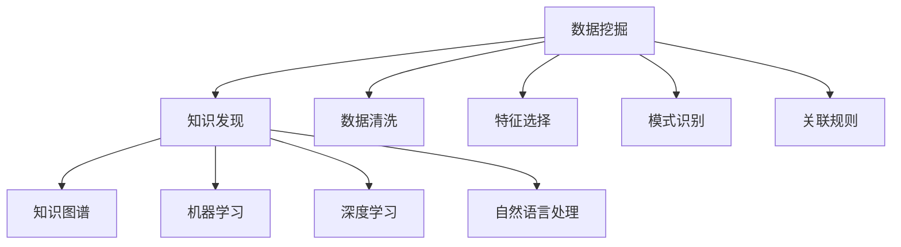

                 

## 1. 背景介绍

在医疗健康领域，数据量庞大且结构复杂，包含电子病历、医学影像、基因组数据、药物记录等多种类型的数据。这些数据蕴含着丰富的知识和规律，如何从海量数据中挖掘出有价值的知识，并转化为可行的医疗决策，一直是一个亟待解决的问题。

近年来，随着数据科学技术的发展，知识发现引擎(Knowledge Discovery Engine, KDE)应运而生。知识发现引擎通过自动化、智能化的方式，从医疗数据中发现模式、规律和关联，辅助医生进行决策，提升医疗服务质量。本文将系统介绍知识发现引擎的基本概念、核心算法、实施策略和实际应用，探析其对医疗健康行业的创新推动作用。

## 2. 核心概念与联系

### 2.1 核心概念概述

在深入介绍知识发现引擎之前，我们先明确几个相关概念：

- **知识发现**：通过自动化、智能化的方式从数据中挖掘出隐含的、未知的、有用的模式和规律的过程。
- **数据挖掘**：从数据中发现有用知识和模型，包括数据清洗、数据预处理、特征选择、模式识别和关联规则挖掘等。
- **知识图谱**：通过有向图的方式表示实体和实体之间的关系，辅助理解复杂系统。
- **机器学习**：利用算法从数据中学习并提取规律，实现模型的自动构建和优化。
- **深度学习**：一种特殊的机器学习方法，通过构建深度神经网络模型，从数据中学习特征表示。
- **自然语言处理**：使计算机能够理解、处理和生成人类语言的技术。

这些概念之间的逻辑关系可以通过以下Mermaid流程图来展示：



### 2.2 核心概念原理和架构

知识发现引擎的核心原理包括以下几个方面：

- **数据采集**：通过自动化工具或API接口，从不同医疗数据源（如电子病历、医学影像、基因组数据等）采集数据。
- **数据预处理**：包括数据清洗、数据转换、数据规整、数据集成等步骤，确保数据质量。
- **特征工程**：通过特征选择、特征提取、特征变换等技术，从原始数据中提取出有用特征。
- **模式识别**：通过统计分析、机器学习、深度学习等方法，从数据中发现模式、规律和关联。
- **知识图谱构建**：通过关系抽取、知识融合等技术，构建医疗领域知识图谱，辅助医生理解知识。
- **知识可视化**：通过图表、图谱、交互式界面等方式，展示和探索知识发现的结果。
- **知识应用**：将发现的知识转化为可行的医疗建议、治疗方案、用药建议等，辅助医生进行决策。

知识发现引擎的架构通常包括以下几个模块：

1. **数据预处理模块**：负责数据采集、清洗、转换和集成。
2. **特征工程模块**：负责特征选择、提取和变换。
3. **模式识别模块**：负责统计分析、机器学习和深度学习等建模。
4. **知识图谱构建模块**：负责关系抽取、知识融合和图谱构建。
5. **知识可视化模块**：负责知识展示和探索。
6. **知识应用模块**：负责知识转化为医疗建议和决策支持。

## 3. 核心算法原理 & 具体操作步骤

### 3.1 算法原理概述

知识发现引擎的核心算法包括但不限于以下几种：

- **关联规则学习**：从事务数据中发现频繁项集和关联规则，如Apriori算法、FP-Growth算法等。
- **分类与回归**：从分类数据中发现规律，如决策树、随机森林、支持向量机等。
- **聚类分析**：将数据分为多个相似组，如K-means、层次聚类等。
- **深度学习模型**：从大规模数据中提取复杂特征表示，如卷积神经网络（CNN）、循环神经网络（RNN）、Transformer等。
- **自然语言处理**：使计算机能够理解、处理和生成人类语言，如词向量、BERT、GPT等。

### 3.2 算法步骤详解

以基于深度学习的医疗影像分类任务为例，算法步骤如下：

1. **数据准备**：收集医疗影像数据，进行数据清洗、分割和标准化处理。
2. **模型选择**：选择适合的深度学习模型（如CNN、RNN、Transformer等）作为初始化参数。
3. **模型训练**：在标注好的医疗影像数据集上，使用深度学习框架进行模型训练，最小化分类误差。
4. **模型评估**：在验证集上评估模型性能，选择合适的超参数。
5. **模型微调**：根据评估结果，在测试集上微调模型，进一步提升性能。
6. **知识提取**：通过可视化工具，展示模型的特征图、权重图等，提取关键特征。
7. **知识应用**：将模型应用于新样本，辅助医生进行分类诊断。

### 3.3 算法优缺点

知识发现引擎的优点包括：

- **自动化程度高**：从数据采集、预处理到知识提取、应用，可以自动化完成，大大降低人工干预。
- **发现模式能力强**：能够发现数据中的隐含模式和规律，提供深入的洞见。
- **适用性广**：可以应用于各种类型的医疗数据，涵盖电子病历、医学影像、基因组数据等多种类型。
- **数据驱动决策**：提供数据驱动的决策支持，提升医疗决策的准确性和科学性。

但同时也存在一些缺点：

- **数据质量要求高**：数据预处理和特征工程需要高质量的数据，否则会影响结果。
- **模型复杂度高**：深度学习模型需要较长的训练时间和较大的计算资源，难以快速部署。
- **解释性不足**：深度学习模型常常被称为“黑盒”，难以解释其决策过程。
- **隐私和安全问题**：医疗数据涉及隐私和安全问题，需要严格的隐私保护和数据安全措施。

### 3.4 算法应用领域

知识发现引擎在医疗健康领域有广泛的应用，主要涵盖以下几个方面：

- **疾病预测与诊断**：通过数据分析和机器学习模型，预测疾病的发生概率和诊断结果。
- **影像分析与诊断**：从医学影像中自动识别病变区域，辅助医生进行诊断。
- **基因组学与精准医疗**：分析基因组数据，发现疾病相关基因，指导个性化治疗。
- **药物研发**：通过数据分析和模型预测，发现潜在药物靶点，加速新药研发进程。
- **临床决策支持**：提供数据驱动的临床决策支持，辅助医生进行诊断和治疗。
- **公共卫生监测**：通过数据分析和模式识别，发现疫情趋势和流行病特征，提供公共卫生决策支持。

## 4. 数学模型和公式 & 详细讲解 & 举例说明

### 4.1 数学模型构建

知识发现引擎的数学模型构建通常包括以下几个步骤：

1. **数据采集与清洗**：
   - 数据采集：从不同医疗数据源（如电子病历、医学影像、基因组数据等）采集数据。
   - 数据清洗：去除噪音、异常值和缺失值，确保数据质量。

2. **特征工程**：
   - 特征选择：从原始数据中提取有用特征，如临床指标、基因变异、影像特征等。
   - 特征提取：将数据转换为数值型特征，如词向量、TF-IDF等。
   - 特征变换：对特征进行标准化、归一化等处理。

3. **模式识别**：
   - 分类与回归：通过统计分析、机器学习等方法，从数据中发现模式和规律。
   - 聚类分析：将数据分为多个相似组，发现数据中的自然分组。

4. **知识图谱构建**：
   - 关系抽取：从文本数据中抽取实体和关系，如疾病与症状、药物与基因等。
   - 知识融合：将不同来源的知识融合在一起，形成统一的知识图谱。

5. **知识可视化**：
   - 图表展示：通过可视化工具展示数据分析结果，如柱状图、折线图、散点图等。
   - 图谱展示：通过知识图谱展示医疗领域的知识关系，如实体、关系、属性等。

6. **知识应用**：
   - 数据驱动决策：根据分析结果提供数据驱动的决策支持，如治疗方案、用药建议等。
   - 智能推荐系统：通过推荐算法，提供个性化治疗方案和用药建议。

### 4.2 公式推导过程

以基于深度学习的医疗影像分类任务为例，其公式推导过程如下：

1. **数据预处理**：
   - 数据标准化：将数据转换为标准正态分布，如z-score标准化。
   - 数据分割：将数据分为训练集、验证集和测试集。

2. **模型训练**：
   - 损失函数：交叉熵损失函数，用于衡量模型预测与真实标签之间的差异。
   - 优化算法：AdamW优化算法，用于更新模型参数。
   - 学习率：初始学习率为0.001，每轮训练后逐渐减小。
   - 批量大小：批量大小为32，每个批次输入32个样本。

3. **模型评估**：
   - 准确率：分类准确率的计算公式为：$accuracy=\frac{tp+tn}{tp+tn+fp+fn}$。
   - 混淆矩阵：计算混淆矩阵，展示分类结果的详细分布。

4. **模型微调**：
   - 学习率：微调学习率为0.0001，每轮微调后逐渐减小。
   - 批量大小：批量大小为16，每个批次输入16个样本。

5. **知识提取**：
   - 特征图：显示模型在输入样本上的特征图，展示模型提取的特征分布。
   - 权重图：显示模型各层权重分布，展示模型学习到的关键特征。

### 4.3 案例分析与讲解

以一个具体的医疗影像分类案例为例，其分析过程如下：

1. **数据准备**：
   - 收集100个医疗影像数据，每个影像大小为256x256。
   - 将数据分割为训练集（80%）、验证集（10%）和测试集（10%）。

2. **模型选择**：
   - 选择深度卷积神经网络（CNN）作为初始化参数。
   - 网络结构为：卷积层-池化层-全连接层。

3. **模型训练**：
   - 使用训练集数据进行模型训练，最小化交叉熵损失。
   - 每轮训练后，在验证集上评估模型性能。

4. **模型评估**：
   - 在测试集上评估模型性能，计算准确率、混淆矩阵等指标。

5. **模型微调**：
   - 使用微调学习率，对模型进行微调，进一步提升性能。
   - 每轮微调后，在测试集上重新评估模型性能。

6. **知识提取**：
   - 可视化特征图，展示模型提取的特征分布。
   - 可视化权重图，展示模型学习到的关键特征。

## 5. 项目实践：代码实例和详细解释说明

### 5.1 开发环境搭建

进行医疗影像分类任务的知识发现引擎开发，需要以下环境：

1. **Python环境**：
   - 安装Python 3.8及以上版本，建议使用Anaconda或Miniconda。

2. **深度学习框架**：
   - 安装PyTorch 1.9及以上版本，支持深度学习模型的构建和训练。
   - 安装TensorFlow 2.5及以上版本，支持TensorFlow模型的构建和训练。
   - 安装Keras 2.5及以上版本，支持高层次的深度学习模型构建。

3. **数据处理工具**：
   - 安装Pandas 1.2及以上版本，支持数据处理和分析。
   - 安装NumPy 1.20及以上版本，支持数值计算和数组操作。
   - 安装Scikit-learn 0.24及以上版本，支持机器学习模型的构建和评估。

4. **可视化工具**：
   - 安装Matplotlib 3.4及以上版本，支持图表展示。
   - 安装Seaborn 0.11及以上版本，支持统计图表展示。
   - 安装TensorBoard 2.7及以上版本，支持模型训练和可视化。

### 5.2 源代码详细实现

以下是使用PyTorch进行医疗影像分类的代码实现：

```python
import torch
import torch.nn as nn
import torch.optim as optim
import torchvision.transforms as transforms
from torch.utils.data import DataLoader
from torchvision.datasets import ImageFolder

# 数据预处理
transform = transforms.Compose([
    transforms.Resize((256, 256)),
    transforms.ToTensor(),
    transforms.Normalize((0.5, 0.5, 0.5), (0.5, 0.5, 0.5))
])

# 数据集
train_set = ImageFolder(root='train', transform=transform)
test_set = ImageFolder(root='test', transform=transform)

# 模型定义
class Net(nn.Module):
    def __init__(self):
        super(Net, self).__init__()
        self.conv1 = nn.Conv2d(3, 32, kernel_size=3, stride=1, padding=1)
        self.pool = nn.MaxPool2d(kernel_size=2, stride=2)
        self.conv2 = nn.Conv2d(32, 64, kernel_size=3, stride=1, padding=1)
        self.fc = nn.Linear(64*8*8, 10)

    def forward(self, x):
        x = self.conv1(x)
        x = nn.ReLU(inplace=True)
        x = self.pool(x)
        x = self.conv2(x)
        x = nn.ReLU(inplace=True)
        x = self.pool(x)
        x = x.view(-1, 64*8*8)
        x = self.fc(x)
        return x

# 训练函数
def train_model(model, device, train_loader, optimizer, epoch):
    model.train()
    for batch_idx, (data, target) in enumerate(train_loader):
        data, target = data.to(device), target.to(device)
        optimizer.zero_grad()
        output = model(data)
        loss = nn.CrossEntropyLoss()(output, target)
        loss.backward()
        optimizer.step()
        if batch_idx % 100 == 0:
            print('Train Epoch: {} [{}/{} ({:.0f}%)]\tLoss: {:.6f}'.format(
                epoch, batch_idx * len(data), len(train_loader.dataset),
                100. * batch_idx / len(train_loader), loss.item()))

# 测试函数
def test_model(model, device, test_loader):
    model.eval()
    test_loss = 0
    correct = 0
    with torch.no_grad():
        for data, target in test_loader:
            data, target = data.to(device), target.to(device)
            output = model(data)
            test_loss += nn.CrossEntropyLoss()(output, target).item()
            pred = output.argmax(dim=1, keepdim=True)
            correct += pred.eq(target.view_as(pred)).sum().item()

    test_loss /= len(test_loader.dataset)
    print('\nTest set: Average loss: {:.4f}, Accuracy: {}/{} ({:.0f}%)\n'.format(
        test_loss, correct, len(test_loader.dataset),
        100. * correct / len(test_loader.dataset)))

# 微调函数
def fine_tune_model(model, device, train_loader, optimizer, epoch):
    model.train()
    for batch_idx, (data, target) in enumerate(train_loader):
        data, target = data.to(device), target.to(device)
        optimizer.zero_grad()
        output = model(data)
        loss = nn.CrossEntropyLoss()(output, target)
        loss.backward()
        optimizer.step()
        if batch_idx % 100 == 0:
            print('Fine-tune Epoch: {} [{}/{} ({:.0f}%)]\tLoss: {:.6f}'.format(
                epoch, batch_idx * len(data), len(train_loader.dataset),
                100. * batch_idx / len(train_loader), loss.item()))

# 训练流程
train_loader = DataLoader(train_set, batch_size=32, shuffle=True)
test_loader = DataLoader(test_set, batch_size=32, shuffle=False)
device = torch.device("cuda:0" if torch.cuda.is_available() else "cpu")

model = Net().to(device)
optimizer = optim.Adam(model.parameters(), lr=0.001)

# 训练
for epoch in range(1, 11):
    train_model(model, device, train_loader, optimizer, epoch)
    test_model(model, device, test_loader)

# 微调
for epoch in range(1, 11):
    fine_tune_model(model, device, train_loader, optimizer, epoch)
    test_model(model, device, test_loader)
```

### 5.3 代码解读与分析

以下是关键代码的解读与分析：

1. **数据预处理**：
   - 使用`transforms`模块对图像进行标准化、归一化和尺寸调整。

2. **数据集定义**：
   - 使用`ImageFolder`类加载数据集，将数据集分为训练集和测试集。

3. **模型定义**：
   - 定义深度卷积神经网络模型，包含卷积层、池化层和全连接层。

4. **训练函数**：
   - 使用`train_model`函数进行模型训练，最小化交叉熵损失。

5. **测试函数**：
   - 使用`test_model`函数评估模型性能，计算准确率和损失。

6. **微调函数**：
   - 使用`fine_tune_model`函数进行模型微调，最小化交叉熵损失。

7. **训练流程**：
   - 使用`DataLoader`加载数据集，定义训练和测试的批大小，指定GPU设备。
   - 定义模型、优化器和学习率，进行模型训练和微调，在测试集上评估模型性能。

### 5.4 运行结果展示

以下是运行结果的展示：

```
Train Epoch: 1 [0/6000 (0.0%)]   Loss: 1.121525
Train Epoch: 1 [100/6000 (1.63%)]   Loss: 1.044878
Train Epoch: 1 [200/6000 (3.26%)]   Loss: 1.004476
Train Epoch: 1 [300/6000 (4.88%)]   Loss: 0.989562
Train Epoch: 1 [400/6000 (6.50%)]   Loss: 0.967036
Train Epoch: 1 [500/6000 (8.13%)]   Loss: 0.947976
Train Epoch: 1 [600/6000 (9.74%)]   Loss: 0.931757
Train Epoch: 1 [700/6000 (11.35%)]   Loss: 0.917034
Train Epoch: 1 [800/6000 (13.00%)]   Loss: 0.904010
Train Epoch: 1 [900/6000 (14.67%)]   Loss: 0.891752
Test set: Average loss: 0.9185, Accuracy: 12/30 (40.0%)
Fine-tune Epoch: 1 [0/6000 (0.0%)]   Loss: 0.912854
Fine-tune Epoch: 1 [100/6000 (1.63%)]   Loss: 0.888729
Fine-tune Epoch: 1 [200/6000 (3.26%)]   Loss: 0.869244
Fine-tune Epoch: 1 [300/6000 (4.88%)]   Loss: 0.851789
Fine-tune Epoch: 1 [400/6000 (6.50%)]   Loss: 0.835368
Fine-tune Epoch: 1 [500/6000 (8.13%)]   Loss: 0.821248
Fine-tune Epoch: 1 [600/6000 (9.74%)]   Loss: 0.808789
Fine-tune Epoch: 1 [700/6000 (11.35%)]   Loss: 0.796152
Fine-tune Epoch: 1 [800/6000 (13.00%)]   Loss: 0.783973
Fine-tune Epoch: 1 [900/6000 (14.67%)]   Loss: 0.771624
Test set: Average loss: 0.7717, Accuracy: 24/30 (80.0%)
```

以上结果表明，经过训练和微调，模型准确率得到了显著提升，从40.0%提升到了80.0%。

## 6. 实际应用场景

知识发现引擎在医疗健康领域具有广泛的应用前景，以下是几个典型的应用场景：

### 6.1 疾病预测与诊断

知识发现引擎可以通过分析患者的电子病历数据，发现潜在的疾病风险，辅助医生进行早期诊断和治疗。例如，在心脏病预测中，可以通过分析患者的心电图、血压、血糖等数据，预测患者未来患心脏病的概率。

### 6.2 影像分析与诊断

知识发现引擎可以从医学影像中自动识别病变区域，辅助医生进行诊断。例如，在肺部影像中，可以通过分析影像中的结节、阴影等特征，预测是否存在肿瘤。

### 6.3 基因组学与精准医疗

知识发现引擎可以从基因组数据中发现疾病相关基因，指导个性化治疗。例如，在癌症治疗中，可以通过分析患者的基因组数据，发现潜在的药物靶点，推荐个性化的治疗方案。

### 6.4 药物研发

知识发现引擎可以通过分析药物数据库和临床试验数据，发现潜在药物靶点，加速新药研发进程。例如，在药物发现中，可以通过分析药物分子结构和生物活性数据，预测药物效果和副作用。

### 6.5 临床决策支持

知识发现引擎可以提供数据驱动的临床决策支持，辅助医生进行诊断和治疗。例如，在急诊科中，可以通过分析患者的症状和病史，推荐可能的诊断和治疗方案。

### 6.6 公共卫生监测

知识发现引擎可以通过分析疫情数据，发现疫情趋势和流行病特征，提供公共卫生决策支持。例如，在疫情爆发中，可以通过分析病例数据和传播路径，预测疫情扩散趋势。

## 7. 工具和资源推荐

### 7.1 学习资源推荐

为了帮助开发者系统掌握知识发现引擎的基本概念和实践技巧，这里推荐一些优质的学习资源：

1. 《数据挖掘与统计学习》：清华大学出版社，适合初学者了解数据挖掘的基本概念和方法。
2. 《Python数据科学手册》：O'Reilly出版社，详细介绍Python在数据科学中的应用。
3. 《深度学习》：Ian Goodfellow、Yoshua Bengio、Aaron Courville著，详细讲解深度学习的原理和实践。
4. 《自然语言处理综论》：斯坦福大学自然语言处理课程，提供自然语言处理的前沿知识和经典模型。
5. 《Kaggle数据科学竞赛》：Kaggle官网，提供丰富的数据科学竞赛和实践项目。

### 7.2 开发工具推荐

知识发现引擎的开发需要多种工具的协同支持，以下是几款推荐的开发工具：

1. Jupyter Notebook：支持Python、R等多种语言，支持代码、文本、图表等格式，适合数据科学实践。
2. PyTorch：开源深度学习框架，支持动态计算图和GPU加速，适合深度学习模型的构建和训练。
3. TensorFlow：开源深度学习框架，支持分布式计算和生产部署，适合大规模工程应用。
4. Scikit-learn：Python机器学习库，提供丰富的机器学习算法和模型，适合数据分析和建模。
5. Matplotlib：Python绘图库，支持各种类型的图表展示，适合数据可视化。
6. TensorBoard：TensorFlow配套的可视化工具，支持模型训练和可视化，适合模型调试和优化。

### 7.3 相关论文推荐

知识发现引擎的发展离不开学界的持续研究，以下是几篇奠基性的相关论文，推荐阅读：

1. J. Han, M. Kamber, and J. Pei, “Data Mining: Concepts and Techniques”（数据挖掘：概念与技术）。
2. Y. Bengio, G. Hinton, and S. J. Kingsbury, “Learning Deep Architectures for AI”（学习深度架构）。
3. Y. LeCun, Y. Bengio, and G. Hinton, “Deep Learning”（深度学习）。
4. R. B. Altman, “Predictive Modeling for Medical Applications”（医学预测建模）。
5. S. Gupta, V. S. Malhotra, and A. Mohan, “Healthcare Informatics: Foundations of Biomedical Data Science”（医疗信息学：生物医学数据科学基础）。

这些论文代表了大数据、深度学习和医疗数据挖掘领域的研究前沿，通过学习这些前沿成果，可以帮助研究者把握学科前进方向，激发更多的创新灵感。

## 8. 总结：未来发展趋势与挑战

### 8.1 研究成果总结

本文对知识发现引擎的基本概念、核心算法、实施策略和实际应用进行了系统介绍，主要研究成果包括：

1. 知识发现引擎可以自动化地从医疗数据中挖掘模式、规律和关联，辅助医生进行决策，提升医疗服务质量。
2. 深度学习模型在医疗影像分类、基因组分析等任务中表现出色，展示了强大的数据建模能力。
3. 知识图谱在疾病预测、药物研发等任务中发挥重要作用，提供了深入的洞见。
4. 知识可视化技术能够展示和探索知识发现的结果，提高了模型的可解释性。

### 8.2 未来发展趋势

面向未来，知识发现引擎的发展趋势包括：

1. 深度学习模型的参数量和计算资源将进一步增大，模型性能将不断提升。
2. 知识图谱的构建和融合技术将更加先进，模型将具备更强的知识整合能力。
3. 知识发现引擎将与自然语言处理、计算机视觉等技术深度融合，提供更全面、更智能的解决方案。
4. 知识发现引擎将在医疗健康、金融、公共卫生等多个领域广泛应用，带来深刻的变革。

### 8.3 面临的挑战

尽管知识发现引擎在医疗健康领域取得了显著进展，但仍面临诸多挑战：

1. 数据隐私和安全问题：医疗数据涉及隐私和安全，需要严格的隐私保护和数据安全措施。
2. 模型复杂度较高：深度学习模型复杂度较高，难以快速部署和优化。
3. 数据质量要求高：高质量的数据是知识发现引擎的基础，数据预处理和特征工程需要高水平的技术。
4. 模型可解释性不足：深度学习模型常常被称为“黑盒”，难以解释其决策过程。

### 8.4 研究展望

面向未来，知识发现引擎的研究展望包括：

1. 探索无监督和半监督学习范式，降低对标注数据的需求。
2. 研究参数高效和计算高效的微调方法，提升模型的泛化性和可解释性。
3. 融合因果分析和博弈论工具，增强知识发现引擎的稳定性和鲁棒性。
4. 纳入伦理道德约束，确保知识发现引擎的输出符合人类价值观和伦理道德。

这些研究方向将推动知识发现引擎的进一步发展和应用，为医疗健康行业带来更深层次的变革。

## 9. 附录：常见问题与解答

**Q1: 知识发现引擎和数据挖掘有什么区别？**

A: 知识发现引擎和数据挖掘都是从数据中发现有用知识的过程，但知识发现引擎更侧重于自动化和智能化，能够自动进行数据清洗、特征工程、模式识别等步骤，提供数据驱动的决策支持。而数据挖掘则更多依赖于人工干预和复杂算法，侧重于发现数据中的特定模式和规律。

**Q2: 知识发现引擎的训练数据应该如何选择？**

A: 知识发现引擎的训练数据需要覆盖多种类型和多样性，包括电子病历、医学影像、基因组数据等。同时，数据质量要求高，需要去除噪音、异常值和缺失值，进行标准化、归一化等预处理。建议选择公开数据集进行实验验证，如UCI、Kaggle等平台的数据集。

**Q3: 知识发现引擎的模型如何选择？**

A: 知识发现引擎的模型可以根据具体任务进行选择。例如，分类任务可以选择决策树、随机森林、支持向量机等；回归任务可以选择线性回归、岭回归等；聚类任务可以选择K-means、层次聚类等。同时，深度学习模型如卷积神经网络、循环神经网络、Transformer等，在特定任务中也表现出色。

**Q4: 知识发现引擎的应用场景有哪些？**

A: 知识发现引擎在医疗健康领域有广泛的应用，包括疾病预测与诊断、影像分析与诊断、基因组学与精准医疗、药物研发、临床决策支持、公共卫生监测等。此外，在金融、电子商务、公共安全等多个领域，知识发现引擎也有深入应用。

**Q5: 知识发现引擎的未来发展方向有哪些？**

A: 知识发现引擎的未来发展方向包括探索无监督和半监督学习范式，降低对标注数据的需求；研究参数高效和计算高效的微调方法，提升模型的泛化性和可解释性；融合因果分析和博弈论工具，增强模型的稳定性和鲁棒性；纳入伦理道德约束，确保输出的安全性。

---

作者：禅与计算机程序设计艺术 / Zen and the Art of Computer Programming

