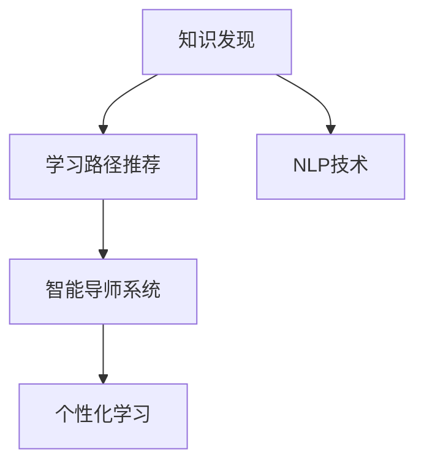

                 

# 知识发现引擎：教育领域的创新引擎

> 关键词：教育知识发现, 学习路径推荐, 智能导师系统, 个性化学习, 自然语言处理

## 1. 背景介绍

在快速变革的数字化时代，教育领域正经历着前所未有的挑战与机遇。传统的教育模式已难以适应技术驱动的知识生产与传播需求。如何在海量教育资源中发现知识、提供个性化学习路径、增强学习体验，成为了教育信息化转型的新课题。

知识发现引擎（Knowledge Discovery Engine, KDE）作为一种前沿的智能化工具，通过从海量数据中挖掘并整合知识，为用户提供定制化学习方案，引领教育领域的技术革新。本文将系统性地介绍KDE的核心概念、算法原理及应用实例，并探讨其在教育领域的具体实现与未来前景。

## 2. 核心概念与联系

### 2.1 核心概念概述

为了深入理解知识发现引擎的工作原理和架构，我们将重点介绍以下几个关键概念：

- **知识发现**：指从大规模数据中自动发现有用、新颖、可理解的知识。教育知识发现通常涉及学生学习记录、教学资源、评价反馈等数据。
- **学习路径推荐**：根据学生的知识背景、学习目标和兴趣，提供个性化、动态更新的学习路径。
- **智能导师系统**：结合KDE和自然语言处理技术，模仿人类导师提供个性化指导，辅助学生学习。
- **个性化学习**：根据每个学生的学习风格、认知水平和兴趣偏好，提供定制化的学习内容与节奏。
- **自然语言处理**：涉及文本数据的分析、理解和生成，是KDE进行知识提取和智能指导的重要手段。

这些概念之间的联系通过以下Mermaid流程图进行展示：



这个流程图揭示了KDE的核心技术路径：从知识发现出发，通过推荐学习路径和智能导师系统的辅助，实现个性化学习的目标。同时，自然语言处理技术在此过程中起到了关键支撑作用。

## 3. 核心算法原理 & 具体操作步骤

### 3.1 算法原理概述

知识发现引擎的核心算法主要包括数据挖掘、机器学习、自然语言处理等技术。其基本思路是：

1. **数据预处理**：清洗、标准化并整合教育相关的多源数据。
2. **特征提取**：从预处理后的数据中提取有意义的特征。
3. **知识发现**：利用机器学习算法对提取的特征进行建模，发现知识模式。
4. **路径推荐**：基于发现的知识模式，为每个学生推荐个性化学习路径。
5. **智能辅导**：利用自然语言处理技术，实现实时智能辅导和反馈。

### 3.2 算法步骤详解

下面详细介绍知识发现引擎的具体实现步骤：

**Step 1: 数据预处理**
- 数据采集：从学校管理系统、在线教育平台、学习管理系统等渠道收集学生学习记录、课程资源、教师评价等数据。
- 数据清洗：去除噪声、缺失值、重复值，确保数据质量。
- 数据标准化：统一数据格式和单位，便于后续处理。
- 数据整合：将不同来源的数据整合到一个统一的数据仓库中。

**Step 2: 特征提取**
- 提取学生特征：包括学号、年龄、性别、学习风格等。
- 提取课程特征：包括课程内容、难度、教师评价等。
- 提取学习行为特征：包括学习时间、提交作业情况、在线讨论参与度等。
- 特征组合：将学生特征和课程特征组合，形成多个维度的特征向量。

**Step 3: 知识发现**
- 选择算法：常用的算法包括决策树、随机森林、神经网络、关联规则等。
- 训练模型：使用历史数据训练机器学习模型，发现知识模式。
- 验证模型：使用验证集评估模型性能，调整参数。

**Step 4: 路径推荐**
- 路径构建：根据知识模式，构建多条可能的个性化学习路径。
- 路径评估：根据学生特征和学习目标，评估每条路径的适宜度。
- 路径推荐：选择最适合学生的学习路径，并动态调整。

**Step 5: 智能辅导**
- 自然语言处理：利用NLP技术，分析学生问题，提供即时解答。
- 反馈机制：根据学习进度和评价反馈，调整学习路径和难度。
- 数据更新：定期更新数据仓库，补充最新教育资源和学生信息。

### 3.3 算法优缺点

知识发现引擎在教育领域的应用具有以下优点：
1. **个性化学习**：通过分析学生特征和历史行为，实现个性化的学习路径推荐。
2. **实时辅导**：利用自然语言处理技术，提供即时反馈和指导。
3. **数据驱动**：基于大数据分析，发现并应用教育知识模式。

同时，也存在以下缺点：
1. **数据依赖性**：依赖高质量、多样化的教育数据。
2. **模型复杂性**：算法复杂度高，对计算资源要求较高。
3. **隐私保护**：处理教育数据需要严格遵守隐私保护规定。
4. **可解释性**：机器学习模型的决策过程缺乏可解释性。

尽管存在这些局限性，但知识发现引擎仍然被认为是在教育领域实现智能化、个性化教学的重要工具。

### 3.4 算法应用领域

知识发现引擎在教育领域的应用主要集中在以下几个方面：

- **K-12教育**：提供个性化的学习方案，提升学习效率和成果。
- **高等教育**：支持选课规划、毕业设计指导等。
- **职业培训**：提供技能学习路径，促进职业发展。
- **继续教育**：提供灵活、自主的学习方式，满足终身学习需求。

此外，知识发现引擎在企业培训、在线教育平台等场景中也有广泛应用，助力各类教育机构提升教学质量和管理水平。

## 4. 数学模型和公式 & 详细讲解 & 举例说明

### 4.1 数学模型构建

知识发现引擎的核心数学模型可以概括为以下几个步骤：

1. **数据表示**：将教育数据表示为向量形式，如学生特征向量、课程特征向量、学习行为向量等。
2. **特征选择**：从所有特征中选择最重要的特征，如PCA、LDA等降维算法。
3. **知识发现模型**：使用决策树、随机森林、神经网络等算法，构建知识发现模型。
4. **路径推荐模型**：基于知识发现模型，构建个性化学习路径推荐模型。

### 4.2 公式推导过程

以决策树算法为例，我们推导一下核心公式：

- **信息增益**：
$$
Gain(D, A) = \sum_{v=1}^{|V|} \frac{|D_v|}{|D|} \times Ent(D_v)
$$
其中，$D$ 为数据集，$A$ 为属性，$D_v$ 为属性 $A$ 取值 $v$ 的数据子集，$|D|$ 为数据集大小，$|D_v|$ 为子集大小，$Ent(D_v)$ 为子集的熵。

- **信息增益比**：
$$
IG(D, A) = \frac{Gain(D, A)}{IV(A)}
$$
其中，$IV(A)$ 为属性 $A$ 的信息增益。

- **分裂信息**：
$$
Cost(D, v) = \frac{1}{|D_v|} \times |D_v| + \lambda \times |D_v|
$$
其中，$\lambda$ 为分裂代价。

### 4.3 案例分析与讲解

以学生学习行为分析为例，我们通过以下案例进行分析：

- **数据预处理**：从学生学习管理系统收集历史成绩、学习时间、学习平台使用情况等数据。
- **特征提取**：提取学生学习行为的平均成绩、学习时间分布、平台使用频率等特征。
- **知识发现**：使用决策树算法，对学生学习行为进行分类，识别出不同学习风格的学生群体。
- **路径推荐**：根据不同学习风格的学生，推荐相应的学习路径，如深度学习、数据分析、编程基础等。
- **智能辅导**：通过NLP技术，分析学生在平台上的提问，提供相关课程和资源推荐。

## 5. 项目实践：代码实例和详细解释说明

### 5.1 开发环境搭建

为了进行知识发现引擎的实践，我们需要搭建一个基于Python的开发环境，具体步骤如下：

1. 安装Python和必要的依赖库，如Pandas、NumPy、Scikit-Learn、TensorFlow等。
2. 使用Jupyter Notebook或PyCharm等IDE进行开发。
3. 配置数据存储和计算资源，如使用Hadoop、Spark等大数据处理平台。

### 5.2 源代码详细实现

以下是一个简单的知识发现引擎示例代码，用于分析和推荐学习路径：

```python
import pandas as pd
from sklearn.model_selection import train_test_split
from sklearn.tree import DecisionTreeClassifier
from sklearn.metrics import accuracy_score

# 加载数据
data = pd.read_csv('student_data.csv')

# 数据预处理
X = data[['average_score', 'study_time', 'platform_frequency']]
y = data['learning_style']

# 特征选择
X = pd.get_dummies(X)

# 训练模型
X_train, X_test, y_train, y_test = train_test_split(X, y, test_size=0.3, random_state=42)
clf = DecisionTreeClassifier()
clf.fit(X_train, y_train)

# 评估模型
y_pred = clf.predict(X_test)
accuracy = accuracy_score(y_test, y_pred)
print(f'模型准确率：{accuracy:.3f}')

# 路径推荐
learning_path = ['数据科学', '机器学习', '深度学习']
recommended_path = clf.predict([[3.5, 3, 0.5]])
print(f'推荐路径：{learning_path[recommended_path]}')
```

### 5.3 代码解读与分析

- **数据预处理**：使用Pandas库进行数据加载和预处理，包括数据清洗和特征选择。
- **模型训练**：使用Scikit-Learn库中的决策树分类器，进行模型训练和评估。
- **路径推荐**：基于训练好的模型，对新的学生数据进行路径推荐。

## 6. 实际应用场景

### 6.1 智能课堂

在智能课堂中，知识发现引擎可以实时分析学生的学习状态，根据课堂反馈和成绩，动态调整教学内容和难度。例如，对于经常提问的学生，系统会推荐相关课程和资源，辅助教师进行个性化的教学辅导。

### 6.2 在线教育平台

在线教育平台利用知识发现引擎，为用户提供个性化推荐课程和资源，帮助其更好地掌握学习内容。通过学习路径的动态调整，学生可以更高效地完成学习目标。

### 6.3 职业培训

在职业培训领域，知识发现引擎可以根据学员的学习进度和兴趣，推荐适合的培训课程和项目，加速技能提升和职业转型。

### 6.4 未来应用展望

未来，知识发现引擎将在以下几个方面进一步发展：

- **多模态数据融合**：结合图像、视频、语音等多种数据形式，更全面地分析学生的学习状态。
- **自适应学习**：通过持续学习算法，实现动态调整学习路径和难度。
- **虚拟助教**：利用自然语言处理技术，实现虚拟助教进行实时答疑和辅导。
- **跨平台集成**：与多种学习平台和资源进行无缝集成，提供一站式学习服务。

## 7. 工具和资源推荐

### 7.1 学习资源推荐

为了帮助开发者掌握知识发现引擎的核心技术，我们推荐以下学习资源：

1. 《Python数据科学手册》：涵盖数据处理、机器学习、自然语言处理等技术，是入门数据科学的经典书籍。
2. Coursera上的《机器学习》课程：由斯坦福大学教授Andrew Ng主讲，深入浅出地讲解机器学习算法。
3. Kaggle：提供丰富的数据集和竞赛，实战练习知识发现和路径推荐。
4. TensorFlow官方文档：提供详细的API文档和示例代码，学习TensorFlow进行机器学习建模。
5. NLTK自然语言处理库：提供丰富的NLP功能，包括文本分析、情感分析、词向量等。

### 7.2 开发工具推荐

以下是几款常用的知识发现引擎开发工具：

1. PyTorch：灵活的深度学习框架，支持多种机器学习算法和NLP技术。
2. Jupyter Notebook：交互式开发环境，支持Python代码的实时展示和调试。
3. Scikit-Learn：简单易用的机器学习库，提供了多种常用算法和评估工具。
4. TensorFlow：强大的深度学习框架，支持分布式训练和模型优化。
5. NLTK和SpaCy：常用的自然语言处理库，提供丰富的文本处理功能。

### 7.3 相关论文推荐

以下是几篇关于知识发现引擎的经典论文，推荐阅读：

1. 《数据挖掘：概念与技术》：全面介绍数据挖掘和知识发现的基本原理和方法。
2. 《面向数据挖掘和统计学习的Python编程》：通过Python实现数据挖掘算法的实例教程。
3. 《个性化学习路径推荐算法研究》：探讨了基于知识图谱和机器学习的个性化学习路径推荐方法。
4. 《自然语言处理与教育技术》：探讨了NLP技术在教育领域的应用，包括智能导师系统和学习路径推荐。
5. 《智能教育技术：应用与挑战》：分析了智能教育技术在实践中的挑战和解决方案。

## 8. 总结：未来发展趋势与挑战

### 8.1 研究成果总结

本文介绍了知识发现引擎在教育领域的应用，从算法原理、操作步骤到实际应用场景，全面阐述了其核心技术。通过项目实践，展示了知识发现引擎的代码实现过程。我们认为，知识发现引擎是实现个性化学习和智能教学的重要工具，能够显著提升教育效果和效率。

### 8.2 未来发展趋势

未来，知识发现引擎将在以下几个方面进一步发展：

1. **多模态数据融合**：结合多种数据类型，更全面地分析学生的学习状态。
2. **自适应学习**：通过持续学习算法，实现动态调整学习路径和难度。
3. **虚拟助教**：利用自然语言处理技术，实现虚拟助教进行实时答疑和辅导。
4. **跨平台集成**：与多种学习平台和资源进行无缝集成，提供一站式学习服务。

### 8.3 面临的挑战

尽管知识发现引擎在教育领域有广泛的应用前景，但仍面临以下挑战：

1. **数据隐私和安全**：处理教育数据需要严格遵守隐私保护规定。
2. **数据质量和多样性**：依赖高质量、多样化的教育数据。
3. **算法复杂性**：算法复杂度高，对计算资源要求较高。
4. **可解释性**：机器学习模型的决策过程缺乏可解释性。

### 8.4 研究展望

面对知识发现引擎在教育领域的应用挑战，未来的研究需要在以下几个方面寻求新的突破：

1. **数据隐私保护**：研究如何在保障数据隐私的前提下，实现数据的有效利用。
2. **算法优化**：开发高效、可解释的算法，降低计算资源需求。
3. **跨学科融合**：将教育学、心理学等多学科知识与技术结合，提升学习效果。
4. **虚拟助教系统**：实现虚拟助教系统，提供全天候、个性化的学习支持。

通过不断探索和优化，知识发现引擎必将在教育领域发挥更大的作用，推动教育信息化向更深层次发展。

## 9. 附录：常见问题与解答

**Q1: 知识发现引擎是否适用于所有教育场景？**

A: 知识发现引擎在大多数教育场景下都适用，但需要根据具体需求进行定制化调整。例如，在基础教育中，侧重于学习路径推荐和智能辅导；在高等教育和职业培训中，侧重于课程推荐和项目指导。

**Q2: 如何提高知识发现引擎的准确性？**

A: 提高知识发现引擎的准确性需要从多个方面入手，包括数据预处理、特征选择、模型优化和路径推荐算法等。具体措施包括：
- 清洗和标准化数据，确保数据质量。
- 选择有意义的特征，减少噪声。
- 使用更复杂的模型，如随机森林、神经网络等。
- 动态调整路径推荐算法，实现个性化学习。

**Q3: 知识发现引擎在实践中的挑战有哪些？**

A: 知识发现引擎在实践中的主要挑战包括：
- 数据隐私和安全问题：需严格遵守数据隐私保护法规。
- 数据质量和多样性：需要高质量、多样化的数据。
- 算法复杂性：算法复杂度高，对计算资源要求较高。
- 可解释性：机器学习模型的决策过程缺乏可解释性。

**Q4: 如何构建知识发现引擎的推荐系统？**

A: 构建知识发现引擎的推荐系统需要以下步骤：
1. 数据预处理：清洗和标准化数据。
2. 特征选择：选择有意义的特征。
3. 模型训练：使用机器学习算法训练推荐模型。
4. 路径推荐：根据历史行为和学习目标，推荐个性化学习路径。
5. 智能辅导：利用自然语言处理技术，提供实时答疑和反馈。

**Q5: 如何保护教育数据隐私？**

A: 保护教育数据隐私需要采取以下措施：
- 数据匿名化：去除或模糊化敏感信息，确保数据隐私。
- 数据访问控制：限制数据访问权限，防止数据泄露。
- 数据加密：对存储和传输的数据进行加密，保障数据安全。
- 合规审查：定期审查数据处理流程，确保符合隐私保护法规。

通过这些措施，可以在保障教育数据隐私的前提下，实现知识发现引擎的高效应用。

---

作者：禅与计算机程序设计艺术 / Zen and the Art of Computer Programming

