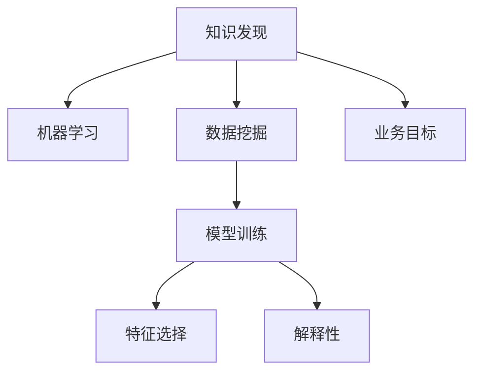

                 

# 知识发现引擎：知识与洞察力的协同发展

## 1. 背景介绍

### 1.1 问题由来

随着大数据时代的到来，知识发现(Knowledge Discovery)已成为各行业关注的热点问题。传统的数据分析方法通常依赖专家经验和领域知识，难以挖掘出潜在的关联模式和隐藏信息。而基于机器学习和数据挖掘技术的知识发现引擎，通过自动化、智能化的方式，能够从海量数据中提取知识，辅助人类决策，推动科学发现和技术进步。

在现代科技、金融、医疗、商业等多个领域，知识发现引擎已经成为不可或缺的决策工具。例如，通过分析医疗数据，可以发现新的治疗方案和药物效果；通过挖掘金融数据，可以预测市场走势和风险趋势；通过分析商业数据，可以优化营销策略和提升客户满意度。这些领域内知识发现引擎的应用，揭示了海量数据中蕴含的巨大价值，正在为各行各业带来颠覆性的变革。

### 1.2 问题核心关键点

知识发现引擎的核心问题在于如何高效、准确地从大量数据中发现隐含的知识和规律。其核心步骤包括：

1. **数据预处理**：清洗、整理、归一化数据，以提高数据质量。
2. **特征工程**：提取和选择有意义的特征，为后续建模提供输入。
3. **模型训练与优化**：选择合适的算法和模型，训练并优化模型，以提高预测准确性。
4. **知识抽取与解释**：从模型输出中提取知识，并对其进行解释和验证。

对于知识发现引擎的成功应用，特征工程、模型选择和优化、结果解释三个环节尤为关键。选择合适的算法和模型，提取有效的特征，优化模型参数，生成易于理解和使用的知识，是提升知识发现引擎性能的重要步骤。

### 1.3 问题研究意义

研究知识发现引擎，对于提升各行业的数据分析能力、优化决策流程、促进科学发现和技术进步，具有重要意义：

1. 提升决策质量：知识发现引擎能够从大数据中提取隐含的知识和模式，辅助决策者做出更科学、更准确的决策。
2. 优化运营效率：通过预测分析，知识发现引擎可以提前识别潜在的风险和机会，优化资源配置，提升运营效率。
3. 推动创新：知识发现引擎能够揭示数据中的潜在联系，辅助科学家的研究探索，加速新技术、新方法的创新应用。
4. 创造价值：在金融、医疗、商业等领域，知识发现引擎已经展现出强大的商业价值，通过挖掘数据洞察力，创造出新的商业模式和盈利机会。
5. 适应未来趋势：知识发现引擎是智能数据时代的必然产物，将随着人工智能技术的进步，不断拓展其应用范围和深度，为未来发展奠定坚实基础。

## 2. 核心概念与联系

### 2.1 核心概念概述

为了更好地理解知识发现引擎，我们将介绍几个密切相关的核心概念：

- **知识发现(Knowledge Discovery)**：从大量数据中自动抽取隐含的知识和规律，并形成易于理解和使用的结论。
- **机器学习(Machine Learning)**：通过数据驱动的方法，使机器能够自动学习和改进，无需人工干预。
- **数据挖掘(Data Mining)**：使用自动化、智能化的技术，从数据中提取模式和信息，发现知识。
- **模型训练(Model Training)**：选择和训练合适的模型，使其能够准确预测目标变量。
- **特征选择(Feature Selection)**：从原始数据中挑选出最有意义的特征，以提高模型的预测准确性。
- **解释性(Interpretability)**：使得模型的预测结果易于理解和解释，增强模型可信度。

这些核心概念之间存在着紧密的联系，共同构成了知识发现引擎的核心理论基础。

### 2.2 核心概念原理和架构的 Mermaid 流程图

以下是知识发现引擎核心概念之间的逻辑关系，使用Mermaid绘制的流程图：



这个流程图展示了知识发现引擎从业务目标出发，通过数据挖掘和机器学习抽取知识，选择和训练模型，提取特征，并解释模型的过程。

## 3. 核心算法原理 & 具体操作步骤

### 3.1 算法原理概述

知识发现引擎的核心算法原理主要基于机器学习理论。其核心思想是通过算法自动分析数据，发现其中的关联模式和规律，形成可用于决策的知识。常用的算法包括：

- **监督学习(Supervised Learning)**：使用标注数据，训练模型进行预测，形成决策知识。
- **无监督学习(Unsupervised Learning)**：使用未标注数据，自动发现数据中的内在结构，形成特征和模式。
- **半监督学习(Semi-supervised Learning)**：同时利用少量标注和大量未标注数据，提高模型泛化能力。
- **强化学习(Reinforcement Learning)**：通过模拟环境，训练智能体进行决策，形成行为策略。

知识发现引擎在应用中，通常需要结合多个算法和技术，以发挥最大的效用。例如，在金融风控中，可以使用监督学习进行风险预测，无监督学习进行异常检测，强化学习进行策略优化。

### 3.2 算法步骤详解

以下是知识发现引擎的主要步骤：

**Step 1: 数据预处理**
- 数据清洗：去除噪声、缺失值、异常值，确保数据质量。
- 数据归一化：将数据转换到标准范围，提高模型训练效率。
- 数据抽样：从原始数据中抽取样本，用于训练和测试模型。

**Step 2: 特征工程**
- 特征提取：从原始数据中提取有意义的特征，如统计特征、时间序列特征、文本特征等。
- 特征选择：选择最具预测能力的特征，减少模型复杂度。
- 特征变换：对特征进行转换或组合，提高模型效果。

**Step 3: 模型选择与训练**
- 选择合适的机器学习算法，如线性回归、决策树、神经网络等。
- 设置模型超参数，如学习率、正则化参数、迭代次数等。
- 训练模型，使用交叉验证等方法优化模型参数。

**Step 4: 模型评估与优化**
- 使用测试集评估模型性能，计算准确率、召回率、F1分数等指标。
- 根据评估结果，调整模型参数，进行模型优化。
- 使用集成学习等方法提升模型鲁棒性。

**Step 5: 知识抽取与解释**
- 从模型输出中提取知识，形成易于理解和使用的结论。
- 对模型进行可视化，展示数据特征和模型结构。
- 解释模型预测结果，提供可信的决策支持。

### 3.3 算法优缺点

知识发现引擎的主要优点包括：

1. 自动化程度高：通过算法自动化处理数据，减少人工干预，提高效率。
2. 预测准确性高：机器学习算法能够自动发现数据中的模式和规律，形成高精度的预测结果。
3. 可解释性强：通过可视化等手段，使得模型的预测结果易于理解和解释。
4. 适应性强：能够适应不同类型的数据和应用场景，广泛适用于多个领域。

然而，知识发现引擎也存在一些局限性：

1. 对数据质量依赖大：数据预处理和特征工程对于结果影响较大，数据质量不佳会影响模型性能。
2. 模型复杂度高：一些复杂模型如深度神经网络，计算和存储需求大，对硬件资源要求较高。
3. 解释性不足：部分高级算法如深度学习模型，难以解释其内部机制和预测依据，影响决策信任度。
4. 对领域知识依赖：部分算法依赖领域知识，如特征工程中的领域特征提取，需要领域专家的指导。

### 3.4 算法应用领域

知识发现引擎的应用领域广泛，以下是几个典型的应用场景：

- **金融风险控制**：通过分析客户行为数据，识别高风险用户，制定风险控制策略。
- **医疗诊断辅助**：利用病人历史数据和临床试验数据，发现疾病与症状之间的关联，辅助医生诊断。
- **市场预测分析**：使用历史交易数据，预测市场趋势和价格波动，指导投资决策。
- **供应链管理**：通过分析生产、运输、销售等数据，优化供应链流程，降低成本。
- **社交网络分析**：分析用户互动数据，发现潜在的关系和群体，优化社交推荐。

除了上述场景外，知识发现引擎还在智能制造、城市管理、公共安全等领域有广泛应用，正在推动各行各业的数字化转型和智能化升级。

## 4. 数学模型和公式 & 详细讲解 & 举例说明

### 4.1 数学模型构建

知识发现引擎的数学模型构建通常基于机器学习理论。以线性回归为例，构建数学模型的过程如下：

假设模型为线性回归模型 $y=f(x;\theta)=\theta_0+\sum_{i=1}^p\theta_ix_i$，其中 $\theta=(\theta_0, \theta_1, \cdots, \theta_p)$ 为模型参数，$x=(x_1, x_2, \cdots, x_p)$ 为特征向量，$y$ 为目标变量。

在线性回归中，目标是找到最优的参数 $\theta$，使得模型能够最小化预测误差 $E(y)$：

$$
E(y) = \frac{1}{2N}\sum_{i=1}^N(y_i-f(x_i;\theta))^2
$$

其中 $N$ 为样本数量。

### 4.2 公式推导过程

在线性回归中，求解最优参数 $\theta$ 的过程可以通过最小二乘法进行。最小二乘法通过最小化预测误差平方和，求解出参数 $\theta$：

$$
\theta=\mathop{\arg\min}_{\theta}\sum_{i=1}^N(y_i-f(x_i;\theta))^2
$$

通过求解上述最优化问题，可以得到线性回归模型的参数估计值：

$$
\hat{\theta}=(X^TX)^{-1}X^Ty
$$

其中 $X=[x_1, x_2, \cdots, x_p]$，$y=[y_1, y_2, \cdots, y_N]$。

通过最小二乘法，线性回归模型能够对目标变量 $y$ 进行准确预测。

### 4.3 案例分析与讲解

以一个简单的例子来说明线性回归的实际应用。

假设某电商网站有用户的购买历史数据，包括用户ID、年龄、性别、购买金额等特征，目标是预测用户的下一笔购买金额。

**Step 1: 数据预处理**
- 清洗数据，去除缺失值和异常值。
- 对数据进行归一化处理。

**Step 2: 特征工程**
- 选择年龄、性别、购买金额作为特征。
- 构建模型，使用线性回归进行训练。

**Step 3: 模型训练与优化**
- 使用训练集进行模型训练。
- 通过交叉验证优化模型参数。

**Step 4: 模型评估与优化**
- 使用测试集评估模型性能。
- 根据评估结果调整模型参数。

**Step 5: 知识抽取与解释**
- 从模型输出中提取预测值，作为用户购买金额的预测。
- 对模型进行可视化，展示特征和参数的影响。
- 解释模型预测结果，提供决策支持。

通过上述步骤，电商网站可以准确预测用户的下一笔购买金额，从而制定相应的促销策略，提升销售业绩。

## 5. 项目实践：代码实例和详细解释说明

### 5.1 开发环境搭建

在进行知识发现引擎项目实践前，我们需要准备好开发环境。以下是使用Python进行Scikit-Learn开发的环境配置流程：

1. 安装Anaconda：从官网下载并安装Anaconda，用于创建独立的Python环境。

2. 创建并激活虚拟环境：
```bash
conda create -n sklearn-env python=3.8 
conda activate sklearn-env
```

3. 安装Scikit-Learn：
```bash
conda install scikit-learn
```

4. 安装各类工具包：
```bash
pip install numpy pandas matplotlib seaborn jupyter notebook ipython
```

完成上述步骤后，即可在`sklearn-env`环境中开始项目实践。

### 5.2 源代码详细实现

下面我们以线性回归模型为例，给出使用Scikit-Learn进行数据建模的Python代码实现。

首先，定义数据集：

```python
import pandas as pd
from sklearn.model_selection import train_test_split

# 读取数据
data = pd.read_csv('data.csv')

# 分割数据集
X = data[['age', 'gender', 'purchase_amount']]
y = data['next_purchase_amount']
X_train, X_test, y_train, y_test = train_test_split(X, y, test_size=0.2, random_state=42)

# 查看数据集形状
print(X_train.shape, y_train.shape)
```

然后，定义线性回归模型：

```python
from sklearn.linear_model import LinearRegression

# 定义线性回归模型
model = LinearRegression()
```

接着，训练模型并进行预测：

```python
# 训练模型
model.fit(X_train, y_train)

# 在测试集上进行预测
y_pred = model.predict(X_test)
```

最后，评估模型性能：

```python
from sklearn.metrics import mean_squared_error, r2_score

# 计算均方误差和R^2分数
mse = mean_squared_error(y_test, y_pred)
r2 = r2_score(y_test, y_pred)

# 打印评估结果
print(f"Mean Squared Error: {mse:.2f}")
print(f"R^2 Score: {r2:.2f}")
```

以上就是使用Scikit-Learn进行线性回归模型的代码实现。可以看到，通过Scikit-Learn的封装，我们可以用相对简洁的代码实现线性回归模型的训练、预测和评估。

### 5.3 代码解读与分析

让我们再详细解读一下关键代码的实现细节：

**数据预处理**
- `data.csv`：原始数据文件。
- `data.read_csv()`：读取数据文件，生成DataFrame对象。
- `train_test_split()`：将数据集分割为训练集和测试集。

**模型训练**
- `LinearRegression()`：创建线性回归模型。
- `model.fit(X_train, y_train)`：使用训练集数据训练模型。

**预测与评估**
- `model.predict(X_test)`：使用测试集数据进行预测。
- `mean_squared_error()`和`r2_score()`：计算均方误差和R^2分数，评估模型性能。

通过以上步骤，可以完成一个简单的线性回归模型项目。需要注意的是，在实际应用中，还需要进行特征工程、模型选择和优化等步骤，以提高模型效果。

## 6. 实际应用场景

### 6.1 金融风险控制

金融风险控制是知识发现引擎的重要应用场景之一。金融机构通过分析客户行为数据，识别高风险用户，制定风险控制策略，降低金融风险。

在实践中，知识发现引擎可以使用监督学习算法，如逻辑回归、支持向量机等，对客户数据进行建模。通过分析客户的交易记录、信用记录、社交网络数据等，知识发现引擎可以预测客户的违约概率，识别潜在的高风险用户。金融机构可以根据预测结果，制定相应的风险控制措施，如提高贷款利率、增加保证金等，降低违约风险。

### 6.2 医疗诊断辅助

医疗诊断是知识发现引擎的另一个重要应用领域。通过分析病人的历史数据和临床试验数据，知识发现引擎可以发现疾病与症状之间的关联，辅助医生诊断。

在实践中，知识发现引擎可以使用无监督学习算法，如K-means聚类、PCA降维等，对病人的症状数据进行分析。通过发现症状之间的内在联系，知识发现引擎可以预测病人的疾病类型，提供辅助诊断意见。医生可以根据知识发现引擎的建议，结合自身经验和专业知识，制定诊断方案。

### 6.3 市场预测分析

市场预测分析是知识发现引擎的重要应用场景之一。通过分析历史交易数据，知识发现引擎可以预测市场趋势和价格波动，指导投资决策。

在实践中，知识发现引擎可以使用时间序列分析、回归分析等方法，对历史数据进行建模。通过分析市场的各种因素，如宏观经济指标、行业动态、政策变化等，知识发现引擎可以预测未来的市场趋势，提供投资建议。投资者可以根据预测结果，调整投资策略，优化投资组合。

### 6.4 未来应用展望

随着知识发现引擎技术的不断发展，未来将展现出更加广阔的应用前景。以下是一些可能的发展趋势：

1. **多模态数据融合**：未来的知识发现引擎将能够处理多种类型的数据，如文本、图像、音频等。通过多模态数据融合，知识发现引擎可以更全面地理解数据，发现隐藏的知识。
2. **实时性提升**：知识发现引擎将逐渐具备实时数据处理能力，能够实时监测和分析数据，提供及时的决策支持。
3. **可解释性增强**：未来的知识发现引擎将更加注重模型的可解释性，通过可视化、自然语言解释等手段，使得模型的预测结果易于理解和解释。
4. **自动化程度提升**：自动化程度更高的知识发现引擎将能够自动完成数据预处理、特征工程、模型训练等步骤，进一步降低人工干预。
5. **跨领域应用拓展**：知识发现引擎将不仅仅局限于金融、医疗、市场等领域，还将应用于更多的垂直行业，如智能制造、城市管理、公共安全等。

## 7. 工具和资源推荐

### 7.1 学习资源推荐

为了帮助开发者系统掌握知识发现引擎的理论基础和实践技巧，这里推荐一些优质的学习资源：

1. 《机器学习实战》（李航）：详细介绍了机器学习的基本概念和常见算法，适合初学者入门。
2. 《Python数据科学手册》（Jake VanderPlas）：介绍了Python在数据科学中的应用，包含数据预处理、特征工程、模型训练等关键步骤。
3. 《机器学习》（周志华）：深入浅出地介绍了机器学习理论和实践，涵盖监督学习、无监督学习、强化学习等方向。
4. 《深度学习》（Ian Goodfellow）：全面介绍了深度学习的基本原理和应用，适合有一定机器学习基础的读者。
5. Kaggle竞赛：Kaggle是一个全球性的数据科学竞赛平台，提供了丰富的数据集和挑战，适合实践和提高。

通过对这些资源的学习实践，相信你一定能够快速掌握知识发现引擎的精髓，并用于解决实际的业务问题。

### 7.2 开发工具推荐

高效的开发离不开优秀的工具支持。以下是几款用于知识发现引擎开发的常用工具：

1. Python：Python是数据科学和机器学习的主流语言，拥有丰富的开源库和工具，适合进行数据处理和模型开发。
2. Scikit-Learn：Scikit-Learn是Python的一个开源机器学习库，提供了各种常见的机器学习算法和工具，适合快速原型设计和模型评估。
3. TensorFlow：TensorFlow是Google开发的一个开源深度学习框架，支持分布式计算，适合大规模数据处理。
4. PyTorch：PyTorch是Facebook开发的一个开源深度学习框架，具有灵活性和易用性，适合研究和实验。
5. Jupyter Notebook：Jupyter Notebook是一个开源的Web交互式笔记本，支持Python、R等语言，适合进行数据探索和模型开发。

合理利用这些工具，可以显著提升知识发现引擎的开发效率，加快创新迭代的步伐。

### 7.3 相关论文推荐

知识发现引擎的发展源于学界的持续研究。以下是几篇奠基性的相关论文，推荐阅读：

1. J. Friedman, T. Hastie, R. Tibshirani. "The Elements of Statistical Learning"：介绍了统计学习的基本理论和方法，是机器学习领域的经典教材。
2. Y. Bengio, G. Hinton, S. Kingsbury. "Learning Deep Architectures for AI"：介绍了深度学习的基本原理和应用，是深度学习领域的经典论文。
3. G. Hinton, N. Osindero, Y. Teh. "A Fast Learning Algorithm for Deep Belief Nets"：介绍了深度信念网络的基本原理和训练方法，是深度学习领域的经典论文。
4. I. Goodfellow, Y. Bengio, A. Courville. "Deep Learning"：全面介绍了深度学习的基本原理和应用，是深度学习领域的经典教材。
5. R. Salakhutdinov, Y. Bengio. "Representation Learning with Deep Architectures"：介绍了深度神经网络的基本原理和应用，是深度学习领域的经典论文。

这些论文代表了大数据时代的知识发现引擎研究脉络。通过学习这些前沿成果，可以帮助研究者把握学科前进方向，激发更多的创新灵感。

## 8. 总结：未来发展趋势与挑战

### 8.1 总结

本文对知识发现引擎的知识与洞察力协同发展进行了全面系统的介绍。首先阐述了知识发现引擎的研究背景和意义，明确了知识发现引擎在提升决策质量、优化运营效率、推动科学发现等方面的重要价值。其次，从原理到实践，详细讲解了知识发现引擎的数学模型构建、公式推导过程和案例分析，给出了知识发现引擎的代码实例。同时，本文还广泛探讨了知识发现引擎在金融风险控制、医疗诊断辅助、市场预测分析等多个领域的应用前景，展示了知识发现引擎的巨大潜力。此外，本文精选了知识发现引擎的学习资源、开发工具和相关论文，力求为读者提供全方位的技术指引。

通过本文的系统梳理，可以看到，知识发现引擎在大数据时代的重要性愈发凸显。其通过自动化、智能化的方式，能够从海量数据中发现隐含的知识和规律，为各行各业带来颠覆性的变革。未来，随着技术的不断发展，知识发现引擎将展现出更加广阔的应用前景，推动各行各业的智能化升级。

### 8.2 未来发展趋势

展望未来，知识发现引擎的发展将呈现以下几个趋势：

1. **多模态数据处理**：未来的知识发现引擎将能够处理多种类型的数据，如文本、图像、音频等。通过多模态数据融合，知识发现引擎可以更全面地理解数据，发现隐藏的知识。
2. **实时性提升**：知识发现引擎将逐渐具备实时数据处理能力，能够实时监测和分析数据，提供及时的决策支持。
3. **可解释性增强**：未来的知识发现引擎将更加注重模型的可解释性，通过可视化、自然语言解释等手段，使得模型的预测结果易于理解和解释。
4. **自动化程度提升**：自动化程度更高的知识发现引擎将能够自动完成数据预处理、特征工程、模型训练等步骤，进一步降低人工干预。
5. **跨领域应用拓展**：知识发现引擎将不仅仅局限于金融、医疗、市场等领域，还将应用于更多的垂直行业，如智能制造、城市管理、公共安全等。

### 8.3 面临的挑战

尽管知识发现引擎已经取得了显著成就，但在迈向更加智能化、普适化应用的过程中，仍然面临诸多挑战：

1. **数据质量瓶颈**：知识发现引擎对数据质量依赖大，数据预处理和特征工程对于结果影响较大，数据质量不佳会影响模型性能。
2. **模型复杂度高**：一些复杂模型如深度神经网络，计算和存储需求大，对硬件资源要求较高。
3. **解释性不足**：部分高级算法如深度学习模型，难以解释其内部机制和预测依据，影响决策信任度。
4. **跨领域应用难题**：不同领域的数据和业务逻辑差异大，知识发现引擎需要在不同领域中不断优化和适应。

### 8.4 研究展望

面对知识发现引擎所面临的挑战，未来的研究需要在以下几个方面寻求新的突破：

1. **数据质量提升**：开发更加高效的数据清洗和特征工程方法，提升数据质量。
2. **模型简化与优化**：简化模型结构，提高模型效率，降低计算和存储需求。
3. **可解释性增强**：通过可视化、自然语言解释等手段，增强模型可解释性，提高决策可信度。
4. **跨领域适应性**：开发跨领域适应的知识发现引擎，提升在不同领域中的适应性。

这些研究方向的探索，必将引领知识发现引擎技术迈向更高的台阶，为构建智能数据时代的知识发现引擎奠定坚实基础。面向未来，知识发现引擎还需要与其他人工智能技术进行更深入的融合，如知识图谱、因果推理、强化学习等，多路径协同发力，共同推动知识发现引擎的发展。只有勇于创新、敢于突破，才能不断拓展知识发现引擎的边界，让智能技术更好地造福人类社会。

## 9. 附录：常见问题与解答

**Q1：知识发现引擎对数据质量依赖大，如何提升数据质量？**

A: 提升数据质量是知识发现引擎成功应用的基础。以下是一些提升数据质量的方法：

1. **数据清洗**：去除噪声、缺失值、异常值，确保数据完整性。
2. **数据归一化**：将数据转换到标准范围，提高模型训练效率。
3. **数据增强**：通过对数据进行变换、组合等方式，扩充训练集，提升模型泛化能力。
4. **数据标注**：为数据添加标签，提供有意义的标注信息，提高模型训练效果。
5. **数据采样**：从原始数据中抽取样本，用于训练和测试模型，提升模型性能。

**Q2：知识发现引擎对领域知识依赖大，如何减少领域知识对模型性能的影响？**

A: 减少领域知识对模型性能的影响，可以通过以下方法：

1. **特征工程**：从原始数据中提取有意义的特征，减少模型对领域知识的依赖。
2. **模型迁移**：在其他领域进行类似模型的迁移学习，提升模型泛化能力。
3. **无监督学习**：通过无监督学习发现数据的内在结构，减少对领域知识的需求。
4. **模型集成**：通过集成多个模型，结合不同领域的知识，提升模型的鲁棒性。

**Q3：知识发现引擎的模型复杂度高，如何降低计算和存储需求？**

A: 降低计算和存储需求是知识发现引擎应用中的重要问题。以下是一些降低计算和存储需求的方法：

1. **模型简化**：简化模型结构，减少参数数量，降低计算和存储需求。
2. **模型压缩**：使用模型压缩技术，如剪枝、量化、稀疏化等，减小模型大小。
3. **分布式计算**：使用分布式计算框架，如Hadoop、Spark等，提高计算效率。
4. **增量学习**：使用增量学习技术，定期更新模型参数，减少重新训练的计算量。

**Q4：知识发现引擎的解释性不足，如何增强模型的可解释性？**

A: 增强模型的可解释性是知识发现引擎应用中的关键问题。以下是一些增强模型可解释性的方法：

1. **可视化**：使用可视化工具，展示模型的特征、参数和预测结果，帮助理解模型。
2. **自然语言解释**：将模型预测结果转换为自然语言解释，提高模型的可解释性。
3. **模型调试**：通过模型调试工具，分析模型的内部机制，发现潜在的错误和问题。
4. **用户交互**：提供用户交互界面，允许用户输入更多上下文信息，提高模型的解释性。

**Q5：知识发现引擎的跨领域应用难题，如何解决跨领域应用难题？**

A: 解决跨领域应用难题需要多方面的努力。以下是一些解决跨领域应用难题的方法：

1. **跨领域知识迁移**：通过迁移学习，利用其他领域的知识提升模型的泛化能力。
2. **领域适应性优化**：针对不同领域的特点，进行领域适应性优化，提升模型的适应性。
3. **多模态融合**：通过多模态融合，结合不同类型的数据，提高模型的泛化能力。
4. **领域专家合作**：与领域专家合作，结合领域知识和模型技术，提升模型的效果。

这些方法可以结合使用，提升知识发现引擎在不同领域中的应用效果，推动其广泛应用。

**Q6：知识发现引擎的实时性提升，如何实现实时性提升？**

A: 实现知识发现引擎的实时性提升，可以通过以下方法：

1. **分布式计算**：使用分布式计算框架，提高数据处理速度。
2. **增量学习**：使用增量学习技术，实时更新模型参数，保持模型最新状态。
3. **实时数据流处理**：使用实时数据流处理技术，如Spark Streaming、Flink等，实现数据实时分析。
4. **模型压缩**：使用模型压缩技术，减小模型大小，提高计算效率。

通过这些方法，可以显著提升知识发现引擎的实时性，实现数据实时分析和决策支持。

通过本文的系统梳理，可以看到，知识发现引擎在大数据时代的重要性愈发凸显。其通过自动化、智能化的方式，能够从海量数据中发现隐含的知识和规律，为各行各业带来颠覆性的变革。未来，随着技术的不断发展，知识发现引擎将展现出更加广阔的应用前景，推动各行各业的智能化升级。

