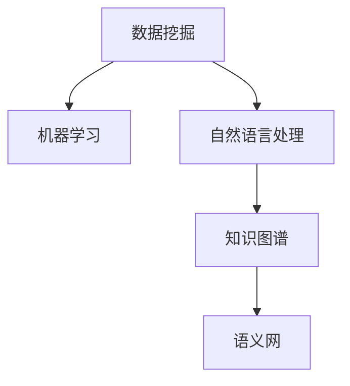

                 

# 知识发现引擎：解锁人类的知识本质

## 1. 背景介绍

### 1.1 问题由来

随着信息时代的到来，人类知识总量呈爆炸式增长。传统的人类知识获取和整合方式已无法满足现代社会的知识需求。知识发现引擎(Knowledge Discovery Engine, KDE)作为一种新型的人工智能工具，能够自动地从海量数据中挖掘、整合和应用人类的知识，成为解锁人类知识本质的关键。

### 1.2 问题核心关键点

知识发现引擎的核心目标是通过自动化的技术手段，从结构化与非结构化的数据中，提取出有价值的知识模式，支持决策制定、问题解决、创新研发等各类应用场景。知识发现引擎的技术基础包括数据挖掘、机器学习、自然语言处理、知识图谱等，涵盖数据抽取、数据清洗、特征工程、模型训练、结果展示等多个环节。

### 1.3 问题研究意义

知识发现引擎的研究和应用，对于提高知识管理效率，提升决策质量，推动科学发现和技术创新具有重要意义：

1. **提高效率**：自动化的知识发现过程可以节省大量的人工搜索和整理时间，让研究人员专注于更具有创造性的工作。
2. **提升质量**：知识发现引擎能够从数据中挖掘出更深层次的知识，发现潜在的关联和规律，支持更为精准的决策。
3. **促进创新**：通过对大量数据的分析，知识发现引擎能够揭示潜在的创新点和新知识，辅助技术创新和商业模式的探索。
4. **支持决策**：数据驱动的决策支持系统需要依赖知识发现引擎，帮助管理者在复杂环境中做出合理决策。

## 2. 核心概念与联系

### 2.1 核心概念概述

知识发现引擎涉及多个核心概念，这些概念之间相互关联，共同构成了知识发现的框架。

- **数据挖掘**：从大量数据中发现模式、关系、趋势等知识，是知识发现的基础。
- **机器学习**：通过算法自动学习知识，提高知识发现引擎的精度和鲁棒性。
- **自然语言处理**：解析和理解人类语言，从文本数据中抽取结构化知识。
- **知识图谱**：构建和维护知识节点和边之间的关系，支持复杂的推理和查询。
- **语义网**：通过RDF等技术，构建和链接语义化的数据网络，支持跨领域知识共享。

这些核心概念通过如图的Mermaid流程图相互联系，共同构成知识发现引擎的架构：



## 3. 核心算法原理 & 具体操作步骤

### 3.1 算法原理概述

知识发现引擎的核心算法包括数据挖掘和机器学习两个方面。数据挖掘算法从数据中发现模式和关联，而机器学习算法则通过训练模型，自动发现知识模式和规则。

形式化地，知识发现过程可以表示为：

- 数据预处理：对原始数据进行清洗、转换和规约，提取有用的特征。
- 模型训练：选择合适的模型，利用标注数据进行训练，得到知识模式。
- 结果解释：对模型结果进行分析和解释，提取可理解的知识。

### 3.2 算法步骤详解

知识发现引擎的核心算法步骤包括数据预处理、特征工程、模型训练和结果解释四个阶段：

1. **数据预处理**：
   - 数据清洗：去除噪声和异常值，保证数据质量。
   - 数据转换：将数据从原始格式转换为适合分析的格式，如时间序列、文本格式等。
   - 数据规约：对数据进行采样、降维等操作，减小计算量。

2. **特征工程**：
   - 特征提取：从原始数据中提取有用的特征，如统计特征、文本特征、时间特征等。
   - 特征选择：选择最相关的特征，减少计算量和提高模型精度。
   - 特征变换：对特征进行归一化、编码等操作，提高模型性能。

3. **模型训练**：
   - 选择合适的算法和模型，如分类、聚类、关联规则等。
   - 划分训练集和验证集，选择合适的超参数，进行模型训练。
   - 模型评估：使用验证集评估模型性能，选择最优模型。

4. **结果解释**：
   - 结果可视化：通过图表、报表等方式，展示知识发现结果。
   - 结果分析：对发现的知识进行语义分析和逻辑推理，形成可理解的解释。
   - 结果应用：将知识应用于实际决策、推荐、监控等场景。

### 3.3 算法优缺点

知识发现引擎具有以下优点：

1. **高效性**：自动化流程可以大幅减少人工干预，提高知识发现的效率。
2. **精确性**：通过数据挖掘和机器学习，能够发现更深层、更精准的知识模式。
3. **可解释性**：通过模型解释和结果分析，理解知识发现过程和结果。
4. **可扩展性**：能够处理不同类型和规模的数据，支持复杂的应用场景。

同时，知识发现引擎也存在一些局限性：

1. **依赖高质量数据**：知识发现的准确性高度依赖数据质量，数据噪声和异常值会影响结果。
2. **模型选择困难**：选择合适的算法和模型需要经验和理论指导，模型选择不当可能导致误导性结果。
3. **结果解释复杂**：复杂的模型和大量数据可能导致结果难以解释，影响知识的应用。
4. **需要大量计算资源**：数据挖掘和机器学习需要高性能的计算设备和算法，对硬件要求较高。

尽管存在这些局限性，但知识发现引擎仍然是大数据分析和知识管理领域的重要工具，具有广泛的应用前景。

### 3.4 算法应用领域

知识发现引擎在众多领域中得到了广泛应用，例如：

- **医疗健康**：从医疗数据中发现疾病模式，支持临床决策和疾病预测。
- **金融风险**：通过金融数据挖掘，发现潜在的风险模式，支持信用评估和投资决策。
- **电商推荐**：从用户行为数据中发现购物模式，提供个性化推荐。
- **市场营销**：分析消费者行为数据，发现市场趋势，支持营销策略制定。
- **科学发现**：从科学研究数据中发现新的科学规律，支持科学研究和技术创新。

## 4. 数学模型和公式 & 详细讲解 & 举例说明

### 4.1 数学模型构建

知识发现引擎的数学模型主要基于统计学、机器学习和数据挖掘技术。常见的数学模型包括：

- **回归模型**：用于预测数值型数据，如线性回归、决策树回归等。
- **分类模型**：用于分类数据，如逻辑回归、随机森林、支持向量机等。
- **聚类模型**：用于发现数据集中的聚类，如K-means、层次聚类等。
- **关联规则模型**：用于发现数据集中的关联规则，如Apriori、FP-Growth等。

### 4.2 公式推导过程

以线性回归模型为例，进行数学模型的详细推导：

假设有一个回归问题 $y=f(x;\theta)+\epsilon$，其中 $x$ 为自变量，$y$ 为因变量，$\theta$ 为模型参数，$\epsilon$ 为随机误差。

根据最小二乘法的原理，最优参数 $\hat{\theta}$ 可以通过最小化损失函数 $J(\theta)=\frac{1}{2N}\sum_{i=1}^N(y_i-f(x_i;\theta))^2$ 来求解。通过求导和求解方程组，可以得到：

$$
\hat{\theta}=(X^TX)^{-1}X^Ty
$$

其中 $X=[x_1,...,x_n]$ 为自变量的设计矩阵，$y=[y_1,...,y_n]$ 为因变量的向量。

### 4.3 案例分析与讲解

以电商平台推荐系统为例，分析如何使用知识发现引擎进行个性化推荐：

1. **数据预处理**：收集用户历史行为数据，包括浏览记录、购买记录、评分记录等。
2. **特征工程**：提取用户和商品的关键特征，如用户兴趣、商品属性、用户评分等。
3. **模型训练**：选择协同过滤、矩阵分解等推荐算法，训练推荐模型。
4. **结果解释**：通过用户画像和商品标签，解释推荐结果，提供推荐理由。

## 5. 项目实践：代码实例和详细解释说明

### 5.1 开发环境搭建

知识发现引擎的开发通常需要Python、R、Java等编程语言的支持，以及相关数据挖掘、机器学习、自然语言处理工具库的支持。以下是在Python环境下进行知识发现引擎开发的配置步骤：

1. 安装Anaconda：从官网下载并安装Anaconda，用于创建独立的Python环境。

2. 创建并激活虚拟环境：
```bash
conda create -n kde-env python=3.8 
conda activate kde-env
```

3. 安装必要的工具包：
```bash
pip install pandas numpy scikit-learn seaborn matplotlib
```

4. 安装相关的机器学习和数据挖掘工具库：
```bash
pip install scikit-learn pyodide
```

### 5.2 源代码详细实现

以下是一个简单的知识发现引擎示例，使用Python和Scikit-learn库进行数据挖掘和机器学习：

```python
import pandas as pd
from sklearn.model_selection import train_test_split
from sklearn.linear_model import LinearRegression
from sklearn.metrics import mean_squared_error

# 加载数据
data = pd.read_csv('data.csv')

# 数据预处理
X = data[['feature1', 'feature2', 'feature3']]
y = data['target']

# 特征工程
X = X.dropna()

# 模型训练
X_train, X_test, y_train, y_test = train_test_split(X, y, test_size=0.2, random_state=42)
model = LinearRegression()
model.fit(X_train, y_train)

# 模型评估
y_pred = model.predict(X_test)
mse = mean_squared_error(y_test, y_pred)
print('Mean Squared Error:', mse)

# 结果展示
import matplotlib.pyplot as plt
plt.scatter(X_test, y_test)
plt.plot(X_test, y_pred, color='red')
plt.show()
```

### 5.3 代码解读与分析

**数据预处理**：
- `pandas`库用于加载和处理数据，`dropna()`方法用于去除缺失值。
- `train_test_split()`方法用于将数据集划分为训练集和测试集。

**模型训练**：
- `LinearRegression()`用于构建线性回归模型。
- `fit()`方法用于模型训练，`predict()`方法用于模型预测。

**模型评估**：
- `mean_squared_error()`方法用于计算预测结果和真实结果之间的均方误差。

**结果展示**：
- `matplotlib`库用于绘制散点图和拟合直线，展示模型预测效果。

## 6. 实际应用场景

### 6.1 医疗健康

知识发现引擎在医疗健康领域具有重要的应用价值。通过分析医疗数据，发现疾病模式和风险因素，支持临床决策和治疗方案制定。例如，通过分析电子病历数据，发现某种疾病的风险因素，提前进行预防和治疗。

### 6.2 金融风险

金融领域中，知识发现引擎可以用于分析交易数据，发现潜在的欺诈行为和风险模式，提高风险评估和控制的精度。例如，通过分析银行交易记录，发现异常的交易行为，及时采取风险控制措施。

### 6.3 电商推荐

电商平台利用知识发现引擎进行个性化推荐，提升用户体验和转化率。通过分析用户行为数据，发现用户的兴趣偏好，提供个性化的商品推荐。

### 6.4 市场营销

市场营销中，知识发现引擎可以帮助企业分析消费者行为数据，发现市场趋势和用户偏好，制定更有效的营销策略。例如，通过分析社交媒体数据，发现热门话题和品牌趋势，优化广告投放策略。

### 6.5 科学发现

科学研究中，知识发现引擎能够从大量实验数据和文献数据中，发现新的科学规律和知识，支持科学发现和技术创新。例如，通过分析基因组数据，发现基因与疾病之间的关联，支持新药研发和疾病预测。

## 7. 工具和资源推荐

### 7.1 学习资源推荐

为了帮助开发者系统掌握知识发现引擎的理论基础和实践技巧，这里推荐一些优质的学习资源：

1. 《统计学习基础》（李航）：经典统计学习教材，系统讲解了回归、分类、聚类等基础知识。
2. 《机器学习实战》（Peter Harrington）：实战指南，通过案例和代码，深入浅出地介绍了机器学习算法。
3. 《数据挖掘导论》（Han et al.）：详细介绍了数据挖掘的各个阶段和算法，适合深入学习。
4. 《Python数据科学手册》（Jake VanderPlas）：全面介绍了Python在数据科学中的应用，包括数据预处理、特征工程、模型训练等。
5. 《深度学习》（Ian Goodfellow et al.）：深度学习领域的经典教材，讲解了深度神经网络在知识发现中的应用。

通过对这些资源的学习实践，相信你一定能够快速掌握知识发现引擎的精髓，并用于解决实际的NLP问题。

### 7.2 开发工具推荐

知识发现引擎的开发需要强大的计算能力和丰富的工具支持。以下是几款用于知识发现引擎开发的常用工具：

1. Python：功能强大的编程语言，支持数据处理和模型训练。
2. R：专门用于数据分析和统计计算的语言，适合处理大规模数据。
3. Scikit-learn：强大的机器学习工具库，支持各种数据挖掘和机器学习算法。
4. TensorFlow：Google开源的深度学习框架，支持复杂模型的构建和训练。
5. Apache Spark：大规模数据处理平台，支持分布式计算和数据挖掘。
6. Apache Hadoop：大数据处理框架，支持海量数据的存储和分析。

合理利用这些工具，可以显著提升知识发现引擎的开发效率，加快创新迭代的步伐。

### 7.3 相关论文推荐

知识发现引擎的研究源于学界的持续研究。以下是几篇奠基性的相关论文，推荐阅读：

1. 《Data Mining: Concepts and Techniques》（Jom Agrawal, et al.）：数据挖掘的经典教材，涵盖了各种数据挖掘算法和应用。
2. 《Predictive Modeling》（Craig W. Johnson, et al.）：全面介绍了各种预测模型和评估指标，适合实战学习。
3. 《Web Mining and Statistical Learning》（Lise Getoor, et al.）：介绍了在Web数据中发现知识的模式，适合Web数据挖掘学习。
4. 《Learning from Data》（Mikhail Belkin, et al.）：讲解了数据驱动的机器学习理论，适合理论学习。
5. 《Knowledge Discovery and Data Mining: Parallel Algorithms and Large-Scale Data Mining》（Jian Li, et al.）：介绍了大规模数据挖掘的算法和工具，适合大规模数据处理学习。

这些论文代表了大数据挖掘和知识发现的研究脉络。通过学习这些前沿成果，可以帮助研究者把握学科前进方向，激发更多的创新灵感。

## 8. 总结：未来发展趋势与挑战

### 8.1 总结

本文对知识发现引擎进行了全面系统的介绍。首先阐述了知识发现引擎的研究背景和意义，明确了知识发现引擎在知识管理和智能决策中的独特价值。其次，从原理到实践，详细讲解了知识发现的数学模型和操作步骤，给出了知识发现引擎开发的完整代码实例。同时，本文还广泛探讨了知识发现引擎在医疗、金融、电商等多个行业领域的应用前景，展示了知识发现引擎的广阔应用空间。此外，本文精选了知识发现引擎的各类学习资源，力求为读者提供全方位的技术指引。

通过本文的系统梳理，可以看到，知识发现引擎已经成为数据驱动智能决策的重要工具，其自动化的知识发现过程能够显著提高决策质量和效率。未来，伴随数据量的持续增长和数据技术的不断进步，知识发现引擎必将迎来更加广泛的应用场景，为智能决策系统提供更强大的知识支持。

### 8.2 未来发展趋势

展望未来，知识发现引擎将呈现以下几个发展趋势：

1. **自动化和智能化**：知识发现引擎将向更智能、更自动化方向发展，能够自动从复杂数据中发现更有价值的知识。
2. **多模态融合**：知识发现引擎将能够整合和分析多种类型的数据，如文本、图像、视频等，支持更全面和深入的知识发现。
3. **交互式推理**：知识发现引擎将具备更强的交互式推理能力，支持复杂场景下的知识推理和决策。
4. **跨领域应用**：知识发现引擎将能够跨越不同领域，提供跨领域的知识整合和应用。
5. **伦理和隐私保护**：知识发现引擎将更加注重数据隐私和伦理问题，确保知识发现过程的公平性和透明性。

以上趋势凸显了知识发现引擎的广阔前景。这些方向的探索发展，必将进一步提升知识发现引擎的性能和应用范围，为智能决策系统提供更强大的知识支持。

### 8.3 面临的挑战

尽管知识发现引擎已经取得了不少进展，但在迈向更加智能化、普适化应用的过程中，它仍面临着诸多挑战：

1. **数据质量问题**：知识发现的准确性高度依赖数据质量，数据噪声和异常值会影响结果。
2. **模型选择和调优**：选择合适的算法和模型需要经验和理论指导，模型选择不当可能导致误导性结果。
3. **结果解释和可信度**：复杂的模型和大量数据可能导致结果难以解释，影响知识的应用。
4. **计算资源需求**：知识发现引擎需要高性能的计算设备和算法，对硬件要求较高。
5. **隐私和安全问题**：知识发现引擎涉及大量敏感数据，需要确保数据安全和隐私保护。

这些挑战需要进一步的研究和探索，才能推动知识发现引擎的进一步发展。

### 8.4 研究展望

面对知识发现引擎所面临的种种挑战，未来的研究需要在以下几个方面寻求新的突破：

1. **数据质量提升**：通过数据清洗和特征工程，提高数据质量，减少噪声和异常值的影响。
2. **模型选择优化**：开发更加高效的模型选择和调优算法，提高知识发现的精度和鲁棒性。
3. **结果解释改进**：通过模型解释和可视化技术，提高结果的可解释性和可信度。
4. **计算资源优化**：开发更高效的计算模型和算法，降低计算资源需求，提高知识发现引擎的普适性。
5. **隐私和安全保护**：开发隐私保护和数据安全技术，确保知识发现过程的公平性和透明性。

这些研究方向的探索，必将引领知识发现引擎技术迈向更高的台阶，为构建智能决策系统提供更强大的知识支持。面向未来，知识发现引擎需要与其他人工智能技术进行更深入的融合，如因果推理、强化学习等，多路径协同发力，共同推动知识驱动的智能决策系统的进步。

## 9. 附录：常见问题与解答

**Q1：知识发现引擎是否适用于所有领域？**

A: 知识发现引擎在数据密集型领域具有广泛的应用前景，但在一些特定领域，如政治、伦理、个人隐私等，需要慎重考虑数据隐私和伦理问题。

**Q2：知识发现引擎如何处理大规模数据？**

A: 知识发现引擎通常需要高性能的计算平台和算法，如分布式计算、GPU加速等，以处理大规模数据。同时，可以采用数据分片、模型压缩等技术，减小计算量和存储空间。

**Q3：知识发现引擎的计算效率如何？**

A: 知识发现引擎的计算效率受到数据规模、算法复杂度和硬件平台的影响。通过合理的数据分片和算法优化，可以提高计算效率，实现更快速的知识发现。

**Q4：知识发现引擎的模型选择和调优有什么技巧？**

A: 选择合适的模型和调优参数是知识发现引擎成功的关键。常用的技巧包括网格搜索、随机搜索、贝叶斯优化等。同时，可以通过交叉验证、学习曲线等方法，评估模型性能和泛化能力。

**Q5：知识发现引擎的结果解释有哪些方式？**

A: 结果解释是知识发现的重要步骤，常用的方式包括：
- 可视化图表：通过图表展示模型结果，直观理解知识模式。
- 语义解释：通过自然语言描述模型结果，提供可理解的知识。
- 因果分析：通过因果推断等方法，解释模型结果的因果关系。

这些方式可以根据具体应用场景进行选择和组合。

---

作者：禅与计算机程序设计艺术 / Zen and the Art of Computer Programming

