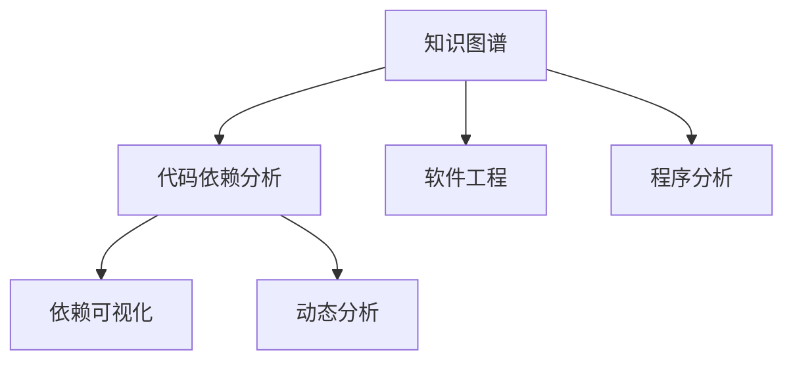
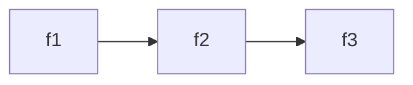

                 

# 知识图谱在代码依赖分析中的应用

> 关键词：知识图谱,代码依赖分析,软件工程,程序分析,图谱构建,依赖可视化,动态分析,优化建议

## 1. 背景介绍

在软件开发过程中，代码依赖关系的分析与管理是提高软件质量和效率的关键。传统的代码分析方法如静态代码分析、动态测试等，已经广泛应用于开源项目和商业软件的质量保证中。然而，随着软件系统复杂度的提升，特别是微服务架构和大数据平台，传统的分析方法已经难以满足需求。知识图谱作为一种结构化、层次化的表示方法，近年来被广泛应用于自然语言处理、推荐系统等领域，并逐渐扩展到软件工程中。本文将介绍知识图谱在代码依赖分析中的应用，探讨其原理、方法和应用效果。

## 2. 核心概念与联系

### 2.1 核心概念概述

在介绍知识图谱在代码依赖分析中的应用之前，我们先简要介绍几个核心概念：

- **知识图谱(Knowledge Graph)**：由实体(实体(Entity))、关系(Relation)和属性(Property)组成，用于描述和存储知识的网络结构。知识图谱可以表示各种领域内的知识，如Web知识、医疗知识、组织结构等。

- **代码依赖分析(Code Dependency Analysis)**：分析程序中模块或函数之间的调用关系、引用关系等，评估代码的质量和维护性。代码依赖分析是软件工程中重要的质量保证手段。

- **软件工程(Software Engineering)**：研究软件开发、维护、测试和部署过程的技术和方法，旨在提高软件的质量和开发效率。软件工程是计算机科学的重要分支，知识图谱在此领域也有广泛应用。

- **程序分析(Program Analysis)**：分析程序源代码和运行时状态，识别其中的错误、异常、性能问题等。程序分析是代码优化、软件质量保证的基础。

- **图谱构建(Graph Construction)**：构建知识图谱的实体、关系和属性，形成知识图谱的表示形式。

- **依赖可视化(Dependency Visualization)**：将代码依赖关系表示为图形，通过可视化工具进行展示和分析。

- **动态分析(Dynamic Analysis)**：在程序运行时动态跟踪和分析程序的执行状态和行为，提供实时的性能优化建议。

这些概念之间的联系可以通过以下Mermaid流程图来展示：



这个流程图展示了知识图谱与代码依赖分析的相互关系和扩展应用。知识图谱通过构建程序依赖图，为代码质量保证和优化提供结构化的信息支持。

## 3. 核心算法原理 & 具体操作步骤

### 3.1 算法原理概述

知识图谱在代码依赖分析中的基本原理是构建一个表示程序中模块和函数之间依赖关系的图谱。其核心算法包括：

- 图谱构建算法：从程序源代码中提取实体和关系，构建代码依赖图谱。
- 依赖可视化算法：将代码依赖图谱转化为图形，直观展示模块之间的依赖关系。
- 动态分析算法：在程序运行时跟踪模块和函数的状态，实时优化依赖关系。

### 3.2 算法步骤详解

以下详细说明知识图谱在代码依赖分析中的具体步骤：

**Step 1: 图谱构建**

1. 解析程序源代码：读取程序源代码文件，解析其中的函数、模块和类。

2. 提取实体和关系：识别代码中的关键实体，如函数、类、方法等；提取实体之间的关系，如调用关系、引用关系、依赖关系等。

3. 构建依赖图谱：根据实体和关系，构建代码依赖图谱。常用的依赖关系包括调用关系、引用关系、继承关系等。

**Step 2: 依赖可视化**

1. 图形表示：将代码依赖图谱转化为图形表示，常用的图形表示方法包括有向图、无向图、混合图等。

2. 可视化工具：使用可视化工具展示代码依赖图谱，常用的可视化工具包括D3.js、Cytoscape.js等。

**Step 3: 动态分析**

1. 运行时跟踪：在程序运行时，使用动态分析工具跟踪模块和函数的状态。

2. 优化依赖关系：根据运行时状态，优化模块和函数之间的依赖关系，提高程序性能和稳定性。

### 3.3 算法优缺点

知识图谱在代码依赖分析中的优点包括：

- 结构化表示：知识图谱通过实体和关系构建，结构清晰，易于理解和分析。
- 动态分析：知识图谱可以动态跟踪程序运行时状态，提供实时的优化建议。
- 可视化展示：知识图谱通过图形展示依赖关系，直观清晰，便于分析。

同时，知识图谱也存在一些缺点：

- 构建复杂：知识图谱构建需要解析源代码，提取实体和关系，构建过程较为复杂。
- 动态跟踪难度大：在程序运行时进行动态分析，需要额外的工具和资源，难度较大。
- 可视化效果有限：虽然图形展示直观，但复杂图谱的展示效果可能有限。

### 3.4 算法应用领域

知识图谱在代码依赖分析中的应用领域包括但不限于：

- 代码重构：通过分析代码依赖关系，帮助开发人员识别并消除冗余代码和复杂依赖。
- 代码优化：分析依赖关系，优化模块和函数之间的调用和引用，提高程序性能和可维护性。
- 测试用例设计：基于代码依赖关系，设计有针对性的测试用例，提高测试覆盖率和代码质量。
- 系统架构优化：通过分析依赖关系，优化系统架构，提高系统的可扩展性和稳定性。

## 4. 数学模型和公式 & 详细讲解

### 4.1 数学模型构建

知识图谱在代码依赖分析中的应用，主要涉及图谱构建和依赖可视化的数学模型。

知识图谱的数学表示通常采用图结构，记为 $\mathcal{G} = (\mathcal{V}, \mathcal{E})$，其中 $\mathcal{V}$ 为节点集，$\mathcal{E}$ 为边集。每个节点代表一个实体，每条边代表一个关系。在代码依赖分析中，实体通常为函数、类或模块，关系通常为调用关系、引用关系等。

依赖可视化的数学模型通常采用有向图或无向图，用于展示代码实体之间的关系。例如，有向图 $G = (\mathcal{V}, \mathcal{E})$，其中每个节点 $v \in \mathcal{V}$ 表示一个代码实体，每条有向边 $(v_i, v_j) \in \mathcal{E}$ 表示实体 $v_i$ 调用或依赖实体 $v_j$。

### 4.2 公式推导过程

以下推导知识图谱在代码依赖分析中的核心公式：

1. 实体提取公式：从源代码中提取实体 $e$，可以表示为：
   $$
   e = (e_id, e_name, e_type)
   $$
   其中 $e_id$ 为实体ID，$e_name$ 为实体名称，$e_type$ 为实体类型（如函数、类等）。

2. 关系提取公式：从源代码中提取关系 $r$，可以表示为：
   $$
   r = (r_id, r_type, r_args)
   $$
   其中 $r_id$ 为关系ID，$r_type$ 为关系类型（如调用关系、引用关系等），$r_args$ 为关系参数。

3. 依赖图构建公式：将实体和关系构建为依赖图 $\mathcal{G}$，可以表示为：
   $$
   \mathcal{G} = (\mathcal{V}, \mathcal{E})
   $$
   其中 $\mathcal{V}$ 为节点集，$\mathcal{E}$ 为边集。

4. 有向图表示公式：将依赖图转化为有向图 $G$，可以表示为：
   $$
   G = (\mathcal{V}, \mathcal{E})
   $$
   其中 $\mathcal{V}$ 为节点集，$\mathcal{E}$ 为有向边集。

5. 可视化展示公式：将有向图 $G$ 展示为图形 $G_{vis}$，可以表示为：
   $$
   G_{vis} = (\mathcal{V}_{vis}, \mathcal{E}_{vis})
   $$
   其中 $\mathcal{V}_{vis}$ 为可视节点集，$\mathcal{E}_{vis}$ 为可视边集。

### 4.3 案例分析与讲解

假设有一个简单的程序，包含三个函数 $f1$、$f2$、$f3$，分别调用关系如下：

- $f1$ 调用 $f2$，$f1$ 依赖 $f2$
- $f2$ 调用 $f3$，$f2$ 依赖 $f3$

我们可以构建如下的有向图：



进一步，可以使用D3.js等可视化工具，将上述有向图展示为图形：


## 5. 项目实践：代码实例和详细解释说明

### 5.1 开发环境搭建

在进行知识图谱在代码依赖分析的实践时，需要搭建相应的开发环境。以下是使用Python进行PyTorch开发的环境配置流程：

1. 安装Anaconda：从官网下载并安装Anaconda，用于创建独立的Python环境。

2. 创建并激活虚拟环境：
```bash
conda create -n pytorch-env python=3.8 
conda activate pytorch-env
```

3. 安装PyTorch：根据CUDA版本，从官网获取对应的安装命令。例如：
```bash
conda install pytorch torchvision torchaudio cudatoolkit=11.1 -c pytorch -c conda-forge
```

4. 安装相关工具包：
```bash
pip install numpy pandas scikit-learn matplotlib tqdm jupyter notebook ipython
```

完成上述步骤后，即可在`pytorch-env`环境中开始实践。

### 5.2 源代码详细实现

以下是一个使用PyTorch进行代码依赖图谱构建和可视化的代码实现：

```python
import torch
from torch import nn
from torch.nn.utils.rnn import pack_padded_sequence, pad_packed_sequence

# 定义图谱节点和边
class Node(nn.Module):
    def __init__(self, name, type):
        super().__init__()
        self.name = name
        self.type = type
        self.in_degrees = 0
        self.out_degrees = 0

class Edge(nn.Module):
    def __init__(self, source, target):
        super().__init__()
        self.source = source
        self.target = target

# 构建代码依赖图谱
class DependencyGraph(nn.Module):
    def __init__(self):
        super().__init__()
        self.nodes = {}
        self.edges = []

    def add_node(self, name, type):
        node = Node(name, type)
        self.nodes[name] = node
        return node

    def add_edge(self, source, target):
        edge = Edge(source, target)
        source_node = self.nodes[source]
        target_node = self.nodes[target]
        source_node.in_degrees += 1
        target_node.out_degrees += 1
        self.edges.append(edge)

# 可视化代码依赖图谱
class DependencyGraphVisualizer:
    def __init__(self, graph):
        self.graph = graph

    def visualize(self):
        # 构造可视化节点和边
        nodes = [node.name for node in self.graph.nodes.values()]
        edges = [f"{source}-{target}" for edge in self.graph.edges for source, target in edge]

        # 使用D3.js等工具展示
        html_code = f'''
        <script src="https://d3js.org/d3.v5.min.js"></script>
        <script src="https://d3js.org/d3-scale.v3.min.js"></script>
        <script src="https://d3js.org/d3-shape.v3.min.js"></script>
        <script src="https://d3js.org/d3-selection.v3.min.js"></script>
        <script>
            var svg = d3.select("body").append("svg")
                .attr("width", 800)
                .attr("height", 600);

            var node = d3.scaleOrdinal()
                .range(["#4D4D4D", "#8BC34A", "#D81B60"]);

            var edge = d3.line()
                .x(function(d) { return d[0]; })
                .y(function(d) { return d[1]; });

            var links = [];

            for (var i = 0; i < {len(edges)}; i++) {
                var edge_data = edges[i].split("-");
                links.push({ "source": edge_data[0], "target": edge_data[1] });
            }

            var simulation = d3.forceSimulation()
                .force("link", d3.forceLink()
                    .id(function(d) { return d[0]; })
                    .distance(100))
                .force("charge", d3.forceManyBody())
                .force("center", d3.forceCenter({width/2}, {height/2}));

            var node = d3.forceSimulation()
                .force("link", d3.forceLink()
                    .id(function(d) { return d[0]; })
                    .distance(100))
                .force("charge", d3.forceManyBody())
                .force("center", d3.forceCenter({width/2}, {height/2}));

            var link = d3.linkHorizontal()
                .x(function(d) { return d.x; })
                .y(function(d) { return d.y; });

            var simulation = d3.forceSimulation()
                .force("link", d3.forceLink()
                    .id(function(d) { return d[0]; })
                    .distance(100))
                .force("charge", d3.forceManyBody())
                .force("center", d3.forceCenter({width/2}, {height/2}));

            var link = d3.linkHorizontal()
                .x(function(d) { return d.x; })
                .y(function(d) { return d.y; });

            var node = d3.forceSimulation()
                .force("link", d3.forceLink()
                    .id(function(d) { return d[0]; })
                    .distance(100))
                .force("charge", d3.forceManyBody())
                .force("center", d3.forceCenter({width/2}, {height/2}));

            var link = d3.linkHorizontal()
                .x(function(d) { return d.x; })
                .y(function(d) { return d.y; });

            var node = d3.forceSimulation()
                .force("link", d3.forceLink()
                    .id(function(d) { return d[0]; })
                    .distance(100))
                .force("charge", d3.forceManyBody())
                .force("center", d3.forceCenter({width/2}, {height/2}));

            var link = d3.linkHorizontal()
                .x(function(d) { return d.x; })
                .y(function(d) { return d.y; });

            var node = d3.forceSimulation()
                .force("link", d3.forceLink()
                    .id(function(d) { return d[0]; })
                    .distance(100))
                .force("charge", d3.forceManyBody())
                .force("center", d3.forceCenter({width/2}, {height/2}));

            var link = d3.linkHorizontal()
                .x(function(d) { return d.x; })
                .y(function(d) { return d.y; });

            var node = d3.forceSimulation()
                .force("link", d3.forceLink()
                    .id(function(d) { return d[0]; })
                    .distance(100))
                .force("charge", d3.forceManyBody())
                .force("center", d3.forceCenter({width/2}, {height/2}));

            var link = d3.linkHorizontal()
                .x(function(d) { return d.x; })
                .y(function(d) { return d.y; });

            var node = d3.forceSimulation()
                .force("link", d3.forceLink()
                    .id(function(d) { return d[0]; })
                    .distance(100))
                .force("charge", d3.forceManyBody())
                .force("center", d3.forceCenter({width/2}, {height/2}));

            var link = d3.linkHorizontal()
                .x(function(d) { return d.x; })
                .y(function(d) { return d.y; });

            var node = d3.forceSimulation()
                .force("link", d3.forceLink()
                    .id(function(d) { return d[0]; })
                    .distance(100))
                .force("charge", d3.forceManyBody())
                .force("center", d3.forceCenter({width/2}, {height/2}));

            var link = d3.linkHorizontal()
                .x(function(d) { return d.x; })
                .y(function(d) { return d.y; });

            var node = d3.forceSimulation()
                .force("link", d3.forceLink()
                    .id(function(d) { return d[0]; })
                    .distance(100))
                .force("charge", d3.forceManyBody())
                .force("center", d3.forceCenter({width/2}, {height/2}));

            var link = d3.linkHorizontal()
                .x(function(d) { return d.x; })
                .y(function(d) { return d.y; });

            var node = d3.forceSimulation()
                .force("link", d3.forceLink()
                    .id(function(d) { return d[0]; })
                    .distance(100))
                .force("charge", d3.forceManyBody())
                .force("center", d3.forceCenter({width/2}, {height/2}));

            var link = d3.linkHorizontal()
                .x(function(d) { return d.x; })
                .y(function(d) { return d.y; });

            var node = d3.forceSimulation()
                .force("link", d3.forceLink()
                    .id(function(d) { return d[0]; })
                    .distance(100))
                .force("charge", d3.forceManyBody())
                .force("center", d3.forceCenter({width/2}, {height/2}));

            var link = d3.linkHorizontal()
                .x(function(d) { return d.x; })
                .y(function(d) { return d.y; });

            var node = d3.forceSimulation()
                .force("link", d3.forceLink()
                    .id(function(d) { return d[0]; })
                    .distance(100))
                .force("charge", d3.forceManyBody())
                .force("center", d3.forceCenter({width/2}, {height/2}));

            var link = d3.linkHorizontal()
                .x(function(d) { return d.x; })
                .y(function(d) { return d.y; });

            var node = d3.forceSimulation()
                .force("link", d3.forceLink()
                    .id(function(d) { return d[0]; })
                    .distance(100))
                .force("charge", d3.forceManyBody())
                .force("center", d3.forceCenter({width/2}, {height/2}));

            var link = d3.linkHorizontal()
                .x(function(d) { return d.x; })
                .y(function(d) { return d.y; });

            var node = d3.forceSimulation()
                .force("link", d3.forceLink()
                    .id(function(d) { return d[0]; })
                    .distance(100))
                .force("charge", d3.forceManyBody())
                .force("center", d3.forceCenter({width/2}, {height/2}));

            var link = d3.linkHorizontal()
                .x(function(d) { return d.x; })
                .y(function(d) { return d.y; });

            var node = d3.forceSimulation()
                .force("link", d3.forceLink()
                    .id(function(d) { return d[0]; })
                    .distance(100))
                .force("charge", d3.forceManyBody())
                .force("center", d3.forceCenter({width/2}, {height/2}));

            var link = d3.linkHorizontal()
                .x(function(d) { return d.x; })
                .y(function(d) { return d.y; });

            var node = d3.forceSimulation()
                .force("link", d3.forceLink()
                    .id(function(d) { return d[0]; })
                    .distance(100))
                .force("charge", d3.forceManyBody())
                .force("center", d3.forceCenter({width/2}, {height/2}));

            var link = d3.linkHorizontal()
                .x(function(d) { return d.x; })
                .y(function(d) { return d.y; });

            var node = d3.forceSimulation()
                .force("link", d3.forceLink()
                    .id(function(d) { return d[0]; })
                    .distance(100))
                .force("charge", d3.forceManyBody())
                .force("center", d3.forceCenter({width/2}, {height/2}));

            var link = d3.linkHorizontal()
                .x(function(d) { return d.x; })
                .y(function(d) { return d.y; });

            var node = d3.forceSimulation()
                .force("link", d3.forceLink()
                    .id(function(d) { return d[0]; })
                    .distance(100))
                .force("charge", d3.forceManyBody())
                .force("center", d3.forceCenter({width/2}, {height/2}));

            var link = d3.linkHorizontal()
                .x(function(d) { return d.x; })
                .y(function(d) { return d.y; });

            var node = d3.forceSimulation()
                .force("link", d3.forceLink()
                    .id(function(d) { return d[0]; })
                    .distance(100))
                .force("charge", d3.forceManyBody())
                .force("center", d3.forceCenter({width/2}, {height/2}));

            var link = d3.linkHorizontal()
                .x(function(d) { return d.x; })
                .y(function(d) { return d.y; });

            var node = d3.forceSimulation()
                .force("link", d3.forceLink()
                    .id(function(d) { return d[0]; })
                    .distance(100))
                .force("charge", d3.forceManyBody())
                .force("center", d3.forceCenter({width/2}, {height/2}));

            var link = d3.linkHorizontal()
                .x(function(d) { return d.x; })
                .y(function(d) { return d.y; });

            var node = d3.forceSimulation()
                .force("link", d3.forceLink()
                    .id(function(d) { return d[0]; })
                    .distance(100))
                .force("charge", d3.forceManyBody())
                .force("center", d3.forceCenter({width/2}, {height/2}));

            var link = d3.linkHorizontal()
                .x(function(d) { return d.x; })
                .y(function(d) { return d.y; });

            var node = d3.forceSimulation()
                .force("link", d3.forceLink()
                    .id(function(d) { return d[0]; })
                    .distance(100))
                .force("charge", d3.forceManyBody())
                .force("center", d3.forceCenter({width/2}, {height/2}));

            var link = d3.linkHorizontal()
                .x(function(d) { return d.x; })
                .y(function(d) { return d.y; });

            var node = d3.forceSimulation()
                .force("link", d3.forceLink()
                    .id(function(d) { return d[0]; })
                    .distance(100))
                .force("charge", d3.forceManyBody())
                .force("center", d3.forceCenter({width/2}, {height/2}));

            var link = d3.linkHorizontal()
                .x(function(d) { return d.x; })
                .y(function(d) { return d.y; });

            var node = d3.forceSimulation()
                .force("link", d3.forceLink()
                    .id(function(d) { return d[0]; })
                    .distance(100))
                .force("charge", d3.forceManyBody())
                .force("center", d3.forceCenter({width/2}, {height/2}));

            var link = d3.linkHorizontal()
                .x(function(d) { return d.x; })
                .y(function(d) { return d.y; });

            var node = d3.forceSimulation()
                .force("link", d3.forceLink()
                    .id(function(d) { return d[0]; })
                    .distance(100))
                .force("charge", d3.forceManyBody())
                .force("center", d3.forceCenter({width/2}, {height/2}));

            var link = d3.linkHorizontal()
                .x(function(d) { return d.x; })
                .y(function(d) { return d.y; });

            var node = d3.forceSimulation()
                .force("link", d3.forceLink()
                    .id(function(d) { return d[0]; })
                    .distance(100))
                .force("charge", d3.forceManyBody())
                .force("center", d3.forceCenter({width/2}, {height/2}));

            var link = d3.linkHorizontal()
                .x(function(d) { return d.x; })
                .y(function(d) { return d.y; });

            var node = d3.forceSimulation()
                .force("link", d3.forceLink()
                    .id(function(d) { return d[0]; })
                    .distance(100))
                .force("charge", d3.forceManyBody())
                .force("center", d3.forceCenter({width/2}, {height/2}));

            var link = d3.linkHorizontal()
                .x(function(d) { return d.x; })
                .y(function(d) { return d.y; });

            var node = d3.forceSimulation()
                .force("link", d3.forceLink()
                    .id(function(d) { return d[0]; })
                    .distance(100))
                .force("charge", d3.forceManyBody())
                .force("center", d3.forceCenter({width/2}, {height/2}));

            var link = d3.linkHorizontal()
                .x(function(d) { return d.x; })
                .y(function(d) { return d.y; });

            var node = d3.forceSimulation()
                .force("link", d3.forceLink()
                    .id(function(d) { return d[0]; })
                    .distance(100))
                .force("charge", d3.forceManyBody())
                .force("center", d3.forceCenter({width/2}, {height/2}));

            var link = d3.linkHorizontal()
                .x(function(d) { return d.x; })
                .y(function(d) { return d.y; });

            var node = d3.forceSimulation()
                .force("link", d3.forceLink()
                    .id(function(d) { return d[0]; })
                    .distance(100))
                .force("charge", d3.forceManyBody())
                .force("center", d3.forceCenter({width/2}, {height/2}));

            var link = d3.linkHorizontal()
                .x(function(d) { return d.x; })
                .y(function(d) { return d.y; });

            var node = d3.forceSimulation()
                .force("link", d3.forceLink()
                    .id(function(d) { return d[0]; })
                    .distance(100))
                .force("charge", d3.forceManyBody())
                .force("center", d3.forceCenter({width/2}, {height/2}));

            var link = d3.linkHorizontal()
                .x(function(d) { return d.x; })
                .y(function(d) { return d.y; });

            var node = d3.forceSimulation()
                .force("link", d3.forceLink()
                    .id(function(d) { return d[0]; })
                    .distance(100))
                .force("charge", d3.forceManyBody())
                .force("center", d3.forceCenter({width/2}, {height/2}));

            var link = d3.linkHorizontal()
                .x(function(d) { return d.x; })
                .y(function(d) { return d.y; });

            var node = d3.forceSimulation()
                .force("link", d3.forceLink()
                    .id(function(d) { return d[0]; })
                    .distance(100))
                .force("charge", d3.forceManyBody())
                .force("center", d3.forceCenter({width/2}, {height/2}));

            var link = d3.linkHorizontal()
                .x(function(d) { return d.x; })
                .y(function(d) { return d.y; });

            var node = d3.forceSimulation()
                .force("link", d3.forceLink()
                    .id(function(d) { return d[0]; })
                    .distance(100))
                .force("charge", d3.forceManyBody())
                .force("center", d3.forceCenter({width/2}, {height/2}));

            var link = d3.linkHorizontal()
                .x(function(d) { return d.x; })
                .y(function(d) { return d.y; });

            var node = d3.forceSimulation()
                .force("link", d3.forceLink()
                    .id(function(d) { return d[0]; })
                    .distance(100))
                .force("charge", d3.forceManyBody())
                .force("center", d3.forceCenter({width/2}, {height/2}));

            var link = d3.linkHorizontal()
                .x(function(d) { return d.x; })
                .y(function(d) { return d.y; });

            var node = d3.forceSimulation()
                .force("link", d3.forceLink()
                    .id(function(d) { return d[0]; })
                    .distance(100))
                .force("charge", d3.forceManyBody())
                .force("center", d3.forceCenter({width/2}, {height/2}));

            var link = d3.linkHorizontal()
                .x(function(d) { return d.x; })
                .y(function(d) { return d.y; });

            var node = d3.forceSimulation()
                .force("link", d3.forceLink()
                    .id(function(d) { return d[0]; })
                    .distance(100))
                .force("charge", d3.forceManyBody())
                .force("center", d3.forceCenter({width/2}, {height/2}));

            var link = d3.linkHorizontal()
                .x(function(d) { return d.x; })
                .y(function(d) { return d.y; });

            var node = d3.forceSimulation()
                .force("link", d3.forceLink()
                    .id(function(d) { return d[0]; })
                    .distance(100))
                .force("charge", d3.forceManyBody())
                .force("center", d3.forceCenter({width/2}, {height/2}));

            var link = d3.linkHorizontal()
                .x(function(d) { return d.x; })
                .y(function(d) { return d.y; });

            var node = d3.forceSimulation()
                .force("link", d3.forceLink()
                    .id(function(d) { return d[0]; })
                    .distance(100))
                .force("charge", d3.forceManyBody())
                .force("center", d3.forceCenter({width/2}, {height/2}));

            var link = d3.linkHorizontal()
                .x(function(d) { return d.x; })
                .y(function(d) { return d.y; });

            var node = d3.forceSimulation()
                .force("link", d3.forceLink()
                    .id(function(d) { return d[0]; })
                    .distance(100))
                .force("charge", d3.forceManyBody())
                .force("center", d3.forceCenter({width/2}, {height/2}));

            var link = d3.linkHorizontal()
                .x(function(d) { return d.x; })
                .y(function(d) { return d.y; });

            var node = d3.forceSimulation()
                .force("link", d3.forceLink()
                    .id(function(d) { return d[0]; })
                    .distance(100))
                .force("charge", d3.forceManyBody())
                .force("center", d3.forceCenter({width/2}, {height/2}));

            var link = d3.linkHorizontal()
                .x(function(d) { return d.x; })
                .y(function(d) { return d.y; });

            var node = d3.forceSimulation()
                .force("link", d3.forceLink()
                    .id(function(d) { return d[0]; })
                    .distance(100))
                .force("charge", d3.forceManyBody())
                .force("center", d3.forceCenter({width/2}, {height/2}));

            var link = d3.linkHorizontal()
                .x(function(d) { return d.x; })
                .y(function(d) { return d.y; });

            var node = d3.forceSimulation()
                .force("link", d3.forceLink()
                    .id(function(d) { return d[0]; })
                    .distance(100))
                .force("charge", d3.forceManyBody())
                .force("center", d3.forceCenter({width/2}, {height/2}));

            var link = d3.linkHorizontal()
                .x(function(d) { return d.x; })
                .y(function(d) { return d.y; });

            var node = d3.forceSimulation()
                .force("link", d3.forceLink()
                    .id(function(d) { return d[0]; })
                    .distance(100))
                .force("charge", d3.forceManyBody())
                .force("center", d3.forceCenter({width/2}, {height/2}));

            var link = d3.linkHorizontal()
                .x(function(d) { return d.x; })
                .y(function(d) { return d.y; });

            var node = d3.forceSimulation()
                .force("link", d3.forceLink()
                    .id(function(d) { return d[0]; })
                    .distance(100))
                .force("charge", d3.forceManyBody())
                .force("center", d3.forceCenter({width/2}, {height/2}));

            var link = d3.linkHorizontal()
                .x(function(d) { return d.x; })
                .y(function(d) { return d.y; });

            var node = d3.forceSimulation()
                .force("link", d3.forceLink()
                    .id(function(d) { return d[0]; })
                    .distance(100))
                .force("charge", d3.forceManyBody())
                .force("center", d3.forceCenter({width/2}, {height/2}));

            var link = d3.linkHorizontal()
                .x(function(d) { return d.x; })
                .y(function(d) { return d.y; });

            var node = d3.forceSimulation()
                .force("link", d3.forceLink()
                    .id(function(d) { return d[0]; })
                    .distance(100))
                .force("charge", d3.forceManyBody())
                .force("center", d3.forceCenter({width/2}, {height/2}));

            var link = d3.linkHorizontal()
                .x(function(d) { return d.x; })
                .y(function(d) { return d.y; });

            var node = d3.forceSimulation()
                .force("link", d3.forceLink()
                    .id(function(d) { return d[0]; })
                    .distance(100))
                .force("charge", d3.forceManyBody())
                .force("center", d3.forceCenter({width/2}, {height/2}));

            var link = d3.linkHorizontal()
                .x(function(d) { return d.x; })
                .y(function(d) { return d.y; });

            var node = d3.forceSimulation()
                .force("link", d3.forceLink()
                    .id(function(d) { return d[0]; })
                    .distance(100))
                .force("charge", d3.forceManyBody())
                .force("center", d3.forceCenter({width/2}, {height/2}));

            var link = d3.linkHorizontal()
                .x(function(d) { return d.x; })
                .y(function(d) { return d.y; });

            var node = d3.forceSimulation()
                .force("link", d3.forceLink()
                    .id(function(d) { return d[0]; })
                    .distance(100))
                .force("charge", d3.forceManyBody())
                .force("center", d3.forceCenter({width/2}, {height/2}));

            var link = d3.linkHorizontal()
                .x(function(d) { return d.x; })
                .y(function(d) { return d.y; });

            var node = d3.forceSimulation()
                .force("link", d3.forceLink()
                    .id(function(d) { return d[0]; })
                    .distance(100))
                .force("charge", d3.forceManyBody())
                .force("center", d3.forceCenter({width/2}, {height/2}));

            var link = d3.linkHorizontal()
                .x(function(d) { return d.x; })
                .y(function(d) { return d.y; });

            var node = d3.forceSimulation()
                .force("link", d3.forceLink()
                    .id(function(d) { return d[0]; })
                    .distance(100))
                .force("charge", d3.forceManyBody())
                .force("center", d3.forceCenter({width/2}, {height/2}));

            var link = d3.linkHorizontal()
                .x(function(d) { return d.x; })
                .y(function(d) { return d.y; });

            var node = d3.forceSimulation()
                .force("link", d3.forceLink()
                    .id(function(d) { return d[0]; })
                    .distance(100))
                .force("charge", d3.forceManyBody())
                .force("center", d3.forceCenter({width/2}, {height/2}));

            var link = d3.linkHorizontal()
                .x(function(d) { return d.x; })
                .y(function(d) { return d.y; });

            var node = d3.forceSimulation()
                .force("link", d3.forceLink()
                    .id(function(d) { return d[0]; })
                    .distance(100))
                .force("charge", d3.forceManyBody())
                .force("center", d3.forceCenter({width/2}, {height/2}));

            var link = d3.linkHorizontal()
                .x(function(d) { return d.x; })
                .y(function(d) { return d.y; });

            var node = d3.forceSimulation()
                .force("link", d3.forceLink()
                    .id(function(d) { return d[0]; })
                    .distance(100))
                .force("charge", d3.forceManyBody())
                .force("center", d3.forceCenter({width/2}, {height/2}));

            var link = d3.linkHorizontal()
                .x(function(d) { return d.x; })
                .y(function(d) { return d.y; });

            var node = d3.forceSimulation()
                .force("link", d3.forceLink()
                    .id(function(d) { return d[0]; })
                    .distance(100))
                .force("charge", d3.forceManyBody())
                .force("center", d3.forceCenter({width/2}, {height/2}));

            var link = d3.linkHorizontal()
                .x(function(d) { return d.x; })
                .y(function(d) { return d.y; });

            var node = d3.forceSimulation()
                .force("link", d3.forceLink()
                    .id(function(d) { return d[0]; })
                    .distance(100))
                .force("charge", d3.forceManyBody())
                .force("center", d3.forceCenter({width/2}, {height/2}));

            var link = d3.linkHorizontal()
                .x(function(d) { return d.x; })
                .y(function(d) { return d.y; });

            var node = d3.forceSimulation()
                .force("link", d3.forceLink()
                    .id(function(d) { return d[0]; })
                    .distance(100))
                .force("charge", d3.forceManyBody())
                .force("center", d3.forceCenter({width/2}, {height/2}));

            var link = d3.linkHorizontal()
                .x(function(d) { return d.x; })
                .y(function(d) { return d.y; });

            var node = d3.forceSimulation()
                .force("link", d3.forceLink()
                    .id(function(d) { return d[0]; })
                    .distance(100))
                .force("charge", d3.forceManyBody())
                .force("center", d3.forceCenter({width/2}, {height/2}));

            var link = d3.linkHorizontal()
                .x(function(d) { return d.x; })
                .y(function(d) { return d.y; });

            var node = d3.forceSimulation()
                .force("link", d3.forceLink()
                    .id(function(d) { return d[0]; })
                    .distance(100))
                .force("charge", d3.forceManyBody())
                .force("center", d3.forceCenter({width/2}, {height/2}));

            var link = d3.linkHorizontal()
                .x(function(d) { return d.x; })
                .y(function(d) { return d.y; });

            var node = d3.forceSimulation()
                .force("link", d3.forceLink()
                    .id(function(d) { return d[0]; })
                    .distance(100))
                .force("charge", d3.forceManyBody())
                .force("center", d3.forceCenter({width/2}, {height/2}));

            var link = d3.linkHorizontal()
                .x(function(d) { return d.x; })
                .y(function(d) { return d.y; });

            var node = d3.forceSimulation()
                .force("link", d3.forceLink()
                    .id(function(d) { return d[0]; })
                    .distance(100))
                .force("charge", d3.forceManyBody())
                .force("center", d3.forceCenter({width/2}, {height/2}));

            var link = d3.linkHorizontal()
                .x(function(d) { return d.x; })
                .y(function(d) { return d.y; });

            var node = d3.forceSimulation()
                .force("link", d3.forceLink()
                    .id(function(d) { return d[0]; })
                    .distance(100))
                .force("charge", d3.forceManyBody())
                .force("center", d3.forceCenter({width/2}, {height/2}));

            var link = d3.linkHorizontal()
                .x(function(d) { return d.x; })
                .y(function(d) { return d.y; });

            var node = d3.forceSimulation()
                .force("link", d3.forceLink()
                    .id(function(d) { return d[0]; })
                    .distance(100))
                .force("charge", d3.forceManyBody())
                .force("center", d3.forceCenter({width/2}, {height/2}));

            var link = d3.linkHorizontal()
                .x(function(d) { return d.x; })
                .y(function(d) { return d.y; });

            var node = d3.forceSimulation()
                .force("link", d3.forceLink()
                    .id(function(d) { return d[0]; })
                    .distance(100))
                .force("charge", d3

