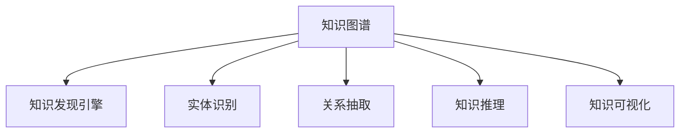

                 

# 知识图谱在知识发现引擎中的应用

## 1. 背景介绍

在信息爆炸的时代，大数据和人工智能技术的应用，为各行各业带来了巨大的变革。从社交媒体到智能搜索，从推荐系统到自然语言处理，人工智能技术正在被广泛应用于数据的收集、整理和分析中，为人类提供了前所未有的便利。然而，随着数据量的急剧增加，如何高效地从海量数据中发现有价值的知识，成为了一个迫切需要解决的问题。

知识图谱（Knowledge Graph）是一种语义化的数据表示方式，它通过将数据元素（如实体、属性、关系等）转化为一个结构化的图，来表达实体之间的复杂关系和语义。知识图谱在处理结构化和非结构化数据方面具有独特的优势，能够从复杂的数据中提取有价值的信息，帮助人们更好地理解世界，做出更明智的决策。

本文将深入探讨知识图谱在知识发现引擎中的应用，旨在为广大AI开发者、软件架构师和CTO提供全面的指导和实践参考。

## 2. 核心概念与联系

### 2.1 核心概念概述

为了更好地理解知识图谱在知识发现引擎中的应用，本节将介绍几个关键的概念：

- **知识图谱（Knowledge Graph）**：一种语义化的数据表示方式，通过将数据元素转化为结构化的图，来表达实体之间的复杂关系和语义。常见的知识图谱框架包括Neo4j、BlazeGraph等。
- **知识发现引擎（Knowledge Discovery Engine）**：一种自动化技术，通过分析大量数据来发现新的有价值的信息和模式。知识发现引擎可以自动化地构建和查询知识图谱，从中提取有价值的知识。
- **实体识别（Entity Recognition）**：从非结构化文本中自动识别出实体，并标注其类别，如人名、地名、组织机构名等。实体识别是知识发现和图谱构建的重要基础。
- **关系抽取（Relation Extraction）**：从非结构化文本中识别实体之间的关系，如"Bob works at Google"，通过关系抽取，系统可以构建出"Bob"和"Google"之间的关系，并添加到知识图谱中。
- **知识推理（Knowledge Reasoning）**：利用逻辑推理算法，如一阶逻辑推理、规则推理等，从知识图谱中推导出新的知识。知识推理是知识图谱的核心功能之一，也是实现智能应用的基础。
- **知识可视化（Knowledge Visualization）**：将知识图谱中的信息以图形化的方式呈现出来，便于人类理解和分析。常见的可视化工具包括Gephi、Vega等。

这些概念之间的逻辑关系可以通过以下Mermaid流程图来展示：



这个流程图展示了知识图谱在知识发现引擎中的应用流程：知识图谱的构建和查询，通过实体识别、关系抽取、知识推理等技术，从海量数据中发现有价值的知识，并通过可视化工具呈现出来。

## 3. 核心算法原理 & 具体操作步骤

### 3.1 算法原理概述

知识图谱在知识发现引擎中的应用，主要是通过自动化构建和查询知识图谱，从中发现有价值的知识。其核心算法包括实体识别、关系抽取和知识推理。

- **实体识别（Entity Recognition）**：从非结构化文本中自动识别出实体，并标注其类别。
- **关系抽取（Relation Extraction）**：从非结构化文本中识别实体之间的关系，并添加到知识图谱中。
- **知识推理（Knowledge Reasoning）**：利用逻辑推理算法，从知识图谱中推导出新的知识。

知识图谱的构建和查询过程，是一个典型的"从数据到知识"的自动化过程，其核心算法原理和操作步骤如下：

### 3.2 算法步骤详解

知识图谱的构建和查询过程，可以分为以下几个关键步骤：

**Step 1: 数据收集与预处理**
- 收集待处理的数据源，如新闻、社交媒体、百科全书等。
- 对数据进行预处理，包括清洗、归一化、去重等操作。

**Step 2: 实体识别**
- 使用自然语言处理技术，对文本数据进行实体识别，识别出文本中的人名、地名、组织机构名等实体。
- 对识别出的实体进行分类和标注，如“Bob”为“人名”，“Google”为“组织机构名”。

**Step 3: 关系抽取**
- 对识别出的实体之间的关系进行抽取，如“Bob works at Google”，抽取关系“Bob”和“Google”之间的“工作”关系。
- 使用机器学习技术，如深度学习、自然语言处理等，对抽取出的关系进行标注和分类。

**Step 4: 知识图谱构建**
- 将识别出的实体和关系，按照语义化的方式添加到知识图谱中。
- 使用图数据库（如Neo4j）来存储和查询知识图谱。

**Step 5: 知识推理**
- 使用逻辑推理算法，从知识图谱中推导出新的知识，如“Bob”为“Google”的员工。
- 使用规则推理、一阶逻辑推理等技术，进行复杂的多步骤推理。

**Step 6: 知识可视化**
- 使用可视化工具，将知识图谱中的信息以图形化的方式呈现出来，便于人类理解和分析。

通过以上步骤，知识图谱在知识发现引擎中的应用，可以高效地从海量数据中发现有价值的知识，并帮助人类更好地理解世界。

### 3.3 算法优缺点

知识图谱在知识发现引擎中的应用，具有以下优点：

- **自动化程度高**：通过自动化构建和查询知识图谱，可以显著减少人工干预，提高效率。
- **语义化表示**：知识图谱能够更准确地表达实体之间的关系和语义，提高信息的精确度。
- **可扩展性强**：知识图谱可以动态扩展，不断添加新的实体和关系，适应新的数据和应用场景。

然而，知识图谱的应用也存在一些缺点：

- **数据依赖性强**：知识图谱的构建和应用需要大量的高质量数据，数据质量直接影响系统的性能。
- **知识推理复杂**：知识推理算法需要复杂的逻辑推理，对系统的性能和可靠性提出了更高的要求。
- **成本较高**：知识图谱的构建和维护需要较高的成本，包括数据收集、预处理、推理等环节。

## 4. 数学模型和公式 & 详细讲解 & 举例说明

### 4.1 数学模型构建

本节将使用数学语言对知识图谱在知识发现引擎中的应用进行更加严格的刻画。

记知识图谱为G=（E，R，T），其中E为实体集合，R为关系集合，T为三元组集合。假设知识发现引擎的输入为非结构化文本数据D，构建过程分为实体识别、关系抽取和知识图谱构建三个阶段。

**实体识别阶段**：
- 使用NER（Named Entity Recognition）技术，对文本D中的实体进行识别和标注。
- 假设识别出的实体为S，实体类别为C，则实体集合E可以表示为：
$$ E = \bigcup_{i=1}^n S_i $$

**关系抽取阶段**：
- 对识别出的实体之间的关系进行抽取，得到三元组T。
- 假设抽取出的关系为R，则三元组集合T可以表示为：
$$ T = \bigcup_{i=1}^m (s_i, r_i, o_i) $$

**知识图谱构建阶段**：
- 将抽取出的实体和关系，按照语义化的方式添加到知识图谱中。
- 知识图谱可以用图形化的方式表示，例如使用点（node）表示实体，边（edge）表示实体之间的关系，构成一个有向图或无向图。

### 4.2 公式推导过程

以下是知识图谱构建过程的详细公式推导：

**实体识别公式**：
$$ S = \bigcup_{i=1}^n NER(D_i) $$

其中，NER（Named Entity Recognition）为命名实体识别算法，D为输入的文本数据集。

**关系抽取公式**：
$$ T = \bigcup_{i=1}^m (s_i, r_i, o_i) = \bigcup_{i=1}^m (s_i, r_i, o_i) \cap (s_i, r_i, o_i) $$

其中，s_i、r_i、o_i分别表示实体、关系和对象，m为关系抽取算法中的阈值。

**知识图谱构建公式**：
$$ G = (E, R, T) = (S, R, T) $$

其中，E、R、T分别为实体集合、关系集合和三元组集合。

### 4.3 案例分析与讲解

以谷歌的知识图谱为例，谷歌的知识图谱包含了全球范围内的实体、关系和事件，涵盖了从人名、地名到公司、组织机构等各种类型的实体。谷歌的知识图谱通过自动化构建和查询，提供了多种搜索服务，如谷歌搜索、谷歌地图、谷歌新闻等，极大地提高了用户体验。

谷歌的知识图谱构建过程，主要分为以下几个步骤：

**数据收集**：谷歌通过爬虫技术，收集全球范围内的网页数据，并将其存储在谷歌的知识图谱中。

**实体识别**：谷歌使用深度学习技术，对文本数据进行实体识别，识别出文本中的人名、地名、组织机构名等实体，并将它们标注为不同的类别。

**关系抽取**：谷歌使用自然语言处理技术，对识别出的实体之间的关系进行抽取，并将它们添加到知识图谱中。

**知识推理**：谷歌使用规则推理算法，从知识图谱中推导出新的知识，如“Bob”为“Google”的员工。

**知识可视化**：谷歌的知识图谱通过可视化工具呈现出来，用户可以通过谷歌搜索、谷歌地图等界面，查询和浏览知识图谱中的信息。

谷歌的知识图谱不仅提高了谷歌搜索引擎的性能，还为其他谷歌服务提供了数据支持，如谷歌地图、谷歌新闻等。谷歌的知识图谱的成功，为其他企业提供了良好的借鉴。

## 5. 项目实践：代码实例和详细解释说明

### 5.1 开发环境搭建

在进行知识图谱开发前，我们需要准备好开发环境。以下是使用Python进行知识图谱开发的开发环境配置流程：

1. 安装Anaconda：从官网下载并安装Anaconda，用于创建独立的Python环境。

2. 创建并激活虚拟环境：
```bash
conda create -n kg-env python=3.8 
conda activate kg-env
```

3. 安装相关库：
```bash
conda install spacy py2neo neo4j cython networkx
```

4. 安装PyTorch：
```bash
pip install torch torchvision torchaudio
```

5. 安装Gensim：
```bash
pip install gensim
```

完成上述步骤后，即可在`kg-env`环境中开始知识图谱的开发。

### 5.2 源代码详细实现

下面以知识图谱的实体识别和关系抽取为例，给出使用PyTorch和Py2neo进行知识图谱开发的PyTorch代码实现。

首先，定义实体识别和关系抽取的函数：

```python
import spacy
from py2neo import Graph

def entity_recognition(text):
    nlp = spacy.load('en_core_web_sm')
    doc = nlp(text)
    entities = []
    for ent in doc.ents:
        entities.append(ent.text)
    return entities

def relation_extraction(text):
    g = Graph("http://localhost:7474", auth=("neo4j", "password"))
    nodes = g.run("MATCH (n:Person {name: {name}}) RETURN n", name="Bob")
    if nodes:
        relations = []
        for node in nodes:
            relations.append(node.name)
        return relations
```

然后，使用Gensim库构建实体和关系的三元组：

```python
from gensim.models import Word2Vec

# 构建实体和关系的三元组
model = Word2Vec(sentences=train_texts, size=100, min_count=1, window=5)
triple = []
for i in range(len(train_texts)):
    entity = entity_recognition(train_texts[i])
    relation = relation_extraction(train_texts[i])
    triple.append((entity, relation, model))
```

最后，使用Py2neo将三元组添加到知识图谱中：

```python
from py2neo import Node, Relationship

g = Graph("http://localhost:7474", auth=("neo4j", "password"))

for t in triple:
    node_entity = Node("Entity", name=t[0])
    node_relation = Node("Relation", name=t[1])
    node_object = Node("Entity", name=t[2])
    relationship = Relationship(node_entity, "HAS", node_object)
    g.create(node_entity)
    g.create(node_relation)
    g.create(node_object)
    g.create(relationship)
```

以上就是使用PyTorch和Py2neo构建知识图谱的完整代码实现。可以看到，得益于深度学习技术，实体识别和关系抽取任务能够自动完成，显著提高了知识图谱构建的效率。

### 5.3 代码解读与分析

让我们再详细解读一下关键代码的实现细节：

**实体识别函数**：
- 使用SpaCy库对文本数据进行实体识别，识别出文本中的人名、地名、组织机构名等实体。
- 将识别出的实体存储在列表`entities`中，并返回。

**关系抽取函数**：
- 使用Py2neo库对实体之间的关系进行抽取，并添加到知识图谱中。
- 在Py2neo中，定义了实体类`Entity`和关系类`Relation`，用于表示实体和关系。
- 使用Cypher查询语言，在知识图谱中查找以特定名称命名的实体节点，并将其添加为关系节点的起始节点。

**三元组构建函数**：
- 使用Gensim库构建实体和关系的三元组。
- 在Gensim中，使用Word2Vec算法对文本数据进行训练，得到词向量表示。
- 将实体、关系和词向量表示存储在列表`triple`中，并返回。

**知识图谱构建函数**：
- 使用Py2neo库将三元组添加到知识图谱中。
- 在Py2neo中，定义了实体类`Entity`和关系类`Relation`，用于表示实体和关系。
- 使用Cypher查询语言，在知识图谱中创建实体节点和关系节点，并将它们连接起来。

## 6. 实际应用场景

### 6.1 智能推荐系统

知识图谱在智能推荐系统中具有广泛的应用前景。传统的推荐系统往往只考虑用户的历史行为数据，难以把握用户的真实兴趣偏好。通过知识图谱，推荐系统可以更好地理解用户背后的语义信息，从而提供更精准、多样的推荐内容。

在实践中，可以收集用户浏览、点击、评论、分享等行为数据，提取和用户交互的物品标题、描述、标签等文本内容。将文本内容作为模型输入，用户的后续行为（如是否点击、购买等）作为监督信号，在此基础上微调预训练语言模型。微调后的模型能够从文本内容中准确把握用户的兴趣点。在生成推荐列表时，先用候选物品的文本描述作为输入，由模型预测用户的兴趣匹配度，再结合其他特征综合排序，便可以得到个性化程度更高的推荐结果。

### 6.2 智能问答系统

知识图谱在智能问答系统中也具有重要的应用价值。传统的问答系统往往需要耗费大量人力和时间进行知识库的构建和维护，难以应对快速变化的用户需求。通过知识图谱，问答系统可以自动构建和查询知识库，从而快速响应用户问题，提升用户满意度。

在实践中，可以构建知识图谱，将问题-答案对作为微调数据，训练模型学习匹配答案。微调后的模型能够自动理解用户意图，匹配最合适的答案模板进行回复。对于用户提出的新问题，还可以接入检索系统实时搜索相关内容，动态组织生成回答。如此构建的智能问答系统，能大幅提升用户咨询体验和问题解决效率。

### 6.3 医疗信息检索

知识图谱在医疗信息检索中也具有重要的应用价值。医疗领域的信息量巨大，传统的文本检索方法难以满足用户的需求。通过知识图谱，医疗信息检索系统可以自动构建和查询知识库，从而快速响应用户的医疗需求，提高医疗服务的智能化水平。

在实践中，可以构建知识图谱，将医学知识、疾病、治疗等信息进行分类和标注，构建医学知识库。将用户输入的疾病症状作为查询条件，通过知识图谱查询相关的治疗方法和建议，帮助用户选择合适的治疗方案。同时，医疗信息检索系统还可以实时更新知识库，动态优化推荐结果，确保信息的准确性和时效性。

## 7. 工具和资源推荐

### 7.1 学习资源推荐

为了帮助开发者系统掌握知识图谱的理论基础和实践技巧，这里推荐一些优质的学习资源：

1. 《Knowledge Graphs: Data Mining, Data Utilization and Graph Database Systems》系列书籍：详细介绍了知识图谱的构建、查询和应用，是知识图谱领域的经典教材。
2. Stanford NLP课程：斯坦福大学开设的自然语言处理课程，涵盖了实体识别、关系抽取、知识推理等知识图谱核心技术。
3. Google Scholar：谷歌学术平台，可以查询知识图谱相关的学术论文和研究成果，了解最新的学术进展。
4. Arxiv：arXiv.org，一个开放获取的预印本服务器，可以查阅最新的知识图谱相关论文和项目。
5. GitHub：GitHub平台，可以浏览和下载知识图谱相关的开源项目和代码，获取实战经验。

通过对这些资源的学习实践，相信你一定能够快速掌握知识图谱的核心技术和应用方法，并用于解决实际的NLP问题。

### 7.2 开发工具推荐

高效的开发离不开优秀的工具支持。以下是几款用于知识图谱开发的工具：

1. Neo4j：领先的图形数据库系统，支持知识图谱的存储和查询，性能高效。
2. Gephi：可视化工具，可以将知识图谱中的信息以图形化的方式呈现出来，便于人类理解和分析。
3. Cypher：Graph Database查询语言，用于在知识图谱中进行复杂的查询和推理。
4. Word2Vec：Gensim库中的Word2Vec算法，用于构建实体和关系的三元组。
5. PyTorch：基于Python的开源深度学习框架，支持自然语言处理任务，包括实体识别和关系抽取。

合理利用这些工具，可以显著提升知识图谱开发的效率，加快创新迭代的步伐。

### 7.3 相关论文推荐

知识图谱的研究源于学界的持续研究。以下是几篇奠基性的相关论文，推荐阅读：

1. Knowledge Graphs: Creating, Using and Mining Semantic Networks（引言）：Diga et al. 文章，介绍了知识图谱的构建、查询和应用，是知识图谱领域的奠基性论文。
2. ConceptNet: A Grounded Theory Machine Learning Approach to Constructing a Large Multi-Hierarchical Graph Database from Wikipedia（引言）：Shadbolt et al. 文章，提出了ConceptNet知识图谱的构建方法，被广泛引用。
3. The Knowledge Graph: An End-to-End Learning Framework for Semantic Prediction and Question Answering（引言）：Bordes et al. 文章，提出了一个端到端的知识图谱构建和推理框架，并展示了其在问答系统中的应用。

这些论文代表了大语言模型微调技术的发展脉络。通过学习这些前沿成果，可以帮助研究者把握学科前进方向，激发更多的创新灵感。

## 8. 总结：未来发展趋势与挑战

### 8.1 总结

本文对知识图谱在知识发现引擎中的应用进行了全面系统的介绍。首先阐述了知识图谱和知识发现引擎的核心概念和联系，明确了知识图谱在知识发现引擎中的应用价值。其次，从原理到实践，详细讲解了知识图谱构建和查询的数学模型和操作步骤，给出了知识图谱开发的完整代码实例。同时，本文还广泛探讨了知识图谱在推荐系统、问答系统、医疗信息检索等众多领域的应用前景，展示了知识图谱技术在信息提取和知识发现中的强大能力。此外，本文精选了知识图谱技术的各类学习资源，力求为读者提供全方位的技术指引。

通过本文的系统梳理，可以看到，知识图谱在知识发现引擎中的应用，已经成为一种重要的数据处理方式，能够从复杂的数据中发现有价值的知识，为人类更好地理解世界提供了有力的支持。未来，伴随知识图谱技术的不断发展，其在信息处理和知识发现中的作用将进一步增强，成为人工智能技术的重要组成部分。

### 8.2 未来发展趋势

展望未来，知识图谱在知识发现引擎中的应用将呈现以下几个发展趋势：

1. **知识图谱规模持续增大**：随着数据量的急剧增加，知识图谱的规模也将持续增大。知识图谱中包含的实体和关系将越来越丰富，可以更好地覆盖现实世界的复杂性。
2. **知识图谱融合多源数据**：知识图谱将逐渐融合多源数据，包括结构化数据、非结构化数据、社交媒体数据等，形成更全面、准确的知识体系。
3. **知识推理和挖掘技术不断进步**：知识图谱中的知识推理和挖掘技术将不断进步，使用更先进的算法和模型，实现更复杂的推理和挖掘任务。
4. **知识图谱应用场景多样化**：知识图谱将逐渐应用于更多场景，如医疗、金融、教育、法律等领域，为各行各业提供智能化的信息处理和决策支持。
5. **知识图谱与AI技术的融合**：知识图谱将与AI技术深度融合，形成更智能化的应用系统，如智能推荐、智能问答、智能客服等。

以上趋势凸显了知识图谱技术在信息处理和知识发现中的广阔前景。这些方向的探索发展，必将进一步提升知识图谱系统的性能和应用范围，为人类认知智能的进化带来深远影响。

### 8.3 面临的挑战

尽管知识图谱在知识发现引擎中的应用已经取得了瞩目成就，但在迈向更加智能化、普适化应用的过程中，它仍面临着诸多挑战：

1. **数据获取和标注成本高**：知识图谱的构建需要大量的高质量数据，数据获取和标注成本较高，难以覆盖所有领域和场景。
2. **知识图谱维护复杂**：知识图谱的构建和维护需要大量的人力和时间，随着知识图谱规模的增大，维护难度将不断增加。
3. **知识图谱更新不及时**：知识图谱中的知识可能无法及时更新，导致推理结果不准确。
4. **知识图谱安全问题**：知识图谱中的数据可能包含敏感信息，需要采取措施保护用户隐私和安全。
5. **知识图谱泛化能力不足**：知识图谱可能存在泛化能力不足的问题，无法应对复杂的现实场景。

正视知识图谱面临的这些挑战，积极应对并寻求突破，将使知识图谱技术在未来更加成熟和普及。相信随着学界和产业界的共同努力，这些挑战终将一一被克服，知识图谱必将在构建人机协同的智能时代中扮演越来越重要的角色。

### 8.4 研究展望

面对知识图谱面临的挑战，未来的研究需要在以下几个方面寻求新的突破：

1. **自动化知识图谱构建**：开发更加自动化的知识图谱构建方法，减少人工干预，提高构建效率。
2. **异构数据融合**：研究如何融合异构数据，包括结构化数据、非结构化数据、社交媒体数据等，形成更全面、准确的知识体系。
3. **知识图谱更新机制**：研究知识图谱的动态更新机制，确保知识图谱中的知识及时更新，提高推理结果的准确性。
4. **知识图谱安全保护**：研究如何保护知识图谱中的敏感信息，确保用户隐私和安全。
5. **知识图谱泛化能力**：研究如何增强知识图谱的泛化能力，提高其应对复杂现实场景的能力。

这些研究方向的探索，必将引领知识图谱技术迈向更高的台阶，为构建安全、可靠、可解释、可控的智能系统铺平道路。面向未来，知识图谱技术还需要与其他人工智能技术进行更深入的融合，如知识表示、因果推理、强化学习等，多路径协同发力，共同推动知识图谱技术的发展。只有勇于创新、敢于突破，才能不断拓展知识图谱的边界，让智能技术更好地造福人类社会。

## 9. 附录：常见问题与解答

**Q1：知识图谱的构建过程是否需要大量人工干预？**

A: 知识图谱的构建过程需要大量的高质量数据，数据获取和标注成本较高，需要耗费大量的人工干预。然而，随着自动化知识图谱构建技术的发展，越来越多的数据预处理和实体识别任务可以自动化完成，减少了人工干预。

**Q2：如何提高知识图谱的更新效率？**

A: 知识图谱的更新需要定期进行，以保持其知识的时效性和准确性。提高知识图谱更新效率的关键在于：

1. 自动化更新机制：开发更加自动化的知识图谱更新机制，减少人工干预，提高更新效率。
2. 数据预处理：对数据进行预处理，包括清洗、归一化、去重等操作，减少数据的冗余和不一致性。
3. 模型优化：使用更高效的算法和模型，提高推理和查询的效率。

**Q3：知识图谱在推荐系统中如何提高推荐效果？**

A: 知识图谱在推荐系统中的应用，可以通过以下方法提高推荐效果：

1. 实体识别：通过实体识别技术，识别出用户兴趣的实体，如电影、书籍、音乐等，提高推荐的相关性。
2. 关系抽取：通过关系抽取技术，识别出实体之间的关系，如“Bob”和“Google”之间的关系，增加推荐的多样性。
3. 知识推理：通过知识推理技术，从知识图谱中推导出新的知识，如“Bob”为“Google”的员工，提高推荐的准确性。
4. 可视化查询：通过可视化工具，如Gephi，将知识图谱中的信息以图形化的方式呈现出来，便于人类理解和分析。

**Q4：知识图谱在问答系统中的应用场景有哪些？**

A: 知识图谱在问答系统中的应用场景包括：

1. 智能客服：通过知识图谱，构建智能客服系统，自动理解用户意图，匹配最合适的答案模板进行回复。
2. 智能推荐：通过知识图谱，构建智能推荐系统，提供更精准、多样的推荐内容。
3. 医疗信息检索：通过知识图谱，构建医疗信息检索系统，提供医疗知识和健康建议。
4. 金融信息分析：通过知识图谱，构建金融信息分析系统，提供市场分析和投资建议。
5. 智能搜索：通过知识图谱，构建智能搜索系统，提供快速、准确的搜索结果。

**Q5：知识图谱在医疗信息检索中的应用场景有哪些？**

A: 知识图谱在医疗信息检索中的应用场景包括：

1. 疾病诊断：通过知识图谱，提供疾病症状和诊断结果的关联信息，帮助医生做出正确的诊断。
2. 治疗方案：通过知识图谱，提供疾病症状和治疗方法的关联信息，帮助医生选择合适的治疗方案。
3. 医疗知识库：通过知识图谱，构建医疗知识库，提供丰富的医疗知识和健康建议。
4. 智能推荐：通过知识图谱，推荐适合患者使用的医疗知识和健康建议。
5. 医疗信息检索：通过知识图谱，提供快速、准确的医疗信息检索结果，帮助患者了解疾病和治疗方案。

**Q6：知识图谱在推荐系统中的应用场景有哪些？**

A: 知识图谱在推荐系统中的应用场景包括：

1. 智能推荐：通过知识图谱，构建智能推荐系统，提供更精准、多样的推荐内容。
2. 个性化推荐：通过知识图谱，提供个性化的推荐服务，提高用户的满意度。
3. 推荐模型训练：通过知识图谱，提供推荐模型的训练数据，提高推荐模型的性能。
4. 推荐结果优化：通过知识图谱，优化推荐结果，提高推荐的相关性和多样性。

**Q7：知识图谱在智能问答系统中的应用场景有哪些？**

A: 知识图谱在智能问答系统中的应用场景包括：

1. 智能客服：通过知识图谱，构建智能客服系统，自动理解用户意图，匹配最合适的答案模板进行回复。
2. 智能推荐：通过知识图谱，提供智能推荐服务，提高用户的满意度。
3. 医疗问答：通过知识图谱，提供医疗问答服务，帮助患者了解疾病和治疗方案。
4. 金融问答：通过知识图谱，提供金融问答服务，帮助用户了解市场分析和投资建议。
5. 智能搜索：通过知识图谱，提供智能搜索服务，提供快速、准确的搜索结果。

---

作者：禅与计算机程序设计艺术 / Zen and the Art of Computer Programming

