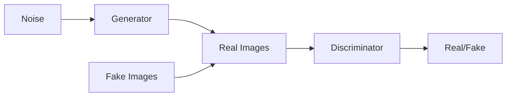

                 

**关键词：数字艺术、人工智能、生成对抗网络、创造性计算、区块链、数字资产**

## 1. 背景介绍

在硅谷这个高科技的中心，艺术和技术正在奇妙地结合，诞生出一种全新的数字艺术形式。这种结合的产物之一就是生成对抗网络（Generative Adversarial Networks，GANs）创作的数字艺术。GANs是一种人工智能算法，能够创造出具有高度艺术性的图像、音乐和其他数字媒体。硅谷的艺术家村正在利用这些技术，创造出前所未有的数字艺术形式，并将其与区块链技术结合，创建数字资产。

## 2. 核心概念与联系

### 2.1 生成对抗网络（GANs）

GANs是一种人工神经网络，由两个网络组成：生成器（Generator）和判别器（Discriminator）。生成器负责创造新的数据（如图像），而判别器则负责判断这些数据是否真实。两个网络相互竞争，不断改进，直到生成器能够创造出足够逼真的数据，以至于判别器无法区分真假。



### 2.2 数字资产与区块链

数字资产是数字形式的资产，可以是数字图像、音乐、视频等。区块链是一种分布式账本技术，可以用于记录和验证数字资产的所有权和交易。当数字资产与区块链结合时，艺术家可以创建独一无二的数字资产，并将其作为非同质化代币（NFT）出售。

## 3. 核心算法原理 & 具体操作步骤

### 3.1 算法原理概述

GANs的原理是基于对抗学习的。生成器和判别器都是神经网络，它们通过反向传播优化自己的参数，以改进自己的性能。生成器的目标是创造出判别器无法区分真假的数据，而判别器的目标则是正确地判断数据的真假。

### 3.2 算法步骤详解

1. 初始化生成器和判别器的参数。
2. 为生成器提供随机噪声输入。
3. 生成器创造出新的数据（如图像）。
4. 判别器接收生成器创造的数据和真实数据，并判断哪些是真实的。
5. 计算生成器和判别器的损失函数。
6. 使用反向传播优化生成器和判别器的参数。
7. 重复步骤2-6，直到生成器能够创造出足够逼真的数据。

### 3.3 算法优缺点

**优点：**

* GANs能够创造出高度逼真的数据。
* GANs可以用于各种数据类型，如图像、音乐、文本等。

**缺点：**

* GANs训练过程不稳定，容易陷入模式崩溃。
* GANs创造的数据可能缺乏多样性。
* GANs需要大量的计算资源。

### 3.4 算法应用领域

GANs的应用领域非常广泛，包括图像生成、图像超分辨率、图像风格转换、音乐生成、文本生成等。在数字艺术领域，GANs可以创造出独特的图像、音乐和其他数字媒体。

## 4. 数学模型和公式 & 详细讲解 & 举例说明

### 4.1 数学模型构建

GANs的数学模型可以表示为一个最小化最大化的问题。生成器的目标是最小化判别器的损失函数，而判别器的目标则是最大化自己的损失函数。数学模型可以表示为：

$$ \min_G \max_D V(D, G) = \mathbb{E}_{x \sim p_{data}(x)}[\log D(x)] + \mathbb{E}_{z \sim p_z(z)}[\log(1 - D(G(z)))] $$

其中，$p_{data}(x)$是真实数据的分布，$p_z(z)$是噪声输入的分布，$G(z)$是生成器创造的数据，$D(x)$是判别器对数据$x$的判断结果。

### 4.2 公式推导过程

GANs的数学模型是基于对抗学习的概念推导出来的。对抗学习的目标是最小化生成器的损失函数，最大化判别器的损失函数。通过使用对数几率损失函数，可以将这个目标转化为上述数学模型。

### 4.3 案例分析与讲解

例如，我们可以使用GANs创造出独特的图像。首先，我们需要收集一组真实的图像作为训练数据。然后，我们初始化生成器和判别器的参数，并开始训练过程。在训练过程中，生成器和判别器相互竞争，不断改进，直到生成器能够创造出判别器无法区分真假的图像。最后，我们可以使用生成器创造出独特的图像。

## 5. 项目实践：代码实例和详细解释说明

### 5.1 开发环境搭建

要实现GANs，我们需要一个支持深度学习的开发环境。推荐使用Python语言，并配合TensorFlow或PyTorch框架。我们还需要一个GPU加速的环境，以加快训练过程。

### 5.2 源代码详细实现

以下是一个简单的GANs实现示例，使用TensorFlow框架和MNIST数据集：

```python
import tensorflow as tf
from tensorflow.keras import layers

def make_generator_model():
    model = tf.keras.Sequential()
    model.add(layers.Dense(7*7*256, use_bias=False, input_shape=(100,)))
    model.add(layers.BatchNormalization())
    model.add(layers.LeakyReLU())

    model.add(layers.Reshape((7, 7, 256)))
    assert model.output_shape == (None, 7, 7, 256)

    model.add(layers.Conv2DTranspose(128, (5, 5), strides=(1, 1), padding='same', use_bias=False))
    assert model.output_shape == (None, 7, 7, 128)
    model.add(layers.BatchNormalization())
    model.add(layers.LeakyReLU())

    model.add(layers.Conv2DTranspose(64, (5, 5), strides=(2, 2), padding='same', use_bias=False))
    assert model.output_shape == (None, 14, 14, 64)
    model.add(layers.BatchNormalization())
    model.add(layers.LeakyReLU())

    model.add(layers.Conv2DTranspose(1, (5, 5), strides=(2, 2), padding='same', use_bias=False, activation='tanh'))
    assert model.output_shape == (None, 28, 28, 1)

    return model

def make_discriminator_model():
    model = tf.keras.Sequential()
    model.add(layers.Conv2D(64, (5, 5), strides=(2, 2), padding='same',
                                     input_shape=[28, 28, 1]))
    model.add(layers.LeakyReLU())
    model.add(layers.Dropout(0.3))

    model.add(layers.Conv2D(128, (5, 5), strides=(2, 2), padding='same'))
    model.add(layers.LeakyReLU())
    model.add(layers.Dropout(0.3))

    model.add(layers.Flatten())
    model.add(layers.Dense(1))

    return model
```

### 5.3 代码解读与分析

在上述代码中，我们定义了生成器和判别器的模型。生成器是一个全连接层和转置卷积层的组合，用于创造出图像。判别器则是一个卷积层和全连接层的组合，用于判断图像的真假。

### 5.4 运行结果展示

在训练过程中，我们可以观察生成器创造出的图像。随着训练的进行，图像会变得越来越逼真。最终，生成器可以创造出判别器无法区分真假的图像。

## 6. 实际应用场景

### 6.1 数字艺术创作

GANs可以用于创造出独特的数字艺术。例如，艺术家可以使用GANs创造出独特的图像，并将其作为NFT出售。数字艺术市场正在兴起，GANs可以为艺术家提供一种新的创作工具。

### 6.2 数字资产交易

数字资产可以通过区块链技术进行交易。当数字资产与区块链结合时，艺术家可以创建独一无二的数字资产，并将其作为NFT出售。这为数字艺术市场提供了新的可能性。

### 6.3 未来应用展望

未来，GANs和区块链技术可能会结合得更加紧密。例如，GANs可以用于创造出独特的数字资产，这些资产可以通过区块链技术进行交易。此外，GANs还可以用于创造出独特的音乐、视频和其他数字媒体，为各种行业提供新的可能性。

## 7. 工具和资源推荐

### 7.1 学习资源推荐

* "Generative Adversarial Networks" - Ian Goodfellow, Yoshua Bengio, and Aaron Courville
* "Art and Artificial Intelligence: A Survey" - Mario Klingemann
* "CryptoKitties Whitepaper" - Axiom Zen

### 7.2 开发工具推荐

* TensorFlow - 深度学习框架
* PyTorch - 深度学习框架
* Truffle - 以太坊智能合约开发框架
* Remix - 以太坊智能合约在线编辑器

### 7.3 相关论文推荐

* "A Style-Based Generator Architecture for Generative Adversarial Networks" - Christopher Ainsworth, et al.
* "The Next Generation of Digital Art: A Survey of Generative Adversarial Networks in Art" - Mario Klingemann
* "CryptoKitties: A Decentralized Game for Collecting and Breeding Digital Cats" - Axiom Zen

## 8. 总结：未来发展趋势与挑战

### 8.1 研究成果总结

在本文中，我们介绍了GANs和区块链技术在数字艺术领域的应用。我们讨论了GANs的原理、算法步骤、优缺点和应用领域。我们还介绍了数字资产与区块链的结合，并提供了项目实践示例。

### 8.2 未来发展趋势

未来，GANs和区块链技术可能会结合得更加紧密。例如，GANs可以用于创造出独特的数字资产，这些资产可以通过区块链技术进行交易。此外，GANs还可以用于创造出独特的音乐、视频和其他数字媒体，为各种行业提供新的可能性。

### 8.3 面临的挑战

GANs和区块链技术都面临着挑战。GANs的训练过程不稳定，容易陷入模式崩溃。区块链技术则面临着安全、可扩展性和监管等挑战。未来的研究需要解决这些挑战，以推动技术的发展。

### 8.4 研究展望

未来的研究可以从以下几个方向展开：

* GANs的稳定训练方法
* GANs在其他数据类型（如音乐、视频）的应用
* GANs和区块链技术的结合
* GANs在其他领域（如医疗、金融）的应用

## 9. 附录：常见问题与解答

**Q：GANs的训练过程为什么不稳定？**

A：GANs的训练过程不稳定是因为生成器和判别器的竞争关系。如果生成器的性能提高得太快，判别器可能会无法跟上，从而导致模式崩溃。反之亦然。未来的研究需要解决这个问题，以稳定GANs的训练过程。

**Q：区块链技术面临着哪些挑战？**

A：区块链技术面临着安全、可扩展性和监管等挑战。例如，区块链系统需要防止黑客攻击和恶意行为。此外，区块链系统需要能够处理大量的交易，以满足用户的需求。最后，区块链技术需要遵循监管机构的规定，以确保合法性。

**Q：GANs和区块链技术的结合有哪些应用？**

A：GANs和区块链技术的结合可以用于创造出独特的数字资产，这些资产可以通过区块链技术进行交易。此外，GANs还可以用于创造出独特的音乐、视频和其他数字媒体，为各种行业提供新的可能性。

## 作者：禅与计算机程序设计艺术 / Zen and the Art of Computer Programming

