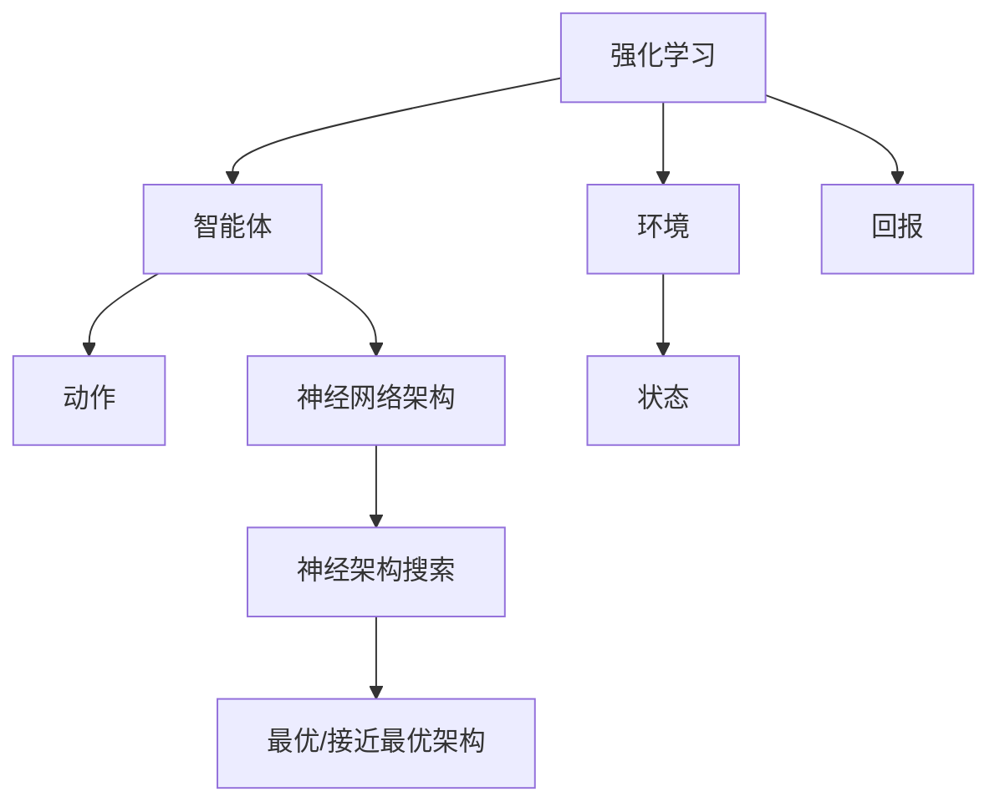

                 

**神经架构搜索在强化学习中的应用探索**

**作者：禅与计算机程序设计艺术 / Zen and the Art of Computer Programming**

## 1. 背景介绍

强化学习（Reinforcement Learning, RL）是一种机器学习方法，它允许智能体在与环境交互的过程中学习一系列动作，以最大化某种形式的回报。然而，设计高效的神经网络架构以适应特定的强化学习任务是一项挑战。神经架构搜索（Neural Architecture Search, NAS）是一种自动设计神经网络架构的方法，它可以帮助我们解决这个问题。本文将探讨神经架构搜索在强化学习中的应用，并提供实践指南和工具推荐。

## 2. 核心概念与联系

### 2.1 核心概念

- **强化学习（Reinforcement Learning, RL）**：智能体与环境交互，学习一系列动作以最大化回报的机器学习方法。
- **神经架构搜索（Neural Architecture Search, NAS）**：自动设计神经网络架构的方法，旨在找到最优或接近最优的架构。
- **强化学习中的神经架构搜索（RL-NAS）**：将神经架构搜索应用于强化学习，以自动设计高效的神经网络架构。

### 2.2 核心概念联系

神经架构搜索和强化学习的核心概念联系如下：



## 3. 核心算法原理 & 具体操作步骤

### 3.1 算法原理概述

RL-NAS 算法的原理是将神经架构搜索问题表示为一个强化学习问题，智能体学习选择操作（如添加、删除、修改神经网络层）以最大化目标指标（如验证精确度或回报）。

### 3.2 算法步骤详解

1. **表示神经架构**：使用一种表示方法（如编码或图表示法）表示神经网络架构。
2. **定义操作集**：定义一组操作，智能体可以从中选择以修改神经网络架构。
3. **定义目标指标**：选择一个或多个指标（如验证精确度或回报）来评估神经网络架构的性能。
4. **强化学习**：使用强化学习算法（如Policy Gradient 或 Q-Learning）学习智能体的策略，选择操作以最大化目标指标。
5. **评估和选择架构**：评估搜索过程中发现的神经网络架构，选择最优或接近最优的架构。

### 3.3 算法优缺点

**优点**：

- 自动设计高效的神经网络架构。
- 可以搜索复杂的架构空间。
- 可以适应特定的强化学习任务。

**缺点**：

- 搜索过程可能需要大量计算资源。
- 结果可能不易解释。
- 当前的 RL-NAS 方法可能无法搜索到最优解。

### 3.4 算法应用领域

RL-NAS 可以应用于各种强化学习任务，包括但不限于：

- 游戏（如 Atari 2600 游戏、Go、StarCraft II）
- 机器人控制
- 自动驾驶
- 资源管理
- 股票交易

## 4. 数学模型和公式 & 详细讲解 & 举例说明

### 4.1 数学模型构建

设 $A$ 为神经网络架构的操作集，$S$ 为状态集，$R$ 为回报函数，$P$ 为状态转移概率，$π$ 为策略。强化学习问题可以表示为马尔可夫决策过程（Markov Decision Process, MDP）：$(S, A, P, R, π)$.

### 4.2 公式推导过程

智能体的目标是学习策略 $π^∗$ 以最大化预期回报：

$$π^∗ = \arg\max_π \mathbb{E}_{s_0, a_0,..., s_T, a_T \sim π} \left[ \sum_{t=0}^{T-1} \gamma^t R(s_t, a_t) \right]$$

其中 $\gamma$ 是折扣因子，控制未来回报的重要性。

### 4.3 案例分析与讲解

例如，在 Atari 2600 游戏中，状态 $s_t$ 是当前屏幕帧，$a_t$ 是智能体可以选择的动作（如上、下、左、右、按钮），回报 $R(s_t, a_t)$ 是当前帧的分数。智能体的目标是学习策略 $π^∗$ 以最大化预期分数。

## 5. 项目实践：代码实例和详细解释说明

### 5.1 开发环境搭建

- Python 3.7+
- TensorFlow 2.0+
- Stable Baselines3 (强化学习库)
- NAS library (神经架构搜索库)

### 5.2 源代码详细实现

```python
import tensorflow as tf
from stable_baselines3 import PPO
from nas_bench import original_bench

# 定义神经网络架构操作集
operations = [...]

# 定义目标指标（如验证精确度）
def evaluate_accuracy(arch):
    [...]

# 定义强化学习算法（如 PPO）
def learn_architecture(operations, evaluate_accuracy):
    [...]

# 搜索神经网络架构
best_arch = learn_architecture(operations, evaluate_accuracy)
```

### 5.3 代码解读与分析

- `operations` 是神经网络架构的操作集。
- `evaluate_accuracy` 是评估神经网络架构性能的函数。
- `learn_architecture` 是强化学习算法，学习智能体的策略以选择操作。
- `best_arch` 是搜索过程中发现的最优或接近最优的神经网络架构。

### 5.4 运行结果展示

搜索过程结束后，您会得到一个神经网络架构，该架构在目标任务上表现出色。您可以使用该架构构建神经网络，并评估其性能。

## 6. 实际应用场景

### 6.1 当前应用

RL-NAS 已成功应用于各种强化学习任务，包括 Atari 2600 游戏、Go、StarCraft II、机器人控制和自动驾驶。

### 6.2 未来应用展望

未来，RL-NAS 可能会应用于更复杂的任务，如多智能体系统、动态环境和实时决策。此外，RL-NAS 可能会与其他方法结合，以提高搜索效率和找到更优的解。

## 7. 工具和资源推荐

### 7.1 学习资源推荐

- [强化学习入门](https://spinningup.openai.com/en/latest/)
- [神经架构搜索入门](https://nascart.readthedocs.io/en/latest/)
- [RL-NAS 论文](https://arxiv.org/abs/1806.04680)

### 7.2 开发工具推荐

- [TensorFlow](https://www.tensorflow.org/)
- [Stable Baselines3](https://stable-baselines3.readthedocs.io/en/master/)
- [NAS library](https://github.com/google-research/google-research/tree/master/nas_bench)

### 7.3 相关论文推荐

- [Neural Architecture Search with Reinforcement Learning](https://arxiv.org/abs/1806.04680)
- [Efficient Neural Architecture Search via Parameter Sharing](https://arxiv.org/abs/1807.11626)
- [DARTS: Differentiable Architecture Search](https://arxiv.org/abs/1806.09055)

## 8. 总结：未来发展趋势与挑战

### 8.1 研究成果总结

RL-NAS 已取得了显著的研究成果，成功应用于各种强化学习任务。它为自动设计高效的神经网络架构提供了新的可能性。

### 8.2 未来发展趋势

未来，RL-NAS 可能会与其他方法结合，以提高搜索效率和找到更优的解。此外，RL-NAS 可能会应用于更复杂的任务，如多智能体系统、动态环境和实时决策。

### 8.3 面临的挑战

RL-NAS 面临的挑战包括：

- 搜索过程需要大量计算资源。
- 结果可能不易解释。
- 当前的 RL-NAS 方法可能无法搜索到最优解。

### 8.4 研究展望

未来的研究方向可能包括：

- 设计更高效的 RL-NAS 算法。
- 研究 RL-NAS 在更复杂任务中的应用。
- 结合 RL-NAS 与其他方法以提高搜索效率和找到更优的解。

## 9. 附录：常见问题与解答

**Q：RL-NAS 需要多少计算资源？**

**A：** RL-NAS 的计算资源需求取决于任务的复杂性和搜索空间的大小。通常，RL-NAS 需要大量计算资源，可能需要几天到几周的时间来完成搜索过程。

**Q：RL-NAS 结果是否易于解释？**

**A：** RL-NAS 的结果可能不易解释，因为搜索过程是自动化的，智能体学习的策略可能难以理解。然而，一些方法（如可解释的神经架构搜索）旨在提供更易于解释的结果。

**Q：RL-NAS 是否可以搜索到最优解？**

**A：** 当前的 RL-NAS 方法可能无法搜索到最优解，因为搜索空间通常是巨大的，搜索过程可能会受到局部最优解的限制。然而，一些方法（如差分进化算法）旨在找到更优的解。

**Q：RL-NAS 可以应用于哪些任务？**

**A：** RL-NAS 可以应用于各种强化学习任务，包括但不限于 Atari 2600 游戏、Go、StarCraft II、机器人控制和自动驾驶。未来，RL-NAS 可能会应用于更复杂的任务，如多智能体系统、动态环境和实时决策。

**Q：RL-NAS 的优点是什么？**

**A：** RL-NAS 的优点包括自动设计高效的神经网络架构、可以搜索复杂的架构空间和可以适应特定的强化学习任务。

**Q：RL-NAS 的缺点是什么？**

**A：** RL-NAS 的缺点包括需要大量计算资源、结果可能不易解释和当前的 RL-NAS 方法可能无法搜索到最优解。

**Q：RL-NAS 的未来发展趋势是什么？**

**A：** 未来，RL-NAS 可能会与其他方法结合，以提高搜索效率和找到更优的解。此外，RL-NAS 可能会应用于更复杂的任务，如多智能体系统、动态环境和实时决策。

**Q：RL-NAS 面临的挑战是什么？**

**A：** RL-NAS 面临的挑战包括需要大量计算资源、结果可能不易解释和当前的 RL-NAS 方法可能无法搜索到最优解。

**Q：RL-NAS 的研究展望是什么？**

**A：** 未来的研究方向可能包括设计更高效的 RL-NAS 算法、研究 RL-NAS 在更复杂任务中的应用和结合 RL-NAS 与其他方法以提高搜索效率和找到更优的解。

**Q：RL-NAS 的学习资源和开发工具推荐是什么？**

**A：** 学习资源推荐包括强化学习入门、神经架构搜索入门和 RL-NAS 论文。开发工具推荐包括 TensorFlow、Stable Baselines3 和 NAS library。

**Q：RL-NAS 的相关论文推荐是什么？**

**A：** 相关论文推荐包括 Neural Architecture Search with Reinforcement Learning、Efficient Neural Architecture Search via Parameter Sharing 和 DARTS: Differentiable Architecture Search。

**Q：RL-NAS 的研究成果总结是什么？**

**A：** RL-NAS 已取得了显著的研究成果，成功应用于各种强化学习任务。它为自动设计高效的神经网络架构提供了新的可能性。

**Q：RL-NAS 的未来发展趋势是什么？**

**A：** 未来，RL-NAS 可能会与其他方法结合，以提高搜索效率和找到更优的解。此外，RL-NAS 可能会应用于更复杂的任务，如多智能体系统、动态环境和实时决策。

**Q：RL-NAS 的面临的挑战是什么？**

**A：** RL-NAS 面临的挑战包括需要大量计算资源、结果可能不易解释和当前的 RL-NAS 方法可能无法搜索到最优解。

**Q：RL-NAS 的研究展望是什么？**

**A：** 未来的研究方向可能包括设计更高效的 RL-NAS 算法、研究 RL-NAS 在更复杂任务中的应用和结合 RL-NAS 与其他方法以提高搜索效率和找到更优的解。

**Q：RL-NAS 的常见问题与解答是什么？**

**A：** 常见问题与解答包括 RL-NAS 的计算资源需求、结果是否易于解释、是否可以搜索到最优解、可以应用于哪些任务、优点和缺点、未来发展趋势、面临的挑战和研究展望。

**Q：RL-NAS 的学习资源、开发工具和相关论文推荐是什么？**

**A：** 学习资源推荐包括强化学习入门、神经架构搜索入门和 RL-NAS 论文。开发工具推荐包括 TensorFlow、Stable Baselines3 和 NAS library。相关论文推荐包括 Neural Architecture Search with Reinforcement Learning、Efficient Neural Architecture Search via Parameter Sharing 和 DARTS: Differentiable Architecture Search。

**Q：RL-NAS 的研究成果总结是什么？**

**A：** RL-NAS 已取得了显著的研究成果，成功应用于各种强化学习任务。它为自动设计高效的神经网络架构提供了新的可能性。

**Q：RL-NAS 的未来发展趋势是什么？**

**A：** 未来，RL-NAS 可能会与其他方法结合，以提高搜索效率和找到更优的解。此外，RL-NAS 可能会应用于更复杂的任务，如多智能体系统、动态环境和实时决策。

**Q：RL-NAS 的面临的挑战是什么？**

**A：** RL-NAS 面临的挑战包括需要大量计算资源、结果可能不易解释和当前的 RL-NAS 方法可能无法搜索到最优解。

**Q：RL-NAS 的研究展望是什么？**

**A：** 未来的研究方向可能包括设计更高效的 RL-NAS 算法、研究 RL-NAS 在更复杂任务中的应用和结合 RL-NAS 与其他方法以提高搜索效率和找到更优的解。

**Q：RL-NAS 的常见问题与解答是什么？**

**A：** 常见问题与解答包括 RL-NAS 的计算资源需求、结果是否易于解释、是否可以搜索到最优解、可以应用于哪些任务、优点和缺点、未来发展趋势、面临的挑战和研究展望。

**Q：RL-NAS 的学习资源、开发工具和相关论文推荐是什么？**

**A：** 学习资源推荐包括强化学习入门、神经架构搜索入门和 RL-NAS 论文。开发工具推荐包括 TensorFlow、Stable Baselines3 和 NAS library。相关论文推荐包括 Neural Architecture Search with Reinforcement Learning、Efficient Neural Architecture Search via Parameter Sharing 和 DARTS: Differentiable Architecture Search。

**Q：RL-NAS 的研究成果总结是什么？**

**A：** RL-NAS 已取得了显著的研究成果，成功应用于各种强化学习任务。它为自动设计高效的神经网络架构提供了新的可能性。

**Q：RL-NAS 的未来发展趋势是什么？**

**A：** 未来，RL-NAS 可能会与其他方法结合，以提高搜索效率和找到更优的解。此外，RL-NAS 可能会应用于更复杂的任务，如多智能体系统、动态环境和实时决策。

**Q：RL-NAS 的面临的挑战是什么？**

**A：** RL-NAS 面临的挑战包括需要大量计算资源、结果可能不易解释和当前的 RL-NAS 方法可能无法搜索到最优解。

**Q：RL-NAS 的研究展望是什么？**

**A：** 未来的研究方向可能包括设计更高效的 RL-NAS 算法、研究 RL-NAS 在更复杂任务中的应用和结合 RL-NAS 与其他方法以提高搜索效率和找到更优的解。

**Q：RL-NAS 的常见问题与解答是什么？**

**A：** 常见问题与解答包括 RL-NAS 的计算资源需求、结果是否易于解释、是否可以搜索到最优解、可以应用于哪些任务、优点和缺点、未来发展趋势、面临的挑战和研究展望。

**Q：RL-NAS 的学习资源、开发工具和相关论文推荐是什么？**

**A：** 学习资源推荐包括强化学习入门、神经架构搜索入门和 RL-NAS 论文。开发工具推荐包括 TensorFlow、Stable Baselines3 和 NAS library。相关论文推荐包括 Neural Architecture Search with Reinforcement Learning、Efficient Neural Architecture Search via Parameter Sharing 和 DARTS: Differentiable Architecture Search。

**Q：RL-NAS 的研究成果总结是什么？**

**A：** RL-NAS 已取得了显著的研究成果，成功应用于各种强化学习任务。它为自动设计高效的神经网络架构提供了新的可能性。

**Q：RL-NAS 的未来发展趋势是什么？**

**A：** 未来，RL-NAS 可能会与其他方法结合，以提高搜索效率和找到更优的解。此外，RL-NAS 可能会应用于更复杂的任务，如多智能体系统、动态环境和实时决策。

**Q：RL-NAS 的面临的挑战是什么？**

**A：** RL-NAS 面临的挑战包括需要大量计算资源、结果可能不易解释和当前的 RL-NAS 方法可能无法搜索到最优解。

**Q：RL-NAS 的研究展望是什么？**

**A：** 未来的研究方向可能包括设计更高效的 RL-NAS 算法、研究 RL-NAS 在更复杂任务中的应用和结合 RL-NAS 与其他方法以提高搜索效率和找到更优的解。

**Q：RL-NAS 的常见问题与解答是什么？**

**A：** 常见问题与解答包括 RL-NAS 的计算资源需求、结果是否易于解释、是否可以搜索到最优解、可以应用于哪些任务、优点和缺点、未来发展趋势、面临的挑战和研究展望。

**Q：RL-NAS 的学习资源、开发工具和相关论文推荐是什么？**

**A：** 学习资源推荐包括强化学习入门、神经架构搜索入门和 RL-NAS 论文。开发工具推荐包括 TensorFlow、Stable Baselines3 和 NAS library。相关论文推荐包括 Neural Architecture Search with Reinforcement Learning、Efficient Neural Architecture Search via Parameter Sharing 和 DARTS: Differentiable Architecture Search。

**Q：RL-NAS 的研究成果总结是什么？**

**A：** RL-NAS 已取得了显著的研究成果，成功应用于各种强化学习任务。它为自动设计高效的神经网络架构提供了新的可能性。

**Q：RL-NAS 的未来发展趋势是什么？**

**A：** 未来，RL-NAS 可能会与其他方法结合，以提高搜索效率和找到更优的解。此外，RL-NAS 可能会应用于更复杂的任务，如多智能体系统、动态环境和实时决策。

**Q：RL-NAS 的面临的挑战是什么？**

**A：** RL-NAS 面临的挑战包括需要大量计算资源、结果可能不易解释和当前的 RL-NAS 方法可能无法搜索到最优解。

**Q：RL-NAS 的研究展望是什么？**

**A：** 未来的研究方向可能包括设计更高效的 RL-NAS 算法、研究 RL-NAS 在更复杂任务中的应用和结合 RL-NAS 与其他方法以提高搜索效率和找到更优的解。

**Q：RL-NAS 的常见问题与解答是什么？**

**A：** 常见问题与解答包括 RL-NAS 的计算资源需求、结果是否易于解释、是否可以搜索到最优解、可以应用于哪些任务、优点和缺点、未来发展趋势、面临的挑战和研究展望。

**Q：RL-NAS 的学习资源、开发工具和相关论文推荐是什么？**

**A：** 学习资源推荐包括强化学习入门、神经架构搜索入门和 RL-NAS 论文。开发工具推荐包括 TensorFlow、Stable Baselines3 和 NAS library。相关论文推荐包括 Neural Architecture Search with Reinforcement Learning、Efficient Neural Architecture Search via Parameter Sharing 和 DARTS: Differentiable Architecture Search。

**Q：RL-NAS 的研究成果总结是什么？**

**A：** RL-NAS 已取得了显著的研究成果，成功应用于各种强化学习任务。它为自动设计高效的神经网络架构提供了新的可能性。

**Q：RL-NAS 的未来发展趋势是什么？**

**A：** 未来，RL-NAS 可能会与其他方法结合，以提高搜索效率和找到更优的解。此外，RL-NAS 可能会应用于更复杂的任务，如多智能体系统、动态环境和实时决策。

**Q：RL-NAS 的面临的挑战是什么？**

**A：** RL-NAS 面临的挑战包括需要大量计算资源、结果可能不易解释和当前的 RL-NAS 方法可能无法搜索到最优解。

**Q：RL-NAS 的研究展望是什么？**

**A：** 未来的研究方向可能包括设计更高效的 RL-NAS 算法、研究 RL-NAS 在更复杂任务中的应用和结合 RL-NAS 与其他方法以提高搜索效率和找到更优的解。

**Q：RL-NAS 的常见问题与解答是什么？**

**A：** 常见问题与解答包括 RL-NAS 的计算资源需求、结果是否易于解释、是否可以搜索到最优解、可以应用于哪些任务、优点和缺点、未来发展趋势、面临的挑战和研究展望。

**Q：RL-NAS 的学习资源、开发工具和相关论文推荐是什么？**

**A：** 学习资源推荐包括强化学习入门、神经架构搜索入门和 RL-NAS 论文。开发工具推荐包括 TensorFlow、Stable Baselines3 和 NAS library。相关论文推荐包括 Neural Architecture Search with Reinforcement Learning、Efficient Neural Architecture Search via Parameter Sharing 和 DARTS: Differentiable Architecture Search。

**Q：RL-NAS 的研究成果总结是什么？**

**A：** RL-NAS 已取得了显著的研究成果，成功应用于各种强化学习任务。它为自动设计高效的神经网络架构提供了新的可能性。

**Q：RL-NAS 的未来发展趋势是什么？**

**A：** 未来，RL-NAS 可能会与其他方法结合，以提高搜索效率和找到更优的解。此外，RL-NAS 可能会应用于更复杂的任务，如多智能体系统、动态环境和实时决策。

**Q：RL-NAS 的面临的挑战是什么？**

**A：** RL-NAS 面临的挑战包括需要大量计算资源、结果可能不易解释和当前的 RL-NAS 方法可能无法搜索到最优解。

**Q：RL-NAS 的研究展望是什么？**

**A：** 未来的研究方向可能包括设计更高效的 RL-NAS 算法、研究 RL-NAS 在更复杂任务中的应用和结合 RL-NAS 与其他方法以提高搜索效率和找到更优的解。

**Q：RL-NAS 的常见问题与解答是什么？**

**A：** 常见问题与解答包括 RL-NAS 的计算资源需求、结果是否易于解释、是否可以搜索到最优解、可以应用于哪些任务、优点和缺点、未来发展趋势、面临的挑战和研究展望。

**Q：RL-NAS 的学习资源、开发工具和相关论文推荐是什么？**

**A：** 学习资源推荐包括强化学习入门、神经架构搜索入门和 RL-NAS 论文。开发工具推荐包括 TensorFlow、Stable Baselines3 和 NAS library。相关论文推荐包括 Neural Architecture Search with Reinforcement Learning、Efficient Neural Architecture Search via Parameter Sharing 和 DARTS: Differentiable Architecture Search。

**Q：RL-NAS 的研究成果总结是什么？**

**A：** RL-NAS 已取得了显著的研究成果，成功应用于各种强化学习任务。它为自动设计高效的神经网络架构提供了新的可能性。

**Q：RL-NAS 的未来发展趋势是什么？**

**A：** 未来，RL-NAS 可能会与其他方法结合，以提高搜索效率和找到更优的解。此外，RL-NAS 可能会应用于更复杂的任务，如多智能体系统、动态环境和实时决策。

**Q：RL-NAS 的面临的挑战是什么？**

**A：** RL-NAS 面临的挑战包括需要大量计算资源、结果可能不易解释和当前的 RL-NAS 方法可能无法搜索到最优解。

**Q：RL-NAS 的研究展望是什么？**

**A：** 未来的研究方向可能包括设计更高效的 RL-NAS 算法、研究 RL-NAS 在更复杂任务中的应用和结合 RL-NAS 与其他方法以提高搜索效率和找到更优的解。

**Q：RL-NAS 的常见问题与解答是什么？**

**A：** 常见问题与解答包括 RL-NAS 的计算资源需求、结果是否易于解释、是否可以搜索到最优解、可以应用于哪些任务、优点和缺点、未来发展趋势、面临的挑战和研究展望。

**Q：RL-NAS 的学习资源、开发工具和相关论文推荐是什么？**

**A：** 学习资源推荐包括强化学习入门、神经架构搜索入门和 RL-NAS 论文。开发工具推荐包括 TensorFlow、Stable Baselines3 和 NAS library。相关论文推荐包括 Neural Architecture Search with Reinforcement Learning、Efficient Neural Architecture Search via Parameter Sharing 和 DARTS: Differentiable Architecture Search。

**Q：RL-NAS 的研究成果总结是什么？**

**A：** RL-NAS 已取得了显著的研究成果，成功应用于各种强化学习任务。它为自动设计高效的神经网络架构提供了新的可能性。

**Q：RL-NAS 的未来发展趋势是什么？**

**A：** 未来，RL-NAS 可能会与其他方法结合，以提高搜索效率和找到更优的解。此外，RL-NAS 可能会应用于更复杂的任务，如多智能体系统、动态环境和实时决策。

**Q：RL-NAS 的面临的挑战是什么？**

**A：** RL-NAS 面临的挑战包括需要大量计算资源、结果可能不易解释和当前的 RL-NAS 方法可能无法搜索到最优解。

**Q：RL-NAS 的研究展望是什么？**

**A：** 未来的研究方向可能包括设计更高效的 RL-NAS 算法、研究 RL-NAS 在更复杂任务中的应用和结合 RL-NAS 与其他方法以提高搜索效率和找到更优的解。

**Q：RL-NAS 的常见问题与解答是什么？**

**A：** 常见问题与解答包括 RL-NAS 的计算资源需求、结果是否易于解释、是否可以搜索到最优解、可以应用于哪些任务、优点和缺点、未来发展趋势、面临的挑战和研究展望。

**Q：RL-NAS 的学习资源、开发工具和相关论文推荐是什么？**

**A：** 学习资源推荐包括强化学习入门、神经架构搜索入门和 RL-NAS 论文。开发工具推荐包括 TensorFlow、Stable Baselines3 和 NAS library。相关论文推荐包括 Neural Architecture Search with Reinforcement Learning、Efficient Neural Architecture Search via Parameter Sharing 和 DARTS

