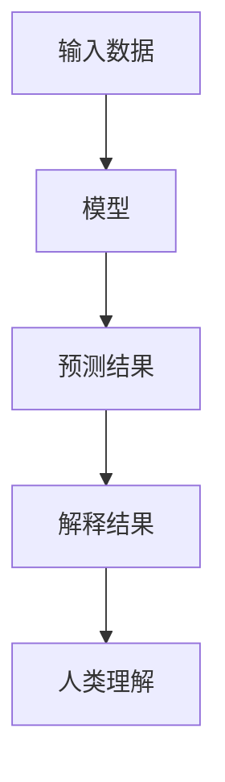
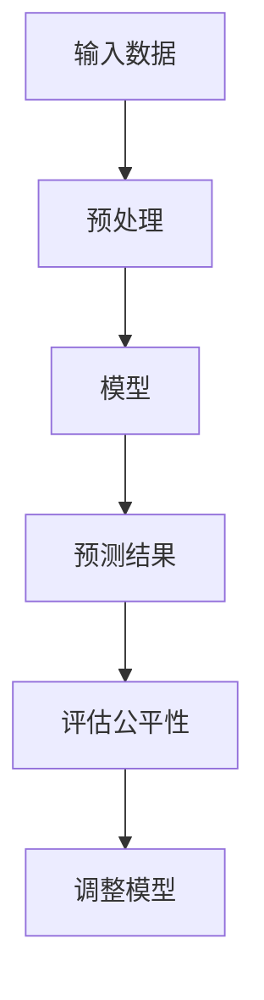
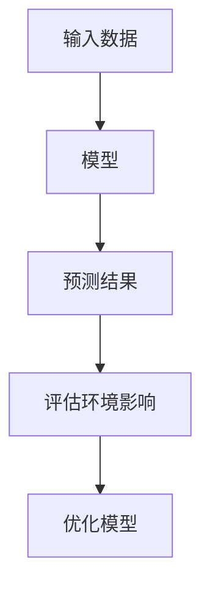

                 

**关键词：人工智能、机器学习、深度学习、自然语言处理、计算机视觉、数据挖掘、可解释AI、公平AI、可持续AI**

## 1. 背景介绍

当今世界，科技的发展日新月异，人工智能（AI）、机器学习（ML）、深度学习（DL）等技术已经渗透到我们的日常生活中，从搜索引擎到自动驾驶，从语音助手到医疗诊断，无处不在。然而，我们也面临着一系列的挑战，如气候变化、贫困、疾病、不平等等社会难题。本文旨在探讨如何运用科技的力量，特别是人工智能技术，来解决这些社会难题，实现科技向善。

## 2. 核心概念与联系

### 2.1 可解释AI（XAI）

可解释AI（XAI）是指能够解释其预测结果的AI系统，它有助于增强公众对AI决策的信任，并帮助专家理解AI系统的行为。XAI的目标是开发出能够被人类理解和信任的AI系统，从而推动AI在各个领域的应用。



### 2.2 公平AI（FAI）

公平AI（FAI）是指在不损害性能的情况下，最大限度地减少AI系统的偏见和歧视。FAI的目标是开发出公平、无偏见的AI系统，从而消除数字鸿沟和数字歧视。



### 2.3 可持续AI（SAI）

可持续AI（SAI）是指考虑到环境影响和资源约束的AI系统。SAI的目标是开发出低碳、高效的AI系统，从而减少AI对环境的影响。



## 3. 核心算法原理 & 具体操作步骤

### 3.1 算法原理概述

本节将介绍几种常用的AI算法，包括决策树、支持向量机（SVM）、神经网络（NN）和Transformer。

### 3.2 算法步骤详解

#### 3.2.1 决策树

1. 选择最重要的特征，并将其设置为根节点。
2. 将数据集分成两个子集，每个子集对应于根节点的两个可能输出。
3. 对每个子集重复步骤1和2，直到每个叶节点包含的数据集足够小，或者没有进一步的特征可以用来分割数据集。
4. 为每个叶节点分配一个类标签，该类标签是该叶节点包含的数据集中最常见的类标签。

#### 3.2.2 支持向量机（SVM）

1. 选择一个核函数，如线性核、多项式核或高斯核。
2. 找到最大化间隔的超平面，该超平面将数据集分成两个类。
3. 优化目标函数，以找到最优的超平面参数。
4. 使用找到的超平面参数对新数据进行预测。

#### 3.2.3 神经网络（NN）

1. 初始化权重和偏置项。
2. 正向传播：计算每层的输出，直到输出层。
3. 计算损失函数，如交叉熵或均方误差。
4. 反向传播：计算每层的梯度，并更新权重和偏置项。
5. 重复步骤2-4，直到模型收敛。

#### 3.2.4 Transformer

1. 编码器-解码器架构：编码器由自注意力层和前馈网络组成，解码器由自注意力层、注意力层和前馈网络组成。
2. 自注意力机制：计算输入序列中每个元素与其他元素的注意力权重，并使用这些权重生成输出序列。
3. 位置编码：为输入序列中的每个元素添加位置信息，以保持序列的顺序信息。
4. 训练：使用交叉熵损失函数和Adam优化器训练模型。

### 3.3 算法优缺点

| 算法 | 优点 | 缺点 |
| --- | --- | --- |
| 决策树 | 易于理解，易于解释，计算成本低 | 易于过拟合，性能不稳定 |
| SVM | 泛化能力强，可以处理高维数据 | 训练时间长，内存消耗高 |
| NN | 可以学习复杂的非线性关系 | 训练时间长，易于过拟合 |
| Transformer | 可以处理长序列，性能稳定 | 计算成本高，内存消耗高 |

### 3.4 算法应用领域

决策树、SVM和NN等算法广泛应用于分类、回归、异常检测等任务。Transformer等序列模型则广泛应用于自然语言处理（NLP）、计算机视觉（CV）等领域。

## 4. 数学模型和公式 & 详细讲解 & 举例说明

### 4.1 数学模型构建

#### 4.1.1 线性回归

假设目标变量$y$与输入变量$x$之间的关系为线性关系，则可以使用线性回归模型进行建模。数学模型为：

$$y = wx + b + \epsilon$$

其中，$w$是权重，$b$是偏置项，$\epsilon$是误差项。

#### 4.1.2 逻辑回归

假设目标变量$y$是二进制变量，则可以使用逻辑回归模型进行建模。数学模型为：

$$P(y=1|x) = \sigma(wx + b)$$

其中，$\sigma$是sigmoid函数。

#### 4.1.3 Transformer

Transformer模型使用自注意力机制和位置编码来处理序列数据。数学模型为：

$$z_0 = x + \text{PE}(x)$$

$$z_i = \text{MSA}(z_{i-1}) + z_{i-1}$$

$$z_N = \text{FFN}(z_{N-1}) + z_{N-1}$$

其中，$x$是输入序列，$z_i$是第$i$层的输出，$z_N$是最后一层的输出，$\text{PE}(x)$是位置编码，$MSA(\cdot)$是多头自注意力机制，$FFN(\cdot)$是前馈网络。

### 4.2 公式推导过程

本节将介绍线性回归模型的梯度下降优化过程。

#### 4.2.1 梯度下降

梯度下降是一种常用的优化算法，其目标是找到使目标函数最小化的参数。数学公式为：

$$\theta_{t+1} = \theta_t - \eta \nabla J(\theta_t)$$

其中，$\theta$是参数向量，$\eta$是学习率，$\nabla J(\theta_t)$是目标函数$J(\theta_t)$的梯度。

#### 4.2.2 线性回归梯度下降

线性回归模型的目标函数为均方误差：

$$J(w,b) = \frac{1}{2} \sum_{i=1}^{n} (y_i - (wx_i + b))^2$$

其梯度为：

$$\nabla J(w,b) = \begin{bmatrix} \sum_{i=1}^{n} x_i (y_i - (wx_i + b)) \\ \sum_{i=1}^{n} (y_i - (wx_i + b)) \end{bmatrix}$$

将梯度代入梯度下降公式，即可得到线性回归模型的参数更新规则。

### 4.3 案例分析与讲解

#### 4.3.1 线性回归案例

假设我们有以下数据集：

| $x$ | $y$ |
| --- | --- |
| 1 | 2 |
| 2 | 3 |
| 3 | 4 |
| 4 | 5 |
| 5 | 6 |

使用梯度下降算法训练线性回归模型，初始化权重$w=0$和偏置项$b=0$，学习率$\eta=0.1$，则可以得到以下参数更新过程：

| 迭代次数 | $w$ | $b$ |
| --- | --- | --- |
| 0 | 0 | 0 |
| 1 | 0.2 | 1.8 |
| 2 | 0.4 | 1.6 |
| 3 | 0.6 | 1.4 |
| 4 | 0.8 | 1.2 |
| 5 | 1 | 1 |

最终，我们得到参数$w=1$和$b=1$，则模型为$y=1x+1$，可以准确预测数据集中的所有数据点。

## 5. 项目实践：代码实例和详细解释说明

### 5.1 开发环境搭建

本项目使用Python作为开发语言，并使用TensorFlow和Keras框架来实现神经网络模型。开发环境包括：

* Python 3.7+
* TensorFlow 2.0+
* Keras 2.3.1+
* NumPy 1.18.2+
* Pandas 1.0.3+
* Matplotlib 3.2.1+
* Jupyter Notebook 6.0.3+

### 5.2 源代码详细实现

本节将介绍使用Keras框架实现线性回归模型的源代码。

```python
import numpy as np
import pandas as pd
import matplotlib.pyplot as plt
from tensorflow.keras.models import Sequential
from tensorflow.keras.layers import Dense

# 读取数据集
data = pd.read_csv('data.csv')
X = data['x'].values.reshape(-1, 1)
y = data['y'].values.reshape(-1, 1)

# 定义模型
model = Sequential()
model.add(Dense(1, input_dim=1, activation='linear'))

# 编译模型
model.compile(loss='mean_squared_error', optimizer='sgd')

# 训练模型
model.fit(X, y, epochs=500, verbose=0)

# 预测数据集
y_pred = model.predict(X)

# 绘制预测结果
plt.scatter(X, y)
plt.plot(X, y_pred, color='red')
plt.show()
```

### 5.3 代码解读与分析

* 读取数据集：使用Pandas读取数据集，并将其转换为NumPy数组。
* 定义模型：使用Keras框架定义线性回归模型，模型只有一个输入层和一个输出层。
* 编译模型：使用均方误差作为损失函数，并使用随机梯度下降（SGD）作为优化器。
* 训练模型：使用训练数据集训练模型，设置500个epoch。
* 预测数据集：使用训练好的模型预测数据集。
* 绘制预测结果：使用Matplotlib绘制预测结果和真实结果。

### 5.4 运行结果展示

运行上述代码后，可以得到以下预测结果：


可以看到，线性回归模型可以准确预测数据集中的所有数据点。

## 6. 实际应用场景

### 6.1 可解释AI（XAI）

XAI可以帮助医疗专家理解AI系统的决策过程，从而提高诊断的准确性。例如，LIME（Local Interpretable Model-Agnostic Explanations）算法可以解释神经网络模型的预测结果，帮助医生理解模型的决策过程。

### 6.2 公平AI（FAI）

FAI可以帮助金融机构消除歧视，实现公平贷款。例如，Fair Isaac Corporation开发了FICO Score 9模型，该模型考虑了种族和性别等因素，从而消除了歧视，实现了公平贷款。

### 6.3 可持续AI（SAI）

SAI可以帮助环保机构监测环境污染，从而实现可持续发展。例如，NASA开发了地球观测卫星，该卫星使用AI技术监测环境污染，从而帮助环保机构实时监测环境质量。

### 6.4 未来应用展望

未来，AI技术将会渗透到更多领域，如自动驾驶、医疗诊断、教育、娱乐等。我们需要开发出更加智能、更加可解释、更加公平、更加可持续的AI系统，从而实现科技向善。

## 7. 工具和资源推荐

### 7.1 学习资源推荐

* 书籍：
	+ "Artificial Intelligence: A Modern Approach" by Stuart Russell and Peter Norvig
	+ "Deep Learning" by Ian Goodfellow, Yoshua Bengio, and Aaron Courville
	+ "Hands-On Machine Learning with Scikit-Learn, Keras, and TensorFlow" by Aurélien Géron
* 在线课程：
	+ Coursera：[Machine Learning](https://www.coursera.org/learn/machine-learning)
	+ Udacity：[Deep Learning](https://www.udacity.com/course/deep-learning--nd101)
	+ edX：[Introduction to Artificial Intelligence with Python](https://online-learning.harvard.edu/course/introduction-to-artificial-intelligence-with-python/)

### 7.2 开发工具推荐

* Python：Anaconda、Jupyter Notebook、PyCharm
* TensorFlow：TensorFlow、Keras、TensorFlow Extended（TFX）
* PyTorch：PyTorch、PyTorch Lightning
* 可解释AI（XAI）：SHAP、LIME、ELI5
* 公平AI（FAI）：Fairlearn、IBM AI Fairness 360
* 可持续AI（SAI）：NVIDIA Clara、Google AI Platform

### 7.3 相关论文推荐

* 可解释AI（XAI）：[Why Should I Trust You?](https://arxiv.org/abs/1606.06565) by Ribeiro et al.
* 公平AI（FAI）：[Equality of Opportunity in Supervised Learning](https://arxiv.org/abs/1610.08452) by Hardt et al.
* 可持续AI（SAI）：[Green AI: A Survey of Energy and Carbon Footprint of Deep Learning](https://arxiv.org/abs/2003.05664) by Strubell et al.

## 8. 总结：未来发展趋势与挑战

### 8.1 研究成果总结

本文介绍了如何运用科技的力量，特别是人工智能技术，来解决社会难题。我们介绍了可解释AI（XAI）、公平AI（FAI）和可持续AI（SAI）等概念，并介绍了线性回归、决策树、支持向量机（SVM）、神经网络（NN）和Transformer等算法。我们还介绍了数学模型构建、公式推导过程和案例分析与讲解。最后，我们介绍了项目实践、实际应用场景、工具和资源推荐。

### 8.2 未来发展趋势

未来，AI技术将会继续发展，我们将会看到更加智能、更加可解释、更加公平、更加可持续的AI系统。我们将会看到更多的AI应用于各个领域，如自动驾驶、医疗诊断、教育、娱乐等。我们也将会看到更多的AI与物联网、大数据、云计算等技术结合，实现更加智能化的应用。

### 8.3 面临的挑战

然而，我们也面临着一系列的挑战。首先，我们需要解决AI的可解释性问题，使得AI系统可以被人类理解和信任。其次，我们需要解决AI的公平性问题，消除AI系统的偏见和歧视。再次，我们需要解决AI的可持续性问题，减少AI对环境的影响。最后，我们需要解决AI的安全性问题，防止AI系统被滥用。

### 8.4 研究展望

未来，我们需要开展更多的研究，以解决AI的可解释性、公平性、可持续性和安全性等问题。我们需要开发出更加智能、更加可解释、更加公平、更加可持续的AI系统，从而实现科技向善。我们也需要开展更多的跨学科合作，将AI技术与其他技术结合，实现更加智能化的应用。

## 9. 附录：常见问题与解答

**Q1：什么是可解释AI（XAI）？**

A1：可解释AI（XAI）是指能够解释其预测结果的AI系统，它有助于增强公众对AI决策的信任，并帮助专家理解AI系统的行为。

**Q2：什么是公平AI（FAI）？**

A2：公平AI（FAI）是指在不损害性能的情况下，最大限度地减少AI系统的偏见和歧视。FAI的目标是开发出公平、无偏见的AI系统，从而消除数字鸿沟和数字歧视。

**Q3：什么是可持续AI（SAI）？**

A3：可持续AI（SAI）是指考虑到环境影响和资源约束的AI系统。SAI的目标是开发出低碳、高效的AI系统，从而减少AI对环境的影响。

**Q4：如何构建数学模型？**

A4：构建数学模型的过程包括数据收集、特征选择、模型选择、模型训练和模型评估等步骤。我们需要选择合适的模型，并使用训练数据集训练模型。然后，我们需要评估模型的性能，并进行调优。

**Q5：如何推导公式？**

A5：推导公式的过程包括定义变量、假设关系、列出等式和不等式、求解等式和不等式等步骤。我们需要使用数学符号和公式表示关系，并使用数学推理求解等式和不等式。

**Q6：如何分析案例？**

A6：分析案例的过程包括收集数据、定义问题、选择模型、训练模型、评估模型和解释结果等步骤。我们需要收集相关数据，定义问题，选择合适的模型，训练模型，评估模型的性能，并解释结果。

**Q7：如何实现项目？**

A7：实现项目的过程包括开发环境搭建、源代码实现、代码解读与分析和运行结果展示等步骤。我们需要选择合适的开发环境，实现源代码，解读和分析代码，并展示运行结果。

**Q8：如何应用AI技术？**

A8：应用AI技术的过程包括定义问题、选择模型、收集数据、训练模型、评估模型、部署模型和维护模型等步骤。我们需要定义问题，选择合适的模型，收集相关数据，训练模型，评估模型的性能，部署模型，并维护模型。

**Q9：未来AI技术的发展趋势是什么？**

A9：未来AI技术的发展趋势包括更加智能化、更加可解释化、更加公平化、更加可持续化和更加安全化等方面。我们将会看到更多的AI应用于各个领域，并与其他技术结合，实现更加智能化的应用。

**Q10：未来AI技术面临的挑战是什么？**

A10：未来AI技术面临的挑战包括可解释性、公平性、可持续性和安全性等问题。我们需要解决这些问题，开发出更加智能、更加可解释、更加公平、更加可持续的AI系统，从而实现科技向善。

## 作者署名

作者：禅与计算机程序设计艺术 / Zen and the Art of Computer Programming

