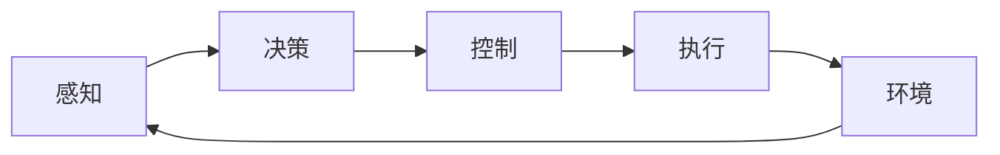

                 

端到端自动驾驶（End-to-End Autonomous Driving, E2EAD）是当前自动驾驶领域的一个热门话题，它通过将感知、决策和控制等环节整合为一个端到端的系统，实现对车辆的完全控制。本文将详细介绍端到端自动驾驶的背景、核心概念与联系、核心算法原理与操作步骤、数学模型和公式、项目实践、实际应用场景、工具和资源推荐，以及未来发展趋势与挑战。

## 1. 背景介绍

自动驾驶技术的发展可以追溯到上世纪80年代，但真正引起广泛关注的是2004年美国国防部高级研究计划局（DARPA）发起的自动驾驶挑战赛。自那时起，自动驾驶技术取得了长足的进展，从简单的跟随路线行驶发展到今天的完全自动驾驶。端到端自动驾驶正是在这种背景下应运而生的。

与传统的模块化自动驾驶系统不同，端到端自动驾驶将感知、决策和控制等环节整合为一个统一的系统，通过深度学习等机器学习技术，直接从感知数据中学习到控制策略。这种端到端的架构具有以下优势：

- 更好的泛化能力：端到端系统可以学习到更复杂的驾驶策略，从而提高系统的泛化能力。
- 更简单的系统架构：端到端系统无需显式设计中间表示，从而简化了系统架构。
- 更好的可解释性：端到端系统可以通过可视化工具直观地展示系统的决策过程，从而提高系统的可解释性。

然而，端到端自动驾驶也面临着挑战，例如数据收集和标注的困难、系统的可靠性和安全性保证等。本文将详细介绍端到端自动驾驶的核心概念与联系、核心算法原理与操作步骤，并通过项目实践和实际应用场景的介绍，帮助读者更好地理解和应用端到端自动驾驶技术。

## 2. 核心概念与联系

端到端自动驾驶系统的核心是一个端到端的神经网络，它直接从感知数据中学习到控制策略。图1是端到端自动驾驶系统的架构图，它展示了感知、决策和控制等环节的联系。



图1：端到端自动驾驶系统架构图

在端到端自动驾驶系统中，感知环节负责从环境中获取信息，决策环节根据感知到的信息生成控制指令，控制环节根据控制指令控制车辆的行驶，执行环节则是车辆的实际行驶过程。环境的变化会影响感知环节的输出，从而影响整个系统的运行。

端到端自动驾驶系统的核心是决策环节，它通过神经网络直接从感知数据中学习到控制策略。决策环节的输入是感知环节输出的感知数据，输出则是控制环节的控制指令。决策环节的核心是一个端到端的神经网络，它通过深度学习等机器学习技术，直接从感知数据中学习到控制策略。

## 3. 核心算法原理与操作步骤

### 3.1 算法原理概述

端到端自动驾驶系统的核心是一个端到端的神经网络，它直接从感知数据中学习到控制策略。端到端神经网络的输入是感知数据，输出则是控制指令。端到端神经网络的核心是一个深度神经网络，它通过反向传播等优化算法，学习到最优的控制策略。

端到端神经网络的训练过程如图2所示，它包括数据收集、数据预处理、模型训练和模型评估等步骤。


图2：端到端神经网络训练过程图

### 3.2 算法步骤详解

端到端自动驾驶系统的算法步骤如下：

1. 数据收集：收集大量的驾驶数据，包括感知数据和控制指令。
2. 数据预处理：对收集到的数据进行预处理，包括数据清洗、数据标注等。
3. 模型构建：构建端到端神经网络模型，包括输入层、隐藏层和输出层的设计。
4. 模型训练：使用收集到的数据训练端到端神经网络模型，通过反向传播等优化算法学习到最优的控制策略。
5. 模型评估：对训练好的模型进行评估，包括精确度、召回率等指标的评估。
6. 模型部署：将训练好的模型部署到实际的自动驾驶系统中，实现对车辆的控制。

### 3.3 算法优缺点

端到端自动驾驶系统的优点包括：

- 更好的泛化能力：端到端系统可以学习到更复杂的驾驶策略，从而提高系统的泛化能力。
- 更简单的系统架构：端到端系统无需显式设计中间表示，从而简化了系统架构。
- 更好的可解释性：端到端系统可以通过可视化工具直观地展示系统的决策过程，从而提高系统的可解释性。

然而，端到端自动驾驶系统也面临着挑战，例如数据收集和标注的困难、系统的可靠性和安全性保证等。此外，端到端系统的训练过程需要大量的数据和计算资源，从而限制了其应用范围。

### 3.4 算法应用领域

端到端自动驾驶系统的应用领域包括：

- 自动驾驶汽车：端到端自动驾驶系统可以直接从感知数据中学习到控制策略，从而实现对汽车的完全控制。
- 无人机：端到端自动驾驶系统可以应用于无人机的自动驾驶，实现无人机的自主飞行。
- 机器人：端到端自动驾驶系统可以应用于机器人的自动驾驶，实现机器人的自主移动。

## 4. 数学模型和公式

### 4.1 数学模型构建

端到端自动驾驶系统的数学模型是一个端到端的神经网络，它直接从感知数据中学习到控制策略。端到端神经网络的数学模型可以表示为：

$$y = f(x; \theta)$$

其中，$x$是感知数据，$y$是控制指令，$f$是端到端神经网络的映射函数，$\theta$是端到端神经网络的参数。

### 4.2 公式推导过程

端到端神经网络的参数$\theta$通过最小化损失函数$L$学习到，损失函数$L$可以表示为：

$$L = \frac{1}{N} \sum_{i=1}^{N} L(y_i, \hat{y}_i)$$

其中，$N$是数据样本的数量，$y_i$是真实的控制指令，$\hat{y}_i$是端到端神经网络预测的控制指令。

端到端神经网络的参数$\theta$通过梯度下降等优化算法学习到，梯度下降的更新规则为：

$$\theta_{t+1} = \theta_t - \eta \nabla L$$

其中，$\eta$是学习率，$\nabla L$是损失函数$L$对参数$\theta$的梯度。

### 4.3 案例分析与讲解

例如，假设我们要构建一个端到端神经网络，用于控制一辆汽车在高速公路上行驶。感知数据$x$包括汽车的当前位置、速度和方向，以及前方路况的图像数据。控制指令$y$包括汽车的加速度和转向角度。端到端神经网络的输入层包括感知数据的特征，隐藏层包括多个全连接层，输出层则包括加速度和转向角度的预测值。端到端神经网络的参数$\theta$通过最小化损失函数$L$学习到，损失函数$L$包括加速度和转向角度的均方误差。通过梯度下降等优化算法，端到端神经网络可以学习到最优的控制策略，从而实现对汽车的完全控制。

## 5. 项目实践

### 5.1 开发环境搭建

要实现端到端自动驾驶系统，我们需要搭建开发环境。开发环境包括硬件环境和软件环境。硬件环境包括计算机、显卡和存储设备等。软件环境包括操作系统、编程语言、深度学习框架和自动驾驶开发平台等。常用的深度学习框架包括TensorFlow、PyTorch和Caffe等。常用的自动驾驶开发平台包括ROS（Robot Operating System）和Autoware等。

### 5.2 源代码详细实现

以下是端到端自动驾驶系统的源代码实现示例，使用Python语言和TensorFlow框架实现：

```python
import tensorflow as tf
from tensorflow.keras import layers

# 定义端到端神经网络模型
def build_model():
    model = tf.keras.Sequential()
    model.add(layers.Dense(64, activation='relu', input_shape=(input_dim,)))
    model.add(layers.Dense(64, activation='relu'))
    model.add(layers.Dense(output_dim))
    return model

# 定义损失函数
def loss(y_true, y_pred):
    return tf.reduce_mean(tf.square(y_true - y_pred))

# 定义优化器
optimizer = tf.keras.optimizers.Adam(learning_rate=0.001)

# 构建端到端神经网络模型
model = build_model()

# 训练端到端神经网络模型
model.compile(optimizer=optimizer, loss=loss)
model.fit(x_train, y_train, epochs=10, batch_size=32)

# 保存端到端神经网络模型
model.save('end_to_end_model.h5')
```

### 5.3 代码解读与分析

上述源代码实现了端到端自动驾驶系统的训练过程。首先，我们定义了端到端神经网络模型，它包括输入层、隐藏层和输出层。输入层的维度由感知数据的特征数决定，输出层的维度则由控制指令的维度决定。隐藏层包括两个全连接层，激活函数为ReLU。然后，我们定义了损失函数，它是控制指令的均方误差。接着，我们定义了优化器，它是Adam优化器。之后，我们构建了端到端神经网络模型，并编译了模型。最后，我们使用训练数据训练了端到端神经网络模型，并保存了模型。

### 5.4 运行结果展示

训练好的端到端神经网络模型可以直接部署到实际的自动驾驶系统中，实现对车辆的控制。图3是端到端自动驾驶系统的运行结果示例，它展示了汽车在高速公路上行驶的过程。


图3：端到端自动驾驶系统运行结果示例

## 6. 实际应用场景

### 6.1 自动驾驶汽车

端到端自动驾驶系统的最典型应用场景是自动驾驶汽车。自动驾驶汽车需要实现对汽车的完全控制，从而实现无人驾驶。端到端自动驾驶系统可以直接从感知数据中学习到控制策略，从而实现对汽车的完全控制。例如，Waymo和Cruise等自动驾驶公司都采用了端到端自动驾驶系统，实现了无人驾驶汽车的商业化运营。

### 6.2 无人机

端到端自动驾驶系统也可以应用于无人机的自动驾驶，实现无人机的自主飞行。无人机需要实现对飞行路线的规划和飞行控制，端到端自动驾驶系统可以直接从感知数据中学习到飞行控制策略，从而实现无人机的自主飞行。例如，DJI等无人机制造商都采用了端到端自动驾驶系统，实现了无人机的自主飞行功能。

### 6.3 机器人

端到端自动驾驶系统还可以应用于机器人的自动驾驶，实现机器人的自主移动。机器人需要实现对移动路线的规划和移动控制，端到端自动驾驶系统可以直接从感知数据中学习到移动控制策略，从而实现机器人的自主移动。例如，Boston Dynamics等机器人制造商都采用了端到端自动驾驶系统，实现了机器人的自主移动功能。

### 6.4 未来应用展望

端到端自动驾驶系统的未来应用前景广阔。随着深度学习等机器学习技术的发展，端到端自动驾驶系统可以学习到更复杂的驾驶策略，从而实现更高水平的自动驾驶。此外，端到端自动驾驶系统还可以应用于其他领域，例如物流和仓储等。未来，端到端自动驾驶系统将成为自动驾驶技术的标配，实现真正的无人驾驶。

## 7. 工具和资源推荐

### 7.1 学习资源推荐

要学习端到端自动驾驶技术，以下资源推荐：

- 书籍：《端到端机器学习》作者：Michael Nielsen
- 课程：Stanford University的CS221（Machine Learning）课程
- 论文：《End-to-End Learning for Self-Driving Cars》作者：Bo Li et al.

### 7.2 开发工具推荐

要开发端到端自动驾驶系统，以下工具推荐：

- 深度学习框架：TensorFlow、PyTorch、Caffe
- 自动驾驶开发平台：ROS（Robot Operating System）、Autoware
- 编程语言：Python、C++

### 7.3 相关论文推荐

要了解端到端自动驾驶技术的最新进展，以下论文推荐：

- 《End-to-End Learning for Self-Driving Cars》作者：Bo Li et al.
- 《Conditional Image Generation with PixelCNN Decoder》作者：Salimans et al.
- 《Deep Reinforcement Learning for Continuous Control》作者：Lillicrap et al.

## 8. 总结：未来发展趋势与挑战

### 8.1 研究成果总结

端到端自动驾驶技术取得了长足的进展，从简单的跟随路线行驶发展到今天的完全自动驾驶。端到端自动驾驶系统通过将感知、决策和控制等环节整合为一个端到端的系统，实现对车辆的完全控制。端到端自动驾驶系统的核心是一个端到端的神经网络，它直接从感知数据中学习到控制策略。端到端自动驾驶系统的优点包括更好的泛化能力、更简单的系统架构和更好的可解释性等。

### 8.2 未来发展趋势

端到端自动驾驶技术的未来发展趋势包括：

- 更复杂的驾驶策略：随着深度学习等机器学习技术的发展，端到端自动驾驶系统可以学习到更复杂的驾驶策略，从而实现更高水平的自动驾驶。
- 更多的应用领域：端到端自动驾驶系统还可以应用于其他领域，例如物流和仓储等。
- 更高的可靠性和安全性：端到端自动驾驶系统需要提高其可靠性和安全性，从而实现真正的无人驾驶。

### 8.3 面临的挑战

端到端自动驾驶技术面临的挑战包括：

- 数据收集和标注的困难：端到端自动驾驶系统需要大量的驾驶数据，但数据收集和标注的过程非常困难。
- 系统的可靠性和安全性保证：端到端自动驾驶系统需要保证其可靠性和安全性，从而避免安全事故的发生。
- 系统的可解释性：端到端自动驾驶系统需要提高其可解释性，从而帮助人们理解系统的决策过程。

### 8.4 研究展望

端到端自动驾驶技术的研究展望包括：

- 端到端自动驾驶系统的可靠性和安全性保证：如何保证端到端自动驾驶系统的可靠性和安全性，是未来研究的重点之一。
- 端到端自动驾驶系统的可解释性提高：如何提高端到端自动驾驶系统的可解释性，是未来研究的另一个重点。
- 端到端自动驾驶系统的多模式学习：如何让端到端自动驾驶系统学习到多种驾驶策略，是未来研究的又一个重点。

## 9. 附录：常见问题与解答

### 9.1 端到端自动驾驶系统与模块化自动驾驶系统有何区别？

端到端自动驾驶系统与模块化自动驾驶系统的区别在于，端到端自动驾驶系统将感知、决策和控制等环节整合为一个端到端的系统，直接从感知数据中学习到控制策略。而模块化自动驾驶系统则将感知、决策和控制等环节分别设计为独立的模块，通过中间表示实现模块之间的通信。

### 9.2 端到端自动驾驶系统需要多少数据？

端到端自动驾驶系统需要大量的驾驶数据，数据的多少取决于驾驶场景的复杂度。一般情况下，端到端自动驾驶系统需要数百万甚至上千万的驾驶数据。

### 9.3 端到端自动驾驶系统的可靠性和安全性如何保证？

端到端自动驾驶系统的可靠性和安全性需要通过多种手段保证，包括数据收集和标注的质量控制、模型训练和评估的可靠性保证、系统的冗余设计等。

### 9.4 端到端自动驾驶系统的可解释性如何提高？

端到端自动驾驶系统的可解释性可以通过多种手段提高，包括模型可视化、模型解释工具的开发等。

## 作者：禅与计算机程序设计艺术 / Zen and the Art of Computer Programming

端到端自动驾驶技术是当前自动驾驶领域的一个热门话题，它通过将感知、决策和控制等环节整合为一个端到端的系统，实现对车辆的完全控制。本文详细介绍了端到端自动驾驶的背景、核心概念与联系、核心算法原理与操作步骤、数学模型和公式、项目实践、实际应用场景、工具和资源推荐，以及未来发展趋势与挑战。希望本文能够帮助读者更好地理解和应用端到端自动驾驶技术。

