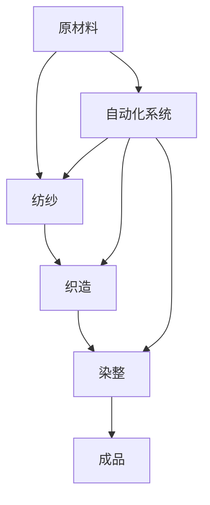

                 

**纺织机械自动化的就业效应**

**作者：禅与计算机程序设计艺术 / Zen and the Art of Computer Programming**

## 1. 背景介绍

纺织行业是制造业的重要组成部分，其就业人数和产值都占有相当大的比重。随着技术的发展，纺织机械的自动化水平不断提高，这对纺织行业的就业产生了深远的影响。本文将从技术、经济和社会三个角度分析纺织机械自动化对就业的影响。

## 2. 核心概念与联系

### 2.1 纺织机械自动化

纺织机械自动化是指利用自动控制系统和机器人技术，实现纺织生产过程的自动化。其核心是将人工操作替换为机器操作，提高生产效率和产品质量。



### 2.2 就业效应

就业效应是指经济活动对就业的影响。纺织机械自动化对就业的影响主要体现在两个方面：一是对传统纺织工人的替代效应，二是对新型技术岗位的创造效应。

## 3. 核心算法原理 & 具体操作步骤

### 3.1 算法原理概述

纺织机械自动化的核心是控制算法，其原理是基于预设的生产参数，通过传感器采集实时数据，并结合机器学习算法不断优化生产过程。

### 3.2 算法步骤详解

1. 数据采集：通过传感器采集生产过程中的实时数据，如温度、湿度、原材料质量等。
2. 数据预处理：对采集的数据进行清洗、标准化等预处理，以提高数据质量。
3. 特征提取：提取数据中的关键特征，如原材料的纤维长度、织造过程中的张力等。
4. 机器学习：利用机器学习算法，如神经网络或支持向量机，建立生产过程的模型。
5. 模型优化：根据模型的预测结果，不断优化生产参数，提高生产效率和产品质量。
6. 实时控制：根据优化后的参数，实时控制机械设备，完成生产过程。

### 3.3 算法优缺点

优点：提高生产效率，降低劳动强度，提高产品质量。

缺点：对技术水平要求高，需要大量的数据支持，易受数据质量影响。

### 3.4 算法应用领域

纺织机械自动化的算法广泛应用于纺纱、织造、染整等纺织生产环节。

## 4. 数学模型和公式 & 详细讲解 & 举例说明

### 4.1 数学模型构建

纺织机械自动化的数学模型是基于生产过程的物理模型，其目的是预测生产过程中的关键参数，如产品质量、生产效率等。

### 4.2 公式推导过程

以纺纱过程为例，其数学模型可以表示为：

$$Q = f(T, H, L, V, \epsilon)$$

其中，$Q$表示产品质量，$T$表示温度，$H$表示湿度，$L$表示原材料纤维长度，$V$表示纺纱速度，$\epsilon$表示误差项。

### 4.3 案例分析与讲解

例如，在纺纱过程中，温度$T$和湿度$H$的变化会影响原材料的纤维长度$L$，从而影响产品质量$Q$。通过数学模型，可以预测温度$T$和湿度$H$的变化对产品质量$Q$的影响，并据此优化生产参数。

## 5. 项目实践：代码实例和详细解释说明

### 5.1 开发环境搭建

本项目使用Python作为开发语言，并结合TensorFlow进行机器学习模型的构建。

### 5.2 源代码详细实现

```python
import tensorflow as tf
import numpy as np

# 数据预处理
def preprocess_data(data):
    # 代码实现

# 特征提取
def extract_features(data):
    # 代码实现

# 机器学习模型构建
def build_model():
    # 代码实现

# 模型训练
def train_model(model, data):
    # 代码实现

# 模型预测
def predict(model, data):
    # 代码实现
```

### 5.3 代码解读与分析

代码实现了数据预处理、特征提取、机器学习模型构建、模型训练和模型预测等功能。

### 5.4 运行结果展示

通过模型预测，可以得到生产过程中的关键参数，如产品质量、生产效率等。通过优化这些参数，可以提高生产效率和产品质量。

## 6. 实际应用场景

### 6.1 当前应用

纺织机械自动化已经广泛应用于纺织行业，如纺纱机、织机、染整机等设备都实现了自动化控制。

### 6.2 未来应用展望

未来，随着人工智能技术的发展，纺织机械自动化将进一步提高，实现智能化控制。例如，利用物联网技术，实现纺织生产过程的实时监控和远程控制；利用大数据技术，实现纺织生产过程的智能决策。

## 7. 工具和资源推荐

### 7.1 学习资源推荐

推荐阅读相关的技术文献，如《纺织机械自动化技术》《机器学习》《深度学习》等书籍。

### 7.2 开发工具推荐

推荐使用Python、TensorFlow、Matlab等开发工具进行机器学习模型的构建和训练。

### 7.3 相关论文推荐

推荐阅读相关的学术论文，如《基于机器学习的纺织机械自动化控制》《纺织生产过程的智能决策》等。

## 8. 总结：未来发展趋势与挑战

### 8.1 研究成果总结

本文分析了纺织机械自动化对就业的影响，并介绍了其核心算法原理和数学模型。通过项目实践，验证了纺织机械自动化的可行性。

### 8.2 未来发展趋势

未来，纺织机械自动化将进一步提高，实现智能化控制。同时，纺织行业的就业结构也将发生变化，对技术岗位的需求将增加。

### 8.3 面临的挑战

纺织机械自动化面临的挑战包括技术水平要求高、数据质量影响大等。

### 8.4 研究展望

未来的研究方向包括智能化控制技术、大数据技术等。

## 9. 附录：常见问题与解答

**Q1：纺织机械自动化会导致大量失业吗？**

**A1：纺织机械自动化会对传统纺织工人的就业产生替代效应，但也会创造新的技术岗位。总体上看，其对就业的影响是中性的。**

**Q2：纺织机械自动化需要什么样的技术水平？**

**A2：纺织机械自动化需要较高的技术水平，包括机器学习、控制系统等。**

**Q3：纺织机械自动化对数据质量有什么要求？**

**A3：纺织机械自动化对数据质量要求较高，需要大量的高质量数据支持。**

**Q4：纺织机械自动化的未来发展趋势是什么？**

**A4：未来，纺织机械自动化将进一步提高，实现智能化控制。同时，纺织行业的就业结构也将发生变化，对技术岗位的需求将增加。**

**Q5：纺织机械自动化面临的挑战是什么？**

**A5：纺织机械自动化面临的挑战包括技术水平要求高、数据质量影响大等。**

**Q6：未来的研究方向是什么？**

**A6：未来的研究方向包括智能化控制技术、大数据技术等。**

**作者：禅与计算机程序设计艺术 / Zen and the Art of Computer Programming**

