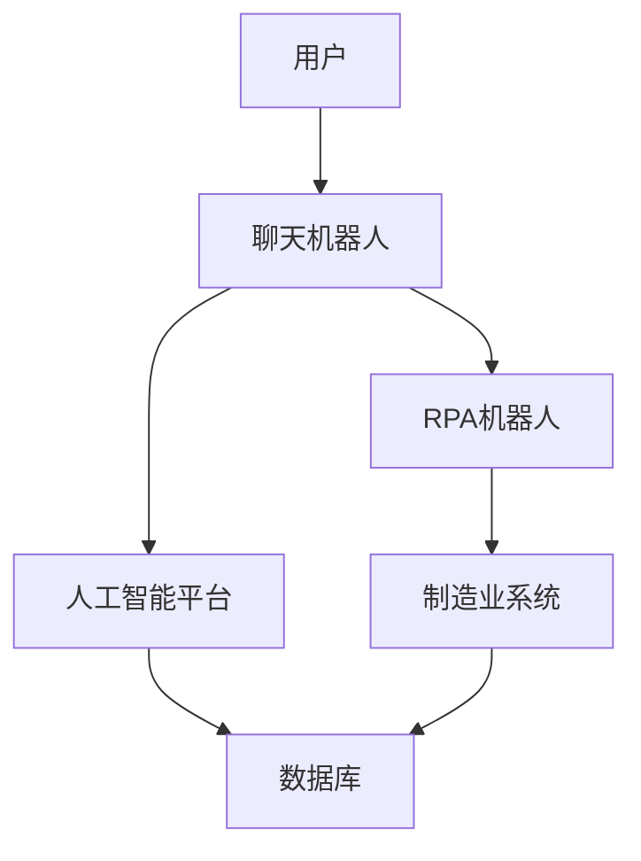

                 

**关键词：聊天机器人、制造业4.0、机器人流程自动化、人工智能、自然语言处理、机器学习**

## 1. 背景介绍

随着人工智能技术的飞速发展，聊天机器人已经渗透到各个行业，为用户提供了更加便捷的服务。制造业作为国民经济的基础，也在积极拥抱智能化转型。本文将聚焦于制造业4.0背景下的聊天机器人应用，重点介绍机器人流程自动化（RPA）在制造业中的应用，并结合具体算法和数学模型进行深入分析。

## 2. 核心概念与联系

### 2.1 制造业4.0

制造业4.0是指利用数字技术和智能制造技术，实现制造业的智能化、数字化转型的新模式。它的核心是将互联网、大数据、人工智能等技术与制造业深度融合，实现制造业的智能化、柔性化、绿色化和服务化。

### 2.2 机器人流程自动化（RPA）

RPA是指通过软件机器人模拟人类操作员的行为，自动化完成重复性高、结构化的业务流程。RPA机器人可以执行各种规则驱动的任务，如数据录入、文件处理、报表生成等，从而提高工作效率，降低人工成本。

### 2.3 聊天机器人与RPA的联系

聊天机器人和RPA的结合，可以实现更高级别的自动化。聊天机器人负责与用户交互，理解用户需求，并将任务指派给RPA机器人执行。这种协同工作模式可以大大提高制造业的生产效率和服务质量。



## 3. 核心算法原理 & 具体操作步骤

### 3.1 算法原理概述

聊天机器人与RPA的结合，需要涉及自然语言处理（NLP）、机器学习（ML）和RPA算法。其中，NLP用于理解用户需求，ML用于预测最佳执行方案，RPA算法用于执行具体任务。

### 3.2 算法步骤详解

1. **用户输入**：用户通过文本或语音输入需求。
2. **意图识别**：聊天机器人使用NLP算法（如BERT、ELMo等）识别用户意图。
3. **实体提取**：提取用户输入中的关键实体（如产品名称、数量等）。
4. **任务预测**：基于意图和实体，使用ML算法（如随机森林、支持向量机等）预测最佳执行方案。
5. **任务执行**：RPA机器人根据预测结果执行具体任务。
6. **结果反馈**：RPA机器人将执行结果反馈给聊天机器人，聊天机器人再将结果反馈给用户。

### 3.3 算法优缺点

**优点**：提高了制造业的自动化水平，降低了人工成本，提高了服务质量和效率。

**缺点**：需要大量的数据训练，算法的准确性和泛化能力受数据质量的影响；RPA机器人执行的任务受限于结构化、规则驱动的任务。

### 3.4 算法应用领域

制造业的各个环节，如订单管理、库存管理、生产计划、质量控制等，都可以应用聊天机器人与RPA的结合。

## 4. 数学模型和公式 & 详细讲解 & 举例说明

### 4.1 数学模型构建

我们可以将聊天机器人与RPA的结合建模为一个序列决策问题。设$S$为状态集，$A$为动作集，$P$为状态转移概率，$R$为回报函数。聊天机器人与RPA的结合可以看作是一个马尔科夫决策过程（MDP），其目标是最大化累积回报。

### 4.2 公式推导过程

设$π$为策略，即动作选择规则，$V_π(s)$为状态$s$下的值函数，表示预期回报。根据贝尔曼方程，我们有：

$$V_π(s) = \sum_a π(a|s) \sum_{s',r} P(s',r|s,a)[R(s,a,s',r) + γV_π(s')]$$

其中，$γ$为折扣因子，$R(s,a,s',r)$为状态$s$下执行动作$a$后转移到状态$s'$并获得回报$r$的期望回报。

### 4.3 案例分析与讲解

例如，在订单管理中，用户输入“订购10个A产品”。聊天机器人识别意图为“订购”，实体为“A产品”、“10”。基于历史数据，机器学习算法预测最佳执行方案为“检查库存”、“下订单”、“通知仓库”。RPA机器人执行这些任务，并将结果反馈给聊天机器人。

## 5. 项目实践：代码实例和详细解释说明

### 5.1 开发环境搭建

我们使用Python作为开发语言，并安装必要的库，如NLTK、Spacy、Scikit-learn、PyAutoGUI等。

### 5.2 源代码详细实现

以下是意图识别和任务预测的简单实现代码：

```python
import nltk
from nltk.tokenize import word_tokenize
from sklearn.ensemble import RandomForestClassifier

# 训练数据
train_data = [...]

# 特征提取
def extract_features(sentence):
    words = word_tokenize(sentence)
    features = nltk.feature_extraction.feature_extraction.DocumentFeatureVector(words)
    return features

# 意图识别
def intent_recognition(sentence):
    features = extract_features(sentence)
    classifier = RandomForestClassifier()
    classifier.fit([f for _, f in train_data], [i for i, _ in train_data])
    intent = classifier.predict([features])[0]
    return intent

# 任务预测
def task_prediction(intent, entities):
    # 根据意图和实体预测最佳执行方案
    #...
    return best_task
```

### 5.3 代码解读与分析

意图识别使用了随机森林分类器，特征提取使用了文档特征向量。任务预测根据意图和实体预测最佳执行方案，这里省略了具体实现。

### 5.4 运行结果展示

意图识别和任务预测的准确率可以通过交叉验证等方法评估。RPA机器人执行任务的成功率也需要评估，并根据评估结果不断优化算法。

## 6. 实际应用场景

### 6.1 制造业订单管理

聊天机器人可以接收用户的订单需求，并指派RPA机器人执行订单管理任务，如库存检查、下订单、物流跟踪等。

### 6.2 制造业质量控制

聊天机器人可以接收用户的质量反馈，并指派RPA机器人执行质量控制任务，如数据分析、故障排查等。

### 6.3 未来应用展望

随着人工智能技术的发展，聊天机器人与RPA的结合将渗透到制造业的各个环节，实现制造业的全面智能化。此外，边缘计算、5G等技术的发展也将为制造业4.0提供更多可能。

## 7. 工具和资源推荐

### 7.1 学习资源推荐

- 书籍：《自然语言处理入门》《机器学习》《人工智能：一种现代 Approach》《制造业4.0：智能制造的未来》等。
- 在线课程：Coursera、Udacity、edX等平台上的NLP、ML、AI等课程。

### 7.2 开发工具推荐

- Python：Anaconda、PyCharm等。
- RPA工具：UiPath、Automation Anywhere、Blue Prism等。
- NLP工具：NLTK、Spacy、Stanford NLP等。

### 7.3 相关论文推荐

- [Intelligent Process Automation: A New Approach to Robotic Process Automation](https://arxiv.org/abs/1806.09033)
- [A Survey on Robotic Process Automation: Challenges, Applications, and Future Directions](https://ieeexplore.ieee.org/document/8976652)
- [Deep Learning for Natural Language Processing: A Survey](https://arxiv.org/abs/1806.01121)

## 8. 总结：未来发展趋势与挑战

### 8.1 研究成果总结

本文介绍了制造业4.0背景下的聊天机器人与RPA的结合，并详细介绍了核心算法原理、数学模型和具体操作步骤。通过项目实践，我们展示了如何实现意图识别和任务预测。通过实际应用场景，我们展示了聊天机器人与RPA的结合在制造业中的应用。

### 8.2 未来发展趋势

未来，聊天机器人与RPA的结合将更加智能化，更加人性化。人工智能技术的发展将为制造业4.0提供更多可能，实现制造业的全面智能化。

### 8.3 面临的挑战

然而，聊天机器人与RPA的结合也面临着挑战，如算法准确性、数据安全、就业问题等。这些挑战需要我们不断地研究和探索。

### 8.4 研究展望

未来的研究方向包括但不限于：更先进的NLP和ML算法、更智能的RPA机器人、更人性化的聊天机器人、更广泛的制造业应用等。

## 9. 附录：常见问题与解答

**Q1：聊天机器人与RPA的区别是什么？**

**A1：聊天机器人负责与用户交互，理解用户需求，并将任务指派给RPA机器人执行。RPA机器人负责执行具体任务。**

**Q2：聊天机器人与RPA的结合需要哪些技术？**

**A2：聊天机器人与RPA的结合需要NLP、ML和RPA算法。**

**Q3：聊天机器人与RPA的结合有哪些优缺点？**

**A3：优点包括提高了制造业的自动化水平，降低了人工成本，提高了服务质量和效率。缺点包括需要大量的数据训练，算法的准确性和泛化能力受数据质量的影响；RPA机器人执行的任务受限于结构化、规则驱动的任务。**

**Q4：聊天机器人与RPA的结合在制造业有哪些应用？**

**A4：制造业的各个环节，如订单管理、库存管理、生产计划、质量控制等，都可以应用聊天机器人与RPA的结合。**

**Q5：未来聊天机器人与RPA的结合将如何发展？**

**A5：未来，聊天机器人与RPA的结合将更加智能化，更加人性化。人工智能技术的发展将为制造业4.0提供更多可能，实现制造业的全面智能化。**

**作者：禅与计算机程序设计艺术 / Zen and the Art of Computer Programming**

