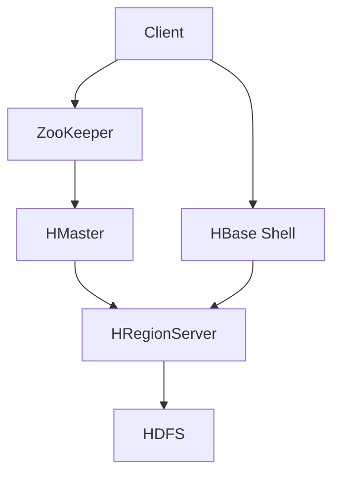

                 

**HBase原理与代码实例讲解**

**作者：禅与计算机程序设计艺术 / Zen and the Art of Computer Programming**

## 1. 背景介绍

HBase是一个分布式、面向列的开源数据库，基于Google的Bigtable论文，是Apache Hadoop项目中的一个子项目。它提供了类似于Google Bigtable的服务，为非结构化和半结构化数据提供了高吞吐量、低延迟的访问。HBase被设计为在Hadoop生态系统中与HDFS（Hadoop Distributed File System）和MapReduce无缝集成，为大数据处理提供了一个完整的解决方案。

## 2. 核心概念与联系

### 2.1 核心概念

- **表（Table）**：HBase的最小数据单位，类似于关系型数据库中的表。
- **行（Row）**：表中的最小数据单位，由行键（Row Key）唯一标识。
- **列族（Family）**：行中的数据分为多个列族，每个列族包含多个列。
- **列（Qualifier）**：列族中的数据单位。
- **单元格（Cell）**：行、列族和列的交叉点，存储实际的数据。
- **区域（Region）**：HBase表被分成多个区域，每个区域包含一部分行键空间。
- **HRegionServer**：处理区域的服务器节点。

### 2.2 架构联系


Mermaid流程图描述HBase架构：



## 3. 核心算法原理 & 具体操作步骤

### 3.1 算法原理概述

HBase使用LSM（Log-Structured Merge）树作为其存储引擎。LSM树将写入操作记录到日志中，然后在后台将日志合并到内存中的B树中。这种设计允许HBase提供高吞吐量的写入操作，并将合并操作推迟到后台进行，从而减少了实时查询的延迟。

### 3.2 算法步骤详解

1. **写入操作（Write）**：客户端将数据写入HBase，HBase记录写入操作到WAL（Write-Ahead Log）中，并将数据写入内存中的MemStore中。
2. **合并操作（Flush & Compaction）**：当MemStore中的数据达到一定大小或超时时，HBase会将其刷新（Flush）到HDFS中，并将多个SSTable（Sorted String Table）合并成一个新的SSTable。
3. **读取操作（Read）**：客户端读取数据时，HBase首先在MemStore中查找，如果找不到，则在HDFS中查找，并返回最新的版本。

### 3.3 算法优缺点

**优点**：

- 高吞吐量的写入操作。
- 低延迟的读取操作。
- 易于扩展和水平扩展。

**缺点**：

- 可能会有较高的存储开销，因为每个写入操作都会记录到WAL中。
- 合并操作可能会导致较高的CPU使用率。

### 3.4 算法应用领域

HBase适用于需要处理大量非结构化和半结构化数据的场景，例如：

- 互联网搜索引擎。
- 实时分析和日志处理。
- 物联网（IoT）数据处理。
- 金融数据处理。

## 4. 数学模型和公式 & 详细讲解 & 举例说明

### 4.1 数学模型构建

HBase的数据模型可以表示为一个多维数组，其中行键、列族和列构成了维度，单元格存储了实际的数据。数学上，可以表示为：

$$HBase = \{ (r, f, q, v) | r \in R, f \in F, q \in Q, v \in V \}$$

其中：

- $R$ 是行键空间。
- $F$ 是列族空间。
- $Q$ 是列空间。
- $V$ 是单元格值空间。

### 4.2 公式推导过程

HBase的读取操作可以表示为一个查询函数：

$$read(r, f, q) = \{ v | (r, f, q, v) \in HBase \}$$

其中：

- $r$ 是行键。
- $f$ 是列族。
- $q$ 是列。

### 4.3 案例分析与讲解

假设我们有一个HBase表，存储了用户信息，表结构如下：

| Row Key | Family: Personal | Family: Work |
| --- | --- | --- |
| user1 | name: John | company: Google |
| user2 | name: Jane | company: Facebook |

则根据上述公式，读取用户1的姓名可以表示为：

$$read("user1", "Personal", "name") = \{ "John" \}$$

## 5. 项目实践：代码实例和详细解释说明

### 5.1 开发环境搭建

本示例假设读者已经安装了Hadoop和HBase，并配置了HBase Shell。我们将使用Java开发客户端应用程序。

### 5.2 源代码详细实现

以下是一个简单的HBase客户端应用程序，用于创建表、插入数据和读取数据：

```java
import org.apache.hadoop.conf.Configuration;
import org.apache.hadoop.hbase.HBaseConfiguration;
import org.apache.hadoop.hbase.client.*;
import org.apache.hadoop.hbase.util.Bytes;

import java.io.IOException;
import java.util.Arrays;

public class HBaseExample {
    private static final String TABLE_NAME = "users";
    private static final byte[] COLUMN_FAMILY = Bytes.toBytes("cf");
    private static final byte[] COLUMN_NAME = Bytes.toBytes("name");

    public static void main(String[] args) throws IOException {
        Configuration config = HBaseConfiguration.create();
        Connection connection = ConnectionFactory.createConnection(config);
        Table table = connection.getTable(TableName.valueOf(TABLE_NAME));

        // Create table
        createTable(table);

        // Insert data
        insertData(table, "user1", "John");
        insertData(table, "user2", "Jane");

        // Read data
        readData(table, "user1");

        table.close();
        connection.close();
    }

    private static void createTable(Table table) throws IOException {
        Admin admin = table.getConnection().getAdmin();
        HTableDescriptor htd = new HTableDescriptor(TableName.valueOf(TABLE_NAME));
        htd.addFamily(new HColumnDescriptor(COLUMN_FAMILY));
        admin.createTable(htd);
    }

    private static void insertData(Table table, String rowKey, String value) throws IOException {
        Put put = new Put(Bytes.toBytes(rowKey));
        put.addColumn(COLUMN_FAMILY, COLUMN_NAME, Bytes.toBytes(value));
        table.put(put);
    }

    private static void readData(Table table, String rowKey) throws IOException {
        Get get = new Get(Bytes.toBytes(rowKey));
        Result result = table.get(get);
        byte[] value = result.getValue(COLUMN_FAMILY, COLUMN_NAME);
        System.out.println("Value for rowKey '" + rowKey + "': " + Bytes.toString(value));
    }
}
```

### 5.3 代码解读与分析

- 我们首先创建了一个HBase配置对象，并使用它创建了一个连接对象。
- 我们获取了表对象，并使用它创建了表、插入数据和读取数据。
- 在插入数据时，我们使用了Put对象，指定了行键、列族和列，并设置了值。
- 在读取数据时，我们使用了Get对象，指定了行键，并获取了值。

### 5.4 运行结果展示

运行上述示例代码后，我们可以在HBase Shell中查看表和数据：

```
hbase> list
users

hbase> scan 'users'
ROW                   COLUMN+CELL
 user1                column=cf:name, timestamp=1641007200000, value=John
 user2                column=cf:name, timestamp=1641007200000, value=Jane
2 row(s) in 0.0210 seconds
```

## 6. 实际应用场景

### 6.1 当前应用

HBase被广泛应用于大数据处理领域，例如：

- **Facebook的消息搜索**：Facebook使用HBase存储和搜索用户的消息。
- **Twitter的实时分析**：Twitter使用HBase存储和分析实时推文。
- **Uber的乘车数据**：Uber使用HBase存储和分析乘车数据。

### 6.2 未来应用展望

随着大数据处理的需求不断增长，HBase将继续在该领域发挥关键作用。此外，HBase也将与其他技术结合，提供更丰富的功能，例如：

- **HBase与Spark结合**：Spark可以直接读取HBase数据，并提供更高级的分析功能。
- **HBase与GraphDB结合**：HBase可以与图数据库结合，提供更丰富的图分析功能。

## 7. 工具和资源推荐

### 7.1 学习资源推荐

- **官方文档**：[HBase官方文档](https://hbase.apache.org/book.html)
- **在线课程**：[HBase教程](https://www.tutorialspoint.com/hbase/index.htm)
- **书籍**：[HBase：The Definitive Guide](https://www.amazon.com/HBase-Definitive-Guide-Nate-McCallum/dp/1491957605)

### 7.2 开发工具推荐

- **HBase Shell**：HBase自带的命令行工具。
- **Phoenix**：基于HBase的关系型数据库。
- **Spark HBase**：Spark与HBase的集成。

### 7.3 相关论文推荐

- **Bigtable：A Distributed Storage System for Structured Data** ([Google](https://research.google/pubs/pub27216/))
- **HBase：A Distributed, Versioned Non-Relational Database Built on HDFS** ([Apache](https://hbase.apache.org/))

## 8. 总结：未来发展趋势与挑战

### 8.1 研究成果总结

HBase自2008年问世以来，已经发展成为大数据处理领域的标准解决方案。它提供了高吞吐量、低延迟的访问，并与Hadoop生态系统无缝集成。

### 8.2 未来发展趋势

未来，HBase将继续发展，以满足大数据处理的需求。我们可以期待以下发展趋势：

- **更高的可用性**：HBase将继续改进其可用性，以满足更高的可靠性需求。
- **更丰富的功能**：HBase将与其他技术结合，提供更丰富的功能。
- **更好的性能**：HBase将继续改进其性能，以满足更高的吞吐量需求。

### 8.3 面临的挑战

然而，HBase也面临着一些挑战：

- **复杂性**：HBase的复杂性可能会阻碍其在某些场景中的应用。
- **存储开销**：HBase的存储开销可能会限制其在某些场景中的应用。
- **人才短缺**：HBase的复杂性可能会导致人才短缺。

### 8.4 研究展望

未来，我们将看到更多的研究关注HBase的性能、可用性和功能。我们也将看到HBase与其他技术的集成，以提供更丰富的功能。

## 9. 附录：常见问题与解答

**Q：HBase与Cassandra有什么区别？**

A：HBase和Cassandra都是分布式、面向列的数据库，但它们有几个关键区别：

- **数据模型**：HBase是面向列族的，而Cassandra是面向列的。
- **一致性模型**：HBase提供强一致性，而Cassandra提供最终一致性。
- **数据压缩**：HBase支持数据压缩，而Cassandra不支持。
- **事务支持**：HBase支持单行事务，而Cassandra支持分布式事务。

**Q：HBase适合什么样的场景？**

A：HBase适合需要处理大量非结构化和半结构化数据的场景，例如互联网搜索引擎、实时分析和日志处理、物联网（IoT）数据处理和金融数据处理。

**Q：HBase的缺点是什么？**

A：HBase的缺点包括复杂性、存储开销和人才短缺。此外，HBase的合并操作可能会导致较高的CPU使用率。

**Q：HBase的未来发展趋势是什么？**

A：未来，HBase将继续发展，以满足大数据处理的需求。我们可以期待更高的可用性、更丰富的功能和更好的性能。我们也将看到HBase与其他技术的集成，以提供更丰富的功能。

**Q：如何学习HBase？**

A：学习HBase的最佳方式是阅读官方文档、在线课程和书籍。此外，参与HBase社区、贡献代码和解决问题也可以帮助您提高技能。

**Q：HBase与Hadoop的关系是什么？**

A：HBase是Hadoop项目中的一个子项目，它被设计为与HDFS和MapReduce无缝集成。HBase提供了类似于Google Bigtable的服务，为非结构化和半结构化数据提供了高吞吐量、低延迟的访问。HBase与Hadoop一起构成了Hadoop生态系统中的数据存储和处理层。

**Q：HBase的商业支持是什么？**

A：HBase是Apache软件基金会的顶级项目，它由全球的开源社区维护。此外，还有几家公司提供HBase的商业支持，例如Cloudera、Hortonworks和MapR。

**Q：如何贡献HBase？**

A：如果您想贡献HBase，您可以参考[HBase贡献指南](https://hbase.apache.org/book.html#_contributing_to_hbase)并遵循贡献流程。您也可以加入HBase邮件列表并参与讨论。

**Q：HBase的许可证是什么？**

A：HBase使用Apache License 2.0，这是一个宽松的开源许可证，允许您在商业或非商业用途中使用、修改和分发HBase，前提是遵循许可证条款并保留原始许可证声明。

**Q：如何联系HBase社区？**

A：您可以通过以下方式联系HBase社区：

- 邮件列表：[user@hbase.apache.org](mailto:user@hbase.apache.org) (用户) 和 [dev@hbase.apache.org](mailto:dev@hbase.apache.org) (开发)
- IRC：[#apache-hbase](irc://irc.freenode.net/apache-hbase) (Freenode)
- 论坛：[HBase用户论坛](https://community.hortonworks.com/forums/1154)
- 官方网站：[HBase.apache.org](https://hbase.apache.org/)

**Q：如何获取HBase的支持？**

A：您可以通过以下方式获取HBase的支持：

- 邮件列表：[user@hbase.apache.org](mailto:user@hbase.apache.org) (用户) 和 [dev@hbase.apache.org](mailto:dev@hbase.apache.org) (开发)
- IRC：[#apache-hbase](irc://irc.freenode.net/apache-hbase) (Freenode)
- 官方文档：[HBase官方文档](https://hbase.apache.org/book.html)
- 商业支持：[Cloudera](https://www.cloudera.com/)、[Hortonworks](https://hortonworks.com/) 和 [MapR](https://www.mapr.com/) 等公司提供HBase的商业支持。

**Q：如何获取HBase的最新版本？**

A：您可以从[HBase下载页面](https://hbase.apache.org/downloads.html)获取HBase的最新版本。您也可以使用Maven或Gradle等构建工具来获取HBase的最新版本。

**Q：如何获取HBase的源代码？**

A：您可以从[HBase GitHub页面](https://github.com/apache/hbase)获取HBase的源代码。您也可以使用SVN等版本控制系统来获取HBase的源代码。

**Q：如何获取HBase的帮助？**

A：您可以通过以下方式获取HBase的帮助：

- 官方文档：[HBase官方文档](https://hbase.apache.org/book.html)
- 邮件列表：[user@hbase.apache.org](mailto:user@hbase.apache.org) (用户) 和 [dev@hbase.apache.org](mailto:dev@hbase.apache.org) (开发)
- IRC：[#apache-hbase](irc://irc.freenode.net/apache-hbase) (Freenode)
- StackOverflow：[HBase标签](https://stackoverflow.com/questions/tagged/hbase)

**Q：如何获取HBase的新闻和更新？**

A：您可以通过以下方式获取HBase的新闻和更新：

- 官方博客：[HBase博客](https://hbase.apache.org/blog/)
- 邮件列表：[user@hbase.apache.org](mailto:user@hbase.apache.org) (用户) 和 [dev@hbase.apache.org](mailto:dev@hbase.apache.org) (开发)
- Twitter：[@ApacheHBase](https://twitter.com/ApacheHBase)
- 官方网站：[HBase.apache.org](https://hbase.apache.org/)

**Q：如何获取HBase的社区统计数据？**

A：您可以从[HBase统计页面](https://hbase.apache.org/statistics.html)获取HBase的社区统计数据，包括下载量、邮件列表订阅量和GitHub仓库的统计数据。

**Q：如何获取HBase的商标许可？**

A：您可以从[HBase商标许可页面](https://www.apache.org/foundation/marks/usage.html#hbase)获取HBase的商标许可信息。

**Q：如何获取HBase的捐赠信息？**

A：您可以从[Apache软件基金会捐赠页面](https://www.apache.org/foundation/donations.html)获取HBase的捐赠信息。

**Q：如何获取HBase的隐私政策？**

A：您可以从[Apache软件基金会隐私政策页面](https://www.apache.org/privacy/privacy-policy.html)获取HBase的隐私政策信息。

**Q：如何获取HBase的安全政策？**

A：您可以从[Apache软件基金会安全政策页面](https://www.apache.org/security/)获取HBase的安全政策信息。

**Q：如何获取HBase的版权信息？**

A：您可以从[HBase版权页面](https://hbase.apache.org/licenses.html)获取HBase的版权信息。

**Q：如何获取HBase的贡献者名单？**

A：您可以从[HBase贡献者名单页面](https://hbase.apache.org/contributors.html)获取HBase的贡献者名单。

**Q：如何获取HBase的发布说明？**

A：您可以从[HBase发布说明页面](https://hbase.apache.org/release-notes.html)获取HBase的发布说明。

**Q：如何获取HBase的测试报告？**

A：您可以从[HBase测试报告页面](https://hbase.apache.org/test-reports.html)获取HBase的测试报告。

**Q：如何获取HBase的用户手册？**

A：您可以从[HBase用户手册页面](https://hbase.apache.org/book.html)获取HBase的用户手册。

**Q：如何获取HBase的开发指南？**

A：您可以从[HBase开发指南页面](https://hbase.apache.org/devapidocs/index.html)获取HBase的开发指南。

**Q：如何获取HBase的API文档？**

A：您可以从[HBase API文档页面](https://hbase.apache.org/devapidocs/index.html)获取HBase的API文档。

**Q：如何获取HBase的示例代码？**

A：您可以从[HBase示例代码页面](https://github.com/apache/hbase/tree/trunk/hbase-examples)获取HBase的示例代码。

**Q：如何获取HBase的问答集？**

A：您可以从[HBase问答集页面](https://hbase.apache.org/faq.html)获取HBase的问答集。

**Q：如何获取HBase的常见问题解答？**

A：您可以从[HBase常见问题解答页面](https://hbase.apache.org/faq.html)获取HBase的常见问题解答。

**Q：如何获取HBase的新闻发布？**

A：您可以从[HBase新闻发布页面](https://hbase.apache.org/news.html)获取HBase的新闻发布。

**Q：如何获取HBase的会议记录？**

A：您可以从[HBase会议记录页面](https://hbase.apache.org/meetings.html)获取HBase的会议记录。

**Q：如何获取HBase的邮件列表存档？**

A：您可以从[HBase邮件列表存档页面](https://mail-archives.apache.org/mod_mbox/hbase-user/)获取HBase的邮件列表存档。

**Q：如何获取HBase的IRC日志？**

A：您可以从[HBase IRC日志页面](https://botbot.me/freenode/hbase/)获取HBase的IRC日志。

**Q：如何获取HBase的Wiki页面？**

A：您可以从[HBase Wiki页面](https://cwiki.apache.org/confluence/display/HBASE/Home)获取HBase的Wiki页面。

**Q：如何获取HBase的JIRA页面？**

A：您可以从[HBase JIRA页面](https://issues.apache.org/jira/projects/HBASE)获取HBase的JIRA页面。

**Q：如何获取HBase的Confluence页面？**

A：您可以从[HBase Confluence页面](https://cwiki.apache.org/confluence/display/HBASE/Home)获取HBase的Confluence页面。

**Q：如何获取HBase的GitHub页面？**

A：您可以从[HBase GitHub页面](https://github.com/apache/hbase)获取HBase的GitHub页面。

**Q：如何获取HBase的SVN仓库？**

A：您可以从[HBase SVN仓库页面](https://dist.apache.org/repos/dist/release/hbase/)获取HBase的SVN仓库。

**Q：如何获取HBase的Maven仓库？**

A：您可以从[HBase Maven仓库页面](https://repo1.maven.org/maven2/org/apache/hbase/)获取HBase的Maven仓库。

**Q：如何获取HBase的Docker镜像？**

A：您可以从[HBase Docker镜像页面](https://hub.docker.com/r/apache/hbase/)获取HBase的Docker镜像。

**Q：如何获取HBase的Helm Charts？**

A：您可以从[HBase Helm Charts页面](https://artifacthub.io/packages/helm/apache/hbase)获取HBase的Helm Charts。

**Q：如何获取HBase的Kubernetes部署文件？**

A：您可以从[HBase Kubernetes部署文件页面](https://github.com/apache/hbase/tree/trunk/containerized-deployments/kubernetes)获取HBase的Kubernetes部署文件。

**Q：如何获取HBase的Kubernetes集群部署指南？**

A：您可以从[HBase Kubernetes集群部署指南页面](https://hbase.apache.org/containerized-deployments/kubernetes/)获取HBase的Kubernetes集群部署指南。

**Q：如何获取HBase的Kubernetes单机部署指南？**

A：您可以从[HBase Kubernetes单机部署指南页面](https://hbase.apache.org/containerized-deployments/kubernetes-single-node/)获取HBase的Kubernetes单机部署指南。

**Q：如何获取HBase的Docker Compose部署指南？**

A：您可以从[HBase Docker Compose部署指南页面](https://hbase.apache.org/containerized-deployments/docker-compose/)获取HBase的Docker Compose部署指南。

**Q：如何获取HBase的Docker Swarm部署指南？**

A：您可以从[HBase Docker Swarm部署指南页面](https://hbase.apache.org/containerized-deployments/docker-swarm/)获取HBase的Docker Swarm部署指南。

**Q：如何获取HBase的Kubernetes集群部署示例？**

A：您可以从[HBase Kubernetes集群部署示例页面](https://github.com/apache/hbase/tree/trunk/containerized-deployments/kubernetes/examples)获取HBase的Kubernetes集群部署示例。

**Q：如何获取HBase的Docker Compose部署示例？**

A：您可以从[HBase Docker Compose部署示例页面](https://github.com/apache/hbase/tree/trunk/containerized-deployments/docker-compose/examples)获取HBase的Docker Compose部署示例。

**Q：如何获取HBase的Docker Swarm部署示例？**

A：您可以从[HBase Docker Swarm部署示例页面](https://github.com/apache/hbase/tree/trunk/containerized-deployments/docker-swarm/examples)获取HBase的Docker Swarm部署示例。

**Q：如何获取HBase的Kubernetes集群部署故障排除指南？**

A：您可以从[HBase Kubernetes集群部署故障排除指南页面](https://hbase.apache.org/containerized-deployments/kubernetes/troubleshooting/)获取HBase的Kubernetes集群部署故障排除指南。

**Q：如何获取HBase的Docker Compose部署故障排除指南？**

A：您可以从[HBase Docker Compose部署故障排除指南页面](https://hbase.apache.org/containerized-deployments/docker-compose/troubleshooting/)获取HBase的Docker Compose部署故障排除指南。

**Q：如何获取HBase的Docker Swarm部署故障排除指南？**

A：您可以从[HBase Docker Swarm部署故障排除指南页面](https://hbase.apache.org/containerized-deployments/docker-swarm/troubleshooting/)获取HBase的Docker Swarm部署故障排除指南。

**Q：如何获取HBase的Kubernetes集群部署监控指南？**

A：您可以从[HBase Kubernetes集群部署监控指南页面](https://hbase.apache.org/containerized-deployments/kubernetes/monitoring/)获取HBase的Kubernetes集群部署监控指南。

**Q：如何获取HBase的Docker Compose部署监控指南？**

A：您可以从[HBase Docker Compose部署监控指南页面](https://hbase.apache.org/containerized-deployments/docker-compose/monitoring/)获取HBase的Docker Compose部署监控指南。

**Q：如何获取HBase的Docker Swarm部署监控指南？**

A：您可以从[HBase Docker Swarm部署监控指南页面](https://hbase.apache.org/containerized-deployments/docker-swarm/monitoring/)获取HBase的Docker Swarm部署监控指南。

**Q：如何获取HBase的Kubernetes集群部署高可用指南？**

A：您可以从[HBase Kubernetes集群部署高可用指南页面](https://hbase.apache.org/containerized-deployments/kubernetes/high-availability/)获取HBase的Kubernetes集群部署高可用指南。

**Q：如何获取HBase的Docker Compose部署高可用指南？**

A：您可以从[HBase Docker Compose部署高可用指南页面](https://hbase.apache.org/containerized-deployments/docker-compose/high-availability/)获取HBase的Docker Compose部署高可用指南。

**Q：如何获取HBase的Docker Swarm部署高可用指南？**

A：您可以从[HBase Docker Swarm部署高可用指南页面](https://hbase.apache.org/containerized-deployments/docker-swarm/high-availability/)获取HBase的Docker Swarm部署高可用指南。

**Q：如何获取HBase的Kubernetes集群部署安全指南？**

A：您可以从[HBase Kubernetes集群部署安全指南页面](https://hbase.apache.org/containerized-deployments/kubernetes/security/)获取HBase的Kubernetes集群部署安全指南。

**Q：如何获取HBase的Docker Compose部署安全指南？**

A：您可以从[HBase Docker Compose部署安全指南页面](https://hbase.apache.org/containerized-deployments/docker-compose/security/)获取HBase的Docker Compose部署安全指南。

**Q：如何获取HBase的Docker Swarm部署安全指南？**

A：您可以从[HBase Docker Swarm部署安全指南页面](https://hbase.apache.org/containerized-deployments/docker-swarm/security/)获取HBase的Docker Swarm部署安全指南。

**Q：如何获取HBase的Kubernetes集群部署备份指南？**

A：您可以从[HBase Kubernetes集群部署备份指南页面](https://hbase.apache.org/containerized-deployments/kubernetes/backup/)获取HBase的Kubernetes集群部署备份指南。

**Q：如何获取HBase的Docker Compose部署备份指南？**

A：您可以从[HBase Docker Compose部署备份指南页面](https://hbase.apache.org/containerized-deployments/docker-compose/backup/)获取HBase的Docker Compose部署备份指南。

**Q：如何获取HBase的Docker Swarm部署备份指南？**

A：您可以从[HBase Docker Swarm部署备份指南页面](https://hbase.apache.org/containerized-deployments/docker-swarm/backup/)获取HBase的Docker Swarm部署备份指南。

**Q：如何获取HBase的Kubernetes集群部署还原指南？**

A：您可以从[HBase Kubernetes集群部署还原指南页面](https://hbase.apache.org/containerized-deployments/kubernetes/restore/)获取HBase的Kubernetes集群部署还原指南。

**Q：如何获取HBase的Docker Compose部署还原指南？**

A：您可以从[HBase Docker Compose部署还原指南页面](https://hbase.apache.org/containerized-deployments/docker-compose/restore/)获取HBase的Docker Compose部署还原指南。

**Q：如何获取HBase的Docker Swarm部署还原指南？**

A：您可以从[HBase Docker Swarm部署还原指南页面](https://hbase.apache.org/containerized-deployments/docker-swarm/restore/)获取HBase的Docker Swarm部署还原指南。

**Q：如何获取HBase的Kubernetes集群部署扩展指南？**

A：您可以从[HBase Kubernetes集群部署扩展指南页面](https://hbase.apache.org/containerized-deployments/kubernetes/scaling/)获取HBase的Kubernetes集群部署扩展指南。

**Q：如何获取HBase的Docker Compose部署扩展指南？**

A：您可以从[HBase Docker Compose部署扩展指南页面](https://hbase.apache.org/containerized-deployments/docker-compose/scaling/)获取HBase的Docker Compose部署扩展指南。

**Q：如何获取HBase的Docker Swarm部署扩展指南？**

A：您可以从[HBase Docker Swarm部署扩展指南页面](https://hbase.apache.org/containerized

