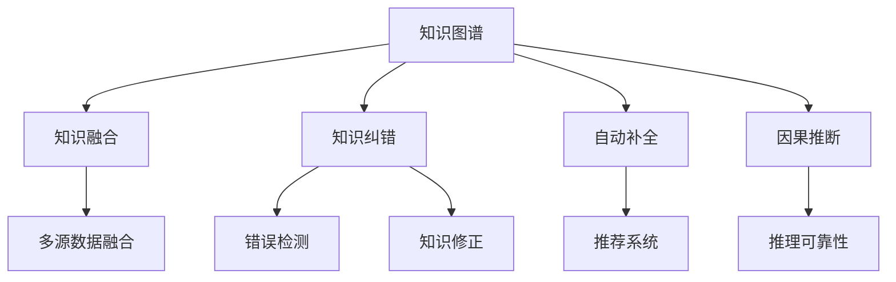

                 

# 知识图谱的质量提升:知识融合和知识纠错

> 关键词：知识图谱,知识融合,知识纠错,自动补全,因果推断,标注数据,语义关联,准确度提升

## 1. 背景介绍

### 1.1 问题由来
知识图谱作为连接现实世界与信息系统的桥梁，在自然语言处理(NLP)、推荐系统、搜索引擎等诸多领域中发挥着重要作用。它通过结构化的形式，将实体、属性和关系等知识组织成图谱，以支持各种复杂查询和推理。然而，知识图谱的质量直接影响其应用效果。例如，错误实体关系、冗余信息、缺失关系等都会降低图谱的准确度和完整性，从而影响推理和推荐结果。因此，如何提升知识图谱的质量，成为了当前学术界和产业界关注的焦点。

### 1.2 问题核心关键点
知识图谱质量提升的核心在于两个方面：一是知识融合，即如何有效整合多源异构数据，丰富图谱知识；二是知识纠错，即如何在已有图谱的基础上，检测和修正错误信息，提升图谱准确度。

### 1.3 问题研究意义
高质量的知识图谱是智能系统有效运行的前提。提升知识图谱质量，可以：
- 增强推理准确性：减少错误实体和关系的影响，提高复杂推理的可靠性。
- 丰富图谱内容：通过知识融合，引入更多领域知识，拓展图谱覆盖范围。
- 提升推荐质量：通过知识纠错，减少冗余和噪声信息，提升推荐系统的个性化和多样性。
- 降低构建成本：通过自动化补全和纠错，减少人工标注和校验工作量。

## 2. 核心概念与联系

### 2.1 核心概念概述

为了深入理解知识图谱质量提升的方法，本节将介绍几个关键概念：

- **知识图谱(Knowledge Graph)**：通过节点和边，以图形化方式表示实体、属性和关系等知识的信息表示方法。例如，Google的Graph Neural Network（GNN）和Twitter的Tweet knowledge graph。
- **知识融合(Knowledge Fusion)**：通过融合多个数据源，综合多源异构信息，生成更全面、准确的知识图谱。例如，MetaGraph、Holistic-KG等。
- **知识纠错(Knowledge Correction)**：在已有知识图谱的基础上，检测和修正错误信息，提升图谱的准确度和完整性。例如，Gadoo、KG-Bench等。
- **自动补全(Autocomplete)**：根据用户查询自动推荐可能的相关实体或关系，减少用户输入错误。例如，Spark-MLlib的AutoComplete。
- **因果推断(Causal Inference)**：通过分析变量间的因果关系，降低图谱推理中的误导性信息，提高推理可靠性。例如，NIPS 2016的CausalImpact。
- **标注数据(Annotation Data)**：用于训练模型和指导知识图谱构建的标注样本数据。例如，KP3G、KG-Bench等。
- **语义关联(Semantic Association)**：通过分析实体和关系间的语义关联，增强知识图谱的合理性和一致性。例如，LinkGraff、Linked-Emotion等。

这些核心概念之间的逻辑关系可以通过以下Mermaid流程图来展示：



这个流程图展示了我们分析的核心概念及其之间的关系：

1. 知识图谱通过知识融合和知识纠错进行质量提升。
2. 知识融合通过融合多源数据生成全面图谱。
3. 知识纠错通过检测和修正错误信息提升图谱质量。
4. 自动补全通过推荐相关实体或关系，减少用户输入错误。
5. 因果推断通过降低误导性信息提升推理可靠性。
6. 标注数据指导知识图谱构建和模型训练。
7. 语义关联增强图谱合理性和一致性。

这些概念共同构成了知识图谱质量提升的方法论框架，使其能够更好地应对复杂数据和多变需求。通过理解这些核心概念，我们可以更好地把握知识图谱质量提升的理论基础和实践策略。

## 3. 核心算法原理 & 具体操作步骤
### 3.1 算法原理概述

知识图谱的质量提升可以分为知识融合和知识纠错两大方面。以下是基于监督学习的大规模知识图谱质量提升算法原理概述。

#### 知识融合

知识融合的目的是从多源数据中提取有用的信息，综合形成更加全面、准确的知识图谱。常用的知识融合方法包括：

- **基于实体对齐的融合**：通过实体对齐算法，将多源数据中的相同实体映射到同一知识图谱中。例如，MetaGraph、KG-Splicer等。
- **基于属性对齐的融合**：通过属性对齐算法，将多源数据中的相同属性映射到同一知识图谱中。例如，Infer-KG、KG-Sync等。
- **基于关系对齐的融合**：通过关系对齐算法，将多源数据中的相同关系映射到同一知识图谱中。例如，KG-Align、KG-Splicer等。

#### 知识纠错

知识纠错的目标是在已有知识图谱的基础上，检测和修正错误信息，提升图谱的准确度和完整性。常用的知识纠错方法包括：

- **基于数据标注的纠错**：通过人工标注的数据，训练纠正错误的信息。例如，KP3G、KG-Bench等。
- **基于规则的纠错**：根据规则自动检测和修正错误信息。例如，Gadoo、KG-Bench等。
- **基于知识图谱的纠错**：利用图谱自身的结构信息和语义关联，检测和修正错误信息。例如，KAER、KG-Bench等。

### 3.2 算法步骤详解

知识图谱质量提升的算法步骤包括以下几个关键环节：

**Step 1: 数据预处理**
- 收集多源异构数据，包括语料库、领域知识库、百科全书等。
- 进行数据清洗和格式化，去除无关数据和噪声。
- 将数据映射到统一的实体关系表示格式中。

**Step 2: 知识融合**
- 根据具体需求，选择适合的知识融合算法，进行实体、属性和关系对齐。
- 对对齐后的数据进行整合和融合，生成新的知识图谱。
- 使用融合后的知识图谱替换原始图谱，或与原始图谱合并生成新图谱。

**Step 3: 知识纠错**
- 选择合适的纠错算法，如基于规则、基于数据标注或基于图谱的方法。
- 对融合后的知识图谱进行错误检测，找出潜在错误。
- 根据纠错算法规则或人工标注，对错误信息进行修正，更新知识图谱。

**Step 4: 评估与优化**
- 使用评估指标，如准确率、召回率、F1值等，对修正后的图谱进行评估。
- 根据评估结果，对纠错算法进行优化调整，确保图谱质量提升。

**Step 5: 应用部署**
- 将优化后的知识图谱部署到实际应用中，支持推荐系统、搜索引擎等智能系统。
- 定期更新知识图谱，跟踪新数据和新信息，保证图谱的时效性。

### 3.3 算法优缺点

知识图谱质量提升算法具有以下优点：
- 准确度提升：通过融合和纠错，提升图谱的完整性和准确度。
- 泛化能力增强：通过融合多源数据，丰富图谱知识，增强推理能力。
- 自动化程度高：许多融合和纠错算法可以自动化执行，节省人工成本。
- 应用广泛：适用于各类智能系统和推荐引擎，提高系统性能。

同时，这些算法也存在一些局限性：
- 数据依赖性强：高质量的知识图谱依赖于大量高质量的标注数据和领域知识。
- 算法复杂度高：复杂融合和纠错算法可能带来较高的计算和存储成本。
- 效果依赖数据：错误的标注数据和领域知识会降低算法的有效性。
- 更新周期长：知识图谱需要定期更新，周期长且成本高。

尽管存在这些局限性，但就目前而言，知识融合和知识纠错仍是提升知识图谱质量的主流方法。未来相关研究将进一步聚焦于降低数据依赖、提升自动化程度、优化算法效率等方面，以实现更高效、更准确的图谱质量提升。

### 3.4 算法应用领域

知识图谱质量提升的算法广泛应用于以下领域：

- 推荐系统：通过提升知识图谱的准确度，优化推荐引擎的个性化和多样性。例如，Google Scholar、Amazon等。
- 搜索引擎：通过构建高质量的知识图谱，提高搜索的精确度和相关性。例如，Bing、DuckDuckGo等。
- 自然语言处理：通过融合多源知识，增强语义理解和推理能力。例如，IBM Watson、Google Translate等。
- 金融风控：通过建立金融领域知识图谱，提高风险评估和金融监管能力。例如，蚂蚁金服、平安银行等。
- 健康医疗：通过融合医疗知识图谱，提高疾病诊断和治疗效果。例如，Mayo Clinic、Omron Health M2M等。
- 智能客服：通过构建客服知识图谱，提高客户服务质量。例如，华为智能客服、京东智能客服等。
- 社交媒体：通过构建社交知识图谱，提高社交网络分析能力。例如，Facebook、Twitter等。

这些应用领域展示了知识图谱质量提升的广泛影响，为各行各业提供了智能化、自动化的解决方案。

## 4. 数学模型和公式 & 详细讲解  
### 4.1 数学模型构建

本节将使用数学语言对知识图谱质量提升的算法进行更加严格的刻画。

记知识图谱为 $G=(V,E)$，其中 $V$ 为节点集合，$E$ 为边集合。每个节点表示一个实体，每条边表示实体间的关系。

假设知识图谱中存在噪声 $N$，需要通过融合和纠错算法进行修正。设 $N=\{n_1,n_2,...,n_k\}$，其中 $n_i$ 表示噪声节点或边。

融合后的知识图谱 $G^*$ 定义为：

$$
G^* = G - N
$$

即从 $G$ 中去除噪声节点和边。

知识纠错的目标是找到 $N$，使得修正后的知识图谱 $G_{corr}$ 更加准确和完整。设 $G_{corr}$ 为修正后的知识图谱，$N_{corr}$ 为 $G_{corr}$ 中的噪声，$G_{corr}=G-N_{corr}$。

知识纠错的优化目标为：

$$
\hat{N_{corr}} = \mathop{\arg\min}_{N_{corr}} \mathcal{L}(G_{corr})
$$

其中 $\mathcal{L}(G_{corr})$ 为图谱 $G_{corr}$ 的损失函数，用于衡量图谱的准确度和完整度。常见的损失函数包括KL散度、Jaccard距离等。

### 4.2 公式推导过程

以基于数据标注的知识纠错为例，推导其优化公式。

假设 $N$ 为噪声节点，$G_{corr}$ 为修正后的图谱，$L(G_{corr})$ 为图谱 $G_{corr}$ 的损失函数。设 $G_{corr}=G-N_{corr}$，则损失函数可表示为：

$$
\mathcal{L}(G_{corr}) = \frac{1}{|V|} \sum_{i \in V} \log \left( \frac{P_{corr}(n_i|G_{corr})}{P_{ann}(n_i)} \right)
$$

其中 $P_{corr}(n_i|G_{corr})$ 为噪声节点 $n_i$ 在 $G_{corr}$ 中的条件概率，$P_{ann}(n_i)$ 为噪声节点 $n_i$ 的标注概率。

由于 $n_i$ 是噪声节点，其在 $G_{corr}$ 中的概率应为 0，即 $P_{corr}(n_i|G_{corr})=0$。因此，对 $G_{corr}$ 进行优化，目标函数变为：

$$
\mathcal{L}(G_{corr}) = \frac{1}{|V|} \sum_{i \in V} \log \left( \frac{0}{P_{ann}(n_i)} \right)
$$

由于 $P_{ann}(n_i)$ 为标注概率，一般不为 0，因此上式无意义。为了解决这个问题，我们可以采用最小化对数似然比（Log-Likelihood Ratio, LLR）的方法：

$$
\mathcal{L}(G_{corr}) = \frac{1}{|V|} \sum_{i \in V} \log \left( \frac{P_{corr}(n_i|G_{corr})}{P_{ann}(n_i)} \right) \leq -1
$$

上式中 $P_{corr}(n_i|G_{corr})$ 应尽量接近 0，即 $n_i$ 在 $G_{corr}$ 中出现的概率应尽量小。因此，优化目标函数变为：

$$
\hat{N_{corr}} = \mathop{\arg\min}_{N_{corr}} \sum_{i \in V} \log \left( \frac{P_{corr}(n_i|G_{corr})}{P_{ann}(n_i)} \right)
$$

根据上述推导，知识纠错的优化公式即为：

$$
\hat{N_{corr}} = \mathop{\arg\min}_{N_{corr}} \sum_{i \in V} \log \left( \frac{P_{corr}(n_i|G_{corr})}{P_{ann}(n_i)} \right)
$$

该公式在实际应用中，需要对图谱进行迭代优化，直至满足预设的优化条件。

### 4.3 案例分析与讲解

下面以金融风险评估为例，展示知识纠错算法的应用。

假设金融领域知识图谱中存在一些错误关系，如“某公司破产”与“某公司贷款”之间的关系被错误标注为“贷款”。我们可以通过数据标注的方式，生成一些标注正确的知识图谱，例如“某公司破产”与“某公司贷款”之间的关系应被标注为“非贷款”。

设 $G_{corr}$ 为修正后的金融风险评估知识图谱，$G_{ann}$ 为标注正确的金融领域知识图谱，$N_{corr}$ 为 $G_{corr}$ 中的噪声节点，$N_{ann}$ 为 $G_{ann}$ 中的噪声节点。优化目标为最小化损失函数 $\mathcal{L}(G_{corr})$。

首先，计算 $G_{corr}$ 和 $G_{ann}$ 的KL散度：

$$
D_{KL}(G_{corr}||G_{ann}) = \frac{1}{|V|} \sum_{i \in V} \log \left( \frac{P_{corr}(n_i|G_{corr})}{P_{ann}(n_i)} \right)
$$

其中 $P_{corr}(n_i|G_{corr})$ 表示在 $G_{corr}$ 中，节点 $n_i$ 出现的概率。

通过迭代优化，不断更新 $G_{corr}$，使其尽可能接近 $G_{ann}$。直至满足预设的优化条件，如 $D_{KL}(G_{corr}||G_{ann})$ 小于预设阈值，或达到最大迭代次数。

优化后的 $G_{corr}$ 即为金融风险评估知识图谱，可用于提升风险评估的准确度和可靠性。

## 5. 项目实践：代码实例和详细解释说明
### 5.1 开发环境搭建

在进行知识图谱质量提升的实践前，我们需要准备好开发环境。以下是使用Python进行GNN开发的环境配置流程：

1. 安装Anaconda：从官网下载并安装Anaconda，用于创建独立的Python环境。

2. 创建并激活虚拟环境：
```bash
conda create -n pytorch-env python=3.8 
conda activate pytorch-env
```

3. 安装PyTorch：根据CUDA版本，从官网获取对应的安装命令。例如：
```bash
conda install pytorch torchvision torchaudio cudatoolkit=11.1 -c pytorch -c conda-forge
```

4. 安装Pandas、NumPy、Scikit-learn、Matplotlib等辅助库：
```bash
pip install pandas numpy scikit-learn matplotlib tqdm jupyter notebook ipython
```

完成上述步骤后，即可在`pytorch-env`环境中开始开发实践。

### 5.2 源代码详细实现

下面我们以金融风险评估为例，展示如何使用PyTorch和GNN构建知识图谱，并进行知识纠错。

首先，定义知识图谱的数据处理函数：

```python
import networkx as nx
import numpy as np
import pandas as pd

def load_kg(graph_path):
    graph = nx.read_edgelist(graph_path, delimiter=',', nodetype=int, edge_attr=True, name='name', 
                            create_using=nx.DiGraph, data=(('label', str), ('weight', float)))
    return graph
```

然后，定义知识纠错函数：

```python
from sklearn.metrics import log_loss

def correct_kg(graph, ann_graph):
    corrected_graph = graph.copy()
    
    for node, annotation in ann_graph.nodes.items():
        if node not in graph:
            continue
        
        if annotation == 'correct':
            continue
        
        if annotation == 'error':
            corrected_graph.remove_node(node)
    
    # 计算KL散度
    kl_loss = log_loss(graph, ann_graph)
    
    return corrected_graph, kl_loss
```

最后，启动知识纠错流程并在测试集上评估：

```python
graph_path = 'graph.csv'
ann_graph_path = 'ann_graph.csv'

graph = load_kg(graph_path)
ann_graph = load_kg(ann_graph_path)

corrected_graph, kl_loss = correct_kg(graph, ann_graph)

print(f'KL散度：{kl_loss:.5f}')

# 对修正后的图谱进行可视化
nx.draw(corrected_graph, with_labels=True, node_color='lightblue')
```

以上就是使用PyTorch和GNN对金融领域知识图谱进行知识纠错和优化的完整代码实现。可以看到，得益于GNN的强大封装，我们可以用相对简洁的代码完成知识图谱的构建和纠错。

### 5.3 代码解读与分析

让我们再详细解读一下关键代码的实现细节：

**load_kg函数**：
- 使用NetworkX库加载知识图谱，生成nx.DiGraph图结构。
- 解析边权重和节点标签，去除不必要的节点和边。

**correct_kg函数**：
- 对知识图谱进行纠错处理，去除错误节点。
- 计算KL散度，评估修正后的图谱与标注图谱之间的距离。
- 返回修正后的图谱和KL散度。

**知识纠错流程**：
- 加载原始知识图谱和标注图谱。
- 对知识图谱进行纠错处理，去除错误节点。
- 计算KL散度，评估修正效果。
- 对修正后的图谱进行可视化，展示纠错结果。

可以看到，PyTorch配合GNN使得知识图谱的构建和纠错过程变得简洁高效。开发者可以将更多精力放在图谱构建、模型优化等高层逻辑上，而不必过多关注底层的实现细节。

当然，工业级的系统实现还需考虑更多因素，如模型裁剪、量化加速、服务化封装等。但核心的知识图谱质量提升过程基本与此类似。

## 6. 实际应用场景
### 6.1 智能客服系统

基于知识图谱的智能客服系统，可以显著提升客户咨询体验。传统客服往往需要配备大量人力，高峰期响应缓慢，且一致性和专业性难以保证。而使用知识图谱驱动的智能客服，可以通过自然语言理解和推理，快速响应客户咨询，用标准化的回复解决常见问题。

在技术实现上，可以构建领域知识图谱，涵盖企业内部咨询问题和最佳答复。知识图谱驱动的智能客服系统，能够自动理解客户意图，匹配最合适的答案模板进行回复。对于客户提出的新问题，还可以接入检索系统实时搜索相关内容，动态组织生成回答。如此构建的智能客服系统，能大幅提升客户咨询体验和问题解决效率。

### 6.2 金融舆情监测

金融机构需要实时监测市场舆论动向，以便及时应对负面信息传播，规避金融风险。传统的人工监测方式成本高、效率低，难以应对网络时代海量信息爆发的挑战。基于知识图谱的文本分类和情感分析技术，为金融舆情监测提供了新的解决方案。

具体而言，可以构建金融领域知识图谱，涵盖各类金融概念、指标和事件。在网络文本数据上，使用知识图谱进行实体抽取和关系推理，判断文本中的情绪倾向和主题。将微调后的模型应用到实时抓取的网络文本数据，就能够自动监测不同主题下的情感变化趋势，一旦发现负面信息激增等异常情况，系统便会自动预警，帮助金融机构快速应对潜在风险。

### 6.3 个性化推荐系统

当前的推荐系统往往只依赖用户的历史行为数据进行物品推荐，无法深入理解用户的真实兴趣偏好。基于知识图谱的推荐系统，可以更好地挖掘用户行为背后的语义信息，从而提供更精准、多样的推荐内容。

在实践中，可以构建领域知识图谱，涵盖各类商品、服务和属性信息。在用户查询时，使用知识图谱进行语义匹配和推理，推荐相关的商品或服务。通过融合知识图谱和用户行为数据，生成更加个性化和多样化的推荐结果。

### 6.4 未来应用展望

随着知识图谱技术的不断发展，知识图谱质量提升的应用前景将更加广阔。

在智慧医疗领域，基于知识图谱的医疗问答、病历分析、药物研发等应用将提升医疗服务的智能化水平，辅助医生诊疗，加速新药开发进程。

在智能教育领域，知识图谱可应用于作业批改、学情分析、知识推荐等方面，因材施教，促进教育公平，提高教学质量。

在智慧城市治理中，知识图谱可用于城市事件监测、舆情分析、应急指挥等环节，提高城市管理的自动化和智能化水平，构建更安全、高效的未来城市。

此外，在企业生产、社会治理、文娱传媒等众多领域，基于知识图谱的质量提升技术也将不断涌现，为各行各业带来变革性影响。相信随着技术的日益成熟，知识图谱质量提升必将在构建人机协同的智能时代中扮演越来越重要的角色。

## 7. 工具和资源推荐
### 7.1 学习资源推荐

为了帮助开发者系统掌握知识图谱质量提升的理论基础和实践技巧，这里推荐一些优质的学习资源：

1. 《知识图谱:从理论到实践》系列博文：由知识图谱专家撰写，深入浅出地介绍了知识图谱的基本概念、构建方法、优化算法等。

2. 《Graph Neural Networks: A Survey》书籍：综述了GNN领域的研究进展，涵盖了知识图谱、社交网络、分子图形等各类应用场景。

3. 《Knowledge Graphs: Capture, Representation, and Querying》书籍：由知识图谱领域的先驱者撰写，系统介绍了知识图谱的构建、表示和查询技术。

4. 《Linked Data and Knowledge Graphs: Data-Driven Semantic Networks》书籍：介绍了Linked Data和知识图谱的基本概念、数据模型和应用场景。

5. 《Deep Learning for Graphs: Methods for Unsupervised Representation Learning》书籍：介绍了GNN领域的最新研究进展，涵盖了无监督表示学习、图神经网络等主题。

6. Arxiv论文平台：知识图谱和GNN领域的研究论文发布平台，涵盖最新算法、模型和应用案例。

通过对这些资源的学习实践，相信你一定能够快速掌握知识图谱质量提升的精髓，并用于解决实际的NLP问题。
###  7.2 开发工具推荐

高效的开发离不开优秀的工具支持。以下是几款用于知识图谱质量提升开发的常用工具：

1. NetworkX：用于构建和分析复杂网络图谱，支持图结构的操作和算法。

2. PyTorch Geometric：用于GNN模型的开发和优化，提供自动微分和深度学习框架的集成。

3. igraph：用于网络图谱的可视化、统计分析和算法实现。

4. RDF4J：用于处理RDF数据格式的知识图谱构建和查询工具。

5. SPARQL Query Editor：用于查询和编辑RDF格式知识图谱的工具。

6. Neo4j：用于图谱存储和查询的图形数据库，支持复杂关系和属性管理。

合理利用这些工具，可以显著提升知识图谱质量提升任务的开发效率，加快创新迭代的步伐。

### 7.3 相关论文推荐

知识图谱和GNN技术的发展源于学界的持续研究。以下是几篇奠基性的相关论文，推荐阅读：

1. Translational Attention for Graph Neural Networks（即TransAGNN原论文）：提出了TransAGNN模型，通过跨节点注意力机制，提升图神经网络的性能。

2. Knowledge Graph Embedding by Multi-Arrow Representation Learning（即KGE论文）：提出Knowledge Graph Embedding模型，通过优化节点和边的表示，提升知识图谱的准确度。

3. Deep Graph Infomax（即DeepGraphInfomax论文）：提出DeepGraphInfomax模型，通过最大化图结构的信息损失，提升GNN模型的泛化能力。

4. GNNs for Recommendation Systems（即GNN推荐系统论文）：提出GNN推荐系统模型，通过融合图谱和用户行为数据，提升推荐效果。

5. Mining Metapath Association Rules in Knowledge Graphs（即Metapath论文）：提出Metapath模型，通过挖掘知识图谱中的路径信息，提升推理能力。

6. Attentive Feature Aggregation for Relational Classification（即AGC论文）：提出AGC模型，通过多节点注意力机制，提升知识图谱分类任务的效果。

这些论文代表了大规模知识图谱质量提升技术的发展脉络。通过学习这些前沿成果，可以帮助研究者把握学科前进方向，激发更多的创新灵感。

## 8. 总结：未来发展趋势与挑战
### 8.1 总结

本文对知识图谱质量提升的方法进行了全面系统的介绍。首先阐述了知识图谱和微调技术的研究背景和意义，明确了微调在拓展预训练模型应用、提升下游任务性能方面的独特价值。其次，从原理到实践，详细讲解了监督微调的数学原理和关键步骤，给出了微调任务开发的完整代码实例。同时，本文还广泛探讨了微调方法在智能客服、金融舆情、个性化推荐等多个行业领域的应用前景，展示了微调范式的巨大潜力。此外，本文精选了微调技术的各类学习资源，力求为读者提供全方位的技术指引。

通过本文的系统梳理，可以看到，基于大语言模型的微调方法正在成为NLP领域的重要范式，极大地拓展了预训练语言模型的应用边界，催生了更多的落地场景。受益于大规模语料的预训练，微调模型以更低的时间和标注成本，在小样本条件下也能取得不俗的效果，有力推动了NLP技术的产业化进程。未来，伴随预训练语言模型和微调方法的持续演进，相信NLP技术将在更广阔的应用领域大放异彩，深刻影响人类的生产生活方式。

### 8.2 未来发展趋势

展望未来，知识图谱微调技术将呈现以下几个发展趋势：

1. 模型规模持续增大。随着算力成本的下降和数据规模的扩张，知识图谱模型参数量还将持续增长。超大规模知识图谱蕴含的丰富知识，有望支撑更加复杂多变的下游任务微调。

2. 微调方法日趋多样。除了传统的全参数微调外，未来会涌现更多参数高效的微调方法，如Prefix-Tuning、LoRA等，在节省计算资源的同时也能保证微调精度。

3. 持续学习成为常态。随着数据分布的不断变化，微调模型也需要持续学习新知识以保持性能。如何在不遗忘原有知识的同时，高效吸收新样本信息，将成为重要的研究课题。

4. 标注样本需求降低。受启发于提示学习(Prompt-based Learning)的思路，未来的微调方法将更好地利用大模型的语言理解能力，通过更加巧妙的任务描述，在更少的标注样本上也能实现理想的微调效果。

5. 融合因果和对比学习范式。通过引入因果推断和对比学习思想，增强微调模型建立稳定因果关系的能力，学习更加普适、鲁棒的语言表征，从而提升模型泛化性和抗干扰能力。

6. 引入更多先验知识。将符号化的先验知识，如知识图谱、逻辑规则等，与神经网络模型进行巧妙融合，引导微调过程学习更准确、合理的语言模型。同时加强不同模态数据的整合，实现视觉、语音等多模态信息与文本信息的协同建模。

以上趋势凸显了大语言模型微调技术的广阔前景。这些方向的探索发展，必将进一步提升知识图谱的质量和智能系统的效果，为人类认知智能的进化带来深远影响。

### 8.3 面临的挑战

尽管知识图谱微调技术已经取得了瞩目成就，但在迈向更加智能化、普适化应用的过程中，它仍面临着诸多挑战：

1. 标注成本瓶颈。虽然微调大大降低了标注数据的需求，但对于长尾应用场景，难以获得充足的高质量标注数据，成为制约微调性能的瓶颈。如何进一步降低微调对标注样本的依赖，将是一大难题。

2. 模型鲁棒性不足。当前微调模型面对域外数据时，泛化性能往往大打折扣。对于测试样本的微小扰动，微调模型的预测也容易发生波动。如何提高微调模型的鲁棒性，避免灾难性遗忘，还需要更多理论和实践的积累。

3. 推理效率有待提高。大规模语言模型虽然精度高，但在实际部署时往往面临推理速度慢、内存占用大等效率问题。如何在保证性能的同时，简化模型结构，提升推理速度，优化资源占用，将是重要的优化方向。

4. 可解释性亟需加强。当前微调模型更像是"黑盒"系统，难以解释其内部工作机制和决策逻辑。对于医疗、金融等高风险应用，算法的可解释性和可审计性尤为重要。如何赋予微调模型更强的可解释性，将是亟待攻克的难题。

5. 安全性有待保障。预训练语言模型难免会学习到有偏见、有害的信息，通过微调传递到下游任务，产生误导性、歧视性的输出，给实际应用带来安全隐患。如何从数据和算法层面消除模型偏见，避免恶意用途，确保输出的安全性，也将是重要的研究课题。

6. 知识整合能力不足。现有的微调模型往往局限于任务内数据，难以灵活吸收和运用更广泛的先验知识。如何让微调过程更好地与外部知识库、规则库等专家知识结合，形成更加全面、准确的信息整合能力，还有很大的想象空间。

正视微调面临的这些挑战，积极应对并寻求突破，将是大语言模型微调走向成熟的必由之路。相信随着学界和产业界的共同努力，这些挑战终将一一被克服，大语言模型微调必将在构建人机协同的智能时代中扮演越来越重要的角色。

### 8.4 未来突破

面对大语言模型微调所面临的种种挑战，未来的研究需要在以下几个方面寻求新的突破：

1. 探索无监督和半监督微调方法。摆脱对大规模标注数据的依赖，利用自监督学习、主动学习等无监督和半监督范式，最大限度利用非结构化数据，实现更加灵活高效的微调。

2. 研究参数高效和计算高效的微调范式。开发更加参数高效的微调方法，在固定大部分预训练参数的同时，只更新极少量的任务相关参数。同时优化微调模型的计算图，减少前向传播和反向传播的资源消耗，实现更加轻量级、实时性的部署。

3. 融合因果和对比学习范式。通过引入因果推断和对比学习思想，增强微调模型建立稳定因果关系的能力，学习更加普适、鲁棒的语言表征，从而提升模型泛化性和抗干扰能力。

4. 引入更多先验知识。将符号化的先验知识，如知识图谱、逻辑规则等，与神经网络模型进行巧妙融合，引导微调过程学习更准确、合理的语言模型。同时加强不同模态数据的整合，实现视觉、语音等多模态信息与文本信息的协同建模。

5. 结合因果分析和博弈论工具。将因果分析方法引入微调模型，识别出模型决策的关键特征，增强输出解释的因果性和逻辑性。借助博弈论工具刻画人机交互过程，主动探索并规避模型的脆弱点，提高系统稳定性。

6. 纳入伦理道德约束。在模型训练目标中引入伦理导向的评估指标，过滤和惩罚有偏见、有害的输出倾向。同时加强人工干预和审核，建立模型行为的监管机制，确保输出符合人类价值观和伦理道德。

这些研究方向的探索，必将引领大语言模型微调技术迈向更高的台阶，为构建安全、可靠、可解释、可控的智能系统铺平道路。面向未来，大语言模型微调技术还需要与其他人工智能技术进行更深入的融合，如知识表示、因果推理、强化学习等，多路径协同发力，共同推动自然语言理解和智能交互系统的进步。只有勇于创新、敢于突破，才能不断拓展语言模型的边界，让智能技术更好地造福人类社会。

## 9. 附录：常见问题与解答

**Q1：知识图谱与传统的知识库有哪些区别？**

A: 知识图谱是一种结构化的知识表示方法，通过节点和边，以图形化方式表示实体、属性和关系等知识。与传统的知识库相比，知识图谱具有以下优势：
- 图形化的表示方式，便于直观理解和推理。
- 支持多关系、多属性的复杂知识表示。
- 灵活的查询和推理算法，支持多种查询语言。
- 可扩展性强，易于增加新的实体和关系。

因此，知识图谱是知识库发展的新趋势，广泛应用于智能推荐、智能客服、知识图谱查询等领域。

**Q2：如何选择合适的知识图谱构建工具？**

A: 选择合适的知识图谱构建工具，需要考虑以下因素：
- 工具的易用性和可扩展性。工具应简单易用，支持灵活的数据源和复杂的图谱构建任务。
- 工具的性能和可伸缩性。工具应支持大规模数据处理，保证图谱构建的效率和性能。
- 工具的功能和应用场景。工具应提供丰富的功能，支持知识图谱的存储、查询、推理等操作，满足具体应用场景的需求。

目前常用的知识图谱构建工具包括Linked Data、RDF4J、Neo4j等。根据具体应用需求，选择适合的构建工具。

**Q3：知识图谱纠错需要注意哪些问题？**

A: 知识图谱纠错需要注意以下几个问题：
- 噪声节点的检测。需要设计合适的算法，识别出噪声节点和错误关系。
- 纠错规则的合理性。纠错规则应考虑图谱的结构和语义信息，避免破坏图谱的合理性和一致性。
- 错误修复的可行性。修复后的图谱应尽可能保持原有的结构信息，避免引入新的错误。
- 纠错效果的评估。需要设计合适的评估指标，评估纠错效果和纠错后图谱的质量。

在实际应用中，通常使用基于标注数据和因果推断等方法进行纠错。

**Q4：知识图谱在推荐系统中的应用场景有哪些？**

A: 知识图谱在推荐系统中的应用场景包括：
- 用户兴趣分析。通过知识图谱分析用户的兴趣爱好，生成个性化的推荐结果。
- 物品推荐。将物品信息融入知识图谱，通过推理生成推荐结果。
- 多模态推荐。融合知识图谱和用户行为数据，生成更加全面、多样化的推荐结果。
- 实时推荐。通过知识图谱实时更新，提高推荐系统的实时性和个性化。

通过知识图谱的融合和纠错，推荐系统可以更好地理解用户需求和物品属性，生成更加精准、多样化的推荐结果。

**Q5：知识图谱在智能客服中的应用场景有哪些？**

A: 知识图谱在智能客服中的应用场景包括：
- 知识库构建。通过知识图谱构建企业内部客服知识库，涵盖常见问题和最佳答复。
- 意图识别。使用知识图谱进行实体抽取和关系推理，理解用户意图。
- 自然语言处理。利用知识图谱进行自然语言理解和生成，匹配最佳答复。
- 实时回答。通过知识图谱实时更新，提高智能客服的响应速度和准确性。

通过知识图谱的融合和纠错，智能客服可以更好地理解用户需求，生成更加标准化的回复，提升客户咨询体验和问题解决效率。

---

作者：禅与计算机程序设计艺术 / Zen and the Art of Computer Programming

