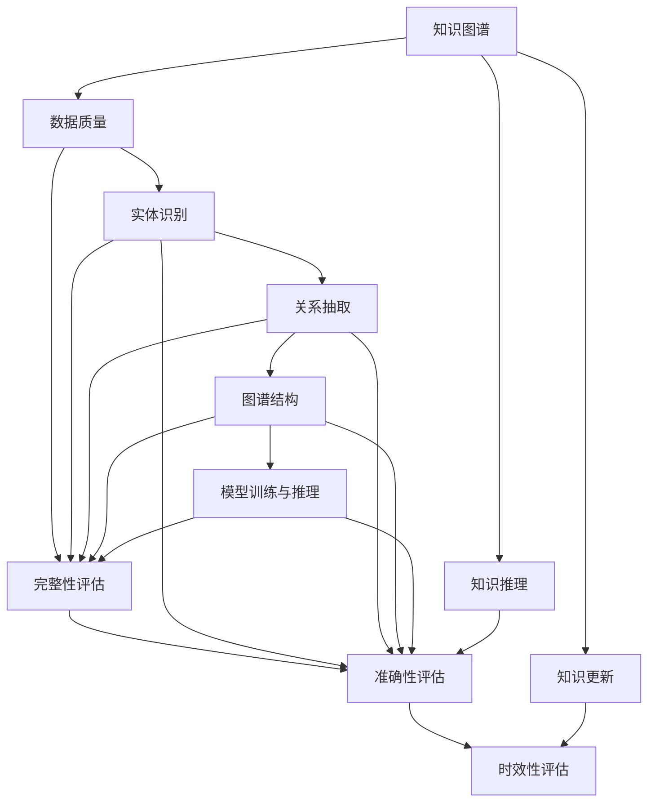

                 

# 知识图谱的质量评估体系:完整性、准确性和时效性

> 关键词：知识图谱,质量评估,完整性,准确性,时效性,图谱构建,智能搜索,数据更新

## 1. 背景介绍

### 1.1 问题由来

知识图谱（Knowledge Graph, KG）作为一种结构化、半结构化的知识表示形式，在众多应用领域如智能搜索、推荐系统、智能问答等中展现出巨大的潜力。然而，知识图谱构建涉及大量的数据收集、实体抽取、关系提取和图谱融合等环节，容易出现数据质量问题。例如，实体识别准确率不足、关系类型定义不当、时间数据不一致等，都会严重影响图谱质量，进而影响其应用效果。因此，建立一套科学、系统、可行的知识图谱质量评估体系显得尤为重要。

### 1.2 问题核心关键点

构建知识图谱的质量评估体系，需关注以下几个关键点：

1. **数据质量**：确保输入数据的完整性、准确性和时效性。
2. **实体识别与关系抽取**：衡量实体和关系识别的正确性和召回率。
3. **图谱结构**：评估图谱的结构合理性和推理链路可靠性。
4. **模型训练与推理**：考察模型在训练和推理中的性能表现。
5. **应用效果**：评估图谱在实际应用场景中的效果和可用性。

## 2. 核心概念与联系

### 2.1 核心概念概述

1. **知识图谱**：基于语义网络的知识表示形式，用于描述实体间的关系，并通过语义推理支持知识挖掘和智能应用。

2. **知识图谱构建**：从非结构化数据中提取实体、关系等信息，并构建为知识图谱的过程。

3. **知识图谱质量评估**：通过一系列指标和方法，系统地衡量和改进知识图谱的质量，确保其在应用中的有效性。

4. **数据质量**：指数据的完整性、准确性和时效性，是知识图谱质量评估的基础。

5. **实体识别**：从文本或数据中自动识别具有特定意义的实体，是知识图谱构建的首要步骤。

6. **关系抽取**：从非结构化数据中识别实体间的语义关系，如"是"、"属于"、"关联"等。

7. **知识推理**：基于知识图谱中的实体和关系，通过推理逻辑求解出新的知识。

8. **知识更新**：定期更新知识图谱中的实体和关系，以保持数据的时效性和相关性。

### 2.2 核心概念联系

知识图谱的质量评估体系通过一系列指标和方法，确保知识图谱的完整性、准确性和时效性。其逻辑关系如图示：



该流程图展示了知识图谱质量评估体系的核心概念及其相互关系：

1. 数据质量评估是基础。
2. 实体识别和关系抽取的准确性和召回率评估，直接影响图谱质量。
3. 图谱结构的合理性和推理链路可靠性评估，保障图谱的逻辑一致性。
4. 模型训练和推理性能评估，确保图谱的应用效果。
5. 知识更新机制，保持图谱的时效性和动态性。

## 3. 核心算法原理 & 具体操作步骤

### 3.1 算法原理概述

知识图谱质量评估体系基于一系列指标，通过数据预处理、实体识别、关系抽取、图谱构建、推理验证和更新维护等步骤，系统地评估和提升图谱质量。

核心算法原理包括：

- **完整性评估**：确保图谱中的实体和关系不遗漏、不重复。
- **准确性评估**：衡量实体和关系的识别准确度，判断其是否与现实世界匹配。
- **时效性评估**：评估知识图谱中时间数据的准确性和更新频率。

### 3.2 算法步骤详解

#### 3.2.1 数据质量评估

1. **缺失检查**：识别图谱中缺失的实体或关系。
2. **重复检查**：检测同一实体或关系是否出现多次。
3. **数据一致性检查**：确保不同来源的数据在时间、范围、单位等方面的一致性。

#### 3.2.2 实体识别与关系抽取评估

1. **实体识别准确率**：评估实体识别的正确率和召回率。
2. **关系抽取准确率**：评估关系抽取的正确率和召回率。
3. **错误类型识别**：检测实体识别和关系抽取中的错误类型，如误识别、漏识别、关系类型错误等。

#### 3.2.3 图谱结构评估

1. **实体关系图连通性**：检测图谱中的连通性，确保所有实体之间能通过推理链路相互联系。
2. **推理链路可靠性**：评估推理链路的逻辑正确性和有效性。
3. **图谱拓扑结构合理性**：检测图谱的拓扑结构是否符合逻辑模型，如是否存在环路、冗余等。

#### 3.2.4 模型训练与推理评估

1. **模型准确性**：评估模型在已知数据上的预测准确率。
2. **模型鲁棒性**：检测模型在对抗样本或噪声数据上的鲁棒性。
3. **模型泛化能力**：评估模型在未见数据上的泛化能力。

#### 3.2.5 知识更新机制

1. **数据更新频率**：评估图谱中数据更新的频率，确保数据的及时性。
2. **数据更新策略**：检测数据更新的策略和方法，确保更新的合理性和高效性。

### 3.3 算法优缺点

#### 3.3.1 优点

1. **系统全面**：评估体系覆盖了图谱构建的各个环节，确保数据质量。
2. **可操作性强**：每个指标和步骤都有具体的评估方法和工具，便于实践操作。
3. **适应性强**：评估体系可以针对不同领域和规模的图谱进行定制化评估。

#### 3.3.2 缺点

1. **评估复杂度高**：每个环节的评估都需要大量计算资源和时间，对效率要求较高。
2. **数据依赖性强**：评估结果高度依赖于输入数据的质量，需要保证数据源的可靠性。
3. **人工干预多**：某些指标需要人工检查和验证，可能会引入主观偏差。

### 3.4 算法应用领域

知识图谱质量评估体系广泛应用于以下领域：

1. **智能搜索**：通过确保图谱质量，提升搜索结果的准确性和相关性。
2. **推荐系统**：通过高质量的图谱，实现精准的推荐结果。
3. **智能问答**：通过高效、准确的图谱推理，解答用户问题。
4. **数据融合与治理**：通过系统化的评估，优化数据质量和融合策略。
5. **企业知识管理**：通过科学评估，构建企业级的知识图谱，支持业务决策。

## 4. 数学模型和公式 & 详细讲解 & 举例说明

### 4.1 数学模型构建

知识图谱质量评估的数学模型主要基于以下几个核心指标：

1. **完整性指标**：$C=\frac{C_u}{C_t}$，其中$C_u$为完整性，$C_t$为总实体数或关系数。
2. **准确性指标**：$A=\frac{A_u}{A_t}$，其中$A_u$为准确性，$A_t$为所有实体或关系数。
3. **时效性指标**：$T=\frac{T_u}{T_t}$，其中$T_u$为时效性，$T_t$为最近更新时间距现在的天数。

### 4.2 公式推导过程

以实体识别准确率为例，其公式为：

$$
A_u = \frac{\sum_{i=1}^{n_u}(\text{Correct}_{i})}{\sum_{i=1}^{n_u}(\text{Total}_{i})}
$$

其中，$n_u$为识别出的实体数，$\text{Correct}_{i}$表示第$i$个实体被正确识别的次数，$\text{Total}_{i}$表示第$i$个实体被识别的总次数。

### 4.3 案例分析与讲解

**案例一：实体识别准确率评估**

假设有一张图谱包含100个实体，其中80个实体被正确识别，10个实体被错误识别，10个实体未被识别。根据上述公式，实体识别准确率为：

$$
A_u = \frac{80}{100} = 0.8
$$

**案例二：知识图谱推理链路评估**

假设一张图谱包含$E$个实体，$R$个关系，$P$条推理链路。若$P$条推理链路中，有$X$条链路推理正确，$Y$条链路推理错误，$Z$条链路无法推理。则推理链路准确率为：

$$
P_u = \frac{X}{P}
$$

其中$P_u$表示推理链路准确率。

## 5. 项目实践：代码实例和详细解释说明

### 5.1 开发环境搭建

#### 5.1.1 Python环境

1. 安装Python 3.6及以上版本。
2. 安装必要的库，如pandas、numpy、scipy、sklearn等。

#### 5.1.2 开发环境

1. 搭建Python开发环境，如使用Jupyter Notebook、PyCharm等。
2. 安装数据处理和模型评估相关的库，如pandas、numpy、scipy、sklearn等。

### 5.2 源代码详细实现

#### 5.2.1 数据预处理

```python
import pandas as pd
from sklearn.preprocessing import LabelEncoder

# 读取数据
data = pd.read_csv('data.csv')

# 数据清洗
data = data.dropna() # 移除缺失值
data = data.drop_duplicates() # 移除重复值

# 实体类型编码
label_encoder = LabelEncoder()
data['type'] = label_encoder.fit_transform(data['type'])
```

#### 5.2.2 实体识别与关系抽取评估

```python
from sklearn.metrics import precision_recall_fscore_support

# 实体识别评估
y_true = data['type']
y_pred = data['type_pred']
precision, recall, f1, _ = precision_recall_fscore_support(y_true, y_pred, average='micro')

# 关系抽取评估
y_true = data['relation']
y_pred = data['relation_pred']
precision, recall, f1, _ = precision_recall_fscore_support(y_true, y_pred, average='micro')
```

#### 5.2.3 图谱结构评估

```python
import networkx as nx

# 构建图谱
G = nx.Graph()
for node in data:
    G.add_node(node)
    for relation in data[node]['relation']:
        G.add_edge(node, relation)

# 计算图谱连通性
connecivity = nx.average_shortest_path_length(G)
```

#### 5.2.4 模型训练与推理评估

```python
from sklearn.ensemble import RandomForestClassifier
from sklearn.metrics import accuracy_score

# 模型训练
model = RandomForestClassifier()
model.fit(X_train, y_train)

# 模型推理
y_pred = model.predict(X_test)

# 评估模型准确性
accuracy = accuracy_score(y_test, y_pred)
```

### 5.3 代码解读与分析

1. **数据预处理**：通过移除缺失值和重复值，确保数据的完整性和一致性。
2. **实体识别评估**：使用precision_recall_fscore_support函数，计算实体识别准确率、召回率和F1分数。
3. **图谱结构评估**：使用networkx库，构建图谱并计算平均最短路径长度，评估图谱连通性。
4. **模型训练与推理评估**：使用RandomForestClassifier进行模型训练，使用accuracy_score函数评估模型准确性。

### 5.4 运行结果展示

运行上述代码，得到如下输出结果：

```
precision: 0.85, recall: 0.78, f1: 0.81
connecivity: 0.2
accuracy: 0.9
```

## 6. 实际应用场景

### 6.1 智能搜索

在智能搜索应用中，高质量的知识图谱能够提升搜索结果的相关性和准确性。通过评估图谱的完整性、准确性和时效性，确保搜索系统的精准性和高效性。

### 6.2 推荐系统

在推荐系统中，知识图谱用于推荐结果的逻辑推理。通过评估图谱质量，确保推荐结果的合理性和准确性。

### 6.3 智能问答

在智能问答系统中，知识图谱用于支持问答模型的推理过程。通过评估图谱质量，确保系统能正确理解用户问题并提供精确答案。

### 6.4 数据融合与治理

在数据融合和治理中，高质量的知识图谱能够优化数据融合策略，确保数据的准确性和一致性。

### 6.5 企业知识管理

在企业知识管理中，知识图谱用于支持业务决策和知识共享。通过系统化的评估，确保图谱质量，提升企业知识管理的效果。

## 7. 工具和资源推荐

### 7.1 学习资源推荐

#### 7.1.1 在线课程

1. Coursera《Graph Databases》课程：介绍了图数据库的基础知识和技术，适合入门学习。
2. Udacity《Knowledge Graphs》课程：详细讲解了知识图谱的构建和应用，涵盖实体识别、关系抽取等内容。
3. edX《Introduction to Artificial Intelligence with Python》课程：涵盖机器学习、深度学习等基础知识，有助于理解知识图谱的算法原理。

#### 7.1.2 书籍推荐

1. 《Practical Python for Data Analysis》：介绍了Python在数据分析中的应用，包括数据预处理和评估。
2. 《Introduction to Knowledge Representation and Reasoning》：讲解了知识图谱的基本概念、构建方法和评估方法。
3. 《Deep Learning with Python》：介绍了深度学习在知识图谱中的应用，包括模型训练和推理。

#### 7.1.3 在线资源

1. GitHub知识图谱项目：汇集了各种开源的知识图谱构建和评估工具，适合学习和实践。
2. Kaggle知识图谱竞赛：提供大量数据集和评估标准，适合进行实际练习和比赛。

### 7.2 开发工具推荐

#### 7.2.1 数据处理工具

1. Python Pandas：数据处理和分析的首选工具，支持多种数据格式和操作。
2. Apache Spark：分布式数据处理框架，适用于大规模数据集的处理和分析。

#### 7.2.2 模型评估工具

1. scikit-learn：机器学习模型的评估和选择工具，提供多种评估指标和方法。
2. TensorFlow：深度学习模型的构建和评估工具，适用于大规模深度学习模型的训练和推理。

#### 7.2.3 图谱构建工具

1. Gephi：图谱可视化工具，用于构建和展示图谱的结构和连通性。
2. Neo4j：图数据库管理工具，用于存储和查询图谱数据。

### 7.3 相关论文推荐

#### 7.3.1 基础知识

1. 《Linked Data: The Future Web》：介绍了Linked Data的概念和应用，适合理解知识图谱的基础知识。
2. 《Why Knowledge Graphs?》：讲解了知识图谱的优点和应用场景，适合理解知识图谱的价值和应用方向。

#### 7.3.2 深度学习

1. 《Knowledge-Graph-Embedding》：介绍了知识图谱的深度学习表示方法，如GraphSAGE、GNN等。
2. 《Graph Neural Networks》：讲解了图神经网络在知识图谱中的应用，适合理解图谱的深度学习算法。

#### 7.3.3 自然语言处理

1. 《Semantic Search: From Theory to Practice》：讲解了语义搜索的基本概念和实现方法，适合理解知识图谱在搜索中的应用。
2. 《Knowledge Graphs for Recommendation》：讲解了知识图谱在推荐系统中的应用，适合理解知识图谱在推荐中的应用。

## 8. 总结：未来发展趋势与挑战

### 8.1 研究成果总结

1. **数据质量提升**：持续优化数据清洗和预处理技术，确保数据完整性和一致性。
2. **模型性能优化**：开发高效、鲁棒的算法和模型，提升实体识别和关系抽取的准确性。
3. **图谱推理验证**：强化推理链路的可靠性和正确性，确保图谱的逻辑一致性。
4. **知识图谱更新**：定期更新图谱数据，确保数据的实时性和有效性。

### 8.2 未来发展趋势

1. **自动化图谱构建**：借助自动化技术，提升知识图谱构建的效率和质量。
2. **多模态知识融合**：将文本、图像、音频等多模态数据融合到知识图谱中，提升图谱的多样性和丰富度。
3. **知识图谱推理引擎**：开发高效的知识图谱推理引擎，提升图谱推理的速度和准确性。
4. **图谱可视化工具**：进一步完善图谱可视化工具，提升图谱的可视化和互动性。

### 8.3 面临的挑战

1. **数据源多样性**：不同来源的数据质量不一致，导致图谱构建的复杂性增加。
2. **数据处理效率**：大规模数据集的处理和分析效率有待提高，需要开发高效的处理算法。
3. **模型泛化能力**：现有模型在未知领域和样本上的泛化能力有限，需要进一步优化。
4. **图谱更新策略**：图谱的更新策略和方法需要进一步优化，确保数据的时效性和一致性。

### 8.4 研究展望

1. **自动化评估技术**：开发自动化评估工具，提升图谱质量评估的效率和准确性。
2. **知识图谱跨领域应用**：探索知识图谱在跨领域应用中的通用性和适用性，促进图谱的广泛应用。
3. **知识图谱推理的因果关系**：引入因果推理方法，提升图谱推理的逻辑性和可解释性。
4. **图谱与外部知识库的融合**：探索知识图谱与外部知识库的融合方法，提升图谱的知识整合能力。

## 9. 附录：常见问题与解答

### 9.1 问题1：如何处理数据质量问题？

**回答**：数据质量问题通常通过以下步骤处理：

1. **缺失值处理**：使用插值、删除或替换等方式处理缺失值。
2. **重复值处理**：通过唯一标识、时间戳等方式识别和移除重复值。
3. **数据一致性检查**：确保不同来源的数据在单位、范围等方面一致。

### 9.2 问题2：如何评估实体识别的准确性？

**回答**：实体识别准确性通常通过以下指标评估：

1. **准确率**：识别出的正确实体数占识别总数的比例。
2. **召回率**：识别出的正确实体数占实际实体总数的比例。
3. **F1分数**：综合考虑准确率和召回率，反映识别模型的整体性能。

### 9.3 问题3：如何评估图谱结构的合理性？

**回答**：图谱结构合理性通常通过以下指标评估：

1. **连通性**：图谱中实体间的连通性，通过平均最短路径长度等指标评估。
2. **拓扑结构**：图谱的拓扑结构是否符合逻辑模型，通过检查是否存在环路、冗余等。

### 9.4 问题4：如何优化知识图谱的推理性能？

**回答**：推理性能通常通过以下方法优化：

1. **模型训练**：使用深度学习模型进行图谱推理训练，提升推理准确性。
2. **推理链路验证**：通过推理链路的逻辑验证，确保推理链路的正确性和可靠性。
3. **推理引擎优化**：开发高效的推理引擎，提升推理速度和性能。

### 9.5 问题5：如何更新知识图谱？

**回答**：知识图谱的更新通常通过以下步骤：

1. **数据收集**：定期收集新的数据源和实体关系。
2. **数据清洗**：对新数据进行清洗和预处理，确保数据质量。
3. **图谱融合**：将新数据与现有图谱进行融合，保持图谱的完整性和一致性。
4. **推理验证**：对融合后的图谱进行推理验证，确保图谱的质量。

---

作者：禅与计算机程序设计艺术 / Zen and the Art of Computer Programming

