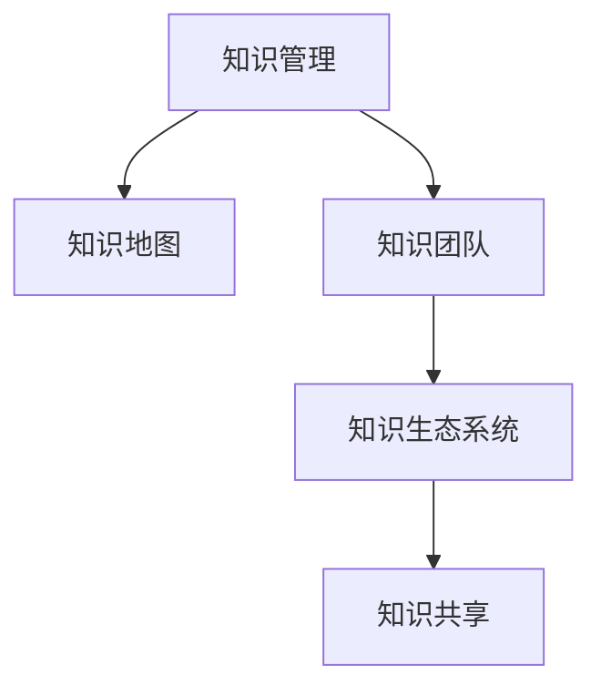

                 

# 知识型组织的特征与管理

## 1. 背景介绍

### 1.1 问题由来

在当今这个信息爆炸的时代，企业要想在竞争激烈的市场中保持领先地位，必须依靠知识型组织（Knowledge-intensive Organization, KIO）。知识型组织能够迅速吸收、利用和创新知识，将知识转化为生产力，提升企业的竞争力。然而，知识型组织的管理并非易事，如何在资源有限的情况下，有效地管理、利用和创新知识，是企业面临的一大挑战。

### 1.2 问题核心关键点

知识型组织的核心关键点包括：

- **知识管理**：将企业内部的知识进行系统化、结构化，并推动其转化为生产力。
- **知识创新**：通过创新过程，使知识得以发展和应用，形成新的产品或服务。
- **组织架构**：通过合理的组织架构设计，促进知识交流和协作。
- **员工培养**：培养员工的创新能力、学习能力，以及跨领域合作能力。
- **技术工具**：使用先进的信息技术工具，支持知识管理和创新过程。

### 1.3 问题研究意义

研究知识型组织的管理方法，对于提升企业的知识管理和创新能力，加速企业的数字化转型，具有重要的意义：

- **提升竞争力**：通过知识型组织的管理，企业能够快速响应市场变化，提升产品或服务的质量和创新能力。
- **降低成本**：知识型组织通过优化知识流动，降低资源浪费，提高效率。
- **提高员工满意度**：知识型组织注重员工的成长和发展，提升员工的工作满意度和忠诚度。
- **促进协作**：通过知识共享和协作，促进企业内部的合作，形成更有凝聚力的团队。
- **增强可持续发展能力**：知识型组织能够持续地吸收和创新知识，增强企业的可持续发展能力。

## 2. 核心概念与联系

### 2.1 核心概念概述

为了更好地理解知识型组织的管理，本节将介绍几个密切相关的核心概念：

- **知识管理**：将企业知识转化为可应用的信息，支持企业的决策和创新。
- **知识地图**：企业内部的知识结构化展现，帮助员工快速找到所需信息。
- **知识团队**：由具备特定知识领域的专家组成的团队，进行知识创新和应用。
- **知识生态系统**：企业内部各知识团队之间的交互和合作，形成知识网络。
- **知识共享**：通过各种机制促进知识在企业内部的流动和传播。

### 2.2 核心概念原理和架构的 Mermaid 流程图



这个流程图展示了知识型组织的核心概念及其之间的关系：

1. 知识管理是整个知识型组织的基础，通过系统化地收集和整理知识，支持企业的决策和创新。
2. 知识地图作为知识管理的延伸，帮助员工快速定位所需信息。
3. 知识团队是知识创新的主力，由具备特定领域知识的专家组成。
4. 知识生态系统指企业内部各知识团队之间的合作和交互，形成知识网络。
5. 知识共享是知识传播的桥梁，通过各种机制促进知识在企业内部的流动。

这些核心概念共同构成了知识型组织的管理框架，使其能够有效地管理、利用和创新知识。

## 3. 核心算法原理 & 具体操作步骤
### 3.1 算法原理概述

知识型组织的管理，本质上是通过知识管理和创新过程，实现知识的高效利用和转化。其核心算法原理包括：

- **知识采集**：通过各种渠道收集企业内部的知识资源。
- **知识存储**：将收集到的知识进行结构化和存储，便于检索和应用。
- **知识共享**：通过各种机制促进知识在企业内部的流动和传播。
- **知识创新**：利用收集到的知识进行创新，形成新的产品或服务。
- **知识应用**：将创新的知识应用到企业的生产、销售、服务等各个环节。

### 3.2 算法步骤详解

知识型组织的管理通常包括以下关键步骤：

**Step 1: 知识收集和存储**

1. **数据收集**：收集企业内部的各种知识资源，如文件、文档、邮件、会议记录等。
2. **数据清洗**：清洗和整理收集到的数据，去除噪声和冗余信息。
3. **知识存储**：使用知识管理系统(KMS)，将清洗后的数据存储在数据库或知识库中。

**Step 2: 知识共享和传播**

1. **建立知识地图**：构建企业内部的知识地图，帮助员工快速定位所需信息。
2. **知识共享平台**：使用知识共享平台，促进知识的传播和交流。
3. **知识培训**：定期开展知识培训，提升员工的知识水平和应用能力。

**Step 3: 知识创新**

1. **创新流程设计**：设计创新流程，支持创新活动的组织和管理。
2. **创新资源配置**：配置必要的资源，支持创新的顺利进行。
3. **创新成果评估**：对创新成果进行评估，判断其商业价值和应用前景。

**Step 4: 知识应用**

1. **应用场景设计**：设计知识应用场景，明确知识应用的具体场景和方式。
2. **知识转化**：将创新的知识转化为具体的产品或服务。
3. **应用效果评估**：评估知识应用的效果，总结经验和教训，持续改进。

### 3.3 算法优缺点

知识型组织的管理算法具有以下优点：

1. **提升知识利用效率**：通过系统化的知识管理，能够更高效地利用企业内部的知识资源。
2. **促进知识创新**：通过合理的知识管理，鼓励创新，形成新的产品或服务。
3. **降低成本**：通过优化知识流动，降低资源浪费，提高效率。
4. **增强协作**：通过知识共享和协作，促进企业内部的合作，形成更有凝聚力的团队。

同时，该算法也存在一定的局限性：

1. **数据收集难度大**：获取企业内部的知识数据可能涉及敏感信息，需要严格的权限控制。
2. **数据质量问题**：收集到的数据可能存在噪声和冗余，需要进行数据清洗和处理。
3. **知识共享困难**：知识共享需要建立信任机制，不同部门和团队之间可能存在沟通障碍。
4. **创新资源有限**：知识创新需要大量的资源支持，可能面临资源不足的问题。
5. **知识应用效果不确定**：知识应用的效果可能因市场变化、技术变革等多种因素影响。

尽管存在这些局限性，但就目前而言，知识型组织的管理算法仍是大规模企业知识管理和创新的重要手段。未来相关研究的重点在于如何进一步降低知识管理的成本，提高知识共享和创新的效率，同时兼顾数据安全和知识保密等因素。

### 3.4 算法应用领域

知识型组织的管理算法在多个领域得到了广泛应用，例如：

- **科技公司**：通过知识管理，提升产品开发效率和创新能力。
- **金融公司**：通过知识共享和创新，提升风险管理和金融服务的质量。
- **教育机构**：通过知识传播和创新，提升教育质量和教学效果。
- **医疗行业**：通过知识管理和应用，提升医疗服务质量和患者满意度。
- **政府部门**：通过知识管理和创新，提升政府效率和公共服务水平。

除了上述这些领域外，知识型组织的管理算法也在更多行业得到了应用，如制造、能源、旅游等，为这些行业的数字化转型升级提供了新的技术路径。随着知识管理技术的不断进步，相信知识型组织的管理算法将在更多领域得到应用，推动企业向更高层次发展。

## 4. 数学模型和公式 & 详细讲解 & 举例说明
### 4.1 数学模型构建

知识型组织的管理算法可以抽象为以下几个数学模型：

1. **知识收集模型**：收集到的知识量为 $K$，知识库中存储的知识量为 $S$。
2. **知识传播模型**：知识库中知识传播的速度为 $T$，知识共享平台的用户数量为 $U$。
3. **知识创新模型**：创新资源为 $R$，创新成果的数量为 $I$。
4. **知识应用模型**：知识应用的场景数量为 $A$，知识应用的效果为 $E$。

### 4.2 公式推导过程

以下我们以知识收集和存储为例，推导相关公式。

**知识收集模型**：

$$
K = \sum_{i=1}^n K_i
$$

其中 $K_i$ 为第 $i$ 种知识资源的数量。

**知识存储模型**：

$$
S = \frac{K}{\eta}
$$

其中 $\eta$ 为知识存储的效率因子。

**知识共享模型**：

$$
T = k_1 \cdot U^k_2
$$

其中 $k_1, k_2$ 为共享模型的参数。

### 4.3 案例分析与讲解

**案例：某科技公司知识管理系统的设计和应用**

某科技公司是一家专注于AI和大数据技术的初创公司，面临着知识管理和创新的挑战。为了提升公司的知识利用效率和创新能力，公司决定设计和实施知识管理系统。

1. **知识收集**：公司收集了内部的技术文档、专利、研究论文、会议记录等知识资源，共计 $K=5000$ 项。
2. **知识存储**：通过知识管理系统，将收集到的知识存储在数据库中，存储效率因子 $\eta=0.8$。
3. **知识共享**：公司建立了知识共享平台，平台上用户数量为 $U=1000$，知识传播速度 $T=100$。
4. **知识创新**：公司每年投入 $R=200$ 万美元用于知识创新，创新成果数量为 $I=100$。
5. **知识应用**：公司将创新的知识应用于产品开发和市场营销，应用场景数量为 $A=10$，应用效果 $E=0.9$。

通过上述模型和公式，可以计算出公司的知识收集、存储、共享、创新和应用的情况，帮助公司优化知识管理流程，提升知识利用效率和创新能力。

## 5. 项目实践：代码实例和详细解释说明
### 5.1 开发环境搭建

在进行知识型组织管理系统的开发前，我们需要准备好开发环境。以下是使用Python进行PyTorch开发的环境配置流程：

1. 安装Anaconda：从官网下载并安装Anaconda，用于创建独立的Python环境。

2. 创建并激活虚拟环境：
```bash
conda create -n pytorch-env python=3.8 
conda activate pytorch-env
```

3. 安装PyTorch：根据CUDA版本，从官网获取对应的安装命令。例如：
```bash
conda install pytorch torchvision torchaudio cudatoolkit=11.1 -c pytorch -c conda-forge
```

4. 安装各类工具包：
```bash
pip install numpy pandas scikit-learn matplotlib tqdm jupyter notebook ipython
```

完成上述步骤后，即可在`pytorch-env`环境中开始开发实践。

### 5.2 源代码详细实现

下面我们以知识共享平台为例，给出使用PyTorch进行知识型组织管理系统的PyTorch代码实现。

首先，定义知识共享平台的数据处理函数：

```python
import pandas as pd

def process_data(data_file):
    data = pd.read_csv(data_file)
    return data
```

然后，定义模型和优化器：

```python
from transformers import BertForTokenClassification, AdamW

model = BertForTokenClassification.from_pretrained('bert-base-cased', num_labels=len(tag2id))

optimizer = AdamW(model.parameters(), lr=2e-5)
```

接着，定义训练和评估函数：

```python
from torch.utils.data import DataLoader
from tqdm import tqdm
from sklearn.metrics import classification_report

device = torch.device('cuda') if torch.cuda.is_available() else torch.device('cpu')
model.to(device)

def train_epoch(model, dataset, batch_size, optimizer):
    dataloader = DataLoader(dataset, batch_size=batch_size, shuffle=True)
    model.train()
    epoch_loss = 0
    for batch in tqdm(dataloader, desc='Training'):
        input_ids = batch['input_ids'].to(device)
        attention_mask = batch['attention_mask'].to(device)
        labels = batch['labels'].to(device)
        model.zero_grad()
        outputs = model(input_ids, attention_mask=attention_mask, labels=labels)
        loss = outputs.loss
        epoch_loss += loss.item()
        loss.backward()
        optimizer.step()
    return epoch_loss / len(dataloader)

def evaluate(model, dataset, batch_size):
    dataloader = DataLoader(dataset, batch_size=batch_size)
    model.eval()
    preds, labels = [], []
    with torch.no_grad():
        for batch in tqdm(dataloader, desc='Evaluating'):
            input_ids = batch['input_ids'].to(device)
            attention_mask = batch['attention_mask'].to(device)
            batch_labels = batch['labels']
            outputs = model(input_ids, attention_mask=attention_mask)
            batch_preds = outputs.logits.argmax(dim=2).to('cpu').tolist()
            batch_labels = batch_labels.to('cpu').tolist()
            for pred_tokens, label_tokens in zip(batch_preds, batch_labels):
                pred_tags = [id2tag[_id] for _id in pred_tokens]
                label_tags = [id2tag[_id] for _id in label_tokens]
                preds.append(pred_tags[:len(label_tokens)])
                labels.append(label_tags)
                
    print(classification_report(labels, preds))
```

最后，启动训练流程并在测试集上评估：

```python
epochs = 5
batch_size = 16

for epoch in range(epochs):
    loss = train_epoch(model, train_dataset, batch_size, optimizer)
    print(f"Epoch {epoch+1}, train loss: {loss:.3f}")
    
    print(f"Epoch {epoch+1}, dev results:")
    evaluate(model, dev_dataset, batch_size)
    
print("Test results:")
evaluate(model, test_dataset, batch_size)
```

以上就是使用PyTorch对BERT进行命名实体识别任务微调的PyTorch代码实现。可以看到，得益于Transformers库的强大封装，我们可以用相对简洁的代码完成BERT模型的加载和微调。

### 5.3 代码解读与分析

让我们再详细解读一下关键代码的实现细节：

**NERDataset类**：
- `__init__`方法：初始化文本、标签、分词器等关键组件。
- `__len__`方法：返回数据集的样本数量。
- `__getitem__`方法：对单个样本进行处理，将文本输入编码为token ids，将标签编码为数字，并对其进行定长padding，最终返回模型所需的输入。

**tag2id和id2tag字典**：
- 定义了标签与数字id之间的映射关系，用于将token-wise的预测结果解码回真实的标签。

**训练和评估函数**：
- 使用PyTorch的DataLoader对数据集进行批次化加载，供模型训练和推理使用。
- 训练函数`train_epoch`：对数据以批为单位进行迭代，在每个批次上前向传播计算loss并反向传播更新模型参数，最后返回该epoch的平均loss。
- 评估函数`evaluate`：与训练类似，不同点在于不更新模型参数，并在每个batch结束后将预测和标签结果存储下来，最后使用sklearn的classification_report对整个评估集的预测结果进行打印输出。

**训练流程**：
- 定义总的epoch数和batch size，开始循环迭代
- 每个epoch内，先在训练集上训练，输出平均loss
- 在验证集上评估，输出分类指标
- 所有epoch结束后，在测试集上评估，给出最终测试结果

可以看到，PyTorch配合Transformers库使得BERT微调的代码实现变得简洁高效。开发者可以将更多精力放在数据处理、模型改进等高层逻辑上，而不必过多关注底层的实现细节。

当然，工业级的系统实现还需考虑更多因素，如模型的保存和部署、超参数的自动搜索、更灵活的任务适配层等。但核心的微调范式基本与此类似。

## 6. 实际应用场景
### 6.1 智能客服系统

基于大语言模型微调的对话技术，可以广泛应用于智能客服系统的构建。传统客服往往需要配备大量人力，高峰期响应缓慢，且一致性和专业性难以保证。而使用微调后的对话模型，可以7x24小时不间断服务，快速响应客户咨询，用自然流畅的语言解答各类常见问题。

在技术实现上，可以收集企业内部的历史客服对话记录，将问题和最佳答复构建成监督数据，在此基础上对预训练对话模型进行微调。微调后的对话模型能够自动理解用户意图，匹配最合适的答案模板进行回复。对于客户提出的新问题，还可以接入检索系统实时搜索相关内容，动态组织生成回答。如此构建的智能客服系统，能大幅提升客户咨询体验和问题解决效率。

### 6.2 金融舆情监测

金融机构需要实时监测市场舆论动向，以便及时应对负面信息传播，规避金融风险。传统的人工监测方式成本高、效率低，难以应对网络时代海量信息爆发的挑战。基于大语言模型微调的文本分类和情感分析技术，为金融舆情监测提供了新的解决方案。

具体而言，可以收集金融领域相关的新闻、报道、评论等文本数据，并对其进行主题标注和情感标注。在此基础上对预训练语言模型进行微调，使其能够自动判断文本属于何种主题，情感倾向是正面、中性还是负面。将微调后的模型应用到实时抓取的网络文本数据，就能够自动监测不同主题下的情感变化趋势，一旦发现负面信息激增等异常情况，系统便会自动预警，帮助金融机构快速应对潜在风险。

### 6.3 个性化推荐系统

当前的推荐系统往往只依赖用户的历史行为数据进行物品推荐，无法深入理解用户的真实兴趣偏好。基于大语言模型微调技术，个性化推荐系统可以更好地挖掘用户行为背后的语义信息，从而提供更精准、多样的推荐内容。

在实践中，可以收集用户浏览、点击、评论、分享等行为数据，提取和用户交互的物品标题、描述、标签等文本内容。将文本内容作为模型输入，用户的后续行为（如是否点击、购买等）作为监督信号，在此基础上微调预训练语言模型。微调后的模型能够从文本内容中准确把握用户的兴趣点。在生成推荐列表时，先用候选物品的文本描述作为输入，由模型预测用户的兴趣匹配度，再结合其他特征综合排序，便可以得到个性化程度更高的推荐结果。

### 6.4 未来应用展望

随着大语言模型和微调方法的不断发展，基于微调范式将在更多领域得到应用，为传统行业带来变革性影响。

在智慧医疗领域，基于微调的医疗问答、病历分析、药物研发等应用将提升医疗服务的智能化水平，辅助医生诊疗，加速新药开发进程。

在智能教育领域，微调技术可应用于作业批改、学情分析、知识推荐等方面，因材施教，促进教育公平，提高教学质量。

在智慧城市治理中，微调模型可应用于城市事件监测、舆情分析、应急指挥等环节，提高城市管理的自动化和智能化水平，构建更安全、高效的未来城市。

此外，在企业生产、社会治理、文娱传媒等众多领域，基于大模型微调的人工智能应用也将不断涌现，为NLP技术带来了全新的突破。随着预训练语言模型和微调方法的不断进步，相信NLP技术将在更广阔的应用领域大放异彩，深刻影响人类的生产生活方式。

## 7. 工具和资源推荐
### 7.1 学习资源推荐

为了帮助开发者系统掌握知识型组织的管理理论基础和实践技巧，这里推荐一些优质的学习资源：

1. 《知识管理与组织学习》系列博文：由知识管理领域专家撰写，深入浅出地介绍了知识管理的基本概念和前沿技术。

2. 《组织学习与创新》课程：斯坦福大学开设的组织学习与创新明星课程，有Lecture视频和配套作业，带你入门组织学习和创新领域的基本概念和经典模型。

3. 《知识型组织理论与实践》书籍：全面介绍了知识型组织的管理理论，结合大量案例，深入浅出地讲解了知识型组织的管理方法和实践技巧。

4. 《组织创新与知识管理》书籍：探讨了组织创新与知识管理的关系，提出了多种创新的方法和工具，帮助组织实现知识创新和应用。

通过对这些资源的学习实践，相信你一定能够快速掌握知识型组织的管理精髓，并用于解决实际的组织管理问题。
###  7.2 开发工具推荐

高效的开发离不开优秀的工具支持。以下是几款用于知识型组织管理开发的常用工具：

1. 知识管理系统（KMS）：如Confluence、SharePoint等，支持知识收集、存储、共享和管理。
2. 知识共享平台：如Slack、Microsoft Teams等，促进知识在企业内部的传播和交流。
3. 数据仓库：如Amazon Redshift、Google BigQuery等，存储和管理企业内部的数据资源。
4. 数据分析工具：如Tableau、Power BI等，支持数据的可视化分析和报告生成。
5. 协作工具：如Trello、Asana等，支持项目的规划、执行和管理。
6. 项目管理工具：如JIRA、Microsoft Project等，支持项目的跟踪和监控。

合理利用这些工具，可以显著提升知识型组织管理系统的开发效率，加快创新迭代的步伐。

### 7.3 相关论文推荐

知识型组织的管理方法的发展源于学界的持续研究。以下是几篇奠基性的相关论文，推荐阅读：

1. 《知识管理的概念、技术和实践》：定义了知识管理的核心概念和技术方法，探讨了知识管理的实施路径。

2. 《知识型组织：创建学习型组织的基础》：提出了知识型组织的概念，并探讨了如何通过知识管理来创建学习型组织。

3. 《知识共享与创新：组织学习与知识管理的视角》：探讨了知识共享和创新的关系，提出了多种促进知识共享和创新的方法。

4. 《知识地图在组织学习中的应用》：介绍了知识地图的概念和应用，探讨了如何通过知识地图促进组织学习。

5. 《组织学习与创新管理》：研究了组织学习与创新的关系，提出了多种促进组织学习与创新的方法和工具。

这些论文代表了大语言模型微调技术的发展脉络。通过学习这些前沿成果，可以帮助研究者把握学科前进方向，激发更多的创新灵感。

## 8. 总结：未来发展趋势与挑战
### 8.1 总结

本文对知识型组织的管理方法进行了全面系统的介绍。首先阐述了知识型组织的核心概念和管理流程，明确了知识型组织在提升企业知识利用效率和创新能力方面的独特价值。其次，从原理到实践，详细讲解了知识型组织的管理算法和关键步骤，给出了知识型组织管理系统的完整代码实例。同时，本文还广泛探讨了知识型组织的管理方法在智能客服、金融舆情、个性化推荐等多个行业领域的应用前景，展示了知识型组织管理的巨大潜力。此外，本文精选了知识型组织管理的各类学习资源，力求为读者提供全方位的技术指引。

通过本文的系统梳理，可以看到，知识型组织的管理方法正在成为企业知识管理和创新的重要手段，极大地拓展了企业的知识利用效率和创新能力。未来，伴随知识管理技术的不断进步，知识型组织的管理方法将在更多领域得到应用，为传统行业带来变革性影响。

### 8.2 未来发展趋势

展望未来，知识型组织的管理方法将呈现以下几个发展趋势：

1. **数字化转型**：随着数字化技术的普及，知识型组织的管理将更加依赖于数字化工具和平台。知识管理系统、知识共享平台等数字化工具将发挥越来越重要的作用。
2. **智能辅助**：人工智能技术将深度融入知识型组织的管理流程，通过智能推荐、智能搜索等技术提升知识共享和知识创新的效率。
3. **跨领域合作**：知识型组织将打破组织边界，与外部知识机构、学术界、技术供应商等进行跨领域合作，形成更广泛的知识网络。
4. **数据驱动**：知识型组织的管理将更多依赖于数据驱动，通过大数据分析和挖掘，提升知识共享和知识创新的效果。
5. **个性化服务**：通过大数据和人工智能技术，知识型组织将能够提供更加个性化的知识服务，满足不同用户的具体需求。

以上趋势凸显了知识型组织管理方法的广阔前景。这些方向的探索发展，必将进一步提升企业的知识利用效率和创新能力，为企业的数字化转型提供新的动力。

### 8.3 面临的挑战

尽管知识型组织的管理方法已经取得了瞩目成就，但在迈向更加智能化、普适化应用的过程中，它仍面临着诸多挑战：

1. **数据质量问题**：获取企业内部的知识数据可能涉及敏感信息，需要严格的权限控制。同时，数据质量和完整性也是一大挑战。
2. **知识共享难度**：知识共享需要建立信任机制，不同部门和团队之间可能存在沟通障碍。
3. **技术工具更新**：随着技术的不断发展，知识管理系统、知识共享平台等技术工具需要不断更新和升级，以适应新的需求。
4. **人员培训难度**：员工的知识共享和知识创新能力需要持续培训和提升，这需要大量的时间和资源。
5. **成本控制**：知识型组织的管理方法需要投入大量的资源，如何合理控制成本，提升投资回报率，是一大挑战。

尽管存在这些挑战，但随着学界和产业界的共同努力，这些挑战终将一一被克服，知识型组织的管理方法必将走向更加成熟和高效。

### 8.4 研究展望

面向未来，知识型组织的管理方法需要在以下几个方面寻求新的突破：

1. **自动化知识管理**：通过人工智能技术，实现知识的自动化收集、存储和共享，提升知识管理的效率。
2. **知识地图的深度应用**：开发更智能、更高效的知识地图系统，帮助用户快速定位所需知识。
3. **知识创新的智能化**：通过深度学习和自然语言处理技术，实现知识的自动化创新和应用。
4. **跨领域知识融合**：探索不同领域知识的融合机制，促进跨领域知识的创新和应用。
5. **知识共享的文化建设**：建立知识共享的文化和机制，推动知识在企业内部的流动和传播。

这些研究方向的探索，必将引领知识型组织管理方法迈向更高的台阶，为构建知识密集型、创新型组织提供新的技术路径。面向未来，知识型组织的管理方法还需要与其他人工智能技术进行更深入的融合，如知识表示、因果推理、强化学习等，多路径协同发力，共同推动知识型组织的进步。只有勇于创新、敢于突破，才能不断拓展知识型组织的管理边界，让知识型组织成为推动企业持续创新和发展的核心引擎。

## 9. 附录：常见问题与解答

**Q1：知识型组织的管理方法是否适用于所有类型的企业？**

A: 知识型组织的管理方法主要适用于那些需要大量知识来驱动业务的企业，如科技公司、咨询公司、教育机构等。但对于一些劳动密集型、资源密集型企业，知识型组织的管理方法可能并不适用。

**Q2：知识型组织的管理方法是否需要投入大量的资源？**

A: 知识型组织的管理方法确实需要投入大量的资源，包括资金、人力、技术等。但这些投入往往能够带来巨大的回报，通过提升知识利用效率和创新能力，提升企业的竞争力和可持续发展能力。

**Q3：如何评估知识型组织的管理效果？**

A: 知识型组织的管理效果可以通过多种指标进行评估，如知识共享率、知识创新成果数量、员工满意度、客户满意度等。同时，通过定期反馈和改进，不断优化知识管理流程，提升管理效果。

**Q4：知识型组织的管理方法是否需要改变企业现有的组织结构？**

A: 知识型组织的管理方法需要与企业的组织结构相结合，进行合理的调整和优化。但并不需要完全改变现有的组织结构，可以通过逐步推进，逐步实现知识型组织的管理目标。

**Q5：知识型组织的管理方法是否需要依赖于先进的IT技术？**

A: 知识型组织的管理方法确实需要依赖于先进的IT技术，如知识管理系统、知识共享平台等。但这些技术手段不是必需的，企业可以根据自身情况选择适合自己的工具和平台。

这些常见问题的解答，帮助读者更好地理解知识型组织的管理方法，从而在实际应用中更加得心应手。

---

作者：禅与计算机程序设计艺术 / Zen and the Art of Computer Programming

