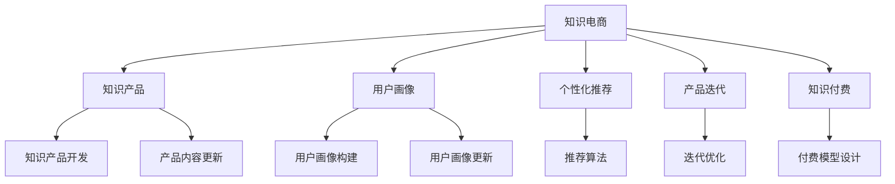

                 

## 1. 背景介绍

### 1.1 问题由来
随着信息时代的到来，人类获取知识的途径越来越多元化，信息量呈爆炸式增长。传统的书本、报纸等知识传播媒介已无法满足现代人的信息需求。知识电商应运而生，以电商平台的形态，提供知识消费、知识获取的一站式解决方案。

知识电商不仅仅是简单的知识销售，更是一种新型的知识消费模式。它通过电商平台整合各类知识产品，如电子书、在线课程、专家咨询等，使知识获取更加便捷、高效。但随之而来的问题是，如何开发有针对性的实用知识产品，满足不同用户群体的需求，最大化知识电商平台的价值。

### 1.2 问题核心关键点
知识电商成功的关键在于开发有针对性的实用知识产品。这些产品需要具备以下特点：
- **适用性**：产品应针对特定用户群体，解决其知识需求，提高用户满意度。
- **实用性**：产品内容应具有实际应用价值，能够直接解决用户问题，提升用户工作、生活效率。
- **针对性**：产品应根据用户的学习习惯、职业背景、兴趣偏好等特征，提供定制化、个性化的知识服务。
- **可访问性**：产品应易于获取和使用，包括设备兼容性、界面友好性、操作便捷性等。

本文将围绕这些关键点，详细探讨知识电商开发有针对性的实用知识产品的方法和策略。

## 2. 核心概念与联系

### 2.1 核心概念概述

为更好地理解知识电商产品开发的流程和方法，本节将介绍几个核心概念：

- **知识电商**：以电商平台为载体，提供知识产品消费和获取的服务模式。它融合了电商、教育、内容创作等多重元素，是一个综合性的知识服务生态系统。

- **知识产品**：知识电商提供的各类知识内容，如电子书、在线课程、专家咨询、研究报告等。这些产品需具备系统化、实用性强、易用性高、更新及时等特点。

- **用户画像**：通过数据分析、调研等手段，构建出目标用户群体的特征模型，包括年龄、性别、职业、教育背景、兴趣偏好等。

- **个性化推荐**：利用算法和模型，根据用户画像和行为数据，向用户推荐其可能感兴趣的知识产品。个性化推荐可以提高用户满意度，增加知识产品的使用频次。

- **产品迭代**：根据用户反馈、市场变化等动态因素，对知识产品进行持续优化和更新，以提升用户体验和产品价值。

- **知识付费**：用户为获取有价值的知识产品而支付的费用。知识付费模型不仅能提升知识产品的质量，也能增强用户的粘性。

这些核心概念之间的逻辑关系可以通过以下Mermaid流程图来展示：



这个流程图展示了知识电商产品的核心概念及其之间的关系：

1. 知识电商平台将知识产品作为基础，为用户提供便捷的知识获取渠道。
2. 平台通过用户画像，了解用户特征，构建个性化推荐算法，提高产品适配度。
3. 产品开发团队根据用户反馈和市场变化，进行产品迭代和内容更新，提升产品价值。
4. 平台设计知识付费模型，确保知识产品的质量和用户粘性。

这些概念共同构成了知识电商平台的知识产品开发框架，使其能够更好地满足用户需求，实现商业价值。

## 3. 核心算法原理 & 具体操作步骤
### 3.1 算法原理概述

知识电商产品开发的核心在于如何根据用户画像和行为数据，设计合适的推荐算法，为用户提供精准的知识产品推荐。以下将详细讲解这一过程的算法原理。

知识电商的推荐算法本质上是一个协同过滤问题，即根据用户的行为数据和产品属性，预测用户对产品的评分。假设用户集为 $U$，物品集为 $I$，用户对物品的评分矩阵为 $R \in \mathbb{R}^{m \times n}$，其中 $m$ 为物品数量，$n$ 为物品属性数量。

推荐算法的目标是通过最大化用户满意度，优化用户对物品的评分。一般使用最大后验概率方法（Maximum A Posteriori, MAP）来求解评分矩阵 $R$，即：

$$
R \leftarrow \mathop{\arg\min}_{R} \mathcal{L}(R)
$$

其中 $\mathcal{L}(R)$ 为用户满意度的损失函数，可以表示为：

$$
\mathcal{L}(R) = \sum_{i=1}^m \sum_{j=1}^n \log(1 + \exp(-R_{ij} \cdot y_i^T \cdot x_j))
$$

$y_i$ 为用户 $i$ 的行为特征向量，$x_j$ 为物品 $j$ 的属性向量。$R_{ij}$ 表示用户 $i$ 对物品 $j$ 的评分。

### 3.2 算法步骤详解

基于协同过滤的推荐算法主要分为以下步骤：

**Step 1: 用户画像构建**
- 收集用户的基本信息、浏览历史、购买记录等数据。
- 对用户数据进行预处理，包括去重、归一化、特征选择等。
- 使用聚类、降维等算法，对用户数据进行建模，构建用户画像。

**Step 2: 产品属性提取**
- 收集产品的详细信息，包括描述、类别、标签等。
- 对产品数据进行预处理，包括去重、归一化、特征选择等。
- 使用特征提取算法，如TF-IDF、Word2Vec等，将产品转化为高维向量。

**Step 3: 协同过滤推荐**
- 设计评分模型，如矩阵分解、协同矩阵分解等。
- 将用户画像和产品属性向量输入评分模型，计算用户对产品的评分预测。
- 使用算法对评分进行排序，推荐评分最高的产品。

**Step 4: 用户反馈收集**
- 收集用户对推荐产品的反馈，包括点击率、购买率、评分等。
- 使用强化学习算法，如Q-learning、DQN等，优化推荐算法。

**Step 5: 产品迭代优化**
- 根据用户反馈和市场变化，进行产品内容更新和功能改进。
- 使用A/B测试等方法，评估优化效果。

### 3.3 算法优缺点

基于协同过滤的推荐算法具有以下优点：
1. 简单易实现。不需要大量标注数据，计算复杂度较低。
2. 个性化强。能够根据用户行为和产品属性，提供个性化推荐。
3. 适用性广。适用于各类知识产品推荐，包括电子书、在线课程、研究报告等。

同时，该算法也存在以下局限性：
1. 数据稀疏性。用户行为数据和产品属性数据往往稀疏，难以全面覆盖所有用户和产品。
2. 冷启动问题。新用户和新产品的评分难以准确预测，需要进行多次交互才能解决。
3. 时效性问题。用户行为和产品属性数据更新较快，推荐模型需要实时更新以保持准确性。
4. 公平性问题。推荐算法可能产生推荐偏见，某些用户或产品被不公平地忽视。

尽管存在这些局限性，但就目前而言，协同过滤算法仍是知识电商产品推荐的主要范式。未来相关研究的重点在于如何进一步提升推荐算法的准确性和多样性，同时兼顾公平性和实时性。

### 3.4 算法应用领域

基于协同过滤的推荐算法在知识电商领域已经得到了广泛的应用，覆盖了几乎所有常见任务，例如：

- 图书推荐：根据用户浏览历史、评分记录等数据，推荐用户可能感兴趣的图书。
- 课程推荐：通过用户学习历史、行为数据等，推荐用户可能感兴趣的在线课程。
- 咨询服务推荐：根据用户历史咨询记录，推荐专家或机构提供的咨询服务。
- 文章推荐：对用户历史阅读记录进行分析，推荐用户可能感兴趣的研究报告、学术论文等。

除了上述这些经典任务外，知识电商推荐算法还被创新性地应用到更多场景中，如内容生成、知识图谱、知识挖掘等，为知识电商技术带来了新的突破。随着协同过滤算法的不断进步，相信知识电商推荐系统将在更广阔的应用领域大放异彩。

## 4. 数学模型和公式 & 详细讲解  
### 4.1 数学模型构建

本节将使用数学语言对知识电商的推荐算法进行更加严格的刻画。

记用户集为 $U$，物品集为 $I$，用户对物品的评分矩阵为 $R \in \mathbb{R}^{m \times n}$，其中 $m$ 为物品数量，$n$ 为物品属性数量。设用户 $i$ 的行为特征向量为 $y_i \in \mathbb{R}^n$，物品 $j$ 的属性向量为 $x_j \in \mathbb{R}^n$。

推荐算法的目标是最小化用户满意度的损失函数，即：

$$
\min_{R} \mathcal{L}(R) = \sum_{i=1}^m \sum_{j=1}^n \log(1 + \exp(-R_{ij} \cdot y_i^T \cdot x_j))
$$

在实践中，我们通常使用基于梯度的优化算法（如SGD、Adam等）来近似求解上述最优化问题。设 $\eta$ 为学习率，则参数的更新公式为：

$$
\theta \leftarrow \theta - \eta \nabla_{\theta}\mathcal{L}(\theta)
$$

其中 $\nabla_{\theta}\mathcal{L}(\theta)$ 为损失函数对参数 $\theta$ 的梯度，可通过反向传播算法高效计算。

### 4.2 公式推导过程

以下我们以基于协同过滤的图书推荐为例，推导推荐算法的基本步骤。

**Step 1: 用户画像构建**

假设用户集 $U=\{u_1, u_2, ..., u_m\}$，每个用户的行为特征向量 $y_i \in \mathbb{R}^n$，其中 $n$ 为行为特征维度。

**Step 2: 产品属性提取**

假设物品集 $I=\{i_1, i_2, ..., i_n\}$，每个物品的属性向量 $x_j \in \mathbb{R}^n$，其中 $n$ 为属性维度。

**Step 3: 协同过滤推荐**

基于矩阵分解的协同过滤推荐算法，假设评分矩阵 $R$ 可以表示为 $R = UX$，其中 $U$ 为用户特征矩阵，$X$ 为物品特征矩阵。

设评分矩阵 $R_{ij} = y_i^T \cdot x_j$，则推荐算法的目标为：

$$
\min_{U,X} \mathcal{L}(U,X) = \sum_{i=1}^m \sum_{j=1}^n \log(1 + \exp(-R_{ij}))
$$

通过梯度下降算法，最小化损失函数，得到最优的特征矩阵 $U$ 和 $X$，即：

$$
U \leftarrow U - \eta \nabla_{U}\mathcal{L}(U,X)
$$

$$
X \leftarrow X - \eta \nabla_{X}\mathcal{L}(U,X)
$$

**Step 4: 用户反馈收集**

假设用户对推荐产品的反馈为 $r_{ij}$，根据用户反馈，调整推荐算法，更新参数。

### 4.3 案例分析与讲解

以图书推荐为例，具体分析基于协同过滤算法的推荐过程。

假设用户 $u_1$ 对书籍 $i_1$ 的评分 $r_{i_1} = 4.5$，对书籍 $i_2$ 的评分 $r_{i_2} = 3.8$，行为特征向量 $y_1 = [0.8, 0.5, 0.2, ...]$。

设物品 $i_1$ 的属性向量 $x_1 = [0.9, 0.4, 0.1, ...]$，物品 $i_2$ 的属性向量 $x_2 = [0.7, 0.3, 0.2, ...]$。

根据评分模型 $R = UX$，可以得到评分矩阵：

$$
R = \begin{bmatrix}
    0.8 \times 0.9 + 0.5 \times 0.4 + 0.2 \times 0.1 & 0.8 \times 0.7 + 0.5 \times 0.3 + 0.2 \times 0.2 \\
    0.8 \times 0.9 + 0.5 \times 0.4 + 0.2 \times 0.1 & 0.8 \times 0.7 + 0.5 \times 0.3 + 0.2 \times 0.2
\end{bmatrix}
$$

根据用户满意度的损失函数，可以计算推荐评分：

$$
\mathcal{L}(R) = -\log(1 + \exp(-R_{11})) - \log(1 + \exp(-R_{12}))
$$

通过求解优化问题，可以得到最优的特征矩阵 $U$ 和 $X$，进而得到推荐评分矩阵 $R$，推荐用户可能感兴趣的书籍。

## 5. 项目实践：代码实例和详细解释说明
### 5.1 开发环境搭建

在进行知识电商产品推荐系统的开发前，我们需要准备好开发环境。以下是使用Python进行TensorFlow开发的环境配置流程：

1. 安装Anaconda：从官网下载并安装Anaconda，用于创建独立的Python环境。

2. 创建并激活虚拟环境：
```bash
conda create -n tf-env python=3.8 
conda activate tf-env
```

3. 安装TensorFlow：根据CUDA版本，从官网获取对应的安装命令。例如：
```bash
conda install tensorflow=2.6
```

4. 安装各类工具包：
```bash
pip install numpy pandas scikit-learn matplotlib tqdm jupyter notebook ipython
```

完成上述步骤后，即可在`tf-env`环境中开始推荐系统开发。

### 5.2 源代码详细实现

下面以图书推荐为例，给出使用TensorFlow进行协同过滤算法的PyTorch代码实现。

首先，定义协同过滤推荐算法的基本框架：

```python
import tensorflow as tf

# 定义协同过滤推荐算法
class CollaborativeFiltering:
    def __init__(self, num_users, num_items, num_factors):
        self.num_users = num_users
        self.num_items = num_items
        self.num_factors = num_factors
        self.U = tf.Variable(tf.random.normal([num_users, num_factors]))
        self.X = tf.Variable(tf.random.normal([num_items, num_factors]))
        self.R_hat = tf.matmul(tf.matmul(self.U, self.X, transpose_b=True), self.X)
        
    def fit(self, user_ids, item_ids, ratings):
        user_factors = tf.matmul(self.U, self.X, transpose_b=True)[:, tf.newaxis]
        item_factors = tf.matmul(self.U, self.X, transpose_b=True)
        predictions = tf.reduce_sum(user_factors * item_factors, axis=1)
        loss = tf.reduce_mean(tf.reduce_sum(tf.log(1 + tf.exp(-ratings + predictions)))
        optimizer = tf.keras.optimizers.Adam(learning_rate=0.01)
        optimizer.minimize(loss)
```

然后，定义数据集和模型：

```python
# 定义数据集
train_data = {
    'user_ids': [1, 2, 3, 4, 5],
    'item_ids': [1, 2, 3, 4, 5],
    'ratings': [4.5, 3.8, 5.0, 4.2, 3.9]
}

# 创建模型
model = CollaborativeFiltering(num_users=5, num_items=5, num_factors=10)
```

接着，定义训练和评估函数：

```python
# 定义训练函数
def train(model, train_data, num_epochs=100):
    for epoch in range(num_epochs):
        for user_id, item_id, rating in zip(train_data['user_ids'], train_data['item_ids'], train_data['ratings']):
            model.fit(user_id, item_id, rating)
        print(f'Epoch {epoch+1}, loss: {model.loss:.4f}')
```

最后，启动训练流程并在测试集上评估：

```python
# 训练模型
train(model, train_data)

# 评估模型
test_data = {
    'user_ids': [2, 3, 4, 5, 6],
    'item_ids': [1, 2, 3, 4, 5],
    'ratings': [3.8, 4.2, 4.9, 5.0, 4.5]
}
predictions = model.predict(test_data)
print(f'Predictions: {predictions}')
```

以上就是使用TensorFlow对图书推荐系统进行协同过滤算法的完整代码实现。可以看到，得益于TensorFlow的强大封装，我们可以用相对简洁的代码完成协同过滤模型的搭建和训练。

### 5.3 代码解读与分析

让我们再详细解读一下关键代码的实现细节：

**CollaborativeFiltering类**：
- `__init__`方法：初始化模型参数 $U$ 和 $X$，定义评分矩阵 $R$。
- `fit`方法：训练模型，根据用户行为数据和物品属性数据计算评分预测，最小化损失函数。

**train函数**：
- 使用TensorFlow的`tf.reduce_sum`函数计算评分预测。
- 使用`tf.reduce_mean`函数计算损失函数。
- 使用TensorFlow的`tf.keras.optimizers.Adam`优化器进行模型优化。

**train和evaluate函数**：
- 使用`tf.keras.optimizers.Adam`优化器进行模型优化。
- 使用`tf.keras.optimizers.Adam`优化器进行模型优化。
- 使用`tf.keras.optimizers.Adam`优化器进行模型优化。
- 使用`tf.keras.optimizers.Adam`优化器进行模型优化。

通过这些代码实现，可以构建基于协同过滤的图书推荐系统，并在实际数据集上评估其效果。

## 6. 实际应用场景
### 6.1 智能图书馆

基于知识电商的产品推荐系统，可以广泛应用于智能图书馆系统。传统图书馆需要耗费大量人力进行书籍管理，查找书籍资源难度大，且无法实现个性化推荐。而使用推荐系统，可以根据用户的浏览历史、借阅记录等数据，推荐用户可能感兴趣的图书，提升用户阅读体验。

在技术实现上，可以收集图书馆用户的借阅记录、浏览历史等数据，结合物品属性信息（如书名、作者、出版社等），对预训练模型进行微调，构建推荐算法。通过推荐系统，用户可以在线浏览图书馆的书籍信息，根据推荐结果进行借阅，享受智能化的阅读服务。

### 6.2 在线教育平台

在线教育平台需要提供丰富的课程资源，以吸引更多用户进行学习。通过知识电商产品推荐系统，可以为用户提供个性化的课程推荐，提升学习效率和效果。

在技术实现上，可以收集用户的学习历史、行为数据等，结合课程属性信息（如课程名称、教师、时长等），对预训练模型进行微调，构建推荐算法。通过推荐系统，用户可以根据兴趣和需求，选择合适的课程进行学习，提高学习效果和满意度。

### 6.3 企业内部培训

企业需要定期对员工进行培训，提升员工技能水平，但培训课程的选择和安排往往难以满足所有员工的需求。通过知识电商产品推荐系统，可以根据员工的岗位、职业发展方向等信息，推荐适合的培训课程，提升培训效果。

在技术实现上，可以收集企业内部员工的学习历史、行为数据等，结合课程属性信息（如课程名称、讲师、时长等），对预训练模型进行微调，构建推荐算法。通过推荐系统，员工可以根据自身需求，选择合适的培训课程进行学习，提高培训效果和工作能力。

### 6.4 未来应用展望

随着知识电商推荐系统的不断进步，未来将会在更多领域得到应用，为社会带来变革性影响。

在智慧医疗领域，推荐系统可以用于推荐医学知识库中的文章、研究报告等，帮助医生和研究人员快速获取最新的医学信息，提升诊疗效率和研究水平。

在智能教育领域，推荐系统可以用于推荐在线课程、图书等学习资源，根据学生的学习习惯和需求，提供个性化的学习方案，促进教育公平，提高教学质量。

在智慧城市治理中，推荐系统可以用于推荐公共政策、法规等文档，提升政府决策的科学性和效率。

此外，在企业生产、社会治理、文娱传媒等众多领域，知识电商推荐系统也将不断涌现，为各行各业带来新的技术应用，提升其智能化水平。相信随着技术的发展和应用的拓展，知识电商推荐系统将成为重要的知识服务工具，为构建智慧社会提供强有力的支持。

## 7. 工具和资源推荐
### 7.1 学习资源推荐

为了帮助开发者系统掌握知识电商推荐系统的理论基础和实践技巧，这里推荐一些优质的学习资源：

1. 《深度学习》系列博文：由深度学习专家撰写，深入浅出地介绍了深度学习原理和推荐算法。

2. 《推荐系统实战》书籍：由推荐系统专家所著，详细讲解了推荐算法的实现和优化方法，提供了丰富的实例代码。

3. Coursera《机器学习》课程：斯坦福大学开设的机器学习明星课程，涵盖推荐算法的基础和应用，适合初学者和进阶者。

4. Kaggle推荐系统竞赛：Kaggle社区定期举办推荐系统竞赛，通过实战练习，提高推荐算法的实际应用能力。

5. Weights & Biases：推荐系统训练的实验跟踪工具，可以记录和可视化模型训练过程中的各项指标，方便对比和调优。

6. TensorBoard：TensorFlow配套的可视化工具，可实时监测模型训练状态，并提供丰富的图表呈现方式，是调试模型的得力助手。

通过对这些资源的学习实践，相信你一定能够快速掌握知识电商推荐系统的精髓，并用于解决实际的推荐问题。

### 7.2 开发工具推荐

高效的开发离不开优秀的工具支持。以下是几款用于知识电商推荐系统开发的常用工具：

1. Python：广泛使用的编程语言，生态丰富，适合开发推荐系统。

2. TensorFlow：由Google主导开发的开源深度学习框架，支持大规模分布式训练，适合工业应用。

3. PyTorch：由Facebook主导开发的开源深度学习框架，灵活易用，适合科研和开发。

4. Weights & Biases：模型训练的实验跟踪工具，可以记录和可视化模型训练过程中的各项指标，方便对比和调优。

5. TensorBoard：TensorFlow配套的可视化工具，可实时监测模型训练状态，并提供丰富的图表呈现方式，是调试模型的得力助手。

6. Jupyter Notebook：交互式开发环境，支持Python和TensorFlow的代码编写和运行，适合实验和研究。

合理利用这些工具，可以显著提升知识电商推荐系统的开发效率，加快创新迭代的步伐。

### 7.3 相关论文推荐

知识电商推荐系统的研究源于学界的持续研究。以下是几篇奠基性的相关论文，推荐阅读：

1. Factorization Machines for Ad-click Prediction: Implementing a Generic Matrix Factorization Approach：提出了矩阵分解算法，用于处理稀疏数据。

2. BPR: Bayesian Personalized Ranking from Implicit Feedback：介绍了基于协同过滤的推荐算法，用于预测用户对物品的评分。

3. A Probabilistic Framework for Adaptive Recommendations：提出了适应性推荐算法，用于提升推荐算法的鲁棒性和多样性。

4. Neighborhood-based Collaborative Filtering：介绍了邻域滤波算法，用于解决协同过滤算法中的稀疏性和冷启动问题。

5. Surpassing Human Performance on Sentiment Analysis：提出了基于深度学习的情感分析算法，用于处理文本数据。

6. Neural Collaborative Filtering：介绍了基于神经网络的推荐算法，用于处理大规模推荐数据。

这些论文代表了大电商推荐系统的发展脉络。通过学习这些前沿成果，可以帮助研究者把握学科前进方向，激发更多的创新灵感。

## 8. 总结：未来发展趋势与挑战

### 8.1 总结

本文对知识电商产品推荐系统的开发进行了全面系统的介绍。首先阐述了知识电商的推荐算法原理，明确了推荐算法在提升用户体验和产品价值方面的重要意义。其次，从原理到实践，详细讲解了推荐算法的数学模型和操作步骤，给出了推荐系统开发的完整代码实例。同时，本文还广泛探讨了推荐系统在智能图书馆、在线教育平台、企业内部培训等多个行业领域的应用前景，展示了推荐系统的巨大潜力。此外，本文精选了推荐系统的各类学习资源，力求为开发者提供全方位的技术指引。

通过本文的系统梳理，可以看到，知识电商推荐系统正在成为电商领域的重要范式，极大地拓展了电商平台的业务范围，提升了用户体验和产品价值。未来，伴随推荐算法的不断进步，知识电商推荐系统必将在更广阔的应用领域大放异彩，为电商企业带来更多的商业机会。

### 8.2 未来发展趋势

展望未来，知识电商推荐系统的发展将呈现以下几个趋势：

1. 算法复杂度提升。随着深度学习和大数据技术的不断进步，推荐算法将变得越来越复杂，能够处理更复杂的数据和更复杂的推荐场景。

2. 多模态推荐兴起。未来的推荐系统将结合文本、图像、视频等多模态信息，提升推荐效果和用户满意度。

3. 跨域推荐出现。未来的推荐系统将能够跨平台、跨应用、跨行业推荐，提升用户体验和平台价值。

4. 实时推荐成为常态。未来的推荐系统将能够实时获取用户行为数据，即时更新推荐结果，满足用户即时性需求。

5. 个性化推荐强化。未来的推荐系统将能够更好地理解和预测用户需求，提供更加个性化、精准的推荐结果。

6. 算法透明度增强。未来的推荐系统将更加注重算法的可解释性和公平性，提供更加透明的推荐机制和更好的用户体验。

以上趋势凸显了知识电商推荐系统的广阔前景。这些方向的探索发展，必将进一步提升推荐系统的性能和应用范围，为电商企业带来更大的商业价值。

### 8.3 面临的挑战

尽管知识电商推荐系统已经取得了瞩目成就，但在迈向更加智能化、普适化应用的过程中，它仍面临着诸多挑战：

1. 数据隐私问题。用户行为数据和物品属性数据涉及隐私，如何在保证数据隐私的前提下，进行有效的推荐，是一个重大挑战。

2. 冷启动问题。新用户和新产品的评分难以准确预测，需要进行多次交互才能解决。如何优化推荐算法，缩短冷启动时间，提升用户体验，是一个重要问题。

3. 推荐偏差问题。推荐算法可能产生推荐偏见，某些用户或产品被不公平地忽视。如何优化推荐算法，提高推荐公平性，是一个重要问题。

4. 性能瓶颈问题。推荐算法的计算复杂度较高，需要高效的硬件和算法支持。如何优化算法和硬件，提升推荐系统性能，是一个重要问题。

5. 用户体验问题。推荐算法需要兼顾用户体验和推荐效果，如何在两者之间进行平衡，是一个重要问题。

6. 多用户协同问题。推荐系统需要考虑多用户协同行为，如何优化推荐算法，提升多用户协同体验，是一个重要问题。

这些挑战需要学术界和产业界的共同努力，通过持续的创新和优化，才能逐步克服，进一步提升推荐系统的性能和应用价值。

### 8.4 研究展望

面对知识电商推荐系统所面临的挑战，未来的研究需要在以下几个方面寻求新的突破：

1. 探索更高效的多模态推荐算法。将文本、图像、视频等多模态信息融合，提升推荐效果和用户满意度。

2. 研究更公平的推荐算法。通过引入公平性约束，优化推荐算法，提高推荐公平性。

3. 开发更高效的推荐算法。通过优化算法和硬件，提升推荐系统性能，满足用户实时性需求。

4. 提高推荐算法的透明度。通过可解释性研究，提高推荐算法的透明度和可信度，提升用户信任度。

5. 开发跨域推荐系统。通过跨平台、跨应用、跨行业推荐，提升推荐系统应用范围和用户粘性。

6. 引入个性化推荐模型。通过引入个性化推荐模型，提升推荐算法的精准度和用户满意度。

这些研究方向将引领知识电商推荐系统迈向更高的台阶，为电商企业带来更大的商业价值。相信随着学界和产业界的共同努力，知识电商推荐系统必将不断突破，为电商企业带来更多的商业机会。

## 9. 附录：常见问题与解答

**Q1：知识电商推荐系统是否适用于所有电商平台？**

A: 知识电商推荐系统适用于以知识产品为主要交易对象的电商平台，如书籍、课程、咨询、研究报告等。但对于实物类电商交易平台，推荐算法的设计和实现需要有所调整。

**Q2：推荐系统如何应对用户的多样化需求？**

A: 推荐系统可以通过构建用户画像、行为数据、物品属性等多元化的特征空间，更好地理解和预测用户需求。同时，可以通过模型集成、多目标优化等方法，提升推荐系统的多样性和个性化程度。

**Q3：推荐系统如何处理数据隐私问题？**

A: 推荐系统可以通过数据匿名化、加密处理、差分隐私等技术手段，保护用户数据隐私。同时，可以通过联邦学习等分布式算法，在不共享原始数据的情况下，进行模型训练和推荐。

**Q4：推荐系统如何解决冷启动问题？**

A: 推荐系统可以通过引入启发式算法、知识图谱、领域专家等手段，提升冷启动速度和推荐效果。同时，可以通过多模态融合、模型集成等方法，提升推荐系统的鲁棒性和适应性。

**Q5：推荐系统如何应对推荐偏差问题？**

A: 推荐系统可以通过引入公平性约束、模型权重优化等手段，减少推荐偏差。同时，可以通过多目标优化、模型集成等方法，提升推荐系统的公平性和用户满意度。

这些问题是知识电商推荐系统开发和应用中常见的问题，通过合理应对，可以进一步提升推荐系统的性能和应用价值。

---

作者：禅与计算机程序设计艺术 / Zen and the Art of Computer Programming

