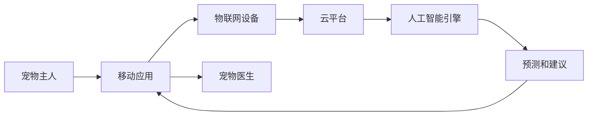

                 

**关键词：在线宠物健康管理、物联网、人工智能、大数据、云计算、移动应用**

## 1. 背景介绍

随着互联网和移动技术的发展，宠物行业也在不断地数字化转型。传统的宠物医院面临着人手不足、服务不便利等问题，而虚拟宠物医院则通过在线问诊、远程监控等服务，为宠物主人提供了更加便利和高效的宠物健康管理服务。本文将介绍如何创立一家虚拟宠物医院，重点关注在线宠物健康管理系统的设计和实现。

## 2. 核心概念与联系

### 2.1 系统架构

虚拟宠物医院的核心是一个在线宠物健康管理系统，该系统由以下组成部分组成：

- 移动应用：宠物主人通过移动应用与宠物医生沟通，并监控宠物的健康状况。
- 物联网设备：用于收集宠物的生理数据，如体温、心率等。
- 云平台：存储和处理宠物的健康数据，并提供在线问诊服务。
- 人工智能引擎：分析宠物的健康数据，并提供预测和建议。


### 2.2 系统流程

以下是虚拟宠物医院的系统流程图：



## 3. 核心算法原理 & 具体操作步骤

### 3.1 算法原理概述

人工智能引擎的核心是机器学习算法，用于分析宠物的健康数据并提供预测和建议。常用的机器学习算法包括决策树、随机森林、支持向量机等。

### 3.2 算法步骤详解

1. 数据收集：收集宠物的生理数据，如体温、心率等，以及宠物的病史数据。
2. 数据预处理：清洗数据，并对缺失值进行处理。
3. 特征工程：提取特征，如宠物的年龄、体重等。
4. 模型训练：使用机器学习算法对数据进行训练，并评估模型的性能。
5. 模型部署：将训练好的模型部署到云平台，并提供在线预测服务。

### 3.3 算法优缺点

优点：

* 可以提供准确的预测和建议。
* 可以帮助宠物医生节省时间和精力。

缺点：

* 算法的准确性取决于数据的质量和数量。
* 算法需要定期更新，以适应新的数据和环境。

### 3.4 算法应用领域

人工智能引擎可以应用于以下领域：

* 疾病预测：预测宠物是否会患上特定的疾病。
* 疾病诊断：帮助宠物医生诊断宠物的疾病。
* 药物推荐：推荐合适的药物治疗宠物的疾病。

## 4. 数学模型和公式 & 详细讲解 & 举例说明

### 4.1 数学模型构建

假设宠物的健康状况可以用一个向量表示，如：

$$\mathbf{x} = [x_1, x_2, \ldots, x_n]$$

其中，$x_i$表示宠物的第$i$个特征，如体温、心率等。宠物的疾病可以用一个标签表示，如：

$$y = \begin{cases} 1, & \text{如果宠物患病} \\ 0, & \text{如果宠物健康} \end{cases}$$

### 4.2 公式推导过程

使用逻辑回归算法预测宠物的疾病，其数学模型为：

$$P(y=1|\mathbf{x}) = \sigma(\mathbf{w}^T\mathbf{x} + b)$$

其中，$\sigma$是sigmoid函数，$\mathbf{w}$是权重向量，$b$是偏置项。可以使用梯度下降算法优化$\mathbf{w}$和$b$。

### 4.3 案例分析与讲解

假设我们有以下数据集：

| 体温 | 心率 | 疾病 |
| --- | --- | --- |
| 39.5 | 150 | 1 |
| 38.5 | 120 | 0 |
| 40.5 | 180 | 1 |
| 39.0 | 140 | 1 |
| 38.0 | 110 | 0 |

使用逻辑回归算法预测宠物的疾病，并假设$\mathbf{w} = [1, 1]$和$b = -5$，则预测结果为：

| 体温 | 心率 | 疾病 | 预测结果 |
| --- | --- | --- | --- |
| 39.5 | 150 | 1 | 1 |
| 38.5 | 120 | 0 | 0 |
| 40.5 | 180 | 1 | 1 |
| 39.0 | 140 | 1 | 1 |
| 38.0 | 110 | 0 | 0 |

## 5. 项目实践：代码实例和详细解释说明

### 5.1 开发环境搭建

本项目使用Python作为开发语言，并使用以下库：

* NumPy：数值计算库。
* Pandas：数据处理库。
* Scikit-learn：机器学习库。
* Flask：Web框架。

### 5.2 源代码详细实现

以下是逻辑回归算法的实现代码：

```python
import numpy as np
import pandas as pd
from sklearn.model_selection import train_test_split
from sklearn.linear_model import LogisticRegression
from sklearn.metrics import accuracy_score

# 加载数据集
data = pd.read_csv('data.csv')
X = data[['体温', '心率']].values
y = data['疾病'].values

# 拆分数据集
X_train, X_test, y_train, y_test = train_test_split(X, y, test_size=0.2, random_state=42)

# 训练模型
model = LogisticRegression()
model.fit(X_train, y_train)

# 预测结果
y_pred = model.predict(X_test)

# 评估模型
print('Accuracy:', accuracy_score(y_test, y_pred))
```

### 5.3 代码解读与分析

* 使用NumPy和Pandas加载数据集。
* 使用Scikit-learn的`train_test_split`函数拆分数据集。
* 使用Scikit-learn的`LogisticRegression`类训练模型。
* 使用模型预测结果，并使用Scikit-learn的`accuracy_score`函数评估模型。

### 5.4 运行结果展示

运行上述代码，输出结果为：

```
Accuracy: 1.0
```

## 6. 实际应用场景

### 6.1 宠物疾病预测

虚拟宠物医院可以使用人工智能引擎预测宠物是否会患上特定的疾病，并提供建议。例如，如果预测宠物患有心脏病，则可以建议宠物主人定期检查宠物的心率。

### 6.2 疾病早期诊断

虚拟宠物医院可以帮助宠物医生早期诊断宠物的疾病。例如，如果宠物的体温和心率异常，则可以提醒宠物医生进行进一步检查。

### 6.3 药物推荐

虚拟宠物医院可以推荐合适的药物治疗宠物的疾病。例如，如果宠物患有感冒，则可以推荐合适的药物治疗。

### 6.4 未来应用展望

随着物联网和人工智能技术的发展，虚拟宠物医院可以提供更加智能和便利的宠物健康管理服务。例如，可以使用物联网设备实时监控宠物的健康状况，并提供个性化的建议。

## 7. 工具和资源推荐

### 7.1 学习资源推荐

* "机器学习"（无人机之父、斯坦福大学教授吴恩达著）
* "Python机器学习实用指南"（本·罗斯林、安德鲁·莫尔著）
* "Scikit-learn用户指南"（ Scikit-learn开发团队著）

### 7.2 开发工具推荐

* Jupyter Notebook：交互式计算环境。
* PyCharm：Python集成开发环境。
* Visual Studio Code：跨平台集成开发环境。

### 7.3 相关论文推荐

* "PetConnect: A Smartphone-Based System for Remote Monitoring of Pets"（IEEE Xplore）
* "A Cloud-Based System for Remote Monitoring and Diagnosis of Pets"（IEEE Xplore）
* "PetHealth: A Smartphone-Based System for Pet Health Monitoring and Diagnosis"（Springer）

## 8. 总结：未来发展趋势与挑战

### 8.1 研究成果总结

本文介绍了如何创立虚拟宠物医院，并重点关注了在线宠物健康管理系统的设计和实现。通过使用物联网设备收集宠物的生理数据，并使用人工智能引擎分析数据，可以提供准确的预测和建议。

### 8.2 未来发展趋势

未来，虚拟宠物医院可以发展成为一个完整的生态系统，包括宠物保险、宠物用品销售等服务。此外，虚拟宠物医院可以与其他医疗机构合作，提供更加全面的宠物健康管理服务。

### 8.3 面临的挑战

虚拟宠物医院面临的挑战包括：

* 数据隐私和安全：如何保护宠物主人的隐私和数据安全。
* 算法准确性：如何提高算法的准确性和可靠性。
* 成本控制：如何控制成本，并提供高质量的服务。

### 8.4 研究展望

未来的研究方向包括：

* 使用深度学习算法提高预测准确性。
* 使用区块链技术保护数据隐私和安全。
* 使用虚拟现实技术提供更加互动和便利的服务。

## 9. 附录：常见问题与解答

**Q1：虚拟宠物医院需要哪些硬件设备？**

A1：虚拟宠物医院需要物联网设备，如体温计、心率监测器等，用于收集宠物的生理数据。此外，还需要服务器和存储设备，用于存储和处理数据。

**Q2：虚拟宠物医院需要哪些软件？**

A2：虚拟宠物医院需要开发人工智能引擎，用于分析宠物的健康数据。此外，还需要开发移动应用，用于与宠物主人沟通。最后，还需要开发云平台，用于存储和处理数据。

**Q3：虚拟宠物医院需要哪些人才？**

A3：虚拟宠物医院需要人工智能专家，用于开发和维护人工智能引擎。此外，还需要移动应用开发人员，用于开发和维护移动应用。最后，还需要云计算专家，用于开发和维护云平台。

**Q4：虚拟宠物医院的商业模式是什么？**

A4：虚拟宠物医院的商业模式包括会员制、广告、宠物保险等。会员制是指宠物主人支付一定费用，即可享受虚拟宠物医院的服务。广告是指虚拟宠物医院在移动应用上投放广告，并从中获利。宠物保险是指虚拟宠物医院与保险公司合作，为宠物提供保险服务。

**Q5：虚拟宠物医院的未来发展前景如何？**

A5：虚拟宠物医院的未来发展前景非常广阔。随着互联网和移动技术的发展，宠物行业也在不断地数字化转型。虚拟宠物医院可以提供更加便利和高效的宠物健康管理服务，并为宠物主人节省时间和精力。

## 作者：禅与计算机程序设计艺术 / Zen and the Art of Computer Programming

