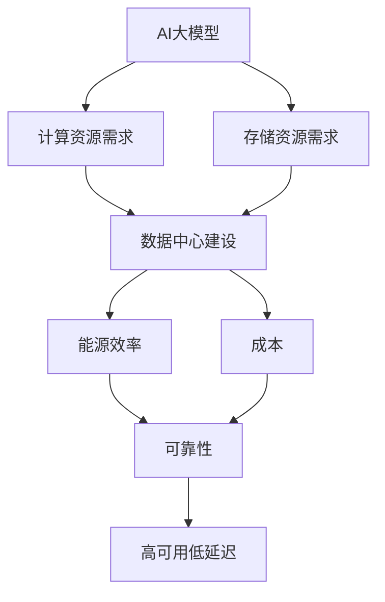

                 

**AI 大模型应用数据中心建设：数据中心产业发展**

**作者：禅与计算机程序设计艺术 / Zen and the Art of Computer Programming**

## 1. 背景介绍

随着人工智能（AI）技术的飞速发展，大模型（Large Language Models）已然成为AI领域的关键驱动力之一。然而，大模型的训练和部署需要大量的计算资源，这对数据中心的建设和运维提出了新的挑战。本文将深入探讨AI大模型应用数据中心建设的关键问题，并分析数据中心产业的发展趋势。

## 2. 核心概念与联系

### 2.1 AI大模型

AI大模型是指具有数十亿甚至数千亿参数的神经网络模型，能够理解、生成或翻译人类语言，并展示出类似人类的推理和创造能力。大模型的训练需要海量的数据和计算资源，通常需要数千个GPU节点甚至更多。

### 2.2 数据中心

数据中心是提供计算、存储、处理和分发信息的物理设施，是云计算和大数据应用的基础设施。数据中心的建设需要考虑能源效率、可靠性、可扩展性和成本等因素。

### 2.3 AI大模型与数据中心的联系

AI大模型的训练和部署需要强大的计算能力和存储能力，这对数据中心的建设提出了新的要求。数据中心需要提供足够的计算资源和存储资源，并保证高可用和低延迟。同时，数据中心还需要考虑能源效率和成本，以满足大模型训练和部署的需求。



## 3. 核心算法原理 & 具体操作步骤

### 3.1 算法原理概述

大模型的训练通常采用梯度下降法（Gradient Descent）及其变种，如Adam、RMSProp等。大模型的部署通常采用推理（Inference）算法，如beam search、top-k sampling等。

### 3.2 算法步骤详解

#### 3.2.1 梯度下降法

梯度下降法是一种迭代优化算法，其目标是最小化目标函数。在大模型训练中，目标函数通常是交叉熵损失函数。梯度下降法的步骤如下：

1. 初始化模型参数θ。
2. 计算当前参数θ下的损失函数L(θ)。
3. 计算损失函数L(θ)对参数θ的梯度∇L(θ)。
4. 更新参数θ：θ = θ - η∇L(θ)，其中η是学习率。
5. 重复步骤2-4，直到收敛。

#### 3.2.2 推理算法

推理算法的目标是生成最可能的输出序列。常用的推理算法包括beam search和top-k sampling。beam search维护一组候选序列，并选择最可能的序列作为输出。top-k sampling则选择前k个可能性最高的序列作为候选序列。

### 3.3 算法优缺点

梯度下降法及其变种是大模型训练的标准算法，具有收敛快、稳定性好的优点。然而，它们也存在收敛速度慢、易陷入局部最小值等缺点。推理算法则存在beam width选择困难、计算开销大等问题。

### 3.4 算法应用领域

大模型的训练和部署广泛应用于自然语言处理（NLP）、计算机视觉（CV）、生物信息学等领域。大模型的训练和部署需要强大的计算能力和存储能力，这对数据中心的建设提出了新的要求。

## 4. 数学模型和公式 & 详细讲解 & 举例说明

### 4.1 数学模型构建

大模型的数学模型通常是神经网络模型，可以表示为：

$$f(x; \theta) = \sigma(z) = \sigma(\sum_{i=1}^{n} w_i x_i + b)$$

其中，x是输入向量，θ是模型参数，σ是激活函数，w和b是权重和偏置项。

### 4.2 公式推导过程

大模型的训练目标是最小化交叉熵损失函数：

$$L(\theta) = -\sum_{i=1}^{n} y_i \log f(x_i; \theta)$$

其中，y是标签向量，n是样本数。梯度下降法的更新规则是：

$$\theta = \theta - \eta \nabla L(\theta)$$

其中，η是学习率，∇L(θ)是损失函数对参数θ的梯度。

### 4.3 案例分析与讲解

例如，假设我们要训练一个二分类模型，输入向量x是[1, 2, 3]，标签向量y是[1]。初始参数θ是[0, 0, 0]。激活函数σ是sigmoid函数。学习率η是0.1。损失函数L(θ)是交叉熵损失函数。我们可以使用梯度下降法更新参数θ，直到收敛。

## 5. 项目实践：代码实例和详细解释说明

### 5.1 开发环境搭建

大模型的训练和部署需要强大的计算能力和存储能力，因此需要搭建强大的开发环境。常用的开发环境包括NVIDIA DGX系统、Google Colab等。

### 5.2 源代码详细实现

大模型的训练和部署通常使用深度学习框架，如TensorFlow、PyTorch等。以下是使用PyTorch训练一个简单的二分类模型的示例代码：

```python
import torch
import torch.nn as nn
import torch.optim as optim

# 定义模型
class Net(nn.Module):
    def __init__(self):
        super(Net, self).__init__()
        self.fc1 = nn.Linear(3, 10)
        self.fc2 = nn.Linear(10, 2)

    def forward(self, x):
        x = torch.relu(self.fc1(x))
        x = self.fc2(x)
        return x

# 初始化模型、损失函数和优化器
model = Net()
criterion = nn.CrossEntropyLoss()
optimizer = optim.SGD(model.parameters(), lr=0.01)

# 训练模型
for epoch in range(100):
    optimizer.zero_grad()
    outputs = model(torch.tensor([[1, 2, 3]]))
    loss = criterion(outputs, torch.tensor([1]))
    loss.backward()
    optimizer.step()
```

### 5.3 代码解读与分析

上述代码定义了一个简单的二分类模型，使用ReLU激活函数和交叉熵损失函数。模型使用随机梯度下降（SGD）优化器训练，学习率为0.01。训练过程共进行100个epoch。

### 5.4 运行结果展示

训练完成后，模型的参数会收敛到最优解。我们可以使用模型预测新样本的标签，并计算准确率等指标来评估模型的性能。

## 6. 实际应用场景

### 6.1 当前应用

大模型的训练和部署已经广泛应用于各种场景，如语言模型、图像分类、生物信息学等。例如，Google的BERT模型已经广泛应用于自然语言处理任务，如文本分类、命名实体识别等。

### 6.2 未来应用展望

未来，大模型的训练和部署将会更加普及，并应用于更多的场景。例如，大模型将会应用于自动驾驶、医疗诊断等领域。此外，大模型的训练和部署也将会更加智能化，并结合边缘计算、云计算等技术，实现更高效的资源利用。

## 7. 工具和资源推荐

### 7.1 学习资源推荐

* 深度学习入门：[Deep Learning Specialization](https://www.coursera.org/specializations/deep-learning)
* 自然语言处理入门：[Natural Language Processing in TensorFlow](https://www.tensorflow.org/guide/keras/sequential_model)
* 计算机视觉入门：[Computer Vision with Python](https://www.datacamp.com/courses/computer-vision-with-python)

### 7.2 开发工具推荐

* 深度学习框架：[TensorFlow](https://www.tensorflow.org/), [PyTorch](https://pytorch.org/)
* 云计算平台：[Google Cloud](https://cloud.google.com/), [Amazon Web Services](https://aws.amazon.com/), [Microsoft Azure](https://azure.microsoft.com/)
* 数据中心建设工具：[OpenStack](https://www.openstack.org/), [VMware vSphere](https://www.vmware.com/products/vsphere.html)

### 7.3 相关论文推荐

* [Attention Is All You Need](https://arxiv.org/abs/1706.03762)
* [BERT: Pre-training of Deep Bidirectional Transformers for Language Understanding](https://arxiv.org/abs/1810.04805)
* [DALL-E: Generating Images from Textual Descriptions](https://arxiv.org/abs/2102.00247)

## 8. 总结：未来发展趋势与挑战

### 8.1 研究成果总结

本文介绍了AI大模型应用数据中心建设的关键问题，分析了数据中心产业的发展趋势。我们讨论了大模型的训练和部署需要强大的计算能力和存储能力，这对数据中心的建设提出了新的要求。我们还介绍了大模型的训练和部署的核心算法原理，并给出了代码实例和详细解释说明。

### 8.2 未来发展趋势

未来，大模型的训练和部署将会更加普及，并应用于更多的场景。数据中心建设也将会更加智能化，并结合边缘计算、云计算等技术，实现更高效的资源利用。此外，大模型的训练和部署也将会更加绿色化，并考虑能源效率和碳排放等因素。

### 8.3 面临的挑战

然而，大模型的训练和部署也面临着许多挑战。例如，大模型的训练需要大量的计算资源和存储资源，这对数据中心的建设提出了新的要求。此外，大模型的训练和部署也需要考虑模型泛化能力、数据隐私等问题。

### 8.4 研究展望

未来，我们需要开发更加智能化的大模型训练和部署算法，并结合边缘计算、云计算等技术，实现更高效的资源利用。我们也需要开发更加绿色化的大模型训练和部署技术，并考虑能源效率和碳排放等因素。此外，我们还需要开发更加安全化的大模型训练和部署技术，并考虑数据隐私等问题。

## 9. 附录：常见问题与解答

**Q1：大模型的训练需要多少计算资源？**

A1：大模型的训练需要大量的计算资源和存储资源。例如，训练一个具有数十亿参数的大模型需要数千个GPU节点甚至更多。

**Q2：大模型的部署需要多少计算资源？**

A2：大模型的部署需要足够的计算资源和存储资源，并保证高可用和低延迟。例如，部署一个具有数十亿参数的大模型需要数百个GPU节点甚至更多。

**Q3：大模型的训练和部署需要考虑哪些因素？**

A3：大模型的训练和部署需要考虑能源效率、可靠性、可扩展性和成本等因素。此外，大模型的训练和部署也需要考虑模型泛化能力、数据隐私等问题。

**Q4：未来大模型的训练和部署会朝哪些方向发展？**

A4：未来，大模型的训练和部署将会更加智能化，并结合边缘计算、云计算等技术，实现更高效的资源利用。大模型的训练和部署也将会更加绿色化，并考虑能源效率和碳排放等因素。此外，大模型的训练和部署也将会更加安全化，并考虑数据隐私等问题。

**Q5：如何评估大模型的性能？**

A5：评估大模型性能的指标包括准确率、召回率、F1分数等。此外，我们也需要考虑大模型的泛化能力、数据隐私等问题。

**Q6：如何提高大模型的泛化能力？**

A6：提高大模型泛化能力的方法包括数据增强、正则化、早停等。此外，我们也需要考虑数据集的质量和多样性等因素。

**Q7：如何保护大模型训练和部署的数据隐私？**

A7：保护大模型训练和部署数据隐私的方法包括差分隐私、联邦学习等。此外，我们也需要考虑数据加密、访问控制等因素。

**Q8：如何实现大模型训练和部署的能源效率？**

A8：实现大模型训练和部署能源效率的方法包括使用绿色能源、优化算法、使用能效更高的硬件等。此外，我们也需要考虑数据中心的能源管理和节能技术等因素。

**Q9：如何实现大模型训练和部署的可靠性？**

A9：实现大模型训练和部署可靠性的方法包括冗余设计、故障转移、自动故障恢复等。此外，我们也需要考虑数据中心的可靠性设计和管理等因素。

**Q10：如何实现大模型训练和部署的可扩展性？**

A10：实现大模型训练和部署可扩展性的方法包括使用分布式系统、水平扩展、弹性计算等。此外，我们也需要考虑数据中心的可扩展性设计和管理等因素。

**Q11：如何实现大模型训练和部署的成本效益？**

A11：实现大模型训练和部署成本效益的方法包括使用开源软件、使用云计算、优化算法等。此外，我们也需要考虑数据中心的成本管理和优化等因素。

**Q12：如何评估数据中心的性能？**

A12：评估数据中心性能的指标包括能源效率、可靠性、可扩展性、成本等。此外，我们也需要考虑数据中心的安全性、可管理性等因素。

**Q13：如何提高数据中心的能源效率？**

A13：提高数据中心能源效率的方法包括使用绿色能源、优化算法、使用能效更高的硬件等。此外，我们也需要考虑数据中心的能源管理和节能技术等因素。

**Q14：如何提高数据中心的可靠性？**

A14：提高数据中心可靠性的方法包括冗余设计、故障转移、自动故障恢复等。此外，我们也需要考虑数据中心的可靠性设计和管理等因素。

**Q15：如何提高数据中心的可扩展性？**

A15：提高数据中心可扩展性的方法包括使用分布式系统、水平扩展、弹性计算等。此外，我们也需要考虑数据中心的可扩展性设计和管理等因素。

**Q16：如何提高数据中心的成本效益？**

A16：提高数据中心成本效益的方法包括使用开源软件、使用云计算、优化算法等。此外，我们也需要考虑数据中心的成本管理和优化等因素。

**Q17：如何保护数据中心的安全性？**

A17：保护数据中心安全性的方法包括访问控制、加密、入侵检测等。此外，我们也需要考虑数据中心的物理安全和网络安全等因素。

**Q18：如何提高数据中心的可管理性？**

A18：提高数据中心可管理性的方法包括使用自动化工具、使用统一管理平台、优化运维流程等。此外，我们也需要考虑数据中心的运维管理和人员培训等因素。

**Q19：如何评估数据中心的碳排放？**

A19：评估数据中心碳排放的方法包括能源消耗统计、碳排放因子计算、碳排放量评估等。此外，我们也需要考虑数据中心的能源结构和碳排放管理等因素。

**Q20：如何降低数据中心的碳排放？**

A20：降低数据中心碳排放的方法包括使用绿色能源、优化算法、使用能效更高的硬件等。此外，我们也需要考虑数据中心的能源管理和碳排放管理等因素。

**Q21：如何评估数据中心的可持续发展？**

A21：评估数据中心可持续发展的指标包括能源效率、碳排放、可靠性、可扩展性、成本等。此外，我们也需要考虑数据中心的安全性、可管理性、环境影响等因素。

**Q22：如何实现数据中心的可持续发展？**

A22：实现数据中心可持续发展的方法包括使用绿色能源、优化算法、使用能效更高的硬件、优化运维流程等。此外，我们也需要考虑数据中心的能源管理、碳排放管理、环境管理等因素。

**Q23：如何评估数据中心的环境影响？**

A23：评估数据中心环境影响的指标包括能源消耗、碳排放、噪声污染、热污染等。此外，我们也需要考虑数据中心的选址、建筑材料、运维管理等因素。

**Q24：如何减轻数据中心的环境影响？**

A24：减轻数据中心环境影响的方法包括使用绿色能源、优化算法、使用能效更高的硬件、优化选址和建筑设计等。此外，我们也需要考虑数据中心的能源管理、碳排放管理、环境管理等因素。

**Q25：如何评估数据中心的经济可行性？**

A25：评估数据中心经济可行性的指标包括成本、收益、投资回报率、现金流等。此外，我们也需要考虑数据中心的选址、建筑设计、运维管理等因素。

**Q26：如何提高数据中心的经济可行性？**

A26：提高数据中心经济可行性的方法包括使用开源软件、使用云计算、优化算法、优化选址和建筑设计等。此外，我们也需要考虑数据中心的成本管理、收益管理、投资管理等因素。

**Q27：如何评估数据中心的技术可行性？**

A27：评估数据中心技术可行性的指标包括技术成熟度、技术风险、技术挑战等。此外，我们也需要考虑数据中心的选址、建筑设计、运维管理等因素。

**Q28：如何提高数据中心的技术可行性？**

A28：提高数据中心技术可行性的方法包括使用成熟的技术、降低技术风险、解决技术挑战等。此外，我们也需要考虑数据中心的技术选型、技术集成、技术管理等因素。

**Q29：如何评估数据中心的商业可行性？**

A29：评估数据中心商业可行性的指标包括市场需求、竞争优势、商业模式、盈利能力等。此外，我们也需要考虑数据中心的选址、建筑设计、运维管理等因素。

**Q30：如何提高数据中心的商业可行性？**

A30：提高数据中心商业可行性的方法包括开发新的商业模式、提高市场竞争力、优化商业运作等。此外，我们也需要考虑数据中心的商业选型、商业集成、商业管理等因素。

**Q31：如何评估数据中心的社会可行性？**

A31：评估数据中心社会可行性的指标包括就业机会、税收贡献、社会影响等。此外，我们也需要考虑数据中心的选址、建筑设计、运维管理等因素。

**Q32：如何提高数据中心的社会可行性？**

A32：提高数据中心社会可行性的方法包括创造就业机会、增加税收贡献、减轻社会影响等。此外，我们也需要考虑数据中心的社会选型、社会集成、社会管理等因素。

**Q33：如何评估数据中心的可持续发展能力？**

A33：评估数据中心可持续发展能力的指标包括能源效率、碳排放、可靠性、可扩展性、成本等。此外，我们也需要考虑数据中心的安全性、可管理性、环境影响等因素。

**Q34：如何提高数据中心的可持续发展能力？**

A34：提高数据中心可持续发展能力的方法包括使用绿色能源、优化算法、使用能效更高的硬件、优化运维流程等。此外，我们也需要考虑数据中心的能源管理、碳排放管理、环境管理等因素。

**Q35：如何评估数据中心的未来发展趋势？**

A35：评估数据中心未来发展趋势的指标包括技术进步、市场需求、政策支持等。此外，我们也需要考虑数据中心的选址、建筑设计、运维管理等因素。

**Q36：如何把握数据中心的未来发展机遇？**

A36：把握数据中心未来发展机遇的方法包括跟踪技术进步、开发新的商业模式、政策支持等。此外，我们也需要考虑数据中心的选址、建筑设计、运维管理等因素。

**Q37：如何应对数据中心的未来发展挑战？**

A37：应对数据中心未来发展挑战的方法包括技术创新、成本控制、风险管理等。此外，我们也需要考虑数据中心的选址、建筑设计、运维管理等因素。

**Q38：如何评估数据中心的未来发展风险？**

A38：评估数据中心未来发展风险的指标包括技术风险、市场风险、政策风险等。此外，我们也需要考虑数据中心的选址、建筑设计、运维管理等因素。

**Q39：如何管理数据中心的未来发展风险？**

A39：管理数据中心未来发展风险的方法包括风险识别、风险评估、风险对策等。此外，我们也需要考虑数据中心的选址、建筑设计、运维管理等因素。

**Q40：如何评估数据中心的未来发展前景？**

A40：评估数据中心未来发展前景的指标包括市场需求、技术进步、政策支持等。此外，我们也需要考虑数据中心的选址、建筑设计、运维管理等因素。

**Q41：如何实现数据中心的未来发展目标？**

A41：实现数据中心未来发展目标的方法包括技术创新、成本控制、风险管理等。此外，我们也需要考虑数据中心的选址、建筑设计、运维管理等因素。

**Q42：如何评估数据中心的未来发展潜力？**

A42：评估数据中心未来发展潜力的指标包括市场需求、技术进步、政策支持等。此外，我们也需要考虑数据中心的选址、建筑设计、运维管理等因素。

**Q43：如何开发数据中心的未来发展战略？**

A43：开发数据中心未来发展战略的方法包括市场分析、技术路线图、政策跟踪等。此外，我们也需要考虑数据中心的选址、建筑设计、运维管理等因素。

**Q44：如何评估数据中心的未来发展可行性？**

A44：评估数据中心未来发展可行性的指标包括技术可行性、商业可行性、社会可行性等。此外，我们也需要考虑数据中心的选址、建筑设计、运维管理等因素。

**Q45：如何实现数据中心的未来发展可行性？**

A45：实现数据中心未来发展可行性的方法包括技术创新、成本控制、风险管理等。此外，我们也需要考虑数据中心的选址、建筑设计、运维管理等因素。

**Q46：如何评估数据中心的未来发展可持续性？**

A46：评估数据中心未来发展可持续性的指标包括能源效率、碳排放、可靠性、可扩展性、成本等。此外，我们也需要考虑数据中心的安全性、可管理性、环境影响等因素。

**Q47：如何实现数据中心的未来发展可持续性？**

A47：实现数据中心未来发展可持续性的方法包括使用绿色能源、优化算法、使用能效更高的硬件、优化运维流程等。此外，我们也需要考虑数据中心的能源管理、碳排放管理、环境管理等因素。

**Q48：如何评估数据中心的未来发展可靠性？**

A48：评估数据中心未来发展可靠性的指标包括可用性、故障率、恢复时间等。此外，我们也需要考虑数据中心的选址、建筑设计、运维管理等因素。

**Q49：如何实现数据中心的未来发展可靠性？**

A49：实现数据中心未来发展可靠性的方法包括冗余设计、故障转移、自动故障恢复等。此外，我们也需要考虑数据中心的选址、建筑设计、运维管理等因素。

**Q50：如何评估数据中心的未来发展可扩展性？**

A50：评估数据中心未来发展可扩展性的指标包括扩展能力、扩展成本、扩展时间等。此外，我们也需要考虑数据中心的选址、建筑设计、运维管理等因素。

**Q51：如何实现数据中心的未来发展可扩展性？**

A51：实现数据中心未来发展可扩展性的方法包括使用分布式系统、水平扩展、弹性计算等。此外，我们也需要考虑数据中心的选址、建筑设计、运维管理等因素。

**Q52：如何评估数据中心的未来发展成本？**

A52：评估数据中心未来发展成本的指标包括建设成本、运维成本、能源成本等。此外，我们也需要考虑数据中心的选址、建筑设计、运维管理等因素。

**Q53：如何控制数据中心的未来发展成本？**

A53：控制数据中心未来发展成本的方法包括成本优化、成本控制、成本预算等。此外，我们也需要考虑数据中心的选址、建筑设计、运维管理等因素。

**Q54：如何评估数据中心的未来发展收益？**

A54：评估数据中心未来发展收益的指标包括商业收益、社会收益、环境收益等。此外，我们也需要考虑数据中心的选址、建筑设计、运维管理等因素。

**Q55：如何提高数据中心的未来发展收益？**

A55：提高数据中心未来发展收益的方法包括商业创新、商业模式创新、商业运作优化等。此外，我们也需要考虑数据中心的选址、建筑设计、运维管理等因素。

**Q56：如何评估数据中心的未来发展风险？**

A56：评估数据中心未来发展风险的指标包括技术风险、市场风险、政策风险等。此外，我们也需要考虑数据中心的选址、建筑设计、运维管理等因素。

**Q57：如何管理数据中心的未来发展风险？**

A57：管理数据中心未来发展风险的方法包括风险识别、风险评估、风险对策等。此外，我们也需要考虑数据中心的选址、建筑设计、运维管理等因素。

**Q58：如何评估数据中心的未来发展机遇？**

A58：评估数据中心未来发展机遇的指标包括技术机遇、市场机遇、政策机遇等。此外，我们也需要考虑数据中心的选址、建筑设计、运维管理等因素。

**Q59：如何把握数据中心的未来发展机遇？**

A59：把握数据中心未来发展机遇的方法包括技术创新、商业创新、政策跟踪等。此外，我们也需要考虑数据中心的选址、建筑设计、运维管理等因素。

**Q60：如何评估数据中心的未来发展挑战？**

A60：评估数据中心未来发展挑战的指标包括技术挑战、市场挑战、政策挑战等。此外，我们也需要考虑数据中心的选址、建筑设计、运维管理等因素。

**Q61：如何应对数据中心的未来发展挑战？**

A61：应对

