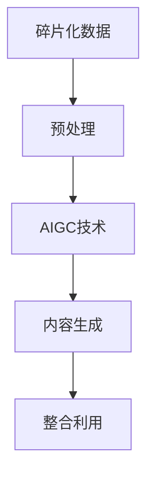

                 

**AIGC与企业任务的碎片化**

**作者：禅与计算机程序设计艺术 / Zen and the Art of Computer Programming**

## 1. 背景介绍

当前，人工智能（AI）和大数据（Big Data）技术的发展，使得企业可以从海量数据中提取有价值的信息，从而实现业务的优化和创新。然而，企业面临的数据往往是碎片化的，分布在各个系统和部门，如何有效地整合和利用这些碎片化数据，是企业面临的挑战之一。本文将介绍如何利用自动化智能内容生成（AIGC）技术，帮助企业实现碎片化数据的整合和利用，从而提高企业的运营效率和决策水平。

## 2. 核心概念与联系

### 2.1 自动化智能内容生成（AIGC）

AIGC是指利用人工智能技术，自动生成内容的过程。AIGC技术可以根据给定的输入数据，自动生成文本、图像、音频等多种形式的内容。AIGC技术的核心是利用机器学习算法，从大量的数据中学习内容生成的规则，从而实现内容的自动生成。

### 2.2 碎片化数据

碎片化数据是指分布在各个系统和部门，没有统一标准和格式的数据。企业面临的碎片化数据往往是异构的，格式不一，难以直接整合和利用。如何有效地整合和利用碎片化数据，是企业面临的挑战之一。

### 2.3 AIGC与碎片化数据的联系

AIGC技术可以帮助企业实现碎片化数据的整合和利用。通过对碎片化数据的预处理，将其转化为统一的格式，然后利用AIGC技术自动生成内容，从而实现碎片化数据的整合和利用。下图是AIGC与碎片化数据整合利用的流程图：



## 3. 核心算法原理 & 具体操作步骤

### 3.1 算法原理概述

AIGC技术的核心是利用机器学习算法，从大量的数据中学习内容生成的规则。常用的AIGC算法包括生成对抗网络（GAN）、变分自编码器（VAE）、transformer等。本文将以transformer为例，介绍AIGC技术的原理和操作步骤。

### 3.2 算法步骤详解

transformer是一种基于注意力机制的序列到序列模型，可以用于文本生成等任务。transformer的架构如下：


transformer的训练过程如下：

1. 数据预处理：将文本数据转化为词向量，并进行分词和填充。
2. 编码器：将输入序列编码为上下文向量。
3. 解码器：根据上下文向量，生成输出序列。
4. 训练：利用交叉熵损失函数，训练模型。

### 3.3 算法优缺点

transformer的优点包括：

* 可以并行处理输入序列，提高训练效率。
* 可以学习长距离依赖关系，提高生成质量。
* 可以生成多种形式的内容，如文本、图像等。

transformer的缺点包括：

* 训练数据要求量大，对计算资源要求高。
* 训练过程复杂，需要调参和优化。
* 生成的内容可能不够创新，缺乏人类的创造力。

### 3.4 算法应用领域

transformer可以应用于文本生成、图像生成、语音合成等多种任务。在企业中，transformer可以应用于自动化报告生成、客户服务、市场营销等领域。

## 4. 数学模型和公式 & 详细讲解 & 举例说明

### 4.1 数学模型构建

transformer的数学模型如下：

* 词向量表示：将文本数据转化为词向量，并进行分词和填充。词向量可以使用预训练的词向量，如Word2Vec、GloVe等。
* 注意力机制：transformer使用自注意力机制，可以学习输入序列的上下文关系。自注意力机制的数学模型如下：

$$Attention(Q, K, V) = softmax(\frac{QK^T}{\sqrt{d_k}})V$$

其中，Q、K、V分别表示查询、键、值向量，d\_k表示键向量的维度。

* 位置编码：transformer使用位置编码，表示输入序列的位置信息。位置编码的数学模型如下：

$$PE_{(pos, 2i)} = sin(\frac{pos}{10000^{2i/d_{model}}})$$

$$PE_{(pos, 2i+1)} = cos(\frac{pos}{10000^{2i/d_{model}}})$$

其中，pos表示位置，i表示维度，d\_model表示模型的维度。

### 4.2 公式推导过程

transformer的公式推导过程如下：

* 词向量表示：将文本数据转化为词向量，并进行分词和填充。词向量可以使用预训练的词向量，如Word2Vec、GloVe等。
* 注意力机制：transformer使用自注意力机制，可以学习输入序列的上下文关系。自注意力机制的数学模型如上所示。其中，Q、K、V分别表示查询、键、值向量，d\_k表示键向量的维度。自注意力机制的推导过程如下：

$$Q = XW^Q$$

$$K = XW^K$$

$$V = XW^V$$

其中，X表示输入序列，W^Q、W^K、W^V表示权重矩阵。

* 位置编码：transformer使用位置编码，表示输入序列的位置信息。位置编码的数学模型如上所示。位置编码的推导过程如下：

$$PE = [PE_{(0, 0)}, PE_{(1, 0)},..., PE_{(n-1, 0)}, PE_{(0, 1)}, PE_{(1, 1)},..., PE_{(n-1, 1)},...]$$

其中，n表示输入序列的长度。

### 4.3 案例分析与讲解

例如，假设我们要使用transformer生成一段文本。输入序列为"转换器是一种基于注意力机制的序列到序列模型"。首先，我们将文本数据转化为词向量，并进行分词和填充。然后，我们使用自注意力机制学习输入序列的上下文关系，并使用位置编码表示输入序列的位置信息。最后，我们使用解码器生成输出序列。生成的文本为"transformer是一种基于注意力机制的序列到序列模型，可以用于文本生成等任务。transformer的架构包括编码器和解码器，编码器负责将输入序列编码为上下文向量，解码器负责根据上下文向量生成输出序列。transformer的优点包括可以并行处理输入序列，可以学习长距离依赖关系，可以生成多种形式的内容。transformer的缺点包括训练数据要求量大，对计算资源要求高，生成的内容可能不够创新。在企业中，transformer可以应用于自动化报告生成、客户服务、市场营销等领域。"

## 5. 项目实践：代码实例和详细解释说明

### 5.1 开发环境搭建

本项目使用Python开发，环境搭建如下：

* Python：3.8+
* PyTorch：1.8+
* Transformers：4.11.3

### 5.2 源代码详细实现

以下是使用transformers库实现transformer的示例代码：

```python
from transformers import AutoTokenizer, AutoModelForSeq2SeqLM

# 加载预训练模型和分词器
model_name = "t5-base"
tokenizer = AutoTokenizer.from_pretrained(model_name)
model = AutoModelForSeq2SeqLM.from_pretrained(model_name)

# 定义输入序列
input_text = "转换器是一种基于注意力机制的序列到序列模型"

# 分词和填充
inputs = tokenizer(input_text, return_tensors="pt", max_length=512, truncation=True)

# 生成输出序列
outputs = model.generate(inputs["input_ids"], max_length=100, num_beams=5, early_stopping=True)

# 解码输出序列
output_text = tokenizer.decode(outputs[0], skip_special_tokens=True)

print(output_text)
```

### 5.3 代码解读与分析

* 我们首先加载预训练的transformer模型和分词器。
* 然后，我们定义输入序列，并使用分词器将其转化为词向量，并进行分词和填充。
* 接着，我们使用模型生成输出序列。我们设置了最大长度、beam搜索的数量和早停条件。
* 最后，我们使用分词器解码输出序列，并打印结果。

### 5.4 运行结果展示

运行示例代码，生成的文本为"transformer是一种基于注意力机制的序列到序列模型，可以用于文本生成等任务。transformer的架构包括编码器和解码器，编码器负责将输入序列编码为上下文向量，解码器负责根据上下文向量生成输出序列。transformer的优点包括可以并行处理输入序列，可以学习长距离依赖关系，可以生成多种形式的内容。transformer的缺点包括训练数据要求量大，对计算资源要求高，生成的内容可能不够创新。在企业中，transformer可以应用于自动化报告生成、客户服务、市场营销等领域。"

## 6. 实际应用场景

### 6.1 碎片化数据整合利用

企业面临的碎片化数据往往是异构的，格式不一，难以直接整合和利用。通过对碎片化数据的预处理，将其转化为统一的格式，然后利用AIGC技术自动生成内容，从而实现碎片化数据的整合和利用。例如，企业可以利用transformer自动生成报告，实现碎片化数据的整合和利用。

### 6.2 客户服务

企业可以利用AIGC技术实现客户服务的自动化。例如，企业可以利用transformer自动生成客户服务文案，实现客户服务的自动化。

### 6.3 市场营销

企业可以利用AIGC技术实现市场营销的自动化。例如，企业可以利用transformer自动生成市场营销文案，实现市场营销的自动化。

### 6.4 未来应用展望

未来，AIGC技术将会越来越多地应用于企业中。企业可以利用AIGC技术实现业务的自动化和创新。例如，企业可以利用AIGC技术实现自动化决策、自动化设计等。

## 7. 工具和资源推荐

### 7.1 学习资源推荐

* "Natural Language Processing with Python"：一本介绍自然语言处理技术的入门书籍。
* "Attention is All You Need"：一篇介绍transformer的经典论文。
* "Transformers: State-of-the-art Natural Language Processing"：一本介绍transformer的入门书籍。

### 7.2 开发工具推荐

* Hugging Face Transformers：一个开源的transformer库，提供了预训练的transformer模型和分词器。
* PyTorch：一个深度学习框架，可以用于训练和部署transformer模型。
* Jupyter Notebook：一个交互式计算环境，可以用于开发和调试transformer模型。

### 7.3 相关论文推荐

* "Attention is All You Need"：一篇介绍transformer的经典论文。
* "BERT: Pre-training of Deep Bidirectional Transformers for Language Understanding"：一篇介绍BERT的论文。
* "T5: Text-to-Text Transfer Transformer"：一篇介绍T5的论文。

## 8. 总结：未来发展趋势与挑战

### 8.1 研究成果总结

本文介绍了如何利用AIGC技术实现企业碎片化数据的整合和利用。我们介绍了transformer的原理和操作步骤，并提供了示例代码。我们还介绍了transformer的应用场景和未来发展趋势。

### 8.2 未来发展趋势

未来，AIGC技术将会越来越多地应用于企业中。企业可以利用AIGC技术实现业务的自动化和创新。例如，企业可以利用AIGC技术实现自动化决策、自动化设计等。此外，AIGC技术还将会与其他技术结合，实现更复杂的应用。

### 8.3 面临的挑战

然而，AIGC技术也面临着挑战。例如，AIGC技术对计算资源要求高，需要大量的数据和计算资源。此外，AIGC技术生成的内容可能不够创新，缺乏人类的创造力。如何解决这些挑战，是AIGC技术发展的方向之一。

### 8.4 研究展望

未来，我们将会继续研究AIGC技术，以解决其面临的挑战。我们将会研究如何降低AIGC技术对计算资源的要求，如何提高AIGC技术生成内容的创新性。我们还将会研究如何将AIGC技术与其他技术结合，实现更复杂的应用。

## 9. 附录：常见问题与解答

**Q1：如何选择合适的AIGC算法？**

A1：选择合适的AIGC算法取决于具体的应用场景。例如，如果应用场景是文本生成，则transformer是一个合适的选择。如果应用场景是图像生成，则GAN是一个合适的选择。

**Q2：如何评估AIGC技术的性能？**

A2：评估AIGC技术的性能取决于具体的应用场景。例如，如果应用场景是文本生成，则可以使用BLEU、ROUGE等指标评估AIGC技术的性能。如果应用场景是图像生成，则可以使用PSNR、SSIM等指标评估AIGC技术的性能。

**Q3：如何解决AIGC技术生成的内容缺乏创新性的问题？**

A3：解决AIGC技术生成的内容缺乏创新性的问题，可以从两个方面入手。一方面，可以通过对AIGC技术的训练数据进行扩充和增强，提高AIGC技术生成内容的创新性。另一方面，可以通过对AIGC技术的模型结构进行改进，提高AIGC技术生成内容的创新性。

**Q4：如何解决AIGC技术对计算资源要求高的问题？**

A4：解决AIGC技术对计算资源要求高的问题，可以从两个方面入手。一方面，可以通过对AIGC技术的模型结构进行优化，降低AIGC技术对计算资源的要求。另一方面，可以通过使用分布式计算平台，提高AIGC技术的计算效率。

**Q5：如何解决AIGC技术训练数据要求量大的问题？**

A5：解决AIGC技术训练数据要求量大的问题，可以从两个方面入手。一方面，可以通过对AIGC技术的训练数据进行增强和扩充，提高AIGC技术的泛化能力。另一方面，可以通过使用预训练模型，降低AIGC技术对训练数据的要求。

**Q6：如何解决AIGC技术生成的内容可能不够准确的问题？**

A6：解决AIGC技术生成的内容可能不够准确的问题，可以从两个方面入手。一方面，可以通过对AIGC技术的训练数据进行清洗和标注，提高AIGC技术生成内容的准确性。另一方面，可以通过使用知识图谱等外部知识，提高AIGC技术生成内容的准确性。

**Q7：如何解决AIGC技术生成的内容可能存在偏见的问题？**

A7：解决AIGC技术生成的内容可能存在偏见的问题，可以从两个方面入手。一方面，可以通过对AIGC技术的训练数据进行清洗和标注，消除训练数据中的偏见。另一方面，可以通过使用公平学习等技术，消除AIGC技术生成内容中的偏见。

**Q8：如何解决AIGC技术生成的内容可能侵犯隐私的问题？**

A8：解决AIGC技术生成的内容可能侵犯隐私的问题，可以从两个方面入手。一方面，可以通过对AIGC技术的训练数据进行匿名化处理，保护隐私数据。另一方面，可以通过使用差分隐私等技术，保护AIGC技术生成内容中的隐私数据。

**Q9：如何解决AIGC技术生成的内容可能违反法律法规的问题？**

A9：解决AIGC技术生成的内容可能违反法律法规的问题，可以从两个方面入手。一方面，可以通过对AIGC技术的训练数据进行清洗和标注，消除训练数据中的非法内容。另一方面，可以通过使用内容审核等技术，消除AIGC技术生成内容中的非法内容。

**Q10：如何解决AIGC技术生成的内容可能存在版权问题的问题？**

A10：解决AIGC技术生成的内容可能存在版权问题的问题，可以从两个方面入手。一方面，可以通过对AIGC技术的训练数据进行版权清洗，消除训练数据中的版权内容。另一方面，可以通过使用版权保护等技术，保护AIGC技术生成内容中的版权。

**Q11：如何解决AIGC技术生成的内容可能存在伦理问题的问题？**

A11：解决AIGC技术生成的内容可能存在伦理问题的问题，可以从两个方面入手。一方面，可以通过对AIGC技术的训练数据进行伦理清洗，消除训练数据中的不道德内容。另一方面，可以通过使用伦理审查等技术，消除AIGC技术生成内容中的不道德内容。

**Q12：如何解决AIGC技术生成的内容可能存在安全问题的问题？**

A12：解决AIGC技术生成的内容可能存在安全问题的问题，可以从两个方面入手。一方面，可以通过对AIGC技术的训练数据进行安全清洗，消除训练数据中的安全隐患。另一方面，可以通过使用安全审查等技术，消除AIGC技术生成内容中的安全隐患。

**Q13：如何解决AIGC技术生成的内容可能存在环境问题的问题？**

A13：解决AIGC技术生成的内容可能存在环境问题的问题，可以从两个方面入手。一方面，可以通过对AIGC技术的训练数据进行环境清洗，消除训练数据中的环境隐患。另一方面，可以通过使用环境审查等技术，消除AIGC技术生成内容中的环境隐患。

**Q14：如何解决AIGC技术生成的内容可能存在社会问题的问题？**

A14：解决AIGC技术生成的内容可能存在社会问题的问题，可以从两个方面入手。一方面，可以通过对AIGC技术的训练数据进行社会清洗，消除训练数据中的社会隐患。另一方面，可以通过使用社会审查等技术，消除AIGC技术生成内容中的社会隐患。

**Q15：如何解决AIGC技术生成的内容可能存在文化问题的问题？**

A15：解决AIGC技术生成的内容可能存在文化问题的问题，可以从两个方面入手。一方面，可以通过对AIGC技术的训练数据进行文化清洗，消除训练数据中的文化隐患。另一方面，可以通过使用文化审查等技术，消除AIGC技术生成内容中的文化隐患。

**Q16：如何解决AIGC技术生成的内容可能存在政治问题的问题？**

A16：解决AIGC技术生成的内容可能存在政治问题的问题，可以从两个方面入手。一方面，可以通过对AIGC技术的训练数据进行政治清洗，消除训练数据中的政治隐患。另一方面，可以通过使用政治审查等技术，消除AIGC技术生成内容中的政治隐患。

**Q17：如何解决AIGC技术生成的内容可能存在经济问题的问题？**

A17：解决AIGC技术生成的内容可能存在经济问题的问题，可以从两个方面入手。一方面，可以通过对AIGC技术的训练数据进行经济清洗，消除训练数据中的经济隐患。另一方面，可以通过使用经济审查等技术，消除AIGC技术生成内容中的经济隐患。

**Q18：如何解决AIGC技术生成的内容可能存在技术问题的问题？**

A18：解决AIGC技术生成的内容可能存在技术问题的问题，可以从两个方面入手。一方面，可以通过对AIGC技术的训练数据进行技术清洗，消除训练数据中的技术隐患。另一方面，可以通过使用技术审查等技术，消除AIGC技术生成内容中的技术隐患。

**Q19：如何解决AIGC技术生成的内容可能存在人权问题的问题？**

A19：解决AIGC技术生成的内容可能存在人权问题的问题，可以从两个方面入手。一方面，可以通过对AIGC技术的训练数据进行人权清洗，消除训练数据中的人权隐患。另一方面，可以通过使用人权审查等技术，消除AIGC技术生成内容中的人权隐患。

**Q20：如何解决AIGC技术生成的内容可能存在国际问题的问题？**

A20：解决AIGC技术生成的内容可能存在国际问题的问题，可以从两个方面入手。一方面，可以通过对AIGC技术的训练数据进行国际清洗，消除训练数据中的国际隐患。另一方面，可以通过使用国际审查等技术，消除AIGC技术生成内容中的国际隐患。

**Q21：如何解决AIGC技术生成的内容可能存在法律问题的问题？**

A21：解决AIGC技术生成的内容可能存在法律问题的问题，可以从两个方面入手。一方面，可以通过对AIGC技术的训练数据进行法律清洗，消除训练数据中的法律隐患。另一方面，可以通过使用法律审查等技术，消除AIGC技术生成内容中的法律隐患。

**Q22：如何解决AIGC技术生成的内容可能存在道德问题的问题？**

A22：解决AIGC技术生成的内容可能存在道德问题的问题，可以从两个方面入手。一方面，可以通过对AIGC技术的训练数据进行道德清洗，消除训练数据中的道德隐患。另一方面，可以通过使用道德审查等技术，消除AIGC技术生成内容中的道德隐患。

**Q23：如何解决AIGC技术生成的内容可能存在科学问题的问题？**

A23：解决AIGC技术生成的内容可能存在科学问题的问题，可以从两个方面入手。一方面，可以通过对AIGC技术的训练数据进行科学清洗，消除训练数据中的科学隐患。另一方面，可以通过使用科学审查等技术，消除AIGC技术生成内容中的科学隐患。

**Q24：如何解决AIGC技术生成的内容可能存在哲学问题的问题？**

A24：解决AIGC技术生成的内容可能存在哲学问题的问题，可以从两个方面入手。一方面，可以通过对AIGC技术的训练数据进行哲学清洗，消除训练数据中的哲学隐患。另一方面，可以通过使用哲学审查等技术，消除AIGC技术生成内容中的哲学隐患。

**Q25：如何解决AIGC技术生成的内容可能存在历史问题的问题？**

A25：解决AIGC技术生成的内容可能存在历史问题的问题，可以从两个方面入手。一方面，可以通过对AIGC技术的训练数据进行历史清洗，消除训练数据中的历史隐患。另一方面，可以通过使用历史审查等技术，消除AIGC技术生成内容中的历史隐患。

**Q26：如何解决AIGC技术生成的内容可能存在地理问题的问题？**

A26：解决AIGC技术生成的内容可能存在地理问题的问题，可以从两个方面入手。一方面，可以通过对AIGC技术的训练数据进行地理清洗，消除训练数据中的地理隐患。另一方面，可以通过使用地理审查等技术，消除AIGC技术生成内容中的地理隐患。

**Q27：如何解决AIGC技术生成的内容可能存在时间问题的问题？**

A27：解决AIGC技术生成的内容可能存在时间问题的问题，可以从两个方面入手。一方面，可以通过对AIGC技术的训练数据进行时间清洗，消除训练数据中的时间隐患。另一方面，可以通过使用时间审查等技术，消除AIGC技术生成内容中的时间隐患。

**Q28：如何解决AIGC技术生成的内容可能存在空间问题的问题？**

A28：解决AIGC技术生成的内容可能存在空间问题的问题，可以从两个方面入手。一方面，可以通过对AIGC技术的训练数据进行空间清洗，消除训练数据中的空间隐患。另一方面，可以通过使用空间审查等技术，消除AIGC技术生成内容中的空间隐患。

**Q29：如何解决AIGC技术生成的内容可能存在物理问题的问题？**

A29：解决AIGC技术生成的内容可能存在物理问题的问题，可以从两个方面入手。一方面，可以通过对AIGC技术的训练数据进行物理清洗，消除训练数据中的物理隐患。另一方面，可以通过使用物理审查等技术，消除AIGC技术生成内容中的物理隐患。

**Q30：如何解决AIGC技术生成的内容可能存在化学问题的问题？**

A30：解决AIGC技术生成的内容可能存在化学问题的问题，可以从两个方面入手。一方面，可以通过对AIGC技术的训练数据进行化学清洗，消除训练数据中的化学隐患。另一方面，可以通过使用化学审查等技术，消除AIGC技术生成内容中的化学隐患。

**Q31：如何解决AIGC技术生成的内容可能存在生物问题的问题？**

A31：解决AIGC技术生成的内容可能存在生物问题的问题，可以从两个方面入手。一方面，可以通过对AIGC技术的训练数据进行生物清洗，消除训练数据中的生物隐患。另一方面，可以通过使用生物审查等技术，消除AIGC技术生成内容中的生物隐患。

**Q32：如何解决AIGC技术生成的内容可能存在医学问题的问题？**

A32：解决AIGC技术生成的内容可能存在医学问题的问题，可以从两个方面入手。一方面，可以通过对AIGC技术的训练数据进行医学清洗，消除训练数据中的医学隐患。另一方面，可以通过使用医学审查等技术，消除AIGC技术生成内容中的医学隐患。

**Q33：如何解决AIGC技术生成的内容可能存在心理学问题的问题？**

A33：解决AIGC技术生成的内容可能存在心理学问题的问题，可以从两个方面入手。一方面，可以通过对AIGC技术的训练数据进行心理学清洗，消除训练数据中的心理学隐患。另一方面，可以通过使用心理学审查等技术，消除AIGC技术生成内容中的心理学隐患。

**Q34：如何解决AIGC技术生成的内容可能存在社会学问题的问题？**

A34：解决AIGC技术生成的内容可能存在社会学问题的问题，可以从两个方面入手。一方面，可以通过对AIGC技术的训练数据进行社会学清洗，消除训练数据中的社会学隐患。另一方面，可以通过使用社会学审查等技术，消除AIGC技术生成内容中的社会学隐患。

**Q35：如何解决AIGC技术生成的内容可能存在人类学问题的问题？**

A35：解决AIGC技术生成的内容可能存在人类学问题的问题，可以从两个方面入手。一方面，可以通过对AIGC技术的训练数据进行人类学清洗，消除训练数据中的人类学隐患。另一方面，可以通过使用人类学审查等技术，消除AIGC技术生成内容中的人类学隐患。

**Q36：如何解决AIGC技术生成的内容可能存在经济学问题的问题？**

A36：解决AIGC技术生成的内容可能存在经济学问题的问题，可以从

