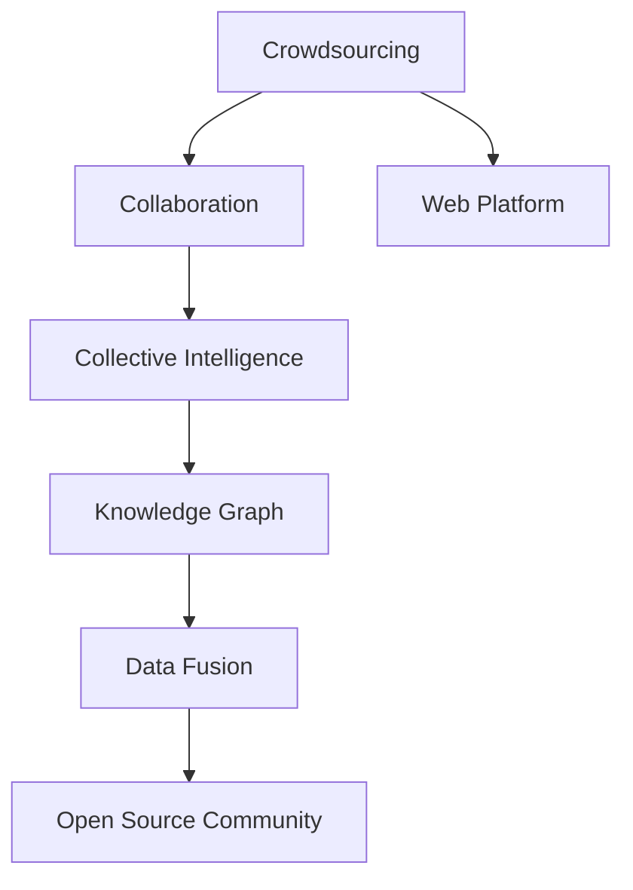

                 

# 知识的众包与协作：集体智慧的力量

> 关键词：众包,协作,集体智慧,知识共享,开源社区,协作平台,知识图谱,数据融合

## 1. 背景介绍

### 1.1 问题由来

随着互联网技术的迅猛发展和数据量的急剧膨胀，知识的获取、共享和利用变得愈发便捷和高效。传统的知识获取方式，如教科书、学术论文、专家讲座等，已经无法满足现代社会的知识需求。一方面，互联网为每个人提供了平等获取和贡献知识的机会，另一方面，大规模的数据集和复杂的算法模型也使得知识的挖掘和利用变得愈发困难。

在这样一个背景下，“众包”（Crowdsourcing）和“协作”（Collaboration）的概念应运而生。众包强调利用网络平台将个体智慧聚合起来，解决复杂问题；协作则强调个体之间通过网络平台进行沟通和合作，共同推进知识共享和创新。这两种模式结合起来，形成了现代知识社会的核心特征：集体智慧（Collective Intelligence）。

### 1.2 问题核心关键点

众包和协作作为集体智慧的核心驱动机制，其核心关键点主要包括：

- **多样化的知识来源**：个体来自不同背景，拥有各异的知识技能和观点，这种多样性为解决复杂问题提供了多角度的视角。
- **开放的知识共享平台**：网络平台为个体提供了交流、共享知识的渠道，使得知识传播范围更加广泛，利用效率更高。
- **协作机制的建立**：个体通过平台进行协作，可以在更短的时间内完成大规模的复杂任务，并且能够通过迭代优化提高任务完成质量。
- **知识图谱的构建**：众包和协作模式可以自然地构建出动态的知识图谱，实现知识间的链接和融合。

### 1.3 问题研究意义

研究众包和协作在集体智慧中的应用，对于推进知识社会的建设，加速科学和技术的发展，具有重要意义：

- **提升知识获取效率**：通过众包和协作机制，可以大幅提升知识的获取效率，使得个体能够更迅速地获取所需知识，减少时间和资源浪费。
- **促进知识创新**：个体之间的互动和协作可以激发更多的创新想法，通过集体智慧，可以实现更高效的创新过程。
- **推动知识共享**：众包和协作模式鼓励知识共享，降低知识获取的成本，推动知识的广泛传播和利用。
- **增强社会连通性**：众包和协作使得不同背景的个体能够跨越地域和文化的界限，进行深入的沟通和合作。

## 2. 核心概念与联系

### 2.1 核心概念概述

为了更好地理解众包和协作在集体智慧中的作用，本节将介绍几个密切相关的核心概念：

- **众包（Crowdsourcing）**：通过互联网平台，将复杂任务分解成多个小任务，分配给不同个体完成，最后汇总个体贡献，解决复杂问题。
- **协作（Collaboration）**：个体之间通过互联网平台进行沟通和合作，共享知识和经验，共同推进任务完成。
- **集体智慧（Collective Intelligence）**：利用众包和协作模式，聚合个体智慧，通过网络平台实现知识共享和创新。
- **知识图谱（Knowledge Graph）**：基于众包和协作模式构建的知识库，通过语义关联实现知识的有机整合。
- **数据融合（Data Fusion）**：将众包平台上的多样化数据进行融合，提取更有价值的信息，提升知识利用效率。
- **开源社区（Open Source Community）**：一群开发者通过互联网平台共同维护一个软件或项目，实现知识的共享和迭代。

这些核心概念之间的逻辑关系可以通过以下Mermaid流程图来展示：



这个流程图展示众包、协作、集体智慧、知识图谱、数据融合和开源社区之间的关系：

1. 众包和协作是集体智慧的驱动机制，通过网络平台聚合个体智慧。
2. 众包和协作模式可以构建知识图谱，实现知识的有机整合。
3. 知识图谱和数据融合进一步提升知识的利用效率。
4. 开源社区是众包和协作模式的具体实现，推动软件和项目的迭代。

这些概念共同构成了现代知识社会的基础架构，为集体智慧的应用提供了技术支持。

## 3. 核心算法原理 & 具体操作步骤
### 3.1 算法原理概述

众包和协作机制在集体智慧中的应用，主要依赖于以下算法原理：

1. **任务分解与分配算法**：将复杂任务分解为多个小任务，通过算法实现任务的高效分配。
2. **个体贡献聚合算法**：汇聚众多个体的成果，生成高质量的解决方案。
3. **知识共享与协作算法**：通过算法实现个体之间的知识共享和协作，增强集体的智慧。
4. **结果评估与反馈算法**：对个体贡献进行评估，通过反馈机制不断优化任务完成质量。

这些算法原理通过互联网平台实现了集体智慧的聚合和利用，为解决复杂问题提供了强有力的支持。

### 3.2 算法步骤详解

基于众包和协作的集体智慧应用，通常包括以下几个关键步骤：

**Step 1: 任务定义与分解**
- 确定需要解决的问题，并根据问题的复杂度进行任务分解。
- 将任务分解为多个小任务，每个小任务可以由个体独立完成。

**Step 2: 任务分配**
- 将分解后的任务分配给不同的个体，可以采用随机分配、最优分配或均衡分配等策略。
- 为个体提供必要的工具和资源，以便于任务执行。

**Step 3: 个体贡献与聚合**
- 个体通过互联网平台提交任务成果，平台进行聚合。
- 对个体贡献进行评价，选择高质量的解决方案作为最终结果。

**Step 4: 结果反馈与优化**
- 对最终结果进行评估，发现问题并提出改进建议。
- 对个体贡献进行反馈，用于指导后续任务的执行。

**Step 5: 持续迭代**
- 通过持续的迭代优化，不断提高集体智慧的利用效率。
- 不断收集新任务和个体贡献，进行动态调整和优化。

通过上述步骤，众包和协作机制可以在集体智慧的框架下，高效地解决问题。

### 3.3 算法优缺点

众包和协作机制在集体智慧中应用具有以下优点：

1. **问题解决高效**：通过将复杂任务分解为多个小任务，可以大大提高问题解决的效率。
2. **知识多样性**：利用众多个体的智慧，可以获取多样化的知识和视角，增强问题解决的深度。
3. **成本低廉**：利用互联网平台，可以大幅降低问题解决的成本，特别是对于大规模任务。

同时，众包和协作机制也存在以下局限：

1. **质量难以保证**：个体贡献质量参差不齐，可能需要额外的时间和资源进行筛选和验证。
2. **协作难度大**：个体之间的协作需要良好的沟通和信任，有时可能会出现信息不对称或沟通障碍。
3. **知识产权问题**：个体贡献的知识产权问题可能较为复杂，需要通过平台机制进行合理管理和保护。

尽管存在这些局限，但众包和协作机制在集体智慧的应用中具有不可替代的重要价值，是现代知识社会的重要组成部分。

### 3.4 算法应用领域

众包和协作机制在多个领域中得到了广泛应用，例如：

- **软件开发**：通过GitHub等平台，开发者共同维护和迭代开源项目，实现知识的共享和利用。
- **市场调研**：利用SurveyMonkey等平台，收集消费者的反馈和意见，进行市场分析。
- **科学研究**：通过Citizen Science等平台，科学爱好者参与数据收集和分析，推动科研进展。
- **产品设计**：通过Innovation Workshops等平台，设计团队与用户共同参与产品设计，实现用户需求的精准满足。
- **教育**：通过Khan Academy等平台，教育工作者和学生共同学习，提升教学效果。
- **医疗**：通过Crowdmed等平台，医生和患者共同参与医疗方案的制定，提高诊断和治疗效果。

除了上述这些经典领域外，众包和协作机制还将在更多场景中得到应用，为各行各业的知识获取和利用提供新的途径。

## 4. 数学模型和公式 & 详细讲解 & 举例说明
### 4.1 数学模型构建

基于众包和协作的集体智慧应用，数学模型可以从以下几个方面进行构建：

- **任务分解与分配模型**：定义任务分解的方法和分配策略，计算每个任务的期望完成时间和成本。
- **个体贡献评价模型**：定义个体贡献的评价指标，如质量、速度、创新性等，计算最终结果的期望值。
- **知识共享与协作模型**：定义个体之间的协作方式，如分工合作、知识共享等，计算知识整合的效率。
- **结果反馈与优化模型**：定义结果反馈的机制，如评估指标、改进建议等，优化集体智慧的利用效率。

这里以一个简单的任务分解与分配模型为例，介绍其构建过程：

假设有一个复杂的任务T，需要分成n个子任务，每个子任务需要t_i时间完成，且每个子任务i的完成时间是独立的，服从正态分布N(t_i, s^2)。设每个子任务i的分配概率为p_i，则任务T的期望完成时间为：

$$
E(T) = \sum_{i=1}^n p_i t_i
$$

其中t_i和s^2是子任务i的时间期望和方差。

### 4.2 公式推导过程

以任务分解与分配模型为例，推导期望完成时间的公式：

设任务T的期望完成时间为E(T)，任务i的期望完成时间为t_i，分配概率为p_i，则：

$$
E(T) = \sum_{i=1}^n p_i t_i
$$

对上式进行推导，可以得到：

$$
E(T) = \sum_{i=1}^n \frac{t_i}{E(t_i)} E(t_i) = \sum_{i=1}^n \frac{t_i}{E(t_i)}
$$

由于t_i服从正态分布N(t_i, s^2)，则E(t_i) = t_i，代入上式得：

$$
E(T) = \sum_{i=1}^n \frac{t_i^2}{t_i} = \sum_{i=1}^n t_i
$$

这表明，任务T的期望完成时间是各个子任务期望完成时间的和。

### 4.3 案例分析与讲解

考虑一个众包项目，需要完成10个分任务，每个任务需要2小时完成，任务时间服从正态分布N(2, 0.1^2)。设每个任务的分配概率为0.1，则任务T的期望完成时间为：

$$
E(T) = \sum_{i=1}^{10} 0.1 \times 2 = 2
$$

这说明，平均而言，完成这个任务需要2小时。

## 5. 项目实践：代码实例和详细解释说明
### 5.1 开发环境搭建

在进行众包和协作的项目实践前，我们需要准备好开发环境。以下是使用Python进行Flask开发的Web环境配置流程：

1. 安装Anaconda：从官网下载并安装Anaconda，用于创建独立的Python环境。

2. 创建并激活虚拟环境：
```bash
conda create -n crowdsourcing-env python=3.8 
conda activate crowdsourcing-env
```

3. 安装Flask：从官网获取Flask安装命令，例如：
```bash
conda install Flask
```

4. 安装相关库：
```bash
pip install flask-wtf flask-cors Flask-SocketIO
```

5. 安装数据库：
```bash
pip install sqlalchemy
```

完成上述步骤后，即可在`crowdsourcing-env`环境中开始项目实践。

### 5.2 源代码详细实现

下面我们以一个简单的众包平台为例，给出使用Flask实现的Web开发代码实现。

首先，定义众包平台的基本页面：

```python
from flask import Flask, render_template, request
from flask_socketio import SocketIO

app = Flask(__name__)
app.config['SECRET_KEY'] = 'secret!'
socketio = SocketIO(app)

@app.route('/')
def index():
    return render_template('index.html')

if __name__ == '__main__':
    socketio.run(app)
```

然后，定义任务提交和结果聚合的API接口：

```python
@app.route('/submit', methods=['POST'])
def submit_task():
    task_id = request.form['task_id']
    user_id = request.form['user_id']
    result = request.form['result']
    socketio.emit('task_submitted', {'task_id': task_id, 'user_id': user_id, 'result': result})
    return 'Task submitted successfully'

@app.route('/aggregate', methods=['POST'])
def aggregate_task():
    tasks = request.form['tasks']
    results = request.form['results']
    merged_task = {}
    for i in range(len(tasks)):
        task_id = tasks[i]
        result = results[i]
        merged_task[task_id] = result
    socketio.emit('task_merged', merged_task)
    return 'Task merged successfully'

if __name__ == '__main__':
    socketio.run(app)
```

最后，定义任务聚合结果的回调函数：

```python
@app.route('/aggregate', methods=['POST'])
def aggregate_task():
    tasks = request.form['tasks']
    results = request.form['results']
    merged_task = {}
    for i in range(len(tasks)):
        task_id = tasks[i]
        result = results[i]
        merged_task[task_id] = result
    socketio.emit('task_merged', merged_task)
    return 'Task merged successfully'

@socketio.on('task_submitted')
def handle_task_submission(data):
    task_id = data['task_id']
    user_id = data['user_id']
    result = data['result']
    merged_task[task_id] = result
    socketio.emit('task_merged', merged_task)
```

以上就是使用Flask对众包平台进行开发的完整代码实现。可以看到，通过Flask和SocketIO，我们可以实现任务提交、聚合和反馈的实时交互。

### 5.3 代码解读与分析

让我们再详细解读一下关键代码的实现细节：

**Flask框架**：
- 定义Flask应用对象app，并设置秘钥。
- 定义基本的路由index，用于显示众包平台的主页。

**任务提交接口**：
- 通过POST方法提交任务，获取任务ID、用户ID和结果。
- 将任务结果发送给客户端，并返回成功信息。

**任务聚合接口**：
- 通过POST方法提交任务ID和结果，返回合并任务结果。
- 在任务提交接口中，通过socketio.emit向客户端发送任务提交事件，通知所有用户任务正在被处理。

**任务聚合回调**：
- 通过socketio.on接收任务提交事件，更新任务聚合结果。
- 通过socketio.emit向所有用户发送任务合并事件，通知任务完成。

通过Flask和SocketIO，可以实现高效的众包平台开发，支持任务的实时提交、聚合和反馈。开发者可以灵活地扩展功能和优化性能。

当然，实际的众包平台开发还需考虑更多因素，如用户认证、任务优先级、任务进度显示等。但核心的众包范式基本与此类似。

## 6. 实际应用场景
### 6.1 开源软件社区

开源软件社区是众包和协作机制的重要应用场景。通过GitHub等平台，开发者共同维护和迭代开源项目，实现知识的共享和利用。

在实践中，开源社区通常采用以下模式：

1. **问题跟踪系统**：记录社区中存在的问题，包括Bug、功能请求等。
2. **任务分配系统**：将问题分解为多个子任务，分配给不同的开发者。
3. **版本控制系统**：记录每次任务的提交，方便跟踪和回溯。
4. **代码审查机制**：对每个任务的提交进行审查，确保代码质量。
5. **贡献者激励机制**：通过徽章、积分等方式激励开发者贡献代码。

通过众包和协作机制，开源社区能够快速迭代和优化软件项目，实现知识的共享和传播。

### 6.2 科学数据收集

科学数据收集是众包和协作机制的另一重要应用场景。通过Citizen Science等平台，科学爱好者参与数据收集和分析，推动科研进展。

在实践中，科学数据收集通常采用以下模式：

1. **数据收集任务**：定义需要收集的数据类型和任务要求。
2. **任务分配系统**：将数据收集任务分配给不同的志愿者。
3. **数据提交系统**：记录每个志愿者的数据提交结果。
4. **数据整合系统**：对所有数据进行整合和分析。
5. **结果共享机制**：将分析结果共享给社区成员，供进一步研究。

通过众包和协作机制，科学数据收集能够快速获取大量的高质量数据，推动科学研究的发展。

### 6.3 城市交通规划

城市交通规划是众包和协作机制的典型应用场景。通过Innovation Workshops等平台，设计团队与市民共同参与交通方案的制定，实现交通系统的高效管理。

在实践中，城市交通规划通常采用以下模式：

1. **交通需求调查**：收集市民对交通系统的意见和建议。
2. **任务分解系统**：将交通需求分解为多个子任务，分配给不同的团队。
3. **方案设计系统**：每个团队设计交通方案，并提交方案。
4. **方案评估系统**：对所有方案进行评估和投票。
5. **方案实施系统**：根据投票结果，实施最佳的交通方案。

通过众包和协作机制，城市交通规划能够充分听取市民意见，实现交通系统的高效管理。

### 6.4 未来应用展望

随着众包和协作机制的不断发展和完善，其在更多领域中将会得到应用，为各行各业的知识获取和利用提供新的途径。

在智慧医疗领域，通过众包平台，医生和患者共同参与医疗方案的制定，提高诊断和治疗效果。

在智能教育领域，通过众包平台，教育工作者和学生共同学习，提升教学效果。

在智慧城市治理中，通过众包平台，市民参与城市事件监测、舆情分析、应急指挥等环节，提高城市管理的自动化和智能化水平。

此外，在企业生产、社会治理、文娱传媒等众多领域，众包和协作机制也将不断涌现，为各行各业的知识获取和利用提供新的途径。

## 7. 工具和资源推荐
### 7.1 学习资源推荐

为了帮助开发者系统掌握众包和协作的理论基础和实践技巧，这里推荐一些优质的学习资源：

1. **《众包经济学》（Crowdsourcing）**：由Jeff Howe所著，系统介绍了众包的概念、应用和发展。
2. **《协作革命》（The Collaborative Age）**：由Michael Siegel所著，深入分析了协作模式在商业、科技和社会中的应用。
3. **Coursera《Data Mining and Statistical Learning》课程**：斯坦福大学开设的课程，涵盖了数据挖掘和统计学习的基本原理和应用。
4. **Kaggle竞赛平台**：世界领先的众包平台，提供大量数据集和任务，鼓励开发者进行数据竞赛。
5. **Open Science Framework（OSF）**：一个开源科学社区，支持科学研究的合作和共享。

通过对这些资源的学习实践，相信你一定能够快速掌握众包和协作的精髓，并用于解决实际的NLP问题。

### 7.2 开发工具推荐

高效的开发离不开优秀的工具支持。以下是几款用于众包和协作开发的常用工具：

1. **GitHub**：一个全球最大的开源社区，提供代码托管、问题跟踪和协作功能。
2. **Flask**：一个轻量级的Web框架，支持实时通信和数据融合。
3. **Socket.io**：一个实时通信库，支持WebSocket协议，实现任务的实时反馈和交互。
4. **Citizen Science Center**：一个科学数据收集平台，支持志愿者的数据提交和共享。
5. **Google Colab**：一个在线Jupyter Notebook环境，提供GPU/TPU算力，方便开发者快速实验。

合理利用这些工具，可以显著提升众包和协作任务的开发效率，加快创新迭代的步伐。

### 7.3 相关论文推荐

众包和协作技术的发展源于学界的持续研究。以下是几篇奠基性的相关论文，推荐阅读：

1. **Crowdsourcing and the Future of Work**：由Diana Zuckerman所著，讨论了众包对工作未来的影响。
2. **Collaborative Filtering**：由Dianne Parkes所著，介绍了协作过滤算法在推荐系统中的应用。
3. **Knowledge Discovery in Databases**：由Jörg Sander所著，介绍了数据挖掘和知识发现的基本原理和应用。
4. **A Survey on Crowdsourcing Systems**：由Erich Albers所著，对众包系统进行了全面的回顾和总结。
5. **Collaborative Filtering Techniques**：由Saurabh Singh所著，介绍了协作过滤算法在推荐系统中的具体实现。

这些论文代表了大规模众包和协作技术的发展脉络。通过学习这些前沿成果，可以帮助研究者把握学科前进方向，激发更多的创新灵感。

## 8. 总结：未来发展趋势与挑战

### 8.1 研究成果总结

本文对众包和协作在集体智慧中的应用进行了全面系统的介绍。首先阐述了众包和协作的概念及其研究意义，明确了众包和协作在知识社会的核心价值。其次，从原理到实践，详细讲解了众包和协作的数学模型和算法原理，给出了众包平台开发的完整代码实现。同时，本文还广泛探讨了众包和协作机制在开源软件、科学数据收集、城市交通规划等多个领域的应用前景，展示了众包范式的巨大潜力。此外，本文精选了众包和协作技术的各类学习资源，力求为读者提供全方位的技术指引。

通过本文的系统梳理，可以看到，众包和协作机制在现代知识社会中具有不可替代的重要价值，能够高效地解决复杂问题，推动知识的获取和利用。未来，伴随技术的不断演进和完善，众包和协作机制将在更多领域中得到应用，为各行各业的知识获取和利用提供新的途径。

### 8.2 未来发展趋势

展望未来，众包和协作机制将呈现以下几个发展趋势：

1. **智能化水平提升**：未来的众包和协作平台将具备更强的智能化能力，能够自动匹配任务和个体，提高任务执行效率。
2. **跨领域应用拓展**：众包和协作机制将在更多领域中得到应用，实现知识的跨领域整合和创新。
3. **个性化推荐增强**：利用数据分析和机器学习技术，增强众包平台对个体贡献的个性化推荐，提高任务完成质量。
4. **协作机制优化**：通过引入区块链、智能合约等技术，优化个体之间的协作机制，提高平台的信任度和透明度。
5. **数据安全保护**：随着数据量的增加，数据安全和隐私保护将成为众包平台的重要关注点。未来的平台将更加注重数据保护，采用加密、匿名化等措施，保障个体隐私。

以上趋势凸显了众包和协作机制的广阔前景。这些方向的探索发展，必将进一步提升众包平台的利用效率，推动知识社会的建设。

### 8.3 面临的挑战

尽管众包和协作机制已经取得了一定的进展，但在迈向更加智能化、普适化应用的过程中，它仍面临着诸多挑战：

1. **任务分配不均衡**：个体贡献质量和数量的不均衡，可能导致任务分配不均衡，影响平台整体利用效率。
2. **协作难度大**：个体之间的沟通和协作需要良好的信任机制，有时会出现信息不对称或沟通障碍。
3. **知识产权问题**：个体贡献的知识产权问题可能较为复杂，需要通过平台机制进行合理管理和保护。
4. **数据隐私保护**：众包平台需要收集和处理大量的个人数据，如何在保障隐私的前提下进行数据利用，是亟待解决的问题。
5. **平台信任度**：众包平台的信任度问题可能较为严重，如何建立和维护平台的信任机制，也是重要的研究方向。

尽管存在这些挑战，但众包和协作机制在集体智慧的应用中具有不可替代的重要价值，是现代知识社会的重要组成部分。

### 8.4 研究展望

面对众包和协作机制所面临的种种挑战，未来的研究需要在以下几个方面寻求新的突破：

1. **任务动态调整**：开发更加智能化的任务分配算法，根据个体贡献质量进行动态调整，提高平台整体利用效率。
2. **协作机制改进**：引入区块链、智能合约等技术，优化个体之间的协作机制，提高平台的信任度和透明度。
3. **数据隐私保护**：采用加密、匿名化等措施，保障个体隐私，增强平台的数据安全性。
4. **平台信任机制**：建立和维护平台的信任机制，提高个体之间的协作效率，增强平台的利用价值。

这些研究方向的探索，必将引领众包和协作机制迈向更高的台阶，为构建安全、可靠、可解释、可控的智能系统铺平道路。面向未来，众包和协作技术还需要与其他人工智能技术进行更深入的融合，如知识表示、因果推理、强化学习等，多路径协同发力，共同推动知识社会的进步。

## 9. 附录：常见问题与解答

**Q1：众包和协作机制在实际应用中需要注意哪些问题？**

A: 在实际应用中，众包和协作机制需要注意以下几个问题：

1. **任务分解合理性**：将复杂任务合理分解为多个子任务，避免任务过于简单或复杂，影响任务完成效率。
2. **个体贡献质量**：通过合理的任务评价机制，确保个体贡献质量，避免低质量贡献影响整体结果。
3. **协作机制优化**：通过平台机制优化个体之间的协作，增强沟通和信任，提高任务完成质量。
4. **数据隐私保护**：平台需要合理处理个体数据，保障数据隐私和安全。
5. **平台信任机制**：建立和维护平台的信任机制，增强个体之间的协作效率。

**Q2：众包和协作机制如何避免任务分配不均衡？**

A: 任务分配不均衡是众包和协作机制面临的一个主要问题。为了解决这一问题，可以采取以下措施：

1. **任务动态调整**：根据个体贡献质量进行动态调整，优化任务分配，提高平台整体利用效率。
2. **任务优先级设置**：对任务进行优先级排序，优先分配重要和紧急的任务。
3. **个体贡献记录**：记录每个个体的贡献历史和质量，进行任务分配时优先选择贡献较高的个体。
4. **多轮评估机制**：通过多轮评估和反馈，逐步优化任务分配。

**Q3：众包和协作机制在数据隐私保护方面有哪些措施？**

A: 数据隐私保护是众包和协作机制的重要关注点。为了保护个体数据隐私，可以采取以下措施：

1. **数据匿名化**：对个体数据进行匿名化处理，防止数据泄露。
2. **数据加密**：采用加密技术保护数据传输和存储的安全性。
3. **数据访问控制**：限制数据访问权限，只有授权个体才能访问和使用数据。
4. **隐私协议**：制定隐私保护协议，明确数据使用的范围和限制。

通过以上措施，可以有效保护个体数据隐私，保障平台的数据安全性。

**Q4：众包和协作机制如何建立和维护平台的信任机制？**

A: 信任机制是众包和协作机制的重要组成部分，可以通过以下措施建立和维护：

1. **任务评价机制**：建立合理的任务评价机制，确保任务完成质量，增强个体之间的信任。
2. **平台认证机制**：通过平台认证机制，确保个体身份的真实性和可靠性。
3. **反馈和激励机制**：建立反馈和激励机制，激励个体积极贡献和合作，增强平台的信任度。
4. **协作平台优化**：通过平台优化，增强个体之间的协作效率，减少沟通和信任问题。

通过以上措施，可以有效建立和维护平台的信任机制，增强个体之间的协作效率。

总之，众包和协作机制在集体智慧的应用中具有不可替代的重要价值，是现代知识社会的重要组成部分。尽管面临诸多挑战，但通过技术创新和机制优化，众包和协作机制将继续推动知识社会的建设和发展。

