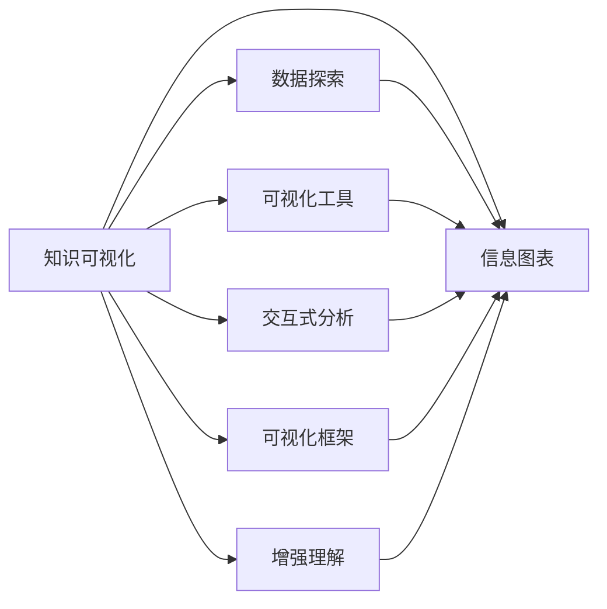

                 

# 知识的可视化：增强理解的有效工具

> 关键词：知识可视化, 增强理解, 数据探索, 信息图表, 可视化工具, 交互式分析, 可视化框架

## 1. 背景介绍

### 1.1 问题由来
随着互联网的普及和信息技术的快速发展，人类社会的知识和信息总量呈爆炸性增长。面对海量且异构的数据，人们亟需有效的工具来帮助理解和分析这些信息。特别是对于专业领域的知识，例如科学、工程、金融等，传统的阅读和手工记录方式已难以应对复杂的结构和关联性。知识的可视化，作为一种直观且易于理解的方式，逐渐成为数据探索和分析的关键手段。

### 1.2 问题核心关键点
知识可视化是借助图形、图表、动画等形式，将复杂的数据信息以视觉化的方式呈现出来，以增强理解、发现规律和促进创新。其核心在于利用视觉化的方式将信息从二维（如文本）扩展到三维（图形），使得信息更加直观和易记。

这一技术在教育、科学、工程、金融等领域都有广泛应用。例如，在教育领域，通过可视化可以将抽象的数学和科学概念以图形形式展现，帮助学生更好地理解复杂概念。在科学领域，可视化可以帮助科学家发现数据中的模式和异常，加速研究进程。在金融领域，可视化则可用于风险评估、投资分析等应用。

### 1.3 问题研究意义
知识的可视化不仅能够帮助人们更直观地理解复杂数据，还能够促进跨学科合作、加速知识共享和创新。通过可视化，不同背景、不同领域的专业人士可以更容易地沟通和理解，从而推动科学发现和技术进步。

此外，知识的可视化还能够在教育、培训、市场营销等领域提供有效支持，帮助用户更好地掌握知识，提升学习和工作效率。对于企业来说，利用可视化工具进行数据分析和业务决策，可以提高决策效率和业务洞察力，从而提升市场竞争力。

## 2. 核心概念与联系

### 2.1 核心概念概述

知识可视化涉及多个关键概念和技术，以下将详细阐述这些概念：

- **知识可视化**：通过图形、图表、动画等形式，将复杂的数据信息以视觉化的方式呈现出来，以增强理解、发现规律和促进创新。
- **数据探索**：利用数据可视化技术，对数据集进行探索性分析，发现数据中的模式、异常和关联性。
- **信息图表**：将数据信息以图形化的形式表示，使数据更加直观和易于理解。
- **可视化工具**：提供数据可视化的软件和库，帮助用户进行数据探索和分析。
- **交互式分析**：通过交互式界面，用户可以动态调整图表参数，实时观察数据变化。
- **可视化框架**：提供标准化的接口和工具，支持多样化的数据可视化应用开发。

这些概念之间存在密切联系，共同构成了知识可视化的基础。通过理解这些概念，可以更好地掌握知识可视化的原理和应用。

### 2.2 核心概念原理和架构的 Mermaid 流程图



上述Mermaid流程图展示了知识可视化的核心概念及其相互联系。知识可视化从数据探索出发，通过信息图表、可视化工具、交互式分析和可视化框架，最终实现增强理解的目标。

## 3. 核心算法原理 & 具体操作步骤

### 3.1 算法原理概述

知识可视化的核心算法原理涉及图形理论、信息学、数据科学等多个领域。以下是主要算法原理的概述：

- **图形表示法**：利用图形学技术，将数据结构转换为图形形式，通过节点和边表示数据元素和关联关系。
- **信息图表设计**：通过视觉设计原则，如色彩、大小、布局等，优化信息图表的表现力，使信息更加易读和易懂。
- **交互式界面设计**：通过交互式界面，如滑块、按钮、鼠标事件等，支持用户动态调整参数，实时观察数据变化。
- **可视化算法**：包括但不限于聚类、图嵌入、多维缩放等，用于提取数据中的模式和关联性，并转换为可视化形式。

### 3.2 算法步骤详解

知识可视化的操作步骤包括以下几个关键步骤：

**Step 1: 数据准备**
- 收集和预处理数据集，确保数据的质量和完整性。
- 根据需求选择合适的数据可视化工具或库，如D3.js、Tableau、Python的matplotlib等。

**Step 2: 选择可视化形式**
- 根据数据的特点和需求，选择合适的可视化形式，如图表、地图、网络图等。
- 设计视觉元素，如颜色、大小、形状等，以增强信息的展示效果。

**Step 3: 实现可视化**
- 利用选择的工具或库，编写代码实现数据可视化。
- 进行交互式设计，允许用户动态调整参数，实时观察数据变化。

**Step 4: 分析和解释**
- 根据可视化结果，进行数据探索和分析，发现数据中的模式和关联性。
- 对结果进行解释，提出有意义的结论和建议。

### 3.3 算法优缺点

知识可视化作为一种数据探索和分析手段，具有以下优点：

- **直观性**：图形化的展示方式比纯文本更直观易懂，有助于快速理解数据。
- **交互性**：交互式界面使用户能够动态调整参数，实时观察数据变化，提供更深入的探索能力。
- **多样性**：支持多种可视化形式，如散点图、柱状图、网络图等，适用于不同类型的数据。

但知识可视化也存在一些缺点：

- **过拟合**：过度复杂的可视化形式可能会掩盖数据中的关键信息，导致误导性分析。
- **信息过载**：过多的数据细节可能使信息难以消化，反而降低理解能力。
- **技术门槛**：实现高质量的知识可视化需要一定的技术能力和时间成本。

### 3.4 算法应用领域

知识可视化在多个领域都有广泛应用：

- **科学和工程**：通过可视化探索复杂的数据结构和关联性，加速科学发现和技术创新。
- **商业分析**：用于市场分析、客户关系管理、销售预测等，帮助企业做出更准确的商业决策。
- **教育**：通过可视化解释抽象的数学和科学概念，提升学生理解能力。
- **医疗**：可视化医学数据，帮助医生进行诊断和治疗决策。
- **金融**：用于风险评估、投资分析等，辅助金融决策。

## 4. 数学模型和公式 & 详细讲解 & 举例说明

### 4.1 数学模型构建

知识可视化通常涉及多种数学模型和公式，以下以散点图为例，介绍其数学模型构建和公式推导过程。

假设有一个二维数据集 $(x_1, y_1), (x_2, y_2), \ldots, (x_n, y_n)$，我们希望将其以散点图的形式展示出来。

散点图的数学模型可以表示为：

$$
\begin{aligned}
&S = \{(x_i, y_i)\} \\
&S \subset \mathbb{R}^2
\end{aligned}
$$

其中 $S$ 表示数据集，$x_i$ 和 $y_i$ 分别表示数据点的横纵坐标。

### 4.2 公式推导过程

散点图的绘制过程可以描述为以下几个步骤：

1. 选择横纵坐标轴的取值范围，并根据数据集确定坐标轴刻度。
2. 根据数据集中的每个点，在坐标轴上绘制对应的点。
3. 连接相邻的点，形成数据集的整体形态。

以简单的二维线性回归为例，假设我们已知一组数据 $(x_1, y_1), (x_2, y_2), \ldots, (x_n, y_n)$，希望通过散点图发现它们之间的关系。

根据线性回归的原理，我们可以将 $y_i$ 表示为 $x_i$ 的线性函数：

$$
y_i = \beta_0 + \beta_1x_i + \epsilon_i
$$

其中 $\beta_0$ 和 $\beta_1$ 为回归系数，$\epsilon_i$ 为误差项。

通过最小二乘法，我们可以求得回归系数 $\beta_0$ 和 $\beta_1$，并在散点图上绘制回归线。

### 4.3 案例分析与讲解

以网络图为例，分析知识可视化在科学网络分析中的应用。

在科学领域，研究者之间的合作网络通常表示为网络图，其中节点表示研究者，边表示合作关系。通过可视化网络图，可以发现研究者之间的合作模式、合作强度和影响力等。

网络图的可视化通常涉及多个数学模型，如度中心性、接近中心性等，用于分析网络中的关键节点和关系。通过可视化网络图，研究者可以更直观地理解科学合作网络的结构和特性，发现隐藏在数据中的科学合作规律和趋势。

## 5. 项目实践：代码实例和详细解释说明

### 5.1 开发环境搭建

为了实现知识可视化，我们需要搭建一个适合的数据可视化开发环境。以下提供一个Python开发环境搭建示例：

```bash
# 创建虚拟环境
python -m venv myenv

# 激活虚拟环境
source myenv/bin/activate

# 安装相关库
pip install numpy pandas matplotlib seaborn networkx scipy jupyter
```

### 5.2 源代码详细实现

以下是一个简单的Python代码示例，用于绘制散点图和回归线：

```python
import matplotlib.pyplot as plt
import numpy as np
import seaborn as sns
import statsmodels.api as sm

# 生成随机数据
np.random.seed(0)
x = np.random.normal(0, 1, 100)
y = 2*x + np.random.normal(0, 1, 100)

# 绘制散点图
plt.scatter(x, y)

# 绘制回归线
model = sm.OLS(y, np.column_stack((x, np.ones(100)))).fit()
sns.regplot(x, y, model)

plt.show()
```

### 5.3 代码解读与分析

上述代码实现了以下功能：

1. 生成随机数据集，包含100个样本点。
2. 绘制散点图，展示数据点的分布情况。
3. 使用线性回归模型拟合数据，并绘制回归线。

通过散点图和回归线的对比，可以直观地理解数据集中的线性关系。

### 5.4 运行结果展示

运行上述代码，将得到如下结果：


可以看到，散点图中的点大致呈线性分布，而回归线较好地拟合了数据点。

## 6. 实际应用场景

### 6.1 科学合作网络可视化

在科学合作研究中，可视化研究者之间的合作网络，可以揭示研究领域的热点和前沿方向。通过分析合作网络的中心性、网络密度等特征，可以发现关键研究者和研究机构，指导未来的研究方向和合作策略。

### 6.2 金融市场趋势可视化

金融市场中，股票、基金等投资品种的价格波动常常是市场参与者关注的焦点。通过可视化股票价格的历史走势，可以发现市场趋势、识别交易机会，辅助投资决策。

### 6.3 消费者行为分析

在市场营销中，通过可视化消费者的购买行为，可以发现购买趋势、识别高价值客户，指导企业制定更有效的市场营销策略。

## 7. 工具和资源推荐

### 7.1 学习资源推荐

为了帮助开发者系统掌握知识可视化的理论基础和实践技巧，以下推荐一些优质的学习资源：

1. 《数据可视化实战》一书：详细介绍了数据可视化的理论和实践，包括散点图、柱状图、网络图等多种可视化形式。
2. Tableau、Power BI等商业可视化工具的官方文档和教程，提供丰富的案例和应用场景。
3. Python的matplotlib、seaborn、plotly等可视化库的官方文档和示例代码，适用于多种数据可视化需求。
4. Coursera上的《数据可视化》课程，提供系统化的知识可视化学习路径。
5. D3.js、ECharts等前端可视化库的官方文档和社区资源，适用于网页应用中的可视化实现。

通过这些资源的学习实践，相信你一定能够快速掌握知识可视化的精髓，并用于解决实际问题。

### 7.2 开发工具推荐

高效的数据可视化开发离不开优秀的工具支持。以下是几款常用的工具：

1. Python的matplotlib、seaborn、plotly等可视化库，支持丰富的数据可视化形式，易于集成到Python应用中。
2. Tableau、Power BI等商业可视化工具，提供直观的拖放式界面，支持多数据源的可视化分析。
3. D3.js、ECharts等前端可视化库，支持高度定制化的数据可视化，适用于网页应用中的可视化实现。
4. Google Charts、Highcharts等图表库，提供易用的API接口，支持快速开发数据可视化应用。
5. Jupyter Notebook、Google Colab等交互式开发环境，支持实时展示和调试可视化结果。

合理利用这些工具，可以显著提升数据可视化的开发效率，加快创新迭代的步伐。

### 7.3 相关论文推荐

知识可视化的发展源于学界的持续研究。以下是几篇奠基性的相关论文，推荐阅读：

1. 《信息图表设计原则》：探讨信息图表的设计方法和原则，提供实用的设计建议。
2. 《科学合作网络分析》：分析科学合作网络的结构和特性，揭示研究领域的热点和前沿方向。
3. 《数据可视化在金融中的应用》：讨论数据可视化在金融市场分析和投资决策中的应用。
4. 《网络图可视化技术综述》：综述网络图可视化的算法和技术，提供多种实现方法。

这些论文代表了知识可视化技术的发展脉络。通过学习这些前沿成果，可以帮助研究者把握学科前进方向，激发更多的创新灵感。

## 8. 总结：未来发展趋势与挑战

### 8.1 总结

本文对知识可视化技术进行了全面系统的介绍。首先阐述了知识可视化的背景和意义，明确了其在多个领域中的应用价值。其次，从原理到实践，详细讲解了知识可视化的数学模型和操作步骤，给出了完整的代码实现示例。同时，本文还广泛探讨了知识可视化在科学、金融、市场营销等多个行业领域的应用前景，展示了知识可视化的广阔前景。

通过本文的系统梳理，可以看到，知识可视化作为一种数据探索和分析手段，在提升信息理解能力、促进跨领域合作等方面具有重要意义。利用知识可视化技术，可以更好地处理和理解复杂数据，推动数据驱动的决策和创新。

### 8.2 未来发展趋势

展望未来，知识可视化技术将呈现以下几个发展趋势：

1. **交互性和动态性**：未来知识可视化将更加注重交互性和动态性，用户可以通过交互界面实时调整参数，动态观察数据变化。
2. **多模态数据融合**：未来的知识可视化将支持多模态数据融合，将文本、图像、声音等多种数据形式统一展示，提供更全面的数据分析视角。
3. **深度学习的应用**：利用深度学习技术进行数据探索和分析，提供更加智能和自动化的知识可视化方法。
4. **可解释性增强**：未来的知识可视化将更加注重可解释性，通过提供详细的图表注释和数据解释，增强用户对分析结果的理解。
5. **大规模数据支持**：知识可视化将能够处理大规模数据集，支持复杂数据结构的探索和分析，提升数据处理能力。

以上趋势凸显了知识可视化技术的广阔前景。这些方向的探索发展，将进一步提升知识可视化的实用性和智能化水平，为数据驱动的决策和创新提供更加有力支持。

### 8.3 面临的挑战

尽管知识可视化技术已经取得了显著进展，但在迈向更加智能化、普适化应用的过程中，它仍面临诸多挑战：

1. **数据质量和多样性**：数据质量和多样性直接影响到知识可视化的效果，如何处理噪声数据、缺失值和异常值，需要进一步探索。
2. **交互性和可理解性**：复杂的数据集和分析过程可能会增加交互界面的设计难度，如何提供易于理解的界面和工具，需要进一步优化。
3. **可扩展性和效率**：对于大规模数据集和高维数据，知识可视化的实现效率和可扩展性仍需进一步提升。
4. **伦理和隐私问题**：数据可视化的过程中，如何保护数据隐私和伦理问题，需要进一步关注和解决。
5. **自动化和智能化**：如何利用机器学习和人工智能技术，实现知识可视化的自动化和智能化，需要进一步研究和实践。

### 8.4 研究展望

未来的研究需要在以下几个方面寻求新的突破：

1. **自动化数据探索**：开发自动化数据探索工具，帮助用户快速发现数据中的模式和关联性，提高数据探索效率。
2. **智能可视化算法**：引入深度学习、因果推断等智能算法，提升知识可视化的智能化水平。
3. **多模态数据融合**：探索多模态数据融合技术，将文本、图像、声音等多种数据形式统一展示，提升知识可视化的综合分析能力。
4. **可视化工具集成**：开发统一的可视化框架和工具，支持多种数据可视化形式和分析需求。
5. **伦理和隐私保护**：在知识可视化的设计和实现中，引入伦理和隐私保护机制，保障数据的安全和合规性。

这些研究方向的探索，将进一步推动知识可视化技术的发展，为数据驱动的决策和创新提供更强大的支持。

## 9. 附录：常见问题与解答

**Q1：知识可视化是否适用于所有数据类型？**

A: 知识可视化适用于大多数数据类型，但需要根据数据的特点选择合适的可视化形式。例如，对于时间序列数据，可以采用折线图；对于树形结构数据，可以采用树形图。

**Q2：如何选择最优的知识可视化形式？**

A: 选择最优的知识可视化形式需要考虑数据的特点和分析需求。一般来说，可以采用以下步骤：
1. 了解数据类型和结构。
2. 确定分析目标和需求。
3. 选择适合的可视化形式，如散点图、柱状图、网络图等。
4. 根据分析结果，评估可视化效果，进一步优化和调整。

**Q3：如何设计交互式界面？**

A: 设计交互式界面需要考虑用户的使用习惯和需求，主要包括以下几个方面：
1. 提供清晰的引导和提示，帮助用户快速上手。
2. 设计灵活的参数调整选项，允许用户动态调整参数，实时观察数据变化。
3. 提供工具提示和帮助文档，帮助用户理解界面功能和操作方式。
4. 设计响应灵敏的界面，提升用户体验。

**Q4：如何进行数据预处理？**

A: 数据预处理是知识可视化的重要步骤，主要包括以下几个方面：
1. 数据清洗：处理缺失值、噪声数据和异常值，保证数据的质量。
2. 数据转换：将数据转换为可视化所需的格式，如标准化、归一化等。
3. 数据分组：将数据按需求进行分组，提高可视化的效率和效果。
4. 数据聚合：对数据进行聚合操作，减少数据的维度，提高可视化的可读性。

通过合理的数据预处理，可以提升知识可视化的效果，帮助用户更好地理解数据。

---

作者：禅与计算机程序设计艺术 / Zen and the Art of Computer Programming

