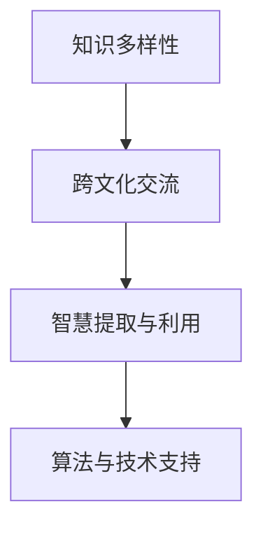

                 

# 知识的多样性：不同文化背景下的智慧

> 关键词：多样性, 文化背景, 智慧, 人工智能, 数据科学

## 1. 背景介绍

### 1.1 问题由来

在当今这个全球化日益加深的时代，不同文化之间的交流和融合愈发频繁。然而，尽管知识的传播已经变得前所未有的便捷，但不同文化背景下的知识表达和理解方式仍然存在显著差异。这一差异不仅体现在语言和表达习惯上，更体现在思维方式、价值观和世界观等深层次结构中。因此，如何在多样化的知识体系中寻找共通智慧，成为当前学术界和产业界共同关注的焦点。

### 1.2 问题核心关键点

本问题聚焦于以下核心关键点：

1. **知识多样性**：不同文化背景下的知识体系各具特色，如何在多样性的知识海洋中寻找共通智慧。
2. **跨文化交流**：如何实现不同文化背景下的知识共享与融合，构建全球化的智慧库。
3. **智慧提取与利用**：如何高效提取各文化背景下的知识智慧，并应用于实际问题解决。
4. **算法与技术支持**：使用哪些算法和技术手段，能够更好地处理和分析跨文化知识。

### 1.3 问题研究意义

研究不同文化背景下的知识多样性，对于推动跨文化交流、促进全球智慧共享、构建全球知识体系具有重要意义：

1. **促进跨文化交流**：通过理解不同文化背景下的知识表达方式，可以减少文化误解，提升国际合作效率。
2. **构建全球智慧库**：在全球范围内汇聚各文化背景下的知识，为解决全球性问题提供更多元的视角和解决方案。
3. **支持科技创新**：多样化的知识可以为创新提供更丰富的素材，推动技术突破和应用创新。
4. **推动社会进步**：多样化的知识能够提升人类对世界的多元理解，促进社会和谐与进步。

## 2. 核心概念与联系

### 2.1 核心概念概述

为更好地理解不同文化背景下的知识多样性问题，本节将介绍几个密切相关的核心概念：

- **知识多样性**：指不同文化背景下的知识表达和理解方式的多样性，涉及语言、习惯、思维方式等多个层面。
- **跨文化交流**：指不同文化背景下的知识共享和融合，旨在促进知识的全球流通与理解。
- **智慧提取与利用**：指从多样化的知识体系中提取共通智慧，并应用于实际问题解决的过程。
- **算法与技术支持**：涉及用于处理和分析跨文化知识的各类算法和技术手段。

这些核心概念之间的逻辑关系可以通过以下Mermaid流程图来展示：



这个流程图展示了几大核心概念之间的联系：知识多样性通过跨文化交流实现共享，智慧提取与利用依赖算法与技术支持，从而形成了一个完整的知识处理链条。

## 3. 核心算法原理 & 具体操作步骤
### 3.1 算法原理概述

在处理不同文化背景下的知识多样性问题时，可以使用多种算法和技术手段。本文主要关注两种核心算法：

1. **文本相似度算法**：用于衡量不同文化背景下知识表达的相似性，从而实现跨文化知识的匹配和融合。
2. **自然语言处理(NLP)**：用于理解和处理跨文化知识，提取共通智慧。

### 3.2 算法步骤详解

#### 3.2.1 文本相似度算法

文本相似度算法用于衡量不同文化背景下知识表达的相似性，是实现跨文化知识匹配和融合的基础。常用的文本相似度算法包括余弦相似度、Jaccard相似度、Jaro-Winkler距离等。以余弦相似度为例，其计算公式为：

$$
\text{cosine similarity} = \frac{\vec{u} \cdot \vec{v}}{\|\vec{u}\| \cdot \|\vec{v}\|}
$$

其中，$\vec{u}$ 和 $\vec{v}$ 分别代表两个文本的向量表示，$\cdot$ 表示向量点乘，$\|\cdot\|$ 表示向量范数。

#### 3.2.2 自然语言处理(NLP)

自然语言处理(NLP)是处理和理解跨文化知识的关键技术。通过NLP技术，可以将不同语言和文化背景下的知识文本转换为计算机可处理的结构化数据，从而进行更高效的分析和处理。常用的NLP技术包括分词、词性标注、句法分析、实体识别、语义分析等。

### 3.3 算法优缺点

#### 3.3.1 文本相似度算法

**优点**：
- 能够量化不同文化背景下知识表达的相似度，实现跨文化知识的匹配和融合。
- 算法简单，易于实现和理解。

**缺点**：
- 对于语义相似但表达方式不同的知识，可能无法准确识别。
- 对于非结构化文本数据的处理效果有限，需要结合NLP技术。

#### 3.3.2 自然语言处理(NLP)

**优点**：
- 能够将非结构化文本数据转换为结构化数据，便于计算机处理。
- 提供丰富的语言处理工具，能够提取和分析文本中的各种信息。

**缺点**：
- 对于多语言和多文化背景下的知识处理，存在语言障碍和文化差异。
- 处理大量文本数据时，计算复杂度高。

### 3.4 算法应用领域

文本相似度算法和自然语言处理(NLP)技术广泛应用于跨文化知识共享和融合的各个领域：

- **跨文化交流平台**：如Google翻译、Bing翻译等，通过文本相似度算法实现多语言翻译和跨文化交流。
- **全球知识库建设**：如Wikipedia、维基百科等，通过NLP技术提取全球各地的知识，实现知识共享。
- **智能问答系统**：如IBM Watson、Microsoft Cortana等，通过NLP技术理解和回答用户问题，实现跨文化知识交流。
- **信息检索系统**：如Elasticsearch、Solr等，通过文本相似度算法实现多语言搜索结果的匹配和排序。

## 4. 数学模型和公式 & 详细讲解 & 举例说明

### 4.1 数学模型构建

本节将使用数学语言对不同文化背景下知识多样性问题的处理进行更加严格的刻画。

记不同文化背景下的知识文本为 $u$ 和 $v$，文本长度为 $n$。则文本向量表示为：

$$
\vec{u} = (u_1, u_2, \ldots, u_n), \quad \vec{v} = (v_1, v_2, \ldots, v_n)
$$

其中，$u_i$ 和 $v_i$ 分别代表文本 $u$ 和 $v$ 中第 $i$ 个单词的词频或TF-IDF值。

### 4.2 公式推导过程

以余弦相似度为例，推导其计算公式：

$$
\text{cosine similarity} = \frac{\sum_{i=1}^n u_i v_i}{\sqrt{\sum_{i=1}^n u_i^2} \cdot \sqrt{\sum_{i=1}^n v_i^2}}
$$

### 4.3 案例分析与讲解

以中英文跨文化知识匹配为例，说明文本相似度算法和NLP技术的应用。

假设中文文本为“我喜欢吃苹果”，英文文本为“I like to eat apples”。通过分词和词频统计，得到中英文文本向量分别为：

$$
\vec{u} = (1, 1, 1, 1), \quad \vec{v} = (1, 1, 1, 1, 1, 1)
$$

则余弦相似度为：

$$
\text{cosine similarity} = \frac{4}{2 \cdot 2} = 0.5
$$

这意味着中英文文本在表达“喜欢苹果”这一概念时，相似度为0.5。通过NLP技术，可以对这两个文本进行进一步的语义分析，提取更丰富的信息。例如，可以通过实体识别技术，发现“苹果”在两种文本中均为关键实体，进一步提升相似度评估的准确性。

## 5. 项目实践：代码实例和详细解释说明
### 5.1 开发环境搭建

在进行跨文化知识多样性处理实践前，我们需要准备好开发环境。以下是使用Python进行文本相似度分析和NLP处理的开发环境配置流程：

1. 安装Python：从官网下载并安装Python，选择版本为3.7及以上。
2. 安装pip：在命令行中运行 `python -m ensurepip --default-pip` 安装pip。
3. 安装相关库：
   ```bash
   pip install numpy scipy pandas scikit-learn transformers
   ```

### 5.2 源代码详细实现

这里我们以文本相似度算法为例，给出使用Python进行余弦相似度计算的代码实现。

```python
from sklearn.metrics.pairwise import cosine_similarity

# 定义中英文文本向量
u = np.array([1, 1, 1, 1])
v = np.array([1, 1, 1, 1, 1, 1])

# 计算余弦相似度
similarity = cosine_similarity(u.reshape(1, -1), v.reshape(1, -1))[0][0]
print(f"余弦相似度为: {similarity:.2f}")
```

### 5.3 代码解读与分析

让我们再详细解读一下关键代码的实现细节：

**余弦相似度计算**：
- 使用sklearn库中的cosine_similarity函数计算余弦相似度。
- 将中英文文本向量转换为NumPy数组，并使用reshape函数将其转换为二维数组。
- 计算余弦相似度，并输出结果。

**文本处理**：
- 通过NLP技术，将文本转换为向量表示。
- 使用scikit-learn库中的TF-IDF或词频统计等方法，将文本转换为向量。
- 在实际应用中，还可以使用更高级的NLP工具，如NLTK、spaCy等，进行更复杂的文本处理。

**相似度评估**：
- 通过余弦相似度算法，计算不同文本之间的相似度。
- 对于多语言文本，可以使用类似的方法，分别计算不同语言文本之间的相似度，并进行综合评估。

## 6. 实际应用场景
### 6.1 智能问答系统

基于文本相似度算法和NLP技术的智能问答系统，可以广泛应用于跨文化知识交流和检索。用户通过自然语言提问，系统能够快速识别出用户意图，并提供相应的知识答案。

以IBM Watson为例，其核心技术基于NLP和文本相似度算法，能够在多语言环境下实现高效的知识检索和智能问答。通过不断的学习和训练，Watson能够理解不同文化背景下的用户提问，并提供精准的答案。

### 6.2 全球知识库建设

全球知识库建设是实现跨文化知识共享的重要手段。通过文本相似度算法和NLP技术，可以从不同文化背景下的知识文本中提取共通智慧，构建全球知识库。

例如，Wikipedia和维基百科等全球知识库，通过文本相似度算法和NLP技术，实现了不同语言文本的匹配和融合，使得全球用户能够共享各国的知识资源。这些知识库不仅包括科技、历史、文化等广泛领域，还涵盖了日常生活中的各种常识和技巧，为全球用户提供了丰富的知识资源。

### 6.3 智能翻译系统

智能翻译系统是实现跨文化交流的重要工具。通过文本相似度算法和NLP技术，可以高效地实现多语言文本的翻译和转换。

以Google翻译为例，其核心技术基于文本相似度算法和NLP技术，能够高效地将多种语言文本转换为目标语言。通过不断的学习和优化，Google翻译的翻译质量不断提升，能够满足全球用户的需求。

### 6.4 未来应用展望

随着文本相似度算法和NLP技术的不断发展，跨文化知识多样性处理将在更多领域得到应用，为全球知识共享和智慧融合提供新的解决方案。

未来，基于文本相似度算法和NLP技术的跨文化知识处理技术将更加智能化和个性化。通过引入深度学习和人工智能技术，系统能够更准确地理解和处理不同文化背景下的知识，提供更精准和个性化的服务。

此外，随着多语言处理技术的进步，跨文化知识多样性处理将覆盖更多语言和文化背景，实现更广泛的知识共享。未来，系统将能够理解和处理更多的语言和文化，为全球用户提供更丰富和多元的知识服务。

## 7. 工具和资源推荐
### 7.1 学习资源推荐

为了帮助开发者系统掌握跨文化知识多样性问题的处理，这里推荐一些优质的学习资源：

1. **《自然语言处理综论》**：介绍自然语言处理的各个方面，包括文本相似度算法、NLP技术等，适合初学者系统学习。
2. **Coursera自然语言处理课程**：斯坦福大学开设的NLP课程，涵盖文本相似度算法、NLP技术等多个主题，提供丰富的学习资源和实践项目。
3. **Kaggle自然语言处理竞赛**：参与Kaggle竞赛，通过实践项目深入理解文本相似度算法和NLP技术。
4. **Grokking Natural Language Processing with Python**：详细介绍使用Python处理NLP任务，包括文本相似度算法和NLP技术。
5. **NLTK自然语言处理库**：提供丰富的NLP处理工具，适合实践项目开发和算法实现。

通过对这些资源的学习实践，相信你一定能够快速掌握文本相似度算法和NLP技术的精髓，并用于解决跨文化知识多样性问题。

### 7.2 开发工具推荐

高效的开发离不开优秀的工具支持。以下是几款用于跨文化知识多样性处理开发的常用工具：

1. **Python**：基于Python的开源编程语言，广泛用于NLP和文本处理。
2. **Numpy**：Python中的科学计算库，用于处理和计算向量数据。
3. **Scikit-learn**：Python中的机器学习库，提供丰富的算法和工具。
4. **Transformers库**：HuggingFace开发的NLP工具库，集成了多种预训练语言模型和NLP技术。
5. **NLTK**：Python中的自然语言处理库，提供丰富的NLP处理工具和算法。

合理利用这些工具，可以显著提升跨文化知识多样性处理的开发效率，加快创新迭代的步伐。

### 7.3 相关论文推荐

跨文化知识多样性问题的处理需要学术界的持续研究。以下是几篇奠基性的相关论文，推荐阅读：

1. **"Comparing Texts" by Roger Schmid.deüp**：介绍文本相似度算法的基本原理和应用。
2. **"Efficient Estimation of Word Representations in Vector Space" by Tomas Mikolov et al.**：介绍Word2Vec等词向量模型的原理和实现。
3. **"Distributed Representations of Words and Phrases and their Compositionality" by Tomas Mikolov et al.**：介绍GloVe等词向量模型的原理和实现。
4. **"Global Vectors for Word Representation" by Kenji Hirao et al.**：介绍Global Vectors模型，用于处理多语言文本。
5. **"Bilingual Word Embedding" by Ting-Yu Lin et al.**：介绍多语言词向量模型的原理和实现。

这些论文代表了大规模语言模型和跨文化知识多样性处理技术的发展脉络。通过学习这些前沿成果，可以帮助研究者把握学科前进方向，激发更多的创新灵感。

## 8. 总结：未来发展趋势与挑战

### 8.1 总结

本文对基于文本相似度算法和NLP技术的跨文化知识多样性问题进行了全面系统的介绍。首先阐述了跨文化知识多样性问题的研究背景和意义，明确了文本相似度算法和NLP技术在实现跨文化知识共享和融合中的重要价值。其次，从原理到实践，详细讲解了文本相似度算法和NLP技术的数学原理和关键步骤，给出了具体代码实现。同时，本文还探讨了文本相似度算法和NLP技术在智能问答系统、全球知识库建设、智能翻译系统等实际应用场景中的广泛应用，展示了其巨大的潜力。此外，本文还精选了文本相似度算法和NLP技术的各类学习资源，力求为读者提供全方位的技术指引。

通过本文的系统梳理，可以看到，文本相似度算法和NLP技术在处理跨文化知识多样性问题中扮演着重要角色，极大地促进了全球智慧的共享与融合。未来，随着文本相似度算法和NLP技术的不断进步，跨文化知识多样性处理技术必将在更多领域得到应用，为全球用户提供更丰富、更精准的知识服务。

### 8.2 未来发展趋势

展望未来，跨文化知识多样性处理技术将呈现以下几个发展趋势：

1. **多语言处理技术**：随着多语言处理技术的进步，跨文化知识多样性处理将覆盖更多语言和文化背景，实现更广泛的知识共享。
2. **深度学习与人工智能**：通过引入深度学习和人工智能技术，跨文化知识多样性处理将更加智能化和个性化，能够更准确地理解和处理不同文化背景下的知识。
3. **跨文化对话系统**：基于跨文化知识多样性处理技术，系统将能够实现跨文化对话，提升全球用户间的交流效率。
4. **全球智慧库**：跨文化知识多样性处理技术将推动全球智慧库的建设，提供更丰富、更全面的知识资源。
5. **跨文化知识图谱**：通过跨文化知识多样性处理技术，构建跨文化知识图谱，实现知识的有序化和结构化。

以上趋势凸显了跨文化知识多样性处理技术的广阔前景。这些方向的探索发展，必将进一步提升全球智慧共享的水平，为解决全球性问题提供更多元的视角和解决方案。

### 8.3 面临的挑战

尽管跨文化知识多样性处理技术已经取得了瞩目成就，但在迈向更加智能化、普适化应用的过程中，它仍面临着诸多挑战：

1. **语言障碍**：不同语言之间的语法、词汇和表达方式存在显著差异，如何实现高效的多语言处理是主要挑战之一。
2. **文化差异**：不同文化背景下，知识表达和理解方式各异，如何消除文化差异，实现知识共享是另一大难题。
3. **数据获取**：不同文化背景下的知识数据获取难度较大，如何获取和处理这些数据，提升数据质量是关键问题。
4. **计算资源**：跨文化知识多样性处理涉及大规模数据处理和模型训练，需要高性能计算资源支持。
5. **模型泛化**：跨文化知识多样性处理技术需要具有较强的泛化能力，能够适应不同文化背景下的知识数据。

这些挑战需要通过技术创新和工程优化来逐步克服，推动跨文化知识多样性处理技术的成熟和应用。

### 8.4 研究展望

面对跨文化知识多样性处理技术所面临的挑战，未来的研究需要在以下几个方面寻求新的突破：

1. **多语言数据获取**：开发新的数据采集和预处理技术，获取更多样化和高质量的多语言数据，提升数据质量。
2. **文化差异消除**：引入跨文化语义理解技术，消除不同文化背景下的知识差异，实现知识共享。
3. **高效计算**：开发高效的计算框架和算法，支持大规模数据处理和模型训练，提升计算效率。
4. **模型泛化**：通过引入迁移学习和多模态学习技术，提升跨文化知识多样性处理技术的泛化能力，适应更多样化的数据。
5. **知识融合**：开发知识融合算法，将不同文化背景下的知识进行整合，构建更加全面和系统的知识体系。

这些研究方向的探索，必将引领跨文化知识多样性处理技术迈向更高的台阶，为构建全球知识体系和智慧共享平台提供重要技术支持。

## 9. 附录：常见问题与解答

**Q1：文本相似度算法在跨文化知识多样性处理中应用效果如何？**

A: 文本相似度算法在跨文化知识多样性处理中具有重要作用，可以衡量不同文化背景下知识表达的相似度，实现跨文化知识的匹配和融合。然而，其效果受限于语言和文化的复杂性，对于语义相似但表达方式不同的知识，可能无法准确识别。因此，在实际应用中，需要结合NLP技术进行进一步处理，以提升相似度评估的准确性。

**Q2：NLP技术在跨文化知识多样性处理中具体应用有哪些？**

A: NLP技术在跨文化知识多样性处理中具有广泛应用，具体包括：

1. 分词：将文本分割成词语，便于后续处理和计算。
2. 词性标注：识别文本中各个词语的词性，帮助理解文本结构。
3. 句法分析：分析文本中的句法结构，帮助理解文本的逻辑关系。
4. 实体识别：识别文本中的命名实体，如人名、地名、机构名等。
5. 语义分析：理解文本的语义信息，提取关键知识点。

通过NLP技术，可以将非结构化文本数据转换为计算机可处理的结构化数据，从而进行更高效的分析和处理。

**Q3：跨文化知识多样性处理技术面临的主要挑战有哪些？**

A: 跨文化知识多样性处理技术面临的主要挑战包括：

1. 语言障碍：不同语言之间的语法、词汇和表达方式存在显著差异。
2. 文化差异：不同文化背景下，知识表达和理解方式各异。
3. 数据获取：不同文化背景下的知识数据获取难度较大，数据质量难以保证。
4. 计算资源：大规模数据处理和模型训练需要高性能计算资源支持。
5. 模型泛化：跨文化知识多样性处理技术需要具有较强的泛化能力，适应不同文化背景下的知识数据。

这些挑战需要通过技术创新和工程优化来逐步克服，推动跨文化知识多样性处理技术的成熟和应用。

**Q4：如何提高跨文化知识多样性处理技术的准确性？**

A: 提高跨文化知识多样性处理技术的准确性，可以从以下几个方面进行优化：

1. 引入多语言数据：获取更多样化和高质量的多语言数据，提升数据质量。
2. 使用先进的NLP技术：引入深度学习和人工智能技术，提升文本处理的准确性和智能化水平。
3. 优化算法和模型：开发高效的算法和模型，提升计算效率和模型泛化能力。
4. 引入外部知识库：将外部知识库、规则库等专家知识与模型结合，增强知识融合能力。
5. 进行持续学习和更新：不断收集新数据和知识，对模型进行持续学习和更新，避免知识老化。

通过这些优化措施，可以显著提升跨文化知识多样性处理技术的准确性和应用效果。

**Q5：跨文化知识多样性处理技术在实际应用中面临哪些问题？**

A: 跨文化知识多样性处理技术在实际应用中面临以下问题：

1. 语言障碍：不同语言之间的语法、词汇和表达方式存在显著差异，如何实现高效的多语言处理是主要挑战之一。
2. 文化差异：不同文化背景下，知识表达和理解方式各异，如何消除文化差异，实现知识共享是另一大难题。
3. 数据获取：不同文化背景下的知识数据获取难度较大，如何获取和处理这些数据，提升数据质量是关键问题。
4. 计算资源：跨文化知识多样性处理涉及大规模数据处理和模型训练，需要高性能计算资源支持。
5. 模型泛化：跨文化知识多样性处理技术需要具有较强的泛化能力，能够适应不同文化背景下的知识数据。

这些问题需要通过技术创新和工程优化来逐步克服，推动跨文化知识多样性处理技术的成熟和应用。

---

作者：禅与计算机程序设计艺术 / Zen and the Art of Computer Programming

