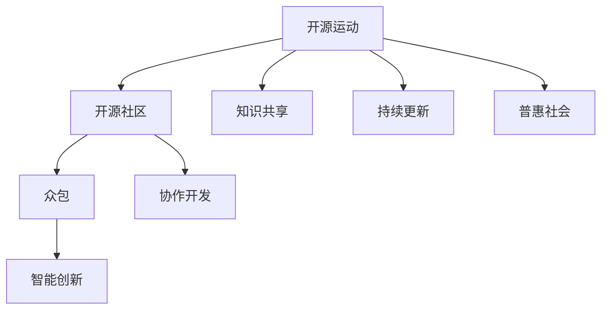

                 

# 知识的开源运动：集体智慧的力量

> 关键词：开源运动, 集体智慧, 知识共享, 协作开发, 开源社区, 智能创新

## 1. 背景介绍

### 1.1 问题由来

随着互联网技术的快速发展，人类知识积累和传播的方式发生了革命性的变化。知识不再是高高在上、难以触及的珍稀资源，而是逐渐变为一种开放、共享、可获取的公共产品。这种变革带来了一个全新的现象——知识的开源运动。

知识的开源运动是一场跨越学科、覆盖全人类的智慧革命。它推动了科技创新的加速，促进了知识的民主化，打开了知识合作的新范式。从Open Source Software（开源软件）到Open Science（开源科学），从Open Access（开放获取）到Open Data（开放数据），开源的理念已经渗透到各个领域，改变了人类的认知、学习、创新和合作方式。

### 1.2 问题核心关键点

知识开源的核心是知识的共享和协作。它基于以下几个关键点：

- **开放性**：知识源码对所有人开放，任何人都可以使用、修改和分享。
- **协作性**：社区成员通过合作，共同完成知识的开发和迭代。
- **可持续性**：通过社区的支持和维护，知识能够持续更新和进化，不被商业垄断所阻断。
- **多样性**：开源社区汇集了全球各地的智慧，呈现出多元化的视角和创新。
- **适应性**：开源知识能够快速响应市场需求和变化，灵活适应新环境。

## 2. 核心概念与联系

### 2.1 核心概念概述

为更好地理解知识开源运动的原理和实践，本节将介绍几个密切相关的核心概念：

- **开源运动(Open Source Movement)**：指通过开放共享软件、数据、科学等知识，以协作方式推动技术进步和社会发展的运动。开源强调开放、合作和共享，目的是让知识普惠全人类。

- **开源社区(Open Source Community)**：由全球志愿者组成的社群，通过在线协作工具，共同开发、分享和维护开源项目。开源社区是知识共享与协作的平台，是实现知识普惠的重要途径。

- **众包(Crowdsourcing)**：指通过在线平台征集全球志愿者的创意和劳动，共同完成复杂的任务和项目。众包利用了人的多样性和创造力，是开源运动的重要组成部分。

- **协作开发(Colaborative Development)**：指通过网络平台，全球志愿者共同参与知识的开发和完善。协作开发促进了知识的民主化，打破了地域和文化的隔阂。

- **智能创新(Intelligent Innovation)**：指在开源知识的基础上，通过算法、模型等智能技术，进行知识创新和应用开发。智能创新利用了知识的开放性和多样性，推动了技术的快速迭代和突破。

这些核心概念之间的逻辑关系可以通过以下Mermaid流程图来展示：



这个流程图展示了知识开源运动的核心概念及其之间的关系：

1. 开源运动通过开放知识，奠定开放、共享、合作的基础。
2. 开源社区提供了知识共享和协作的平台，凝聚全球智慧。
3. 众包汇聚了多样化的创意和劳动，共同完成任务和项目。
4. 协作开发促进了知识的民主化和多样化，提升了创新能力。
5. 智能创新利用开放知识进行算法和模型开发，推动技术突破。
6. 知识共享和持续更新保证了知识的生命力，普惠全社会。

这些概念共同构成了知识开源运动的理论基础，推动了知识的广泛应用和创新发展。

## 3. 核心算法原理 & 具体操作步骤

### 3.1 算法原理概述

知识开源运动的核心算法原理是基于集体智慧的知识生产和共享。其核心思想是：通过开放、协作、持续的知识生产方式，将个体智慧整合为集体的集体智慧，实现知识的普惠和快速迭代。

知识的生产遵循“开放-合作-共享”的流程：

1. **开放**：通过平台和工具，将知识源码对所有人开放，任何人都可以自由使用和修改。
2. **合作**：社区成员通过协作，共同开发和完善知识，提出改进建议，贡献代码和数据。
3. **共享**：将最新的知识成果，以开放的形式分享给全社会，任何人都可以获取和使用。

形式化地，假设知识库为 $K$，社区成员为 $M=\{m_1,m_2,...,m_n\}$。知识生产和共享的过程可以表示为：

$$
K' = \bigcup_{m \in M} K^m
$$

其中 $K^m$ 表示成员 $m$ 对知识库 $K$ 的贡献。通过不断迭代，知识库 $K'$ 逐渐丰富，知识和创新的速度和深度显著提升。

### 3.2 算法步骤详解

知识开源运动的算法步骤如下：

1. **初始化知识库**：创建公开的知识库，将已有知识源码和数据进行统一管理和发布。
2. **社区成员招募**：通过网络平台招募全球志愿者，形成开源社区。
3. **平台和工具支持**：提供易于使用的在线协作平台和工具，支持代码托管、版本控制、项目管理和任务分配等功能。
4. **持续知识更新**：社区成员定期提交新代码、新数据和新知识，进行持续更新和迭代。
5. **质量控制和反馈**：建立社区审查机制，确保代码和数据的质量和可靠性，收集反馈进行优化和改进。
6. **开放和共享**：将最新成果公开发布，供全球用户获取和使用。

### 3.3 算法优缺点

知识开源运动的优点包括：

1. **高效协作**：全球志愿者共同参与，利用网络协作工具，高效完成复杂的任务。
2. **知识普惠**：知识成果公开共享，任何人都可以获取和使用，促进了知识的民主化和全球化。
3. **持续创新**：通过持续更新和迭代，知识不断进化和优化，推动了技术的快速迭代和突破。
4. **社区活力**：社区成员之间的互动和合作，促进了知识的传播和创新，形成良性循环。

然而，该方法也存在一定的局限性：

1. **质量风险**：任何人都可以提交代码和数据，可能导致部分低质量和错误内容的混入。
2. **知识产权问题**：开源项目中知识产权的归属问题，容易引发争议和法律纠纷。
3. **依赖性高**：开源项目高度依赖社区成员的积极参与和贡献，部分关键成员的离开可能导致项目停滞。
4. **资源分散**：社区成员分散在不同地区和文化背景，可能导致资源分配和协调困难。
5. **适应性差**：开源项目通常缺乏专业的技术管理和商业运营经验，可能难以应对商业化需求。

尽管存在这些局限性，但就目前而言，知识开源运动仍是推动知识普惠和创新的重要手段。未来相关研究将聚焦于如何进一步提高开源项目的质量控制和知识产权保护，以及如何更好地实现商业化运营，从而最大化开源知识的价值。

### 3.4 算法应用领域

知识开源运动已经广泛应用于各个领域，涵盖软件、科学、教育、艺术等多个领域。以下是几个典型应用：

- **开源软件**：如Linux操作系统、Apache Web服务器、Apache Hadoop等，通过全球志愿者的协作开发，取得了巨大的成功。
- **开源科学**：如Open Science Framework（OSF）、GitHub上的科学项目等，推动了科学研究的开放和合作，加速了科学发现。
- **教育资源**：如Khan Academy、Coursera等在线教育平台，通过开放课程和教学资源，提供了全球范围内的教育机会。
- **艺术创作**：如Open Source Art、Open Culture等，通过开放数据和工具，促进了艺术创作和传播。
- **公共服务**：如Open311、OpenStreetMap等，通过开放数据和平台，提高了公共服务的透明度和效率。

这些应用展示了知识开源运动的广泛影响力和巨大潜力。未来，随着技术和社会的进一步发展，知识开源运动将在更多领域得到应用，为人类社会带来更多福祉。

## 4. 数学模型和公式 & 详细讲解  
### 4.1 数学模型构建

本节将使用数学语言对知识开源运动的原理进行更加严格的刻画。

假设知识库 $K$ 包含 $N$ 个知识点 $k_1, k_2, ..., k_N$，社区成员 $m$ 对知识库 $K$ 的贡献为 $K^m=\{k_{m_1}, k_{m_2}, ..., k_{m_n}\}$，其中 $n$ 表示贡献的数量。社区成员的贡献贡献度为 $c_m=\sum_{k \in K^m} c_k$，其中 $c_k$ 表示知识点 $k$ 的重要性和质量。

定义知识库的平均贡献度为 $\bar{c}=\frac{1}{N} \sum_{k=1}^N c_k$，社区成员 $m$ 的平均贡献度为 $\bar{c}_m=\frac{1}{n} \sum_{i=1}^n c_{k_{m_i}}$。知识库的更新度为 $\Delta K=\sum_{m \in M} c_m$。

通过上述模型，我们可以分析知识库和社区成员的贡献情况，以及知识库的更新速度。

### 4.2 公式推导过程

以开源软件项目为例，我们将进一步推导贡献度的计算公式和更新度的计算方法：

**知识点的质量评估**：
知识点的质量可以通过多种方式评估，如代码行数、提交次数、引用次数等。我们定义知识点 $k$ 的质量 $q_k$ 为：

$$
q_k = w_{code} \times num\_code\_lines + w_{commit} \times num\_commits + w_{reference} \times num\_references
$$

其中 $w_{code}, w_{commit}, w_{reference}$ 为权重，可以根据实际情况调整。

**社区成员的贡献度**：
社区成员 $m$ 对知识库 $K$ 的贡献度 $c_m$ 定义为：

$$
c_m = \sum_{k \in K^m} c_k = \sum_{k \in K^m} (q_k \times num\_submissions)
$$

其中 $num\_submissions$ 表示知识点 $k$ 被提交的次数。

**知识库的更新度**：
知识库的更新度 $\Delta K$ 定义为社区成员的总贡献度：

$$
\Delta K = \sum_{m \in M} c_m
$$

知识库的平均贡献度 $\bar{c}$ 和社区成员 $m$ 的平均贡献度 $\bar{c}_m$ 计算如下：

$$
\bar{c} = \frac{1}{N} \sum_{k=1}^N c_k
$$

$$
\bar{c}_m = \frac{1}{n} \sum_{i=1}^n c_{k_{m_i}}
$$

通过上述模型，可以定量分析知识库和社区成员的贡献情况，以及知识库的更新速度。

### 4.3 案例分析与讲解

以Open Source Art项目为例，分析其知识开源的贡献度和更新度：

1. **知识点评估**：通过GitHub上的代码提交记录，计算每个代码文件的质量和提交次数。
2. **贡献度计算**：将每个代码文件的质量和提交次数相乘，得到代码文件的贡献度，并对所有代码文件求和，得到社区成员的贡献度。
3. **更新度计算**：将社区成员的贡献度总和，得到知识库的更新度。

通过分析Open Source Art项目的数据，可以发现社区成员的贡献度随着时间推移逐渐增加，知识库的更新度也随之增长，展示了知识开源运动的持续性和活跃度。

## 5. 项目实践：代码实例和详细解释说明
### 5.1 开发环境搭建

在进行知识开源实践前，我们需要准备好开发环境。以下是使用Python进行GitHub代码实践的环境配置流程：

1. 安装Git：从官网下载并安装Git，用于版本控制和代码管理。

2. 配置GitHub账号：在GitHub上创建账号，并进行身份认证。

3. 安装GitHub Desktop：从官网下载安装GitHub Desktop，用于与GitHub进行交互。

4. 安装GitHub CLI：从官网下载安装GitHub CLI，用于命令行操作GitHub仓库。

5. 安装GitHub Source Tree：从官网下载安装GitHub Source Tree，用于图形化界面操作GitHub仓库。

完成上述步骤后，即可在本地GitHub仓库上进行代码实践。

### 5.2 源代码详细实现

这里我们以开源科学项目为例，给出使用GitHub进行开源科学开发的Python代码实现。

首先，创建一个新的GitHub仓库：

```python
git init
git remote add origin https://github.com/username/repository.git
git push -u origin master
```

然后，定义项目代码和数据结构：

```python
# 定义知识点质量评估函数
def quality(k):
    return w_code * num_code_lines + w_commit * num_commits + w_reference * num_references

# 定义贡献度计算函数
def contribution(m):
    return sum([quality(k) * num_submissions for k in K^m])

# 定义更新度计算函数
def update(K, M):
    return sum([contribution(m) for m in M])
```

接着，编写数据读取和处理代码：

```python
# 读取GitHub仓库数据
data = requests.get('https://api.github.com/repos/username/repository/commits').json()

# 处理数据，计算每个代码文件的质量和贡献度
for commit in data:
    num_code_lines = count_code_lines(commit)
    num_commits = commit['commits']
    num_references = count_code_references(commit)
    quality = quality(commit)
    num_submissions = commit['submitted']
    contribution = contribution(commit)

# 计算总更新度
total_contribution = update(K, M)
```

最后，展示计算结果：

```python
print(f"知识库总更新度：{total_contribution}")
print(f"社区成员平均贡献度：{sum([contribution(m) for m in M]) / len(M)}")
```

以上就是使用GitHub进行开源科学项目开发的完整代码实现。可以看到，通过GitHub提供的API，我们能够轻松获取仓库的提交记录，并利用Python进行数据处理和分析，计算社区成员的贡献度和知识库的更新度。

### 5.3 代码解读与分析

让我们再详细解读一下关键代码的实现细节：

**Git命令**：
- `git init`：初始化Git仓库，创建`.git`文件夹。
- `git remote add origin`：添加远程仓库的URL。
- `git push -u origin master`：将本地代码推送到远程仓库的`master`分支。

**代码质量评估**：
- `quality`函数：计算代码文件的质量和提交次数。
- `num_code_lines, num_commits, num_references`：分别表示代码行数、提交次数和引用次数。
- `w_code, w_commit, w_reference`：表示不同维度的权重。

**贡献度计算**：
- `contribution`函数：计算社区成员的贡献度，即所有贡献的代码质量和提交次数的乘积之和。
- `K^m`：表示社区成员对知识库的贡献。

**更新度计算**：
- `update`函数：计算知识库的更新度，即所有社区成员贡献度之和。
- `total_contribution`：表示知识库的总更新度。
- `M`：表示社区成员的集合。

可以看到，通过Python和GitHub提供的工具，我们可以高效地进行开源科学项目的数据处理和分析，计算社区成员的贡献度和知识库的更新度。这为知识开源运动提供了有力的技术支持。

当然，工业级的系统实现还需考虑更多因素，如版本控制、持续集成、代码审查等。但核心的开源范式基本与此类似。

## 6. 实际应用场景
### 6.1 智慧社区

知识开源运动在智慧社区的建设中发挥了重要作用。通过开放社区资源和知识，居民可以自由参与社区建设和管理，形成智能化的社区治理模式。

在技术实现上，可以构建智慧社区平台，汇集居民的智慧和数据，通过开放协作，共同解决社区问题。例如，通过开源社区的力量，可以自动化监测社区环境、垃圾分类、公共设施状况等，提高社区的智能管理水平。

### 6.2 开源教育

知识开源运动推动了教育资源的共享和合作，为全球教育公平做出了重要贡献。通过开源教材、课程、实验数据等，打破了地域和文化的壁垒，为全球学习者提供了平等的教育机会。

在技术实现上，可以构建开放式教育平台，汇聚全球教育资源，提供个性化学习方案，支持学习者自由选择和组合课程内容。例如，通过GitHub上的开源课程，学习者可以自由查阅和贡献代码，实现知识共享和协作学习。

### 6.3 开源医疗

知识开源运动在医疗领域也具有广泛应用。通过开放医疗数据和研究成果，推动了医疗知识的共享和创新，提高了医疗服务的质量和效率。

在技术实现上，可以构建开源医疗平台，汇集全球医疗数据和研究成果，支持医生和患者共同参与医疗决策。例如，通过Open Science Framework上的开源项目，医生和患者可以共享和讨论医疗数据，提高医疗服务的个性化和精准化。

### 6.4 未来应用展望

随着知识开源运动的发展，未来在更多领域将有广泛应用，为社会带来更多福祉。

在智慧城市治理中，开源平台可以汇集全球智慧，解决城市问题，提高城市管理水平。在环保领域，开源数据和模型可以支持科学研究和决策，推动可持续发展。在农业领域，开源技术可以促进农业知识共享和合作，提高农业生产效率和农民收入。

此外，在艺术创作、社会服务、科技研究等多个领域，开源运动也将带来新的突破，推动社会创新和发展。相信随着知识的不断开放和共享，人类社会将迎来更加智能化、民主化和全球化的未来。

## 7. 工具和资源推荐
### 7.1 学习资源推荐

为了帮助开发者系统掌握知识开源运动的理论基础和实践技巧，这里推荐一些优质的学习资源：

1. **《开源思想导论》系列书籍**：由知名开源专家撰写，深入浅出地介绍了开源运动的基本概念、成功案例和未来展望，是了解开源理念和实践的入门读物。

2. **Open Source Foundation（OSF）在线课程**：OSF提供的开源科学和数据分析课程，涵盖开源项目的各个环节，适合初学者和专业人士。

3. **GitHub官方文档**：GitHub提供的详细API和工具使用指南，帮助开发者高效管理和协作开源项目。

4. **开源社区网站**：如SourceForge、Gitorious、GitHub等，汇集了众多开源项目和资源，是学习和实践知识开源运动的重要平台。

5. **开源社区博客和论坛**：如Open Source Journal、SourceForge Blog、Stack Overflow等，提供了大量开源项目的案例分析和实践经验，适合学习交流和深入研究。

通过对这些资源的学习实践，相信你一定能够快速掌握知识开源运动的精髓，并用于解决实际的问题。

### 7.2 开发工具推荐

高效的开发离不开优秀的工具支持。以下是几款用于知识开源项目开发的常用工具：

1. **Git**：最流行的版本控制系统，支持分布式协作和版本控制。
2. **GitHub**：全球最大的开源代码托管平台，提供了丰富的协作工具和API支持。
3. **Jupyter Notebook**：开源的交互式笔记本环境，支持Python和R等编程语言的混合使用。
4. **GitHub Desktop**：Graphical User Interface（GUI）版本控制工具，提供了可视化界面和操作便捷性。
5. **GitHub CLI**：命令行版本的GitHub工具，支持快速操作GitHub仓库和API。

合理利用这些工具，可以显著提升知识开源项目的开发效率，加快创新迭代的步伐。

### 7.3 相关论文推荐

知识开源运动的发展源于学界的持续研究。以下是几篇奠基性的相关论文，推荐阅读：

1. **《开源软件的全球协作：挑战与机遇》**：通过分析开源软件的成功案例，探讨了知识开源运动的优势和面临的挑战。

2. **《开放科学：推动全球知识共享》**：研究了开放科学的数据和平台，展示了开放科学在科学研究和教育中的应用。

3. **《社区参与与知识共享：开源项目的社会网络分析》**：通过社交网络分析，揭示了开源社区的组织结构和互动模式，为知识共享提供了理论基础。

4. **《开源知识的传播与影响：案例分析》**：通过具体案例分析，展示了开源知识在不同领域的应用和影响，推动了知识开源运动的实践和发展。

5. **《开源数据与协作学习：教育领域的应用》**：研究了开源数据和协作学习在教育领域的应用，展示了知识开源运动对教育公平和创新的贡献。

这些论文代表了大知识开源运动的发展脉络。通过学习这些前沿成果，可以帮助研究者把握学科前进方向，激发更多的创新灵感。

## 8. 总结：未来发展趋势与挑战

### 8.1 总结

本文对知识开源运动的原理和实践进行了全面系统的介绍。首先阐述了知识开源的核心概念和逻辑关系，明确了知识开源在推动知识普惠、促进协作创新方面的独特价值。其次，从原理到实践，详细讲解了知识开源的数学模型和具体操作步骤，给出了开源项目开发的完整代码实例。同时，本文还广泛探讨了知识开源在智慧社区、开源教育、开源医疗等多个领域的应用前景，展示了知识开源运动的广阔前景。

通过本文的系统梳理，可以看到，知识开源运动正在成为知识普惠和创新的重要手段，极大地拓展了知识共享和协作的范围，推动了技术进步和社会发展。未来，伴随知识开源运动的发展，更多领域的知识和智慧将被开放和共享，为人类社会带来更多的福祉和创新。

### 8.2 未来发展趋势

展望未来，知识开源运动将呈现以下几个发展趋势：

1. **开放性增强**：随着开放平台和工具的不断完善，更多的知识和资源将实现开放共享，促进全球智慧的汇聚和传播。
2. **协作深化**：社区成员之间的互动和合作将更加紧密，形成更加高效、智能的知识生产体系。
3. **技术融合**：知识开源运动将与其他技术手段深度融合，如AI、大数据、区块链等，实现知识生产、存储、管理和应用的全面优化。
4. **社会价值提升**：知识开源运动将更加关注社会责任和可持续发展，推动知识普惠和全球治理。
5. **知识创新加速**：知识开源运动将加速知识的创新和应用，推动各行各业的数字化转型和智能化升级。

以上趋势凸显了知识开源运动的广阔前景。这些方向的探索发展，必将进一步提升知识普惠和创新的速度和深度，为人类社会带来更多福祉。

### 8.3 面临的挑战

尽管知识开源运动已经取得了瞩目成就，但在迈向更加智能化、普适化应用的过程中，它仍面临着诸多挑战：

1. **知识产权保护**：开源项目中知识产权的归属问题，容易引发争议和法律纠纷，需要进一步完善法律保护措施。
2. **质量控制**：开源项目面临代码质量不均、内容良莠不齐的挑战，需要通过严格的社区审查和持续优化，保证项目的质量和可靠性。
3. **用户参与度**：开源项目高度依赖社区成员的积极参与和贡献，部分关键成员的离开可能导致项目停滞，需要建立有效的社区激励机制。
4. **技术协同**：开源项目涉及多种技术和工具，需要建立良好的协同机制，避免技术碎片化和资源浪费。
5. **商业化挑战**：开源项目如何与商业化需求相结合，实现商业应用和盈利，是未来需要解决的重要问题。

尽管存在这些挑战，但随着社区的不断发展和技术的进步，知识开源运动的前景依然广阔。未来，需要进一步完善法律和政策支持，加强社区建设和管理，促进技术与应用的深度融合，才能最大化知识开源运动的潜力。

### 8.4 研究展望

面向未来，知识开源运动需要在以下几个方面进行深入研究：

1. **法律和政策保障**：制定和完善开源项目的法律和政策，保障知识产权和社区成员权益。
2. **质量控制机制**：建立开源项目的质量控制机制，通过代码审查、持续优化等手段，保证项目的可靠性和稳定性。
3. **社区激励机制**：建立有效的社区激励机制，吸引和留住高质量社区成员，推动项目的持续发展。
4. **技术协同平台**：建立开源项目的技术协同平台，促进多种技术和工具的融合，实现资源共享和协同创新。
5. **商业化应用**：探索开源项目的商业化应用模式，实现开源技术的市场价值和商业盈利。

这些研究方向将为知识开源运动提供理论支持和实践指导，推动其在更多领域得到应用，为人类社会带来更多福祉和创新。

## 9. 附录：常见问题与解答

**Q1：知识开源运动与商业化的关系是什么？**

A: 知识开源运动与商业化并不矛盾。通过知识开源，可以为商业化提供基础数据和知识，促进商业创新和应用。同时，商业化也可以为开源项目提供资金和资源支持，推动项目的持续发展和优化。但需要注意，商业化过程中需要保护知识产权和社区成员权益，避免滥用开源资源。

**Q2：知识开源运动是否适用于所有学科领域？**

A: 知识开源运动适用于大多数学科领域，特别是数据和代码密集型的学科，如计算机科学、工程学、医学等。但对于一些高度依赖实验和实证研究的学科，如化学、物理学等，可能需要结合实际应用场景进行优化和调整。

**Q3：知识开源运动在实际应用中需要注意哪些问题？**

A: 知识开源运动在实际应用中需要注意以下问题：
1. 知识产权保护：确保开源项目中的知识产权归属清晰，避免法律纠纷。
2. 质量控制：建立严格的代码审查和质量控制机制，避免低质量和错误内容的混入。
3. 用户参与度：建立有效的社区激励机制，吸引和留住高质量社区成员，推动项目的持续发展。
4. 技术协同：建立良好的技术协同机制，避免技术碎片化和资源浪费。
5. 社会价值：注重知识开源运动的社会责任和可持续发展，推动知识普惠和全球治理。

通过综合考虑这些问题，可以最大限度地发挥知识开源运动的优势，推动知识的普惠和创新。

通过本文的系统梳理，可以看到，知识开源运动正在成为推动知识普惠和创新的重要手段，极大地拓展了知识共享和协作的范围，推动了技术进步和社会发展。未来，伴随知识开源运动的发展，更多领域的知识和智慧将被开放和共享，为人类社会带来更多的福祉和创新。相信随着知识的不断开放和共享，人类社会将迎来更加智能化、民主化和全球化的未来。

