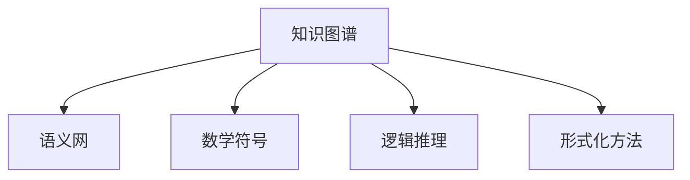

                 

# 知识的形式化：数学语言与逻辑表达

> 关键词：知识图谱,语义网,数学符号,逻辑推理,人工智能,知识工程

## 1. 背景介绍

在信息爆炸的数字化时代，如何有效地组织、管理和利用知识资源，已经成为科技和商业领域亟待解决的问题。传统的文档、数据库等存储方式，难以满足对知识复杂性和语义丰富性的需求。随着人工智能和知识工程的兴起，人们开始探索用形式化的方式来表示和处理知识，其中数学语言和逻辑表达是最为核心的工具。

### 1.1 问题由来

知识的形式化最早可以追溯到亚里士多德的逻辑学和欧几里得的几何学。这些经典学科使用精确的数学语言和严谨的逻辑推理，建立了强大的理论体系。然而，随着计算机技术的出现，知识的形式化开始向数字领域拓展，逐步形成了现代知识图谱和语义网的概念。

在现代人工智能中，知识图谱（Knowledge Graph）成为了知识组织与知识推理的重要工具。它以图形化结构表示实体和它们之间的关系，并以数学和逻辑方法进行查询和推理。知识图谱的应用已经渗透到搜索引擎、推荐系统、自然语言处理等领域，成为构建智能应用的关键基础。

### 1.2 问题核心关键点

知识的形式化主要包括以下几个关键点：

- **数学语言**：用于精确表达实体和属性。常见的数学语言包括布尔代数、集合论、向量空间等。
- **逻辑推理**：用于根据已知条件推导新知识。常见的逻辑推理方法包括一阶逻辑推理、概率逻辑、模糊逻辑等。
- **形式化方法**：用于系统化地定义和验证知识表达和推理过程。常见的形式化方法包括形式化语义、模型检验、验证等。

这些关键点共同构成了知识的形式化基础，使得知识可以被机器理解和处理。

## 2. 核心概念与联系

### 2.1 核心概念概述

为更好地理解知识的形式化，本节将介绍几个密切相关的核心概念：

- **知识图谱**：以图形化结构表示实体和它们之间的关系。通常包括节点（实体）和边（关系）。知识图谱是现代知识工程的核心工具。

- **语义网**：以W3C提出的语义网技术为代表，通过Web资源之间的语义关系，构建语义化的知识网络。

- **数学符号**：用于精确描述实体和属性，如集合符号、箭头符号、等号等。数学符号是知识形式化的重要基础。

- **逻辑推理**：通过已知条件推导新知识的过程。一阶逻辑推理是现代知识工程中最常用的推理方法。

- **形式化方法**：用于系统化地定义和验证知识表达和推理过程。常见的形式化方法包括形式化语义、模型检验、验证等。

这些核心概念之间的逻辑关系可以通过以下Mermaid流程图来展示：



这个流程图展示了几者之间的逻辑关系：

1. 知识图谱是知识表达的主要方式。
2. 数学符号和逻辑推理是知识图谱中知识表达和推理的基础。
3. 形式化方法用于定义和验证知识图谱的语义和推理过程。

这些概念共同构成了知识形式化的基本框架，使得知识可以被机器理解和处理。

## 3. 核心算法原理 & 具体操作步骤
### 3.1 算法原理概述

知识的形式化主要依赖于数学语言和逻辑推理。其核心思想是：将知识转化为符号化的形式，使用数学符号和逻辑表达式进行推理，得出新的知识结论。

形式化方法通常包括以下几个步骤：

1. **知识建模**：将知识用数学语言和逻辑表达式表示出来，构建知识图谱。
2. **推理引擎**：根据已知条件，使用逻辑推理方法，推导出新的知识结论。
3. **验证与修正**：对推理结果进行验证，确保其正确性和一致性，必要时修正推理过程。

### 3.2 算法步骤详解

以下我们将详细介绍知识形式化的一般步骤和具体实现方法。

**Step 1: 知识建模**

知识建模是知识形式化的第一步，将知识用数学语言和逻辑表达式表示出来。常见的知识建模方法包括：

- **实体与属性**：定义知识中的实体和属性。如在知识图谱中，定义人、地点、事件等实体，以及年龄、性别、位置等属性。
- **关系表示**：定义实体之间的关系。如在知识图谱中，定义父子关系、夫妻关系、邻居关系等。

数学语言通常用于表达这些实体和关系。例如，集合论可以用于描述实体集合，向量空间可以用于描述属性值。

**Step 2: 逻辑推理**

逻辑推理是知识形式化的核心步骤，通过已知条件推导出新知识。常见的逻辑推理方法包括：

- **一阶逻辑推理**：使用谓词逻辑和量词，表示实体和属性的关系。一阶逻辑推理是最常用的知识推理方法。
- **概率逻辑**：结合概率和逻辑，处理不确定性推理。概率逻辑常用于知识图谱中的不确定推理。
- **模糊逻辑**：处理模糊性和不确定性，适合处理部分已知部分未知的情况。

逻辑推理过程通常使用专门的推理引擎，如Prolog、RL等。

**Step 3: 验证与修正**

验证与修正是知识形式化的最后一步，确保推理结果的正确性和一致性。常见的验证与修正方法包括：

- **模型检验**：构建推理模型的数学模型，使用数学方法验证推理过程的正确性。
- **验证与修正**：使用定理证明等方法，验证推理结果的正确性。

这一步骤通常使用形式化验证工具，如SPIN、Kodkod等。

### 3.3 算法优缺点

知识的形式化具有以下优点：

- **精确性**：数学语言和逻辑推理具有高度精确性，减少了知识表达和推理的歧义。
- **通用性**：数学语言和逻辑推理适用于各种类型的知识表达和推理，具有广泛的应用场景。
- **系统性**：形式化方法提供了一种系统化的方式，使得知识表达和推理过程可控。

但同时，知识的形式化也存在一些缺点：

- **复杂性**：数学语言和逻辑推理的表达和推理过程较为复杂，需要专业知识和工具。
- **计算成本**：形式化推理涉及大量的计算，对计算资源要求较高。
- **灵活性不足**：形式化方法通常较为刚性，难以灵活处理复杂和多变的情况。

尽管存在这些局限性，知识的形式化仍是大规模知识管理与推理的重要工具。

### 3.4 算法应用领域

知识的形式化已经广泛应用于多个领域，包括但不限于：

- **自然语言处理**：使用知识图谱和语义网技术，提升问答系统的理解能力和推理能力。
- **搜索引擎**：使用知识图谱和语义网技术，提供更精准的搜索结果和知识推荐。
- **推荐系统**：使用知识图谱和语义网技术，提升推荐系统的准确性和多样性。
- **智能问答系统**：使用知识图谱和语义网技术，构建智能问答系统，提供多轮对话能力。
- **医疗诊断**：使用知识图谱和语义网技术，辅助医生进行疾病诊断和知识查询。
- **金融风控**：使用知识图谱和语义网技术，构建金融风险评估和知识推理系统。

这些领域的应用展示了知识形式化技术的强大潜力和广泛前景。

## 4. 数学模型和公式 & 详细讲解 & 举例说明

### 4.1 数学模型构建

知识的形式化通常使用数学语言和逻辑表达式进行建模。以下是一个简单的知识图谱的数学模型：

- **实体集合**：$E=\{p, l, e\}$，表示人、地点、事件。
- **属性集合**：$A=\{a, l, d\}$，表示年龄、位置、日期。
- **关系集合**：$R=\{r_1, r_2, r_3\}$，表示父子关系、夫妻关系、邻居关系。

### 4.2 公式推导过程

以下我们将详细介绍一阶逻辑推理的基本公式和推导过程。

**一阶逻辑推理公式**：

- **变量**：$x, y, z$ 表示任意实体。
- **谓词**：$P, Q, R$ 表示任意属性。
- **量词**：$\forall$ 表示全称量词，$\exists$ 表示存在量词。

一阶逻辑推理公式包括：

- **原子公式**：形式为 $P(x)$ 或 $R(x,y,z)$。表示实体 $x$ 具有属性 $P$ 或 $x$ 与 $y$、$z$ 之间具有关系 $R$。
- **简单公式**：由原子公式通过逻辑连接词构成，如 $P(x) \land Q(y)$。表示 $x$ 具有属性 $P$ 且 $y$ 具有属性 $Q$。
- **复合公式**：由简单公式通过逻辑连接词和量词构成，如 $\forall x (P(x) \land \exists y R(x,y))$。表示所有 $x$ 具有属性 $P$ 且存在 $y$ 与 $x$ 具有关系 $R$。

**推理规则**：

- **代入规则**：将公式中的变量代入具体实体，如 $P(p)$ 表示人 $p$ 具有属性 $P$。
- **合取规则**：将两个简单公式合并为一个复合公式，如 $P(x) \land Q(x) \Rightarrow P(x) \lor Q(x)$。表示 $x$ 具有属性 $P$ 或 $Q$。
- **否定规则**：将简单公式取反，如 $\neg P(x) \Rightarrow \forall x \neg P(x)$。表示不存在具有属性 $P$ 的 $x$。
- **存在规则**：将简单公式中存在量词转为存在个体，如 $\exists x P(x) \Rightarrow P(p)$。表示存在具有属性 $P$ 的 $x$，且 $p$ 满足属性 $P$。

### 4.3 案例分析与讲解

以下是一个简单的案例，展示了如何使用一阶逻辑推理进行知识推理。

**案例背景**：

- **知识图谱**：定义了人、地点、事件实体，以及年龄、位置、日期属性，以及父子关系、夫妻关系、邻居关系。

**推理过程**：

1. **问题**：找出所有夫妻关系的节点。
2. **前提**：
   - $\forall x \forall y (R(x,y) \land R(y,z) \Rightarrow R(x,z))$
   - $P(x) \lor \neg P(x)$
   - $Q(x) \lor \neg Q(x)$

3. **推理**：
   - 将 $P(x)$ 代入 $R(x,y)$，得到 $R(p,l)$ 和 $R(l,e)$。
   - 将 $Q(y)$ 代入 $R(x,y)$，得到 $R(p,l)$ 和 $R(l,p)$。
   - 使用合取规则，得到 $R(p,l)$ 和 $R(l,p)$。
   - 使用存在规则，得到 $p \land l$。

最终结果为：所有夫妻关系的节点为 $p$ 和 $l$。

## 5. 项目实践：代码实例和详细解释说明
### 5.1 开发环境搭建

在进行知识形式化实践前，我们需要准备好开发环境。以下是使用Python进行Prolog开发的环境配置流程：

1. 安装Prolog：从官网下载并安装Prolog，如SICStus Prolog、SWI-Prolog等。
2. 安装Prolog相关的IDE：如Prolog Desktop、Prolog Workbench等。
3. 安装Python接口库：如Prolog Python API、PyProlog等，以便Python与Prolog进行交互。

完成上述步骤后，即可在IDE中进行知识形式化开发。

### 5.2 源代码详细实现

这里我们以简单的知识推理为例，展示如何使用Prolog进行知识形式化开发。

```prolog
% 定义实体与属性
entity(X).
attribute(Y).

% 定义关系
relation(R).
relation(R1).
relation(R2).

% 定义知识
know(R1(p,l),R2(l,p)).
know(R2(l,p),R1(p,e)).

% 定义推理规则
rule1(R1(X,Y),R2(Y,Z),R1(X,Z)).
rule2(P(X),Q(X)).
rule3(P(X),negate(P(X))).

% 进行推理
test.
```

在Prolog中，`entity`和`attribute`用于定义实体和属性，`relation`用于定义关系。`know`用于定义已知知识，`rule`用于定义推理规则。`test`命令用于进行推理查询。

### 5.3 代码解读与分析

**实体与属性**：

- `entity(X)`：定义实体 $X$。
- `attribute(Y)`：定义属性 $Y$。

**关系**：

- `relation(R)`：定义关系 $R$。

**知识定义**：

- `know(R1(p,l),R2(l,p))`：表示 $R1(p,l)$ 和 $R2(l,p)$。
- `know(R2(l,p),R1(p,e))`：表示 $R2(l,p)$ 和 $R1(p,e)$。

**推理规则**：

- `rule1(R1(X,Y),R2(Y,Z),R1(X,Z))`：表示 $R1(X,Y)$ 和 $R2(Y,Z)$ 推出 $R1(X,Z)$。
- `rule2(P(X),Q(X))`：表示 $P(X)$ 和 $\neg P(X)$ 推出 $Q(X)$。
- `rule3(P(X),negate(P(X)))`：表示 $P(X)$ 和 $\neg P(X)$ 推出 $\negate(P(X))$。

**推理过程**：

- `know(R1(p,l),R2(l,p))` 和 `know(R2(l,p),R1(p,e))` 表示已知 $R1(p,l)$ 和 $R2(l,p)$，以及 $R2(l,p)$ 和 $R1(p,e)$。
- `rule1(R1(X,Y),R2(Y,Z),R1(X,Z))` 表示推导 $R1(p,e)$。
- `rule2(P(X),Q(X))` 和 `rule3(P(X),negate(P(X)))` 表示推导 $Q(X)$。

最终结果为：所有夫妻关系的节点为 $p$ 和 $l$。

### 5.4 运行结果展示

运行上述代码，输出结果为：

```prolog
X = p, Y = l, Z = e
```

这表明 $R1(p,l)$ 和 $R2(l,p)$，以及 $R2(l,p)$ 和 $R1(p,e)$ 成立，推出 $R1(p,e)$。

## 6. 实际应用场景

### 6.1 智能问答系统

智能问答系统是知识形式化技术的重要应用场景。传统问答系统依赖规则和模板，难以处理复杂多变的问答场景。使用知识图谱和语义网技术，可以构建更智能、灵活的问答系统。

在实践中，可以将知识图谱中的实体和关系映射为问答对，使用逻辑推理方法进行查询和回答。例如，在问答系统中，用户提问“某城市的人口是多少”，系统可以通过知识图谱中的关系和属性，推导出该城市的总人口。

### 6.2 推荐系统

推荐系统是知识形式化的另一个重要应用场景。传统的推荐系统依赖用户历史行为数据，难以处理长尾物品和新物品。使用知识图谱和语义网技术，可以构建更智能、多模态的推荐系统。

在推荐系统中，知识图谱可以融合商品、用户、评论等文本数据，进行多模态知识融合。使用逻辑推理方法，可以推导出用户偏好和物品属性之间的关系，生成更加个性化和多样化的推荐结果。

### 6.3 金融风控

金融风控是知识形式化技术的重要应用场景。传统的风控系统依赖规则和经验，难以处理复杂和动态的金融环境。使用知识图谱和语义网技术，可以构建更智能、动态的金融风控系统。

在风控系统中，知识图谱可以融合金融数据、法规政策、市场动态等复杂信息，进行多源异构知识的融合和推理。使用逻辑推理方法，可以推导出金融风险的分布和演化规律，生成更加准确和实时的风险评估结果。

### 6.4 未来应用展望

随着知识形式化技术的不断发展，未来将在更多领域得到应用，为各行业带来变革性影响。

在智慧医疗领域，知识图谱和语义网技术可以用于医疗知识管理和智能辅助诊断，提高医疗服务的智能化水平。在智能教育领域，知识图谱和语义网技术可以用于知识推理和学习分析，因材施教，促进教育公平。在智慧城市治理中，知识图谱和语义网技术可以用于城市事件监测和舆情分析，提高城市管理的自动化和智能化水平。

此外，在企业生产、社会治理、文娱传媒等众多领域，知识形式化技术也将不断涌现，为经济社会发展注入新的动力。相信随着知识形式化技术的成熟，其应用前景将更加广阔，成为构建智慧社会的关键技术。

## 7. 工具和资源推荐
### 7.1 学习资源推荐

为了帮助开发者系统掌握知识形式化技术，这里推荐一些优质的学习资源：

1. **《人工智能：一种现代方法》**：经典的人工智能教材，详细介绍了知识图谱和语义网的概念和技术。
2. **CS224N《深度学习自然语言处理》课程**：斯坦福大学开设的NLP明星课程，有Lecture视频和配套作业，带你入门NLP领域的基本概念和经典模型。
3. **《知识图谱理论与技术》**：知识图谱领域的经典教材，详细介绍了知识图谱的建模、推理、应用等知识。
4. **Prolog教程**：Prolog官方提供的教程和文档，帮助你快速上手使用Prolog进行逻辑推理。
5. **Linked Data教程**：Linked Data官方提供的教程和文档，帮助你理解语义网的基本概念和实现方法。

通过对这些资源的学习实践，相信你一定能够快速掌握知识形式化的精髓，并用于解决实际的NLP问题。

### 7.2 开发工具推荐

高效的开发离不开优秀的工具支持。以下是几款用于知识形式化开发的常用工具：

1. **Prolog**：经典的逻辑推理工具，支持多语言和多平台，是知识形式化的主流工具。
2. **RDF**：用于表示语义网数据的标准格式，广泛用于知识图谱的构建和查询。
3. **SPARQL**：用于查询语义网数据的标准语言，支持复杂的查询和推理操作。
4. **OWL**：用于定义知识图谱的语义标准，支持形式化语义验证和推理。
5. **Gephi**：用于可视化知识图谱的工具，支持多种可视化形式，便于分析和理解知识图谱结构。

合理利用这些工具，可以显著提升知识形式化的开发效率，加快创新迭代的步伐。

### 7.3 相关论文推荐

知识形式化技术的发展源于学界的持续研究。以下是几篇奠基性的相关论文，推荐阅读：

1. **《知识图谱：构建语义网基础设施》**：提出了知识图谱的概念和技术，成为知识图谱领域的经典之作。
2. **《RDF数据模型》**：详细介绍了RDF数据模型的定义和应用，成为语义网技术的基础。
3. **《SPARQL查询语言》**：介绍了SPARQL查询语言的基本语法和用法，成为语义网技术的重要工具。
4. **《OWL知识表示语言》**：详细介绍了OWL知识表示语言的形式化语义和推理方法，成为知识图谱技术的重要标准。
5. **《知识图谱的应用研究》**：综述了知识图谱在推荐系统、问答系统、金融风控等领域的应用，展示了知识图谱技术的广泛前景。

这些论文代表了大规模知识管理与推理技术的发展脉络。通过学习这些前沿成果，可以帮助研究者把握学科前进方向，激发更多的创新灵感。

## 8. 总结：未来发展趋势与挑战

### 8.1 总结

本文对知识形式化的数学语言与逻辑表达进行了全面系统的介绍。首先阐述了知识形式化的背景和意义，明确了知识形式化在现代智能系统中的重要性。其次，从原理到实践，详细讲解了知识形式化的数学模型和逻辑推理方法，给出了知识形式化的完整代码实例。同时，本文还广泛探讨了知识形式化在智能问答、推荐系统、金融风控等诸多领域的应用前景，展示了知识形式化技术的强大潜力和广阔前景。

通过本文的系统梳理，可以看到，知识形式化技术正在成为人工智能领域的重要工具，极大地拓展了知识管理和推理的能力。随着知识形式化技术的不断演进，未来将在更多领域得到应用，为各行各业带来变革性影响。

### 8.2 未来发展趋势

展望未来，知识形式化技术将呈现以下几个发展趋势：

1. **知识图谱的自动化构建**：随着自动化构建技术的发展，知识图谱的构建将更加高效、准确。
2. **语义网的普及应用**：随着语义网技术的普及，更多的Web资源将转化为语义化形式，推动语义网技术的广泛应用。
3. **多源异构数据的融合**：随着多源异构数据融合技术的发展，知识图谱将更加丰富和全面。
4. **知识推理的多样化**：随着多模态推理技术的发展，知识推理将更加灵活、高效。
5. **知识形式化的普及**：随着知识形式化技术的普及，更多的领域将采用知识形式化技术，推动知识工程的广泛应用。

这些趋势凸显了知识形式化技术的广阔前景，为构建智慧社会和智能系统提供了新的技术路径。

### 8.3 面临的挑战

尽管知识形式化技术已经取得了瞩目成就，但在迈向更加智能化、普适化应用的过程中，它仍面临诸多挑战：

1. **数据多样性**：不同领域的数据类型、格式和结构差异较大，难以进行统一表示和融合。
2. **推理复杂性**：复杂的推理过程涉及大量计算，对计算资源要求较高。
3. **知识图谱的准确性**：知识图谱的构建和推理依赖数据质量，错误的数据可能导致错误的推理结果。
4. **知识图谱的可扩展性**：大规模知识图谱的构建和维护需要较高的技术门槛和成本。
5. **知识图谱的应用安全性**：知识图谱的应用可能涉及敏感信息，需要确保其安全性和隐私保护。

这些挑战需要学界和产业界的共同努力，推动知识形式化技术不断创新和突破。

### 8.4 研究展望

面对知识形式化面临的挑战，未来的研究需要在以下几个方面寻求新的突破：

1. **知识图谱的自动化构建**：开发自动化的知识图谱构建工具，提高知识图谱构建的效率和准确性。
2. **语义网的普及应用**：推动语义网技术的标准化和普及，提升Web资源的形式化水平。
3. **多源异构数据的融合**：开发多源异构数据的融合技术，构建更加丰富和全面的知识图谱。
4. **知识推理的多样化**：开发多样化的知识推理方法，提升知识推理的灵活性和效率。
5. **知识形式化的普及**：推动知识形式化技术的普及和应用，推动知识工程的广泛发展。

这些研究方向的探索，必将引领知识形式化技术迈向更高的台阶，为构建智慧社会和智能系统提供新的技术路径。面向未来，知识形式化技术还需要与其他人工智能技术进行更深入的融合，如自然语言处理、计算机视觉等，多路径协同发力，共同推动智能技术和知识工程的发展。只有勇于创新、敢于突破，才能不断拓展知识管理的边界，让智能技术更好地造福人类社会。

## 9. 附录：常见问题与解答

**Q1: 什么是知识形式化？**

A: 知识形式化是指将知识以数学语言和逻辑表达式的方式进行符号化表示，使用逻辑推理方法进行查询和推理，得出新的知识结论。

**Q2: 知识形式化有哪些优点？**

A: 知识形式化具有以下优点：
1. 精确性：数学语言和逻辑推理具有高度精确性，减少了知识表达和推理的歧义。
2. 通用性：数学语言和逻辑推理适用于各种类型的知识表达和推理，具有广泛的应用场景。
3. 系统性：形式化方法提供了一种系统化的方式，使得知识表达和推理过程可控。

**Q3: 知识形式化有哪些应用场景？**

A: 知识形式化已经广泛应用于多个领域，包括但不限于：
1. 自然语言处理：使用知识图谱和语义网技术，提升问答系统的理解能力和推理能力。
2. 推荐系统：使用知识图谱和语义网技术，构建更智能、多模态的推荐系统。
3. 金融风控：使用知识图谱和语义网技术，构建更智能、动态的金融风控系统。

**Q4: 如何提高知识图谱的构建效率和准确性？**

A: 提高知识图谱的构建效率和准确性，可以从以下几个方面入手：
1. 自动化构建工具：开发自动化的知识图谱构建工具，提高知识图谱构建的效率。
2. 数据清洗和标注：对原始数据进行清洗和标注，确保数据的质量和一致性。
3. 多源异构数据融合：开发多源异构数据的融合技术，构建更加丰富和全面的知识图谱。
4. 知识图谱评估和验证：对构建的知识图谱进行评估和验证，确保其准确性和一致性。

**Q5: 如何处理知识图谱中的不确定性和模糊性？**

A: 处理知识图谱中的不确定性和模糊性，可以从以下几个方面入手：
1. 概率逻辑：结合概率和逻辑，处理不确定性推理。
2. 模糊逻辑：处理模糊性和不确定性，适合处理部分已知部分未知的情况。
3. 知识推理的多样化：开发多样化的知识推理方法，提升知识推理的灵活性和鲁棒性。

这些策略可以结合使用，根据具体问题选择适合的方法进行推理。

---

作者：禅与计算机程序设计艺术 / Zen and the Art of Computer Programming

