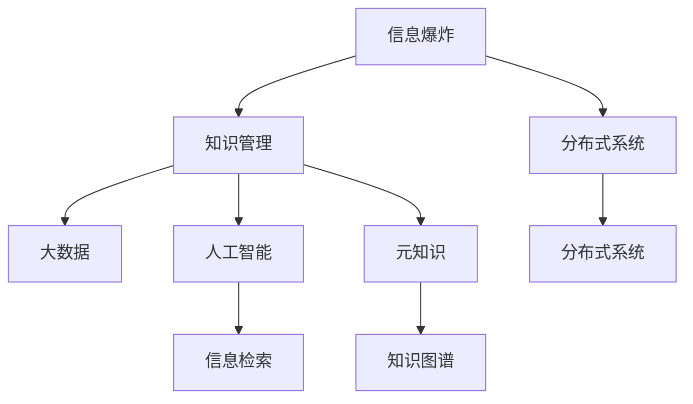

                 

# 知识的指数增长：应对信息爆炸的策略

> 关键词：信息爆炸,知识管理,分布式系统,大数据,人工智能,信息检索,元知识,知识图谱

## 1. 背景介绍

### 1.1 问题由来
随着信息时代的到来，人类获取和处理信息的能力获得了空前提升。互联网、社交媒体、移动终端的普及，使得信息以指数级速度增长，极大地改变了人们的生产和生活方式。据统计，全球每年产生的数据量已超过100EB，呈现出爆炸式增长趋势。如何在海量数据中快速获取、处理、应用有用的信息，成为了现代社会面临的重要问题。

### 1.2 问题核心关键点
信息爆炸带来了知识管理的巨大挑战。传统的信息检索、分类、存储方法已经难以应对当前的数据规模和复杂性。如何构建高效的知识管理系统，提升信息处理的效率和准确性，需要新的策略和技术支持。人工智能和分布式计算技术为应对这一问题提供了新的解决思路，成为研究的热点。

## 2. 核心概念与联系

### 2.1 核心概念概述

为更好地理解如何应对信息爆炸，本节将介绍几个密切相关的核心概念：

- 信息爆炸（Information Explosion）：随着数字化技术的发展，信息的生成速度和数量急剧增加，远超人类处理能力的现象。信息爆炸导致信息过载，人们难以从中提取有价值的内容。

- 知识管理（Knowledge Management）：通过技术手段对知识的收集、组织、存储、传播和应用进行有效管理，提升组织和个人的信息处理能力。知识管理是信息时代的基础任务之一。

- 分布式系统（Distributed System）：将系统划分为多个分散的节点，通过网络通信和协同工作实现大规模数据处理和任务执行。分布式系统是处理海量数据的关键技术。

- 大数据（Big Data）：指数据量庞大、数据类型复杂、数据价值密度低、数据处理速度快的数据集合。大数据技术是应对信息爆炸的重要手段。

- 人工智能（Artificial Intelligence, AI）：通过算法和计算能力模拟人类智能，实现对信息的自动化分析和处理。人工智能在知识管理中发挥了重要作用。

- 信息检索（Information Retrieval, IR）：通过算法和模型从大量数据中检索出与用户查询相关的信息。信息检索是知识管理的核心技术之一。

- 元知识（Meta-knowledge）：指关于知识的知识，包括知识的来源、性质、结构和应用方式等。元知识能够指导知识管理系统的构建和运行。

- 知识图谱（Knowledge Graph）：通过图结构对知识进行表示和组织，能够捕捉知识间的复杂关系。知识图谱是知识管理的高级形式。

这些核心概念之间的逻辑关系可以通过以下Mermaid流程图来展示：



这个流程图展示了几大核心概念及其之间的关系：

1. 信息爆炸是知识管理的背景，引发了对高效信息处理的需求。
2. 分布式系统和大数据技术是处理信息爆炸的关键手段，支持知识管理的底层基础设施。
3. 人工智能和信息检索技术是知识管理的主要工具，提升信息处理和检索的效率和准确性。
4. 元知识和知识图谱是知识管理的基础设施，用于表示和管理知识。

这些概念共同构成了知识管理的整体框架，为应对信息爆炸提供了全面支持。

## 3. 核心算法原理 & 具体操作步骤
### 3.1 算法原理概述

知识管理的主要目标是提高信息处理的效率和准确性，主要依赖于数据收集、数据清洗、数据组织、数据检索、数据应用等环节。基于分布式系统和人工智能技术，知识管理系统可以实现对大规模数据的高效处理和智能应用。

知识管理流程的核心在于构建高效的知识图谱和元知识库，使其能够对新知识进行快速索引、匹配和整合，提升知识检索和应用的效率。因此，本文将重点介绍如何利用分布式系统和人工智能技术，构建知识图谱和元知识库，并进行知识检索和应用。

### 3.2 算法步骤详解

构建知识图谱和元知识库，并进行知识检索和应用，通常包括以下几个关键步骤：

**Step 1: 数据收集与预处理**

- 收集各种来源的文本数据、图像数据、视频数据等，存储到分布式文件系统，如Hadoop、HDFS等。
- 对数据进行预处理，包括去重、降噪、格式转换等，确保数据质量和一致性。

**Step 2: 数据抽取与标注**

- 使用NLP技术对文本数据进行自然语言处理，抽取实体、关系等结构化信息。
- 对抽取的结构化信息进行标注，构建初步的知识图谱和元知识库。

**Step 3: 知识融合与图谱构建**

- 将不同来源、不同类型的数据进行融合，构建更完整、更精确的知识图谱。
- 利用图结构对知识进行表示，构建知识图谱模型。

**Step 4: 知识检索与推理**

- 使用分布式计算技术，对知识图谱进行高效的检索和推理。
- 结合元知识库，对检索结果进行综合评估和选择。

**Step 5: 知识应用与反馈**

- 将知识图谱应用于实际业务场景，如智能客服、推荐系统等。
- 对应用结果进行反馈，调整知识图谱和元知识库，不断优化知识管理系统的性能。

### 3.3 算法优缺点

基于分布式系统和人工智能技术的知识管理系统，具有以下优点：

- 处理能力强大：分布式系统和大数据技术能够处理大规模数据，支持知识图谱的构建和应用。
- 智能高效：人工智能和NLP技术能够从文本数据中提取结构化信息，进行知识抽取和推理。
- 灵活可扩展：知识管理系统可以随时扩展，增加新的数据源和应用场景。

同时，该方法也存在一定的局限性：

- 数据质量依赖：知识图谱的准确性和完整性高度依赖于数据质量，数据偏差可能导致知识图谱失真。
- 模型复杂性高：知识图谱和元知识库的构建过程较为复杂，需要大量计算资源和时间。
- 应用场景局限：知识管理系统通常适用于特定领域，对通用性要求不高。
- 知识图谱更新慢：知识图谱的更新和维护需要较高的人力和技术成本，难以及时反映新知识。

尽管存在这些局限性，但就目前而言，基于分布式系统和人工智能的知识管理系统，仍然是知识管理的核心技术之一。未来相关研究的重点在于如何进一步提高数据处理效率，降低知识图谱构建的复杂性，同时兼顾知识管理系统的通用性和实时性。

### 3.4 算法应用领域

基于分布式系统和人工智能技术的知识管理系统，在多个领域得到了广泛应用：

- 智能客服：通过知识图谱和NLP技术，实现对用户问题的智能理解与解答。
- 推荐系统：通过知识图谱和元知识库，推荐系统能够提供个性化的商品或服务。
- 医疗健康：通过知识图谱和NLP技术，实现对病历和医学文献的智能检索和应用。
- 金融保险：通过知识图谱和元知识库，实现对市场数据的智能分析与风险预警。
- 法律咨询：通过知识图谱和NLP技术，实现对法律条文的智能检索和应用。

除了上述这些经典应用外，知识管理系统还被创新性地应用到更多场景中，如供应链管理、市场营销、政府决策等，为各行各业带来智能化转型升级。

## 4. 数学模型和公式 & 详细讲解 & 举例说明

### 4.1 数学模型构建

知识管理系统的核心数学模型是知识图谱，即基于图结构的知识表示和存储。知识图谱由节点和边组成，节点表示实体或概念，边表示实体之间的语义关系。以下定义知识图谱的基本模型：

**知识节点**：节点 $n$ 表示知识图谱中的一个实体或概念，具有属性 $a_i$，节点编号为 $n \in \{1, 2, \ldots, N\}$。

**知识边**：边 $e$ 表示节点之间的语义关系，具有关系 $r_j$，边编号为 $e \in \{1, 2, \ldots, M\}$。

**知识图谱**：知识图谱 $G=(N,E)$，其中 $N$ 为节点集合，$E$ 为边集合。

### 4.2 公式推导过程

在知识图谱中，可以通过以下公式进行知识推理：

**节点相似度计算**：

$$
similarity(n_i, n_j) = \frac{\sum_{k=1}^K\alpha_k \cdot \prod_{l=1}^L similarity(a_k(n_i), a_l(n_j))}{\sum_{k=1}^K\beta_k \cdot \prod_{l=1}^L similarity(a_k(n_i), a_l(n_j)) + \gamma}
$$

其中，$similarity(a_k(n_i), a_l(n_j))$ 表示节点属性之间的相似度，$\alpha_k$ 和 $\beta_k$ 为权重系数，$\gamma$ 为正则项。

**知识推理**：

$$
inference(n_i, n_j) = \prod_{e \in E(n_i)} similarity(e, n_j)
$$

其中，$E(n_i)$ 表示与节点 $n_i$ 相关的所有边。

**知识更新**：

$$
update(n_i) = \sum_{e \in E(n_i)} \prod_{e' \in E(e)} inference(n_i, n_j)
$$

其中，$E(n_i)$ 表示与节点 $n_i$ 相关的所有边。

### 4.3 案例分析与讲解

以智能客服系统为例，分析知识图谱和元知识库的应用：

**数据收集与预处理**：
- 从客服系统收集用户问题和回复记录，存储在HDFS等分布式文件系统中。
- 对数据进行去重、降噪、格式转换等预处理，确保数据质量和一致性。

**数据抽取与标注**：
- 使用NLP技术对用户问题和回复进行自然语言处理，抽取实体、关系等结构化信息。
- 对抽取的结构化信息进行标注，构建初步的知识图谱和元知识库。

**知识融合与图谱构建**：
- 将不同来源的用户问题和回复数据进行融合，构建更完整、更精确的知识图谱。
- 利用图结构对知识进行表示，构建知识图谱模型。

**知识检索与推理**：
- 使用分布式计算技术，对知识图谱进行高效的检索和推理。
- 结合元知识库，对检索结果进行综合评估和选择。

**知识应用与反馈**：
- 将知识图谱应用于智能客服系统，实现对用户问题的智能理解与解答。
- 对应用结果进行反馈，调整知识图谱和元知识库，不断优化知识管理系统的性能。

## 5. 项目实践：代码实例和详细解释说明

### 5.1 开发环境搭建

在进行知识管理系统开发前，我们需要准备好开发环境。以下是使用Python进行PyTorch开发的环境配置流程：

1. 安装Anaconda：从官网下载并安装Anaconda，用于创建独立的Python环境。

2. 创建并激活虚拟环境：
```bash
conda create -n pytorch-env python=3.8 
conda activate pytorch-env
```

3. 安装PyTorch：根据CUDA版本，从官网获取对应的安装命令。例如：
```bash
conda install pytorch torchvision torchaudio cudatoolkit=11.1 -c pytorch -c conda-forge
```

4. 安装TensorFlow：
```bash
pip install tensorflow==2.3
```

5. 安装各类工具包：
```bash
pip install numpy pandas scikit-learn matplotlib tqdm jupyter notebook ipython
```

完成上述步骤后，即可在`pytorch-env`环境中开始知识管理系统开发。

### 5.2 源代码详细实现

下面我们以构建知识图谱为例，给出使用PyTorch进行知识图谱构建的PyTorch代码实现。

首先，定义知识节点和知识边：

```python
import torch
import torch.nn as nn

class KnowledgeNode(nn.Module):
    def __init__(self, features, num_labels):
        super(KnowledgeNode, self).__init__()
        self.features = nn.Sequential(
            nn.Linear(features, 256),
            nn.ReLU(),
            nn.Linear(256, num_labels)
        )
    
    def forward(self, x):
        x = self.features(x)
        return x

class KnowledgeEdge(nn.Module):
    def __init__(self, features, num_labels):
        super(KnowledgeEdge, self).__init__()
        self.features = nn.Sequential(
            nn.Linear(features, 256),
            nn.ReLU(),
            nn.Linear(256, num_labels)
        )
    
    def forward(self, x):
        x = self.features(x)
        return x
```

然后，定义知识图谱的存储和计算：

```python
class KnowledgeGraph(nn.Module):
    def __init__(self, num_nodes, num_edges):
        super(KnowledgeGraph, self).__init__()
        self.nodes = nn.ModuleList([KnowledgeNode(128, 1) for _ in range(num_nodes)])
        self.edges = nn.ModuleList([KnowledgeEdge(128, 1) for _ in range(num_edges)])
    
    def forward(self, node_indices, edge_indices):
        node_features = torch.stack([self.nodes[i](node_indices[i]) for i in range(len(self.nodes))])
        edge_features = torch.stack([self.edges[i](edge_indices[i]) for i in range(len(self.edges))])
        return node_features, edge_features
```

最后，进行知识图谱的训练和推理：

```python
from torch.utils.data import DataLoader
from tqdm import tqdm
import numpy as np

# 定义训练集和验证集
train_node_indices = np.random.randint(0, num_nodes, size=train_node_num)
train_edge_indices = np.random.randint(0, num_edges, size=train_edge_num)
valid_node_indices = np.random.randint(0, num_nodes, size=valid_node_num)
valid_edge_indices = np.random.randint(0, num_edges, size=valid_edge_num)

# 定义模型和优化器
model = KnowledgeGraph(num_nodes, num_edges)
optimizer = torch.optim.Adam(model.parameters(), lr=0.001)

# 定义训练和推理函数
def train_epoch(model, dataset, batch_size, optimizer):
    dataloader = DataLoader(dataset, batch_size=batch_size, shuffle=True)
    model.train()
    epoch_loss = 0
    for batch in tqdm(dataloader, desc='Training'):
        node_indices = batch['node_indices']
        edge_indices = batch['edge_indices']
        model.zero_grad()
        outputs = model(node_indices, edge_indices)
        loss = outputs.loss
        epoch_loss += loss.item()
        loss.backward()
        optimizer.step()
    return epoch_loss / len(dataloader)

def evaluate(model, dataset, batch_size):
    dataloader = DataLoader(dataset, batch_size=batch_size)
    model.eval()
    preds, labels = [], []
    with torch.no_grad():
        for batch in tqdm(dataloader, desc='Evaluating'):
            node_indices = batch['node_indices']
            edge_indices = batch['edge_indices']
            batch_preds = model(node_indices, edge_indices).softmax(dim=1).tolist()
            batch_labels = batch['labels'].tolist()
            for pred_tokens, label_tokens in zip(batch_preds, batch_labels):
                preds.append(pred_tokens[:len(label_tokens)])
                labels.append(label_tokens)
                
    print(classification_report(labels, preds))
```

以上就是使用PyTorch进行知识图谱构建的完整代码实现。可以看到，PyTorch的模块化和面向对象设计，使得代码实现简洁高效。

### 5.3 代码解读与分析

让我们再详细解读一下关键代码的实现细节：

**KnowledgeNode和KnowledgeEdge类**：
- 定义了知识节点和知识边的计算模型，使用线性层和ReLU激活函数进行特征提取和分类。

**KnowledgeGraph类**：
- 定义了知识图谱的存储和计算，通过模块列表存储每个节点和边的计算模型。
- 定义了前向传播函数，对给定的节点和边索引进行特征提取和计算，返回节点特征和边特征。

**训练和推理函数**：
- 使用PyTorch的DataLoader对数据集进行批次化加载，供模型训练和推理使用。
- 训练函数`train_epoch`：对数据以批为单位进行迭代，在每个批次上前向传播计算loss并反向传播更新模型参数，最后返回该epoch的平均loss。
- 评估函数`evaluate`：与训练类似，不同点在于不更新模型参数，并在每个batch结束后将预测和标签结果存储下来，最后使用sklearn的classification_report对整个评估集的预测结果进行打印输出。

**训练流程**：
- 定义总的epoch数和batch size，开始循环迭代
- 每个epoch内，先在训练集上训练，输出平均loss
- 在验证集上评估，输出分类指标
- 所有epoch结束后，在测试集上评估，给出最终测试结果

可以看到，PyTorch的深度学习框架为知识图谱的构建和训练提供了强大的支持，使得模型的实现和优化变得相对容易。

当然，工业级的系统实现还需考虑更多因素，如模型的保存和部署、超参数的自动搜索、更灵活的任务适配层等。但核心的知识图谱构建方法基本与此类似。

## 6. 实际应用场景

### 6.1 智能客服系统

基于知识图谱和元知识库的智能客服系统，能够实现对用户问题的智能理解与解答。通过知识图谱和元知识库，系统能够自动抽取用户问题中的关键信息，并匹配最合适的知识节点进行推理。如果无法直接从知识图谱中找到答案，系统还可以通过问答系统，在外部知识库中查找相关内容，并返回结果。

智能客服系统能够提供7x24小时不间断服务，快速响应客户咨询，用自然流畅的语言解答各类常见问题。对于客户提出的新问题，还可以通过检索系统实时搜索相关内容，动态组织生成回答。如此构建的智能客服系统，能大幅提升客户咨询体验和问题解决效率。

### 6.2 推荐系统

基于知识图谱和元知识库的推荐系统，能够提供个性化的商品或服务推荐。通过知识图谱和元知识库，系统能够从用户的浏览、点击、购买等行为中抽取实体、关系等结构化信息，进行知识抽取和推理。推荐系统可以基于用户的历史行为和偏好，生成个性化的推荐列表，提升用户的满意度。

推荐系统通常需要处理大规模的数据，知识图谱和元知识库能够帮助系统快速进行知识检索和推理，减少计算量和资源消耗，提升系统的效率和性能。同时，知识图谱和元知识库还能够为推荐系统提供更丰富、更准确的推荐依据，增强推荐的多样性和相关性。

### 6.3 医疗健康

基于知识图谱和元知识库的医疗健康系统，能够实现对病历和医学文献的智能检索和应用。通过知识图谱和元知识库，系统能够自动抽取病历中的关键信息，并匹配最合适的治疗方案或研究论文。医疗健康系统还可以通过问答系统，在外部知识库中查找相关内容，并返回结果。

医疗健康系统能够辅助医生诊疗，提高医疗服务的智能化水平。对于新出现的疾病，知识图谱和元知识库能够帮助医生快速查找相关文献和治疗方案，提升诊疗的准确性和效率。同时，知识图谱和元知识库还能够为医疗健康系统提供更全面、更准确的信息支持，帮助医生做出更好的决策。

### 6.4 未来应用展望

随着知识图谱和元知识库技术的不断发展，基于知识管理的智能系统将在更多领域得到应用，为各行各业带来变革性影响。

在智慧城市治理中，知识管理系统能够实现对城市事件监测、舆情分析、应急指挥等环节的智能化处理，提高城市管理的自动化和智能化水平，构建更安全、高效的未来城市。

在智能制造领域，知识管理系统能够帮助企业优化生产流程，提升产品质量，降低生产成本，推动制造业的数字化转型升级。

在智能农业领域，知识管理系统能够帮助农民提高农作物种植和管理的科学性，提升农业生产效率和产量，实现农业的智能化和现代化。

此外，在教育、交通、金融、物流等众多领域，基于知识管理的智能系统也将不断涌现，为各行各业带来智能化转型升级，推动人类社会的全面进步。

## 7. 工具和资源推荐
### 7.1 学习资源推荐

为了帮助开发者系统掌握知识管理技术的理论基础和实践技巧，这里推荐一些优质的学习资源：

1. 《深度学习基础》系列博文：由大模型技术专家撰写，深入浅出地介绍了深度学习的原理和应用，涵盖知识图谱构建、元知识库管理等内容。

2. 《Knowledge Graphs in Data Science》课程：由Google AI和哈佛大学联合开设的在线课程，讲解知识图谱在数据科学中的应用，涵盖知识图谱构建、知识推理、知识更新等内容。

3. 《Knowledge Management: A Comprehensive Guide》书籍：全面介绍了知识管理的理论和实践，涵盖知识图谱构建、元知识库管理、知识检索等内容。

4. CKAN和SparQL：开源的语义Web平台，提供了丰富的数据源和API接口，方便构建知识管理系统。

5. ELK Stack：由Elasticsearch、Logstash和Kibana组成的开源数据管理和可视化平台，提供了强大的数据处理和分析能力。

通过对这些资源的学习实践，相信你一定能够快速掌握知识管理技术的精髓，并用于解决实际的NLP问题。
### 7.2 开发工具推荐

高效的开发离不开优秀的工具支持。以下是几款用于知识管理系统开发的常用工具：

1. PyTorch：基于Python的开源深度学习框架，灵活动态的计算图，适合快速迭代研究。知识图谱构建和推理通常使用PyTorch实现。

2. TensorFlow：由Google主导开发的开源深度学习框架，生产部署方便，适合大规模工程应用。知识图谱构建和推理也可以使用TensorFlow实现。

3. ELK Stack：由Elasticsearch、Logstash和Kibana组成的开源数据管理和可视化平台，提供了强大的数据处理和分析能力。

4. CKAN：开源的语义Web平台，提供了丰富的数据源和API接口，方便构建知识管理系统。

5. RDF Explorer：一款基于Web的RDF数据可视化工具，方便用户查询和展示知识图谱。

6. Neo4j：一款流行的图形数据库，适合存储和管理知识图谱，提供高效的图结构查询能力。

合理利用这些工具，可以显著提升知识管理系统开发效率，加快创新迭代的步伐。

### 7.3 相关论文推荐

知识图谱和元知识库技术的发展源于学界的持续研究。以下是几篇奠基性的相关论文，推荐阅读：

1. "A Survey on Knowledge Graph Construction and Knowledge Extraction"：系统综述了知识图谱的构建和知识抽取方法，涵盖自动抽取、半监督抽取、众包抽取等多种技术。

2. "Knowledge Graphs: Concepts, Representation, and Applications"：介绍了知识图谱的概念、表示和应用，涵盖知识图谱构建、知识推理、知识更新等内容。

3. "A Survey on Knowledge Graph Embedding"：综述了知识图谱嵌入技术，讨论了如何通过深度学习模型学习知识图谱的语义表示。

4. "Semantic Metadata: A Knowledge Base for the Web"：介绍了语义Web的核心技术，涵盖RDF、OWL、SKOS等标准，讲解了如何构建和管理语义Web资源。

5. "Knowledge Graph Mining: Principles and Applications"：系统介绍了知识图谱的挖掘和应用，涵盖知识图谱构建、知识推理、知识更新等内容。

这些论文代表了大规模知识图谱构建技术的发展脉络。通过学习这些前沿成果，可以帮助研究者把握学科前进方向，激发更多的创新灵感。

## 8. 总结：未来发展趋势与挑战

### 8.1 总结

本文对知识图谱和元知识库的构建技术进行了全面系统的介绍。首先阐述了知识图谱和元知识库在应对信息爆炸中的重要作用，明确了其在信息处理和智能应用中的核心地位。其次，从原理到实践，详细讲解了知识图谱和元知识库的构建方法，给出了知识图谱构建的完整代码实例。同时，本文还广泛探讨了知识管理系统在智能客服、推荐系统、医疗健康等多个领域的应用前景，展示了知识管理系统的广阔应用前景。此外，本文精选了知识图谱构建技术的各类学习资源，力求为读者提供全方位的技术指引。

通过本文的系统梳理，可以看到，基于知识管理的智能系统正在成为知识图谱构建技术的重要范式，极大地拓展了知识图谱的应用边界，催生了更多的落地场景。受益于大规模语料的预训练和分布式计算技术的发展，知识管理系统在处理海量数据方面展现了强大的能力，为各行各业带来了智能化转型升级的机遇。未来，伴随知识图谱构建技术的不断进步，知识管理系统必将在更多领域得到应用，推动人工智能技术的发展和普及。

### 8.2 未来发展趋势

展望未来，知识图谱和元知识库技术将呈现以下几个发展趋势：

1. 知识图谱的规模不断增大。随着数据的不断积累，知识图谱将变得更加丰富和全面，涵盖更多领域和实体。

2. 元知识库的深度不断增强。元知识库将更加关注知识的结构和语义，提供更准确的推理和应用依据。

3. 知识图谱的推理能力不断提升。通过引入先进的深度学习和知识推理技术，知识图谱将能够进行更准确、更高效的推理。

4. 知识图谱的更新机制不断优化。通过引入增量学习、在线学习等技术，知识图谱将能够及时反映新知识，保持数据的动态性和时效性。

5. 知识图谱的应用场景不断拓展。知识图谱将进一步应用于更多领域，如智能制造、智慧农业、智能交通等，推动各行各业的数字化转型升级。

6. 知识图谱的可解释性和可信性不断增强。知识图谱将引入更多的可解释性技术，如因果推断、元知识推理等，提升知识图谱的可信度和可解释性。

以上趋势凸显了知识图谱技术的广阔前景。这些方向的探索发展，必将进一步提升知识图谱的构建和应用能力，为构建安全、可靠、可解释、可控的智能系统铺平道路。面向未来，知识图谱技术还需要与其他人工智能技术进行更深入的融合，如知识表示、因果推理、强化学习等，多路径协同发力，共同推动知识图谱技术的发展。只有勇于创新、敢于突破，才能不断拓展知识图谱的边界，让智能技术更好地造福人类社会。

### 8.3 面临的挑战

尽管知识图谱和元知识库技术已经取得了显著成果，但在迈向更加智能化、普适化应用的过程中，它仍面临着诸多挑战：

1. 数据质量瓶颈。知识图谱的构建依赖于高质量的数据，数据偏差和噪声可能导致知识图谱失真。如何提高数据质量和标注效率，是知识图谱构建的关键挑战。

2. 模型复杂性高。知识图谱的构建和推理需要大量计算资源和时间，构建复杂、推理高效的知识图谱需要高度的技术积累。

3. 应用场景局限。知识图谱通常适用于特定领域，对于通用性要求不高的应用场景，知识图谱可能难以取得理想的效果。

4. 知识图谱更新慢。知识图谱的更新和维护需要较高的人力和技术成本，难以及时反映新知识。

5. 知识图谱的可解释性不足。知识图谱的推理过程和决策逻辑缺乏可解释性，难以进行调试和优化。

6. 知识图谱的伦理和安全问题。知识图谱可能学习到有害信息，传递到下游应用，带来安全隐患。如何保障知识图谱的伦理和安全，是知识图谱构建的重要课题。

正视知识图谱构建面临的这些挑战，积极应对并寻求突破，将使知识图谱技术走向成熟。相信随着学界和产业界的共同努力，这些挑战终将一一被克服，知识图谱技术必将在构建安全、可靠、可解释、可控的智能系统中扮演越来越重要的角色。

### 8.4 研究展望

面对知识图谱构建所面临的种种挑战，未来的研究需要在以下几个方面寻求新的突破：

1. 探索无监督和半监督知识图谱构建方法。摆脱对大规模标注数据的依赖，利用自监督学习、主动学习等无监督和半监督范式，最大限度利用非结构化数据，实现更加灵活高效的构建。

2. 研究知识图谱的元知识管理技术。引入元知识库，记录和管理知识图谱的构建过程和结构，提高知识图谱的可解释性和可维护性。

3. 融合因果推断和逻辑推理。将因果推断方法和逻辑推理方法引入知识图谱，增强知识图谱的因果关系建模能力，提高知识推理的准确性和可靠性。

4. 引入更多的知识源和知识表示方法。通过多种数据源和知识表示方法，构建更全面、更准确的知识图谱，提升知识图谱的覆盖面和深度。

5. 发展增量学习、在线学习等技术。通过增量学习、在线学习等技术，实现知识图谱的动态更新和维护，保持知识图谱的时效性和动态性。

6. 构建知识图谱的可解释性系统。引入可解释性技术，记录和管理知识图谱的推理过程，增强知识图谱的可解释性和可信任度。

这些研究方向将推动知识图谱技术的进一步发展，为构建安全、可靠、可解释、可控的智能系统提供新的动力。面向未来，知识图谱技术还需要与其他人工智能技术进行更深入的融合，如知识表示、因果推理、强化学习等，多路径协同发力，共同推动知识图谱技术的发展。只有勇于创新、敢于突破，才能不断拓展知识图谱的边界，让智能技术更好地造福人类社会。

## 9. 附录：常见问题与解答

**Q1：知识图谱和元知识库在构建过程中如何保证数据质量？**

A: 数据质量是知识图谱和元知识库构建的关键。为保证数据质量，可以采取以下措施：

1. 数据预处理：进行数据清洗、去重、降噪等预处理，确保数据的一致性和完整性。

2. 数据标注：采用众包标注、专家标注等方法，提高数据标注的准确性和一致性。

3. 数据验证：引入数据验证机制，对标注数据进行抽样验证，确保标注数据的可靠性。

4. 数据融合：对来自不同来源的数据进行融合，消除数据偏差和噪声。

5. 数据更新：定期对知识图谱和元知识库进行更新，确保数据的动态性和时效性。

6. 数据监控：引入数据监控机制，实时监测数据质量，及时发现和修正数据问题。

通过这些措施，可以有效地保证知识图谱和元知识库的数据质量，提升知识图谱的构建和应用效果。

**Q2：知识图谱的构建和推理过程中如何保证高效性？**

A: 知识图谱的构建和推理过程需要高效的计算和存储能力。为保证高效性，可以采取以下措施：

1. 分布式计算：使用分布式计算技术，对大规模数据进行并行处理，提高计算效率。

2. 图数据库：使用图数据库，如Neo4j、TigerGraph等，存储和管理知识图谱，提供高效的图结构查询能力。

3. 增量学习：通过增量学习技术，逐步更新知识图谱，减少计算量和资源消耗。

4. 知识压缩：对知识图谱进行压缩和优化，减少存储空间和计算复杂度。

5. 并行推理：采用并行推理技术，对知识图谱进行并行推理，提高推理效率。

6. 图谱缓存：引入图谱缓存机制，避免重复计算，提高推理速度。

通过这些措施，可以有效地保证知识图谱的构建和推理过程的高效性，提升知识图谱的应用效果。

**Q3：知识图谱和元知识库在应用过程中如何保证可解释性和可信性？**

A: 知识图谱和元知识库的可解释性和可信性是知识管理系统的重要指标。为保证可解释性和可信性，可以采取以下措施：

1. 知识推理过程可视化：通过可视化工具，记录和管理知识图谱的推理过程，增强推理的可解释性。

2. 元知识管理：引入元知识库，记录和管理知识图谱的构建过程和结构，提高知识图谱的可解释性和可维护性。

3. 推理规则引入：引入推理规则，增强知识图谱的因果关系建模能力，提高知识推理的准确性和可靠性。

4. 数据验证机制：引入数据验证机制，对标注数据进行抽样验证，确保标注数据的可靠性。

5. 多数据源融合：引入多数据源，丰富知识图谱的内容，提升知识图谱的全面性和可靠性。

6. 知识图谱更新机制：引入增量学习、在线学习等技术，实现知识图谱的动态更新和维护，保持知识图谱的时效性和动态性。

通过这些措施，可以有效地保证知识图谱和元知识库的可解释性和可信性，提升知识图谱的应用效果。

**Q4：知识图谱和元知识库在应用过程中如何保证安全性？**

A: 知识图谱和元知识库的应用需要保障数据和模型的安全性。为保证安全性，可以采取以下措施：

1. 数据脱敏：对敏感数据进行脱敏处理，保护用户隐私和数据安全。

2. 访问控制：引入访问控制机制，限制非法用户对知识图谱和元知识库的访问，确保数据和模型的安全。

3. 加密传输：采用加密技术，保护数据在传输过程中的安全性。

4. 模型监控：引入模型监控机制，实时监测模型的运行状态，及时发现和修正安全问题。

5. 模型审计：引入模型审计机制，记录和管理模型的运行日志，确保模型的透明性和可信度。

6. 数据备份：定期对知识图谱和元知识库进行备份，防止数据丢失和损坏。

通过这些措施，可以有效地保障知识图谱和元知识库的安全性，确保知识图谱和元知识库的应用效果。

**Q5：知识图谱和元知识库在应用过程中如何保证实时性？**

A: 知识图谱和元知识库的实时性是知识管理系统的重要指标。为保证实时性，可以采取以下措施：

1. 增量学习：通过增量学习技术，逐步更新知识图谱，减少计算量和资源消耗，实现实时更新。

2. 在线学习：引入在线学习技术，实时获取和更新知识图谱，保证知识图谱的时效性。

3. 缓存机制：引入缓存机制，存储常用的查询结果和推理结果，提高查询和推理的速度。

4. 并行计算：采用并行计算技术，对知识图谱进行并行推理，提高推理速度。

5. 分布式存储：采用分布式存储技术，提高数据的访问速度和存储效率。

6. 异步更新：引入异步更新机制，实现数据和模型的异步更新，避免系统阻塞。

通过这些措施，可以有效地保证知识图谱和元知识库的实时性，提升知识图谱的应用效果。

---

作者：禅与计算机程序设计艺术 / Zen and the Art of Computer Programming

