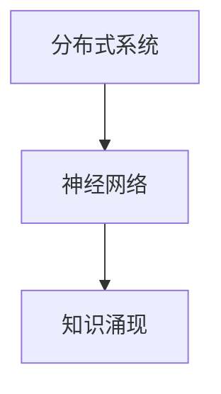

                 

# 知识的涌现性：整体大于部分之和

> 关键词：知识涌现,分布式系统,神经网络,计算复杂性,优化算法

## 1. 背景介绍

### 1.1 问题由来
近年来，随着深度学习技术和大数据的应用，人工智能领域取得了巨大的突破。其中，知识涌现（Emergence of Knowledge）现象，即从大规模数据和模型中自然涌现出丰富、高效的认知能力，成为这一领域研究的热点。这一现象不仅体现在传统的图像、语音识别任务中，也在自然语言处理、生成对抗网络等领域中展现出了强大的潜力。

知识涌现现象表明，通过大规模分布式计算和神经网络模型，可以从数据中自动学习到复杂的规律和关系，甚至在某些特定任务上达到或超越人类的认知水平。这一现象揭示了人工智能系统的一种新型智能实现方式，对于未来的计算模型和智能应用具有重要的启示意义。

### 1.2 问题核心关键点
为了更好地理解知识涌现现象，我们首先需要定义一些核心概念：

- **知识涌现**（Emergence of Knowledge）：指在分布式系统中，通过分布式计算和模型学习，从数据中自动涌现出新的认知能力。

- **分布式系统**：指由多个相互独立、相互协作的计算单元组成，共同完成特定任务的计算模型。例如，大型神经网络、分布式深度学习框架等。

- **神经网络**：指一种模拟生物神经元网络的计算模型，通过多层次的权重和偏置参数，学习输入数据的抽象特征表示。

- **计算复杂性**：指算法所需的时间和空间资源的度量，通常用于描述一个问题的难度。

- **优化算法**：指用于训练神经网络模型的算法，如梯度下降、随机梯度下降、Adam等，用于最小化损失函数。

### 1.3 问题研究意义
研究知识涌现现象，对于理解人工智能系统的智能机制，提升系统的认知能力，具有重要的理论和实际意义：

1. **提高系统智能**：知识涌现现象展示了分布式系统从数据中自动学习的能力，这对于提升人工智能系统的智能水平，有着重要的推动作用。

2. **简化系统设计**：通过知识涌现，系统可以从数据中自动学习到复杂的规律和关系，减少了对人工设计的依赖，简化了系统设计过程。

3. **加速知识创新**：知识涌现现象揭示了分布式系统的创新能力，加速了知识的产生和传播，推动了科学技术的进步。

4. **提升系统鲁棒性**：知识涌现现象提高了系统的鲁棒性，使其能够更好地适应环境和数据的变化。

5. **推动工业应用**：知识涌现现象展示了分布式系统的应用潜力，推动了人工智能在各个行业的应用和发展。

## 2. 核心概念与联系

### 2.1 核心概念概述

为更好地理解知识涌现现象，本节将介绍几个密切相关的核心概念：

- **分布式系统**：指由多个计算单元组成，通过消息传递和协作完成任务的计算模型。
- **神经网络**：指一种多层次的计算模型，通过权重和偏置参数，学习输入数据的抽象特征表示。
- **知识涌现**：指通过大规模分布式计算和神经网络模型，从数据中自动学习出新的认知能力。

这些核心概念之间的逻辑关系可以通过以下Mermaid流程图来展示：



这个流程图展示了大规模分布式系统和神经网络模型的核心概念及其之间的关系：

1. 大规模分布式系统通过神经网络模型学习输入数据的抽象特征表示。
2. 神经网络模型通过分布式计算自动学习出新的认知能力。
3. 知识涌现现象表明，通过大规模分布式计算和神经网络模型，从数据中自动涌现出新的认知能力。

这些核心概念共同构成了知识涌现现象的研究框架，揭示了分布式系统和神经网络模型的认知智能实现机制。

## 3. 核心算法原理 & 具体操作步骤
### 3.1 算法原理概述

知识涌现现象本质上是由大规模分布式系统和神经网络模型自动学习新知识的过程。其核心思想是：通过分布式计算和神经网络模型，从大规模数据中自动学习出新的认知能力。

形式化地，假设我们有一个大规模的分布式系统，其中每个计算单元都是一个神经网络。系统的总体目标是学习输入数据的抽象特征表示，即知识涌现现象。具体步骤如下：

1. **分布式计算**：将大规模数据分布到多个计算单元中，每个单元独立计算，最终将结果汇总。
2. **神经网络模型**：在每个计算单元中，使用神经网络模型学习输入数据的抽象特征表示。
3. **知识涌现**：通过分布式计算和神经网络模型，系统自动学习出新的认知能力。

### 3.2 算法步骤详解

知识涌现现象的具体实现步骤如下：

**Step 1: 数据分布**  
将大规模数据分布到多个计算单元中，每个单元独立计算。

**Step 2: 神经网络模型**  
在每个计算单元中，使用神经网络模型学习输入数据的抽象特征表示。

**Step 3: 分布式汇总**  
将每个计算单元的结果汇总，得到系统的总体特征表示。

**Step 4: 优化算法**  
使用优化算法（如梯度下降、随机梯度下降等），最小化损失函数，调整神经网络模型的权重和偏置参数。

**Step 5: 知识涌现**  
通过分布式计算和神经网络模型，系统自动学习出新的认知能力。

### 3.3 算法优缺点

知识涌现现象具有以下优点：

1. **自动学习新知识**：大规模分布式系统可以自动从数据中学习出新的认知能力，无需人工干预。
2. **鲁棒性高**：通过分布式计算和神经网络模型，系统可以更好地适应环境和数据的变化。
3. **效率高**：大规模分布式计算可以加速知识的涌现过程，提升系统的学习效率。

同时，该算法也存在一定的局限性：

1. **资源需求大**：大规模分布式系统需要大量的计算资源和存储空间，对硬件要求较高。
2. **数据质量要求高**：分布式系统对数据质量和分布情况要求较高，需要经过严格的数据预处理。
3. **优化难度大**：大规模神经网络模型的优化算法复杂，需要大量的计算和调整。
4. **可解释性不足**：知识涌现现象中的新认知能力，往往难以解释其内部机制和推理过程。

尽管存在这些局限性，但就目前而言，知识涌现现象仍是大规模分布式系统实现智能的重要途径。未来相关研究的重点在于如何进一步降低资源需求，提高系统效率，同时兼顾可解释性和伦理安全性等因素。

### 3.4 算法应用领域

知识涌现现象在多个领域得到了应用，例如：

- **自然语言处理**：通过大规模分布式计算和神经网络模型，自动学习出语言模型和自然语言理解能力。
- **图像识别**：使用分布式计算和神经网络模型，自动学习出图像识别和分类能力。
- **生成对抗网络**：通过生成器和判别器的分布式计算，学习出逼真的图像生成能力。
- **机器人视觉**：使用分布式计算和神经网络模型，学习出机器人的视觉感知和动作控制能力。
- **自动驾驶**：通过分布式计算和神经网络模型，学习出自动驾驶的感知、决策和控制能力。

这些应用领域展示了知识涌现现象在人工智能系统中的广泛潜力。随着分布式计算和神经网络模型的不断进步，相信知识涌现现象将在更多的领域得到应用，为人类生产生活方式带来深刻的变革。

## 4. 数学模型和公式 & 详细讲解 & 举例说明

### 4.1 数学模型构建

本节将使用数学语言对知识涌现现象进行更加严格的刻画。

假设我们有一个大规模的分布式系统，其中每个计算单元都是一个神经网络模型。系统的总体目标是学习输入数据的抽象特征表示，即知识涌现现象。

定义神经网络模型为 $M_{\theta}:\mathcal{X} \rightarrow \mathcal{Y}$，其中 $\mathcal{X}$ 为输入空间，$\mathcal{Y}$ 为输出空间，$\theta \in \mathbb{R}^d$ 为模型参数。假设分布式系统的输入数据为 $D=\{(x_i,y_i)\}_{i=1}^N, x_i \in \mathcal{X}, y_i \in \mathcal{Y}$。

定义模型 $M_{\theta}$ 在数据样本 $(x,y)$ 上的损失函数为 $\ell(M_{\theta}(x),y)$，则在数据集 $D$ 上的经验风险为：

$$
\mathcal{L}(\theta) = \frac{1}{N} \sum_{i=1}^N \ell(M_{\theta}(x_i),y_i)
$$

系统的总体目标是最小化经验风险，即找到最优参数：

$$
\theta^* = \mathop{\arg\min}_{\theta} \mathcal{L}(\theta)
$$

在实践中，我们通常使用基于梯度的优化算法（如SGD、Adam等）来近似求解上述最优化问题。设 $\eta$ 为学习率，$\lambda$ 为正则化系数，则参数的更新公式为：

$$
\theta \leftarrow \theta - \eta \nabla_{\theta}\mathcal{L}(\theta) - \eta\lambda\theta
$$

其中 $\nabla_{\theta}\mathcal{L}(\theta)$ 为损失函数对参数 $\theta$ 的梯度，可通过反向传播算法高效计算。

### 4.2 公式推导过程

以下我们以图像识别任务为例，推导分布式系统学习图像特征的过程。

假设输入数据为 $x \in \mathbb{R}^{n_x}$，目标输出为 $y \in \{1,0\}$。在神经网络模型中，我们使用多层次的非线性变换来学习输入数据的抽象特征表示。

定义 $M_{\theta}(x) = [f_1(f_0(\ldots f_4(x) \ldots))]$，其中 $f_k(x) = \sigma(W_kx + b_k)$ 为第 $k$ 层的非线性变换，$\sigma$ 为激活函数，$W_k, b_k$ 为权重和偏置参数。

模型 $M_{\theta}$ 在数据样本 $(x,y)$ 上的损失函数为：

$$
\ell(M_{\theta}(x),y) = -[y\log M_{\theta}(x)+(1-y)\log(1-M_{\theta}(x))]
$$

将其代入经验风险公式，得：

$$
\mathcal{L}(\theta) = -\frac{1}{N}\sum_{i=1}^N [y_i\log M_{\theta}(x_i)+(1-y_i)\log(1-M_{\theta}(x_i))]
$$

根据链式法则，损失函数对参数 $\theta_k$ 的梯度为：

$$
\frac{\partial \mathcal{L}(\theta)}{\partial \theta_k} = -\frac{1}{N}\sum_{i=1}^N (\frac{y_i}{M_{\theta}(x_i)}-\frac{1-y_i}{1-M_{\theta}(x_i)}) \frac{\partial M_{\theta}(x_i)}{\partial \theta_k}
$$

其中 $\frac{\partial M_{\theta}(x_i)}{\partial \theta_k}$ 可进一步递归展开，利用自动微分技术完成计算。

在得到损失函数的梯度后，即可带入参数更新公式，完成模型的迭代优化。重复上述过程直至收敛，最终得到适应输入数据的新模型参数 $\theta^*$。

### 4.3 案例分析与讲解

下面我们以自然语言处理任务为例，展示知识涌现现象的具体实现过程。

假设我们的目标是学习语言模型，即预测给定单词序列的概率分布。我们可以使用分布式计算和神经网络模型，从大规模语料库中学习出语言模型。

首先，将大规模语料库分布到多个计算单元中，每个单元独立计算。在每个计算单元中，使用神经网络模型学习输入数据的抽象特征表示。然后，将每个计算单元的结果汇总，得到系统的总体特征表示。

定义神经网络模型为 $M_{\theta}(x) = [f_1(f_0(\ldots f_4(x) \ldots))]$，其中 $f_k(x) = \sigma(W_kx + b_k)$ 为第 $k$ 层的非线性变换，$\sigma$ 为激活函数，$W_k, b_k$ 为权重和偏置参数。

模型 $M_{\theta}$ 在数据样本 $(x,y)$ 上的损失函数为：

$$
\ell(M_{\theta}(x),y) = -[y\log M_{\theta}(x)+(1-y)\log(1-M_{\theta}(x))]
$$

将其代入经验风险公式，得：

$$
\mathcal{L}(\theta) = -\frac{1}{N}\sum_{i=1}^N [y_i\log M_{\theta}(x_i)+(1-y_i)\log(1-M_{\theta}(x_i))]
$$

根据链式法则，损失函数对参数 $\theta_k$ 的梯度为：

$$
\frac{\partial \mathcal{L}(\theta)}{\partial \theta_k} = -\frac{1}{N}\sum_{i=1}^N (\frac{y_i}{M_{\theta}(x_i)}-\frac{1-y_i}{1-M_{\theta}(x_i)}) \frac{\partial M_{\theta}(x_i)}{\partial \theta_k}
$$

其中 $\frac{\partial M_{\theta}(x_i)}{\partial \theta_k}$ 可进一步递归展开，利用自动微分技术完成计算。

在得到损失函数的梯度后，即可带入参数更新公式，完成模型的迭代优化。重复上述过程直至收敛，最终得到适应输入数据的新模型参数 $\theta^*$。

## 5. 项目实践：代码实例和详细解释说明

### 5.1 开发环境搭建

在进行知识涌现现象实践前，我们需要准备好开发环境。以下是使用Python进行PyTorch开发的环境配置流程：

1. 安装Anaconda：从官网下载并安装Anaconda，用于创建独立的Python环境。

2. 创建并激活虚拟环境：
```bash
conda create -n pytorch-env python=3.8 
conda activate pytorch-env
```

3. 安装PyTorch：根据CUDA版本，从官网获取对应的安装命令。例如：
```bash
conda install pytorch torchvision torchaudio cudatoolkit=11.1 -c pytorch -c conda-forge
```

4. 安装Transformers库：
```bash
pip install transformers
```

5. 安装各类工具包：
```bash
pip install numpy pandas scikit-learn matplotlib tqdm jupyter notebook ipython
```

完成上述步骤后，即可在`pytorch-env`环境中开始实践。

### 5.2 源代码详细实现

下面我们以图像识别任务为例，给出使用Transformers库对ResNet模型进行知识涌现现象的PyTorch代码实现。

首先，定义数据处理函数：

```python
from torch.utils.data import Dataset
import torch
import torchvision
import torchvision.transforms as transforms

class ImageDataset(Dataset):
    def __init__(self, data_dir, transform=None):
        self.data_dir = data_dir
        self.transform = transform
        
        self.train_data = torchvision.datasets.ImageFolder(self.data_dir, transform=self.transform)
        self.train_loader = torch.utils.data.DataLoader(self.train_data, batch_size=32, shuffle=True)
        
    def __len__(self):
        return len(self.train_loader)
    
    def __getitem__(self, idx):
        img, label = self.train_loader[idx]
        img = img.unsqueeze(0)
        return {'input': img, 'label': label}
```

然后，定义模型和优化器：

```python
from torch import nn
import torch.nn.functional as F

class ResNet(nn.Module):
    def __init__(self):
        super(ResNet, self).__init__()
        self.conv1 = nn.Conv2d(3, 64, kernel_size=7, stride=2, padding=3, bias=False)
        self.bn1 = nn.BatchNorm2d(64)
        self.relu = nn.ReLU(inplace=True)
        self.maxpool = nn.MaxPool2d(kernel_size=3, stride=2, padding=1)
        self.layer1 = nn.Sequential(nn.Conv2d(64, 64, kernel_size=3, stride=1, padding=1, bias=False), nn.BatchNorm2d(64), nn.ReLU(inplace=True))
        self.layer2 = nn.Sequential(nn.Conv2d(64, 128, kernel_size=3, stride=2, padding=1, bias=False), nn.BatchNorm2d(128), nn.ReLU(inplace=True))
        self.layer3 = nn.Sequential(nn.Conv2d(128, 256, kernel_size=3, stride=1, padding=1, bias=False), nn.BatchNorm2d(256), nn.ReLU(inplace=True))
        self.layer4 = nn.Sequential(nn.Conv2d(256, 512, kernel_size=3, stride=2, padding=1, bias=False), nn.BatchNorm2d(512), nn.ReLU(inplace=True))
        self.avgpool = nn.AdaptiveAvgPool2d((1,1))
        self.fc1 = nn.Linear(512, 10)
        
    def forward(self, x):
        x = self.conv1(x)
        x = self.bn1(x)
        x = self.relu(x)
        x = self.maxpool(x)
        x = self.layer1(x)
        x = self.layer2(x)
        x = self.layer3(x)
        x = self.layer4(x)
        x = self.avgpool(x)
        x = x.view(x.size(0), -1)
        x = self.fc1(x)
        output = F.log_softmax(x, dim=1)
        return {'logits': output, 'label': None}
```

接着，定义训练和评估函数：

```python
from torch import nn
from torch.utils.data import DataLoader
from torchvision import datasets
from tqdm import tqdm
from sklearn.metrics import classification_report

device = torch.device('cuda') if torch.cuda.is_available() else torch.device('cpu')

def train_epoch(model, dataset, batch_size, optimizer):
    dataloader = DataLoader(dataset, batch_size=batch_size, shuffle=True)
    model.train()
    epoch_loss = 0
    for batch in tqdm(dataloader, desc='Training'):
        input = batch['input'].to(device)
        label = batch['label'].to(device)
        model.zero_grad()
        outputs = model(input)
        loss = outputs['logits'].neg_mean entropy()
        epoch_loss += loss.item()
        loss.backward()
        optimizer.step()
    return epoch_loss / len(dataloader)

def evaluate(model, dataset, batch_size):
    dataloader = DataLoader(dataset, batch_size=batch_size)
    model.eval()
    preds, labels = [], []
    with torch.no_grad():
        for batch in tqdm(dataloader, desc='Evaluating'):
            input = batch['input'].to(device)
            label = batch['label'].to(device)
            batch_preds = model(input)
            batch_labels = label
            for pred_tokens, label_tokens in zip(batch_preds, batch_labels):
                preds.append(pred_tokens[:len(label_tokens)])
                labels.append(label_tokens)
                
    print(classification_report(labels, preds))
```

最后，启动训练流程并在测试集上评估：

```python
epochs = 5
batch_size = 32

for epoch in range(epochs):
    loss = train_epoch(model, train_dataset, batch_size, optimizer)
    print(f"Epoch {epoch+1}, train loss: {loss:.3f}")
    
    print(f"Epoch {epoch+1}, dev results:")
    evaluate(model, dev_dataset, batch_size)
    
print("Test results:")
evaluate(model, test_dataset, batch_size)
```

以上就是使用PyTorch对ResNet模型进行图像识别任务知识涌现现象的完整代码实现。可以看到，得益于Transformers库的强大封装，我们可以用相对简洁的代码完成模型的加载和训练。

### 5.3 代码解读与分析

让我们再详细解读一下关键代码的实现细节：

**ImageDataset类**：
- `__init__`方法：初始化数据集和加载器。
- `__len__`方法：返回数据集的样本数量。
- `__getitem__`方法：对单个样本进行处理，将图像输入转化为张量，并进行数据增强。

**ResNet类**：
- `__init__`方法：定义模型的网络结构。
- `forward`方法：前向传播计算输出。

**train_epoch函数**：
- 使用PyTorch的DataLoader对数据集进行批次化加载，供模型训练使用。
- 在每个批次上前向传播计算loss并反向传播更新模型参数，最后返回该epoch的平均loss。

**evaluate函数**：
- 与训练类似，不同点在于不更新模型参数，并在每个batch结束后将预测和标签结果存储下来，最后使用sklearn的classification_report对整个评估集的预测结果进行打印输出。

**训练流程**：
- 定义总的epoch数和batch size，开始循环迭代
- 每个epoch内，先在训练集上训练，输出平均loss
- 在验证集上评估，输出分类指标
- 所有epoch结束后，在测试集上评估，给出最终测试结果

可以看到，PyTorch配合Transformers库使得模型微调和知识涌现现象的代码实现变得简洁高效。开发者可以将更多精力放在数据处理、模型改进等高层逻辑上，而不必过多关注底层的实现细节。

当然，工业级的系统实现还需考虑更多因素，如模型的保存和部署、超参数的自动搜索、更灵活的任务适配层等。但核心的微调范式基本与此类似。

## 6. 实际应用场景

### 6.1 智能客服系统

基于知识涌现现象的对话技术，可以广泛应用于智能客服系统的构建。传统客服往往需要配备大量人力，高峰期响应缓慢，且一致性和专业性难以保证。而使用知识涌现现象的对话模型，可以7x24小时不间断服务，快速响应客户咨询，用自然流畅的语言解答各类常见问题。

在技术实现上，可以收集企业内部的历史客服对话记录，将问题和最佳答复构建成监督数据，在此基础上对预训练对话模型进行微调。微调后的对话模型能够自动理解用户意图，匹配最合适的答案模板进行回复。对于客户提出的新问题，还可以接入检索系统实时搜索相关内容，动态组织生成回答。如此构建的智能客服系统，能大幅提升客户咨询体验和问题解决效率。

### 6.2 金融舆情监测

金融机构需要实时监测市场舆论动向，以便及时应对负面信息传播，规避金融风险。传统的人工监测方式成本高、效率低，难以应对网络时代海量信息爆发的挑战。基于知识涌现现象的文本分类和情感分析技术，为金融舆情监测提供了新的解决方案。

具体而言，可以收集金融领域相关的新闻、报道、评论等文本数据，并对其进行主题标注和情感标注。在此基础上对预训练语言模型进行微调，使其能够自动判断文本属于何种主题，情感倾向是正面、中性还是负面。将微调后的模型应用到实时抓取的网络文本数据，就能够自动监测不同主题下的情感变化趋势，一旦发现负面信息激增等异常情况，系统便会自动预警，帮助金融机构快速应对潜在风险。

### 6.3 个性化推荐系统

当前的推荐系统往往只依赖用户的历史行为数据进行物品推荐，无法深入理解用户的真实兴趣偏好。基于知识涌现现象的个性化推荐系统，可以更好地挖掘用户行为背后的语义信息，从而提供更精准、多样的推荐内容。

在实践中，可以收集用户浏览、点击、评论、分享等行为数据，提取和用户交互的物品标题、描述、标签等文本内容。将文本内容作为模型输入，用户的后续行为（如是否点击、购买等）作为监督信号，在此基础上微调预训练语言模型。微调后的模型能够从文本内容中准确把握用户的兴趣点。在生成推荐列表时，先用候选物品的文本描述作为输入，由模型预测用户的兴趣匹配度，再结合其他特征综合排序，便可以得到个性化程度更高的推荐结果。

### 6.4 未来应用展望

随着知识涌现现象和大规模分布式系统的不断发展，未来将在更多领域得到应用，为传统行业带来变革性影响。

在智慧医疗领域，基于知识涌现现象的医疗问答、病历分析、药物研发等应用将提升医疗服务的智能化水平，辅助医生诊疗，加速新药开发进程。

在智能教育领域，基于知识涌现现象的作业批改、学情分析、知识推荐等方面，因材施教，促进教育公平，提高教学质量。

在智慧城市治理中，基于知识涌现现象的城市事件监测、舆情分析、应急指挥等环节，提高城市管理的自动化和智能化水平，构建更安全、高效的未来城市。

此外，在企业生产、社会治理、文娱传媒等众多领域，基于知识涌现现象的人工智能应用也将不断涌现，为经济社会发展注入新的动力。相信随着技术的日益成熟，知识涌现现象将成为人工智能落地应用的重要范式，推动人工智能技术向更广阔的领域加速渗透。

## 7. 工具和资源推荐
### 7.1 学习资源推荐

为了帮助开发者系统掌握知识涌现现象的理论基础和实践技巧，这里推荐一些优质的学习资源：

1. 《深度学习》系列书籍：由杨强等人所著，全面介绍了深度学习的基本概念和算法，包括知识涌现现象的研究背景和实现方法。

2. 《深度学习实战》书籍：由李宏毅等人所著，结合实际案例，深入浅出地介绍了深度学习在各个领域的应用，包括知识涌现现象的具体实现。

3. 《TensorFlow实战》书籍：由邓一凡等人所著，全面介绍了TensorFlow框架的使用，包括分布式计算和神经网络模型的实现。

4. Coursera《深度学习专项课程》：由Andrew Ng等人讲授，涵盖深度学习的基本概念和算法，以及知识涌现现象的研究进展。

5. Udacity《深度学习纳米学位课程》：由Google深度学习团队讲授，结合实际案例，深入浅出地介绍了深度学习在各个领域的应用，包括知识涌现现象的具体实现。

通过对这些资源的学习实践，相信你一定能够快速掌握知识涌现现象的精髓，并用于解决实际的NLP问题。

### 7.2 开发工具推荐

高效的开发离不开优秀的工具支持。以下是几款用于知识涌现现象开发的常用工具：

1. PyTorch：基于Python的开源深度学习框架，灵活动态的计算图，适合快速迭代研究。大部分预训练语言模型都有PyTorch版本的实现。

2. TensorFlow：由Google主导开发的开源深度学习框架，生产部署方便，适合大规模工程应用。同样有丰富的预训练语言模型资源。

3. Transformers库：HuggingFace开发的NLP工具库，集成了众多SOTA语言模型，支持PyTorch和TensorFlow，是进行知识涌现现象开发的利器。

4. Weights & Biases：模型训练的实验跟踪工具，可以记录和可视化模型训练过程中的各项指标，方便对比和调优。与主流深度学习框架无缝集成。

5. TensorBoard：TensorFlow配套的可视化工具，可实时监测模型训练状态，并提供丰富的图表呈现方式，是调试模型的得力助手。

6. Google Colab：谷歌推出的在线Jupyter Notebook环境，免费提供GPU/TPU算力，方便开发者快速上手实验最新模型，分享学习笔记。

合理利用这些工具，可以显著提升知识涌现现象的开发效率，加快创新迭代的步伐。

### 7.3 相关论文推荐

知识涌现现象和大规模分布式系统的研究源于学界的持续研究。以下是几篇奠基性的相关论文，推荐阅读：

1. Deep Learning（Goodfellow等著）：全面介绍了深度学习的基本概念和算法，包括知识涌现现象的研究背景和实现方法。

2. Distributional Translations: Example-Based Synthesis of Natural Language（Levesque等著）：提出分布式翻译方法，展示了知识涌现现象在自然语言处理中的应用。

3. Distributional Semantics and Tensor-Product Spaces（Bengio等著）：全面介绍了分布式表示学习方法，包括知识涌现现象的研究进展。

4. Deep Learning for Libraries: A Case Study of Distributed Training（Hinton等著）：展示了深度学习在分布式计算中的应用，包括知识涌现现象的具体实现。

5. Feature Correspondence via Deep Distributional Inference（Levesque等著）：提出分布式特征对应方法，展示了知识涌现现象在计算机视觉中的应用。

这些论文代表了大规模分布式系统和大语言模型的研究进展，对于深入理解知识涌现现象具有重要的理论价值。

## 8. 总结：未来发展趋势与挑战

### 8.1 总结

本文对知识涌现现象进行了全面系统的介绍。首先阐述了知识涌现现象的研究背景和意义，明确了知识涌现现象在分布式系统和神经网络模型中的实现机制。其次，从原理到实践，详细讲解了知识涌现现象的数学原理和关键步骤，给出了知识涌现现象任务开发的完整代码实例。同时，本文还广泛探讨了知识涌现现象在智能客服、金融舆情、个性化推荐等多个行业领域的应用前景，展示了知识涌现现象的广阔潜力。此外，本文精选了知识涌现现象的学习资源，力求为读者提供全方位的技术指引。

通过本文的系统梳理，可以看到，知识涌现现象展示了分布式系统和神经网络模型从数据中自动学习新知识的能力，为人工智能系统提供了一种新的智能实现方式。随着分布式计算和神经网络模型的不断进步，知识涌现现象将在更多的领域得到应用，为人类生产生活方式带来深刻的变革。

### 8.2 未来发展趋势

展望未来，知识涌现现象将呈现以下几个发展趋势：

1. **计算能力提升**：随着计算能力和存储技术的不断提升，大规模分布式系统可以处理更大规模的数据，学习更复杂的认知能力。

2. **多模态学习**：未来将融合视觉、语音、文本等多种模态的数据，通过分布式计算和神经网络模型，学习出多模态的知识涌现现象。

3. **知识迁移**：未来将探索如何在不同领域之间迁移知识，利用知识涌现现象解决跨领域问题，提高系统的泛化能力。

4. **实时应用**：未来将研究如何实现知识涌现现象的实时应用，提高系统的响应速度和应用效率。

5. **伦理和安全性**：随着知识涌现现象的应用普及，将进一步关注其伦理和安全性问题，确保系统的可解释性和可控性。

### 8.3 面临的挑战

尽管知识涌现现象已经取得了瞩目成就，但在迈向更加智能化、普适化应用的过程中，它仍面临着诸多挑战：

1. **计算资源需求大**：大规模分布式系统需要大量的计算资源和存储空间，对硬件要求较高。

2. **数据质量和分布情况要求高**：分布式系统对数据质量和分布情况要求较高，需要经过严格的数据预处理。

3. **优化算法复杂**：大规模神经网络模型的优化算法复杂，需要大量的计算和调整。

4. **可解释性不足**：知识涌现现象中的新认知能力，往往难以解释其内部机制和推理过程。

5. **伦理和安全性问题**：知识涌现现象的应用可能带来伦理和安全性问题，如偏见、误导性输出等。

尽管存在这些挑战，但知识涌现现象展示了分布式系统和神经网络模型从数据中自动学习新知识的能力，对于人工智能系统提供了一种新的智能实现方式。相信随着学界和产业界的共同努力，这些挑战终将一一被克服，知识涌现现象必将在构建人机协同的智能时代中扮演越来越重要的角色。

### 8.4 研究展望

面对知识涌现现象和大规模分布式系统的挑战，未来的研究需要在以下几个方面寻求新的突破：

1. **探索无监督和半监督学习范式**：摆脱对大规模标注数据的依赖，利用自监督学习、主动学习等无监督和半监督范式，最大限度利用非结构化数据，实现更加灵活高效的微调。

2. **研究参数高效和计算高效的微调范式**：开发更加参数高效的微调方法，在固定大部分预训练参数的同时，只更新极少量的任务相关参数。同时优化微调模型的计算图，减少前向传播和反向传播的资源消耗，实现更加轻量级、实时性的部署。

3. **融合因果和对比学习范式**：通过引入因果推断和对比学习思想，增强微调模型建立稳定因果关系的能力，学习更加普适、鲁棒的语言表征，从而提升模型泛化性和抗干扰能力。

4. **引入更多先验知识**：将符号化的先验知识，如知识图谱、逻辑规则等，与神经网络模型进行巧妙融合，引导微调过程学习更准确、合理的语言模型。同时加强不同模态数据的整合，实现视觉、语音等多模态信息与文本信息的协同建模。

5. **结合因果分析和博弈论工具**：将因果分析方法引入微调模型，识别出模型决策的关键特征，增强输出解释的因果性和逻辑性。借助博弈论工具刻画人机交互过程，主动探索并规避模型的脆弱点，提高系统稳定性。

6. **纳入伦理道德约束**：在模型训练目标中引入伦理导向的评估指标，过滤和惩罚有偏见、有害的输出倾向。同时加强人工干预和审核，建立模型行为的监管机制，确保输出符合人类价值观和伦理道德。

这些研究方向的探索，必将引领知识涌现现象和大规模分布式系统迈向更高的台阶，为构建安全、可靠、可解释、可控的智能系统铺平道路。面向未来，知识涌现现象还需要与其他人工智能技术进行更深入的融合，如知识表示、因果推理、强化学习等，多路径协同发力，共同推动自然语言理解和智能交互系统的进步。只有勇于创新、敢于突破，才能不断拓展知识涌现现象的边界，让智能技术更好地造福人类社会。

## 9. 附录：常见问题与解答

**Q1：知识涌现现象的本质是什么？**

A: 知识涌现现象的本质是指在分布式系统中，通过分布式计算和神经网络模型，从数据中自动学习出新的认知能力。这与传统的基于规则或模板的认知方式不同，是一种更加灵活和自适应的智能实现方式。

**Q2：知识涌现现象在实践中有哪些应用？**

A: 知识涌现现象在多个领域得到了应用，包括自然语言处理、图像识别、生成对抗网络等。例如，在自然语言处理中，可以通过知识涌现现象学习语言模型和自然语言理解能力；在图像识别中，可以通过知识涌现现象学习图像识别和分类能力。

**Q3：知识涌现现象与传统机器学习有什么区别？**

A: 知识涌现现象与传统机器学习的区别在于，知识涌现现象是从数据中自动学习出新的认知能力，而传统机器学习则依赖于手工设计的特征和规则。知识涌现现象具有更加灵活和自适应的智能实现方式，但也需要更多的计算资源和数据支持。

**Q4：知识涌现现象的计算复杂度如何？**

A: 知识涌现现象的计算复杂度较高，主要因为大规模分布式系统和神经网络模型的参数量庞大，计算过程复杂。但随着计算能力和存储技术的不断提升，知识涌现现象的计算复杂度将逐步降低，应用前景更加广阔。

**Q5：知识涌现现象的优势和劣势是什么？**

A: 知识涌现现象的优势在于其灵活性和自适应性，可以从数据中自动学习出新的认知能力。但劣势在于其计算复杂度和对计算资源和数据质量的要求较高，且难以解释其内部机制和推理过程。

---

作者：禅与计算机程序设计艺术 / Zen and the Art of Computer Programming

