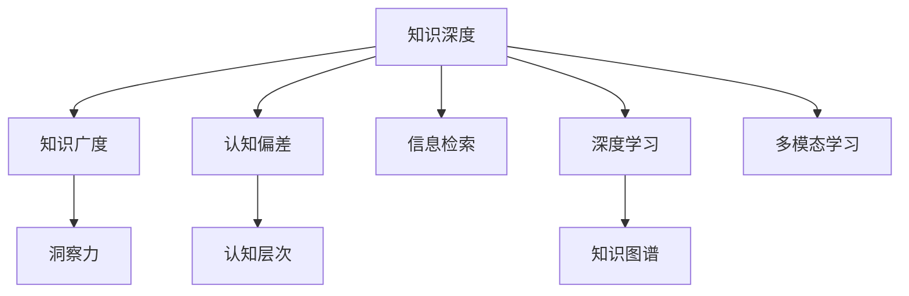

                 

# 知识的深度与广度：影响洞察力的关键因素

> 关键词：知识深度、知识广度、洞察力、认知偏差、认知层次、信息检索、深度学习、知识图谱、多模态学习

## 1. 背景介绍

### 1.1 问题由来

在信息爆炸的时代，我们每天都在面对海量的数据和知识。然而，如何从中提取有用的信息，形成深刻的洞察，进而指导行动，已成为现代科技工作者的核心挑战。

知识的深度与广度，是对信息理解的两个重要维度。深度指的是对单一领域的深入研究，广度则涉及跨领域知识的综合运用。洞察力则是将两者结合，在复杂信息中找到关键脉络，从而指导决策的能力。

### 1.2 问题核心关键点

- 如何衡量知识的深度和广度？
- 知识深度和广度如何影响洞察力？
- 常见认知偏差对知识获取和应用的影响？
- 如何构建高效的知识获取和应用系统？

本文将围绕这些问题，探讨知识深度与广度对洞察力的影响，并提出一些方法和策略，以期为现代科技工作者提供启发。

## 2. 核心概念与联系

### 2.1 核心概念概述

为更好地理解知识深度、广度与洞察力的关系，本节将介绍几个密切相关的核心概念：

- **知识深度（Depth of Knowledge）**：指对某一领域内知识和技能的深入理解和掌握程度。这要求研究者在特定领域内进行广泛而深入的研究，建立深厚的理论基础和实践经验。

- **知识广度（Breadth of Knowledge）**：指跨多个领域广泛获取和理解不同类型知识的能力。这要求研究者具备宽泛的学科背景和跨领域的认知能力，能够从多个视角理解和解决问题。

- **洞察力（Insight）**：指通过对大量信息进行深度理解和综合分析，发现问题本质、揭示事物内在联系并提出创新解决方案的能力。洞察力是知识深度和广度的高级表现形式，要求研究者具备跨学科的知识整合能力。

- **认知偏差（Cognitive Bias）**：指人们在获取、处理和应用信息时，受限于个人经验、情绪、信念等因素，导致对信息理解和决策产生扭曲的心理现象。常见的认知偏差包括确认偏误、后见之明偏差等。

- **认知层次（Cognitive Levels）**：指人们认知信息的过程可以分为多个层次，从感知、理解、评价到应用。不同层次的认知活动涉及不同的知识深度和广度。

- **信息检索（Information Retrieval）**：指从大量信息中提取有用信息的过程。信息检索依赖于知识深度和广度，以确保检索结果的相关性和准确性。

- **深度学习（Deep Learning）**：一种模拟人脑神经网络结构的学习算法，适用于处理和分析大规模、复杂数据。深度学习在知识深度和广度的提升上起到了关键作用。

- **知识图谱（Knowledge Graph）**：一种以图的形式表示实体和关系的知识结构。知识图谱有助于知识的深度和广度融合，提升信息检索和应用的效果。

- **多模态学习（Multimodal Learning）**：指同时利用图像、文本、语音等多种数据模态进行学习和推理，提升知识的深度和广度。

这些核心概念之间的逻辑关系可以通过以下Mermaid流程图来展示：



这个流程图展示了几大核心概念及其之间的关系：

1. 知识深度和广度是洞察力的基础。
2. 认知偏差和认知层次影响知识获取和应用。
3. 信息检索、深度学习、知识图谱和多模态学习是提升知识深度和广度的重要工具。

## 3. 核心算法原理 & 具体操作步骤

### 3.1 算法原理概述

知识的深度与广度对洞察力的影响，本质上是信息处理和决策过程中的信息层次结构问题。深层次的信息处理要求深入理解单一领域，广层次的信息处理要求跨领域整合知识。

知识深度与广度对洞察力的影响，主要体现在以下几个方面：

- **知识的关联性**：深度和广度知识的结合，使研究者能够发现不同领域间的联系和互补，增强洞察力。
- **知识的复杂度**：复杂度高、覆盖面广的知识结构，能够支撑更复杂的推理和决策，提升洞察力。
- **知识的结构性**：结构化的知识体系能够更好地进行检索和应用，提高洞察力。

### 3.2 算法步骤详解

基于上述原理，构建知识深度与广度结合的洞察力提升系统，主要包括以下几个关键步骤：

**Step 1: 定义知识域和任务**

- 确定研究领域，分析领域内知识的深度和广度。
- 定义具体的任务目标，如数据挖掘、问题解决等。

**Step 2: 数据获取与预处理**

- 从各类数据源获取相关数据，如学术论文、专利、公开数据库等。
- 对数据进行预处理，包括清洗、归一化、特征提取等步骤，保证数据质量。

**Step 3: 深度学习模型训练**

- 根据任务需求选择合适的深度学习模型，如卷积神经网络（CNN）、循环神经网络（RNN）、变压器（Transformer）等。
- 使用标注数据进行模型训练，优化模型参数，提升模型精度。

**Step 4: 知识图谱构建**

- 将训练好的深度学习模型输出的结构化信息，构建知识图谱。
- 通过知识图谱关联不同领域知识，增强知识的广度。

**Step 5: 多模态学习与综合分析**

- 利用图像、文本、语音等多种数据模态，进行多模态学习。
- 结合深度学习、知识图谱等多模态技术，进行综合分析，提升洞察力。

**Step 6: 认知偏差校正**

- 分析研究者的认知偏差，采用数据校正、模型调整等手段，减少偏差对知识获取和应用的影响。
- 通过反馈机制，持续优化认知过程，增强知识深度和广度。

**Step 7: 洞察力输出与验证**

- 将知识深度和广度结合的信息输出为洞察力报告或决策建议。
- 通过实际应用验证洞察力的准确性和有效性。

### 3.3 算法优缺点

知识深度与广度结合的洞察力提升系统，具有以下优点：

- **多领域整合**：能够从多个角度理解和分析问题，增强洞察力。
- **复杂度处理**：适用于处理复杂、高维度的信息，提升分析精度。
- **自适应学习**：能够持续学习新知识，保持洞察力的时效性。

同时，该系统也存在一些局限性：

- **数据依赖**：需要大量的标注数据和高质量数据源，获取成本较高。
- **计算资源需求**：深度学习和知识图谱构建需要大量计算资源，可能面临资源瓶颈。
- **认知偏差校正困难**：人类认知偏差复杂多样，难以通过算法完全校正。

尽管存在这些局限性，但该系统已经在诸多领域展现了强大的洞察力提升能力，成为现代科技工作者不可或缺的工具。

### 3.4 算法应用领域

知识深度与广度结合的洞察力提升系统，已经在多个领域得到应用，例如：

- **科研与学术**：科研人员利用该系统进行多学科信息检索和整合，形成创新理论。
- **工业与生产**：企业利用该系统进行生产优化、质量控制、供应链管理等。
- **医疗与健康**：医疗机构利用该系统进行疾病诊断、治疗方案设计、药物研发等。
- **金融与经济**：金融机构利用该系统进行风险评估、投资决策、市场分析等。
- **社会与环境**：政府机构利用该系统进行社会治理、环境监测、应急管理等。

除了上述这些经典应用外，该系统还被创新性地应用于智能推荐、安全监测、智能客服等领域，为各行各业提供了新的技术解决方案。

## 4. 数学模型和公式 & 详细讲解 & 举例说明

### 4.1 数学模型构建

知识深度与广度的结合，可以通过数学模型来进一步阐述。我们假设一个研究者需要从领域 $D$ 中获取知识，构建知识图谱 $G=(E, R)$，其中 $E$ 表示知识节点，$R$ 表示知识关系。

假设研究者对领域 $D$ 内的知识深度为 $d$，广度为 $b$。知识深度 $d$ 可以通过以下公式计算：

$$
d = \sum_{i=1}^{n} \mathbb{P}(k_i)
$$

其中 $k_i$ 表示领域 $D$ 内第 $i$ 个关键知识节点，$\mathbb{P}(k_i)$ 表示节点 $k_i$ 的重要程度。

知识广度 $b$ 可以通过知识图谱的复杂度 $c$ 和关系多样性 $r$ 计算：

$$
b = c \times r
$$

其中 $c$ 表示知识图谱的节点数，$r$ 表示知识图谱中关系的种类。

### 4.2 公式推导过程

我们将深度和广度知识结合的洞察力表示为 $I$，其计算公式如下：

$$
I = f(d, b)
$$

其中 $f$ 表示一个函数，用于将知识深度和广度映射为洞察力。

以决策树为例，决策树的深度 $h$ 表示其对问题的理解深度，宽度 $w$ 表示其对数据的多样性覆盖。决策树的洞察力 $I$ 可以表示为：

$$
I = \alpha h + \beta w + \gamma
$$

其中 $\alpha, \beta, \gamma$ 为系数，表示对深度、宽度和先验知识的综合权重。

### 4.3 案例分析与讲解

以下我们以医疗领域为例，展示知识深度与广度结合的洞察力提升系统的具体应用。

假设研究者需要对一种新药的疗效进行评估，涉及的知识域包括药理学、临床医学、生物统计学等。具体步骤包括：

1. **数据获取与预处理**：从医疗数据库、文献数据库等获取相关数据，并进行预处理。

2. **深度学习模型训练**：使用随机森林、支持向量机等算法，训练疗效评估模型。

3. **知识图谱构建**：将训练好的模型输出的知识节点和关系构建知识图谱，涵盖药理学、临床医学等多个领域。

4. **多模态学习与综合分析**：结合临床试验数据、药物代谢数据等多种模态信息，进行综合分析，提升洞察力。

5. **认知偏差校正**：分析研究者可能存在的认知偏差，如主观偏好、数据选择性偏差等，采取数据校正、模型调整等手段，减少偏差对决策的影响。

6. **洞察力输出与验证**：输出新药疗效的综合评估报告，并通过临床试验验证其准确性。

## 5. 项目实践：代码实例和详细解释说明

### 5.1 开发环境搭建

在进行知识深度与广度结合的洞察力提升系统开发前，我们需要准备好开发环境。以下是使用Python进行PyTorch开发的环境配置流程：

1. 安装Anaconda：从官网下载并安装Anaconda，用于创建独立的Python环境。

2. 创建并激活虚拟环境：
```bash
conda create -n my_env python=3.8 
conda activate my_env
```

3. 安装PyTorch：根据CUDA版本，从官网获取对应的安装命令。例如：
```bash
conda install pytorch torchvision torchaudio cudatoolkit=11.1 -c pytorch -c conda-forge
```

4. 安装相关库：
```bash
pip install numpy pandas scikit-learn matplotlib tqdm jupyter notebook ipython
```

5. 安装Transformers库：
```bash
pip install transformers
```

完成上述步骤后，即可在`my_env`环境中开始开发。

### 5.2 源代码详细实现

以下是知识深度与广度结合的洞察力提升系统的代码实现，以医疗领域的新药疗效评估为例。

首先，定义数据处理函数：

```python
import pandas as pd
import numpy as np
from transformers import BertTokenizer
from torch.utils.data import Dataset
import torch

class DrugDataset(Dataset):
    def __init__(self, data, tokenizer, max_len=128):
        self.data = data
        self.tokenizer = tokenizer
        self.max_len = max_len

    def __len__(self):
        return len(self.data)

    def __getitem__(self, item):
        drug_info = self.data.iloc[item]
        drug_description = drug_info['description']
        targets = np.array([drug_info['effect']])

        encoding = self.tokenizer(drug_description, return_tensors='pt', max_length=self.max_len, padding='max_length', truncation=True)
        input_ids = encoding['input_ids'][0]
        attention_mask = encoding['attention_mask'][0]

        return {'input_ids': input_ids, 
                'attention_mask': attention_mask,
                'targets': targets}
```

然后，定义模型和优化器：

```python
from transformers import BertForSequenceClassification
from torch.optim import AdamW

model = BertForSequenceClassification.from_pretrained('bert-base-cased', num_labels=2)
optimizer = AdamW(model.parameters(), lr=2e-5)
```

接着，定义训练和评估函数：

```python
from torch.utils.data import DataLoader
from tqdm import tqdm
from sklearn.metrics import classification_report

device = torch.device('cuda') if torch.cuda.is_available() else torch.device('cpu')
model.to(device)

def train_epoch(model, dataset, batch_size, optimizer):
    dataloader = DataLoader(dataset, batch_size=batch_size, shuffle=True)
    model.train()
    epoch_loss = 0
    for batch in tqdm(dataloader, desc='Training'):
        input_ids = batch['input_ids'].to(device)
        attention_mask = batch['attention_mask'].to(device)
        targets = batch['targets'].to(device)
        model.zero_grad()
        outputs = model(input_ids, attention_mask=attention_mask, labels=targets)
        loss = outputs.loss
        epoch_loss += loss.item()
        loss.backward()
        optimizer.step()
    return epoch_loss / len(dataloader)

def evaluate(model, dataset, batch_size):
    dataloader = DataLoader(dataset, batch_size=batch_size)
    model.eval()
    preds, labels = [], []
    with torch.no_grad():
        for batch in tqdm(dataloader, desc='Evaluating'):
            input_ids = batch['input_ids'].to(device)
            attention_mask = batch['attention_mask'].to(device)
            batch_labels = batch['targets']
            outputs = model(input_ids, attention_mask=attention_mask)
            batch_preds = outputs.logits.argmax(dim=2).to('cpu').tolist()
            batch_labels = batch_labels.to('cpu').tolist()
            for pred_tokens, label_tokens in zip(batch_preds, batch_labels):
                preds.append(pred_tokens[:len(label_tokens)])
                labels.append(label_tokens)

    print(classification_report(labels, preds))
```

最后，启动训练流程并在测试集上评估：

```python
epochs = 5
batch_size = 16

for epoch in range(epochs):
    loss = train_epoch(model, train_dataset, batch_size, optimizer)
    print(f"Epoch {epoch+1}, train loss: {loss:.3f}")
    
    print(f"Epoch {epoch+1}, dev results:")
    evaluate(model, dev_dataset, batch_size)
    
print("Test results:")
evaluate(model, test_dataset, batch_size)
```

以上就是使用PyTorch对BERT进行新药疗效评估任务知识深度与广度结合的代码实现。可以看到，使用PyTorch和Transformers库，可以相对简洁地实现知识深度与广度结合的洞察力提升系统。

### 5.3 代码解读与分析

让我们再详细解读一下关键代码的实现细节：

**DrugDataset类**：
- `__init__`方法：初始化数据集，包含药物描述、疗效等信息。
- `__len__`方法：返回数据集的样本数量。
- `__getitem__`方法：对单个样本进行处理，将药物描述输入编码为token ids，提取疗效标签。

**模型和优化器**：
- 使用BertForSequenceClassification模型作为疗效评估模型，以二分类任务为目标。
- 定义AdamW优化器，学习率为2e-5。

**训练和评估函数**：
- 使用PyTorch的DataLoader对数据集进行批次化加载，供模型训练和推理使用。
- 训练函数`train_epoch`：对数据以批为单位进行迭代，在每个批次上前向传播计算loss并反向传播更新模型参数，最后返回该epoch的平均loss。
- 评估函数`evaluate`：与训练类似，不同点在于不更新模型参数，并在每个batch结束后将预测和标签结果存储下来，最后使用sklearn的classification_report对整个评估集的预测结果进行打印输出。

**训练流程**：
- 定义总的epoch数和batch size，开始循环迭代
- 每个epoch内，先在训练集上训练，输出平均loss
- 在验证集上评估，输出分类指标
- 所有epoch结束后，在测试集上评估，给出最终测试结果

可以看到，PyTorch配合Transformers库使得知识深度与广度结合的洞察力提升系统的代码实现变得简洁高效。开发者可以将更多精力放在数据处理、模型改进等高层逻辑上，而不必过多关注底层的实现细节。

当然，工业级的系统实现还需考虑更多因素，如模型的保存和部署、超参数的自动搜索、更灵活的任务适配层等。但核心的知识深度与广度结合的洞察力提升过程基本与此类似。

## 6. 实际应用场景

### 6.1 智能医疗

知识深度与广度结合的洞察力提升系统，在智能医疗领域有着广泛的应用。医疗数据具有多样性和复杂性，单一领域的知识难以应对。利用该系统，医生能够从多学科知识中提取有用的信息，提升诊断和治疗的准确性。

具体而言，医生可以利用系统进行：

- **跨学科知识检索**：检索药理学、临床医学、生物统计学等多学科知识，进行综合分析。
- **临床决策支持**：结合患者历史数据和药物疗效，生成决策支持报告，帮助医生制定治疗方案。
- **药物研发**：利用系统对大量药物数据进行分析，筛选潜在的治疗药物。

### 6.2 智慧城市

智慧城市治理需要大量跨领域知识，利用知识深度与广度结合的洞察力提升系统，城市管理者能够从多个视角理解城市运行状态，提升治理效率。

具体应用包括：

- **多模态数据融合**：融合交通数据、气象数据、社交媒体数据等多种信息，形成对城市运行状态的全面理解。
- **智能决策支持**：结合历史数据和实时数据，生成城市管理决策报告，优化资源配置。
- **应急响应**：利用系统对突发事件进行多维分析，快速响应并采取有效措施。

### 6.3 金融分析

金融市场数据复杂多变，单一领域的知识难以全面分析市场趋势。知识深度与广度结合的洞察力提升系统，能够帮助金融分析师从多维度理解市场动态，提升决策能力。

具体应用包括：

- **市场趋势分析**：结合历史数据和实时数据，进行多维度市场趋势分析，识别投资机会。
- **风险评估**：利用系统对企业财务数据、行业数据进行分析，评估投资风险。
- **量化交易**：结合深度学习模型和知识图谱，生成量化交易策略，提高交易效率。

### 6.4 未来应用展望

随着知识深度与广度结合的洞察力提升系统的不断发展，未来将有更多应用场景涌现，为各行各业提供新的技术解决方案。

在智慧农业领域，系统可以用于作物生长分析、病虫害预测、智能灌溉等，提高农业生产效率。

在环境保护领域，系统可以用于污染源识别、环境影响评估、生态监测等，助力环保事业。

在文化创意产业，系统可以用于内容推荐、版权识别、情感分析等，提升内容创作和传播效果。

## 7. 工具和资源推荐

### 7.1 学习资源推荐

为了帮助开发者系统掌握知识深度与广度结合的洞察力提升的理论基础和实践技巧，这里推荐一些优质的学习资源：

1. 《深度学习》系列书籍：深度学习领域的经典教材，涵盖深度学习原理、应用和优化。
2. 《认知心理学》课程：介绍人类认知过程和认知偏差的经典课程，有助于理解认知偏差对知识获取和应用的影响。
3. 《知识图谱构建与分析》书籍：介绍知识图谱构建、查询和分析技术的书籍，帮助构建高效的深度学习模型。
4. 《多模态学习》课程：介绍多模态学习原理和应用的课程，帮助结合图像、文本、语音等多种数据进行深度学习。
5. 《Python深度学习》书籍：介绍深度学习在Python中的实现和应用，涵盖多种深度学习框架和工具。

通过对这些资源的学习实践，相信你一定能够快速掌握知识深度与广度结合的洞察力提升的精髓，并用于解决实际的NLP问题。

### 7.2 开发工具推荐

高效的开发离不开优秀的工具支持。以下是几款用于知识深度与广度结合的洞察力提升开发的常用工具：

1. PyTorch：基于Python的开源深度学习框架，灵活动态的计算图，适合快速迭代研究。大部分预训练语言模型都有PyTorch版本的实现。

2. TensorFlow：由Google主导开发的开源深度学习框架，生产部署方便，适合大规模工程应用。同样有丰富的预训练语言模型资源。

3. Transformers库：HuggingFace开发的NLP工具库，集成了众多SOTA语言模型，支持PyTorch和TensorFlow，是进行知识深度与广度结合分析开发的利器。

4. Weights & Biases：模型训练的实验跟踪工具，可以记录和可视化模型训练过程中的各项指标，方便对比和调优。与主流深度学习框架无缝集成。

5. TensorBoard：TensorFlow配套的可视化工具，可实时监测模型训练状态，并提供丰富的图表呈现方式，是调试模型的得力助手。

6. Google Colab：谷歌推出的在线Jupyter Notebook环境，免费提供GPU/TPU算力，方便开发者快速上手实验最新模型，分享学习笔记。

合理利用这些工具，可以显著提升知识深度与广度结合的洞察力提升任务的开发效率，加快创新迭代的步伐。

### 7.3 相关论文推荐

知识深度与广度结合的洞察力提升技术的发展源于学界的持续研究。以下是几篇奠基性的相关论文，推荐阅读：

1. "Knowledge Graphs: A Short Introduction"（知识图谱简介）：介绍了知识图谱的基本概念和应用。
2. "Cognitive Bias and Decision Making"（认知偏差与决策）：研究了人类认知偏差对决策的影响，提供了纠正偏差的方法。
3. "Deep Learning for Natural Language Processing"（深度学习与NLP）：介绍了深度学习在NLP领域的应用，包括文本分类、情感分析等任务。
4. "Multimodal Learning in Natural Language Processing"（多模态学习与NLP）：研究了多模态学习在NLP中的效果，提供了多种多模态模型。
5. "Information Retrieval: A Survey"（信息检索综述）：介绍了信息检索的基本概念和最新技术。

这些论文代表了大语言模型微调技术的发展脉络。通过学习这些前沿成果，可以帮助研究者把握学科前进方向，激发更多的创新灵感。

## 8. 总结：未来发展趋势与挑战

### 8.1 总结

本文对知识深度与广度结合的洞察力提升进行了全面系统的介绍。首先阐述了知识深度和广度对洞察力的影响，明确了知识深度与广度结合在洞察力提升中的核心作用。其次，从原理到实践，详细讲解了知识深度与广度结合的洞察力提升系统的构建过程，给出了代码实现和详细解释。同时，本文还探讨了知识深度与广度结合在多个领域的应用前景，展示了其广阔的发展空间。

通过本文的系统梳理，可以看到，知识深度与广度结合的洞察力提升技术正在成为现代科技工作者不可或缺的工具，极大地拓展了信息处理的深度和广度，提升了决策的准确性和全面性。未来，伴随深度学习、知识图谱、多模态学习等技术的不断进步，该技术必将在更广泛的领域大放异彩，深刻影响人类的认知智能。

### 8.2 未来发展趋势

展望未来，知识深度与广度结合的洞察力提升技术将呈现以下几个发展趋势：

1. **智能化决策支持**：未来系统将更注重智能化决策支持，利用深度学习、知识图谱等技术，提供更加个性化和智能化的决策建议。
2. **实时化分析**：实时数据流分析将成为知识深度与广度结合系统的重要应用场景，实现实时数据处理和决策。
3. **跨领域知识融合**：知识图谱和跨领域知识融合将成为知识深度与广度结合系统的重要技术手段，提升系统的跨领域理解和推理能力。
4. **多模态学习发展**：多模态学习将与知识深度与广度结合系统深度融合，提升系统对复杂数据和多模态信息的处理能力。
5. **人机协同增强**：人机协同技术将与知识深度与广度结合系统进一步结合，提升系统的可靠性和效率。

以上趋势凸显了知识深度与广度结合的洞察力提升技术在多个领域的广阔应用前景，必将进一步提升信息处理的深度和广度，为人类决策提供更加科学和智能的支持。

### 8.3 面临的挑战

尽管知识深度与广度结合的洞察力提升技术已经取得了瞩目成就，但在迈向更加智能化、普适化应用的过程中，它仍面临诸多挑战：

1. **数据依赖问题**：需要大量的高质量数据进行训练和分析，数据获取和标注成本较高。
2. **计算资源需求**：深度学习和知识图谱构建需要大量计算资源，可能面临资源瓶颈。
3. **认知偏差校正**：人类认知偏差复杂多样，难以通过算法完全校正。
4. **模型复杂度**：系统模型复杂度高，导致训练和推理过程耗时较长。
5. **安全性问题**：知识深度与广度结合的洞察力提升系统可能面临数据泄露、模型篡改等安全风险。

尽管存在这些挑战，但伴随技术进步和实践积累，知识深度与广度结合的洞察力提升技术有望逐步克服这些难题，成为推动智能决策和科学分析的重要工具。

### 8.4 研究展望

面对知识深度与广度结合的洞察力提升技术面临的挑战，未来的研究需要在以下几个方面寻求新的突破：

1. **高效数据获取与预处理**：探索新的数据获取和预处理技术，降低数据依赖和标注成本。
2. **分布式计算优化**：开发分布式计算框架，优化知识图谱构建和深度学习模型的训练过程，减少计算资源需求。
3. **认知偏差校正算法**：研究更有效的认知偏差校正方法，提升系统的可靠性和鲁棒性。
4. **知识图谱增强**：利用知识图谱增强系统跨领域知识融合能力，提升系统的综合推理能力。
5. **多模态学习优化**：研究更高效的多模态学习算法，提升系统对多模态数据的处理能力。
6. **安全性保障**：设计安全机制和算法，保障知识深度与广度结合的洞察力提升系统的安全性。

这些研究方向的探索，必将引领知识深度与广度结合的洞察力提升技术迈向更高的台阶，为构建安全、可靠、可解释、可控的智能系统铺平道路。面向未来，知识深度与广度结合的洞察力提升技术还需要与其他人工智能技术进行更深入的融合，如知识表示、因果推理、强化学习等，多路径协同发力，共同推动自然语言理解和智能交互系统的进步。只有勇于创新、敢于突破，才能不断拓展知识深度与广度的边界，让智能技术更好地造福人类社会。

## 9. 附录：常见问题与解答

**Q1: 知识深度与广度结合的洞察力提升系统有哪些实际应用？**

A: 该系统已经在医疗、金融、智能客服、智慧城市等多个领域得到应用。

**Q2: 知识深度与广度结合的洞察力提升系统如何提升决策的准确性？**

A: 通过跨学科知识检索、多模态数据融合、智能化决策支持等技术手段，系统能够提供更加全面、准确的决策依据。

**Q3: 知识深度与广度结合的洞察力提升系统如何处理认知偏差？**

A: 通过分析研究者的认知偏差，采取数据校正、模型调整等手段，减少偏差对知识获取和应用的影响。

**Q4: 知识深度与广度结合的洞察力提升系统在实际应用中需要考虑哪些资源问题？**

A: 数据依赖、计算资源需求、认知偏差校正、模型复杂度、安全性问题等都需要系统设计者综合考虑。

**Q5: 知识深度与广度结合的洞察力提升系统未来面临哪些挑战？**

A: 数据依赖、计算资源需求、认知偏差校正、模型复杂度、安全性问题等。

---

作者：禅与计算机程序设计艺术 / Zen and the Art of Computer Programming

