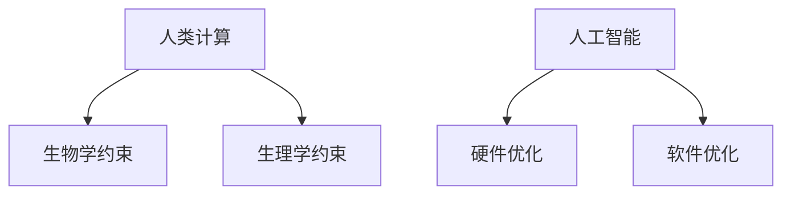

                 

**AI与人类计算：未来的道德考虑**

> 关键词：人工智能、人类计算、道德考虑、伦理挑战、未来发展

## 1. 背景介绍

人工智能（AI）的发展正在改变世界，从自动驾驶汽车到智能医疗设备，AI无处不在。然而，随着AI技术的不断进步，我们也面临着一系列道德和伦理挑战。本文将探讨AI与人类计算的未来，并就道德考虑提出一些建议。

## 2. 核心概念与联系

### 2.1 人工智能与人类计算

人工智能旨在模仿人类智能，而人类计算则是指人类大脑的计算过程。二者的区别在于，人类计算受限于生物学和生理学的约束，而人工智能则可以在硬件和软件上进行优化。



### 2.2 道德考虑的必要性

随着AI技术的发展，我们需要考虑其对人类的影响。道德考虑是确保AI技术安全、公平、透明和负责任的关键。

## 3. 核心算法原理 & 具体操作步骤

### 3.1 算法原理概述

AI算法的核心原理是学习。机器学习算法通过从数据中学习模式来做出预测，而深度学习算法则模仿人类大脑的结构来学习。

### 3.2 算法步骤详解

1. 数据收集：收集与问题相关的数据。
2. 数据预处理：清洗、标记和格式化数据。
3. 模型选择：选择适合问题的算法。
4. 模型训练：使用数据训练模型。
5. 模型评估：评估模型的性能。
6. 部署：将模型部署到生产环境中。

### 3.3 算法优缺点

优点：AI算法可以处理大量数据，发现复杂模式，并做出准确预测。缺点：AI算法可能会受到数据偏见的影响，导致不公平的结果。此外，AI算法的决策过程可能是不透明的，难以理解和解释。

### 3.4 算法应用领域

AI算法广泛应用于各个领域，包括医疗、金融、交通、娱乐等。

## 4. 数学模型和公式 & 详细讲解 & 举例说明

### 4.1 数学模型构建

数学模型是AI算法的基础。例如，线性回归模型可以表示为：

$$y = wx + b$$

其中，$y$是目标变量，$x$是输入变量，$w$和$b$是模型参数。

### 4.2 公式推导过程

模型参数通常通过最小化误差平方和来学习：

$$\min \sum (y_i - wx_i - b)^2$$

### 4.3 案例分析与讲解

例如，在预测房价的问题中，$y$是房价，$x$是房屋面积。通过学习模型参数$w$和$b$，我们可以预测给定面积的房屋价格。

## 5. 项目实践：代码实例和详细解释说明

### 5.1 开发环境搭建

我们将使用Python和Scikit-learn库来构建一个简单的线性回归模型。

### 5.2 源代码详细实现

```python
from sklearn.linear_model import LinearRegression
from sklearn.model_selection import train_test_split
from sklearn.metrics import mean_squared_error

# Load data
X, y = load_data()

# Split data into training and test sets
X_train, X_test, y_train, y_test = train_test_split(X, y, test_size=0.2, random_state=42)

# Create a linear regression model
model = LinearRegression()

# Train the model
model.fit(X_train, y_train)

# Make predictions on the test set
y_pred = model.predict(X_test)

# Evaluate the model
print("Mean Squared Error:", mean_squared_error(y_test, y_pred))
```

### 5.3 代码解读与分析

这段代码使用Scikit-learn库构建了一个简单的线性回归模型。它首先加载数据，然后将数据分成训练集和测试集。之后，它创建一个线性回归模型，并使用训练集训练模型。然后，它使用测试集做出预测，并计算均方误差来评估模型的性能。

### 5.4 运行结果展示

运行这段代码后，您会看到均方误差的值。这个值越小，模型的性能就越好。

## 6. 实际应用场景

### 6.1 当前应用

AI算法已经广泛应用于各个领域，从自动驾驶汽车到智能医疗设备，再到语音助手。

### 6.2 未来应用展望

未来，AI技术将继续发展，可能会出现更先进的算法，能够处理更复杂的任务。然而，我们也需要考虑这些技术的道德和伦理影响。

## 7. 工具和资源推荐

### 7.1 学习资源推荐

- 书籍：《人工智能：一种现代 Approach》作者：Stuart Russell、Peter Norvig
- 网站：[AI Index Report](https://index.stanford.edu/)提供了AI技术的最新进展和统计数据。

### 7.2 开发工具推荐

- Python：一种流行的编程语言，具有丰富的AI库。
- TensorFlow：一个开源的机器学习库。

### 7.3 相关论文推荐

- "Ethical Implications of Autonomous Vehicles"：一篇关于自动驾驶汽车道德影响的论文。

## 8. 总结：未来发展趋势与挑战

### 8.1 研究成果总结

本文讨论了AI与人类计算的未来，并就道德考虑提出了一些建议。我们需要考虑AI技术的道德和伦理影响，确保它们安全、公平、透明和负责任。

### 8.2 未来发展趋势

未来，AI技术将继续发展，可能会出现更先进的算法，能够处理更复杂的任务。然而，我们也需要考虑这些技术的道德和伦理影响。

### 8.3 面临的挑战

面临的挑战包括数据偏见、不透明的决策过程、缺乏监管等。

### 8.4 研究展望

未来的研究应该关注AI技术的道德和伦理影响，确保它们安全、公平、透明和负责任。

## 9. 附录：常见问题与解答

**Q：AI技术是否会取代人类工作？**

**A：**AI技术可能会改变工作的性质，但不会完全取代人类工作。相反，它们可能会创造新的工作岗位。

**Q：如何确保AI技术是公平的？**

**A：**确保AI技术公平的一种方法是使用不偏见的数据集来训练模型，并定期评估模型的性能。

**Q：如何解释AI算法的决策过程？**

**A：**解释AI算法决策过程的一种方法是使用可解释的模型，或者使用技术如LIME或SHAP来解释模型的决策。

**作者：禅与计算机程序设计艺术 / Zen and the Art of Computer Programming**

