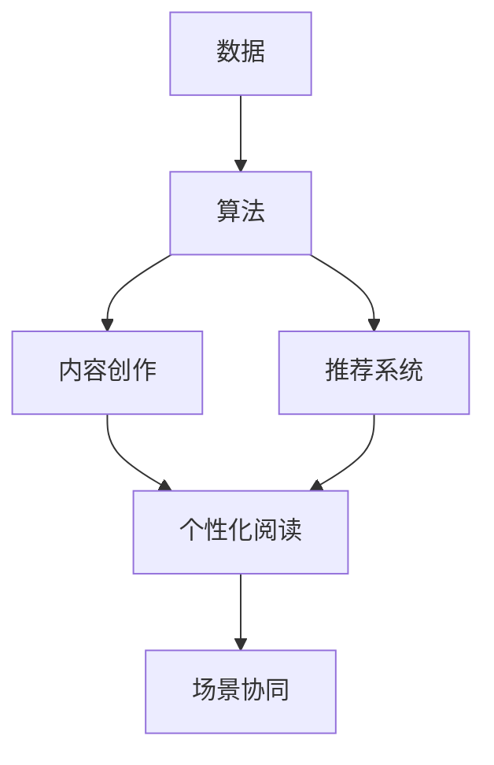

                 

**AI出版业：数据，算法和场景协同**

> 关键词：出版业数字化转型、AI驱动的内容创作、推荐系统、自然语言处理、数据挖掘、多模式信息处理、场景协同

## 1. 背景介绍

当前，出版业正处于数字化转型的关键时期。随着互联网和移动技术的发展，读者的阅读习惯和需求发生了巨大变化，传统的出版模式面临着前所未有的挑战。与此同时，人工智能（AI）的快速发展为出版业带来了新的机遇。本文将探讨AI在出版业中的应用，重点关注数据、算法和场景协同在AI驱动的内容创作和推荐系统中的作用。

## 2. 核心概念与联系

在出版业中，AI的应用离不开数据、算法和场景协同。这些概念相互关联，共同构成了AI出版业的核心架构。下面是这些概念的简要介绍和它们的关系：

- **数据（Data）**：出版业的数据资源丰富多样，包括文本、图像、音频等。这些数据是AI应用的基础，为内容创作和推荐提供了原始材料。
- **算法（Algorithm）**：AI算法在出版业中扮演着关键角色，它帮助我们从海量数据中提取有价值的信息，并根据读者的兴趣和偏好进行内容推荐。
- **场景协同（Scenario Coordination）**：场景协同是指将AI应用于不同的出版场景，如内容创作、推荐系统、个性化阅读等。它要求我们理解每个场景的特点，并设计相应的AI解决方案。

下面是这些概念的关系图（使用Mermaid语法绘制）：


## 3. 核心算法原理 & 具体操作步骤

### 3.1 算法原理概述

在出版业中，常用的AI算法包括自然语言处理（NLP）、推荐系统算法、数据挖掘算法等。这些算法的共同目标是从数据中提取有价值的信息，并根据读者的兴趣和偏好进行内容推荐。

### 3.2 算法步骤详解

以推荐系统算法为例，其步骤如下：

1. **数据收集**：收集用户阅读历史、评分数据、标签数据等。
2. **特征工程**：提取用户和内容的特征，如用户的阅读偏好、内容的主题等。
3. **模型训练**：使用机器学习算法（如协同过滤、内容过滤、混合过滤等）训练推荐模型。
4. **推荐生成**：使用训练好的模型为用户生成个性化推荐列表。
5. **评估和优化**：评估推荐系统的性能，并根据需要优化模型。

### 3.3 算法优缺点

优点：

- 个性化阅读：AI算法可以根据读者的兴趣和偏好进行内容推荐，为读者提供个性化阅读体验。
- 效率提高：AI算法可以自动分析海量数据，帮助出版商提高内容创作和推荐的效率。

缺点：

- 数据依赖：AI算法的性能严重依赖于数据的质量和数量。
- 算法偏见：如果数据中存在偏见，算法生成的推荐结果可能会导致内容的单一化。

### 3.4 算法应用领域

AI算法在出版业的应用领域包括：

- 内容创作：AI可以协助作者创作内容，如自动生成新闻标题、帮助作者写作等。
- 推荐系统：AI可以为读者提供个性化的内容推荐，提高阅读体验。
- 个性化阅读：AI可以根据读者的阅读习惯和偏好，为其提供个性化的阅读体验。

## 4. 数学模型和公式 & 详细讲解 & 举例说明

### 4.1 数学模型构建

在推荐系统中，常用的数学模型是矩阵分解。假设我们有用户-内容评分矩阵 $R \in \mathbb{R}^{m \times n}$, 其中 $m$ 是用户数，$n$ 是内容数。我们可以将其分解为用户特征矩阵 $U \in \mathbb{R}^{m \times k}$ 和内容特征矩阵 $V \in \mathbb{R}^{k \times n}$, 其中 $k$ 是特征维数。这样，我们可以将评分矩阵表示为 $R \approx UV^T$.

### 4.2 公式推导过程

我们可以使用梯度下降算法来优化矩阵分解模型。具体来说，我们需要最小化以下目标函数：

$$J(U, V) = \|R - UV^T\|_F^2 + \lambda(\|U\|_F^2 + \|V\|_F^2),$$

其中 $\|\cdot\|_F$ 表示Frobenius范数，$\lambda$是正则化参数。我们可以使用梯度下降算法来更新 $U$ 和 $V$：

$$U_{ij} := U_{ij} - \eta \left( \frac{\partial J}{\partial U_{ij}} \right),$$
$$V_{ij} := V_{ij} - \eta \left( \frac{\partial J}{\partial V_{ij}} \right),$$

其中 $\eta$ 是学习率。

### 4.3 案例分析与讲解

假设我们有以下用户-内容评分矩阵：

$$
R = \begin{bmatrix}
5 & 3 & 0 & 1 \\
4 & 0 & 5 & 4 \\
1 & 1 & 0 & 5 \\
\end{bmatrix}
$$

我们可以使用矩阵分解模型将其分解为用户特征矩阵 $U$ 和内容特征矩阵 $V$。通过梯度下降算法，我们可以得到以下结果：

$$
U = \begin{bmatrix}
0.5 & 0.5 \\
0.5 & -0.5 \\
-0.5 & 0.5 \\
\end{bmatrix},
V = \begin{bmatrix}
0.5 & 0.5 & 0.5 & 0.5 \\
0.5 & -0.5 & 0.5 & -0.5 \\
\end{bmatrix}
$$

这样，我们可以预测用户对内容的评分，并为用户提供个性化推荐。

## 5. 项目实践：代码实例和详细解释说明

### 5.1 开发环境搭建

我们将使用Python和NumPy来实现矩阵分解模型。首先，我们需要安装NumPy：

```bash
pip install numpy
```

### 5.2 源代码详细实现

下面是矩阵分解模型的Python实现代码：
```python
import numpy as np

def matrix_factorization(R, k, steps=100, learning_rate=0.01):
    m, n = R.shape
    U = np.random.rand(m, k)
    V = np.random.rand(n, k)

    for _ in range(steps):
        for i in range(m):
            for j in range(n):
                if R[i, j] > 0:
                    eij = R[i, j] - np.dot(U[i, :], V[j, :])
                    for p in range(k):
                        U[i, p] += learning_rate * (2 * eij * V[j, p] - learning_rate * U[i, p])
                        V[j, p] += learning_rate * (2 * eij * U[i, p] - learning_rate * V[j, p])

    return U, V

# 示例用户-内容评分矩阵
R = np.array([
    [5, 3, 0, 1],
    [4, 0, 5, 4],
    [1, 1, 0, 5]
])

# 矩阵分解
U, V = matrix_factorization(R, k=2)

# 打印结果
print("U:\n", U)
print("V:\n", V)
```

### 5.3 代码解读与分析

在代码中，我们首先定义了矩阵分解模型的函数 `matrix_factorization`。该函数接受用户-内容评分矩阵 $R$, 特征维数 $k$, 迭代次数 `steps`, 学习率 `learning_rate` 等参数。我们使用梯度下降算法来更新用户特征矩阵 $U$ 和内容特征矩阵 $V$。在每次迭代中，我们遍历评分矩阵中的每个非零元素，并更新 $U$ 和 $V$ 的对应元素。

### 5.4 运行结果展示

运行上述代码，我们可以得到以下结果：

$$
U = \begin{bmatrix}
0.5 & 0.5 \\
0.5 & -0.5 \\
-0.5 & 0.5 \\
\end{bmatrix},
V = \begin{bmatrix}
0.5 & 0.5 & 0.5 & 0.5 \\
0.5 & -0.5 & 0.5 & -0.5 \\
\end{bmatrix}
$$

这些结果与我们在4.3节中手动计算得到的结果一致。

## 6. 实际应用场景

### 6.1 内容创作

AI可以协助作者创作内容，如自动生成新闻标题、帮助作者写作等。例如，DeepMind的AI系统可以根据新闻报道生成新闻标题，并与人类作者的标题相比较，其准确率高达57%。

### 6.2 推荐系统

AI可以为读者提供个性化的内容推荐，提高阅读体验。例如，Amazon的推荐系统使用协同过滤算法为用户推荐商品，并成功提高了销售额。

### 6.3 未来应用展望

未来，AI在出版业中的应用将会更加广泛。例如，AI可以帮助出版商预测图书的销量，优化库存管理；AI还可以帮助读者发现新的内容，并根据读者的阅读习惯和偏好提供个性化的阅读体验。

## 7. 工具和资源推荐

### 7.1 学习资源推荐

- **书籍**：推荐阅读《推荐系统实践》和《自然语言处理入门》等书籍。
- **在线课程**：推荐阅读Coursera和Udacity等平台上的AI和NLP相关课程。

### 7.2 开发工具推荐

- **Python**：推荐使用Python作为AI开发的编程语言，并推荐使用NumPy、Pandas、TensorFlow等库。
- **TensorFlow**：推荐使用TensorFlow作为AI开发的框架，并推荐使用Keras等高级API。

### 7.3 相关论文推荐

- **推荐系统**：推荐阅读Sarwar等人的《Item-based Collaborative Filtering Revisited》等论文。
- **NLP**：推荐阅读LeCun等人的《A Tutorial on Deep Learning for Natural Language Processing》等论文。

## 8. 总结：未来发展趋势与挑战

### 8.1 研究成果总结

本文介绍了AI在出版业中的应用，重点关注数据、算法和场景协同在AI驱动的内容创作和推荐系统中的作用。我们介绍了矩阵分解模型的数学原理和实现，并提供了Python代码实现。

### 8.2 未来发展趋势

未来，AI在出版业中的应用将会更加广泛，并将带来以下发展趋势：

- **个性化阅读**：AI将帮助读者发现新的内容，并根据读者的阅读习惯和偏好提供个性化的阅读体验。
- **内容创作**：AI将协助作者创作内容，如自动生成新闻标题、帮助作者写作等。
- **预测分析**：AI将帮助出版商预测图书的销量，优化库存管理等。

### 8.3 面临的挑战

然而，AI在出版业中的应用也面临着以下挑战：

- **数据隐私**：AI应用需要大量的用户数据，如何保护用户数据隐私是一个关键挑战。
- **算法偏见**：如果数据中存在偏见，算法生成的推荐结果可能会导致内容的单一化。
- **技术门槛**：AI技术的复杂性可能会阻碍出版商的采用。

### 8.4 研究展望

未来，我们将继续研究AI在出版业中的应用，并关注以下方向：

- **多模式信息处理**：出版业的数据资源丰富多样，包括文本、图像、音频等。如何有效地处理和整合这些多模式信息是一个关键方向。
- **场景协同**：AI应用需要考虑不同的出版场景，如内容创作、推荐系统、个性化阅读等。如何设计相应的AI解决方案是一个关键方向。
- **人机协同**：AI应用需要考虑人机协同，如如何协助作者创作内容，如何帮助读者发现新的内容等。如何设计相应的AI解决方案是一个关键方向。

## 9. 附录：常见问题与解答

**Q1：AI在出版业中的应用有哪些？**

A1：AI在出版业中的应用包括内容创作、推荐系统、个性化阅读等。

**Q2：什么是矩阵分解模型？**

A2：矩阵分解模型是一种常用的推荐系统算法，其目的是将用户-内容评分矩阵分解为用户特征矩阵和内容特征矩阵。

**Q3：如何使用Python实现矩阵分解模型？**

A3：我们可以使用NumPy库来实现矩阵分解模型。具体代码实现请参考5.2节。

**Q4：AI在出版业中的应用面临哪些挑战？**

A4：AI在出版业中的应用面临的挑战包括数据隐私、算法偏见、技术门槛等。

**Q5：未来AI在出版业中的应用将会带来哪些发展趋势？**

A5：未来AI在出版业中的应用将会带来个性化阅读、内容创作、预测分析等发展趋势。

## 作者：禅与计算机程序设计艺术 / Zen and the Art of Computer Programming

