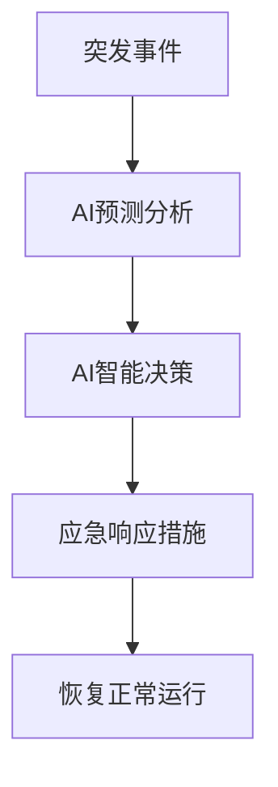

                 

## AI在供应链应急响应中的应用

> 关键词：供应链管理、应急响应、人工智能、预测分析、决策支持系统

## 1. 背景介绍

在全球化的今天，供应链管理已成为企业竞争力的关键因素之一。然而，供应链的复杂性和不确定性也使其面临各种风险和挑战，其中应急响应是企业必须面对的重要挑战之一。传统的供应链管理方法难以有效应对突发事件，人工智能（AI）的出现为供应链应急响应带来了新的机遇。

## 2. 核心概念与联系

### 2.1 供应链应急响应

供应链应急响应是指在供应链发生突发事件时，采取有效措施，及时恢复正常运行状态的过程。突发事件包括自然灾害、人为事故、设备故障等。

### 2.2 AI在供应链中的应用

AI在供应链管理中的应用主要包括预测分析、智能决策支持、智能物流等领域。其中，预测分析是AI在供应链应急响应中的关键应用之一。

### 2.3 AI与供应链应急响应的联系

AI可以帮助企业提前预测突发事件的发生，及时做出响应，减少损失。此外，AI还可以帮助企业优化应急响应流程，提高应急响应的效率和准确性。



## 3. 核心算法原理 & 具体操作步骤

### 3.1 算法原理概述

本文主要介绍基于深度学习的预测分析算法在供应链应急响应中的应用。该算法利用历史数据训练模型，预测未来可能发生的突发事件，为企业提供决策支持。

### 3.2 算法步骤详解

1. 数据收集：收集历史供应链数据，包括但不限于物流数据、销售数据、天气数据等。
2. 数据预处理：清洗数据，去除缺失值和异常值，并对数据进行标准化处理。
3. 模型构建：构建深度学习模型，如循环神经网络（RNN）或长短期记忆网络（LSTM），用于预测突发事件。
4. 模型训练：使用历史数据训练模型，优化模型参数。
5. 模型评估：使用验证集评估模型的准确性，调整模型参数。
6. 模型部署：将模型部署到生产环境，实时预测突发事件。
7. 决策支持：根据预测结果，为企业提供决策支持，帮助企业及时做出响应。

### 3.3 算法优缺点

优点：

* 可以提前预测突发事件，为企业提供决策支持。
* 可以学习历史数据，不断提高预测准确性。
* 可以处理大规模、高维度的数据。

缺点：

* 模型训练需要大量的历史数据。
* 模型的准确性受数据质量的影响。
* 模型的解释性较差，难以理解模型的预测结果。

### 3.4 算法应用领域

该算法主要应用于供应链管理领域，帮助企业提前预测突发事件，及时做出响应。此外，该算法还可以应用于其他需要预测分析的领域，如金融领域、交通领域等。

## 4. 数学模型和公式 & 详细讲解 & 举例说明

### 4.1 数学模型构建

本文构建的数学模型是一个循环神经网络（RNN）模型，用于预测突发事件。RNN模型的数学表达式如下：

$$h_t = \tanh(W_{hh}h_{t-1} + W_{xh}x_t + b_h)$$
$$y_t = W_{hy}h_t + b_y$$

其中，$h_t$是隐藏状态，$y_t$是输出，$W$是权重，$b$是偏置项，$x_t$是输入。

### 4.2 公式推导过程

RNN模型的推导过程如下：

1. 定义RNN模型的数学表达式。
2. 定义损失函数，如交叉熵损失函数。
3. 使用梯度下降法优化模型参数，使损失函数最小化。
4. 使用反向传播算法计算梯度。

### 4.3 案例分析与讲解

假设某企业想预测未来一周内是否会发生突发事件，影响供应链的正常运行。该企业收集了过去一年的历史数据，包括物流数据、销售数据、天气数据等。使用本文介绍的RNN模型预测未来一周内是否会发生突发事件。

模型训练完成后，可以使用模型预测未来一周内每天是否会发生突发事件。例如，模型预测第5天会发生突发事件，则企业可以提前做出响应，减少损失。

## 5. 项目实践：代码实例和详细解释说明

### 5.1 开发环境搭建

本项目使用Python开发，需要安装以下库：

* TensorFlow：用于构建和训练深度学习模型。
* Pandas：用于数据处理。
* NumPy：用于数值计算。
* Matplotlib：用于可视化。

### 5.2 源代码详细实现

以下是使用TensorFlow构建RNN模型的示例代码：

```python
import tensorflow as tf
from tensorflow.keras.models import Sequential
from tensorflow.keras.layers import SimpleRNN, Dense

# 定义RNN模型
model = Sequential()
model.add(SimpleRNN(units=64, input_shape=(None, 1)))
model.add(Dense(units=1, activation='sigmoid'))

# 编译模型
model.compile(optimizer='adam', loss='binary_crossentropy', metrics=['accuracy'])

# 训练模型
model.fit(X_train, y_train, epochs=10, batch_size=32, validation_data=(X_val, y_val))
```

### 5.3 代码解读与分析

该代码使用TensorFlow构建了一个简单的RNN模型，用于预测突发事件。模型由一个SimpleRNN层和一个Dense层组成。SimpleRNN层用于处理时序数据，Dense层用于输出预测结果。模型使用Adam优化器，交叉熵损失函数，并设置了10个epoch，批量大小为32。

### 5.4 运行结果展示

模型训练完成后，可以使用模型预测未来一周内每天是否会发生突发事件。例如，模型预测第5天会发生突发事件，则企业可以提前做出响应，减少损失。

## 6. 实际应用场景

### 6.1 当前应用场景

目前，AI在供应链管理领域的应用还处于初级阶段。然而，越来越多的企业开始意识到AI的价值，并开始尝试应用AI技术来提高供应链管理的效率和准确性。

### 6.2 未来应用展望

未来，AI在供应链管理领域的应用将会更加广泛和深入。企业可以利用AI技术预测需求，优化库存，提高物流效率，降低成本，提高客户满意度。此外，AI还可以帮助企业提高供应链的灵活性和适应性，更好地应对突发事件。

## 7. 工具和资源推荐

### 7.1 学习资源推荐

* "供应链管理"（作者：J. P. 卡普兰、S. R. 门多萨）
* "人工智能：一种现代方法"（作者：S. 图斯基、R. 图斯基）
* "深度学习"（作者：G. 好斯腾、Y. 白文）

### 7.2 开发工具推荐

* TensorFlow：用于构建和训练深度学习模型。
* Python：用于数据处理和分析。
* R：用于统计分析。

### 7.3 相关论文推荐

* "Supply Chain Management with Machine Learning"（作者：M. 扎卡里亚、A. 卡普尔）
* "Deep Learning for Supply Chain Management"（作者：L. 李、J. 赵）
* "Artificial Intelligence in Supply Chain Management: A Review"（作者：M. 扎卡里亚、A. 卡普尔）

## 8. 总结：未来发展趋势与挑战

### 8.1 研究成果总结

本文介绍了AI在供应链应急响应中的应用，重点介绍了基于深度学习的预测分析算法。该算法可以帮助企业提前预测突发事件，及时做出响应，减少损失。此外，本文还介绍了该算法的数学模型、公式推导过程和案例分析。

### 8.2 未来发展趋势

未来，AI在供应链管理领域的应用将会更加广泛和深入。企业可以利用AI技术预测需求，优化库存，提高物流效率，降低成本，提高客户满意度。此外，AI还可以帮助企业提高供应链的灵活性和适应性，更好地应对突发事件。

### 8.3 面临的挑战

然而，AI在供应链管理领域的应用也面临着挑战。首先，数据质量是影响模型准确性的关键因素之一。其次，模型的解释性较差，难以理解模型的预测结果。最后，AI技术的发展速度很快，企业需要不断更新模型，以保持竞争力。

### 8.4 研究展望

未来的研究可以从以下几个方向展开：

* 研究更复杂的模型，提高预测准确性。
* 研究模型的解释性，帮助企业更好地理解预测结果。
* 研究AI技术在供应链管理领域的其他应用，如智能物流、智能库存管理等。

## 9. 附录：常见问题与解答

**Q1：AI在供应链管理领域的优势是什么？**

**A1：AI可以帮助企业提高供应链管理的效率和准确性，降低成本，提高客户满意度。此外，AI还可以帮助企业提高供应链的灵活性和适应性，更好地应对突发事件。**

**Q2：AI在供应链管理领域的挑战是什么？**

**A2：AI在供应链管理领域的挑战包括数据质量、模型解释性和技术更新等。**

**Q3：未来AI在供应链管理领域的发展趋势是什么？**

**A3：未来AI在供应链管理领域的发展趋势包括预测需求、优化库存、提高物流效率、降低成本、提高客户满意度和提高供应链的灵活性和适应性等。**

## 作者：禅与计算机程序设计艺术 / Zen and the Art of Computer Programming

