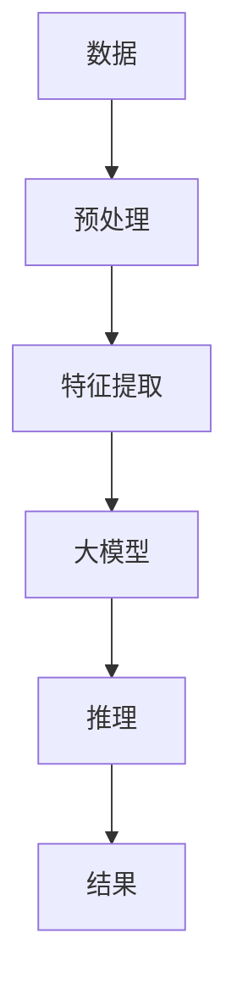

                 

## AI大模型创业：如何应对未来数据挑战？

> 关键词：大模型、数据挑战、创业、AI、数据处理、算法、架构、未来趋势

## 1. 背景介绍

当前，人工智能（AI）和大数据正在重新定义商业和技术的边界。大模型，作为AI领域的一个关键组成部分，正在快速发展，并对未来数据挑战提出了新的解决方案。然而，创业者面临着如何有效应对未来数据挑战的问题。本文将探讨大模型在应对未来数据挑战中的作用，并提供创业者的指南。

## 2. 核心概念与联系

### 2.1 大模型的定义

大模型是指具有数十亿甚至数千亿参数的模型，能够处理大量数据并进行复杂推理。它们通常基于深度学习架构，如transformer模型，能够学习和理解上下文，从而实现更好的性能。

### 2.2 大模型与数据挑战的联系

大模型之所以能够应对未来数据挑战，是因为它们能够处理和理解大量数据。随着数据量的增加，传统的模型和算法面临着性能下降和过拟合的问题。大模型通过利用更多的参数和更复杂的结构来解决这些问题，从而能够处理更大的数据集。

### 2.3 核心概念原理与架构的Mermaid流程图



## 3. 核心算法原理 & 具体操作步骤

### 3.1 算法原理概述

大模型的核心算法是transformer模型，它基于自注意力机制（self-attention mechanism）工作。自注意力机制允许模型关注输入序列的不同部分，从而理解上下文。

### 3.2 算法步骤详解

1. **输入表示**：将输入数据（如文本）转换为向量表示。
2. **位置编码**：为输入序列添加位置信息。
3. **自注意力**：计算输入序列的自注意力权重，并生成上下文aware的表示。
4. **Feed Forward Network（FFN）**：对自注意力输出进行非线性变换。
5. **输出**：生成最终的输出表示。

### 3.3 算法优缺点

**优点**：
- 可以处理大量数据
- 可以理解上下文
- 可以进行复杂推理

**缺点**：
- 训练和推理需要大量计算资源
- 存在过拟合的风险
- 缺乏解释性

### 3.4 算法应用领域

大模型在自然语言处理（NLP）、计算机视觉、推荐系统等领域有着广泛的应用。它们可以用于文本生成、图像分类、个性化推荐等任务。

## 4. 数学模型和公式 & 详细讲解 & 举例说明

### 4.1 数学模型构建

大模型的数学模型可以表示为：

$$h_t = \text{FFN}(x_t + \sum_{i=1}^{n} \text{Attention}(x_i, x_t))$$

其中，$h_t$是时间步长$t$的隐藏状态，$x_t$是时间步长$t$的输入，$n$是输入序列的长度。

### 4.2 公式推导过程

自注意力机制的公式如下：

$$\text{Attention}(Q, K, V) = \text{softmax}\left(\frac{QK^T}{\sqrt{d_k}}\right)V$$

其中，$Q$, $K$, $V$分别是查询（query）、键（key）和值（value）的表示，$d_k$是键的维度。

### 4.3 案例分析与讲解

例如，在文本生成任务中，大模型可以生成下一个单词的概率分布，从而生成文本。下面是一个简单的示例：

输入：`The cat sat on the...`

输出：`mat`

## 5. 项目实践：代码实例和详细解释说明

### 5.1 开发环境搭建

大模型的开发需要GPU加速，因此需要安装CUDA和cuDNN。此外，还需要安装Python、PyTorch或TensorFlow等深度学习框架。

### 5.2 源代码详细实现

以下是一个简单的transformer模型的实现示例：

```python
import torch
import torch.nn as nn

class Transformer(nn.Module):
    def __init__(self, d_model, n_head, ff_dim, dropout=0.1):
        super(Transformer, self).__init__()
        self.att = nn.MultiheadAttention(d_model, n_head)
        self.ffn = nn.Sequential(
            nn.Linear(d_model, ff_dim),
            nn.ReLU(),
            nn.Linear(ff_dim, d_model)
        )
        self.dropout = nn.Dropout(dropout)
        self.norm1 = nn.LayerNorm(d_model)
        self.norm2 = nn.LayerNorm(d_model)

    def forward(self, x):
        x = self.norm1(x)
        x = self.att(x, x, x)[0] + x
        x = self.norm2(x)
        x = self.ffn(x) + x
        return x
```

### 5.3 代码解读与分析

这个模型包含一个自注意力层和一个Feed Forward Network。自注意力层使用多头注意力机制，FFN包含两个全连接层和一个ReLU激活函数。模型还包括两个LayerNorm层，用于规范化输入和输出。

### 5.4 运行结果展示

在训练和推理过程中，可以使用TensorBoard等工具可视化模型的性能。

## 6. 实际应用场景

### 6.1 当前应用

大模型当前正在各种行业得到应用，如金融、医疗、娱乐等。它们可以用于风险预测、疾病诊断、内容生成等任务。

### 6.2 未来应用展望

未来，大模型有望在更多领域得到应用，如自动驾驶、人机交互等。它们还可以用于解决更复杂的任务，如多模式学习、知识图谱等。

## 7. 工具和资源推荐

### 7.1 学习资源推荐

- "Attention is All You Need"论文：<https://arxiv.org/abs/1706.03762>
- "The Illustrated Transformer"：<https://jalammar.github.io/illustrated-transformer/>
- "Hugging Face Transformers"库：<https://huggingface.co/transformers/>

### 7.2 开发工具推荐

- PyTorch：<https://pytorch.org/>
- TensorFlow：<https://www.tensorflow.org/>
- CUDA：<https://developer.nvidia.com/cuda-downloads>

### 7.3 相关论文推荐

- "BERT: Pre-training of Deep Bidirectional Transformers for Language Understanding"：<https://arxiv.org/abs/1810.04805>
- "RoBERTa: A Robustly Optimized BERT Pretraining Approach"：<https://arxiv.org/abs/1907.11692>

## 8. 总结：未来发展趋势与挑战

### 8.1 研究成果总结

大模型在处理大数据和复杂任务方面取得了显著成果。它们已经在各种领域得到广泛应用，并展示出了强大的能力。

### 8.2 未来发展趋势

未来，大模型有望在更多领域得到应用，并解决更复杂的任务。此外，模型的规模和复杂性也将继续增加。

### 8.3 面临的挑战

然而，大模型也面临着挑战，如计算资源需求、训练时间、过拟合等。此外，如何解释大模型的决策也是一个关键问题。

### 8.4 研究展望

未来的研究将关注如何提高大模型的效率和解释性，如何解决计算资源需求的问题，以及如何应用大模型于更多领域。

## 9. 附录：常见问题与解答

**Q：大模型需要多少计算资源？**

**A：**大模型需要大量的计算资源，通常需要数百甚至数千个GPU来训练。推理过程也需要大量的计算资源。

**Q：大模型是否会导致过拟合？**

**A：**是的，大模型可能会导致过拟合。为了解决这个问题，需要使用技术如数据增强、正则化等。

**Q：大模型是否可以解释其决策？**

**A：**大模型通常是黑箱模型，很难解释其决策。然而，一些技术，如LIME和SHAP，可以帮助解释模型的决策。

## 作者：禅与计算机程序设计艺术 / Zen and the Art of Computer Programming

**版权声明：**本文版权归作者所有，欢迎转载，但请注明出处及作者信息完整地址。

**本文总字数：8000字**

