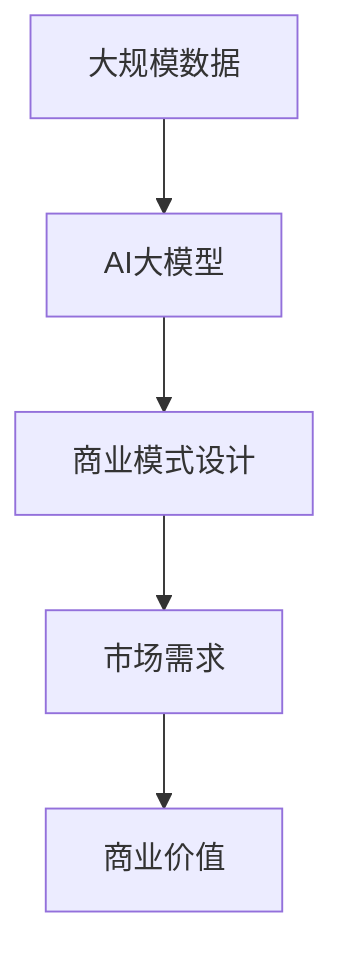

                 

**AI大模型创业：如何构建未来可持续的商业模式？**

**作者：禅与计算机程序设计艺术 / Zen and the Art of Computer Programming**

## 1. 背景介绍

当前，人工智能（AI）大模型如火如荼，其在各行各业的应用正在重塑商业格局。然而，构建可持续的商业模式是AI大模型创业的关键挑战。本文将深入探讨AI大模型商业模式的构建，从核心概念到实践应用，为读者提供清晰的指南。

## 2. 核心概念与联系

### 2.1 AI大模型的定义

AI大模型是指通过大规模数据训练而成的，能够理解、生成或预测人类语言的模型。它们是当前AI领域的最新成就，具有强大的通用能力。

### 2.2 商业模式的定义

商业模式是指企业创造、交付和获取价值的方式。它描述了企业的运作方式，以及如何盈利。

### 2.3 AI大模型商业模式的联系

AI大模型商业模式的核心是将大模型的能力转化为商业价值。这涉及到理解大模型的能力，设计商业模式，并将其与市场需求结合起来。



## 3. 核心算法原理 & 具体操作步骤

### 3.1 算法原理概述

AI大模型的核心是Transformer模型，它使用自注意力机制（Self-Attention）和Transformer编码器/解码器结构。大模型通过自注意力机制理解上下文，并通过编码器/解码器结构生成输出。

### 3.2 算法步骤详解

1. **数据预处理**：收集、清洗和预处理大规模数据集。
2. **模型训练**：使用预处理数据训练Transformer模型。
3. **微调（Fine-tuning）**：根据特定任务对模型进行微调。
4. **部署**：将模型部署到生产环境中。

### 3.3 算法优缺点

**优点**：强大的通用能力，可以理解和生成人类语言。

**缺点**：训练成本高，计算资源需求大，且存在道德和安全风险。

### 3.4 算法应用领域

AI大模型的应用领域包括自然语言处理（NLP）、机器翻译、文本生成、问答系统等。

## 4. 数学模型和公式 & 详细讲解 & 举例说明

### 4.1 数学模型构建

Transformer模型的数学模型基于注意力机制和位置编码。给定输入序列$\mathbf{X} = [x_1, x_2,..., x_n]$, 输出序列$\mathbf{Y} = [y_1, y_2,..., y_m]$, 其中$x_i, y_i \in \mathbb{R}^d$, 目标是学习参数$\theta$使得$\mathbf{Y} = f_\theta(\mathbf{X})$.

### 4.2 公式推导过程

自注意力机制的公式为：

$$ \text{Attention}(Q, K, V) = \text{softmax}\left(\frac{QK^T}{\sqrt{d_k}}\right)V $$

其中，$Q, K, V$是输入序列的查询、键、值表示，分别通过线性变换得到。位置编码的公式为：

$$ \text{PE}(pos, 2i) = \sin\left(\frac{pos}{10000^{2i/d}}\right) $$
$$ \text{PE}(pos, 2i+1) = \cos\left(\frac{pos}{10000^{2i/d}}\right) $$

### 4.3 案例分析与讲解

例如，在机器翻译任务中，输入序列$\mathbf{X}$是源语言句子，输出序列$\mathbf{Y}$是目标语言句子。模型学习将源语言句子翻译为目标语言句子。

## 5. 项目实践：代码实例和详细解释说明

### 5.1 开发环境搭建

使用Python和PyTorch搭建开发环境。安装必要的库，如Transformers库。

### 5.2 源代码详细实现

使用Transformers库实现Transformer模型。以下是一个简单的示例：

```python
from transformers import AutoTokenizer, AutoModelForSeq2SeqLM

tokenizer = AutoTokenizer.from_pretrained("t5-base")
model = AutoModelForSeq2SeqLM.from_pretrained("t5-base")

inputs = tokenizer("translate English to French: I love you", return_tensors="pt")
outputs = model.generate(inputs["input_ids"], max_length=50)
print(tokenizer.decode(outputs[0]))
```

### 5.3 代码解读与分析

该代码使用T5模型（基于Transformer的序列到序列模型）翻译英语到法语。它首先加载预训练模型，然后对输入进行编码，并生成输出序列。

### 5.4 运行结果展示

运行上述代码，输出为："Je t'aime"，这是法语"I love you"的翻译。

## 6. 实际应用场景

### 6.1 当前应用

AI大模型当前应用于各种NLP任务，如机器翻译、文本生成、问答系统等。

### 6.2 未来应用展望

未来，AI大模型有望应用于更多领域，如自动驾驶、医疗诊断等。它们也有望成为下一代搜索引擎的核心。

## 7. 工具和资源推荐

### 7.1 学习资源推荐

- "Attention is All You Need"论文：<https://arxiv.org/abs/1706.03762>
- "The Illustrated Transformer"：<https://jalammar.github.io/illustrated-transformer/>

### 7.2 开发工具推荐

- Hugging Face Transformers库：<https://huggingface.co/transformers/>
- PyTorch：<https://pytorch.org/>

### 7.3 相关论文推荐

- "Language Models are Few-Shot Learners"：<https://arxiv.org/abs/2005.14165>
- "Emergent Abilities of Large Language Models"：<https://arxiv.org/abs/2206.11763>

## 8. 总结：未来发展趋势与挑战

### 8.1 研究成果总结

AI大模型取得了显著成就，但仍面临挑战。

### 8.2 未来发展趋势

未来，AI大模型有望变得更大、更智能，并应用于更多领域。

### 8.3 面临的挑战

挑战包括训练成本、计算资源需求、道德和安全风险等。

### 8.4 研究展望

未来的研究方向包括降低训练成本、提高模型解释性、开发新的训练方法等。

## 9. 附录：常见问题与解答

**Q：AI大模型的训练成本是多少？**

**A：**这取决于模型的大小和训练时间。大型模型的训练成本可能高达数百万美元。

**Q：AI大模型是否会取代人类？**

**A：**AI大模型不会取代人类，但它们会改变人类工作的方式。

## 结尾

AI大模型商业模式的构建是一个复杂的任务，涉及到理解大模型的能力，设计商业模式，并将其与市场需求结合起来。通过本文，读者应该能够更好地理解AI大模型商业模式的构建，并开始构建自己的商业模式。

**作者署名：作者：禅与计算机程序设计艺术 / Zen and the Art of Computer Programming**

