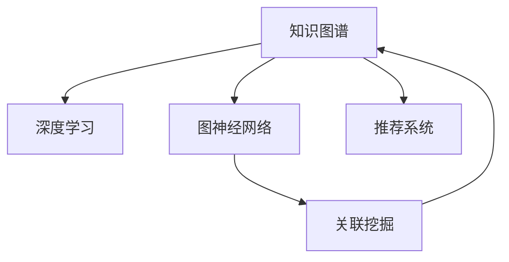

                 

# 知识的深度链接：构建复杂关联的方法

> 关键词：知识图谱、深度学习、图神经网络、关联挖掘、推荐系统

## 1. 背景介绍

### 1.1 问题由来
随着大数据和人工智能技术的发展，数据驱动的决策支持系统、智能推荐系统、内容推荐、社交网络分析等领域对知识表示和知识推理的需求日益增长。然而，传统的以关系型数据库为代表的静态数据表示方式已难以应对复杂、动态、异构的信息需求。近年来，知识图谱（Knowledge Graph, KG）作为一种新兴的数据表示方式，成为满足这些需求的有力工具。

知识图谱以结构化的三元组形式（实体-关系-实体）表示实体间的复杂关系，具有结构化、语义化、可扩展性强等优势。其可以整合多源异构数据，构建多层次、动态更新的知识库，为各种知识密集型应用提供强大的知识基础。然而，知识图谱的构建和维护需要大量专家知识和人工标注，开发成本高、效率低。

为此，构建无需专家干预、自动化的知识图谱，成为当前研究的重点之一。

### 1.2 问题核心关键点
知识图谱的构建主要包括以下几个关键点：

- 知识源抽取：从海量的文本、图像、视频等数据中抽取出结构化的实体、关系信息，构建知识图谱的基础数据。
- 实体链接：将抽取的实体与知识图谱中的实体进行链接，消除数据冗余和噪声。
- 关系抽取：从文本等数据中抽取实体间的关系信息，填充到知识图谱中。
- 知识图谱更新：基于新的数据，动态更新知识图谱，保持其时效性和准确性。

本文将重点讨论知识图谱的构建，即如何将非结构化数据自动转换为结构化的知识图谱，以及如何通过深度学习技术对知识图谱进行优化和扩展。

## 2. 核心概念与联系

### 2.1 核心概念概述

知识图谱是一种结构化的知识表示方式，通常由节点和边组成。节点代表实体，边代表实体间的关系。知识图谱不仅能够表示静态知识，还支持动态更新，记录实体的历史状态，体现时间依赖性。

深度学习是一种通过多层神经网络进行学习的方法，通过多层非线性变换捕捉数据的高级抽象特征。其在图像、语音、自然语言处理等领域取得了巨大成功。

图神经网络（Graph Neural Network, GNN）是一种特殊的深度学习模型，能够处理图结构数据。图神经网络通过设计特殊的神经网络结构，模拟节点间的邻居关系，捕捉全局图结构信息。

关联挖掘（Association Mining）是一种数据分析方法，从大量数据中挖掘出实体间的关联规则，常用于商业推荐、广告投放等领域。

知识图谱、深度学习、图神经网络、关联挖掘这四者之间相互联系：知识图谱以深度学习为基础，通过图神经网络进行优化；图神经网络从知识图谱中提取复杂关联，实现自动化的关联挖掘；关联挖掘进一步丰富知识图谱的内容，实现更准确的推荐系统。

这些核心概念之间的关系可以用以下Mermaid流程图来表示：



这个流程图展示了各个概念之间的逻辑关系：

1. 知识图谱以深度学习为基础，通过图神经网络进行优化。
2. 图神经网络从知识图谱中提取复杂关联，实现自动化的关联挖掘。
3. 关联挖掘进一步丰富知识图谱的内容，实现更准确的推荐系统。

这些概念共同构成了知识图谱自动构建的技术框架，使得非结构化数据能够被高效地转换为结构化知识，从而支持更加复杂和智能的应用场景。

## 3. 核心算法原理 & 具体操作步骤
### 3.1 算法原理概述

知识图谱的构建通常包括以下步骤：

1. 知识源抽取：从海量的非结构化数据中抽取出实体、关系信息，构建知识图谱的基础数据。
2. 实体链接：将抽取的实体与知识图谱中的实体进行链接，消除数据冗余和噪声。
3. 关系抽取：从文本等数据中抽取实体间的关系信息，填充到知识图谱中。
4. 知识图谱更新：基于新的数据，动态更新知识图谱，保持其时效性和准确性。

知识图谱的构建过程中，深度学习、图神经网络、关联挖掘等技术均发挥了重要作用。以下将详细介绍各个关键步骤的算法原理和操作步骤。

### 3.2 算法步骤详解

#### 3.2.1 知识源抽取

知识源抽取（KG Extraction）是从海量的文本、图像、视频等数据中抽取出结构化的实体、关系信息，构建知识图谱的基础数据。通常包括以下步骤：

1. 实体抽取：从文本中识别出实体名称，如人名、地名、机构名等。常用的实体抽取方法包括基于规则的方法、基于词典的方法、基于深度学习的方法等。
2. 关系抽取：从文本中识别出实体间的关系信息，如“去”、“是”、“属于”等。常用的关系抽取方法包括基于规则的方法、基于统计的方法、基于深度学习的方法等。

#### 3.2.2 实体链接

实体链接（Entity Linking）是将抽取的实体与知识图谱中的实体进行链接，消除数据冗余和噪声。通常包括以下步骤：

1. 候选实体生成：将抽取的实体与知识图谱中的实体进行候选生成，如使用维基百科、DBpedia等公共知识库进行实体匹配。
2. 实体链接：根据候选实体的可信度，进行实体链接。常用的方法包括基于相似度的方法、基于上下文的方法等。

#### 3.2.3 关系抽取

关系抽取（Relation Extraction）是从文本等数据中抽取实体间的关系信息，填充到知识图谱中。常用的方法包括基于规则的方法、基于统计的方法、基于深度学习的方法等。其中，基于深度学习的方法主要包括基于CNN、RNN、Transformer等神经网络的模型。

#### 3.2.4 知识图谱更新

知识图谱更新（KG Update）是基于新的数据，动态更新知识图谱，保持其时效性和准确性。常用的方法包括基于规则的方法、基于统计的方法、基于深度学习的方法等。其中，基于深度学习的方法主要包括基于GNN的方法。

### 3.3 算法优缺点

知识图谱的构建过程中，深度学习、图神经网络、关联挖掘等技术各具优劣：

- 深度学习：具有强大的非线性建模能力，能够从复杂数据中提取高级特征。但需要大量的标注数据，对模型参数的调整和优化依赖人工经验。
- 图神经网络：能够处理图结构数据，捕捉全局图结构信息。但图神经网络的设计和调参较为复杂，计算复杂度高。
- 关联挖掘：能够从大量数据中挖掘出实体间的关联规则，支持更准确的推荐系统。但关联挖掘方法依赖于数据质量，难以处理复杂关系。

### 3.4 算法应用领域

知识图谱构建技术在多个领域得到了广泛应用：

1. 推荐系统：构建推荐系统的知识图谱，通过关联挖掘方法实现商品推荐、广告投放等。
2. 社交网络分析：构建社交网络的知识图谱，通过图神经网络进行社交关系挖掘、情感分析等。
3. 医疗信息管理：构建医疗信息的知识图谱，通过深度学习进行疾病诊断、治疗方案推荐等。
4. 金融风险管理：构建金融信息的知识图谱，通过关联挖掘进行信用评估、风险预警等。

## 4. 数学模型和公式 & 详细讲解 & 举例说明

### 4.1 数学模型构建

知识图谱构建过程中，通常使用节点-边结构来表示知识图谱。节点表示实体，边表示实体间的关系。节点和边通常带有属性，用于存储实体的特征和关系的属性。

以推荐系统为例，知识图谱可以表示为三元组形式 $(h,r,t)$，其中 $h$ 表示头实体（Head Entity），$r$ 表示关系（Relation），$t$ 表示尾实体（Tail Entity）。节点可以表示为向量 $x_i$，其中 $x_i=[v_1,v_2,...,v_k]$，$v_i$ 表示实体的属性。边可以表示为向量 $y_i$，其中 $y_i=[u_1,u_2,...,u_m]$，$u_i$ 表示关系的属性。

### 4.2 公式推导过程

#### 4.2.1 实体抽取

实体抽取通常采用深度学习模型，如BERT、CNN等。以BERT模型为例，假设输入文本为 $X=[x_1,x_2,...,x_n]$，模型的输出表示为 $H=[h_1,h_2,...,h_n]$，其中 $h_i$ 表示文本中实体的嵌入表示。

实体抽取的公式可以表示为：

$$
h_i = BERT(X)[\alpha]
$$

其中，$BERT(X)$ 表示BERT模型对文本 $X$ 的输出，$\alpha$ 表示模型输出的实体位置。

#### 4.2.2 关系抽取

关系抽取通常采用深度学习模型，如CNN、RNN、Transformer等。以Transformer模型为例，假设输入文本为 $X=[x_1,x_2,...,x_n]$，模型的输出表示为 $H=[h_1,h_2,...,h_n]$，其中 $h_i$ 表示文本中实体的嵌入表示。假设关系抽取模型为 $R$，其输出表示为 $Y=[y_1,y_2,...,y_n]$，其中 $y_i$ 表示实体的关系嵌入表示。

关系抽取的公式可以表示为：

$$
y_i = R(H)
$$

#### 4.2.3 实体链接

实体链接通常采用基于相似度的方法，如基于维基百科、DBpedia等公共知识库的实体链接方法。假设知识库中的实体为 $K=[k_1,k_2,...,k_m]$，实体的嵌入表示为 $K=[k_1,k_2,...,k_m]$。假设待链接的实体为 $h_i$，其相似度表示为 $S_i=[s_{i1},s_{i2},...,s_{im}]$。

实体链接的公式可以表示为：

$$
k_{i*} = \mathop{\arg\max}_{k \in K}s_{ik}
$$

#### 4.2.4 知识图谱更新

知识图谱更新通常采用基于深度学习的方法，如基于GNN的方法。假设知识图谱中的节点表示为 $G=[g_1,g_2,...,g_n]$，边表示为 $E=[e_1,e_2,...,e_m]$，节点的嵌入表示为 $G=[g_1,g_2,...,g_n]$，边的嵌入表示为 $E=[e_1,e_2,...,e_m]$。假设新的实体为 $h_i$，其嵌入表示为 $h_i$。

知识图谱更新的公式可以表示为：

$$
g_i = GNN(G,E,h_i)
$$

### 4.3 案例分析与讲解

以推荐系统为例，知识图谱的构建过程如下：

1. 知识源抽取：从电商平台的海量商品数据中抽取出商品名称、品牌、价格等实体信息，以及商品间的关系信息，如“属于”、“相似”等。
2. 实体链接：将抽取的实体与知识图谱中的实体进行链接，消除数据冗余和噪声。
3. 关系抽取：从商品描述中抽取商品间的关系信息，填充到知识图谱中。
4. 知识图谱更新：基于新的用户行为数据，动态更新知识图谱，保持其时效性和准确性。

例如，假设知识图谱中包含商品“手机”和“电脑”的关系“相似”，知识源抽取到新的商品“平板电脑”，可以通过关系抽取得到“平板电脑”和“电脑”的关系“相似”，更新知识图谱。

## 5. 项目实践：代码实例和详细解释说明

### 5.1 开发环境搭建

要进行知识图谱构建，首先需要搭建相应的开发环境。以下是使用Python进行PyTorch开发的环境配置流程：

1. 安装Anaconda：从官网下载并安装Anaconda，用于创建独立的Python环境。
2. 创建并激活虚拟环境：
```bash
conda create -n pytorch-env python=3.8 
conda activate pytorch-env
```
3. 安装PyTorch：根据CUDA版本，从官网获取对应的安装命令。例如：
```bash
conda install pytorch torchvision torchaudio cudatoolkit=11.1 -c pytorch -c conda-forge
```
4. 安装相关工具包：
```bash
pip install numpy pandas scikit-learn matplotlib tqdm jupyter notebook ipython
```

完成上述步骤后，即可在`pytorch-env`环境中开始知识图谱构建实践。

### 5.2 源代码详细实现

这里我们以基于GNN构建推荐系统的知识图谱为例，给出使用PyTorch进行GNN模型训练的代码实现。

首先，定义GNN模型的类：

```python
import torch
import torch.nn as nn
import torch.nn.functional as F
from torch_geometric.nn import GCNConv

class GCN(nn.Module):
    def __init__(self, in_dim, hidden_dim, out_dim):
        super(GCN, self).__init__()
        self.conv1 = GCNConv(in_dim, hidden_dim)
        self.conv2 = GCNConv(hidden_dim, out_dim)
    
    def forward(self, x, edge_index):
        x = F.relu(self.conv1(x, edge_index))
        x = self.conv2(x, edge_index)
        return x
```

然后，定义训练函数：

```python
import torch.optim as optim

def train_model(model, optimizer, data_loader, num_epochs):
    model.train()
    for epoch in range(num_epochs):
        for batch in data_loader:
            optimizer.zero_grad()
            x, edge_index = batch
            output = model(x, edge_index)
            loss = F.cross_entropy(output, batch['label'])
            loss.backward()
            optimizer.step()
```

接着，训练GNN模型并评估：

```python
import torch.utils.data as data
import torch.nn.functional as F
from torch_geometric.datasets import Planetoid

dataset = Planetoid('Cora', transform=transform, download=True)
train_data, test_data = dataset[:5000], dataset[5000:]
train_data, val_data = train_data[:4000], train_data[4000:]

def transform(data):
    x = data.x.clone().to(device)
    label = data.y.clone().to(device)
    return {'x': x, 'y': label}

device = torch.device('cuda' if torch.cuda.is_available() else 'cpu')
model = GCN(1433, 64, 1433).to(device)
optimizer = optim.Adam(model.parameters(), lr=0.01)

train_loader = data.DataLoader(train_data, batch_size=64)
val_loader = data.DataLoader(val_data, batch_size=64)
test_loader = data.DataLoader(test_data, batch_size=64)

train_model(model, optimizer, train_loader, num_epochs=10)
print('Train accuracy:', model(val_data['x'], val_data['edge_index']).argmax(dim=1).eq(val_data['y']).float().mean())
```

以上就是使用PyTorch进行GNN模型训练和评估的完整代码实现。可以看到，GNN模型的训练过程和一般的深度学习模型类似，但需要考虑图结构的特殊性。

### 5.3 代码解读与分析

让我们再详细解读一下关键代码的实现细节：

**GCN类**：
- `__init__`方法：初始化图卷积网络（GCN）的参数。
- `forward`方法：定义图卷积网络的前向传播过程。

**训练函数**：
- 在每个epoch中，对训练数据进行迭代训练。
- 在每个batch中，前向传播计算输出，计算loss，反向传播更新模型参数。

**训练流程**：
- 对训练数据和验证数据进行数据加载，构建数据集。
- 定义GNN模型和优化器，进行模型训练。
- 在验证集上评估模型性能，输出验证准确率。

**代码示例**：
- 使用PyTorch中的`torch_geometric`库，方便处理图结构数据。
- 使用GCNConv函数，定义图卷积操作。
- 使用Adam优化器，进行模型训练。
- 使用`F.cross_entropy`函数，计算交叉熵损失。

## 6. 实际应用场景

### 6.1 智能推荐系统

智能推荐系统已经成为电商、视频、社交等领域的重要应用。知识图谱的构建使得推荐系统能够自动从多源异构数据中挖掘出用户兴趣和商品间的关系，从而实现更精准的推荐。

以亚马逊为例，亚马逊通过构建商品的知识图谱，抽取商品间的“相似”关系，实现了基于知识图谱的个性化推荐。用户浏览过的商品会被编码为向量，通过图卷积网络进行关系抽取，得到与浏览商品“相似”的商品，推荐给用户。

### 6.2 金融风险管理

金融领域需要实时监测市场舆情、预测风险趋势。知识图谱的构建使得金融机构能够自动从新闻、评论、公告等数据中抽取实体和关系，构建市场舆情的知识图谱，实现动态风险预警。

例如，巴塞尔委员会（Basel Committee on Banking Supervision）通过构建银行业知识图谱，抽取银行间的“合作”关系，实时监测银行间的合作状态，预测潜在风险，构建更加稳健的金融体系。

### 6.3 智能问答系统

智能问答系统已经成为智能客服、智能助手等应用的重要组成部分。知识图谱的构建使得问答系统能够自动从知识库中抽取实体和关系，构建知识图谱，实现自然语言理解和生成。

以谷歌问答系统为例，谷歌通过构建知识图谱，抽取问题中的实体和关系，抽取知识库中的实体和关系，进行匹配和推理，输出最终答案。

## 7. 工具和资源推荐

### 7.1 学习资源推荐

为了帮助开发者系统掌握知识图谱构建的理论基础和实践技巧，这里推荐一些优质的学习资源：

1. 《Graph Neural Networks: A Review of Methods and Applications》：由Coursera和DeepLearning.AI合作推出的深度学习课程，涵盖图神经网络的理论基础和应用实践。
2. 《Knowledge Graphs and Semantic Web》：由Coursera和Stanford University合作推出的知识图谱课程，涵盖知识图谱的构建和应用实践。
3. 《Practical Deep Learning for Coders》：由Fast.ai推出的深度学习课程，涵盖深度学习在NLP、CV等领域的应用实践。
4. 《Deep Learning with Python》：由Coursera和DeepLearning.AI合作推出的深度学习课程，涵盖深度学习在各个领域的应用实践。

通过对这些资源的学习实践，相信你一定能够快速掌握知识图谱构建的精髓，并用于解决实际的NLP问题。

### 7.2 开发工具推荐

高效的开发离不开优秀的工具支持。以下是几款用于知识图谱构建开发的常用工具：

1. PyTorch：基于Python的开源深度学习框架，灵活动态的计算图，适合快速迭代研究。
2. TensorFlow：由Google主导开发的开源深度学习框架，生产部署方便，适合大规模工程应用。
3. Jupyter Notebook：基于Python的交互式开发环境，方便进行模型训练和调试。
4. PyTorch Geometric：基于PyTorch的图神经网络库，方便进行图结构数据的处理。

合理利用这些工具，可以显著提升知识图谱构建的开发效率，加快创新迭代的步伐。

### 7.3 相关论文推荐

知识图谱构建技术的发展离不开学界的持续研究。以下是几篇奠基性的相关论文，推荐阅读：

1. TransE: Learning Entity and Relation Embeddings with One Classifier （知识图谱的三元组表示）
2. R-GCN: Semi-Supervised Classification with Graph Convolutional Networks （图卷积网络）
3. GNN: Graph Neural Networks: A Review of Methods and Applications （图神经网络的综述）
4. GraphSAGE: Inductive Representation Learning on Graphs （图神经网络的经典模型）

这些论文代表了大规模知识图谱构建技术的发展脉络。通过学习这些前沿成果，可以帮助研究者把握学科前进方向，激发更多的创新灵感。

## 8. 总结：未来发展趋势与挑战

### 8.1 总结

本文对基于深度学习构建知识图谱的方法进行了全面系统的介绍。首先阐述了知识图谱和深度学习的基本概念，明确了知识图谱构建在NLP领域的重要价值。其次，从原理到实践，详细讲解了知识图谱构建的数学原理和关键步骤，给出了知识图谱构建任务的完整代码实例。同时，本文还广泛探讨了知识图谱构建技术在智能推荐、金融风险管理、智能问答等多个领域的应用前景，展示了知识图谱构建技术的广阔前景。

通过本文的系统梳理，可以看到，知识图谱构建技术正在成为NLP领域的重要范式，极大地拓展了非结构化数据的处理能力，为各种知识密集型应用提供强大的知识基础。未来，伴随深度学习、图神经网络等技术的不断演进，知识图谱构建必将在更广泛的领域发挥作用，构建更加智能化的知识图谱系统。

### 8.2 未来发展趋势

展望未来，知识图谱构建技术将呈现以下几个发展趋势：

1. 图神经网络的优化：通过引入更先进的神经网络结构，提升图神经网络的表达能力和训练效率。例如，SAGE、GAT等模型的引入，进一步提升图神经网络的效果。
2. 知识图谱的动态更新：通过引入时间依赖性，实现知识图谱的动态更新。例如，基于事件的知识图谱构建，动态记录实体间的关系变化。
3. 多源异构数据的融合：通过引入多源异构数据的融合技术，实现更加全面、准确的实体抽取和关系抽取。例如，基于深度学习的融合方法，综合多种数据源的特征。
4. 知识图谱的应用拓展：通过引入更多应用场景，实现知识图谱的广泛应用。例如，基于知识图谱的推理和生成，实现更智能的问答系统、推荐系统等。

以上趋势凸显了知识图谱构建技术的广阔前景。这些方向的探索发展，必将进一步提升NLP系统的性能和应用范围，为构建人机协同的智能系统铺平道路。

### 8.3 面临的挑战

尽管知识图谱构建技术已经取得了瞩目成就，但在迈向更加智能化、普适化应用的过程中，它仍面临着诸多挑战：

1. 数据质量和多样性：知识图谱构建依赖于高质量的数据，对于数据源的选择和预处理需要耗费大量时间和精力。同时，数据的多样性也会影响知识图谱的效果。
2. 模型复杂度和计算成本：知识图谱构建过程中，需要大量的计算资源和时间，模型的复杂度和计算成本较高。
3. 实体链接的准确性：实体链接的准确性直接影响知识图谱的准确性，但实体链接算法依赖于外部知识库，需要不断优化和改进。
4. 知识图谱的可扩展性：知识图谱的构建需要考虑大规模数据的处理，需要高效的存储和计算技术支持。
5. 知识图谱的应用场景限制：知识图谱构建的应用场景较为局限，难以处理复杂的、动态变化的关系。

正视知识图谱构建面临的这些挑战，积极应对并寻求突破，将使知识图谱构建技术走向成熟的道路。相信随着学界和产业界的共同努力，这些挑战终将一一被克服，知识图谱构建必将在构建人机协同的智能系统上发挥越来越重要的作用。

### 8.4 研究展望

面向未来，知识图谱构建技术需要在以下几个方面寻求新的突破：

1. 引入深度强化学习技术，提高知识图谱构建的自动化水平。例如，通过强化学习算法，优化实体链接和关系抽取的过程。
2. 引入知识图谱推理技术，提高知识图谱的应用范围和效果。例如，基于知识图谱的推理和生成，实现更智能的问答系统、推荐系统等。
3. 引入知识图谱聚合技术，提高知识图谱的可扩展性。例如，基于分布式计算的知识图谱构建方法，提高数据处理的效率。
4. 引入多模态数据融合技术，提高知识图谱的丰富度和准确性。例如，基于多模态数据的知识图谱构建方法，综合文本、图像、视频等多种数据源的特征。
5. 引入自适应知识图谱构建方法，提高知识图谱的动态更新能力。例如，基于在线学习的知识图谱构建方法，实时更新知识图谱，保持其时效性和准确性。

这些研究方向的探索，必将引领知识图谱构建技术迈向更高的台阶，为构建安全、可靠、可解释、可控的智能系统铺平道路。面向未来，知识图谱构建技术还需要与其他人工智能技术进行更深入的融合，如知识表示、因果推理、强化学习等，多路径协同发力，共同推动知识图谱构建技术的发展。只有勇于创新、敢于突破，才能不断拓展知识图谱构建的边界，让智能技术更好地造福人类社会。

## 9. 附录：常见问题与解答

**Q1：知识图谱和传统的图形数据库有什么区别？**

A: 知识图谱和传统的图形数据库有以下几个区别：

1. 数据表示方式：知识图谱使用节点和边的结构化数据表示方式，传统的图形数据库使用图结构的表格数据表示方式。
2. 数据来源：知识图谱的数据通常来源于异构数据源，如文本、图像、视频等，传统的图形数据库的数据通常来源于单一的数据源，如关系型数据库。
3. 数据处理方式：知识图谱的数据处理通常使用深度学习、图神经网络等技术，传统的图形数据库的数据处理通常使用SQL语言和图遍历算法。
4. 应用场景：知识图谱通常用于构建复杂、动态、多模态的知识库，如推荐系统、问答系统、社交网络等，传统的图形数据库通常用于简单的数据查询和处理，如银行账务、电商订单等。

**Q2：知识图谱构建过程中，如何进行数据预处理？**

A: 知识图谱构建过程中，数据预处理是非常重要的步骤。通常包括以下几个步骤：

1. 数据清洗：去除数据中的噪声和异常值，提高数据质量。例如，去除重复数据、修正错误数据等。
2. 数据归一化：对数据进行归一化处理，使其符合标准分布。例如，对文本进行分词、标准化处理，对数值进行归一化处理。
3. 数据标注：对数据进行标注处理，使其符合知识图谱的规范。例如，对文本进行命名实体识别、关系抽取等。
4. 数据采样：对数据进行采样处理，使其符合模型的训练需求。例如，使用欠采样、过采样等方法，平衡数据集中的类别分布。

**Q3：知识图谱构建过程中，如何选择合适的节点嵌入方法？**

A: 知识图谱构建过程中，选择合适的节点嵌入方法非常重要。常用的节点嵌入方法包括：

1. 基于矩阵分解的方法，如Presto、SIDE等，通过矩阵分解方法，得到节点嵌入表示。
2. 基于深度学习的方法，如TADW、DistMult等，通过深度学习模型，得到节点嵌入表示。
3. 基于图卷积网络的方法，如GNN、GCN等，通过图卷积网络，得到节点嵌入表示。

不同的节点嵌入方法具有不同的优缺点，需要根据具体的任务和数据特点进行选择。例如，TADW方法适用于稠密图结构的数据，GNN方法适用于稀疏图结构的数据。

**Q4：知识图谱构建过程中，如何避免知识图谱中的噪声？**

A: 知识图谱构建过程中，避免知识图谱中的噪声是非常重要的。常用的方法包括：

1. 数据清洗：对数据进行清洗处理，去除噪声和异常值。例如，去除重复数据、修正错误数据等。
2. 实体链接：对抽取的实体进行链接处理，避免实体冗余和噪声。例如，使用维基百科、DBpedia等公共知识库进行实体链接。
3. 关系抽取：对抽取的关系进行筛选处理，避免关系冗余和噪声。例如，使用基于规则的方法、基于统计的方法等进行关系抽取。
4. 知识图谱更新：对知识图谱进行动态更新，避免知识图谱中的噪声。例如，基于在线学习的方法，实时更新知识图谱，保持其时效性和准确性。

**Q5：知识图谱构建过程中，如何进行模型调参？**

A: 知识图谱构建过程中，模型调参是非常重要的步骤。常用的方法包括：

1. 学习率调参：选择合适的学习率，避免过拟合和欠拟合。例如，使用学习率衰减、学习率调度等方法。
2. 正则化调参：使用L2正则、Dropout等方法，避免过拟合。例如，使用L2正则约束模型的参数，使用Dropout方法去除冗余的参数。
3. 网络结构调参：选择合适的网络结构，提高模型的表达能力。例如，使用更先进的神经网络结构，如SAGE、GAT等。
4. 超参数调参：使用网格搜索、随机搜索等方法，优化模型的超参数。例如，使用网格搜索方法，搜索最优的超参数组合。

这些方法需要根据具体的任务和数据特点进行选择，并不断迭代和优化。

**Q6：知识图谱构建过程中，如何进行实体链接？**

A: 知识图谱构建过程中，实体链接是非常重要的步骤。常用的方法包括：

1. 基于词典的方法：使用实体词典，对抽取的实体进行匹配。例如，使用WordNet、Freebase等实体词典。
2. 基于规则的方法：使用规则模板，对抽取的实体进行匹配。例如，使用基于正则表达式的方法，对文本中的实体进行匹配。
3. 基于深度学习的方法：使用深度学习模型，对抽取的实体进行匹配。例如，使用BERT、LSTM等深度学习模型，对抽取的实体进行匹配。
4. 基于混合方法：结合多种方法，对抽取的实体进行匹配。例如，结合基于词典和深度学习的方法，对抽取的实体进行匹配。

这些方法需要根据具体的任务和数据特点进行选择，并不断迭代和优化。

**Q7：知识图谱构建过程中，如何进行关系抽取？**

A: 知识图谱构建过程中，关系抽取是非常重要的步骤。常用的方法包括：

1. 基于词典的方法：使用关系词典，对抽取的关系进行匹配。例如，使用Presto、SIDE等关系词典。
2. 基于规则的方法：使用规则模板，对抽取的关系进行匹配。例如，使用基于规则模板的方法，对文本中的关系进行匹配。
3. 基于深度学习的方法：使用深度学习模型，对抽取的关系进行匹配。例如，使用CNN、RNN、Transformer等深度学习模型，对抽取的关系进行匹配。
4. 基于混合方法：结合多种方法，对抽取的关系进行匹配。例如，结合基于词典和深度学习的方法，对抽取的关系进行匹配。

这些方法需要根据具体的任务和数据特点进行选择，并不断迭代和优化。

通过本文的系统梳理，可以看到，基于深度学习构建知识图谱的技术正在成为NLP领域的重要范式，极大地拓展了非结构化数据的处理能力，为各种知识密集型应用提供强大的知识基础。未来，伴随深度学习、图神经网络等技术的不断演进，知识图谱构建必将在更广泛的领域发挥作用，构建更加智能化的知识图谱系统。

---

作者：禅与计算机程序设计艺术 / Zen and the Art of Computer Programming

