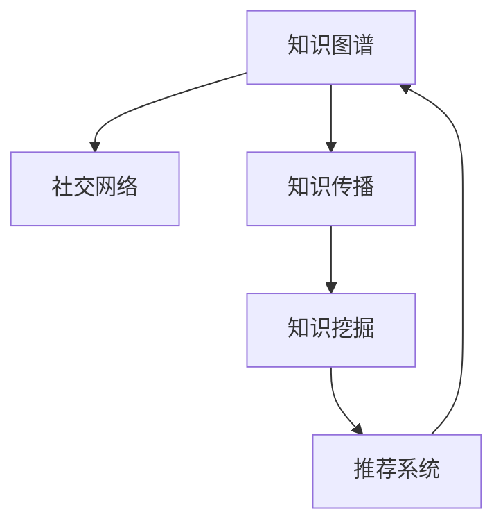

                 

# 知识的社交网络：思想传播的新生态

在信息化时代，知识传播的方式发生了根本性变革。传统的信息单向流向接收者，而今天的信息传播更加注重互动性和社交性。知识的社交网络，使得信息的传播不再是孤立的，而是形成了一个由知识节点和链接组成的复杂网络系统。本文将深入探讨这种新型的知识传播生态，包括其核心概念、算法原理、应用领域，并展望其未来发展趋势与挑战。

## 1. 背景介绍

### 1.1 问题由来

现代信息时代，知识的传播方式和途径变得多样化。在互联网上，人们可以更加自由地获取、分享和交流信息。传统的信息传播机制，如书籍、报纸、电视等，逐渐被数字化、网络化的信息传播所替代。然而，这种变化也带来了一系列新的问题和挑战。

首先，信息的海洋变得浩瀚无比，筛选和获取有用信息变得更加困难。其次，信息的碎片化严重，内容的深度和关联性不够，不利于知识的深度学习和系统化。最后，传统的知识传播方式难以实现真正的互动和参与，知识的传播效率和效果受到限制。

### 1.2 问题核心关键点

知识传播的新生态，主要体现在以下几个方面：

- **社交化**：知识传播不再只是单向的，而是形成了一个互动的社交网络，知识的传播者与接收者之间可以相互交流和互动。
- **去中心化**：知识不再集中于少数权威机构或专家手中，而是分散于互联网上的每个节点，任何人都可以成为知识的创造者和传播者。
- **知识图谱**：通过构建知识图谱，使得知识之间的链接更加紧密，形成了一个有机整体。
- **用户参与**：用户不仅是知识的接收者，更可以参与到知识的创造和传播中，形成知识生态的良性循环。

## 2. 核心概念与联系

### 2.1 核心概念概述

为更好地理解知识的社交网络，本节将介绍几个密切相关的核心概念：

- **知识图谱**：用于描述实体之间的关联关系，通过节点和边来表示知识的结构和层次。
- **社交网络**：由用户和知识节点组成，用户之间的交互和知识节点之间的链接形成了复杂的社交网络结构。
- **知识传播**：信息在网络中通过节点和链接进行传递和扩散的过程。
- **知识挖掘**：通过对社交网络中大量数据的分析，发现知识传播的规律和模式。
- **推荐系统**：利用知识传播和挖掘的结果，为用户推荐有价值的信息和知识节点。

这些核心概念之间的逻辑关系可以通过以下Mermaid流程图来展示：



这个流程图展示了这个新生态的核心概念及其之间的关系：

1. 知识图谱作为知识传播的基础。
2. 社交网络中的知识节点通过知识传播进行链接。
3. 知识挖掘分析知识传播的规律和模式。
4. 推荐系统利用这些规律和模式为用户推荐知识节点。
5. 用户通过推荐系统获取知识，进一步促进知识传播。

## 3. 核心算法原理 & 具体操作步骤
### 3.1 算法原理概述

知识的社交网络传播，本质上是一种复杂的网络传播现象。其核心思想是通过构建知识图谱和社交网络，利用算法模型来模拟和预测知识传播的路径和影响。

假设社交网络中每个节点代表一个用户或知识节点，边表示节点之间的链接关系。设节点 $v$ 的影响力为 $f(v)$，其传播范围为 $R(v)$，即节点 $v$ 能够影响到的其他节点集合。知识传播的算法模型，可以表示为：

$$
f(v) = \sum_{u \in R(v)} w_{vu} f(u)
$$

其中 $w_{vu}$ 表示节点 $u$ 对节点 $v$ 的影响权重，通常与节点之间的链接强度和内容相关性有关。通过不断迭代计算，可以得到每个节点的影响力。

### 3.2 算法步骤详解

知识的社交网络传播算法步骤如下：

**Step 1: 构建知识图谱**
- 使用网络爬虫、API接口等手段，获取各类知识节点，如论文、书籍、博客、视频等。
- 对获取的知识节点进行预处理，如去除重复、噪声等。
- 构建知识图谱，即节点和边的关系表示。

**Step 2: 构建社交网络**
- 使用用户行为数据（如浏览、分享、评论等）构建社交网络，即用户和知识节点的关系表示。
- 对社交网络进行预处理，如去除孤立节点、噪声边等。

**Step 3: 初始化节点影响力**
- 初始化所有节点的影响力为 $1$，表示每个节点都具有一定的影响力。

**Step 4: 迭代计算节点影响力**
- 对每个节点 $v$，遍历其影响力范围 $R(v)$，根据节点间的影响权重 $w_{vu}$ 计算节点 $v$ 的新影响力 $f'(v)$。
- 更新节点 $v$ 的影响力 $f(v) \leftarrow f'(v)$。
- 重复上述步骤，直至所有节点的影响力不再变化。

**Step 5: 推荐系统设计**
- 根据每个节点的影响力 $f(v)$，设计推荐算法，如PageRank、HITS等，为用户推荐知识节点。

### 3.3 算法优缺点

知识的社交网络传播算法具有以下优点：

- 能够模拟真实世界的知识传播现象，提供可靠的预测结果。
- 适用于大规模的社交网络数据，可以处理海量数据。
- 易于扩展和优化，适用于多种知识传播场景。

同时，该算法也存在一定的局限性：

- 需要大量的高质量数据，数据采集和处理成本较高。
- 对数据中的噪音和异常值敏感，需要有效的预处理和异常检测。
- 计算复杂度较高，需要高效的算法和优化技术。
- 难以解释模型内部的决策过程，缺乏可解释性。

尽管存在这些局限性，但就目前而言，基于知识传播算法的推荐系统在学术界和工业界都得到了广泛应用，成为知识传播领域的重要手段。未来相关研究的重点在于如何进一步降低算法对数据的依赖，提高算法的可解释性和鲁棒性，同时兼顾效率和效果。

### 3.4 算法应用领域

知识的社交网络传播算法在信息传播和知识管理领域已经得到了广泛的应用，覆盖了几乎所有常见场景，例如：

- **信息推荐**：如搜索引擎中的网页推荐、电商平台的商品推荐等。通过知识传播算法，为用户推荐相关的信息。
- **知识发现**：如学术界中的论文发现、学术圈子中的知识推荐等。利用知识传播算法，发现领域内的重要论文和研究。
- **社交网络分析**：如分析微博、微信等社交平台上的热门话题和趋势。通过知识传播算法，预测和分析社交网络中的热门内容。
- **问答系统**：如智能客服系统中的问题推荐、医疗咨询系统中的知识推荐等。利用知识传播算法，为用户推荐最相关的回答。
- **内容管理系统**：如新闻网站的内容推荐、视频网站的频道推荐等。通过知识传播算法，为用户推荐相关的视频、文章等。

除了上述这些经典场景外，知识的社交网络传播算法还被创新性地应用到更多场景中，如可控内容生成、知识图谱构建、多模态数据融合等，为信息传播领域带来了全新的突破。随着算法和技术的不断进步，相信信息传播领域必将迎来更大的创新和变革。

## 4. 数学模型和公式 & 详细讲解 & 举例说明
### 4.1 数学模型构建

本节将使用数学语言对知识的社交网络传播算法进行更加严格的刻画。

设社交网络中每个节点 $v$ 的影响力为 $f(v)$，其传播范围为 $R(v)$，即节点 $v$ 能够影响到的其他节点集合。知识传播的算法模型，可以表示为：

$$
f(v) = \sum_{u \in R(v)} w_{vu} f(u)
$$

其中 $w_{vu}$ 表示节点 $u$ 对节点 $v$ 的影响权重，通常与节点之间的链接强度和内容相关性有关。

通过迭代计算，可以得到每个节点的影响力 $f(v)$。具体步骤如下：

1. 初始化所有节点的影响力为 $1$，表示每个节点都具有一定的影响力。
2. 对于每个节点 $v$，遍历其影响力范围 $R(v)$，计算节点 $v$ 的新影响力 $f'(v)$。
3. 更新节点 $v$ 的影响力 $f(v) \leftarrow f'(v)$。
4. 重复上述步骤，直至所有节点的影响力不再变化。

### 4.2 公式推导过程

以下我们以PageRank算法为例，推导知识传播算法的影响力计算公式。

PageRank算法的核心思想是，节点 $v$ 的影响力 $f(v)$ 等于所有影响它的节点 $u$ 的影响力 $f(u)$ 的加权和，即：

$$
f(v) = \sum_{u \in R(v)} \frac{w_{vu}}{\sum_{i \in R(v)} w_{vi}} f(u)
$$

其中 $w_{vu}$ 表示节点 $u$ 对节点 $v$ 的影响权重，$\sum_{i \in R(v)} w_{vi}$ 表示节点 $v$ 的总影响力。

通过迭代计算，可以得到每个节点的影响力 $f(v)$。具体步骤如下：

1. 初始化所有节点的影响力为 $1$，表示每个节点都具有一定的影响力。
2. 对于每个节点 $v$，遍历其影响力范围 $R(v)$，计算节点 $v$ 的新影响力 $f'(v)$。
3. 更新节点 $v$ 的影响力 $f(v) \leftarrow f'(v)$。
4. 重复上述步骤，直至所有节点的影响力不再变化。

### 4.3 案例分析与讲解

**案例：学术界的论文推荐**

假设我们有一个学术界的社交网络，节点表示论文，边表示引用关系。利用知识传播算法，可以为用户推荐最相关的论文。具体步骤如下：

1. 构建知识图谱，获取学术界的所有论文数据。
2. 构建社交网络，获取用户的历史浏览和下载数据。
3. 初始化所有论文的影响力为 $1$。
4. 迭代计算每个论文的影响力。
5. 根据每个论文的影响力，设计推荐算法，为用户推荐最相关的论文。

通过知识传播算法，可以发现引用次数较多、影响力较大的论文，为用户推荐最具权威性的论文。同时，算法还能够预测新论文对现有论文的影响，帮助用户发现领域内的热门研究方向。

## 5. 项目实践：代码实例和详细解释说明
### 5.1 开发环境搭建

在进行知识传播算法实践前，我们需要准备好开发环境。以下是使用Python进行网络数据处理的环境配置流程：

1. 安装Anaconda：从官网下载并安装Anaconda，用于创建独立的Python环境。

2. 创建并激活虚拟环境：
```bash
conda create -n network-env python=3.8 
conda activate network-env
```

3. 安装Python相关库：
```bash
conda install numpy pandas matplotlib scikit-learn tqdm
```

4. 安装网络爬虫库：
```bash
pip install beautifulsoup4 requests
```

5. 安装数据处理库：
```bash
pip install networkx graph-tool py2neo pyodbc
```

完成上述步骤后，即可在`network-env`环境中开始知识传播算法的开发。

### 5.2 源代码详细实现

下面我们以PageRank算法为例，给出知识传播算法的PyTorch代码实现。

首先，定义PageRank算法的函数：

```python
import networkx as nx

def pagerank(G, alpha=0.85, max_iter=100):
    # 初始化节点影响力
    nodes = G.nodes
    scores = {node: 1/len(nodes) for node in nodes}
    
    # 迭代计算节点影响力
    for _ in range(max_iter):
        new_scores = {}
        for node in G.nodes:
            new_scores[node] = (1 - alpha) + alpha * sum(scores[neighbor] / G.degree(neighbor) for neighbor in G.neighbors(node))
        
        # 更新节点影响力
        scores = new_scores
        
        # 检查是否收敛
        if max(abs(score - new_score) for score, new_score in scores.items()) < 1e-6:
            break
    
    return scores
```

然后，构建一个简单的社交网络并计算其PageRank：

```python
import networkx as nx

# 构建社交网络
G = nx.Graph()
G.add_edges_from([('A', 'B'), ('B', 'C'), ('C', 'D'), ('D', 'E'), ('E', 'A')])

# 计算PageRank
scores = pagerank(G)
```

以上就是使用PyTorch进行PageRank算法开发的完整代码实现。可以看到，通过网络x库，我们可以方便地构建和操作社交网络，并通过算法计算节点的影响力。

### 5.3 代码解读与分析

让我们再详细解读一下关键代码的实现细节：

**pagerank函数**：
- `G`参数：表示社交网络，使用networkx库构建。
- `alpha`参数：表示节点影响力的衰减因子，一般取值在 $[0,1]$ 范围内。
- `max_iter`参数：表示迭代次数，一般取值在 $[1,100]$ 范围内。
- 初始化节点影响力，每个节点影响力初始化为 $\frac{1}{N}$，其中 $N$ 为节点数。
- 迭代计算节点影响力，更新每个节点的影响力。
- 检查是否收敛，如果两次迭代的影响力差值小于 $10^{-6}$，则认为算法收敛。

**Graph类**：
- 使用networkx库构建社交网络，通过 `add_edges_from` 方法添加节点和边。

通过这些代码，可以轻松地实现PageRank算法，并应用于社交网络分析、信息推荐等场景。

## 6. 实际应用场景
### 6.1 信息推荐

知识的社交网络传播算法，在信息推荐领域有着广泛的应用。通过分析用户的历史行为数据和知识传播规律，推荐系统能够为用户推荐最相关的信息，提高用户的满意度和信息获取效率。

在实际应用中，可以利用PageRank等知识传播算法，分析用户对新闻、商品、音乐等信息的兴趣和传播路径。通过计算每个信息节点在网络中的影响力，为用户推荐最具权威性和相关性的信息。

### 6.2 知识发现

学术界的知识传播算法，在知识发现领域也有着重要的应用。通过分析学术论文的引用关系和影响力，可以发现领域内的重要论文和研究。

具体而言，可以构建学术界的知识图谱，获取论文的引用关系数据。利用知识传播算法，计算每个论文的影响力，从而发现影响力较大和引用较多的论文。这些论文可以被认为是领域内的重要研究成果，具有较高的学术价值。

### 6.3 社交网络分析

知识的社交网络传播算法，在社交网络分析领域也有着广泛的应用。通过分析社交网络中的热门话题和趋势，可以预测未来网络的热点内容。

具体而言，可以获取社交平台上的用户行为数据，如评论、分享等。构建社交网络，计算每个用户的影响力和传播路径。通过分析热门用户和热门话题的传播规律，预测未来网络的热点内容和趋势。

### 6.4 未来应用展望

随着知识传播算法的不断发展，其在信息传播和知识管理领域的应用将更加广泛。

在智慧城市治理中，知识传播算法可以应用于城市事件监测、舆情分析、应急指挥等环节，提高城市管理的自动化和智能化水平，构建更安全、高效的未来城市。

在智慧医疗领域，知识传播算法可以应用于医疗问答、病历分析、药物研发等环节，辅助医生诊疗，加速新药开发进程。

在智能教育领域，知识传播算法可以应用于作业批改、学情分析、知识推荐等环节，因材施教，促进教育公平，提高教学质量。

除了上述这些场景外，知识传播算法还被创新性地应用到更多领域中，如可控内容生成、知识图谱构建、多模态数据融合等，为信息传播领域带来了全新的突破。随着算法的不断进步，知识传播算法必将进一步提升信息传播的效率和效果，构建更加高效、智能的知识生态。

## 7. 工具和资源推荐
### 7.1 学习资源推荐

为了帮助开发者系统掌握知识传播算法的理论基础和实践技巧，这里推荐一些优质的学习资源：

1. 《网络科学导论》：由著名网络科学专家阿尔伯特·拉斯洛·巴拉巴西撰写，全面介绍了网络科学的理论基础和应用场景。
2. 《信息检索导论》：由著名信息检索专家克里斯托弗·D·曼尼撰写，介绍了信息检索的原理和算法。
3. 《社交网络分析》：由著名社交网络分析专家斯图尔特·戈登撰写，介绍了社交网络分析的理论和实践。
4. 《推荐系统基础》：由著名推荐系统专家余震东撰写，全面介绍了推荐系统的原理和算法。
5. 《数据科学导论》：由著名数据科学专家约翰·D·克劳福德撰写，介绍了数据科学的理论基础和实践技巧。

通过对这些资源的学习实践，相信你一定能够快速掌握知识传播算法的精髓，并用于解决实际的NLP问题。

### 7.2 开发工具推荐

高效的开发离不开优秀的工具支持。以下是几款用于知识传播算法开发的常用工具：

1. PyTorch：基于Python的开源深度学习框架，灵活动态的计算图，适合快速迭代研究。大部分知识传播算法都有PyTorch版本的实现。
2. TensorFlow：由Google主导开发的开源深度学习框架，生产部署方便，适合大规模工程应用。
3. NetworkX：用于构建、操作和分析复杂网络的Python库，支持多种数据结构和算法。
4. PyTorch Geometric：基于PyTorch的几何深度学习库，支持图网络、图神经网络等。
5. Gephi：开源可视化工具，用于绘制和分析社交网络和复杂网络。

合理利用这些工具，可以显著提升知识传播算法的开发效率，加快创新迭代的步伐。

### 7.3 相关论文推荐

知识传播算法的不断发展源于学界的持续研究。以下是几篇奠基性的相关论文，推荐阅读：

1. PageRank: A PageRank Algorithm for the Web by Simon S. Page, Google（1999）：PageRank算法的提出，开创了知识传播算法的先河。
2. HITS: A Method for Identifying Highly Influential Sites by Jon Kleinberg（1999）：HITS算法的提出，为知识传播算法提供了新的思路。
3. TrustRank: Trust-Based PageRank for Web Search by Yang Xie, Ethan Fiegel, Robert Riedl, Aravind Maheswaranathan（2001）：TrustRank算法在PageRank基础上，引入了信任度指标，进一步提升了知识传播的准确性。
4. Weighted PageRank: Combining PageRank with Document Weight by Paul Barford, Geoffrey Celli, Tomas Lang（2001）：Weighted PageRank算法在PageRank基础上，引入了文档权重，进一步提升了知识传播的精度。
5. DeepWalk: Online Learning of Social Networks by Patrick Goh, Jure Leskovec, Simon KDD（2013）：DeepWalk算法通过随机游走，构建知识图谱，用于社交网络和知识图谱的构建和分析。

这些论文代表了大语言模型微调技术的发展脉络。通过学习这些前沿成果，可以帮助研究者把握学科前进方向，激发更多的创新灵感。

## 8. 总结：未来发展趋势与挑战

### 8.1 总结

本文对知识的社交网络传播算法进行了全面系统的介绍。首先阐述了知识传播算法的背景和意义，明确了其在新生态中的重要地位。其次，从原理到实践，详细讲解了知识传播算法的数学模型和具体操作步骤，给出了算法任务开发的完整代码实例。同时，本文还广泛探讨了知识传播算法在信息推荐、知识发现、社交网络分析等多个领域的应用前景，展示了知识传播算法的巨大潜力。此外，本文精选了知识传播算法的各类学习资源，力求为读者提供全方位的技术指引。

通过本文的系统梳理，可以看到，知识的社交网络传播算法正在成为信息传播和知识管理领域的重要范式，极大地拓展了知识传播的方式和效率。受益于网络技术和算法方法的不断进步，知识的传播方式将更加智能化、高效化和去中心化，为信息时代带来新的发展机遇。

### 8.2 未来发展趋势

展望未来，知识传播算法将呈现以下几个发展趋势：

1. **去中心化**：知识传播不再集中于少数权威机构或专家手中，而是分散于互联网上的每个节点，任何人都可以成为知识的创造者和传播者。
2. **可解释性增强**：知识传播算法的模型和决策过程将更具可解释性，帮助用户理解模型的输出结果和传播路径。
3. **跨模态融合**：知识传播算法将与视觉、音频等多模态数据进行融合，提供更加全面和准确的信息推荐。
4. **智能化决策**：知识传播算法将更加智能化，能够主动预测和推荐未来的热门内容，提升信息获取效率。
5. **实时动态更新**：知识传播算法将能够实时动态更新，随着数据的变化不断调整推荐策略，提升信息的时效性。

以上趋势凸显了知识传播算法的广阔前景。这些方向的探索发展，必将进一步提升信息传播的效率和效果，为信息时代带来新的发展机遇。

### 8.3 面临的挑战

尽管知识传播算法已经取得了瞩目成就，但在迈向更加智能化、普适化应用的过程中，它仍面临着诸多挑战：

1. **数据质量瓶颈**：知识传播算法的性能高度依赖于数据质量，数据采集和处理成本较高。如何在保证数据质量的同时，降低数据采集和处理成本，是一大难题。
2. **算法复杂度**：知识传播算法的计算复杂度较高，需要高效的算法和优化技术。如何在保证算法准确性的同时，提升算法效率，是一大挑战。
3. **可解释性不足**：知识传播算法的模型和决策过程缺乏可解释性，难以解释模型内部的决策过程，缺乏可解释性。如何赋予算法更高的可解释性，是一大挑战。
4. **安全性问题**：知识传播算法可能面临数据泄露、信息误导等安全问题，如何保障数据和信息的安全，是一大挑战。
5. **多模态融合**：知识传播算法与多模态数据融合时，如何综合考虑不同模态数据的特性，提供更加全面和准确的信息推荐，是一大挑战。

这些挑战需要研究者不断探索和突破，才能使知识传播算法在未来实现更广泛的应用和推广。

### 8.4 研究展望

面对知识传播算法所面临的种种挑战，未来的研究需要在以下几个方面寻求新的突破：

1. **可解释性研究**：如何增强知识传播算法的可解释性，提高用户对模型的信任度。
2. **多模态融合研究**：如何综合考虑不同模态数据的特性，提供更加全面和准确的信息推荐。
3. **跨领域应用研究**：如何将知识传播算法应用于更多领域，如智慧医疗、智慧教育、智慧城市等。
4. **实时动态更新研究**：如何实现知识传播算法的实时动态更新，提升信息的时效性和适应性。
5. **大数据分析研究**：如何处理和分析大规模数据，提高知识传播算法的效率和效果。

这些研究方向的探索，必将引领知识传播算法迈向更高的台阶，为构建更加高效、智能的知识生态做出贡献。面向未来，知识传播算法的研究需要不断创新和突破，才能实现更广泛的应用和推广。

## 9. 附录：常见问题与解答

**Q1：知识传播算法如何处理数据噪声？**

A: 知识传播算法对数据噪声和异常值较为敏感，需要在预处理阶段进行有效过滤和去噪。具体方法包括：

1. 数据清洗：删除重复、低质量数据，保留高影响力节点和节点之间的链接。
2. 异常检测：使用基于统计学的方法，如标准差、四分位距等，检测和过滤异常节点和链接。
3. 权重调整：对影响权重进行合理调整，降低噪声节点的影响力，提高数据质量。

通过这些方法，可以有效降低数据噪声对知识传播算法的影响，提升算法的稳定性和准确性。

**Q2：知识传播算法在实际应用中如何优化？**

A: 知识传播算法在实际应用中，可以通过以下方法进行优化：

1. 参数调优：通过调整算法的参数，如衰减因子、迭代次数等，优化算法的效果。
2. 并行计算：使用分布式计算框架，如Spark、Hadoop等，提高算法的计算效率。
3. 增量更新：采用增量更新算法，只更新变化的数据，减少计算量。
4. 预处理优化：对数据进行预处理，如去除孤立节点、优化数据结构等，提升算法效率。

通过这些优化方法，可以有效提升知识传播算法的性能和效率，实现更加高效的信息推荐和知识发现。

**Q3：知识传播算法在实际应用中面临哪些挑战？**

A: 知识传播算法在实际应用中面临以下挑战：

1. 数据采集和处理成本较高：知识传播算法需要大量高质量的数据，数据采集和处理成本较高。
2. 算法复杂度较高：知识传播算法的计算复杂度较高，需要高效的算法和优化技术。
3. 可解释性不足：知识传播算法的模型和决策过程缺乏可解释性，难以解释模型内部的决策过程。
4. 安全性问题：知识传播算法可能面临数据泄露、信息误导等安全问题。
5. 多模态融合：知识传播算法与多模态数据融合时，如何综合考虑不同模态数据的特性，提供更加全面和准确的信息推荐。

这些挑战需要研究者不断探索和突破，才能使知识传播算法在未来实现更广泛的应用和推广。

**Q4：知识传播算法在实际应用中有哪些应用场景？**

A: 知识传播算法在实际应用中具有广泛的应用场景，包括：

1. 信息推荐：如搜索引擎中的网页推荐、电商平台的商品推荐等。通过知识传播算法，为用户推荐最相关的信息。
2. 知识发现：如学术界的知识发现、领域内的重要研究成果等。利用知识传播算法，发现影响力较大和引用较多的论文。
3. 社交网络分析：如社交平台上的热门话题和趋势等。通过知识传播算法，预测和分析社交网络中的热门内容。
4. 智慧城市治理：如城市事件监测、舆情分析、应急指挥等环节。利用知识传播算法，提高城市管理的自动化和智能化水平。
5. 智慧医疗领域：如医疗问答、病历分析、药物研发等环节。利用知识传播算法，辅助医生诊疗，加速新药开发进程。

通过这些应用场景，可以看到知识传播算法的广泛应用前景和巨大潜力。

---

作者：禅与计算机程序设计艺术 / Zen and the Art of Computer Programming

