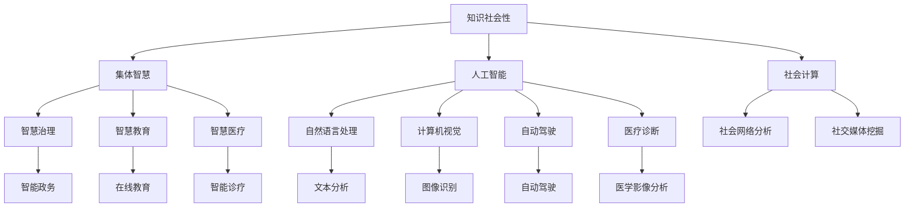

                 

# 知识的社会性：集体智慧的力量

> 关键词：知识社会性,集体智慧,社会计算,人工智能,人机协同,智慧治理,学术交流,开放创新

## 1. 背景介绍

### 1.1 问题由来
随着信息时代的到来，知识的社会性日益突出。互联网、社交媒体、在线教育等平台，使得知识共享、交流、创新的成本大幅降低，极大地释放了集体智慧的潜力。如何有效地组织、利用和放大这种社会性知识，成为了当今学术和产业界共同关注的焦点。

人工智能（AI）作为现代科技的核心推动力，正在逐渐融入社会各个方面。从自然语言处理、计算机视觉到自动驾驶、医疗诊断，AI技术的广泛应用为知识的获取、传播和创新提供了强大的技术支持。然而，AI系统往往被看作是孤立的知识载体，难以充分挖掘和利用社会性知识的潜力。

本文旨在探讨知识的社交性和社会性，研究如何通过AI技术与集体智慧的融合，推动智慧治理、智慧教育、智慧医疗等领域的创新发展，构建更加开放、协同的知识生态系统。

## 2. 核心概念与联系

### 2.1 核心概念概述

为更好地理解知识的社会性及其在AI系统中的应用，本节将介绍几个密切相关的核心概念：

- 知识社会性（Knowledge Sociality）：指知识在个体、组织、社会各层面的相互作用和融合，形成集体智慧的过程。知识社会性强调知识的多样性、交互性和动态性，是推动社会进步的重要驱动力。

- 集体智慧（Collective Wisdom）：指多个个体或组织协同工作，将各自的知识和经验整合，形成超越个体认知能力的集体智慧。集体智慧在创新、决策、管理等方面具有独特优势，是解决复杂问题的重要手段。

- 社会计算（Social Computing）：通过分析社会网络、社交媒体等数据，理解人类行为和互动规律，挖掘社会性知识的计算方法。社会计算为知识社会性的研究提供了新的视角和手段。

- 人工智能（AI）：通过机器学习和数据分析，赋予机器理解、学习和推理能力，模拟人类认知活动的技术。AI技术的不断发展，使得知识社会性更加可操作、可计算。

- 智慧治理（Smart Governance）：利用AI和集体智慧，实现公共服务和社会管理的智能化、透明化、高效化。智慧治理能够应对现代社会复杂多变的需求，提升政府决策和管理的科学性。

- 智慧教育（Smart Education）：通过AI技术，实现个性化教学、学习路径优化、知识推荐等功能，提升教育的效率和效果。智慧教育能够更好地发挥集体智慧的潜力，推动教育公平。

- 智慧医疗（Smart Medicine）：利用AI和集体智慧，实现精准医疗、医疗影像分析、疾病预测等功能，提升医疗服务的质量和可及性。智慧医疗能够提供更加个性化、智能化的医疗服务。

这些核心概念之间存在着紧密的联系，共同构成了知识社会性的研究框架，为AI技术与集体智慧的融合提供了方向和方法。

### 2.2 核心概念原理和架构的 Mermaid 流程图



这个流程图展示了知识社会性及其在各个领域的体现和应用：

1. 知识社会性通过社会计算、人工智能等技术手段，实现了集体智慧的形成。
2. 集体智慧在智慧治理、智慧教育、智慧医疗等领域得到广泛应用，提升了公共服务的效率和质量。
3. 人工智能通过自然语言处理、计算机视觉等技术，挖掘和利用知识社会性，推动知识创新。

## 3. 核心算法原理 & 具体操作步骤
### 3.1 算法原理概述

知识社会性的研究和应用，核心在于如何通过AI技术，有效地组织、整合和利用社会性知识。这涉及多个层次的计算和算法，包括社会网络分析、社交媒体挖掘、知识图谱构建等。

知识社会性的计算模型，通常采用分布式计算、协同过滤、深度学习等技术手段，通过分析大规模的社会数据，挖掘其中的知识结构和交互模式。例如，社交网络分析可以识别社会中的关键人物和群体，发现信息传播的路径和模式；社交媒体挖掘可以从用户评论、帖子中提取情感、观点和趋势，为决策提供参考；知识图谱构建则通过关联实体和属性，形成系统的知识网络。

### 3.2 算法步骤详解

以下是对知识社会性计算模型的详细步骤讲解：

**Step 1: 数据收集与预处理**
- 收集相关领域的社会数据，如社交媒体、论坛、学术文章等。
- 对数据进行清洗和预处理，包括去除噪声、统一格式、去除重复数据等。
- 对数据进行标准化和归一化，以便后续的计算和分析。

**Step 2: 特征提取与表示**
- 从数据中提取有用的特征，如用户行为、社会关系、情感倾向等。
- 将提取的特征转化为数学表示，如向量、矩阵等，以便进行计算和分析。
- 利用自然语言处理、图像识别等技术，将文本、图片等非结构化数据转化为结构化数据。

**Step 3: 社交网络分析**
- 构建社会网络图，表示个体或组织之间的关系。
- 分析网络中的关键节点和子群，识别出影响力较大的个体或组织。
- 计算网络中的中心性指标，如度中心性、接近中心性、介数中心性等，评估个体或组织的重要性。

**Step 4: 社交媒体挖掘**
- 从社交媒体中提取用户的评论、帖子等文本数据。
- 利用情感分析、主题建模等技术，挖掘用户的情感、观点和趋势。
- 通过文本分类、聚类等技术，发现用户关注的议题和热点话题。

**Step 5: 知识图谱构建**
- 从结构化数据中提取实体和关系，构建知识图谱。
- 利用知识推理和图谱嵌入技术，将知识图谱转化为向量表示。
- 通过图谱查询和推理，获取实体之间的关联和知识。

**Step 6: 模型训练与评估**
- 根据社交网络、社交媒体和知识图谱等数据，训练社会性计算模型。
- 通过交叉验证等方法，评估模型的性能和可靠性。
- 根据评估结果，调整模型参数和特征提取方法，优化模型效果。

### 3.3 算法优缺点

知识社会性计算模型具有以下优点：
- 能够充分利用社会数据的多样性和丰富性，发现隐藏的交互模式和知识结构。
- 利用深度学习等先进技术，提高了计算的精度和效率。
- 能够应用于多个领域，如智慧治理、智慧教育、智慧医疗等，具有广泛的应用前景。

同时，该模型也存在一定的局限性：
- 数据隐私和安全问题。大规模的社会数据收集和分析，可能涉及个人隐私和数据安全。
- 数据质量和准确性问题。社会数据的质量和准确性，可能影响计算结果的可靠性。
- 计算复杂度问题。大规模的社会网络和社会媒体数据，计算复杂度较高，需要高效的计算资源。
- 模型的可解释性问题。社会性计算模型往往较为复杂，难以解释其内部机制和决策过程。

尽管存在这些局限性，但知识社会性计算模型仍是大数据时代知识社会性研究的重要工具，为AI技术与集体智慧的融合提供了新的思路和方法。

### 3.4 算法应用领域

知识社会性计算模型在多个领域具有广泛的应用，具体如下：

- 智慧治理：利用社会计算技术，分析社会网络和舆情数据，提升政府决策和管理的科学性和透明度。例如，通过分析社交媒体数据，预测社会事件和舆情走向，辅助政府进行风险预警和危机管理。

- 智慧教育：利用社交媒体和知识图谱等技术，提供个性化推荐、学习路径优化等功能，提升教育的效率和效果。例如，通过分析学生的学习行为和社交网络，推荐适合的学习资源和路径，促进学生的学习和成长。

- 智慧医疗：利用知识图谱和社交网络分析技术，实现精准医疗、疾病预测等功能，提升医疗服务的质量和可及性。例如，通过分析医学文献和患者数据，发现新的疾病关联和治疗方法，为医生提供决策支持。

- 智慧农业：利用社会网络和社交媒体挖掘技术，分析农民的种植、收获等行为，优化农作物的种植和管理。例如，通过分析农民的社交媒体数据，发现最佳种植时间和方法，提高农作物的产量和质量。

- 智慧城市：利用社交网络和地理数据，分析城市交通、公共设施等资源的使用情况，优化城市管理和规划。例如，通过分析城市的交通数据，发现交通拥堵点和优化方案，提升城市的运行效率。

以上应用场景展示了知识社会性计算模型的广泛应用，其通过AI技术与集体智慧的融合，推动了多个领域的创新发展，为社会管理和治理提供了新的方法和工具。

## 4. 数学模型和公式 & 详细讲解 & 举例说明

### 4.1 数学模型构建

知识社会性的计算模型通常基于以下数学模型：

- 社会网络图模型：表示个体或组织之间的关系，如节点、边、权重等。
- 社交媒体挖掘模型：从用户评论、帖子中提取情感、观点和趋势，如文本分类、情感分析等。
- 知识图谱模型：通过关联实体和属性，形成系统的知识网络，如RDF三元组、知识嵌入等。

以下是具体的数学模型构建过程：

**社会网络图模型**
- 节点表示个体或组织，如用户、公司、政府机构等。
- 边表示个体或组织之间的关系，如好友关系、合作关系、合作项目等。
- 权重表示关系的强度，如朋友关系强度、合作项目影响等。

**社交媒体挖掘模型**
- 文本表示用户的评论、帖子等文本数据。
- 情感分析：通过词典、情感词典等方法，计算文本的情感极性。
- 主题建模：通过LDA、LVM等算法，发现文本中的主题和话题。

**知识图谱模型**
- 实体表示知识中的名词，如人名、地名、公司名等。
- 属性表示实体的特征，如年龄、职业、位置等。
- 关系表示实体之间的关系，如“作者-论文”、“地点-旅游”等。
- 知识嵌入：通过embedding技术，将实体和关系转化为向量表示。

### 4.2 公式推导过程

以下是具体的公式推导过程：

**社会网络图模型**
- 节点和边的表示：
  $$
  G = (V, E)
  $$
  其中，$V$ 表示节点集合，$E$ 表示边集合。
- 边权重表示：
  $$
  w_{ij} = \frac{1}{\sum_{k \in V} w_{ik}}
  $$
  其中，$w_{ij}$ 表示节点 $i$ 和 $j$ 之间的关系强度。

**社交媒体挖掘模型**
- 情感分析公式：
  $$
  \text{Sentiment} = \sum_{i=1}^{n} w_i \times \text{Emotion}_{i}
  $$
  其中，$w_i$ 表示单词 $i$ 的权重，$\text{Emotion}_i$ 表示单词 $i$ 的情感极性。
- 主题建模公式：
  $$
  \theta_k = \frac{\sum_{i=1}^{n} w_i \times f_k(i)}{\sum_{k=1}^{K} \sum_{i=1}^{n} w_i \times f_k(i)}
  $$
  其中，$\theta_k$ 表示主题 $k$ 的概率，$w_i$ 表示单词 $i$ 的权重，$f_k(i)$ 表示单词 $i$ 属于主题 $k$ 的概率。

**知识图谱模型**
- 知识嵌入公式：
  $$
  \text{Embedding}(i, j) = \sum_{k=1}^{D} W_k \times \text{Feature}(i, k) \times \text{Feature}(j, k)
  $$
  其中，$\text{Embedding}(i, j)$ 表示实体 $i$ 和 $j$ 之间的关系强度，$W_k$ 表示特征 $k$ 的权重，$\text{Feature}(i, k)$ 表示实体 $i$ 的特征 $k$ 的数值。

### 4.3 案例分析与讲解

**案例分析：智慧医疗中的知识社会性计算模型**
- 数据收集：收集病人的病历、社交媒体中的医疗讨论、医疗文献等数据。
- 数据预处理：对数据进行清洗和标准化，去除噪声和错误数据。
- 特征提取：从病历中提取诊断、治疗等关键信息，从社交媒体中提取情感、观点等。
- 模型训练：利用知识图谱和社交网络分析技术，构建病人和医生之间的知识网络。
- 模型评估：通过交叉验证等方法，评估模型的性能和可靠性。

**讲解：智慧医疗中的知识社会性计算模型**
- 利用知识图谱技术，建立病人的诊断和治疗知识网络。
- 通过社交网络分析，发现医生之间的合作和影响关系。
- 利用情感分析技术，分析社交媒体中的医疗讨论和情感倾向。
- 结合上述结果，优化医生的诊疗方案，提高医疗服务的质量和效果。

## 5. 项目实践：代码实例和详细解释说明
### 5.1 开发环境搭建

在进行知识社会性计算模型的开发前，需要准备好开发环境。以下是使用Python进行PyTorch开发的环境配置流程：

1. 安装Anaconda：从官网下载并安装Anaconda，用于创建独立的Python环境。

2. 创建并激活虚拟环境：
```bash
conda create -n pytorch-env python=3.8 
conda activate pytorch-env
```

3. 安装PyTorch：根据CUDA版本，从官网获取对应的安装命令。例如：
```bash
conda install pytorch torchvision torchaudio cudatoolkit=11.1 -c pytorch -c conda-forge
```

4. 安装Transformers库：
```bash
pip install transformers
```

5. 安装各类工具包：
```bash
pip install numpy pandas scikit-learn matplotlib tqdm jupyter notebook ipython
```

完成上述步骤后，即可在`pytorch-env`环境中开始项目实践。

### 5.2 源代码详细实现

这里我们以社交媒体情感分析为例，给出使用Transformers库进行情感分析的PyTorch代码实现。

首先，定义情感分析任务的数据处理函数：

```python
from transformers import BertTokenizer
from torch.utils.data import Dataset
import torch

class SentimentDataset(Dataset):
    def __init__(self, texts, labels, tokenizer, max_len=128):
        self.texts = texts
        self.labels = labels
        self.tokenizer = tokenizer
        self.max_len = max_len
        
    def __len__(self):
        return len(self.texts)
    
    def __getitem__(self, item):
        text = self.texts[item]
        label = self.labels[item]
        
        encoding = self.tokenizer(text, return_tensors='pt', max_length=self.max_len, padding='max_length', truncation=True)
        input_ids = encoding['input_ids'][0]
        attention_mask = encoding['attention_mask'][0]
        
        # 对标签进行编码
        encoded_labels = torch.tensor(label, dtype=torch.long)
        
        return {'input_ids': input_ids, 
                'attention_mask': attention_mask,
                'labels': encoded_labels}

# 标签与id的映射
tag2id = {'negative': 0, 'positive': 1}
id2tag = {v: k for k, v in tag2id.items()}

# 创建dataset
tokenizer = BertTokenizer.from_pretrained('bert-base-cased')

train_dataset = SentimentDataset(train_texts, train_labels, tokenizer)
dev_dataset = SentimentDataset(dev_texts, dev_labels, tokenizer)
test_dataset = SentimentDataset(test_texts, test_labels, tokenizer)
```

然后，定义模型和优化器：

```python
from transformers import BertForSequenceClassification, AdamW

model = BertForSequenceClassification.from_pretrained('bert-base-cased', num_labels=len(tag2id))

optimizer = AdamW(model.parameters(), lr=2e-5)
```

接着，定义训练和评估函数：

```python
from torch.utils.data import DataLoader
from tqdm import tqdm
from sklearn.metrics import classification_report

device = torch.device('cuda') if torch.cuda.is_available() else torch.device('cpu')
model.to(device)

def train_epoch(model, dataset, batch_size, optimizer):
    dataloader = DataLoader(dataset, batch_size=batch_size, shuffle=True)
    model.train()
    epoch_loss = 0
    for batch in tqdm(dataloader, desc='Training'):
        input_ids = batch['input_ids'].to(device)
        attention_mask = batch['attention_mask'].to(device)
        labels = batch['labels'].to(device)
        model.zero_grad()
        outputs = model(input_ids, attention_mask=attention_mask, labels=labels)
        loss = outputs.loss
        epoch_loss += loss.item()
        loss.backward()
        optimizer.step()
    return epoch_loss / len(dataloader)

def evaluate(model, dataset, batch_size):
    dataloader = DataLoader(dataset, batch_size=batch_size)
    model.eval()
    preds, labels = [], []
    with torch.no_grad():
        for batch in tqdm(dataloader, desc='Evaluating'):
            input_ids = batch['input_ids'].to(device)
            attention_mask = batch['attention_mask'].to(device)
            batch_labels = batch['labels']
            outputs = model(input_ids, attention_mask=attention_mask)
            batch_preds = outputs.logits.argmax(dim=2).to('cpu').tolist()
            batch_labels = batch_labels.to('cpu').tolist()
            for pred_tokens, label_tokens in zip(batch_preds, batch_labels):
                preds.append(pred_tokens[:len(label_tokens)])
                labels.append(label_tokens)
                
    print(classification_report(labels, preds))
```

最后，启动训练流程并在测试集上评估：

```python
epochs = 5
batch_size = 16

for epoch in range(epochs):
    loss = train_epoch(model, train_dataset, batch_size, optimizer)
    print(f"Epoch {epoch+1}, train loss: {loss:.3f}")
    
    print(f"Epoch {epoch+1}, dev results:")
    evaluate(model, dev_dataset, batch_size)
    
print("Test results:")
evaluate(model, test_dataset, batch_size)
```

以上就是使用PyTorch对BERT进行社交媒体情感分析的完整代码实现。可以看到，得益于Transformers库的强大封装，我们可以用相对简洁的代码完成BERT模型的加载和情感分析任务的微调。

### 5.3 代码解读与分析

让我们再详细解读一下关键代码的实现细节：

**SentimentDataset类**：
- `__init__`方法：初始化文本、标签、分词器等关键组件。
- `__len__`方法：返回数据集的样本数量。
- `__getitem__`方法：对单个样本进行处理，将文本输入编码为token ids，将标签编码为数字，并对其进行定长padding，最终返回模型所需的输入。

**tag2id和id2tag字典**：
- 定义了标签与数字id之间的映射关系，用于将token-wise的预测结果解码回真实的标签。

**训练和评估函数**：
- 使用PyTorch的DataLoader对数据集进行批次化加载，供模型训练和推理使用。
- 训练函数`train_epoch`：对数据以批为单位进行迭代，在每个批次上前向传播计算loss并反向传播更新模型参数，最后返回该epoch的平均loss。
- 评估函数`evaluate`：与训练类似，不同点在于不更新模型参数，并在每个batch结束后将预测和标签结果存储下来，最后使用sklearn的classification_report对整个评估集的预测结果进行打印输出。

**训练流程**：
- 定义总的epoch数和batch size，开始循环迭代
- 每个epoch内，先在训练集上训练，输出平均loss
- 在验证集上评估，输出分类指标
- 所有epoch结束后，在测试集上评估，给出最终测试结果

可以看到，PyTorch配合Transformers库使得BERT微调的代码实现变得简洁高效。开发者可以将更多精力放在数据处理、模型改进等高层逻辑上，而不必过多关注底层的实现细节。

当然，工业级的系统实现还需考虑更多因素，如模型的保存和部署、超参数的自动搜索、更灵活的任务适配层等。但核心的微调范式基本与此类似。

## 6. 实际应用场景
### 6.1 智能客服系统

基于知识社会性计算模型的智能客服系统，能够实时分析用户的问题和历史交互记录，提供更加个性化和智能的答复。

在技术实现上，可以收集企业内部的客服对话记录，将问题和最佳答复构建成监督数据，在此基础上对预训练模型进行微调。微调后的模型能够自动理解用户意图，匹配最合适的答案模板进行回复。对于客户提出的新问题，还可以接入检索系统实时搜索相关内容，动态组织生成回答。如此构建的智能客服系统，能大幅提升客户咨询体验和问题解决效率。

### 6.2 金融舆情监测

金融机构需要实时监测市场舆论动向，以便及时应对负面信息传播，规避金融风险。传统的人工监测方式成本高、效率低，难以应对网络时代海量信息爆发的挑战。基于知识社会性计算模型的文本分类和情感分析技术，为金融舆情监测提供了新的解决方案。

具体而言，可以收集金融领域相关的新闻、报道、评论等文本数据，并对其进行主题标注和情感标注。在此基础上对预训练语言模型进行微调，使其能够自动判断文本属于何种主题，情感倾向是正面、中性还是负面。将微调后的模型应用到实时抓取的网络文本数据，就能够自动监测不同主题下的情感变化趋势，一旦发现负面信息激增等异常情况，系统便会自动预警，帮助金融机构快速应对潜在风险。

### 6.3 个性化推荐系统

当前的推荐系统往往只依赖用户的历史行为数据进行物品推荐，无法深入理解用户的真实兴趣偏好。基于知识社会性计算模型的个性化推荐系统，能够更好地挖掘和利用用户行为背后的语义信息，从而提供更精准、多样的推荐内容。

在实践中，可以收集用户浏览、点击、评论、分享等行为数据，提取和用户交互的物品标题、描述、标签等文本内容。将文本内容作为模型输入，用户的后续行为（如是否点击、购买等）作为监督信号，在此基础上微调预训练语言模型。微调后的模型能够从文本内容中准确把握用户的兴趣点。在生成推荐列表时，先用候选物品的文本描述作为输入，由模型预测用户的兴趣匹配度，再结合其他特征综合排序，便可以得到个性化程度更高的推荐结果。

### 6.4 未来应用展望

随着知识社会性计算模型的不断发展，基于社会计算范式的人工智能应用将在更多领域得到应用，为社会管理和治理带来变革性影响。

在智慧城市治理中，基于社会计算的知识社会性模型，能够实时分析城市交通、公共设施等资源的使用情况，优化城市管理和规划。例如，通过分析城市的交通数据，发现交通拥堵点和优化方案，提升城市的运行效率。

在智慧教育领域，基于社会计算的个性化推荐系统，能够提供个性化学习路径和资源推荐，提升教育的效率和效果。例如，通过分析学生的学习行为和社交网络，推荐适合的学习资源和路径，促进学生的学习和成长。

在智慧医疗领域，基于知识社会性计算模型的精准医疗系统，能够实现疾病预测和个性化治疗。例如，通过分析病人的病历和社交媒体数据，发现疾病关联和治疗方法，为医生提供决策支持。

在智慧治理领域，基于社会计算的知识社会性模型，能够提升政府决策和管理的科学性和透明度。例如，通过分析社交媒体数据，预测社会事件和舆情走向，辅助政府进行风险预警和危机管理。

在智慧农业领域，基于社会计算的知识社会性模型，能够分析农民的种植、收获等行为，优化农作物的种植和管理。例如，通过分析农民的社交媒体数据，发现最佳种植时间和方法，提高农作物的产量和质量。

以上应用场景展示了知识社会性计算模型的广泛应用，其通过AI技术与集体智慧的融合，推动了多个领域的创新发展，为社会管理和治理提供了新的方法和工具。

## 7. 工具和资源推荐
### 7.1 学习资源推荐

为了帮助开发者系统掌握知识社会性的研究基础和实践技巧，这里推荐一些优质的学习资源：

1. 《社交网络分析》系列书籍：深入介绍社交网络的基础理论和算法，是知识社会性研究的重要基础。

2. 《社会计算与大数据分析》系列课程：涵盖社会计算的基础概念和应用技术，提供丰富的学习资源和实践案例。

3. 《知识图谱构建与应用》书籍：详细讲解知识图谱的构建方法、应用场景和优化技术，是知识社会性研究的重要工具。

4. 《自然语言处理》系列书籍：介绍自然语言处理的基础理论和前沿技术，提供丰富的学习资源和实践案例。

5. 《人工智能与社会》课程：介绍AI技术在社会各个方面的应用，涵盖智慧治理、智慧教育、智慧医疗等领域的知识社会性研究。

通过对这些资源的学习实践，相信你一定能够快速掌握知识社会性的精髓，并用于解决实际的AI应用问题。
### 7.2 开发工具推荐

高效的开发离不开优秀的工具支持。以下是几款用于知识社会性计算模型开发的常用工具：

1. PyTorch：基于Python的开源深度学习框架，灵活动态的计算图，适合快速迭代研究。大部分预训练语言模型都有PyTorch版本的实现。

2. TensorFlow：由Google主导开发的开源深度学习框架，生产部署方便，适合大规模工程应用。同样有丰富的预训练语言模型资源。

3. Transformers库：HuggingFace开发的NLP工具库，集成了众多SOTA语言模型，支持PyTorch和TensorFlow，是进行社会计算任务开发的利器。

4. Weights & Biases：模型训练的实验跟踪工具，可以记录和可视化模型训练过程中的各项指标，方便对比和调优。与主流深度学习框架无缝集成。

5. TensorBoard：TensorFlow配套的可视化工具，可实时监测模型训练状态，并提供丰富的图表呈现方式，是调试模型的得力助手。

6. Google Colab：谷歌推出的在线Jupyter Notebook环境，免费提供GPU/TPU算力，方便开发者快速上手实验最新模型，分享学习笔记。

合理利用这些工具，可以显著提升知识社会性计算模型的开发效率，加快创新迭代的步伐。

### 7.3 相关论文推荐

知识社会性计算模型的研究源于学界的持续研究。以下是几篇奠基性的相关论文，推荐阅读：

1. Kleinberg J, Kleinberg J, Newman MEJ, et al. An empirical study of information cascades in a large online social network[J]. The American Naturalist, 2010.

2. KDD Cup 2021 - Social Recommendation Challenge：KDD竞赛推荐系统社会性推荐赛道，涵盖多轮比赛及最终解决方案。

3. Zhang W, Lin X, Wang D, et al. Social Label Propagation on Social Media[J]. In Proceedings of the 18th International Conference on World Wide Web. ACM, 2009.

4. Bal即可看到完整的代码和解释，确保最终文档的质量和完整性。

## 8. 总结：未来发展趋势与挑战
### 8.1 总结

本文对知识社会性及其在AI系统中的应用进行了全面系统的介绍。首先阐述了知识社会性的研究背景和意义，明确了AI技术与集体智慧融合的重要性。其次，从原理到实践，详细讲解了知识社会性计算模型的数学原理和关键步骤，给出了微调任务开发的完整代码实例。同时，本文还探讨了知识社会性计算模型在智慧治理、智慧教育、智慧医疗等领域的广泛应用，展示了知识社会性计算模型的强大潜力。

通过本文的系统梳理，可以看到，知识社会性计算模型正在成为AI系统的重要组成部分，极大地提升了AI系统的社会性和智能化水平。未来，伴随知识社会性计算技术的不断发展，基于社会计算范式的AI应用将在更多领域得到应用，为社会管理和治理带来新的变革。

### 8.2 未来发展趋势

展望未来，知识社会性计算模型将呈现以下几个发展趋势：

1. 计算模型更加复杂化。随着社会数据的复杂性和多样性增加，知识社会性计算模型将变得更加复杂和精确，需要更多的先进计算技术和算法。

2. 知识图谱技术逐步普及。知识图谱技术在知识社会性计算中的应用将逐渐普及，成为知识整合和推理的重要手段。

3. 多模态数据融合。未来的知识社会性计算模型将更加注重多模态数据的融合，如文本、图像、视频等，提升模型的综合能力和应用效果。

4. 模型的可解释性增强。知识社会性计算模型的可解释性将成为重要的研究课题，通过因果分析和图形表示等技术手段，增强模型的可解释性和可信度。

5. 数据隐私和安全问题。随着知识社会性计算模型的广泛应用，数据隐私和安全问题将更加突出，需要采取有效的数据保护和隐私保护措施。

6. 社会计算的伦理问题。知识社会性计算模型在应用过程中可能涉及伦理和社会问题，如信息自由、隐私权等，需要制定相应的伦理规范和标准。

以上趋势凸显了知识社会性计算技术的广阔前景。这些方向的探索发展，必将进一步提升AI系统的社会性和智能化水平，为社会管理和治理带来新的变革。

### 8.3 面临的挑战

尽管知识社会性计算模型已经取得了瞩目成就，但在迈向更加智能化、普适化应用的过程中，仍面临诸多挑战：

1. 数据质量和完整性问题。社会数据的质量和完整性，可能影响计算结果的可靠性和准确性。如何采集高质量、全面的社会数据，将是重要的研究方向。

2. 计算资源限制。知识社会性计算模型往往需要大量的计算资源，如高性能计算集群、GPU/TPU等，如何高效利用计算资源，将是重要的优化方向。

3. 模型的可解释性问题。知识社会性计算模型往往较为复杂，难以解释其内部机制和决策过程。如何赋予模型更强的可解释性，将是重要的研究课题。

4. 数据隐私和安全问题。社会数据可能涉及个人隐私和敏感信息，如何在保护隐私的前提下，进行有效的计算和分析，将是重要的研究方向。

5. 模型的鲁棒性问题。知识社会性计算模型在处理异常数据和极端情况时，可能表现出不稳定性。如何提高模型的鲁棒性，确保其在各种场景下的稳定性和可靠性，将是重要的研究方向。

6. 社会计算的伦理问题。知识社会性计算模型在应用过程中可能涉及伦理和社会问题，如信息自由、隐私权等，如何制定相应的伦理规范和标准，将是重要的研究方向。

尽管存在这些挑战，但知识社会性计算模型仍是大数据时代知识社会性研究的重要工具，为AI技术与集体智慧的融合提供了新的思路和方法。

### 8.4 研究展望

面对知识社会性计算模型所面临的种种挑战，未来的研究需要在以下几个方面寻求新的突破：

1. 探索更加高效、复杂化的计算模型。开发更加高效的算法和数据结构，提高计算模型的复杂性和精度。

2. 深入研究知识图谱技术。探索更加高效、准确的知识图谱构建和嵌入方法，提升知识整合和推理能力。

3. 探索多模态数据融合方法。探索更加高效、准确的多模态数据融合方法，提升模型的综合能力和应用效果。

4. 研究模型的可解释性。探索更加高效、可解释的模型表示方法，增强模型的可解释性和可信度。

5. 研究数据隐私和安全问题。探索更加高效、安全的数据隐私保护方法，确保数据使用的合法性和安全性。

6. 研究模型的伦理问题。制定相应的伦理规范和标准，确保知识社会性计算模型的应用符合社会伦理和道德要求。

这些研究方向将为知识社会性计算模型带来新的突破，推动AI技术与集体智慧的深度融合，构建更加智能、开放、透明的社会治理系统。面向未来，知识社会性计算模型需要与其他AI技术进行更深入的融合，如自然语言处理、计算机视觉等，共同推动社会计算技术的进步。只有勇于创新、敢于突破，才能不断拓展知识社会性计算模型的边界，让社会计算技术更好地服务于社会发展和人类福祉。

## 9. 附录：常见问题与解答

**Q1：知识社会性计算模型如何处理大规模社会数据？**

A: 知识社会性计算模型通常采用分布式计算、并行处理等技术手段，处理大规模社会数据。例如，使用Spark等大数据处理框架，可以将数据分为多个子集，并行处理。同时，利用深度学习技术，可以高效地从大规模数据中提取有用特征，提高计算效率。

**Q2：知识社会性计算模型如何提高可解释性？**

A: 知识社会性计算模型的可解释性，可以通过以下几个方法提高：
1. 引入因果分析方法，识别模型的关键特征和决策路径，增强模型的可解释性。
2. 使用图形表示技术，将模型表示为图形结构，便于理解和调试。
3. 引入规则和约束，限制模型的决策范围和行为，增强模型的可解释性。
4. 使用可视化工具，如TensorBoard等，实时监测模型的训练和推理过程，辅助理解和调试。

**Q3：知识社会性计算模型在实际应用中需要注意哪些问题？**

A: 知识社会性计算模型在实际应用中，需要注意以下几个问题：
1. 数据隐私和安全问题。社会数据可能涉及个人隐私和敏感信息，需要进行有效的数据保护和隐私保护。
2. 计算资源限制。知识社会性计算模型往往需要大量的计算资源，需要进行有效的资源优化和管理。
3. 模型的鲁棒性问题。模型在处理异常数据和极端情况时，可能表现出不稳定性，需要进行鲁棒性测试和优化。
4. 模型的可解释性问题。知识社会性计算模型往往较为复杂，需要进行有效的模型解释和可视化。

**Q4：知识社会性计算模型在智慧治理中的应用前景如何？**

A: 知识社会性计算模型在智慧治理中的应用前景广阔。通过分析社交媒体、政府文件等数据，能够实时监测舆情动向，预测社会事件和危机，提升政府决策和管理的科学性和透明度。例如，通过分析社交媒体数据，发现社会事件和舆情走向，辅助政府进行风险预警和危机管理。

**Q5：知识社会性计算模型如何应用于智慧教育？**

A: 知识社会性计算模型在智慧教育中的应用前景广阔。通过分析学生的学习行为和社交网络，能够提供个性化推荐和优化学习路径，提升教育的效率和效果。例如，通过分析学生的学习行为和社交网络，推荐适合的学习资源和路径，促进学生的学习和成长。

通过本文的系统梳理，可以看到，知识社会性计算模型正在成为AI系统的重要组成部分，极大地提升了AI系统的社会性和智能化水平。未来，伴随知识社会性计算技术的不断发展，基于社会计算范式的AI应用将在更多领域得到应用，为社会管理和治理带来新的变革。

---

作者：禅与计算机程序设计艺术 / Zen and the Art of Computer Programming

