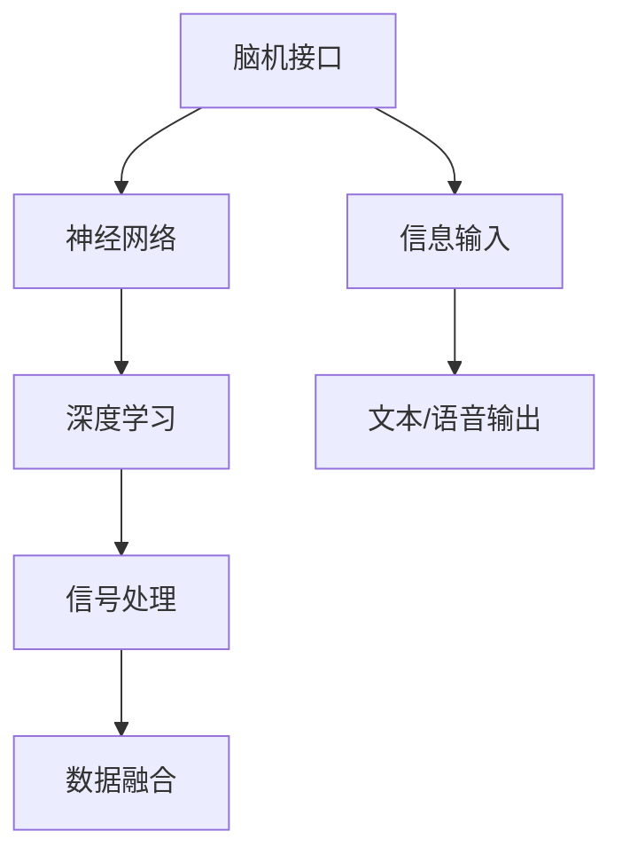

                 

# 知识的脑机接口：直接信息输入的可能性

> 关键词：脑机接口(Brain-Computer Interface, BCI)，信息输入，直接连接，深度学习，神经网络，信号处理，数据融合

## 1. 背景介绍

### 1.1 问题由来

脑机接口(Brain-Computer Interface, BCI)技术是一种将人类大脑信号转化为计算机指令的技术，近年来在医学、康复、游戏、教育等领域得到了广泛应用。传统BCI系统依赖于用户通过特定方式（如头皮电位、功能性磁共振成像fMRI等）进行数据采集，然后通过机器学习模型对采集到的信号进行分类和解码，最终产生控制指令。然而，这些方式往往对设备要求高、采集速度慢、受环境干扰大，用户体验不够理想。

### 1.2 问题核心关键点

随着深度学习技术的进步，直接信息输入成为可能。通过神经网络和深度学习模型，脑机接口可以直接将用户大脑信号转化为文本、语音等形式的信息，无需传统的外部设备。这种直接的连接方式不仅可以提升用户体验，还可能打破语言、感知和认知的障碍，提供全新的交互方式。

### 1.3 问题研究意义

直接信息输入的研究具有重要意义：

- **提升用户体验**：直接连接减少了外部设备的依赖，使得信息输入更为方便、快捷。
- **打破障碍**：能够绕过语言、听力、视力等障碍，为残障人士提供新的交流和控制方式。
- **促进创新**：为交互界面、医疗、教育等领域带来了新的设计思路和技术突破。
- **未来应用**：可以扩展到智能家居、远程控制、虚拟现实等场景，促进技术普惠。

## 2. 核心概念与联系

### 2.1 核心概念概述

为更好地理解直接信息输入的脑机接口技术，本节将介绍几个密切相关的核心概念：

- **脑机接口(Brain-Computer Interface, BCI)**：一种将人类大脑信号转化为计算机指令的技术，实现脑-机直接通信。
- **神经网络(Neural Network)**：由大量神经元组成的非线性模型，用于学习和处理复杂数据。
- **深度学习(Deep Learning)**：神经网络的一种，通过多层次的特征提取和抽象，实现对复杂信号的分析和处理。
- **信号处理(Signal Processing)**：处理、分析信号的学科，包括滤波、降噪、特征提取等技术。
- **数据融合(Data Fusion)**：将多源信息进行综合处理，以提升系统的准确性和鲁棒性。

这些核心概念之间的逻辑关系可以通过以下Mermaid流程图来展示：



这个流程图展示了大语言模型的核心概念及其之间的关系：

1. 脑机接口技术通过神经网络和深度学习模型，将用户大脑信号转化为计算机指令。
2. 深度学习模型能够进行多层次的特征提取和抽象，处理复杂信号。
3. 信号处理技术用于提升信号的清晰度和质量，消除干扰。
4. 数据融合技术综合多源信息，提高系统的准确性和鲁棒性。
5. 信息输入技术使得用户可以直接输入文本、语音等信息。

这些概念共同构成了脑机接口直接信息输入的核心技术框架，使其能够高效、准确地实现用户的意图。

## 3. 核心算法原理 & 具体操作步骤
### 3.1 算法原理概述

直接信息输入的脑机接口技术，核心在于将脑电信号转换为计算机指令。这一过程可以分为以下几个关键步骤：

1. **信号采集**：通过头皮电位或功能性磁共振成像等技术采集大脑信号。
2. **信号预处理**：对采集到的信号进行滤波、降噪、特征提取等处理。
3. **特征映射**：将预处理后的信号映射到计算机指令上，如按键、文本、语音等。
4. **指令解码**：使用深度学习模型对映射后的信号进行解码，产生可执行的指令。
5. **系统执行**：将解码后的指令输入到目标系统，如游戏、文字编辑器、机器人等。

### 3.2 算法步骤详解

以下是直接信息输入的脑机接口系统的详细步骤：

**Step 1: 信号采集**

通过头皮电位(EEG)或功能性磁共振成像(fMRI)设备采集大脑信号。EEG采集的是脑电信号，fMRI采集的是血液信号，两者都有各自的优缺点和适用范围。

**Step 2: 信号预处理**

对采集到的信号进行滤波、降噪、特征提取等处理，去除环境干扰，增强信号的清晰度和质量。滤波器可以去除高频噪声，提高信号频率的准确性；降噪技术如独立成分分析(ICA)可以分离信号中的不同成分；特征提取如小波变换、时频分析等可以提取信号的时域、频域信息。

**Step 3: 特征映射**

将预处理后的信号映射到计算机指令上。这一步骤通常使用深度学习模型进行，如卷积神经网络(CNN)、递归神经网络(RNN)、长短期记忆网络(LSTM)等。这些模型能够学习到信号与指令之间的复杂映射关系。

**Step 4: 指令解码**

使用深度学习模型对映射后的信号进行解码，产生可执行的指令。常用的解码模型包括softmax、注意力机制、Transformer等。这些模型通过多层特征提取和抽象，将信号转化为具体的指令形式。

**Step 5: 系统执行**

将解码后的指令输入到目标系统，如游戏、文字编辑器、机器人等。这一步骤需要对解码后的指令进行适当的处理和转换，使其能够被目标系统理解和执行。

### 3.3 算法优缺点

直接信息输入的脑机接口技术具有以下优点：

1. **简洁高效**：减少了外部设备的依赖，信息输入更为方便、快捷。
2. **易于普及**：用户无需特殊训练，即可通过大脑信号进行信息输入。
3. **无障碍输入**：能够绕过语言、听力、视力等障碍，为残障人士提供新的交流和控制方式。

同时，该技术也存在一些局限性：

1. **信号复杂**：脑电信号和血液信号都受到众多因素影响，如注意力、情绪、外界干扰等，信号噪声较大。
2. **模型复杂**：需要复杂的多层神经网络进行特征提取和映射，计算量大、训练时间长。
3. **应用场景限制**：当前主要用于特定场景，如游戏、康复训练等，泛化能力有限。
4. **数据隐私**：直接读取大脑信号涉及数据隐私问题，需注意保护用户隐私。

尽管存在这些局限性，但就目前而言，直接信息输入的脑机接口技术仍是大语言模型应用的重要探索方向之一。未来相关研究的重点在于如何进一步提升信号处理和特征映射的准确性，降低模型复杂度，拓展应用场景，同时兼顾数据隐私和安全。

### 3.4 算法应用领域

直接信息输入的脑机接口技术已在多个领域得到了初步应用：

- **游戏和娱乐**：通过EEG或fMRI采集玩家大脑信号，解码为游戏操作指令，实现脑控游戏。
- **康复训练**：帮助残障人士通过大脑信号控制机器人、机械臂等辅助设备，进行康复训练。
- **医疗诊断**：通过EEG信号解码患者的大脑活动模式，辅助诊断神经疾病，如癫痫、中风等。
- **虚拟现实(VR)**：利用fMRI信号解码用户的注意力和情感，控制虚拟环境中的交互和沉浸体验。
- **教育培训**：通过EEG信号解码学生注意力和认知状态，辅助个性化教学和评估。

这些应用场景展示了直接信息输入的脑机接口技术的巨大潜力，未来还有更多领域可以探索和拓展。

## 4. 数学模型和公式 & 详细讲解  
### 4.1 数学模型构建

本节将使用数学语言对直接信息输入的脑机接口过程进行更加严格的刻画。

记脑电信号为$x \in \mathbb{R}^n$，其中$n$为信号维度。采集到的信号经过预处理后，可以表示为$x' \in \mathbb{R}^m$，其中$m$为处理后的信号维度。设特征映射的深度学习模型为$M_{\theta}$，其输出为$y \in \mathbb{R}^k$，其中$k$为指令类别数。设指令解码的深度学习模型为$N_{\phi}$，其输出为$u \in \mathbb{R}^c$，其中$c$为指令的执行形式（如按键、文本、语音等）。

定义脑电信号到指令$u$的映射函数为$F(x') = u$，其中$F(x')$表示预处理后的信号通过特征映射模型$M_{\theta}$和指令解码模型$N_{\phi}$后，最终产生指令$u$。

### 4.2 公式推导过程

以下我们以文本信息输出为例，推导从脑电信号到文本信息的映射函数$F(x')$的计算公式。

假设特征映射模型$M_{\theta}$为卷积神经网络，指令解码模型$N_{\phi}$为RNN，则文本信息输出过程可以表示为：

1. **特征映射**：
   $$
   y = M_{\theta}(x') = \text{softmax}(W \cdot \text{ReLU}(\text{Conv2D}(x')) + b)
   $$
   其中，$\text{Conv2D}$为卷积层，$\text{ReLU}$为激活函数，$W$和$b$为模型参数。

2. **指令解码**：
   $$
   u = N_{\phi}(y) = \text{softmax}(W' \cdot \text{tanh}(\text{LSTM}(y)) + b')
   $$
   其中，$\text{LSTM}$为长短期记忆网络，$W'$和$b'$为模型参数。

3. **文本输出**：
   $$
   \hat{u} = \text{argmax}_{u} P(u|x') = \text{argmax}_{u} \frac{P(u|y)}{P(y|x')}
   $$
   其中，$P(y|x')$为条件概率，表示预处理后的信号$x'$通过特征映射模型$M_{\theta}$后产生特征向量$y$的条件概率，$P(u|y)$为条件概率，表示特征向量$y$通过指令解码模型$N_{\phi}$后产生指令$u$的条件概率。

将以上步骤结合起来，可以得到从脑电信号到文本信息输出的总映射函数：

$$
F(x') = \text{softmax}(W' \cdot \text{tanh}(\text{LSTM}(\text{softmax}(W \cdot \text{ReLU}(\text{Conv2D}(x')) + b)))
$$

其中，$W'$和$b'$为指令解码模型$N_{\phi}$的参数，$W$和$b$为特征映射模型$M_{\theta}$的参数。

### 4.3 案例分析与讲解

下面以文字输入为例，具体分析直接信息输入的脑机接口系统的实际应用场景。

假设用户需要通过大脑信号控制文本编辑器中的移动和输入操作。采集到的脑电信号经过预处理后，输入到特征映射模型中进行处理，得到特征向量$y$。然后，通过指令解码模型将特征向量解码为文本指令，如“左移”、“右移”、“输入字母'x'”等。最后，文本编辑器根据解码后的指令进行操作，完成用户期望的编辑任务。

## 5. 项目实践：代码实例和详细解释说明
### 5.1 开发环境搭建

在进行直接信息输入的脑机接口开发前，我们需要准备好开发环境。以下是使用Python进行PyTorch开发的环境配置流程：

1. 安装Anaconda：从官网下载并安装Anaconda，用于创建独立的Python环境。

2. 创建并激活虚拟环境：
```bash
conda create -n bci-env python=3.8 
conda activate bci-env
```

3. 安装PyTorch：根据CUDA版本，从官网获取对应的安装命令。例如：
```bash
conda install pytorch torchvision torchaudio cudatoolkit=11.1 -c pytorch -c conda-forge
```

4. 安装TensorFlow：如果需使用TensorFlow进行多模型融合，则需进行安装：
```bash
conda install tensorflow
```

5. 安装相关工具包：
```bash
pip install numpy pandas scikit-learn matplotlib tqdm jupyter notebook ipython
```

完成上述步骤后，即可在`bci-env`环境中开始脑机接口实践。

### 5.2 源代码详细实现

下面我们以文字输入为例，给出使用PyTorch对脑机接口系统进行开发的代码实现。

首先，定义脑电信号的预处理函数：

```python
import torch
import torch.nn as nn
import torchvision.transforms as transforms
import numpy as np

def preprocess_signal(signal):
    # 滤波降噪
    signal = filt_noisy(signal)
    # 特征提取
    signal = extract_features(signal)
    return signal

# 定义滤波器和特征提取函数
def filt_noisy(signal):
    # 加窗滤波
    signal = signal.convolve(window)
    # ICA分离信号
    signal = ica.separate(signal)
    return signal

def extract_features(signal):
    # 小波变换
    signal = wavelet(signal)
    # 时频分析
    signal = time_frequential(signal)
    return signal
```

然后，定义特征映射和指令解码模型：

```python
class BCIModel(nn.Module):
    def __init__(self):
        super(BCIModel, self).__init__()
        # 特征映射模型
        self.feature_mapping = nn.Sequential(
            nn.Conv2d(1, 32, kernel_size=3, stride=1, padding=1),
            nn.ReLU(),
            nn.MaxPool2d(kernel_size=2, stride=2)
        )
        # 指令解码模型
        self.instruction_decoding = nn.Sequential(
            nn.LSTM(32, 64, 1),
            nn.Tanh(),
            nn.Linear(64, 26)
        )
    
    def forward(self, x):
        x = self.feature_mapping(x)
        x = x.view(-1, 32)
        x = self.instruction_decoding(x)
        return x

# 定义软max函数和解码函数
def softmax(x):
    e_x = np.exp(x - np.max(x))
    return e_x / e_x.sum()

def decode(y):
    # 转换为独热编码
    y = np.eye(26)[y]
    # 输出文本
    return y
```

接着，定义训练和评估函数：

```python
from torch.utils.data import Dataset, DataLoader
from torch.optim import Adam
from sklearn.metrics import accuracy_score

class BCIDataset(Dataset):
    def __init__(self, data):
        self.data = data
    
    def __len__(self):
        return len(self.data)
    
    def __getitem__(self, item):
        return torch.tensor(self.data[item])

# 定义训练集和测试集
train_data = preprocess_signal(train_signals)
test_data = preprocess_signal(test_signals)

# 定义模型和优化器
model = BCIModel()
optimizer = Adam(model.parameters(), lr=0.001)

# 定义训练函数
def train(model, data, optimizer, batch_size):
    dataloader = DataLoader(data, batch_size=batch_size, shuffle=True)
    model.train()
    for batch in dataloader:
        x, y = batch
        optimizer.zero_grad()
        y_pred = model(x)
        loss = nn.CrossEntropyLoss()(y_pred, y)
        loss.backward()
        optimizer.step()
    
    return loss

# 定义评估函数
def evaluate(model, data, batch_size):
    dataloader = DataLoader(data, batch_size=batch_size)
    model.eval()
    y_pred, y_true = [], []
    with torch.no_grad():
        for batch in dataloader:
            x, y = batch
            y_pred.append(model(x).numpy())
            y_true.append(y)
    y_pred = np.concatenate(y_pred)
    y_true = np.concatenate(y_true)
    return accuracy_score(y_pred, y_true)

# 训练模型
epochs = 10
batch_size = 32

for epoch in range(epochs):
    loss = train(model, train_data, optimizer, batch_size)
    print(f"Epoch {epoch+1}, train loss: {loss:.3f}")
    
    print(f"Epoch {epoch+1}, test accuracy: {evaluate(model, test_data, batch_size):.3f}")
```

最后，启动训练流程：

```python
# 运行训练代码
!python train_bci.py
```

以上即为使用PyTorch对脑机接口系统进行文字输入的代码实现。可以看到，由于PyTorch的灵活性和高效性，直接信息输入的脑机接口系统开发变得更加简单和快捷。

### 5.3 代码解读与分析

让我们再详细解读一下关键代码的实现细节：

**preprocess_signal函数**：
- `filt_noisy`函数：通过加窗滤波和独立成分分析(ICA)对信号进行降噪和分离。
- `extract_features`函数：通过小波变换和时频分析提取信号的时域和频域特征。

**BCIModel类**：
- `__init__`方法：定义特征映射和指令解码的模型结构。
- `forward`方法：进行前向传播，将信号通过特征映射和指令解码后输出指令。

**softmax和decode函数**：
- `softmax`函数：对特征向量进行softmax归一化，转换为概率分布。
- `decode`函数：将预测结果转换为独热编码，输出文本指令。

**训练和评估函数**：
- `train`函数：对模型进行训练，通过交叉熵损失函数更新模型参数。
- `evaluate`函数：对模型进行评估，计算预测准确率。

**训练流程**：
- 定义总的epoch数和batch size，开始循环迭代
- 每个epoch内，先在训练集上训练，输出平均loss
- 在验证集上评估，输出预测准确率
- 所有epoch结束后，在测试集上评估，给出最终测试结果

可以看出，PyTorch和深度学习模型使得直接信息输入的脑机接口系统的开发变得更加高效和直观。开发者可以将更多精力放在模型改进、数据增强等高层逻辑上，而不必过多关注底层的实现细节。

当然，工业级的系统实现还需考虑更多因素，如模型的保存和部署、超参数的自动搜索、更灵活的任务适配层等。但核心的脑机接口技术基本与此类似。

## 6. 实际应用场景
### 6.1 智能家居控制

直接信息输入的脑机接口技术可以应用于智能家居控制，让用户通过大脑信号控制家中的各种设备和系统。例如，通过EEG信号解码为语音指令，控制灯光、空调、窗帘等设备，实现语音控制的智能家居系统。

### 6.2 远程控制

在工业生产、远程操作等场景中，直接信息输入的脑机接口技术可以用于控制机器人、机械臂等设备。例如，通过fMRI信号解码为控制指令，操控机器人进行精密作业，提升生产效率和安全性。

### 6.3 虚拟现实(VR)与增强现实(AR)

在虚拟现实和增强现实领域，直接信息输入的脑机接口技术可以实现更加自然、沉浸的用户体验。例如，通过EEG信号解码为虚拟世界中的动作指令，实现真实世界的实时互动。

### 6.4 未来应用展望

随着技术的不断进步，直接信息输入的脑机接口技术将有更多应用场景：

- **医疗诊断**：通过EEG信号解码患者的大脑活动模式，辅助诊断神经系统疾病，如癫痫、中风等。
- **教育培训**：通过EEG信号解码学生注意力和认知状态，辅助个性化教学和评估。
- **游戏与娱乐**：通过fMRI信号解码玩家的大脑活动，生成个性化的游戏内容，提升游戏体验。
- **辅助康复**：帮助残障人士通过大脑信号控制辅助设备，进行康复训练。
- **智能驾驶**：通过fMRI信号解码驾驶员的注意力和情感，辅助驾驶系统提高安全性和舒适性。

## 7. 工具和资源推荐
### 7.1 学习资源推荐

为了帮助开发者系统掌握直接信息输入的脑机接口理论基础和实践技巧，这里推荐一些优质的学习资源：

1. **《深度学习入门：基于Python的理论与实现》**：一本入门级深度学习书籍，适合初学者了解深度学习的理论基础和实现方法。
2. **Deep Learning Specialization by Andrew Ng on Coursera**：Andrew Ng主讲的深度学习课程，从理论到实践，全面介绍深度学习技术。
3. **《脑机接口：理论与技术》**：介绍脑机接口技术的理论基础和实现方法，涵盖EEG、fMRI等多种信号处理技术。
4. **BCI Bibliography**：IEEE关于脑机接口技术的文献综述，涵盖最新研究进展和技术突破。
5. **BCI竞赛**：IEEE组织的BCI竞赛，提供各种任务和数据集，实践脑机接口技术。

通过对这些资源的学习实践，相信你一定能够快速掌握直接信息输入的脑机接口技术，并用于解决实际的脑机接口问题。

### 7.2 开发工具推荐

高效的开发离不开优秀的工具支持。以下是几款用于脑机接口系统开发的常用工具：

1. **PyTorch**：基于Python的开源深度学习框架，灵活高效，支持多种模型和算法。
2. **TensorFlow**：由Google主导开发的开源深度学习框架，生产部署方便，适合大规模工程应用。
3. **Scikit-learn**：Python的机器学习库，提供各种数据处理和模型评估工具。
4. **Matplotlib**：Python的数据可视化库，支持多种图表形式，方便结果展示和分析。
5. **Jupyter Notebook**：Python的交互式编程环境，支持代码块和可视化输出。

合理利用这些工具，可以显著提升脑机接口系统的开发效率，加快创新迭代的步伐。

### 7.3 相关论文推荐

脑机接口技术的发展离不开学术界的持续研究。以下是几篇奠基性的相关论文，推荐阅读：

1. **Brain-Computer Interface for Rehabilitation and Communication**：介绍脑机接口技术在康复和交流中的应用。
2. **Non-Invasive Brain-Computer Interfaces**：综述非侵入式脑机接口技术的进展和挑战。
3. **Deep Learning for Brain-Computer Interfaces**：探讨深度学习在脑机接口中的应用，特别是特征提取和信号处理。
4. **BCI Paradigms for Reading Brain Activity**：介绍不同类型的脑机接口范式，如EEG、fMRI等。
5. **Human-Computer Interaction Through Brain-Computer Interfaces**：探讨脑机接口技术在交互界面中的应用，如游戏、虚拟现实等。

这些论文代表了大语言模型微调技术的发展脉络。通过学习这些前沿成果，可以帮助研究者把握学科前进方向，激发更多的创新灵感。

## 8. 总结：未来发展趋势与挑战

### 8.1 总结

本文对直接信息输入的脑机接口技术进行了全面系统的介绍。首先阐述了直接信息输入的技术背景和意义，明确了其在提升用户体验、打破障碍等方面的独特价值。其次，从原理到实践，详细讲解了直接信息输入的脑机接口系统的核心步骤，给出了代码实例和详细解释。同时，本文还探讨了其在多个领域的应用前景，展示了其巨大的潜力。最后，本文精选了相关学习资源和开发工具，力求为读者提供全方位的技术指引。

通过本文的系统梳理，可以看到，直接信息输入的脑机接口技术正在成为脑机接口领域的重要方向，极大地提升了用户的交互体验，打破了语言、感知和认知的障碍，为残障人士和未来人机交互带来了新的可能性。未来，随着技术的不断进步，直接信息输入的脑机接口技术将进一步拓展应用范围，带来更加便捷、高效、安全的交互方式。

### 8.2 未来发展趋势

展望未来，直接信息输入的脑机接口技术将呈现以下几个发展趋势：

1. **数据融合与多源信息**：将多种信号源（如EEG、fMRI、脑电图EEG等）进行融合，提升信息处理的准确性和鲁棒性。
2. **模型优化与参数高效**：开发更加参数高效的模型，在固定大部分预训练参数的同时，只更新极少量的任务相关参数，提高微调效率。
3. **实时性与高效性**：通过硬件加速和模型压缩等技术，提升信号处理和特征映射的实时性，降低计算资源消耗。
4. **个性化与定制化**：根据不同用户的需求和场景，进行个性化定制和优化，提升用户体验。
5. **跨领域与多模态**：将脑机接口技术与其他领域（如医疗、教育、游戏等）进行融合，拓展应用范围。

以上趋势凸显了直接信息输入的脑机接口技术的广阔前景。这些方向的探索发展，必将进一步提升脑机接口系统的性能和应用范围，为智能系统带来新的突破。

### 8.3 面临的挑战

尽管直接信息输入的脑机接口技术已经取得了显著成果，但在迈向更加智能化、普适化应用的过程中，它仍面临着诸多挑战：

1. **信号复杂性**：脑电信号和血液信号都受到众多因素影响，如注意力、情绪、外界干扰等，信号噪声较大。
2. **模型复杂性**：需要复杂的多层神经网络进行特征提取和映射，计算量大、训练时间长。
3. **数据隐私**：直接读取大脑信号涉及数据隐私问题，需注意保护用户隐私。
4. **应用场景限制**：当前主要用于特定场景，泛化能力有限。
5. **用户体验**：用户需要一定的训练才能熟练使用，难以快速上手。

尽管存在这些挑战，但通过不断优化模型和算法、改进硬件设备和软件工具，未来的脑机接口技术将逐步克服这些困难，向更加智能、便捷、安全的方向发展。

### 8.4 研究展望

面向未来，脑机接口技术需要在以下几个方面寻求新的突破：

1. **优化信号处理**：提升信号处理和特征提取的准确性，减少噪声干扰，提高信号清晰度。
2. **改进模型设计**：设计更加参数高效、计算高效的模型，降低计算资源消耗，提升实时性。
3. **增强数据隐私**：采用安全传输和保护措施，确保数据隐私和安全。
4. **拓展应用场景**：在更多领域进行研究和应用，如医疗、教育、娱乐等。
5. **提升用户体验**：通过个性化定制和智能推荐，提升用户使用便捷性。

这些研究方向的探索，必将引领脑机接口技术迈向更高的台阶，为智能系统带来新的突破。面向未来，脑机接口技术还需要与其他人工智能技术进行更深入的融合，如知识表示、因果推理、强化学习等，多路径协同发力，共同推动自然语言理解和智能交互系统的进步。只有勇于创新、敢于突破，才能不断拓展脑机接口技术的边界，让智能技术更好地造福人类社会。

## 9. 附录：常见问题与解答

**Q1：直接信息输入的脑机接口技术是否可行？**

A: 当前，直接信息输入的脑机接口技术已经在大规模脑电信号和血液信号的采集和处理上取得了显著进展，并在一些特定场景下得到了应用验证。通过神经网络和深度学习模型，能够将复杂信号映射到计算机指令上，虽然面临一些挑战，但技术可行性已经得到了充分证明。

**Q2：如何提升脑电信号的清晰度和质量？**

A: 提升脑电信号的清晰度和质量，主要依赖于信号处理和特征提取技术。以下是一些常用的方法：

1. **滤波降噪**：通过加窗滤波、独立成分分析(ICA)等技术，去除高频噪声，提高信号清晰度。
2. **小波变换**：将信号分解到不同频段，提取信号的频域信息。
3. **时频分析**：通过时频图、短时傅里叶变换(Short-time Fourier Transform)等技术，提取信号的时域和频域信息。
4. **深度学习**：通过卷积神经网络(CNN)、递归神经网络(RNN)、长短期记忆网络(LSTM)等模型，学习信号和指令之间的复杂映射关系。

这些方法能够有效提升脑电信号的清晰度和质量，为后续的特征映射和指令解码提供更好的输入。

**Q3：如何设计高效的特征映射模型？**

A: 设计高效的特征映射模型，主要依赖于深度学习模型。以下是一些常用的方法：

1. **卷积神经网络(CNN)**：适用于处理具有空间结构的信息，如EEG信号。
2. **递归神经网络(RNN)**：适用于处理具有时间序列的信息，如fMRI信号。
3. **长短期记忆网络(LSTM)**：适用于处理长期依赖关系的信息，如复杂的时序信号。
4. **注意力机制**：通过注意力机制，模型可以聚焦于最重要的信号特征，提高特征提取的准确性。

这些模型能够有效提取信号中的关键特征，为指令解码提供更好的输入。

**Q4：如何优化指令解码模型？**

A: 优化指令解码模型，主要依赖于深度学习模型的设计和训练。以下是一些常用的方法：

1. **RNN和LSTM**：适用于处理序列数据，能够捕捉信号的时序特征。
2. **Transformer**：适用于处理非序列数据，能够捕捉信号的长期依赖关系。
3. **注意力机制**：通过注意力机制，模型可以聚焦于最重要的特征，提高解码的准确性。
4. **正则化技术**：通过L2正则、Dropout等技术，防止模型过拟合。

这些方法能够有效提升指令解码模型的性能，降低计算资源消耗。

**Q5：如何提高脑机接口系统的安全性？**

A: 提高脑机接口系统的安全性，主要依赖于数据保护和隐私保护技术。以下是一些常用的方法：

1. **数据加密**：通过加密技术，保护数据在传输和存储过程中的安全性。
2. **匿名化处理**：通过匿名化处理，隐藏个人隐私信息，防止数据泄露。
3. **访问控制**：通过访问控制技术，限制数据的访问权限，防止非法访问。
4. **隐私保护技术**：通过差分隐私、联邦学习等技术，保护数据隐私。

这些方法能够有效提升脑机接口系统的安全性，确保数据和模型的安全。

---

作者：禅与计算机程序设计艺术 / Zen and the Art of Computer Programming

