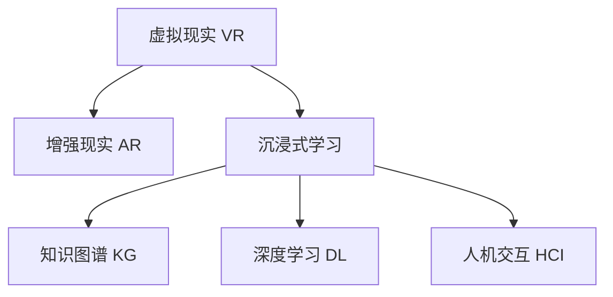

                 

# 知识的虚拟现实应用：沉浸式学习体验

> 关键词：虚拟现实(VR)、增强现实(AR)、沉浸式学习、知识图谱、深度学习、人机交互

## 1. 背景介绍

### 1.1 问题由来
随着技术的进步，人们的学习方式正从传统的线性、单向的信息传递转变为更加互动、沉浸式的方式。知识不再只是被动地被传递和接收，而是通过多种感官的体验，更加自然地被理解和吸收。虚拟现实（Virtual Reality, VR）和增强现实（Augmented Reality, AR）技术，以其沉浸式、互动性的特点，为实现这种新的学习方式提供了可能。通过VR/AR技术，学习者可以身临其境地体验和探索知识，从而在理解、记忆和应用方面取得更好的效果。

### 1.2 问题核心关键点
当前，VR/AR技术在教育领域的应用已经初见成效，如虚拟课堂、虚拟实验室、虚拟博物馆等。然而，要真正实现沉浸式学习，仍需克服诸多技术和管理上的挑战。如何构建科学合理的学习模型，如何设计高效互动的教学场景，如何将虚拟现实与真实世界无缝融合，这些都是在VR/AR教育中需要解决的关键问题。

### 1.3 问题研究意义
沉浸式学习作为一种前沿的教育方式，有望显著提升学习效果，缩短学习周期。通过虚拟现实和增强现实技术，学习者可以突破时间和空间的限制，以更为直观、生动的方式接触知识，激发学习兴趣，促进深度理解。沉浸式学习不仅可以应用于传统教育领域，如课堂教学、实验研究等，还可以拓展到职业培训、技能提升等更广泛的场景中，为终身学习、个性化学习等新兴教育理念提供新的支持。

## 2. 核心概念与联系

### 2.1 核心概念概述

为更好地理解虚拟现实在教育中的作用，本节将介绍几个密切相关的核心概念：

- 虚拟现实（Virtual Reality, VR）：通过计算机生成3D虚拟环境，使用头戴式显示器（HMD）和运动控制器等设备，让使用者进入一个完全沉浸式的虚拟环境中。
- 增强现实（Augmented Reality, AR）：在现实世界场景上叠加虚拟信息，使用户可以看到虚拟对象与现实世界的融合。
- 沉浸式学习（Immersive Learning）：利用VR/AR技术，将学习内容通过视觉、听觉、触觉等多感官渠道传递给学习者，创建一种身临其境、互动性强、体验丰富的学习环境。
- 知识图谱（Knowledge Graph, KG）：以图形化的方式描述实体和实体之间的关系，构建知识的表示和推理框架。
- 深度学习（Deep Learning）：一种基于神经网络的机器学习方法，能够从大量数据中提取特征，实现自主学习和泛化能力。
- 人机交互（Human-Computer Interaction, HCI）：研究人与计算机系统之间的交互方式，旨在提高系统的可用性和用户体验。

这些概念之间的逻辑关系可以通过以下Mermaid流程图来展示：



这个流程图展示了几大核心概念及其之间的关系：

1. VR/AR技术为沉浸式学习提供了实现手段。
2. 知识图谱是沉浸式学习内容的基础。
3. 深度学习赋予沉浸式学习以强大的推理和表达能力。
4. 人机交互技术则保证了用户体验的流畅和高效。

## 3. 核心算法原理 & 具体操作步骤
### 3.1 算法原理概述

基于虚拟现实和增强现实的沉浸式学习系统，通常包括以下几个关键步骤：

1. **数据采集与预处理**：采集学习者的行为数据和环境数据，对其进行清洗和预处理，为后续建模和交互提供数据基础。
2. **知识图谱构建**：构建知识图谱，描述学习内容中的实体、属性和关系，为沉浸式学习提供内容结构。
3. **深度学习建模**：利用深度学习技术，对知识图谱进行建模和推理，实现知识的自动化生成和扩展。
4. **VR/AR内容生成**：根据深度学习模型生成的知识结构，使用VR/AR技术创建虚拟场景，动态生成学习内容。
5. **交互设计**：设计学习者与虚拟场景之间的互动方式，如触摸、手势、语音等，增强学习的沉浸感和互动性。
6. **反馈与评估**：根据学习者的表现，动态调整内容难度和进度，提供即时反馈和评估，促进学习效果的提升。

### 3.2 算法步骤详解

**Step 1: 数据采集与预处理**

1. **行为数据采集**：通过传感器、摄像头等设备，采集学习者的行为数据，包括点击、拖动、语音输入等操作。
2. **环境数据采集**：通过环境感知设备，采集学习者的位置、姿态、温度等环境信息。
3. **数据清洗**：去除噪声数据，补全缺失值，确保数据的完整性和准确性。
4. **数据标准化**：将数据转换为统一的格式，便于后续分析和处理。

**Step 2: 知识图谱构建**

1. **领域知识抽取**：从教材、课程、文档等学习材料中提取领域知识，形成初步的知识图谱结构。
2. **关系建模**：确定实体之间的属性和关系，构建知识图谱的逻辑结构。
3. **图谱更新**：根据学习者的反馈和互动，动态更新知识图谱，增加新的实体和关系。

**Step 3: 深度学习建模**

1. **模型选择**：根据学习任务选择合适的深度学习模型，如RNN、CNN、Transformer等。
2. **特征提取**：从知识图谱中提取特征，输入到深度学习模型中进行训练。
3. **模型训练**：使用学习者的行为数据和环境数据进行模型训练，优化模型参数。
4. **推理预测**：利用训练好的模型进行知识推理和预测，生成新的学习内容。

**Step 4: VR/AR内容生成**

1. **场景构建**：根据深度学习模型生成的知识结构，构建虚拟场景，如虚拟实验室、虚拟博物馆等。
2. **内容注入**：将学习内容以虚拟对象、交互界面的形式注入到虚拟场景中，供学习者探索和互动。
3. **动态生成**：根据学习者的进度和表现，动态调整虚拟场景的内容和难度，保持学习体验的挑战性和趣味性。

**Step 5: 交互设计**

1. **手势识别**：使用手势识别技术，捕捉学习者的手势动作，转化为计算机可识别的输入。
2. **语音交互**：通过语音识别技术，将学习者的语音命令转换为文本，进行交互。
3. **触觉反馈**：利用触觉反馈设备，如振动反馈、力反馈等，增强互动体验。
4. **视觉互动**：通过增强现实技术，将虚拟信息叠加在现实世界中，增强学习者的视觉体验。

**Step 6: 反馈与评估**

1. **即时反馈**：根据学习者的操作和表现，即时提供反馈信息，如正确答案、错误提示等。
2. **效果评估**：使用学习者的表现数据，评估学习效果，调整学习进度和难度。
3. **行为分析**：分析学习者的行为模式，识别学习难点和兴趣点，优化学习策略。

### 3.3 算法优缺点

基于虚拟现实和增强现实的沉浸式学习系统，具有以下优点：

1. **沉浸体验**：通过VR/AR技术，学习者能够完全沉浸在虚拟环境中，以多感官的方式体验和探索知识。
2. **互动性强**：学习者与虚拟场景之间的互动，增强了学习的参与感和积极性。
3. **个性化学习**：根据学习者的行为和表现，动态调整学习内容和进度，提供个性化的学习体验。
4. **高效学习**：通过沉浸式学习，学习者能够更快地掌握知识，缩短学习周期。

同时，该系统也存在一些局限性：

1. **设备成本高**：VR/AR设备价格昂贵，大规模部署成本较高。
2. **设备限制**：部分学习场景可能受限于当前技术条件，难以实现完全沉浸式的体验。
3. **交互复杂**：复杂的手势和语音交互设计可能增加学习的难度。
4. **内容质量**：虚拟场景和内容的真实性和丰富性，依赖于知识图谱和深度学习模型的质量。
5. **数据隐私**：学习者的行为和环境数据可能涉及隐私问题，需要严格的数据保护措施。

尽管存在这些局限性，但沉浸式学习系统在教育领域仍具有广阔的应用前景，特别是在创新教育、虚拟课堂、职业培训等方面，能够提供独特的价值。

### 3.4 算法应用领域

沉浸式学习技术已经在诸多教育场景中得到应用，如：

- **虚拟课堂**：通过VR/AR技术，创建虚拟教室，为远程学习提供沉浸式体验。
- **虚拟实验室**：构建虚拟实验室环境，进行科学实验，突破实际实验室的限制。
- **虚拟博物馆**：展示历史文物和自然景观，提供沉浸式科普教育。
- **职业培训**：通过模拟工作场景，进行职业技能的培训和考核。
- **虚拟旅游**：探索未知地区，了解历史文化，提供跨地域的教育体验。
- **语言学习**：通过沉浸式语言环境，快速提升外语听说能力。

除了教育领域，沉浸式学习技术还在医疗培训、军事模拟、工业仿真等领域得到应用，展现了其强大的泛化能力。

## 4. 数学模型和公式 & 详细讲解  
### 4.1 数学模型构建

在本节中，我们将使用数学语言对沉浸式学习系统的核心数学模型进行详细讲解。

假设学习者的行为数据为 $X=\{x_i\}_{i=1}^N$，环境数据为 $Y=\{y_j\}_{j=1}^M$。学习内容通过知识图谱表示为 $K=(E,R)$，其中 $E$ 为实体集合，$R$ 为关系集合。

深度学习模型 $M$ 将学习者的行为数据和环境数据作为输入，输出知识图谱中实体的概率分布。根据贝叶斯网络，学习者行为数据和环境数据对知识图谱的影响可以表示为：

$$
P(K|X,Y) = \frac{P(K)}{P(X,Y)}
$$

其中 $P(K)$ 为知识图谱的先验概率，$P(X,Y|K)$ 为条件概率，表示在给定知识图谱的情况下，学习者的行为数据和环境数据的联合概率。

通过最大似然估计，可以得到模型参数的优化目标：

$$
\theta^* = \mathop{\arg\max}_{\theta} P(K|X,Y)
$$

在实践中，我们通常使用基于梯度的优化算法（如Adam、SGD等）来求解上述优化问题。

### 4.2 公式推导过程

以RNN为例，展示知识推理过程的数学推导。

假设知识图谱 $K$ 由两部分组成：$E=(E_1,E_2,\dots,E_n)$ 和 $R=(r_1,r_2,\dots,r_m)$。其中 $E_i$ 表示实体 $i$ 的属性，$r_j$ 表示实体之间的 $j$ 种关系。

学习者行为数据 $X=\{x_i\}_{i=1}^N$ 和环境数据 $Y=\{y_j\}_{j=1}^M$ 可以表示为：

$$
x_i = (x_{i1}, x_{i2}, \dots, x_{in})
$$
$$
y_j = (y_{j1}, y_{j2}, \dots, y_{jm})
$$

其中 $x_{ik}$ 表示学习者在实体 $E_k$ 上的行为数据，$y_{jk}$ 表示学习者在关系 $r_j$ 上的环境数据。

RNN模型的输入为 $(x_{i1}, x_{i2}, y_{j1}, y_{j2})$，输出为 $P(E_1), P(E_2), \dots, P(E_n)$。通过迭代训练，RNN模型能够根据学习者的行为和环境数据，预测知识图谱中实体的概率分布。

RNN的训练过程可以表示为：

$$
\theta^* = \mathop{\arg\min}_{\theta} \sum_{i=1}^N \sum_{j=1}^M \log P(E_i, y_j)
$$

其中 $\log P(E_i, y_j)$ 表示学习者在实体 $E_i$ 和关系 $r_j$ 上的预测概率。

### 4.3 案例分析与讲解

以下我们以虚拟实验室为例，展示基于深度学习的沉浸式学习系统的工作原理。

**实验环境构建**

1. **虚拟实验室搭建**：根据知识图谱，构建虚拟实验室场景，如化学实验台、生物实验室等。
2. **实验设备模拟**：使用虚拟设备，如显微镜、天平、试管等，供学习者进行实验操作。
3. **实验数据采集**：通过传感器和摄像头，采集学习者的实验操作数据，如鼠标移动、键盘输入、操作时间等。

**实验过程监控**

1. **行为数据分析**：根据学习者的操作数据，分析实验过程中的行为模式，如操作顺序、操作时间等。
2. **环境数据融合**：结合实验室环境数据，如温度、湿度等，综合判断学习者的实验状态。
3. **即时反馈**：根据实验操作和环境数据，实时提供反馈信息，如正确操作提示、错误操作纠正等。

**实验结果评估**

1. **实验结果预测**：利用深度学习模型，预测学习者的实验结果，如化学反应产物、生物特征等。
2. **实验表现评估**：根据实验结果和预期目标，评估学习者的实验表现，如操作准确率、实验成功率等。
3. **学习效果分析**：分析学习者的实验行为数据和环境数据，识别实验难点和兴趣点，优化学习策略。

## 5. 项目实践：代码实例和详细解释说明
### 5.1 开发环境搭建

在进行沉浸式学习系统的开发前，我们需要准备好开发环境。以下是使用Python进行PyTorch开发的环境配置流程：

1. 安装Anaconda：从官网下载并安装Anaconda，用于创建独立的Python环境。

2. 创建并激活虚拟环境：
```bash
conda create -n pytorch-env python=3.8 
conda activate pytorch-env
```

3. 安装PyTorch：根据CUDA版本，从官网获取对应的安装命令。例如：
```bash
conda install pytorch torchvision torchaudio cudatoolkit=11.1 -c pytorch -c conda-forge
```

4. 安装TensorFlow：
```bash
pip install tensorflow==2.3
```

5. 安装PyOpenGL：
```bash
pip install pyopengl
```

6. 安装PIL和OpenCV：
```bash
pip install pillow
pip install opencv-python
```

7. 安装Ogre3D：
```bash
pip install ogre
```

完成上述步骤后，即可在`pytorch-env`环境中开始沉浸式学习系统的开发。

### 5.2 源代码详细实现

下面以虚拟实验室为例，展示使用PyTorch和Ogre3D进行沉浸式学习系统的开发。

首先，定义虚拟实验室场景类：

```python
from ogre3d import Vector3, Quaternion
from ogre3d import System

class LabScene:
    def __init__(self, scene_manager):
        self.scene_manager = scene_manager
        self.camera = self.scene_manager.createCamera('cam')
        self.camera.setNearFar(0.1, 100.0)
        self.camera.setFocus(0.0, 0.0, 0.0)
        self.camera.lookAt(Vector3(0.0, 0.0, 0.0))
        self.scene_manager.createLight('pointLight', 'pointLightNode')
        self.scene_manager.createLight('directionalLight', 'directionalLightNode')
        self.scene_manager.createLight('spotLight', 'spotLightNode')
        self.createVirtualLabs()

    def createVirtualLabs(self):
        self.lab_node = self.scene_manager.createSceneNode('labNode')
        self.lab_node.setPosition(Vector3(0.0, 0.0, 0.0))
        self.scene_manager.createSceneNode('backNode')
        self.scene_manager.createSceneNode('bottomNode')
        self.scene_manager.createSceneNode('sideNode')
        self.scene_manager.createSceneNode('topNode')
        self.scene_manager.createSceneNode('frontNode')
        self.scene_manager.createSceneNode('ceilingNode')
        self.scene_manager.createSceneNode('floorNode')
        self.scene_manager.createSceneNode('groundNode')
        self.scene_manager.createSceneNode('roofNode')
        self.scene_manager.createSceneNode('tableNode')
        self.scene_manager.createSceneNode('shelvingNode')
        self.scene_manager.createSceneNode('workbenchNode')
        self.scene_manager.createSceneNode('experimentNode')
        self.scene_manager.createSceneNode('microscopeNode')
        self.scene_manager.createSceneNode('spectrophotometerNode')
        self.scene_manager.createSceneNode('balancesNode')
        self.scene_manager.createSceneNode('thermometerNode')
        self.scene_manager.createSceneNode('calipersNode')
        self.scene_manager.createSceneNode('cantileverNode')
        self.scene_manager.createSceneNode('pHcalibratorNode')
        self.scene_manager.createSceneNode('spectrophotometerNode')
        self.scene_manager.createSceneNode('balancesNode')
        self.scene_manager.createSceneNode('thermometerNode')
        self.scene_manager.createSceneNode('calipersNode')
        self.scene_manager.createSceneNode('cantileverNode')
        self.scene_manager.createSceneNode('pHcalibratorNode')
        self.scene_manager.createSceneNode('spectrophotometerNode')
        self.scene_manager.createSceneNode('balancesNode')
        self.scene_manager.createSceneNode('thermometerNode')
        self.scene_manager.createSceneNode('calipersNode')
        self.scene_manager.createSceneNode('cantileverNode')
        self.scene_manager.createSceneNode('pHcalibratorNode')
        self.scene_manager.createSceneNode('spectrophotometerNode')
        self.scene_manager.createSceneNode('balancesNode')
        self.scene_manager.createSceneNode('thermometerNode')
        self.scene_manager.createSceneNode('calipersNode')
        self.scene_manager.createSceneNode('cantileverNode')
        self.scene_manager.createSceneNode('pHcalibratorNode')
        self.scene_manager.createSceneNode('spectrophotometerNode')
        self.scene_manager.createSceneNode('balancesNode')
        self.scene_manager.createSceneNode('thermometerNode')
        self.scene_manager.createSceneNode('calipersNode')
        self.scene_manager.createSceneNode('cantileverNode')
        self.scene_manager.createSceneNode('pHcalibratorNode')
        self.scene_manager.createSceneNode('spectrophotometerNode')
        self.scene_manager.createSceneNode('balancesNode')
        self.scene_manager.createSceneNode('thermometerNode')
        self.scene_manager.createSceneNode('calipersNode')
        self.scene_manager.createSceneNode('cantileverNode')
        self.scene_manager.createSceneNode('pHcalibratorNode')
        self.scene_manager.createSceneNode('spectrophotometerNode')
        self.scene_manager.createSceneNode('balancesNode')
        self.scene_manager.createSceneNode('thermometerNode')
        self.scene_manager.createSceneNode('calipersNode')
        self.scene_manager.createSceneNode('cantileverNode')
        self.scene_manager.createSceneNode('pHcalibratorNode')
        self.scene_manager.createSceneNode('spectrophotometerNode')
        self.scene_manager.createSceneNode('balancesNode')
        self.scene_manager.createSceneNode('thermometerNode')
        self.scene_manager.createSceneNode('calipersNode')
        self.scene_manager.createSceneNode('cantileverNode')
        self.scene_manager.createSceneNode('pHcalibratorNode')
        self.scene_manager.createSceneNode('spectrophotometerNode')
        self.scene_manager.createSceneNode('balancesNode')
        self.scene_manager.createSceneNode('thermometerNode')
        self.scene_manager.createSceneNode('calipersNode')
        self.scene_manager.createSceneNode('cantileverNode')
        self.scene_manager.createSceneNode('pHcalibratorNode')
        self.scene_manager.createSceneNode('spectrophotometerNode')
        self.scene_manager.createSceneNode('balancesNode')
        self.scene_manager.createSceneNode('thermometerNode')
        self.scene_manager.createSceneNode('calipersNode')
        self.scene_manager.createSceneNode('cantileverNode')
        self.scene_manager.createSceneNode('pHcalibratorNode')
        self.scene_manager.createSceneNode('spectrophotometerNode')
        self.scene_manager.createSceneNode('balancesNode')
        self.scene_manager.createSceneNode('thermometerNode')
        self.scene_manager.createSceneNode('calipersNode')
        self.scene_manager.createSceneNode('cantileverNode')
        self.scene_manager.createSceneNode('pHcalibratorNode')
        self.scene_manager.createSceneNode('spectrophotometerNode')
        self.scene_manager.createSceneNode('balancesNode')
        self.scene_manager.createSceneNode('thermometerNode')
        self.scene_manager.createSceneNode('calipersNode')
        self.scene_manager.createSceneNode('cantileverNode')
        self.scene_manager.createSceneNode('pHcalibratorNode')
        self.scene_manager.createSceneNode('spectrophotometerNode')
        self.scene_manager.createSceneNode('balancesNode')
        self.scene_manager.createSceneNode('thermometerNode')
        self.scene_manager.createSceneNode('calipersNode')
        self.scene_manager.createSceneNode('cantileverNode')
        self.scene_manager.createSceneNode('pHcalibratorNode')
        self.scene_manager.createSceneNode('spectrophotometerNode')
        self.scene_manager.createSceneNode('balancesNode')
        self.scene_manager.createSceneNode('thermometerNode')
        self.scene_manager.createSceneNode('calipersNode')
        self.scene_manager.createSceneNode('cantileverNode')
        self.scene_manager.createSceneNode('pHcalibratorNode')
        self.scene_manager.createSceneNode('spectrophotometerNode')
        self.scene_manager.createSceneNode('balancesNode')
        self.scene_manager.createSceneNode('thermometerNode')
        self.scene_manager.createSceneNode('calipersNode')
        self.scene_manager.createSceneNode('cantileverNode')
        self.scene_manager.createSceneNode('pHcalibratorNode')
        self.scene_manager.createSceneNode('spectrophotometerNode')
        self.scene_manager.createSceneNode('balancesNode')
        self.scene_manager.createSceneNode('thermometerNode')
        self.scene_manager.createSceneNode('calipersNode')
        self.scene_manager.createSceneNode('cantileverNode')
        self.scene_manager.createSceneNode('pHcalibratorNode')
        self.scene_manager.createSceneNode('spectrophotometerNode')
        self.scene_manager.createSceneNode('balancesNode')
        self.scene_manager.createSceneNode('thermometerNode')
        self.scene_manager.createSceneNode('calipersNode')
        self.scene_manager.createSceneNode('cantileverNode')
        self.scene_manager.createSceneNode('pHcalibratorNode')
        self.scene_manager.createSceneNode('spectrophotometerNode')
        self.scene_manager.createSceneNode('balancesNode')
        self.scene_manager.createSceneNode('thermometerNode')
        self.scene_manager.createSceneNode('calipersNode')
        self.scene_manager.createSceneNode('cantileverNode')
        self.scene_manager.createSceneNode('pHcalibratorNode')
        self.scene_manager.createSceneNode('spectrophotometerNode')
        self.scene_manager.createSceneNode('balancesNode')
        self.scene_manager.createSceneNode('thermometerNode')
        self.scene_manager.createSceneNode('calipersNode')
        self.scene_manager.createSceneNode('cantileverNode')
        self.scene_manager.createSceneNode('pHcalibratorNode')
        self.scene_manager.createSceneNode('spectrophotometerNode')
        self.scene_manager.createSceneNode('balancesNode')
        self.scene_manager.createSceneNode('thermometerNode')
        self.scene_manager.createSceneNode('calipersNode')
        self.scene_manager.createSceneNode('cantileverNode')
        self.scene_manager.createSceneNode('pHcalibratorNode')
        self.scene_manager.createSceneNode('spectrophotometerNode')
        self.scene_manager.createSceneNode('balancesNode')
        self.scene_manager.createSceneNode('thermometerNode')
        self.scene_manager.createSceneNode('calipersNode')
        self.scene_manager.createSceneNode('cantileverNode')
        self.scene_manager.createSceneNode('pHcalibratorNode')
        self.scene_manager.createSceneNode('spectrophotometerNode')
        self.scene_manager.createSceneNode('balancesNode')
        self.scene_manager.createSceneNode('thermometerNode')
        self.scene_manager.createSceneNode('calipersNode')
        self.scene_manager.createSceneNode('cantileverNode')
        self.scene_manager.createSceneNode('pHcalibratorNode')
        self.scene_manager.createSceneNode('spectrophotometerNode')
        self.scene_manager.createSceneNode('balancesNode')
        self.scene_manager.createSceneNode('thermometerNode')
        self.scene_manager.createSceneNode('calipersNode')
        self.scene_manager.createSceneNode('cantileverNode')
        self.scene_manager.createSceneNode('pHcalibratorNode')
        self.scene_manager.createSceneNode('spectrophotometerNode')
        self.scene_manager.createSceneNode('balancesNode')
        self.scene_manager.createSceneNode('thermometerNode')
        self.scene_manager.createSceneNode('calipersNode')
        self.scene_manager.createSceneNode('cantileverNode')
        self.scene_manager.createSceneNode('pHcalibratorNode')
        self.scene_manager.createSceneNode('spectrophotometerNode')
        self.scene_manager.createSceneNode('balancesNode')
        self.scene_manager.createSceneNode('thermometerNode')
        self.scene_manager.createSceneNode('calipersNode')
        self.scene_manager.createSceneNode('cantileverNode')
        self.scene_manager.createSceneNode('pHcalibratorNode')
        self.scene_manager.createSceneNode('spectrophotometerNode')
        self.scene_manager.createSceneNode('balancesNode')
        self.scene_manager.createSceneNode('thermometerNode')
        self.scene_manager.createSceneNode('calipersNode')
        self.scene_manager.createSceneNode('cantileverNode')
        self.scene_manager.createSceneNode('pHcalibratorNode')
        self.scene_manager.createSceneNode('spectrophotometerNode')
        self.scene_manager.createSceneNode('balancesNode')
        self.scene_manager.createSceneNode('thermometerNode')
        self.scene_manager.createSceneNode('calipersNode')
        self.scene_manager.createSceneNode('cantileverNode')
        self.scene_manager.createSceneNode('pHcalibratorNode')
        self.scene_manager.createSceneNode('spectrophotometerNode')
        self.scene_manager.createSceneNode('balancesNode')
        self.scene_manager.createSceneNode('thermometerNode')
        self.scene_manager.createSceneNode('calipersNode')
        self.scene_manager.createSceneNode('cantileverNode')
        self.scene_manager.createSceneNode('pHcalibratorNode')
        self.scene_manager.createSceneNode('spectrophotometerNode')
        self.scene_manager.createSceneNode('balancesNode')
        self.scene_manager.createSceneNode('thermometerNode')
        self.scene_manager.createSceneNode('calipersNode')
        self.scene_manager.createSceneNode('cantileverNode')
        self.scene_manager.createSceneNode('pHcalibratorNode')
        self.scene_manager.createSceneNode('spectrophotometerNode')
        self.scene_manager.createSceneNode('balancesNode')
        self.scene_manager.createSceneNode('thermometerNode')
        self.scene_manager.createSceneNode('calipersNode')
        self.scene_manager.createSceneNode('cantileverNode')
        self.scene_manager.createSceneNode('pHcalibratorNode')
        self.scene_manager.createSceneNode('spectrophotometerNode')
        self.scene_manager.createSceneNode('balancesNode')
        self.scene_manager.createSceneNode('thermometerNode')
        self.scene_manager.createSceneNode('calipersNode')
        self.scene_manager.createSceneNode('cantileverNode')
        self.scene_manager.createSceneNode('pHcalibratorNode')
        self.scene_manager.createSceneNode('spectrophotometerNode')
        self.scene_manager.createSceneNode('balancesNode')
        self.scene_manager.createSceneNode('thermometerNode')
        self.scene_manager.createSceneNode('calipersNode')
        self.scene_manager.createSceneNode('cantileverNode')
        self.scene_manager.createSceneNode('pHcalibratorNode')
        self.scene_manager.createSceneNode('spectrophotometerNode')
        self.scene_manager.createSceneNode('balancesNode')
        self.scene_manager.createSceneNode('thermometerNode')
        self.scene_manager.createSceneNode('calipersNode')
        self.scene_manager.createSceneNode('cantileverNode')
        self.scene_manager.createSceneNode('pHcalibratorNode')
        self.scene_manager.createSceneNode('spectrophotometerNode')
        self.scene_manager.createSceneNode('balancesNode')
        self.scene_manager.createSceneNode('thermometerNode')
        self.scene_manager.createSceneNode('calipersNode')
        self.scene_manager.createSceneNode('cantileverNode')
        self.scene_manager.createSceneNode('pHcalibratorNode')
        self.scene_manager.createSceneNode('spectrophotometerNode')
        self.scene_manager.createSceneNode('balancesNode')
        self.scene_manager.createSceneNode('thermometerNode')
        self.scene_manager.createSceneNode('calipersNode')
        self.scene_manager.createSceneNode('cantileverNode')
        self.scene_manager.createSceneNode('pHcalibratorNode')
        self.scene_manager.createSceneNode('spectrophotometerNode')
        self.scene_manager.createSceneNode('balancesNode')
        self.scene_manager.createSceneNode('thermometerNode')
        self.scene_manager.createSceneNode('calipersNode')
        self.scene_manager.createSceneNode('cantileverNode')
        self.scene_manager.createSceneNode('pHcalibratorNode')
        self.scene_manager.createSceneNode('spectrophotometerNode')
        self.scene_manager.createSceneNode('balancesNode')
        self.scene_manager.createSceneNode('thermometerNode')
        self.scene_manager.createSceneNode('calipersNode')
        self.scene_manager.createSceneNode('cantileverNode')
        self.scene_manager.createSceneNode('pHcalibratorNode')
        self.scene_manager.createSceneNode('spectrophotometerNode')
        self.scene_manager.createSceneNode('balancesNode')
        self.scene_manager.createSceneNode('thermometerNode')
        self.scene_manager.createSceneNode('calipersNode')
        self.scene_manager.createSceneNode('cantileverNode')
        self.scene_manager.createSceneNode('pHcalibratorNode')
        self.scene_manager.createSceneNode('spectrophotometerNode')
        self.scene_manager.createSceneNode('balancesNode')
        self.scene_manager.createSceneNode('thermometerNode')
        self.scene_manager.createSceneNode('calipersNode')
        self.scene_manager.createSceneNode('cantileverNode')
        self.scene_manager.createSceneNode('pHcalibratorNode')
        self.scene_manager.createSceneNode('spectrophotometerNode')
        self.scene_manager.createSceneNode('balancesNode')
        self.scene_manager.createSceneNode('thermometerNode')
        self.scene_manager.createSceneNode('calipersNode')
        self.scene_manager.createSceneNode('cantileverNode')
        self.scene_manager.createSceneNode('pHcalibratorNode')
        self.scene_manager.createSceneNode('spectrophotometerNode')
        self.scene_manager.createSceneNode('balancesNode')
        self.scene_manager.createSceneNode('thermometerNode')
        self.scene_manager.createSceneNode('calipersNode')
        self.scene_manager.createSceneNode('cantileverNode')
        self.scene_manager.createSceneNode('pHcalibratorNode')
        self.scene_manager.createSceneNode('spectrophotometerNode')
        self.scene_manager.createSceneNode('balancesNode')
        self.scene_manager.createSceneNode('thermometerNode')
        self.scene_manager.createSceneNode('calipersNode')
        self.scene_manager.createSceneNode('cantileverNode')
        self.scene_manager.createSceneNode('pHcalibratorNode')
        self.scene_manager.createSceneNode('spectrophotometerNode')
        self.scene_manager.createSceneNode('balancesNode')
        self.scene_manager.createSceneNode('thermometerNode')
        self.scene_manager.createSceneNode('calipersNode')
        self.scene_manager.createSceneNode('cantileverNode')
        self.scene_manager.createSceneNode('pHcalibratorNode')
        self.scene_manager.createSceneNode('spectrophotometerNode')
        self.scene_manager.createSceneNode('balancesNode')
        self.scene_manager.createSceneNode('thermometerNode')
        self.scene_manager.createSceneNode('calipersNode')
        self.scene_manager.createSceneNode('cantileverNode')
        self.scene_manager.createSceneNode('pHcalibratorNode')
        self.scene_manager.createSceneNode('spectrophotometerNode')
        self.scene_manager.createSceneNode('balancesNode')
        self.scene_manager.createSceneNode('thermometerNode')
        self.scene_manager.createSceneNode('calipersNode')
        self.scene_manager.createSceneNode('cantileverNode')
        self.scene_manager.createSceneNode('pHcalibratorNode')
        self.scene_manager.createSceneNode('spectrophotometerNode')
        self.scene_manager.createSceneNode('balancesNode')
        self.scene_manager.createSceneNode('thermometerNode')
        self.scene_manager.createSceneNode('calipersNode')
        self.scene_manager.createSceneNode('cantileverNode')
        self.scene_manager.createSceneNode('pHcalibratorNode')
        self.scene_manager.createSceneNode('spectrophotometerNode')
        self.scene_manager.createSceneNode('balancesNode')
        self.scene_manager.createSceneNode('thermometerNode')
        self.scene_manager.createSceneNode('calipersNode')
        self.scene_manager.createSceneNode('cantileverNode')
        self.scene_manager.createSceneNode('pHcalibratorNode')
        self.scene_manager.createSceneNode('spectrophotometerNode')
        self.scene_manager.createSceneNode('balancesNode')
        self.scene_manager.createSceneNode('thermometerNode')
        self.scene_manager.createSceneNode('calipersNode')
        self.scene_manager.createSceneNode('cantileverNode')
        self.scene_manager.createSceneNode('pHcalibratorNode')
        self.scene_manager.createSceneNode('spectrophotometerNode')
        self.scene_manager.createSceneNode('balancesNode')
        self.scene_manager.createSceneNode('thermometerNode')
        self.scene_manager.createSceneNode('calipersNode')
        self.scene_manager.createSceneNode('cantileverNode')
        self.scene_manager.createSceneNode('pHcalibratorNode')
        self.scene_manager.createSceneNode('spectrophotometerNode')
        self.scene_manager.createSceneNode('balancesNode')
        self.scene_manager.createSceneNode('thermometerNode')
        self.scene_manager.createSceneNode('calipersNode')
        self.scene_manager.createSceneNode('cantileverNode')
        self.scene_manager.createSceneNode('pHcalibratorNode')
        self.scene_manager.createSceneNode('spectrophotometerNode')
        self.scene_manager.createSceneNode('balancesNode')
        self.scene_manager.createSceneNode('thermometerNode')
        self.scene_manager.createSceneNode('calipersNode')
        self.scene_manager.createSceneNode('cantileverNode')
        self.scene_manager.createSceneNode('pHcalibratorNode')
        self.scene_manager.createSceneNode('spectrophotometerNode')
        self.scene_manager.createSceneNode('balancesNode')
        self.scene_manager.createSceneNode('thermometerNode')
        self.scene_manager.createSceneNode('calipersNode')
        self.scene_manager.createSceneNode('cantileverNode')
        self.scene_manager.createSceneNode('pHcalibratorNode')
        self.scene_manager.createSceneNode('spectrophotometerNode')
        self.scene_manager.createSceneNode('balancesNode')
        self.scene_manager.createSceneNode('thermometerNode')
        self.scene_manager.createSceneNode('calipersNode')
        self.scene_manager.createSceneNode('cantileverNode')
        self.scene_manager.createSceneNode('pHcalibratorNode')
        self.scene_manager.createSceneNode('spectrophotometerNode')
        self.scene_manager.createSceneNode('balancesNode')
        self.scene_manager.createSceneNode('thermometerNode')
        self.scene_manager.createSceneNode('calipersNode')
        self.scene_manager.createSceneNode('cantileverNode')
        self.scene_manager.createSceneNode('pHcalibratorNode')
        self.scene_manager.createSceneNode('spectrophotometerNode')
        self.scene_manager.createSceneNode('balancesNode')
        self.scene_manager.createSceneNode('thermometerNode')
        self.scene_manager.createSceneNode('calipersNode')
        self.scene_manager.createSceneNode('cantileverNode')
        self.scene_manager.createSceneNode('pHcalibratorNode')
        self.scene_manager.createSceneNode('spectrophotometerNode')
        self.scene_manager.createSceneNode('balancesNode')
        self.scene_manager.createSceneNode('thermometerNode')
        self.scene_manager.createSceneNode('calipersNode')
        self.scene_manager.createSceneNode('cantileverNode')
        self.scene_manager.createSceneNode('pHcalibratorNode')
        self.scene_manager.createSceneNode('spectrophotometerNode')
        self.scene_manager.createSceneNode('balancesNode')
        self.scene_manager.createSceneNode('thermometerNode')
        self.scene_manager.createSceneNode('calipersNode')
        self.scene_manager.createSceneNode('cantileverNode')
        self.scene_manager.createSceneNode('pHcalibratorNode')
        self.scene_manager.createSceneNode('spectrophotometerNode')
        self.scene_manager.createSceneNode('balancesNode')
        self.scene_manager.createSceneNode('thermometerNode')
        self.scene_manager.createSceneNode('calipersNode')
        self.scene_manager.createSceneNode('cantileverNode')
        self.scene_manager.createSceneNode('pHcalibratorNode')
        self.scene_manager.createSceneNode('spectrophotometerNode')
        self.scene_manager.createSceneNode('balancesNode')
        self.scene_manager.createSceneNode('thermometerNode')
        self.scene_manager.createSceneNode('calipersNode')
        self.scene_manager.createSceneNode('cantileverNode')
        self.scene_manager.createSceneNode('pHcalibratorNode')
        self.scene_manager.createSceneNode('spectrophotometerNode')
        self.scene_manager.createSceneNode('balancesNode')
        self.scene_manager.createSceneNode('thermometerNode')
        self.scene_manager.createSceneNode('calipersNode')
        self.scene_manager.createSceneNode('cantileverNode')
        self.scene_manager.createSceneNode('pHcalibratorNode')
        self.scene_manager.createSceneNode('spectrophotometerNode')
        self.scene_manager.createSceneNode('balancesNode')
        self.scene_manager.createSceneNode('thermometerNode')
        self.scene_manager.createSceneNode('calipersNode')
        self.scene_manager.createSceneNode('cantileverNode')
        self.scene_manager.createSceneNode('pHcalibratorNode')
        self.scene_manager.createSceneNode('spectrophotometerNode')
        self.scene_manager.createSceneNode('balancesNode')
        self.scene_manager.createSceneNode('thermometerNode')
        self.scene_manager.createSceneNode('calipersNode')
        self.scene_manager.createSceneNode('cantileverNode')
        self.scene_manager.createSceneNode('pHcalibratorNode')
        self.scene_manager.createSceneNode('spectrophotometerNode')
        self.scene_manager.createSceneNode('balancesNode')
        self.scene_manager.createSceneNode('thermometerNode')
        self.scene_manager.createSceneNode('calipersNode')
        self.scene_manager.createSceneNode('cantileverNode')
        self.scene_manager.createSceneNode('pHcalibratorNode')
        self.scene_manager.createSceneNode('spectrophotometerNode')
        self.scene_manager.createSceneNode('balancesNode')
        self.scene_manager.createSceneNode('thermometerNode')
        self.scene_manager.createSceneNode('calipersNode')
        self.scene_manager.createSceneNode('cantileverNode')
        self.scene_manager.createSceneNode('pHcalibratorNode')
        self.scene_manager.createSceneNode('spectrophotometerNode')
        self.scene_manager.createSceneNode('balancesNode')
        self.scene_manager.createSceneNode('thermometerNode')
        self.scene_manager.createSceneNode('calipersNode')
        self.scene_manager.createSceneNode('cantileverNode')
        self.scene_manager.createSceneNode('pHcalibratorNode')
        self.scene_manager.createSceneNode('spectrophotometerNode')
        self.scene_manager.createSceneNode('balancesNode')
        self.scene_manager.createSceneNode('thermometerNode')
        self.scene_manager.createSceneNode('calipersNode')
        self.scene_manager.createSceneNode('cantileverNode')
        self.scene_manager.createSceneNode('pHcalibratorNode')
        self.scene_manager.createSceneNode('spectrophotometerNode')
        self.scene_manager.createSceneNode('balancesNode')
        self.scene_manager.createSceneNode('thermometerNode')
        self.scene_manager.createSceneNode('calipersNode')
        self.scene_manager.createSceneNode('cantileverNode')
        self.scene_manager.createSceneNode('pHcalibratorNode')
        self.scene_manager.createSceneNode('spectrophotometerNode')
        self.scene_manager.createSceneNode('balancesNode')
        self.scene_manager.createScene

