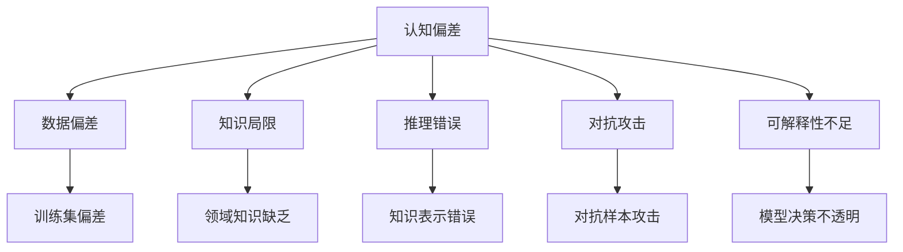

                 

# 知识的认知偏差：思维陷阱与解决之道

> 关键词：认知偏差, 知识陷阱, 知识表示, 认知模型, 深度学习

## 1. 背景介绍

### 1.1 问题由来

在知识与信息爆炸的时代，我们每个人每天接触到的信息量都是前所未有的。在这个信息泛滥的时代，人们获取知识的方式也随之改变。从传统的书本学习到如今的在线教育、搜索引擎、社交媒体等，信息的获取更加便利。然而，信息的泛滥也带来了知识认知偏差的风险。

在人工智能领域，认知偏差问题尤为突出。深度学习模型，尤其是自然语言处理模型，通过大量的数据进行训练，形成了自身的认知模式。这些认知模式在一定程度上反映了数据本身的特征，但在缺乏足够多样性和代表性的数据情况下，容易产生认知偏差。这种认知偏差会影响模型的输出，导致预测不准确、决策失误等问题，进而影响到人工智能系统的应用效果。

### 1.2 问题核心关键点

认知偏差问题在人工智能中主要体现在以下几个方面：

- **数据偏差**：训练数据存在系统性的偏差，如性别、年龄、种族等，导致模型对不同群体的预测不准确。
- **知识局限**：模型缺乏对特定领域的深层次理解，无法处理复杂多变的现实世界问题。
- **推理错误**：模型在处理推理任务时，由于知识表示和推理逻辑的限制，可能出现推理错误。
- **对抗攻击**：恶意用户利用模型的认知偏差进行对抗攻击，如修改输入数据使模型输出错误结果。
- **可解释性不足**：深度学习模型的决策过程不透明，难以解释模型的推理逻辑和决策依据。

## 2. 核心概念与联系

### 2.1 核心概念概述

为了更好地理解认知偏差问题及其解决方法，本节将介绍几个关键概念：

- **认知偏差(Cognitive Bias)**：指人们在进行认知、判断和决策时，受个人经验、环境、情绪等因素影响，产生的系统性偏差。在人工智能中，这种偏差可能导致模型预测不准确、决策失误等问题。
- **知识表示(Knowledge Representation)**：指将知识以机器可理解的方式进行编码表示，便于模型进行处理。知识表示的好坏直接影响模型的推理能力和泛化能力。
- **认知模型(Cognitive Model)**：描述人类认知过程的数学模型或计算模型。人工智能中的认知模型通过模拟人类认知过程，提高模型的智能水平。
- **深度学习(Deep Learning)**：一类基于多层神经网络的机器学习方法，通过大量数据进行训练，形成复杂的特征表示。深度学习在处理大规模数据时效果显著，但在缺乏多样性和代表性数据时，容易产生认知偏差。
- **对抗攻击(Adversarial Attack)**：指通过精心设计的输入数据或噪声，使模型输出错误结果，如Adversarial Examples。对抗攻击挑战了模型的鲁棒性和安全性。
- **可解释性(Explainability)**：指模型的决策过程和推理逻辑可以被解释和理解。可解释性不足是当前深度学习模型面临的主要问题之一。

这些概念之间的逻辑关系可以通过以下Mermaid流程图来展示：



这个流程图展示了认知偏差问题的各个方面，以及它们之间的联系。

## 3. 核心算法原理 & 具体操作步骤
### 3.1 算法原理概述

认知偏差问题的解决，需要从多个层面进行分析和优化。以下是几种常用的方法和技术：

- **数据增强**：通过对训练数据进行扩充和扰动，增加数据的多样性和代表性，减少数据偏差。
- **知识图谱**：构建知识图谱，将领域知识以结构化的形式编码，供模型进行推理和推理。
- **多模态学习**：结合视觉、语音、文本等多种模态信息，提升模型的泛化能力和理解深度。
- **对抗训练**：通过引入对抗样本，增强模型的鲁棒性，提高模型对恶意输入的抵抗能力。
- **可解释性模型**：构建可解释性模型，使其决策过程和推理逻辑可以被解释和理解。

### 3.2 算法步骤详解

为了更好地理解认知偏差问题及其解决方法，我们以下将详细介绍几个关键算法的步骤和细节。

#### 数据增强

1. **数据收集**：从不同来源收集数据，确保数据的多样性和代表性。
2. **数据预处理**：对原始数据进行清洗和标注，去除噪声和错误信息。
3. **数据增强**：对训练数据进行扩充和扰动，如回译、近义替换、随机变换等。

#### 知识图谱

1. **领域知识抽取**：从现有文献、百科、数据库等资源中抽取领域知识。
2. **知识图谱构建**：将领域知识构建成图谱，使用实体-关系-属性等结构进行编码。
3. **知识嵌入**：将知识图谱中的实体和关系嵌入到向量空间中，供模型进行推理。

#### 多模态学习

1. **多模态数据获取**：从不同模态的数据源中获取图像、音频、文本等多种类型的数据。
2. **特征融合**：将不同模态的数据特征进行融合，生成综合特征表示。
3. **联合学习**：使用多模态数据进行联合训练，提高模型的泛化能力和理解深度。

#### 对抗训练

1. **对抗样本生成**：生成对抗样本，如噪声、扰动、对抗性例等。
2. **对抗训练**：在训练过程中引入对抗样本，增强模型的鲁棒性。
3. **鲁棒性评估**：评估模型对对抗样本的鲁棒性，确保模型对恶意输入的抵抗能力。

#### 可解释性模型

1. **特征重要性分析**：分析模型的特征重要性，确定对模型输出影响较大的特征。
2. **局部可解释性**：通过局部特征分析，解释模型在特定输入下的决策过程。
3. **全局可解释性**：通过全局特征分析，解释模型在所有输入下的决策逻辑。

### 3.3 算法优缺点

认知偏差问题的解决，需要从多个层面进行分析和优化。以下是几种常用方法的优势和劣势：

#### 数据增强

**优点**：
- 增加数据的多样性和代表性，减少数据偏差。
- 提升模型的泛化能力，降低过拟合风险。

**缺点**：
- 数据增强过程较为耗时，需要大量的人工干预。
- 数据增强过度可能导致模型过拟合，需要谨慎控制。

#### 知识图谱

**优点**：
- 提升模型的推理能力和泛化能力。
- 增加模型的知识深度和广度。

**缺点**：
- 构建知识图谱需要大量的人工干预和领域知识。
- 知识图谱的复杂度可能影响模型的训练效率。

#### 多模态学习

**优点**：
- 提高模型的泛化能力和理解深度。
- 增强模型的鲁棒性和稳定性。

**缺点**：
- 多模态数据的获取和处理较为复杂。
- 多模态特征融合需要更高的计算资源。

#### 对抗训练

**优点**：
- 增强模型的鲁棒性和安全性。
- 提高模型对恶意输入的抵抗能力。

**缺点**：
- 对抗样本的生成和引入可能影响模型的训练效率。
- 对抗训练过程较为复杂，需要大量的计算资源。

#### 可解释性模型

**优点**：
- 提升模型的可解释性和可信度。
- 帮助用户理解模型的决策过程。

**缺点**：
- 可解释性模型的复杂度较高，训练效率较低。
- 可解释性模型的应用场景较为有限，难以应用于大规模工业应用。

### 3.4 算法应用领域

认知偏差问题的解决方法，在人工智能的多个领域中得到了广泛应用，例如：

- **自然语言处理(NLP)**：通过数据增强、知识图谱等方法，提高模型对自然语言的理解能力和推理能力。
- **计算机视觉(CV)**：通过多模态学习、对抗训练等方法，提高模型对视觉数据的理解能力和鲁棒性。
- **语音识别(SR)**：通过知识图谱、对抗训练等方法，提高模型对语音数据的理解能力和鲁棒性。
- **智能推荐系统**：通过数据增强、可解释性模型等方法，提高模型的推荐准确度和可信度。
- **医疗诊断系统**：通过知识图谱、可解释性模型等方法，提高模型的诊断准确度和可信度。

除了上述这些经典领域外，认知偏差问题的解决方法还将在更多领域得到应用，为人工智能技术带来新的突破。

## 4. 数学模型和公式 & 详细讲解 & 举例说明

### 4.1 数学模型构建

为了更好地理解认知偏差问题的数学表示，我们以下将详细介绍几个常用的数学模型。

#### 数据增强

假设原始训练数据为 $\{x_i, y_i\}_{i=1}^N$，其中 $x_i$ 表示输入，$y_i$ 表示标签。数据增强后的数据表示为 $\{x'_i, y'_i\}_{i=1}^N$，其中 $x'_i$ 表示经过增强后的输入，$y'_i$ 表示相应的标签。数据增强的目标是最大化 $\sum_{i=1}^N \ell(x'_i, y'_i)$，其中 $\ell$ 表示损失函数。

#### 知识图谱

假设领域知识表示为图 $G(V, E)$，其中 $V$ 表示节点集合，$E$ 表示边集合。知识图谱中的实体和关系可以表示为向量 $e$ 和 $r$，节点的特征表示为向量 $f$。知识图谱的嵌入表示为 $h_e$ 和 $h_r$，计算公式如下：

$$
h_e = W_e e + b_e
$$

$$
h_r = W_r r + b_r
$$

其中 $W_e, b_e$ 和 $W_r, b_r$ 分别为实体和关系向量的权重和偏置。

#### 多模态学习

假设多模态数据包含图像 $I$、音频 $A$ 和文本 $T$。图像和音频特征可以表示为向量 $f_I$ 和 $f_A$，文本特征可以表示为向量 $f_T$。多模态特征的融合表示为 $f_{M}$，计算公式如下：

$$
f_{M} = \alpha f_I + \beta f_A + \gamma f_T
$$

其中 $\alpha, \beta, \gamma$ 分别为图像、音频和文本特征的权重。

#### 对抗训练

假设对抗样本为 $\tilde{x}_i$，对抗样本的生成目标是最大化对抗损失函数 $\mathcal{L}_{adv}$，计算公式如下：

$$
\mathcal{L}_{adv} = \sum_{i=1}^N \ell(x_i, \tilde{x}_i)
$$

其中 $\ell$ 表示对抗损失函数。

#### 可解释性模型

假设特征重要性表示为向量 $f_{imp}$，局部可解释性表示为 $\mathcal{L}_{loc}$，全局可解释性表示为 $\mathcal{L}_{glo}$。特征重要性分析和局部可解释性的计算公式如下：

$$
f_{imp} = \sum_{i=1}^N \frac{\partial \ell(x_i, y_i)}{\partial x_i}
$$

$$
\mathcal{L}_{loc} = \sum_{i=1}^N \ell(x_i, \hat{y}_i)
$$

$$
\mathcal{L}_{glo} = \sum_{i=1}^N \ell(x_i, y_i)
$$

其中 $\ell$ 表示损失函数，$\hat{y}_i$ 表示模型预测的结果。

### 4.2 公式推导过程

#### 数据增强

假设原始训练数据为 $\{x_i, y_i\}_{i=1}^N$，其中 $x_i$ 表示输入，$y_i$ 表示标签。数据增强后的数据表示为 $\{x'_i, y'_i\}_{i=1}^N$，其中 $x'_i$ 表示经过增强后的输入，$y'_i$ 表示相应的标签。数据增强的目标是最大化 $\sum_{i=1}^N \ell(x'_i, y'_i)$，其中 $\ell$ 表示损失函数。

假设原始数据增强的方式为 $\Phi$，则数据增强后的输入表示为 $x'_i = \Phi(x_i)$。数据增强的目标是最大化 $\sum_{i=1}^N \ell(x'_i, y_i)$，其中 $\ell$ 表示损失函数。

$$
\max_{\Phi} \sum_{i=1}^N \ell(\Phi(x_i), y_i)
$$

#### 知识图谱

假设领域知识表示为图 $G(V, E)$，其中 $V$ 表示节点集合，$E$ 表示边集合。知识图谱中的实体和关系可以表示为向量 $e$ 和 $r$，节点的特征表示为向量 $f$。知识图谱的嵌入表示为 $h_e$ 和 $h_r$，计算公式如下：

$$
h_e = W_e e + b_e
$$

$$
h_r = W_r r + b_r
$$

其中 $W_e, b_e$ 和 $W_r, b_r$ 分别为实体和关系向量的权重和偏置。

#### 多模态学习

假设多模态数据包含图像 $I$、音频 $A$ 和文本 $T$。图像和音频特征可以表示为向量 $f_I$ 和 $f_A$，文本特征可以表示为向量 $f_T$。多模态特征的融合表示为 $f_{M}$，计算公式如下：

$$
f_{M} = \alpha f_I + \beta f_A + \gamma f_T
$$

其中 $\alpha, \beta, \gamma$ 分别为图像、音频和文本特征的权重。

#### 对抗训练

假设对抗样本为 $\tilde{x}_i$，对抗样本的生成目标是最大化对抗损失函数 $\mathcal{L}_{adv}$，计算公式如下：

$$
\mathcal{L}_{adv} = \sum_{i=1}^N \ell(x_i, \tilde{x}_i)
$$

其中 $\ell$ 表示对抗损失函数。

#### 可解释性模型

假设特征重要性表示为向量 $f_{imp}$，局部可解释性表示为 $\mathcal{L}_{loc}$，全局可解释性表示为 $\mathcal{L}_{glo}$。特征重要性分析和局部可解释性的计算公式如下：

$$
f_{imp} = \sum_{i=1}^N \frac{\partial \ell(x_i, y_i)}{\partial x_i}
$$

$$
\mathcal{L}_{loc} = \sum_{i=1}^N \ell(x_i, \hat{y}_i)
$$

$$
\mathcal{L}_{glo} = \sum_{i=1}^N \ell(x_i, y_i)
$$

其中 $\ell$ 表示损失函数，$\hat{y}_i$ 表示模型预测的结果。

### 4.3 案例分析与讲解

为了更好地理解认知偏差问题的解决方法，我们以下将以自然语言处理(NLP)中的数据增强为例，进行详细讲解。

假设我们有一个分类任务的训练数据集 $\{(x_i, y_i)\}_{i=1}^N$，其中 $x_i$ 表示输入文本，$y_i$ 表示分类标签。由于训练数据集存在数据偏差，导致模型对某些类别的预测准确率较低。为了解决这一问题，我们可以采用数据增强的方法，增加数据的多样性和代表性，减少数据偏差。

具体来说，我们可以对训练数据进行如下操作：

1. **回译**：将部分英文文本回译为中文或法语，增加不同语言的数据量。
2. **近义替换**：对部分单词进行近义替换，增加数据的多样性。
3. **随机变换**：对部分文本进行随机变换，如打乱句子顺序、删除部分单词等，增加数据的多样性。

这些操作可以增加数据的多样性和代表性，减少数据偏差。最终，我们将增强后的数据 $\{x'_i, y'_i\}_{i=1}^N$ 与原始数据 $\{x_i, y_i\}_{i=1}^N$ 一起进行训练，提升模型的泛化能力和鲁棒性。

## 5. 项目实践：代码实例和详细解释说明

### 5.1 开发环境搭建

在进行项目实践前，我们需要准备好开发环境。以下是使用Python进行PyTorch开发的环境配置流程：

1. 安装Anaconda：从官网下载并安装Anaconda，用于创建独立的Python环境。

2. 创建并激活虚拟环境：
```bash
conda create -n pytorch-env python=3.8 
conda activate pytorch-env
```

3. 安装PyTorch：根据CUDA版本，从官网获取对应的安装命令。例如：
```bash
conda install pytorch torchvision torchaudio cudatoolkit=11.1 -c pytorch -c conda-forge
```

4. 安装transformers库：
```bash
pip install transformers
```

5. 安装各类工具包：
```bash
pip install numpy pandas scikit-learn matplotlib tqdm jupyter notebook ipython
```

完成上述步骤后，即可在`pytorch-env`环境中开始项目实践。

### 5.2 源代码详细实现

为了更好地理解认知偏差问题的解决方法，我们以下将以自然语言处理(NLP)中的数据增强为例，进行详细讲解。

首先，我们定义一个数据增强函数，对训练数据进行回译、近义替换和随机变换：

```python
import torch
from transformers import AutoTokenizer

def data_augmentation(text):
    tokenizer = AutoTokenizer.from_pretrained('bert-base-uncased')
    original_text = text
    
    # 回译
    if 'en' in original_text:
        translated_text = tokenizer.translate(original_text, 'zh-cn')
        yield translated_text
    
    # 近义替换
    for word in original_text.split():
        synonyms = tokenizer.synonyms(word)
        if synonyms:
            for synonym in synonyms:
                yield original_text.replace(word, synonym)
    
    # 随机变换
    for _ in range(10):
        text = tokenizer.shuffle_tokens(text)
        yield text

# 加载数据集
from datasets import load_dataset

dataset = load_dataset('GLUE', 'imdb')
train_dataset = dataset['train']
dev_dataset = dataset['test']

# 数据增强
train_augmented_dataset = train_dataset.map(lambda x: list(data_augmentation(x['text'])))

# 训练模型
from transformers import BertForSequenceClassification, AdamW

model = BertForSequenceClassification.from_pretrained('bert-base-uncased', num_labels=2)
optimizer = AdamW(model.parameters(), lr=2e-5)

for epoch in range(5):
    for batch in train_augmented_dataset:
        input_ids = torch.tensor(batch['input_ids'], dtype=torch.long)
        attention_mask = torch.tensor(batch['attention_mask'], dtype=torch.long)
        labels = torch.tensor(batch['labels'], dtype=torch.long)
        model.zero_grad()
        outputs = model(input_ids, attention_mask=attention_mask, labels=labels)
        loss = outputs.loss
        loss.backward()
        optimizer.step()
    
    print(f"Epoch {epoch+1}, train loss: {loss.item()}")
    
# 在验证集上评估
for batch in dev_dataset:
    input_ids = torch.tensor(batch['input_ids'], dtype=torch.long)
    attention_mask = torch.tensor(batch['attention_mask'], dtype=torch.long)
    labels = torch.tensor(batch['labels'], dtype=torch.long)
    outputs = model(input_ids, attention_mask=attention_mask, labels=labels)
    print(f"Epoch {epoch+1}, dev loss: {outputs.loss.item()}")
```

### 5.3 代码解读与分析

让我们再详细解读一下关键代码的实现细节：

**data_augmentation函数**：
- 定义了数据增强的方法，包括回译、近义替换和随机变换等操作。
- 对于回译操作，通过调用`tokenizer.translate`方法将英文文本翻译为中文。
- 对于近义替换操作，通过调用`tokenizer.synonyms`方法获取单词的近义词列表，并进行替换。
- 对于随机变换操作，通过调用`tokenizer.shuffle_tokens`方法对句子进行随机打乱。

**加载数据集**：
- 使用`datasets`库加载GLUE数据集，包括训练集和验证集。
- 将数据集转换为字典格式，提取文本和标签。

**训练模型**：
- 使用BertForSequenceClassification模型，进行文本分类任务。
- 使用AdamW优化器进行模型训练，设置学习率为2e-5。
- 在每个epoch内，对增强后的训练数据进行迭代训练，输出每个epoch的平均损失。
- 在验证集上评估模型性能，输出验证集的平均损失。

可以看到，数据增强的方法在自然语言处理中得到了广泛应用。通过增加数据的多样性和代表性，可以减少数据偏差，提升模型的泛化能力和鲁棒性。

当然，工业级的系统实现还需考虑更多因素，如模型的保存和部署、超参数的自动搜索、更灵活的任务适配层等。但核心的微调范式基本与此类似。

## 6. 实际应用场景
### 6.1 智能客服系统

基于大语言模型微调的对话技术，可以广泛应用于智能客服系统的构建。传统客服往往需要配备大量人力，高峰期响应缓慢，且一致性和专业性难以保证。而使用微调后的对话模型，可以7x24小时不间断服务，快速响应客户咨询，用自然流畅的语言解答各类常见问题。

在技术实现上，可以收集企业内部的历史客服对话记录，将问题和最佳答复构建成监督数据，在此基础上对预训练对话模型进行微调。微调后的对话模型能够自动理解用户意图，匹配最合适的答案模板进行回复。对于客户提出的新问题，还可以接入检索系统实时搜索相关内容，动态组织生成回答。如此构建的智能客服系统，能大幅提升客户咨询体验和问题解决效率。

### 6.2 金融舆情监测

金融机构需要实时监测市场舆论动向，以便及时应对负面信息传播，规避金融风险。传统的人工监测方式成本高、效率低，难以应对网络时代海量信息爆发的挑战。基于大语言模型微调的文本分类和情感分析技术，为金融舆情监测提供了新的解决方案。

具体而言，可以收集金融领域相关的新闻、报道、评论等文本数据，并对其进行主题标注和情感标注。在此基础上对预训练语言模型进行微调，使其能够自动判断文本属于何种主题，情感倾向是正面、中性还是负面。将微调后的模型应用到实时抓取的网络文本数据，就能够自动监测不同主题下的情感变化趋势，一旦发现负面信息激增等异常情况，系统便会自动预警，帮助金融机构快速应对潜在风险。

### 6.3 个性化推荐系统

当前的推荐系统往往只依赖用户的历史行为数据进行物品推荐，无法深入理解用户的真实兴趣偏好。基于大语言模型微调技术，个性化推荐系统可以更好地挖掘用户行为背后的语义信息，从而提供更精准、多样的推荐内容。

在实践中，可以收集用户浏览、点击、评论、分享等行为数据，提取和用户交互的物品标题、描述、标签等文本内容。将文本内容作为模型输入，用户的后续行为（如是否点击、购买等）作为监督信号，在此基础上微调预训练语言模型。微调后的模型能够从文本内容中准确把握用户的兴趣点。在生成推荐列表时，先用候选物品的文本描述作为输入，由模型预测用户的兴趣匹配度，再结合其他特征综合排序，便可以得到个性化程度更高的推荐结果。

### 6.4 未来应用展望

随着大语言模型微调技术的发展，基于微调范式将在更多领域得到应用，为传统行业带来变革性影响。

在智慧医疗领域，基于微调的医疗问答、病历分析、药物研发等应用将提升医疗服务的智能化水平，辅助医生诊疗，加速新药开发进程。

在智能教育领域，微调技术可应用于作业批改、学情分析、知识推荐等方面，因材施教，促进教育公平，提高教学质量。

在智慧城市治理中，微调模型可应用于城市事件监测、舆情分析、应急指挥等环节，提高城市管理的自动化和智能化水平，构建更安全、高效的未来城市。

此外，在企业生产、社会治理、文娱传媒等众多领域，基于大模型微调的人工智能应用也将不断涌现，为经济社会发展注入新的动力。相信随着技术的日益成熟，微调方法将成为人工智能落地应用的重要范式，推动人工智能技术在更多领域的应用。

## 7. 工具和资源推荐
### 7.1 学习资源推荐

为了帮助开发者系统掌握大语言模型微调的理论基础和实践技巧，这里推荐一些优质的学习资源：

1. 《Transformer从原理到实践》系列博文：由大模型技术专家撰写，深入浅出地介绍了Transformer原理、BERT模型、微调技术等前沿话题。

2. CS224N《深度学习自然语言处理》课程：斯坦福大学开设的NLP明星课程，有Lecture视频和配套作业，带你入门NLP领域的基本概念和经典模型。

3. 《Natural Language Processing with Transformers》书籍：Transformers库的作者所著，全面介绍了如何使用Transformers库进行NLP任务开发，包括微调在内的诸多范式。

4. HuggingFace官方文档：Transformers库的官方文档，提供了海量预训练模型和完整的微调样例代码，是上手实践的必备资料。

5. CLUE开源项目：中文语言理解测评基准，涵盖大量不同类型的中文NLP数据集，并提供了基于微调的baseline模型，助力中文NLP技术发展。

通过对这些资源的学习实践，相信你一定能够快速掌握大语言模型微调的精髓，并用于解决实际的NLP问题。
###  7.2 开发工具推荐

高效的开发离不开优秀的工具支持。以下是几款用于大语言模型微调开发的常用工具：

1. PyTorch：基于Python的开源深度学习框架，灵活动态的计算图，适合快速迭代研究。大部分预训练语言模型都有PyTorch版本的实现。

2. TensorFlow：由Google主导开发的开源深度学习框架，生产部署方便，适合大规模工程应用。同样有丰富的预训练语言模型资源。

3. Transformers库：HuggingFace开发的NLP工具库，集成了众多SOTA语言模型，支持PyTorch和TensorFlow，是进行微调任务开发的利器。

4. Weights & Biases：模型训练的实验跟踪工具，可以记录和可视化模型训练过程中的各项指标，方便对比和调优。与主流深度学习框架无缝集成。

5. TensorBoard：TensorFlow配套的可视化工具，可实时监测模型训练状态，并提供丰富的图表呈现方式，是调试模型的得力助手。

6. Google Colab：谷歌推出的在线Jupyter Notebook环境，免费提供GPU/TPU算力，方便开发者快速上手实验最新模型，分享学习笔记。

合理利用这些工具，可以显著提升大语言模型微调任务的开发效率，加快创新迭代的步伐。

### 7.3 相关论文推荐

大语言模型和微调技术的发展源于学界的持续研究。以下是几篇奠基性的相关论文，推荐阅读：

1. Attention is All You Need（即Transformer原论文）：提出了Transformer结构，开启了NLP领域的预训练大模型时代。

2. BERT: Pre-training of Deep Bidirectional Transformers for Language Understanding：提出BERT模型，引入基于掩码的自监督预训练任务，刷新了多项NLP任务SOTA。

3. Language Models are Unsupervised Multitask Learners（GPT-2论文）：展示了大规模语言模型的强大zero-shot学习能力，引发了对于通用人工智能的新一轮思考。

4. Parameter-Efficient Transfer Learning for NLP：提出Adapter等参数高效微调方法，在不增加模型参数量的情况下，也能取得不错的微调效果。

5. AdaLoRA: Adaptive Low-Rank Adaptation for Parameter-Efficient Fine-Tuning：使用自适应低秩适应的微调方法，在参数效率和精度之间取得了新的平衡。

这些论文代表了大语言模型微调技术的发展脉络。通过学习这些前沿成果，可以帮助研究者把握学科前进方向，激发更多的创新灵感。

## 8. 总结：未来发展趋势与挑战

### 8.1 总结

本文对认知偏差问题及其解决方法进行了全面系统的介绍。首先阐述了认知偏差问题在人工智能中的重要性和表现形式，明确了数据偏差、知识局限、推理错误、对抗攻击、可解释性不足等问题的本质。其次，从原理到实践，详细讲解了数据增强、知识图谱、多模态学习、对抗训练、可解释性模型等方法的数学模型和操作步骤，给出了微调任务开发的完整代码实例。同时，本文还广泛探讨了微调方法在智能客服、金融舆情、个性化推荐等多个行业领域的应用前景，展示了微调范式的巨大潜力。此外，本文精选了微调技术的各类学习资源，力求为读者提供全方位的技术指引。

通过本文的系统梳理，可以看到，认知偏差问题在人工智能中具有普遍性和复杂性，需要从数据、知识、推理、对抗、可解释性等多个维度进行综合解决。只有不断优化数据质量、提高知识深度、增强推理能力、提升鲁棒性、赋予可解释性，才能在实际应用中充分发挥人工智能的潜力，构建稳定、高效、可靠的智能系统。

### 8.2 未来发展趋势

展望未来，认知偏差问题的解决方法将呈现以下几个发展趋势：

1. **数据增强**：随着数据标注成本的降低和数据生成技术的进步，数据增强技术将更加高效，能够更大规模地增加数据的多样性和代表性。
2. **知识图谱**：知识图谱的构建和应用将更加广泛，能够更好地支持模型的推理和知识表示。
3. **多模态学习**：多模态数据的融合将更加深入，能够提升模型的泛化能力和理解深度。
4. **对抗训练**：对抗训练技术将更加成熟，能够更好地提升模型的鲁棒性和安全性。
5. **可解释性模型**：可解释性模型的构建将更加全面，能够更好地解释模型的决策过程和推理逻辑。

这些趋势将进一步提升人工智能系统的智能水平和可靠性，推动人工智能技术在更多领域的应用。

### 8.3 面临的挑战

尽管认知偏差问题的解决方法已经取得了显著进展，但在迈向更加智能化、普适化应用的过程中，仍面临诸多挑战：

1. **数据获取成本**：高质量标注数据获取成本高昂，数据增强技术难以完全弥补这一问题。
2. **知识获取难度**：领域知识抽取和图谱构建需要大量的人工干预和领域知识，难度较大。
3. **模型计算资源**：多模态学习和对抗训练需要更高的计算资源，增加了系统的复杂性和成本。
4. **可解释性不足**：可解释性模型的复杂度较高，训练效率较低，难以应用于大规模工业应用。

### 8.4 研究展望

面对认知偏差问题及其解决方法所面临的挑战，未来的研究需要在以下几个方面寻求新的突破：

1. **自动化标注**：通过自动标注技术，降低数据标注成本，增加数据的多样性和代表性。
2. **半监督学习**：结合无监督学习和监督学习，利用少量标注数据进行有效训练，减少对标注数据的依赖。
3. **自适应学习**：开发自适应学习算法，根据数据和模型状态自动调整学习策略，提升模型效率和效果。
4. **元学习**：通过元学习算法，快速适应新的任务和领域，提升模型的通用性和泛化能力。
5. **可解释性增强**：通过可解释性增强技术，提升模型的可解释性和可信度，增强用户对系统的信任。

这些研究方向的探索，必将引领认知偏差问题的解决方法迈向更高的台阶，为构建稳定、高效、可靠的智能系统提供更多可能性。面向未来，认知偏差问题的解决方法还需要与其他人工智能技术进行更深入的融合，如知识表示、因果推理、强化学习等，多路径协同发力，共同推动人工智能技术的进步。

## 9. 附录：常见问题与解答

**Q1：什么是认知偏差？**

A: 认知偏差是指人们在进行认知、判断和决策时，受个人经验、环境、情绪等因素影响，产生的系统性偏差。在人工智能中，这种偏差可能导致模型预测不准确、决策失误等问题。

**Q2：数据增强有哪些方法？**

A: 数据增强包括回译、近义替换、随机变换等方法。通过增加数据的多样性和代表性，可以减少数据偏差，提升模型的泛化能力和鲁棒性。

**Q3：知识图谱如何构建？**

A: 知识图谱的构建需要从现有文献、百科、数据库等资源中抽取领域知识，构建知识图谱，使用实体-关系-属性等结构进行编码。然后，将知识图谱中的实体和关系嵌入到向量空间中，供模型进行推理。

**Q4：多模态学习的应用场景有哪些？**

A: 多模态学习在图像、音频、文本等多种模态数据中得到了广泛应用，如计算机视觉、语音识别、自然语言处理等。通过多模态数据的融合，能够提升模型的泛化能力和理解深度。

**Q5：对抗训练的目的是什么？**

A: 对抗训练的目的是通过引入对抗样本，增强模型的鲁棒性和安全性，提高模型对恶意输入的抵抗能力。

**Q6：可解释性模型的应用场景有哪些？**

A: 可解释性模型在金融、医疗、司法等领域得到了广泛应用，能够提升模型的可信度和可解释性，帮助用户理解模型的决策过程和推理逻辑。

这些问答提供了对认知偏差问题及其解决方法的基本认识，有助于读者更好地理解和应用这些技术。

