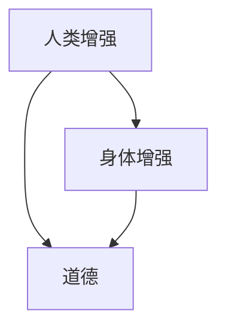

                 

**人工智能 (AI)**, **人类增强 (Human Augmentation)**, **身体增强 (Physical Enhancement)**, **道德 (Ethics)**, **未来 (Future)**, **发展机遇 (Opportunities)**, **预测 (Predictions)**

## 1. 背景介绍

在人工智能飞速发展的今天，我们正处于一个前所未有的时代，人类与技术的交互日益密切。其中，人类增强技术引人注目，它旨在通过技术手段增强人类的能力，从而改善人类的生活质量和工作效率。本文将探讨人类增强技术的道德考虑，以及身体增强领域的未来发展机遇预测。

## 2. 核心概念与联系

### 2.1 核心概念

- **人类增强 (Human Augmentation)**: 通过技术手段增强人类的能力，包括认知、物理和感官能力。
- **身体增强 (Physical Enhancement)**: 人类增强的一个分支，专注于增强人类的物理能力。
- **道德 (Ethics)**: 行为准则，指导我们在人类增强领域的决策和行动。

### 2.2 核心概念联系

人类增强和道德是密不可分的。道德考虑是指导人类增强技术发展的指南针，确保技术的应用不会对人类造成伤害，而是造福人类。身体增强是人类增强的一个重要分支，它与道德密切相关，因为它涉及对人体的改造。



## 3. 核心算法原理 & 具体操作步骤

### 3.1 算法原理概述

在身体增强领域，算法原理主要体现在生物反馈系统、神经接口和机器人技术等领域。这些算法旨在增强人体的能力，改善人体的功能。

### 3.2 算法步骤详解

1. **生物反馈系统 (Biofeedback)**: 通过传感器监测人体生理指标，并将信息反馈给用户，帮助用户学习控制自己的生理状态。
2. **神经接口 (Neural Interfaces)**: 通过电子设备与人体神经系统连接，增强或恢复人体的感官和运动能力。
3. **机器人技术 (Robotics)**: 设计和制造机器人，协助或替代人体完成任务，增强人体的物理能力。

### 3.3 算法优缺点

- **优点**: 增强人体能力，改善生活质量，恢复或替代丧失的功能。
- **缺点**: 道德风险，技术成本高，可能会导致对技术的过度依赖。

### 3.4 算法应用领域

- **医疗保健**: 增强医生的诊断能力，改善病人的康复过程。
- **工业**: 增强工人的物理能力，改善工作环境。
- **娱乐**: 提供新颖的体验，增强用户的感官能力。

## 4. 数学模型和公式 & 详细讲解 & 举例说明

### 4.1 数学模型构建

在身体增强领域，数学模型主要用于建模人体生理系统，设计控制算法，优化机器人运动等。例如，在神经接口领域，数学模型用于建模神经信号，设计解码算法。

### 4.2 公式推导过程

假设我们要设计一个简单的生物反馈系统，监测心率。我们可以使用以下公式计算心率：

$$HR = \frac{60 \times 60}{RR}$$

其中，$HR$是心率（次/分钟），$RR$是心率间期（秒）。心率间期可以通过传感器测量得到。

### 4.3 案例分析与讲解

例如，在机器人技术领域，我们可以使用动力学模型来建模机器人的运动。动力学模型描述了机器人系统的运动学和动力学特性。通过优化动力学模型，我们可以设计更高效的机器人控制算法。

## 5. 项目实践：代码实例和详细解释说明

### 5.1 开发环境搭建

在开始项目实践之前，我们需要搭建开发环境。对于生物反馈系统，我们需要传感器、数据采集设备和开发平台。对于神经接口，我们需要神经信号采集设备和开发平台。对于机器人技术，我们需要机器人硬件和开发平台。

### 5.2 源代码详细实现

以下是一个简单的生物反馈系统的Python代码实现：

```python
import time
import RPi.GPIO as GPIO

# 设置GPIO模式
GPIO.setmode(GPIO.BCM)

# 设置传感器引脚
sensor_pin = 4

# 设置GPIO引脚模式为输入
GPIO.setup(sensor_pin, GPIO.IN, pull_up_down=GPIO.PUD_UP)

try:
    while True:
        # 读取传感器数据
        sensor_data = GPIO.input(sensor_pin)

        # 计算心率
        if sensor_data == False:
            timestamp = time.time()
            if (timestamp - last_timestamp)!= 0:
                interval = timestamp - last_timestamp
                heart_rate = 60 / interval
                print("Heart rate: {} bpm".format(heart_rate))
            last_timestamp = timestamp

except KeyboardInterrupt:
    # 关闭GPIO
    GPIO.cleanup()
```

### 5.3 代码解读与分析

这段代码使用Raspberry Pi的GPIO库读取心率传感器数据，计算心率，并打印心率值。它使用while循环不断读取传感器数据，当传感器数据为False时，计算心率间期，并使用公式计算心率。

### 5.4 运行结果展示

当运行这段代码时，它会打印心率值。例如：

```
Heart rate: 72.0 bpm
Heart rate: 71.0 bpm
Heart rate: 72.0 bpm
```

## 6. 实际应用场景

### 6.1 当前应用

当前，身体增强技术已经在医疗保健、工业和娱乐领域得到应用。例如，神经接口技术用于恢复或增强残疾人士的感官和运动能力。机器人技术用于协助或替代工人完成危险或繁重的任务。生物反馈系统用于帮助用户控制自己的生理状态，改善健康。

### 6.2 未来应用展望

未来，身体增强技术有望在更多领域得到应用。例如，在军事领域，士兵可能会使用神经接口技术增强自己的感官能力，提高作战能力。在太空领域，宇航员可能会使用机器人技术增强自己的物理能力，改善太空工作环境。在娱乐领域，用户可能会使用生物反馈系统增强自己的感官能力，提供更丰富的体验。

## 7. 工具和资源推荐

### 7.1 学习资源推荐

- **书籍**: "Human + Machine: Reimagining Work in the Age of AI" by Paul R. Daugherty and H. James Wilson
- **在线课程**: Coursera的"Neural Engineering for Brain-Computer Interfaces"课程
- **学术期刊**: IEEE Transactions on Neural Systems and Rehabilitation Engineering

### 7.2 开发工具推荐

- **开发平台**: Raspberry Pi
- **传感器**: MAX30100心率传感器
- **神经信号采集设备**: OpenBCI神经信号采集设备
- **机器人硬件**: Arduino机器人平台

### 7.3 相关论文推荐

- "A Brain-Computer Interface Using Noninvasive Electroencephalography for Communication and Control" by John P. Donoghue et al.
- "The Future of Human-Machine Interfaces: A Survey" by M. B. Gordon and J. C. L. Ogden

## 8. 总结：未来发展趋势与挑战

### 8.1 研究成果总结

本文总结了人类增强技术的道德考虑，以及身体增强领域的未来发展机遇预测。我们讨论了核心概念、算法原理、数学模型、项目实践、实际应用场景、工具和资源推荐。

### 8.2 未来发展趋势

未来，人类增强技术有望在更多领域得到应用，为人类带来更大的益处。我们预测，道德考虑将成为人类增强技术发展的关键因素，确保技术的应用不会对人类造成伤害。

### 8.3 面临的挑战

然而，人类增强技术也面临着挑战。技术成本高，可能会导致对技术的过度依赖，道德风险等。

### 8.4 研究展望

未来的研究应该关注道德考虑，技术成本控制，技术与人类关系等问题。我们需要平衡技术发展与道德考虑，确保技术造福人类。

## 9. 附录：常见问题与解答

**Q: 人类增强技术是否会导致人类的异化？**

**A:** 这是一个道德风险。我们需要平衡技术发展与道德考虑，确保技术造福人类，而不是导致人类的异化。

**Q: 身体增强技术是否会导致技术依赖？**

**A:** 是的，技术依赖是一个挑战。我们需要控制技术成本，确保技术不会导致过度依赖。

**Q: 身体增强技术是否会导致不平等？**

**A:** 是的，技术成本高可能会导致不平等。我们需要平衡技术发展与道德考虑，确保技术造福人类，而不是导致不平等。

## 作者：禅与计算机程序设计艺术 / Zen and the Art of Computer Programming

