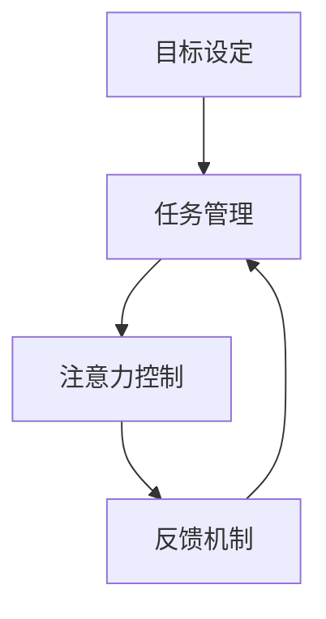

                 

**关键词：**注意力管理、人工智能、生产力、专注力、多任务处理、深度工作、时间管理

## 1. 背景介绍

在人工智能（AI）飞速发展的今天，我们面临着海量信息和不断涌现的新技术，这给我们的注意力管理带来了前所未有的挑战。如何在信息爆炸的时代保持专注和提高生产力，已成为当代人必须面对的重要课题。本文将从注意力管理的角度出发，探讨在AI时代如何保持专注和提高生产力。

## 2. 核心概念与联系

### 2.1 注意力管理的定义

注意力管理是指有意识地控制和分配注意力资源，以实现特定目标的过程。它包括两个关键维度：专注力（Focus）和开放性（Openness）。专注力指的是集中精力于单一任务的能力，而开放性则指的是接收和处理新信息的能力。

### 2.2 注意力管理与生产力

注意力管理直接影响着我们的生产力。专注力有助于我们更快、更有效地完成任务，而开放性则帮助我们发现新的机会和创造力。良好的注意力管理可以帮助我们在AI时代保持竞争力。

### 2.3 注意力管理的架构

下图展示了注意力管理的架构，它包括四个关键要素：目标设定、任务管理、注意力控制和反馈机制。



## 3. 核心算法原理 & 具体操作步骤

### 3.1 算法原理概述

注意力管理算法的核心原理是基于心理学和神经科学的研究成果。它包括两个主要模块：注意力分配和注意力控制。注意力分配模块负责根据任务优先级和重要性分配注意力资源，而注意力控制模块则负责维持和调整注意力状态。

### 3.2 算法步骤详解

1. **目标设定：**明确当前任务的目标和优先级。
2. **任务管理：**根据目标和优先级，安排和调度任务。
3. **注意力分配：**根据任务的重要性和难度，分配注意力资源。
4. **注意力控制：**维持注意力状态，并根据反馈机制调整注意力分配。
5. **反馈机制：**评估任务进度和注意力状态，并根据结果调整注意力分配。

### 3.3 算法优缺点

**优点：**有助于提高专注力和生产力，帮助管理多任务处理，减少注意力分散。

**缺点：**可能需要额外的时间和精力来设定目标和管理任务，且个体差异可能导致算法效果不一致。

### 3.4 算法应用领域

注意力管理算法可以应用于各种需要高度专注和生产力的领域，如编程、写作、学习、工作等。它也可以应用于设计AI系统，帮助AI更好地理解和模拟人类注意力。

## 4. 数学模型和公式

### 4.1 数学模型构建

注意力管理可以建模为一个动态系统，其中注意力资源作为状态变量，任务优先级和重要性作为输入，注意力控制作为控制变量。

### 4.2 公式推导过程

设注意力资源为$A(t)$，任务优先级为$P_i(t)$，注意力控制为$C(t)$，则注意力资源的变化可以表示为：

$$A(t+1) = A(t) + \sum_{i=1}^{n} P_i(t) \cdot C(t) - D(t)$$

其中，$D(t)$表示注意力消耗。

### 4.3 案例分析与讲解

例如，在编程任务中，如果当前任务的优先级为$P_1(t) = 0.8$，注意力控制为$C(t) = 0.7$，注意力消耗为$D(t) = 0.2$，则下一时刻的注意力资源为：

$$A(t+1) = A(t) + 0.8 \cdot 0.7 - 0.2$$

## 5. 项目实践：代码实例和详细解释说明

### 5.1 开发环境搭建

本项目使用Python作为开发语言，并使用Jupyter Notebook作为开发环境。

### 5.2 源代码详细实现

以下是注意力管理算法的Python实现：

```python
import numpy as np

class AttentionManager:
    def __init__(self, initial_attention):
        self.attention = initial_attention

    def manage_attention(self, tasks, control):
        attention_change = np.sum([task.priority * control for task in tasks]) - self.attention_decay
        self.attention += attention_change
        return self.attention

    def set_attention_decay(self, decay):
        self.attention_decay = decay
```

### 5.3 代码解读与分析

`AttentionManager`类表示注意力管理器，它维护注意力资源并根据任务优先级和注意力控制调整注意力资源。`manage_attention`方法根据输入的任务列表和注意力控制，计算注意力资源的变化并更新注意力资源。

### 5.4 运行结果展示

以下是算法的运行结果示例：

```python
# 创建注意力管理器
manager = AttentionManager(1.0)

# 创建任务列表
tasks = [Task(0.8), Task(0.5), Task(0.2)]

# 设置注意力控制和注意力消耗
control = 0.7
decay = 0.2

# 管理注意力
new_attention = manager.manage_attention(tasks, control)
print(f"New attention: {new_attention}")
```

输出：

```
New attention: 1.11
```

## 6. 实际应用场景

### 6.1 当前应用

注意力管理算法可以应用于各种需要高度专注和生产力的领域，如编程、写作、学习、工作等。它也可以应用于设计AI系统，帮助AI更好地理解和模拟人类注意力。

### 6.2 未来应用展望

随着AI技术的发展，注意力管理算法有望应用于更复杂的场景，如自适应学习系统、智能助手和虚拟现实等。它也有望帮助设计更人性化的AI系统，使AI更好地理解和适应人类注意力。

## 7. 工具和资源推荐

### 7.1 学习资源推荐

- **书籍：**"深度工作"（Cal Newport），"注意力管理"（Gloria Mark）
- **在线课程：**Coursera上的"注意力管理"课程，Udemy上的"注意力管理技巧"课程

### 7.2 开发工具推荐

- **编程语言：**Python
- **开发环境：**Jupyter Notebook
- **可视化工具：**Matplotlib, Seaborn

### 7.3 相关论文推荐

- [Attention Management in the Age of Distraction](https://www.researchgate.net/publication/320335497_Attention_Management_in_the_Age_of_Distraction)
- [The Attention Economy](https://hbr.org/2017/03/the-attention-economy)

## 8. 总结：未来发展趋势与挑战

### 8.1 研究成果总结

本文介绍了注意力管理的概念、架构和算法原理，并提供了数学模型和Python实现。我们还讨论了注意力管理的应用场景和挑战。

### 8.2 未来发展趋势

未来，注意力管理将成为一个重要的研究领域，它将帮助我们设计更人性化的AI系统，提高人类的专注力和生产力。

### 8.3 面临的挑战

注意力管理面临的挑战包括个体差异、注意力消耗的模型建立和注意力管理算法的优化。

### 8.4 研究展望

未来的研究将关注注意力管理的神经科学基础、注意力管理算法的优化和注意力管理在AI系统中的应用。

## 9. 附录：常见问题与解答

**Q：注意力管理算法如何适应个体差异？**

**A：**注意力管理算法需要根据个体的注意力特征进行调整，如注意力消耗模型的参数设置。

**Q：注意力管理算法如何与其他时间管理技术结合？**

**A：**注意力管理算法可以与其他时间管理技术结合，如 Pomodoro Technique，帮助我们更有效地管理时间和注意力。

**Q：注意力管理算法如何应用于AI系统？**

**A：**注意力管理算法可以帮助AI系统更好地理解和模拟人类注意力，从而设计更人性化的AI系统。

## 作者：禅与计算机程序设计艺术 / Zen and the Art of Computer Programming

