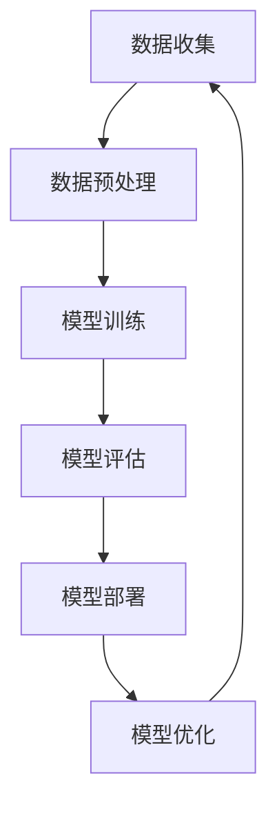

                 

**人工智能的未来发展挑挑战**

## 1. 背景介绍

人工智能（AI）自诞生以来，已从一项学术实验发展为商业和技术领域的关键驱动因素。然而，随着AI的不断发展，我们也面临着一系列挑战。本文将从世界级人工智能专家Andrej Karpathy的视角出发，探讨人工智能未来发展的挑战。

## 2. 核心概念与联系

### 2.1 关键概念

- **深度学习（Deep Learning）**：一种机器学习方法，模仿人脑神经网络的结构和功能。
- **计算机视觉（Computer Vision）**：使计算机能够理解和解释视觉信息的科学。
- **自然语言处理（Natural Language Processing）**：计算机处理和理解人类语言的领域。
- **强化学习（Reinforcement Learning）**：一种机器学习方法，智能体通过与环境交互学习。

### 2.2 核心架构

下图展示了AI系统的核心架构，从数据收集到模型训练，再到部署和优化。



## 3. 核心算法原理 & 具体操作步骤

### 3.1 算法原理概述

本节将简要介绍几种常用的AI算法。

- **线性回归（Linear Regression）**：一种简单的监督学习算法，用于预测连续值。
- **逻辑回归（Logistic Regression）**：一种监督学习算法，用于预测离散值。
- **决策树（Decision Tree）**：一种监督学习算法，用于分类和回归任务。
- **支持向量机（Support Vector Machine）**：一种监督学习算法，用于分类和回归任务。
- **神经网络（Neural Network）**：一种监督学习算法，模仿人脑神经网络的结构和功能。

### 3.2 算法步骤详解

以线性回归为例，其步骤如下：

1. 数据收集：收集包含特征和目标变量的数据。
2. 数据预处理：清洗数据，处理缺失值，进行特征缩放。
3. 模型训练：使用梯度下降算法训练模型。
4. 模型评估：使用交叉验证评估模型性能。
5. 模型部署：将模型部署到生产环境。
6. 模型优化：根据反馈优化模型。

### 3.3 算法优缺点

每种算法都有其优缺点。例如，线性回归简单易懂，但只适用于线性可分的数据。决策树易于理解，但易于过拟合。神经网络可以处理复杂的非线性关系，但需要大量数据和计算资源。

### 3.4 算法应用领域

AI算法在各个领域都有广泛应用，包括计算机视觉（物体检测、图像分类）、自然语言处理（文本分类、机器翻译）、强化学习（游戏、无人驾驶）、推荐系统（个性化推荐）、医疗保健（疾病诊断、药物发现）等。

## 4. 数学模型和公式 & 详细讲解 & 举例说明

### 4.1 数学模型构建

线性回归的数学模型为：

$$y = wx + b$$

其中，$y$是目标变量，$x$是特征向量，$w$是权重，$b$是偏置项。

### 4.2 公式推导过程

线性回归的目标是最小化误差平方和：

$$J(w, b) = \frac{1}{2} \sum_{i=1}^{n} (y_i - (wx_i + b))^2$$

使用梯度下降算法，可以更新权重和偏置项：

$$w := w - \eta \frac{\partial J}{\partial w}$$

$$b := b - \eta \frac{\partial J}{\partial b}$$

其中，$\eta$是学习率。

### 4.3 案例分析与讲解

例如，使用线性回归预测房价。特征向量$x$包含房屋的面积、卧室数量、浴室数量等。目标变量$y$是房屋的价格。通过训练模型，我们可以预测给定特征向量的房屋价格。

## 5. 项目实践：代码实例和详细解释说明

### 5.1 开发环境搭建

本项目使用Python和Scikit-learn库。首先，安装必要的库：

```bash
pip install numpy pandas scikit-learn
```

### 5.2 源代码详细实现

以下是线性回归的简单实现：

```python
import numpy as np
import pandas as pd
from sklearn.model_selection import train_test_split
from sklearn.linear_model import LinearRegression

# 加载数据
data = pd.read_csv('housing.csv')
X = data.drop('median_house_value', axis=1)
y = data['median_house_value']

# 数据预处理
#...

# 训练模型
X_train, X_test, y_train, y_test = train_test_split(X, y, test_size=0.2, random_state=42)
model = LinearRegression()
model.fit(X_train, y_train)

# 模型评估
#...
```

### 5.3 代码解读与分析

代码首先加载数据，然后进行数据预处理（未显示）。之后，使用训练集训练模型，并使用测试集评估模型。

### 5.4 运行结果展示

模型的评估指标（如均方误差、R平方等）将显示模型的性能。

## 6. 实际应用场景

AI在各个领域都有广泛应用。例如，在医疗保健领域，AI可以帮助医生诊断疾病，发现药物，改善患者护理。在金融领域，AI可以用于风险评估，欺诈检测，个性化推荐。在交通领域，AI可以用于无人驾驶，交通预测，路径规划。

### 6.1 未来应用展望

未来，AI将继续渗透到各个领域，包括教育、娱乐、制造等。AI也将继续发展，从当前的监督学习和无监督学习发展到更强大的自监督学习和多模式学习。

## 7. 工具和资源推荐

### 7.1 学习资源推荐

- **书籍**："Hands-On Machine Learning with Scikit-Learn, Keras, and TensorFlow" by Aurélien Géron
- **在线课程**：Coursera的"Machine Learning"课程，由Stanford大学的Andrew Ng讲授。

### 7.2 开发工具推荐

- **编程语言**：Python
- **库**：Scikit-learn, TensorFlow, PyTorch
- **开发环境**：Jupyter Notebook, Google Colab

### 7.3 相关论文推荐

- "A Survey of Machine Learning in AI Planning" by Matthew E. Taylor and Peter J. Stuckey
- "Deep Learning" by Ian Goodfellow, Yoshua Bengio, and Aaron Courville

## 8. 总结：未来发展趋势与挑战

### 8.1 研究成果总结

本文介绍了AI的核心概念、算法原理、数学模型，并提供了项目实践的代码实例。

### 8.2 未来发展趋势

未来，AI将继续发展，从当前的监督学习和无监督学习发展到更强大的自监督学习和多模式学习。AI也将继续渗透到各个领域，包括教育、娱乐、制造等。

### 8.3 面临的挑战

然而，AI的发展也面临着挑战，包括数据隐私、算法偏见、计算资源、解释性AI等。

### 8.4 研究展望

未来的研究将关注这些挑战，并开发新的AI方法和技术，以更好地解决现实世界的问题。

## 9. 附录：常见问题与解答

**Q：什么是AI？**

**A**：人工智能（AI）是指模拟人类智能的计算机系统，包括学习、推理、问题解决等。

**Q：AI有哪些应用领域？**

**A**：AI有广泛的应用领域，包括计算机视觉、自然语言处理、强化学习、推荐系统、医疗保健等。

**Q：AI的未来发展趋势是什么？**

**A**：未来，AI将继续发展，从当前的监督学习和无监督学习发展到更强大的自监督学习和多模式学习。AI也将继续渗透到各个领域。

**作者：禅与计算机程序设计艺术 / Zen and the Art of Computer Programming**

