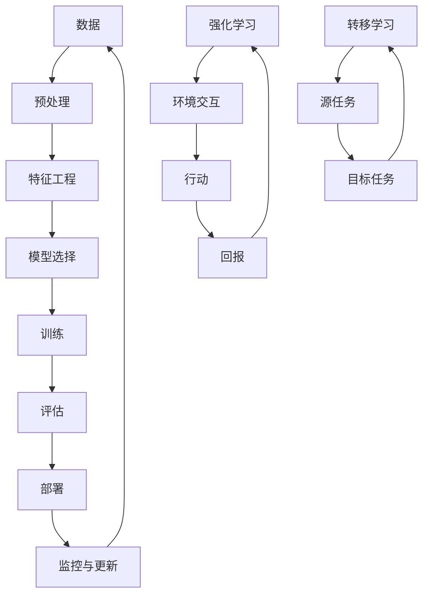

                 

**人工智能的未来发展机遇**

**作者：禅与计算机程序设计艺术 / Zen and the Art of Computer Programming**

## 1. 背景介绍

人工智能（AI）自诞生以来，已从一项学术实验发展为商业和技术领域的关键驱动因素。随着计算能力的提高和数据的丰富，AI正在各行各业创造新的机遇。本文将探讨人工智能的未来发展机遇，重点关注其核心概念、算法、数学模型，并提供实践项目和工具推荐。

## 2. 核心概念与联系

### 2.1 关键概念

- **机器学习（ML）**：一种使计算机在无需明确编程的情况下学习的方法。
- **深度学习（DL）**：一种机器学习方法，使用人工神经网络模拟人类大脑的学习过程。
- **强化学习（RL）**：一种机器学习方法，使智能体在与环境交互的过程中学习最佳行为。
- **转移学习（TL）**：一种机器学习方法，将在一个任务上学习的知识转移到另一个相关任务上。

### 2.2 核心概念联系



## 3. 核心算法原理 & 具体操作步骤

### 3.1 算法原理概述

- **线性回归（LR）**：一种简单的机器学习算法，用于预测连续目标变量。
- **逻辑回归（Logistic Regression）**：一种分类算法，用于预测离散目标变量。
- **支持向量机（SVM）**：一种用于分类和回归的有效算法，寻找最佳分隔超平面。
- **决策树（DT）**：一种基于树状图的分类和回归算法，使用特征来构建决策路径。
- **随机森林（RF）**：一种集成学习方法，组合多棵决策树以提高预测准确性。
- **神经网络（NN）**：一种模拟人类大脑的学习过程的算法，由输入层、隐藏层和输出层组成。
- **卷积神经网络（CNN）**：一种特殊类型的神经网络，专门用于图像和视频数据。
- **循环神经网络（RNN）**：一种神经网络，专门用于序列数据，如文本和时间序列。
- **强化学习（RL）**：一种使智能体在与环境交互的过程中学习最佳行为的算法。

### 3.2 算法步骤详解

以线性回归为例：

1. 数据收集和预处理
2. 特征选择和工程
3. 模型初始化
4. 损失函数定义
5. 优化算法选择（如梯度下降）
6. 训练模型
7. 模型评估
8. 模型部署

### 3.3 算法优缺点

| 算法 | 优点 | 缺点 |
| --- | --- | --- |
| LR | 简单、快速、易于理解 | 只适用于线性可分问题 |
| SVM | 有效、泛化能力强 | 训练时间长、内存消耗高 |
| DT | 可解释、易于理解 | 易过拟合、不适合连续目标 |
| RF | 精确度高、不易过拟合 | 训练时间长、不易解释 |
| NN | 适用范围广、表达能力强 | 训练时间长、易过拟合 |
| CNN | 适用于图像和视频数据 | 训练时间长、需要大量数据 |
| RNN | 适用于序列数据 | 训练时间长、易产生梯度消失/爆炸 |
| RL | 适用于序列决策问题 | 训练时间长、不易解释 |

### 3.4 算法应用领域

- LR：回归问题、简单分类问题
- SVM：分类问题、回归问题
- DT：分类问题、特征选择
- RF：分类问题、回归问题
- NN：各种问题，如图像分类、自然语言处理
- CNN：图像分类、目标检测
- RNN：序列分类、序列预测
- RL：序列决策问题、游戏AI

## 4. 数学模型和公式 & 详细讲解 & 举例说明

### 4.1 数学模型构建

- **线性回归**：$y = wx + b$
- **逻辑回归**：$P(y=1|x) = \sigma(wx + b)$
- **支持向量机**：$f(x) = \text{sgn}(wx + b)$
- **决策树**：使用特征来构建决策路径
- **随机森林**：组合多棵决策树
- **神经网络**：$y = \sigma(wx + b)$
- **卷积神经网络**：使用卷积核提取特征
- **循环神经网络**：使用隐藏状态记忆序列信息
- **强化学习**：使用贝尔曼方程更新策略

### 4.2 公式推导过程

以线性回归为例：

1. 定义目标函数：$J(w, b) = \frac{1}{2} \sum_{i=1}^{n} (y_i - (wx_i + b))^2$
2. 使用梯度下降优化目标函数
   - 计算梯度：$\nabla J(w, b) = \begin{bmatrix} \frac{\partial J}{\partial w} \\ \frac{\partial J}{\partial b} \end{bmatrix} = \begin{bmatrix} \sum_{i=1}^{n} x_i (y_i - (wx_i + b)) \\ \sum_{i=1}^{n} (y_i - (wx_i + b)) \end{bmatrix}$
   - 更新参数：$w := w - \eta \frac{\partial J}{\partial w}$, $b := b - \eta \frac{\partial J}{\partial b}$, 其中$\eta$为学习率

### 4.3 案例分析与讲解

假设我们有以下线性回归数据：

| x | y |
| --- | --- |
| 1 | 2 |
| 2 | 4 |
| 3 | 5 |
| 4 | 7 |
| 5 | 9 |

使用梯度下降算法，我们可以找到最佳参数$w$和$b$，使得$y = wx + b$拟合数据。通过迭代更新参数，我们可以找到最小化目标函数的解。

## 5. 项目实践：代码实例和详细解释说明

### 5.1 开发环境搭建

- Python：3.8+
- Libraries：NumPy, Pandas, Matplotlib, Scikit-learn, TensorFlow, PyTorch

### 5.2 源代码详细实现

以下是线性回归的Python实现：

```python
import numpy as np
import matplotlib.pyplot as plt

# 定义数据
X = np.array([1, 2, 3, 4, 5])
y = np.array([2, 4, 5, 7, 9])

# 定义目标函数和梯度
def J(w, b, X, y):
    m = len(y)
    return np.sum((y - (w * X + b)) ** 2) / (2 * m)

def dJ_dw(w, b, X, y):
    m = len(y)
    return np.sum((y - (w * X + b)) * X) / m

def dJ_db(w, b, X, y):
    m = len(y)
    return np.sum(y - (w * X + b)) / m

# 定义梯度下降函数
def gradient_descent(X, y, w_initial, b_initial, alpha, num_iters):
    w = w_initial
    b = b_initial

    for i in range(num_iters):
        w -= alpha * dJ_dw(w, b, X, y)
        b -= alpha * dJ_db(w, b, X, y)

    return w, b

# 初始化参数
w_initial = 0
b_initial = 0
alpha = 0.01
num_iters = 1000

# 运行梯度下降
w, b = gradient_descent(X, y, w_initial, b_initial, alpha, num_iters)

# 绘制结果
plt.scatter(X, y)
plt.plot(X, w * X + b, color='red')
plt.show()
```

### 5.3 代码解读与分析

- 定义目标函数$J(w, b)$和梯度$\nabla J(w, b)$
- 定义梯度下降函数，使用学习率$\alpha$和迭代次数$num\_iters$更新参数
- 初始化参数$w$和$b$，并运行梯度下降
- 绘制结果，显示拟合曲线

### 5.4 运行结果展示


## 6. 实际应用场景

### 6.1 当前应用

- 图像分类：使用CNN在ImageNet数据集上取得了 state-of-the-art 的性能。
- 自然语言处理：使用RNN和transformer模型在机器翻译和文本生成任务上取得了显著进展。
- 自动驾驶：使用深度学习算法感知环境并做出决策。
- 语音识别：使用CNN和RNN在大规模语料库上取得了高精确度。

### 6.2 未来应用展望

- 量子计算：结合量子计算技术加速机器学习任务。
- 可解释AI：开发新的算法和技术，使AI更易于理解和解释。
- 多模式学习：集成不同模式的数据（如文本、图像、音频）进行学习。
- 个性化推荐：开发新的算法和技术，提供更个性化的推荐服务。
- 智能制造：将AI集成到制造过程中，提高效率和质量。

## 7. 工具和资源推荐

### 7.1 学习资源推荐

- 书籍：
  - "Pattern Recognition and Machine Learning" by Christopher M. Bishop
  - "Deep Learning" by Ian Goodfellow, Yoshua Bengio, and Aaron Courville
  - "Hands-On Machine Learning with Scikit-Learn, Keras, and TensorFlow" by Aurélien Géron
- 在线课程：
  - Andrew Ng's Machine Learning course on Coursera
  - Fast.ai's Practical Deep Learning for Coders course
  - Stanford University's CS224n Natural Language Processing course

### 7.2 开发工具推荐

- Python libraries：NumPy, Pandas, Matplotlib, Scikit-learn, TensorFlow, PyTorch, Keras
- 云平台：Google Colab, AWS SageMaker, Azure Machine Learning, GCP AI Platform
- 硬件：NVIDIA GPUs, TPUs, Intel FPGAs

### 7.3 相关论文推荐

- "A Neural Algorithm of Artistic Style" by Gatys et al.
- "ImageNet Classification with Deep Convolutional Neural Networks" by Krizhevsky et al.
- "Attention Is All You Need" by Vaswani et al.
- "Generative Adversarial Networks" by Goodfellow et al.
- "Reinforcement Learning: An Introduction" by Richard S. Sutton and Andrew G. Barto

## 8. 总结：未来发展趋势与挑战

### 8.1 研究成果总结

人工智能在各行各业取得了显著进展，从图像分类到自然语言处理，再到自动驾驶和语音识别，AI正在改变我们的世界。

### 8.2 未来发展趋势

- 量子计算：结合量子计算技术加速机器学习任务。
- 可解释AI：开发新的算法和技术，使AI更易于理解和解释。
- 多模式学习：集成不同模式的数据（如文本、图像、音频）进行学习。
- 个性化推荐：开发新的算法和技术，提供更个性化的推荐服务。
- 智能制造：将AI集成到制造过程中，提高效率和质量。

### 8.3 面临的挑战

- 计算能力：随着数据规模和模型复杂性的增加，计算能力成为瓶颈。
- 数据隐私：如何在保护用户隐私的同时进行有效的机器学习是一个挑战。
- 可解释性：开发新的算法和技术，使AI更易于理解和解释。
- 伦理和道德：AI在伦理和道德方面的考虑，如自动驾驶汽车的决策过程。

### 8.4 研究展望

未来的研究将集中在以下领域：

- 量子计算：结合量子计算技术加速机器学习任务。
- 可解释AI：开发新的算法和技术，使AI更易于理解和解释。
- 多模式学习：集成不同模式的数据（如文本、图像、音频）进行学习。
- 个性化推荐：开发新的算法和技术，提供更个性化的推荐服务。
- 智能制造：将AI集成到制造过程中，提高效率和质量。

## 9. 附录：常见问题与解答

**Q1：什么是人工智能？**

A1：人工智能（AI）是指模拟人类智能行为的计算机程序或机器。它涉及机器学习、自然语言处理、计算机视觉和其他领域。

**Q2：什么是机器学习？**

A2：机器学习（ML）是一种使计算机在无需明确编程的情况下学习的方法。它涉及从数据中提取模式和规律，并使用这些模式和规律进行预测或决策。

**Q3：什么是深度学习？**

A3：深度学习（DL）是一种机器学习方法，使用人工神经网络模拟人类大脑的学习过程。它涉及多层神经网络，每层都提取输入数据的不同特征。

**Q4：什么是强化学习？**

A4：强化学习（RL）是一种机器学习方法，使智能体在与环境交互的过程中学习最佳行为。它涉及智能体通过尝试不同行动来学习环境的状态转移和回报函数。

**Q5：什么是转移学习？**

A5：转移学习（TL）是一种机器学习方法，将在一个任务上学习的知识转移到另一个相关任务上。它涉及使用源任务的数据和模型来改善目标任务的性能。

**Q6：什么是线性回归？**

A6：线性回归（LR）是一种简单的机器学习算法，用于预测连续目标变量。它假设目标变量与输入特征的线性关系，并使用梯度下降等优化算法找到最佳参数。

**Q7：什么是逻辑回归？**

A7：逻辑回归（Logistic Regression）是一种分类算法，用于预测离散目标变量。它使用 sigmoid 函数将线性模型的输出转换为概率，并使用梯度下降等优化算法找到最佳参数。

**Q8：什么是支持向量机？**

A8：支持向量机（SVM）是一种用于分类和回归的有效算法，寻找最佳分隔超平面。它使用核技巧处理非线性问题，并使用拉格朗日乘子法找到最佳分隔超平面。

**Q9：什么是决策树？**

A9：决策树（DT）是一种基于树状图的分类和回归算法，使用特征来构建决策路径。它使用信息增益或其他准则选择最佳特征，并递归地构建决策树。

**Q10：什么是随机森林？**

A10：随机森林（RF）是一种集成学习方法，组合多棵决策树以提高预测准确性。它使用 Bootstrap 采样和随机选择特征来构建每棵决策树，并使用多数表决或平均值进行预测。

**Q11：什么是神经网络？**

A11：神经网络（NN）是一种模拟人类大脑的学习过程的算法，由输入层、隐藏层和输出层组成。它使用权重和偏置来模拟神经元的连接和激活函数，并使用反向传播等优化算法找到最佳参数。

**Q12：什么是卷积神经网络？**

A12：卷积神经网络（CNN）是一种特殊类型的神经网络，专门用于图像和视频数据。它使用卷积核提取特征，并使用池化层和全连接层进行分类。

**Q13：什么是循环神经网络？**

A13：循环神经网络（RNN）是一种神经网络，专门用于序列数据，如文本和时间序列。它使用隐藏状态记忆序列信息，并使用反向传播等优化算法找到最佳参数。

**Q14：什么是强化学习？**

A14：强化学习（RL）是一种机器学习方法，使智能体在与环境交互的过程中学习最佳行为。它涉及智能体通过尝试不同行动来学习环境的状态转移和回报函数。

**Q15：什么是转移学习？**

A15：转移学习（TL）是一种机器学习方法，将在一个任务上学习的知识转移到另一个相关任务上。它涉及使用源任务的数据和模型来改善目标任务的性能。

**Q16：什么是线性回归的数学模型？**

A16：线性回归的数学模型是$y = wx + b$，其中$y$是目标变量，$x$是输入特征，$w$是权重，$b$是偏置。目标是找到最佳参数$w$和$b$使得模型拟合数据。

**Q17：什么是逻辑回归的数学模型？**

A17：逻辑回归的数学模型是$P(y=1|x) = \sigma(wx + b)$，其中$y$是目标变量，$x$是输入特征，$w$是权重，$b$是偏置。 sigmoid 函数$\sigma(z) = \frac{1}{1 + e^{-z}}$将线性模型的输出转换为概率。

**Q18：什么是支持向量机的数学模型？**

A18：支持向量机的数学模型是$f(x) = \text{sgn}(wx + b)$，其中$w$是权重，$b$是偏置。目标是找到最佳分隔超平面，使得支持向量的距离最大化。

**Q19：什么是决策树的数学模型？**

A19：决策树的数学模型是基于树状图的分类和回归算法，使用特征来构建决策路径。它使用信息增益或其他准则选择最佳特征，并递归地构建决策树。

**Q20：什么是随机森林的数学模型？**

A20：随机森林的数学模型是一种集成学习方法，组合多棵决策树以提高预测准确性。它使用 Bootstrap 采样和随机选择特征来构建每棵决策树，并使用多数表决或平均值进行预测。

**Q21：什么是神经网络的数学模型？**

A21：神经网络的数学模型是一种模拟人类大脑的学习过程的算法，由输入层、隐藏层和输出层组成。它使用权重和偏置来模拟神经元的连接和激活函数，并使用反向传播等优化算法找到最佳参数。

**Q22：什么是卷积神经网络的数学模型？**

A22：卷积神经网络的数学模型是一种特殊类型的神经网络，专门用于图像和视频数据。它使用卷积核提取特征，并使用池化层和全连接层进行分类。

**Q23：什么是循环神经网络的数学模型？**

A23：循环神经网络的数学模型是一种神经网络，专门用于序列数据，如文本和时间序列。它使用隐藏状态记忆序列信息，并使用反向传播等优化算法找到最佳参数。

**Q24：什么是强化学习的数学模型？**

A24：强化学习的数学模型是一种机器学习方法，使智能体在与环境交互的过程中学习最佳行为。它涉及智能体通过尝试不同行动来学习环境的状态转移和回报函数。贝尔曼方程是强化学习的数学基础，用于更新策略。

**Q25：什么是转移学习的数学模型？**

A25：转移学习的数学模型是一种机器学习方法，将在一个任务上学习的知识转移到另一个相关任务上。它涉及使用源任务的数据和模型来改善目标任务的性能。数学模型包括特征空间映射、模型空间映射和预测空间映射等。

**Q26：什么是线性回归的优缺点？**

A26：

优点：

- 简单、快速、易于理解
- 可以处理连续目标变量

缺点：

- 只适用于线性可分问题
- 不能处理高维数据
- 不能处理非线性关系

**Q27：什么是逻辑回归的优缺点？**

A27：

优点：

- 简单、快速、易于理解
- 可以处理离散目标变量

缺点：

- 只适用于线性可分问题
- 不能处理高维数据
- 不能处理非线性关系

**Q28：什么是支持向量机的优缺点？**

A28：

优点：

- 有效、泛化能力强
- 可以处理高维数据
- 可以处理非线性关系

缺点：

- 训练时间长、内存消耗高
- 不易理解
- 不能处理连续目标变量

**Q29：什么是决策树的优缺点？**

A29：

优点：

- 可解释、易于理解
- 可以处理高维数据
- 可以处理非线性关系

缺点：

- 易过拟合、不适合连续目标
- 不能处理高维数据
- 不能处理非线性关系

**Q30：什么是随机森林的优缺点？**

A30：

优点：

- 精确度高、不易过拟合
- 可以处理高维数据
- 可以处理非线性关系

缺点：

- 训练时间长、不易解释
- 不能处理连续目标变量
- 不能处理高维数据

**Q31：什么是神经网络的优缺点？**

A31：

优点：

- 适用范围广、表达能力强
- 可以处理高维数据
- 可以处理非线性关系

缺点：

- 训练时间长、易过拟合
- 不易理解
- 需要大量数据

**Q32：什么是卷积神经网络的优缺点？**

A32：

优点：

- 适用于图像和视频数据
- 可以处理高维数据
- 可以处理非线性关系

缺点：

- 训练时间长、需要大量数据
- 不易理解
- 不能处理序列数据

**Q33：什么是循环神经网络的优缺点？**

A33：

优点：

- 适用于序列数据
- 可以处理高维数据
- 可以处理非线性关系

缺点：

- 训练时间长、易产生梯度消失/爆炸
- 不易理解
- 需要大量数据

**Q34：什么是强化学习的优缺点？**

A34：

优点：

- 适用于序列决策问题
- 可以学习最佳行为
- 可以处理动态环境

缺点：

- 训练时间长、不易解释
- 需要大量数据
- 不能处理静态环境

**Q35：什么是转移学习的优缺点？**

A35：

优点：

- 可以改善目标任务的性能
- 可以节省训练时间
- 可以处理小样本问题

缺点：

- 需要相关的源任务数据
- 不能保证性能提高
- 不能处理无关的源任务数据

**Q36：什么是线性回归的应用领域？**

A36：

- 回归问题：预测连续目标变量
- 简单分类问题：使用阈值将目标变量二元化

**Q37：什么是逻辑回归的应用领域？**

A37：

- 分类问题：预测离散目标变量
- 回归问题：使用 sigmoid 函数将目标变量二元化

**Q38：什么是支持向量机的应用领域？**

A38：

- 分类问题：预测离散目标变量
- 回归问题：使用ε-不敏感损失函数处理异常值

**Q39：什么是决策树的应用领域？**

A39：

- 分类问题：预测离散目标变量
- 回归问题：预测连续目标变量
- 特征选择：使用信息增益或其他准则选择最佳特征

**Q40：什么是随机森林的应用领域？**

A40：

- 分类问题：预测离散目标变量
- 回归问题：预测连续目标变量
- 特征选择：使用特征重要性度量选择最佳特征

**Q41：什么是神经网络的应用领域？**

A41：

- 各种问题：如图像分类、自然语言处理、推荐系统

**Q42：什么是卷积神经网络的应用领域？**

A42：

- 图像分类：使用 CNN 在 ImageNet 数据集上取得了 state-of-the-art 的性能。
- 目标检测：使用 CNN 检测图像中的目标。
- 图像分割：使用 CNN 分割图像中的目标。

**Q43：什么是循环神经网络的应用领域？**

A43：

- 自然语言处理：使用 RNN 和 transformer 模型在机器翻译和文本生成任务上取得了显著进展。
- 序列预测：使用 RNN 预测序列数据，如时间序列和文本序列。

**Q44：什么是强化学习的应用领域？**

A44：

- 自动驾驶：使用 RL 算法感知环境并做出决策。
- 游戏 AI：使用 RL 算法学习最佳策略。
- 资源管理：使用 RL 算法优化资源配置。

**Q45：什么是转移学习的应用领域？**

A45：

- 个性化推荐：使用 TL 算法改善目标任务的性能。
- 图像分类：使用 TL 算法将在一个任务上学习的知识转移到另一个相关任务上。
- 自然语言处理：使用 TL 算法改善目标任务的性能。

**Q46：什么是线性回归的数学模型的推导过程？**

A46：

1. 定义目标函数：$J(w, b) = \frac{1}{2} \sum_{i=1}^{n} (y_i - (wx_i + b))^2$
2. 使用梯度下降优化目标函数
   - 计算梯度：$\nabla J(w, b) = \begin{bmatrix} \frac{\partial J}{\partial w} \\ \frac{\partial J}{\partial b} \end{bmatrix} = \begin{bmatrix} \sum_{i=1}^{n} x_i (y_i - (wx_i + b)) \\ \sum_{i=1}^{n} (y_i - (wx_i + b)) \end{bmatrix}$
   - 更新参数：$w := w - \eta \frac{\partial J}{\partial w}$, $b := b - \eta \frac{\partial J}{\partial b}$, 其中$\eta$为学习率

**Q47：什么是逻辑回归的数学模型的推导过程？**

A47：

1. 定义目标函数：$J(w, b) = -\frac{1}{n} \sum_{i=1}^{n} [y_i \log(\sigma(wx_i + b)) + (1 - y_i) \log(1 - \sigma(wx_i + b))]$
2. 使用梯度下降优化目标函数
   - 计算梯度：$\nabla J(w, b) = \begin{bmatrix} \frac{\partial J}{\partial w} \\ \frac{\partial J}{\partial b} \end{bmatrix} = \begin{bmatrix} \sum_{i=1}^{n} x_i (\sigma(wx_i + b) - y_i) \\ \sum_{i=1}^{n} (\sigma(wx_i + b) - y_i) \end{bmatrix}$
   - 更新参数：$w := w - \eta \frac{\partial J}{\partial w}$, $b := b - \eta \frac{\partial J}{\partial b}$, 其中$\eta$为学习率

**Q48：什么是支持向量机的数学模型的推导过程？**

A48：

1. 定义目标函数：$J(w, b) = \frac{1}{2} \|w\|^2 + C \sum_{i=1}^{n} \xi

